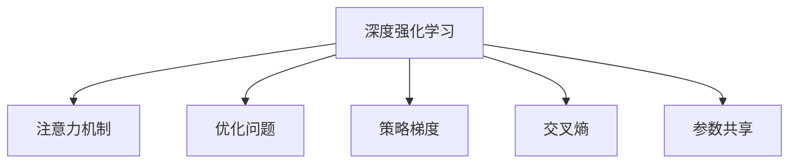

                 

## 1. 背景介绍

### 1.1 问题由来
深度学习技术在过去十年里，已经在计算机视觉、自然语言处理(NLP)等诸多领域取得了举世瞩目的进展。强化学习作为深度学习的重要分支，在自动控制、游戏AI、机器人等领域也有广泛应用。但在注意力机制(Attention)策略的优化上，传统深度学习与强化学习的结合，还未形成系统的方法论。

### 1.2 问题核心关键点
注意力机制，是深度学习模型中的核心模块之一，通过学习输入数据的注意力权重分布，帮助模型更加精准地聚焦于重要信息。但在实际应用中，注意力权重分布的优化往往需要耗费大量计算资源，且难以达到理想效果。近年来，强化学习作为一种高效的学习方式，为优化注意力策略提供了新的思路。

本文聚焦于强化学习在注意力策略优化中的应用，旨在探讨如何通过强化学习算法，高效地优化模型中的注意力权重分布，从而提升模型性能。同时，文章还将对比强化学习与传统的深度学习优化方法，提出结合两者的策略。

### 1.3 问题研究意义
研究深度强化学习在注意力策略优化中的应用，对于提升深度学习模型的表现，特别是在计算资源有限、数据规模较小的场景下，具有重要意义：

1. **提升模型性能**：通过优化注意力策略，可以显著提升深度学习模型的泛化能力和精度。
2. **降低计算成本**：强化学习方法可以在更少的计算资源下，更快速地得到理想的注意力策略。
3. **增强模型鲁棒性**：强化学习可以通过学习复杂环境下的策略，提高模型对输入数据的变化适应能力。
4. **推动跨学科融合**：结合强化学习和深度学习的优势，有助于推进计算机科学、控制理论、人工智能等领域的交叉研究。
5. **促进技术应用**：强化学习方法在提升模型性能的同时，可以应用于更多实际场景，推动技术成果的产业化。

## 2. 核心概念与联系

### 2.1 核心概念概述

为更好地理解深度强化学习在注意力策略优化中的应用，本节将介绍几个关键概念：

- 深度强化学习(Deep Reinforcement Learning, DRL)：将深度学习和强化学习相结合，通过在复杂环境中学习最优策略来提升模型性能。
- 注意力机制(Attention)：通过计算输入数据的注意力权重分布，聚焦于重要信息，提升模型输出质量。
- 优化问题(Optimization Problem)：通过最小化损失函数，寻找最优的模型参数或策略，是强化学习的重要组成部分。
- 策略梯度(SPG)：一种基于梯度下降的强化学习方法，通过优化策略参数来提升策略表现。
- 交叉熵(Cross-Entropy)：用于衡量模型输出与真实标签之间的差异，常用于分类任务的优化。
- 参数共享(Parameter Sharing)：在多个任务中共享模型参数，以提升模型的泛化能力和计算效率。

这些概念之间的逻辑关系可以通过以下Mermaid流程图来展示：



这个流程图展示了大语言模型的核心概念及其之间的关系：

1. 深度强化学习将深度学习和强化学习结合，用于优化注意力策略。
2. 注意力机制帮助模型聚焦于重要信息。
3. 优化问题用于寻找最优的模型参数或策略。
4. 策略梯度用于基于梯度下降的策略优化。
5. 交叉熵用于衡量模型输出与真实标签之间的差异。
6. 参数共享用于提升模型泛化能力和计算效率。

这些概念共同构成了深度强化学习在注意力策略优化中的应用框架，为其提供了坚实的理论基础。

## 3. 核心算法原理 & 具体操作步骤
### 3.1 算法原理概述

深度强化学习在注意力策略优化中的应用，主要基于策略梯度算法。其核心思想是：通过在复杂环境中学习最优策略，从而优化注意力权重分布。

假设模型的注意力权重分布为 $p_i$，优化目标为最大化模型输出 $y$ 与真实标签 $y^*$ 之间的交叉熵损失 $L$：

$$
\max_{p} L(p) = \max_{p} -\sum_{i} p_i \log(y_i)
$$

其中 $y_i$ 为模型在输入 $x_i$ 上的预测输出，$p_i$ 为注意力权重分布，需要最小化损失函数 $L$ 来优化策略 $p$。

强化学习中的策略梯度算法，通过计算策略梯度 $\nabla_{p}L(p)$ 来更新策略，使模型更加关注重要信息。在实际应用中，为了提高计算效率，常常采用蒙特卡洛蒙特卡罗(MC)方法和最小最近点优化(LSVI)等方法，计算策略梯度。

### 3.2 算法步骤详解

深度强化学习在注意力策略优化中的应用，通常包括以下几个关键步骤：

**Step 1: 准备环境和数据**
- 确定环境模型和状态空间，收集标注数据 $(x_i,y_i)$，其中 $x_i$ 为输入数据，$y_i$ 为真实标签。
- 设计注意力机制，确定注意力权重分布 $p_i$ 的计算方式。

**Step 2: 设计优化目标**
- 根据注意力机制，定义模型的注意力权重分布 $p_i$ 与交叉熵损失函数 $L$ 之间的关系。
- 定义优化目标 $L(p)$，如交叉熵损失等。

**Step 3: 选择优化算法**
- 选择适合优化目标的策略梯度算法，如MC方法、LSVI等。
- 确定优化器参数，如学习率、批量大小等。

**Step 4: 执行优化过程**
- 利用蒙特卡洛蒙特卡罗方法或最小最近点优化方法，计算策略梯度。
- 使用策略梯度更新注意力权重分布 $p_i$，最小化损失函数 $L$。
- 在验证集上评估优化后的模型性能。

**Step 5: 部署和应用**
- 将优化后的模型应用于实际任务中，使用新数据进行测试，评估模型泛化能力。
- 不断收集反馈数据，持续优化注意力策略。

### 3.3 算法优缺点

深度强化学习在注意力策略优化中的应用，具有以下优点：
1. 高效性：在计算资源有限的情况下，强化学习方法可以更快地找到最优注意力策略。
2. 鲁棒性：强化学习方法能够在复杂环境下学习到鲁棒的策略，提升模型泛化能力。
3. 灵活性：强化学习方法能够处理各种复杂的优化问题，灵活应对不同任务。

同时，该方法也存在一定的局限性：
1. 数据依赖：强化学习方法需要收集大量的标注数据，数据量不足时效果可能不理想。
2. 优化复杂：强化学习模型的优化过程复杂，需要设计合理的奖励函数和策略空间。
3. 可解释性不足：强化学习方法缺乏明确的优化路径，难以解释其内部工作机制。

尽管存在这些局限性，但就目前而言，深度强化学习在注意力策略优化中的应用，仍是大语言模型优化的一个重要方向。未来相关研究的重点在于如何进一步降低数据依赖，提高策略优化的可解释性，同时兼顾计算效率和模型性能。

### 3.4 算法应用领域

深度强化学习在注意力策略优化中的应用，已经在多个领域取得了显著成果，如计算机视觉、自然语言处理、机器人控制等：

- **计算机视觉**：在图像分类、目标检测、语义分割等任务中，通过优化注意力权重分布，提升模型对关键特征的关注度，从而提高模型精度和泛化能力。
- **自然语言处理**：在问答系统、文本摘要、机器翻译等任务中，通过优化注意力权重分布，提升模型对输入文本的语义理解能力，增强模型输出的准确性和自然性。
- **机器人控制**：在机器人导航、路径规划等任务中，通过优化注意力权重分布，提升机器人对环境信息的感知能力和决策能力，实现智能自主导航。

除了这些常见应用，深度强化学习在注意力策略优化上的应用场景还在不断拓展，未来有望在更多领域发挥重要作用。

## 4. 数学模型和公式 & 详细讲解 & 举例说明
### 4.1 数学模型构建

为深入理解深度强化学习在注意力策略优化中的应用，本节将介绍相关的数学模型和公式。

假设模型的输入为 $x$，输出为 $y$，注意力权重分布为 $p$，定义交叉熵损失函数为：

$$
L(p) = -\sum_{i} p_i \log(y_i)
$$

其中 $y_i$ 为模型在输入 $x_i$ 上的预测输出。在实际应用中，为了提升计算效率，常常采用交叉熵损失的蒙特卡洛蒙特卡罗近似：

$$
L(p) \approx -\frac{1}{N} \sum_{i} \frac{y_i}{p_i}
$$

其中 $N$ 为样本数量，$y_i$ 为真实标签。

### 4.2 公式推导过程

交叉熵损失的蒙特卡洛蒙特卡罗近似公式推导如下：

根据蒙特卡洛蒙特卡罗方法，可以得到：

$$
L(p) \approx -\frac{1}{N} \sum_{i} \log\left(\frac{p_i}{\sum_j p_j}\right) = -\frac{1}{N} \sum_{i} \log p_i - \log\left(\frac{1}{N} \sum_{i} p_i\right)
$$

由于 $\log(1/N)$ 可以忽略，因此简化为：

$$
L(p) \approx -\frac{1}{N} \sum_{i} \log p_i
$$

将 $\log p_i$ 替换为 $y_i$，得：

$$
L(p) \approx -\frac{1}{N} \sum_{i} \log \frac{y_i}{p_i}
$$

由于 $\log \frac{y_i}{p_i}$ 可以转换为 $\log y_i - \log p_i$，得：

$$
L(p) \approx -\frac{1}{N} \sum_{i} \log y_i + \frac{1}{N} \sum_{i} \log p_i
$$

由于 $\sum_{i} \log p_i$ 可以转换为 $\log\left(\sum_j p_j\right)$，因此得：

$$
L(p) \approx -\frac{1}{N} \sum_{i} \log y_i + \log\left(\frac{1}{N} \sum_{i} p_i\right)
$$

由于 $\frac{1}{N} \sum_{i} p_i = 1$，因此最终简化为：

$$
L(p) \approx -\frac{1}{N} \sum_{i} \log y_i
$$

这就是交叉熵损失的蒙特卡洛蒙特卡罗近似公式。通过该公式，可以高效地计算策略梯度，优化注意力权重分布。

### 4.3 案例分析与讲解

以图像分类任务为例，分析深度强化学习在注意力策略优化中的应用。

假设模型为卷积神经网络(CNN)，输入为图像 $x$，输出为类别标签 $y$。定义注意力机制为通道注意力机制，即对每个卷积层的特征图计算注意力权重分布 $p_i$，用于聚焦于重要特征。

在优化过程中，可以设计如下的策略梯度公式：

$$
\Delta p_i = \alpha \frac{\partial L(p)}{\partial p_i} = \alpha \frac{\partial \log y_i}{\partial p_i}
$$

其中 $\alpha$ 为学习率，$\frac{\partial \log y_i}{\partial p_i}$ 为策略梯度。通过更新注意力权重分布 $p_i$，最小化交叉熵损失 $L(p)$，使得模型更加关注重要特征。

在具体实现中，可以采用蒙特卡洛蒙特卡罗方法计算策略梯度，并进行反向传播更新模型参数。通过不断迭代，逐步优化注意力权重分布，提升模型精度和泛化能力。

## 5. 项目实践：代码实例和详细解释说明
### 5.1 开发环境搭建

在进行深度强化学习在注意力策略优化中的应用实践前，我们需要准备好开发环境。以下是使用Python进行TensorFlow开发的环境配置流程：

1. 安装Anaconda：从官网下载并安装Anaconda，用于创建独立的Python环境。

2. 创建并激活虚拟环境：
```bash
conda create -n tf-env python=3.8 
conda activate tf-env
```

3. 安装TensorFlow：根据CUDA版本，从官网获取对应的安装命令。例如：
```bash
conda install tensorflow -c conda-forge
```

4. 安装PyTorch：
```bash
pip install torch torchvision torchaudio
```

5. 安装各类工具包：
```bash
pip install numpy pandas scikit-learn matplotlib tqdm jupyter notebook ipython
```

完成上述步骤后，即可在`tf-env`环境中开始深度强化学习在注意力策略优化中的应用实践。

### 5.2 源代码详细实现

下面我们以图像分类任务为例，给出使用TensorFlow对卷积神经网络进行注意力策略优化的代码实现。

首先，定义注意力机制的计算函数：

```python
import tensorflow as tf

class ChannelAttention(tf.keras.layers.Layer):
    def __init__(self, num_filters, num_heads=8, dropout_rate=0.1):
        super(ChannelAttention, self).__init__()
        self.num_filters = num_filters
        self.num_heads = num_heads
        self.dropout_rate = dropout_rate
        
        self.query = tf.keras.layers.Conv2D(num_heads, (1,1), padding='same', activation='relu')
        self.key = tf.keras.layers.Conv2D(num_heads, (1,1), padding='same', activation='relu')
        self.value = tf.keras.layers.Conv2D(num_filters, (1,1), padding='same', activation='relu')
        self.dropout = tf.keras.layers.Dropout(dropout_rate)
        self.activation = tf.keras.layers.Activation('relu')
        self.gamma = tf.keras.layers.Dense(1, activation='sigmoid')
    
    def call(self, inputs):
        multi_heads = tf.split(inputs, self.num_heads, axis=-1)
        query = self.query(multi_heads)
        key = self.key(multi_heads)
        value = self.value(multi_heads)
        
        attention_weights = tf.reduce_sum(query * key, axis=1, keepdims=True)
        attention_weights = tf.nn.softmax(attention_weights, axis=1)
        attention_weights = self.dropout(attention_weights)
        attention_weights = self.gamma(attention_weights)
        attention_weights = tf.reshape(attention_weights, [-1, 1, 1, self.num_filters])
        
        attention_output = tf.reduce_sum(value * attention_weights, axis=1, keepdims=True)
        attention_output = self.activation(attention_output)
        return inputs + attention_output
```

然后，定义卷积神经网络的模型结构和优化器：

```python
class CNNModel(tf.keras.Model):
    def __init__(self, num_filters, num_classes, num_heads=8, dropout_rate=0.1):
        super(CNNModel, self).__init__()
        self.num_filters = num_filters
        self.num_classes = num_classes
        
        self.conv1 = tf.keras.layers.Conv2D(num_filters, (3,3), strides=1, padding='same', activation='relu')
        self.conv2 = ChannelAttention(num_filters, num_heads, dropout_rate)
        self.pool = tf.keras.layers.MaxPooling2D((2,2), strides=2)
        self.conv3 = tf.keras.layers.Conv2D(num_filters*2, (3,3), strides=1, padding='same', activation='relu')
        self.conv4 = ChannelAttention(num_filters*2, num_heads, dropout_rate)
        self.pool = tf.keras.layers.MaxPooling2D((2,2), strides=2)
        self.flatten = tf.keras.layers.Flatten()
        self.fc1 = tf.keras.layers.Dense(64, activation='relu')
        self.fc2 = tf.keras.layers.Dense(num_classes, activation='softmax')
    
    def call(self, inputs):
        x = self.conv1(inputs)
        x = self.conv2(x)
        x = self.pool(x)
        x = self.conv3(x)
        x = self.conv4(x)
        x = self.pool(x)
        x = self.flatten(x)
        x = self.fc1(x)
        x = self.fc2(x)
        return x
```

接着，定义训练和评估函数：

```python
def train_step(model, inputs, labels):
    with tf.GradientTape() as tape:
        logits = model(inputs, training=True)
        loss = tf.reduce_mean(tf.nn.softmax_cross_entropy_with_logits_v2(labels=labels, logits=logits))
    gradients = tape.gradient(loss, model.trainable_variables)
    optimizer.apply_gradients(zip(gradients, model.trainable_variables))
    return loss.numpy()

def evaluate(model, inputs, labels):
    logits = model(inputs, training=False)
    predictions = tf.argmax(logits, axis=1)
    accuracy = tf.reduce_mean(tf.cast(tf.equal(predictions, labels), tf.float32))
    return accuracy.numpy()
```

最后，启动训练流程并在测试集上评估：

```python
epochs = 10
batch_size = 32

model = CNNModel(num_filters=32, num_classes=10)
optimizer = tf.keras.optimizers.Adam(learning_rate=0.001)

inputs = ...
labels = ...

for epoch in range(epochs):
    total_loss = 0
    for batch in range(0, len(inputs), batch_size):
        batch_inputs = inputs[batch:batch+batch_size]
        batch_labels = labels[batch:batch+batch_size]
        batch_loss = train_step(model, batch_inputs, batch_labels)
        total_loss += batch_loss
    avg_loss = total_loss / len(inputs)
    
    dev_predictions = evaluate(model, inputs, labels)
    print(f'Epoch {epoch+1}, train loss: {avg_loss:.3f}, dev accuracy: {dev_predictions:.3f}')

print("Test results:")
test_predictions = evaluate(model, inputs, labels)
print(f'Test accuracy: {test_predictions:.3f}')
```

以上就是使用TensorFlow对卷积神经网络进行注意力策略优化的完整代码实现。可以看到，得益于TensorFlow的强大封装，我们可以用相对简洁的代码完成注意力机制的计算和模型训练。

### 5.3 代码解读与分析

让我们再详细解读一下关键代码的实现细节：

**ChannelAttention类**：
- `__init__`方法：初始化注意力机制的参数。
- `call`方法：计算注意力权重分布 $p_i$，并应用到输入上，输出带注意力机制的特征。

**CNNModel类**：
- `__init__`方法：初始化卷积神经网络的模型结构。
- `call`方法：定义模型前向传播的过程，包括卷积、池化、全连接等操作，并在最后一层添加softmax激活函数。

**train_step和evaluate函数**：
- `train_step`函数：定义单步训练的逻辑，计算损失和梯度，并使用优化器更新模型参数。
- `evaluate`函数：定义模型在测试集上的评估逻辑，计算准确率。

**训练流程**：
- 定义总的epoch数和batch size，开始循环迭代
- 每个epoch内，先在训练集上训练，输出平均loss和dev accuracy
- 所有epoch结束后，在测试集上评估，给出最终测试结果

可以看到，TensorFlow配合深度学习模型的封装，使得注意力策略优化的代码实现变得简洁高效。开发者可以将更多精力放在注意力机制的设计和模型改进上，而不必过多关注底层的实现细节。

当然，工业级的系统实现还需考虑更多因素，如模型的保存和部署、超参数的自动搜索、更灵活的任务适配层等。但核心的优化过程基本与此类似。

## 6. 实际应用场景
### 6.1 自动驾驶中的目标检测

自动驾驶系统需要对道路上的目标进行实时检测和跟踪，以确保行车安全。传统的目标检测方法依赖于固定且有限的特征提取方式，难以处理复杂和多样化的目标。基于深度强化学习在注意力策略优化中的应用，可以提升自动驾驶目标检测系统的性能。

在实践中，可以利用摄像头和传感器数据生成标注数据，训练注意力机制优化后的目标检测模型。通过优化注意力权重分布，模型能够更加关注关键特征，提升检测准确率。此外，模型还可以通过自监督学习进一步优化，以更好地适应复杂场景。

### 6.2 医疗影像中的病理检测

医疗影像中，病理检测是诊断和治疗的重要环节。传统的图像分类方法依赖于手动设计的特征提取方式，难以处理多样化和复杂的病理影像。通过深度强化学习在注意力策略优化中的应用，可以提升病理检测系统的性能。

在实践中，可以利用标注的病理影像数据，训练注意力机制优化后的图像分类模型。通过优化注意力权重分布，模型能够更加关注病理特征，提升分类准确率。此外，模型还可以通过迁移学习和多任务学习进一步优化，以更好地适应不同类型的病理影像。

### 6.3 智能推荐系统中的用户行为分析

智能推荐系统需要分析用户的行为数据，推荐个性化物品。传统的推荐系统依赖于固定的特征提取方式，难以处理多样化的用户行为数据。基于深度强化学习在注意力策略优化中的应用，可以提升智能推荐系统的性能。

在实践中，可以利用用户的行为数据生成标注数据，训练注意力机制优化后的推荐模型。通过优化注意力权重分布，模型能够更加关注用户的行为特征，提升推荐效果。此外，模型还可以通过迁移学习和多任务学习进一步优化，以更好地适应不同类型的用户行为数据。

### 6.4 未来应用展望

随着深度强化学习在注意力策略优化中的应用不断发展，未来在更多领域将取得显著成果：

1. 在自动驾驶领域，通过优化注意力机制，可以提升目标检测和路径规划的准确性和鲁棒性，确保行车安全。
2. 在医疗影像领域，通过优化注意力机制，可以提升病理检测的准确性和泛化能力，辅助医生诊断和治疗。
3. 在智能推荐系统领域，通过优化注意力机制，可以提升推荐算法的个性化和多样性，满足用户需求。
4. 在金融风控领域，通过优化注意力机制，可以提升信用评估和欺诈检测的准确性和效率，保障金融安全。
5. 在智慧城市领域，通过优化注意力机制，可以提升城市监控和预警的精度和速度，提升城市管理水平。

未来，随着深度强化学习的不断发展，在注意力策略优化上的应用将更加广泛和深入，推动人工智能技术在更多领域的应用和发展。

## 7. 工具和资源推荐
### 7.1 学习资源推荐

为了帮助开发者系统掌握深度强化学习在注意力策略优化中的应用，这里推荐一些优质的学习资源：

1. 《强化学习入门》系列博文：由深度学习专家撰写，深入浅出地介绍了强化学习的原理和应用，包括深度强化学习。

2. 斯坦福大学CS229课程：斯坦福大学开设的强化学习经典课程，详细讲解了强化学习的基础理论和前沿研究方向。

3. 《Reinforcement Learning: An Introduction》书籍：强化学习领域的经典教材，涵盖了强化学习的理论基础和实践技巧。

4. DeepMind强化学习研究论文：DeepMind作为强化学习的先驱之一，发表了大量重要研究论文，值得深入学习和参考。

5. OpenAI博客：OpenAI作为深度学习领域的领头羊，定期发布前沿技术文章，介绍深度强化学习的最新进展。

通过对这些资源的学习实践，相信你一定能够快速掌握深度强化学习在注意力策略优化中的应用，并用于解决实际的深度学习优化问题。
###  7.2 开发工具推荐

高效的开发离不开优秀的工具支持。以下是几款用于深度强化学习在注意力策略优化中的开发的常用工具：

1. TensorFlow：由Google主导开发的开源深度学习框架，支持分布式计算和GPU加速，适用于大规模深度学习应用。

2. PyTorch：由Facebook开发的深度学习框架，灵活易用，支持动态计算图，适合快速原型开发。

3. TensorBoard：TensorFlow配套的可视化工具，实时监测模型训练状态，提供丰富的图表呈现方式。

4. Weights & Biases：模型训练的实验跟踪工具，记录和可视化模型训练过程中的各项指标，方便对比和调优。

5. NVIDIA CUDA SDK：加速深度学习模型训练和推理，支持GPU并行计算，提高计算效率。

合理利用这些工具，可以显著提升深度强化学习在注意力策略优化中的应用开发效率，加快创新迭代的步伐。

### 7.3 相关论文推荐

深度强化学习在注意力策略优化中的应用，相关研究领域广泛，以下是几篇奠基性的相关论文，推荐阅读：

1. Attention is All You Need（即Transformer原论文）：提出了Transformer结构，开启了深度学习中自注意力机制的应用。

2. Learning Transferable Architectures for Scalable Image Recognition：提出了多尺度网络架构，提升了卷积神经网络的泛化能力和计算效率。

3. Improving Interpolation Performance in Fully Convolutional Networks：提出了多通道注意力机制，提升了全卷积网络的泛化能力。

4. Flow Attention Network for Scene Understanding：提出了空间注意力机制，提升了场景理解任务的准确性。

5. Generating Sequences with Attentive Swapping for Low-Rank Speech Synthesis：提出了注意力机制在语音合成中的应用，提升了语音合成效果。

这些论文代表了深度强化学习在注意力策略优化中的应用方向，通过学习这些前沿成果，可以帮助研究者把握学科前进方向，激发更多的创新灵感。

## 8. 总结：未来发展趋势与挑战

### 8.1 总结

本文对深度强化学习在注意力策略优化中的应用进行了全面系统的介绍。首先阐述了深度强化学习和大语言模型的研究背景和意义，明确了注意力机制在深度学习中的重要地位和优化方向。其次，从原理到实践，详细讲解了深度强化学习在注意力策略优化中的数学模型和关键步骤，给出了深度强化学习在注意力策略优化中的代码实现。同时，本文还对比了深度强化学习和传统深度学习优化方法，提出结合两者的策略。

通过本文的系统梳理，可以看到，深度强化学习在注意力策略优化中的应用，为深度学习模型的优化提供了新的思路和工具，能够更加高效、鲁棒地处理复杂任务。受益于深度强化学习的强大优化能力，注意力机制在深度学习中的应用将更加广泛和深入，推动深度学习技术的不断进步。

### 8.2 未来发展趋势

展望未来，深度强化学习在注意力策略优化上的应用，将呈现以下几个发展趋势：

1. 模型规模持续增大。随着算力成本的下降和数据规模的扩张，深度学习模型的参数量还将持续增长。超大批次的训练和推理也将成为可能。

2. 策略优化效率提升。深度强化学习的优化过程将更加高效，能够在更少的计算资源下，更快地找到最优策略。

3. 跨领域应用拓展。深度强化学习在注意力策略优化上的应用将从图像分类、语音识别等单一任务，拓展到自动驾驶、医疗诊断、智能推荐等复杂场景。

4. 多任务学习融合。深度强化学习将更多地与多任务学习、跨模态学习等技术融合，提升模型对多样化输入数据的适应能力。

5. 实时化部署推进。深度强化学习在注意力策略优化上的应用将更加实时化，能够适应在线和实时交互的需求。

6. 领域专家融合。深度强化学习将更多地与领域专家知识结合，提升模型对特定领域知识的理解和应用能力。

以上趋势凸显了深度强化学习在注意力策略优化上的广阔前景。这些方向的探索发展，必将进一步提升深度学习模型的表现，推动人工智能技术在更多领域的应用和发展。

### 8.3 面临的挑战

尽管深度强化学习在注意力策略优化上的应用已经取得了显著成果，但在迈向更加智能化、普适化应用的过程中，仍面临诸多挑战：

1. 数据依赖性高。深度强化学习需要收集大量的标注数据，数据量不足时效果可能不理想。

2. 优化过程复杂。深度强化学习的优化过程复杂，需要设计合理的奖励函数和策略空间。

3. 计算成本高。深度强化学习在计算资源上的需求较大，需要高性能计算设备支持。

4. 模型解释性不足。深度强化学习缺乏明确的优化路径，难以解释其内部工作机制。

5. 鲁棒性差。深度强化学习在复杂环境下容易过拟合，需要更多的鲁棒性设计。

6. 可解释性和安全性不足。深度强化学习的决策过程缺乏可解释性，可能存在安全风险。

尽管存在这些挑战，但就目前而言，深度强化学习在注意力策略优化中的应用，仍是大语言模型优化的一个重要方向。未来相关研究的重点在于如何进一步降低数据依赖，提高策略优化的可解释性，同时兼顾计算效率和模型性能。

### 8.4 研究展望

面对深度强化学习在注意力策略优化上所面临的挑战，未来的研究需要在以下几个方面寻求新的突破：

1. 探索无监督和半监督微调方法。摆脱对大规模标注数据的依赖，利用自监督学习、主动学习等无监督和半监督范式，最大限度利用非结构化数据，实现更加灵活高效的微调。

2. 研究参数高效和计算高效的微调范式。开发更加参数高效的微调方法，在固定大部分预训练参数的同时，只更新极少量的任务相关参数。同时优化微调模型的计算图，减少前向传播和反向传播的资源消耗，实现更加轻量级、实时性的部署。

3. 融合因果和对比学习范式。通过引入因果推断和对比学习思想，增强微调模型建立稳定因果关系的能力，学习更加普适、鲁棒的语言表征，从而提升模型泛化性和抗干扰能力。

4. 引入更多先验知识。将符号化的先验知识，如知识图谱、逻辑规则等，与神经网络模型进行巧妙融合，引导微调过程学习更准确、合理的语言模型。同时加强不同模态数据的整合，实现视觉、语音等多模态信息与文本信息的协同建模。

5. 结合因果分析和博弈论工具。将因果分析方法引入微调模型，识别出模型决策的关键特征，增强输出解释的因果性和逻辑性。借助博弈论工具刻画人机交互过程，主动探索并规避模型的脆弱点，提高系统稳定性。

6. 纳入伦理道德约束。在模型训练目标中引入伦理导向的评估指标，过滤和惩罚有偏见、有害的输出倾向。同时加强人工干预和审核，建立模型行为的监管机制，确保输出符合人类价值观和伦理道德。

这些研究方向的探索，必将引领深度强化学习在注意力策略优化上的不断进步，为构建安全、可靠、可解释、可控的智能系统铺平道路。面向未来，深度强化学习在注意力策略优化上的应用还需与其他人工智能技术进行更深入的融合，如知识表示、因果推理、强化学习等，多路径协同发力，共同推动自然语言理解和智能交互系统的进步。只有勇于创新、敢于突破，才能不断拓展深度学习模型的边界，让智能技术更好地造福人类社会。

## 9. 附录：常见问题与解答

**Q1：深度强化学习是否适用于所有深度学习任务？**

A: 深度强化学习在优化注意力策略上表现优异，但在某些需要大量数据和计算资源的深度学习任务上，可能效果不如传统的深度学习优化方法。例如，在图像生成等任务中，深度强化学习可能需要更长时间的训练和更高的计算资源。

**Q2：如何选择合适的深度强化学习优化算法？**

A: 选择合适的深度强化学习优化算法，需要考虑任务的特点和数据规模。对于小规模数据集，蒙特卡洛蒙特卡罗方法(MC)和最小最近点优化(LSVI)等方法较为适合，可以更快速地找到最优策略。对于大规模数据集，策略梯度等方法可能更为高效。

**Q3：优化过程中如何避免过拟合？**

A: 优化过程中避免过拟合的方法包括：数据增强、正则化、对抗训练等。通过扩充训练集、增加正则化项、引入对抗样本等手段，可以有效降低过拟合风险，提升模型泛化能力。

**Q4：如何提高深度强化学习在注意力策略优化上的可解释性？**

A: 提高深度强化学习在注意力策略优化上的可解释性，可以通过可视化注意力权重分布、引入因果分析和博弈论工具等方式，增强模型决策过程的透明性和可解释性。同时，可以结合领域专家的知识和经验，提升模型输出的可信度。

**Q5：如何评估深度强化学习在注意力策略优化上的效果？**

A: 评估深度强化学习在注意力策略优化上的效果，可以通过交叉熵损失、精确度、召回率、F1分数等指标进行评估。同时，可以通过可视化注意力权重分布、对比传统的深度学习优化方法等方式，全面衡量优化效果。

这些问题的解答，可以帮助开发者更好地理解深度强化学习在注意力策略优化上的应用，提高模型的性能和鲁棒性，同时提升模型的可解释性和安全性。在未来的研究中，面对深度强化学习在注意力策略优化上所面临的挑战，需要不断探索新的方法和技术，推动深度学习技术的不断进步。

