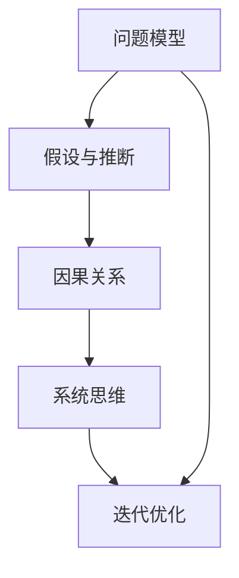

                 

# 深度思考:直击问题本质的利器

深度思考（Deep Thinking）是当前人工智能研究与应用中的一个重要方向，旨在通过多层次、多角度的分析和推导，探索和理解问题的本质。深度思考不仅能揭示问题的根本原因，还能为解决复杂问题提供创新性的方案。本文将从背景、核心概念、算法原理、操作步骤、数学模型、项目实践、应用场景、工具和资源、总结和未来发展趋势等角度，系统地介绍深度思考的理念、方法和实践，帮助读者构建深度思考的能力。

## 1. 背景介绍

### 1.1 问题由来

在信息技术迅猛发展的今天，面对日新月异的技术变化和复杂的业务需求，传统依靠直觉和经验的方式已无法满足高要求。深度思考能够通过系统化、逻辑化的方法，深入分析问题的本质，找到最有效的解决方案。这种思考方式广泛应用于机器学习、人工智能、数据分析、工程设计等多个领域，成为解决复杂问题的重要工具。

深度思考的价值在于其超越表面现象，直达问题本质的能力。它能帮助开发者、科研人员、业务决策者从复杂环境中剥离出核心问题，从根本出发找到最优解决方案，从而提升工作效率和项目成功率。

### 1.2 问题核心关键点

深度思考的核心在于通过多层次、多角度的分析和推导，揭示问题的本质和内在关系。其关键点包括：

- **问题分解**：将复杂问题拆分为多个子问题，逐层深入分析。
- **假设验证**：通过实验和数据分析，验证假设的正确性。
- **因果推断**：识别变量间的因果关系，找到问题的根源。
- **系统性思维**：考虑问题整体，而非局部，分析各部分之间的相互影响。
- **迭代优化**：不断调整解决方案，直至最优。

通过理解和应用这些关键点，深度思考者能够在复杂问题中游刃有余，找到最优解决方案。

## 2. 核心概念与联系

### 2.1 核心概念概述

深度思考的核心概念包括：

- **问题模型**：将问题抽象为模型，便于分析和解决。
- **假设与推断**：建立假设，通过数据分析和实验验证。
- **因果关系**：识别变量间的因果关系，找到问题的根本原因。
- **系统思维**：考虑问题整体，分析各部分之间的相互影响。
- **迭代优化**：不断调整解决方案，直至最优。

这些概念通过以下Mermaid流程图来展示它们之间的联系：



### 2.2 核心概念原理和架构

问题模型的建立是通过将问题抽象为数学模型或逻辑框架，便于进一步分析。假设与推断基于已有知识，通过推理和实验验证其正确性。因果关系识别变量间的相互影响，找到问题的根本原因。系统思维考虑问题的整体性，分析各部分之间的相互影响。迭代优化通过不断调整解决方案，逐步逼近最优。

这些概念的原理和架构可以总结为：

- **问题模型**：建立问题的数学或逻辑模型，便于分析。
- **假设与推断**：基于已有知识，建立假设并通过实验验证。
- **因果关系**：识别变量间的因果关系，找到问题的根本原因。
- **系统思维**：考虑问题整体，分析各部分之间的相互影响。
- **迭代优化**：通过不断调整解决方案，逐步逼近最优。

## 3. 核心算法原理 & 具体操作步骤

### 3.1 算法原理概述

深度思考的算法原理包括问题分解、假设验证、因果推断、系统思维和迭代优化等。其核心思想是通过多层次、多角度的分析和推导，揭示问题的本质和内在关系。

### 3.2 算法步骤详解

深度思考的算法步骤如下：

1. **问题分解**：将复杂问题拆分为多个子问题，逐层深入分析。
2. **假设验证**：建立假设，通过实验和数据分析，验证假设的正确性。
3. **因果推断**：识别变量间的因果关系，找到问题的根本原因。
4. **系统思维**：考虑问题整体，分析各部分之间的相互影响。
5. **迭代优化**：不断调整解决方案，直至最优。

### 3.3 算法优缺点

深度思考的优点包括：

- **深入理解问题**：通过多层次、多角度的分析和推导，揭示问题的本质。
- **创新性方案**：能够找到新颖的解决方案，突破传统思维的束缚。
- **系统性分析**：考虑问题整体，分析各部分之间的相互影响，避免局部最优。

缺点包括：

- **耗时较长**：深度思考需要多层次、多角度的分析，过程较为繁琐。
- **需要专业技能**：需要深厚的数学、统计学和系统思维能力。
- **依赖数据和实验**：需要大量的数据和实验验证假设的正确性。

### 3.4 算法应用领域

深度思考在多个领域得到了广泛应用，包括但不限于：

- **机器学习**：帮助科研人员理解模型行为，优化算法。
- **人工智能**：通过系统化分析，提升智能系统的准确性和鲁棒性。
- **数据分析**：揭示数据背后的规律，提供数据驱动的决策支持。
- **工程设计**：通过系统化分析，优化设计方案，提升产品质量。
- **业务决策**：提供基于数据和逻辑的分析，提升决策的科学性和可靠性。

## 4. 数学模型和公式 & 详细讲解 & 举例说明

### 4.1 数学模型构建

深度思考的数学模型构建通常基于以下几个步骤：

1. **问题抽象**：将问题抽象为数学或逻辑模型。
2. **变量定义**：定义变量，建立变量间的关系。
3. **模型构建**：构建数学或逻辑模型。

### 4.2 公式推导过程

以线性回归为例，推导其数学模型和公式。

设 $y$ 为因变量， $x_1, x_2, ..., x_n$ 为自变量， $\beta_0, \beta_1, ..., \beta_n$ 为模型参数。线性回归模型为：

$$
y = \beta_0 + \beta_1x_1 + \beta_2x_2 + ... + \beta_nx_n + \epsilon
$$

其中 $\epsilon$ 为误差项。

通过最小二乘法，可以得到模型参数的求解公式：

$$
\beta = (X^TX)^{-1}X^Ty
$$

其中 $X = [1, x_1, x_2, ..., x_n]^T$，$y = [y_1, y_2, ..., y_m]^T$。

### 4.3 案例分析与讲解

以股票价格预测为例，分析深度思考的应用：

1. **问题抽象**：将股票价格预测抽象为线性回归问题，定义 $y$ 为股票价格，$x_1$ 为时间，$x_2, x_3, ..., x_n$ 为市场指数、公司业绩等自变量。
2. **变量定义**：定义 $y$、$x_1$、$x_2$、$x_3$、$x_n$ 等变量。
3. **模型构建**：构建线性回归模型，求解参数 $\beta$。
4. **假设验证**：通过历史数据验证模型的准确性，优化模型参数。
5. **因果推断**：分析市场指数、公司业绩等自变量与股票价格间的因果关系。
6. **系统思维**：考虑多种自变量的影响，优化预测模型。
7. **迭代优化**：通过不断调整自变量和模型参数，逐步逼近最优预测结果。

## 5. 项目实践：代码实例和详细解释说明

### 5.1 开发环境搭建

进行深度思考的项目实践前，需要搭建开发环境。以下是以Python为开发语言的简单环境配置：

1. 安装Python：从官网下载并安装Python，建议使用Anaconda环境。
2. 安装相关库：安装NumPy、Pandas、Matplotlib等数据分析和可视化库。
3. 配置Jupyter Notebook：将Jupyter Notebook与Python环境集成，方便代码调试和展示。

### 5.2 源代码详细实现

以下是一个简单的深度思考项目示例，使用Python实现线性回归模型：

```python
import numpy as np
from sklearn.linear_model import LinearRegression
from sklearn.metrics import mean_squared_error

# 构建数据集
X = np.array([[1], [2], [3], [4], [5]])
y = np.array([2, 4, 6, 8, 10])

# 构建线性回归模型
model = LinearRegression()
model.fit(X, y)

# 预测
X_test = np.array([[6], [7], [8]])
y_pred = model.predict(X_test)

# 评估
mse = mean_squared_error(y, y_pred)
print(f"Mean Squared Error: {mse}")
```

### 5.3 代码解读与分析

1. **数据集构建**：构建一个简单的数据集，包含自变量和因变量。
2. **模型构建**：使用Scikit-learn库中的LinearRegression模型。
3. **模型训练**：使用训练数据集训练模型。
4. **预测与评估**：使用测试数据集进行预测，并计算均方误差。

## 6. 实际应用场景

### 6.1 金融风险管理

深度思考在金融风险管理中应用广泛，通过多层次分析和系统性思考，揭示风险的根源，提供风险管理策略。例如：

1. **问题分解**：将金融风险分解为市场风险、信用风险、操作风险等子问题。
2. **假设验证**：建立风险预测模型，验证其准确性。
3. **因果推断**：分析市场波动、公司财务状况等变量与风险的关系。
4. **系统思维**：考虑不同风险因素之间的相互影响，优化风险管理策略。
5. **迭代优化**：通过不断调整模型参数和策略，逐步优化风险管理效果。

### 6.2 医疗诊断系统

深度思考在医疗诊断系统中也有广泛应用，通过系统化分析和迭代优化，提升诊断的准确性和可靠性。例如：

1. **问题分解**：将医疗诊断问题分解为症状分析、病历分析、影像分析等子问题。
2. **假设验证**：建立诊断模型，验证其准确性。
3. **因果推断**：分析症状、病历、影像等变量与疾病的关系。
4. **系统思维**：考虑不同诊断因素之间的相互影响，优化诊断策略。
5. **迭代优化**：通过不断调整模型参数和诊断策略，逐步提升诊断准确性。

### 6.3 智能推荐系统

深度思考在智能推荐系统中也有重要应用，通过系统化分析和迭代优化，提升推荐效果。例如：

1. **问题分解**：将推荐问题分解为用户兴趣分析、物品特征分析、推荐算法优化等子问题。
2. **假设验证**：建立推荐模型，验证其准确性。
3. **因果推断**：分析用户行为、物品特征等变量与推荐结果的关系。
4. **系统思维**：考虑用户和物品之间的相互影响，优化推荐算法。
5. **迭代优化**：通过不断调整模型参数和推荐策略，逐步提升推荐效果。

### 6.4 未来应用展望

深度思考在未来的应用前景广阔，将在更多领域得到广泛应用，为复杂问题的解决提供创新性方案。例如：

1. **自动驾驶**：通过系统化分析车辆和环境变量，优化驾驶策略，提升安全性。
2. **智能制造**：通过系统化分析生产过程，优化生产流程，提高效率。
3. **智慧城市**：通过系统化分析城市数据，优化城市管理，提升居民生活质量。
4. **环境监测**：通过系统化分析环境数据，揭示环境变化规律，提供解决方案。

## 7. 工具和资源推荐

### 7.1 学习资源推荐

深度思考需要深厚的数学和统计学基础，推荐以下学习资源：

1. **《深度思考：系统性问题解决》**：介绍系统性思考和问题解决的基本方法。
2. **Coursera《系统思考与决策》**：Coursera平台的系统思考课程，讲解系统思考的基本原理和应用方法。
3. **《统计学基础》**：统计学基础课程，帮助理解深度思考中的数据分析和推断。
4. **Kaggle竞赛**：通过参与数据分析竞赛，提升问题分析和解决能力。
5. **深度思考社区**：加入深度思考社区，与同行交流学习心得。

### 7.2 开发工具推荐

深度思考开发需要强大的计算和分析工具支持，推荐以下工具：

1. **Python**：Python是深度思考开发的首选语言，具有丰富的数学和统计库支持。
2. **Jupyter Notebook**：Jupyter Notebook是Python开发常用的交互式环境，方便代码调试和展示。
3. **R语言**：R语言在统计分析和数据可视化方面具有优势，适合进行深度思考的复杂计算。
4. **Scikit-learn**：Scikit-learn是Python中的数据挖掘和机器学习库，提供了丰富的统计模型和工具。
5. **TensorFlow**：TensorFlow是深度学习框架，适合进行复杂深度思考模型的构建和训练。

### 7.3 相关论文推荐

深度思考是当前研究的热点，以下是几篇有影响力的相关论文：

1. **《系统思考：方法与实践》**：介绍系统思考的基本原理和应用方法。
2. **《因果推断：方法与实践》**：讲解因果推断的基本方法和应用场景。
3. **《深度思考与创新》**：探讨深度思考在创新思维中的作用。
4. **《深度思考与问题解决》**：讨论深度思考在问题解决中的应用。
5. **《深度思考与决策》**：分析深度思考在决策中的应用。

## 8. 总结：未来发展趋势与挑战

### 8.1 研究成果总结

深度思考作为一种问题解决的方法，已经在多个领域展示了其独特的优势和价值。其主要研究成果包括：

1. **系统性思考**：通过系统化分析，找到问题的本质和内在关系。
2. **因果推断**：识别变量间的因果关系，找到问题的根源。
3. **迭代优化**：不断调整解决方案，逐步逼近最优。
4. **多层次分析**：通过多层次、多角度的分析和推导，揭示问题的本质。

### 8.2 未来发展趋势

深度思考的未来发展趋势包括：

1. **技术融合**：与大数据、机器学习、人工智能等技术进行深度融合，提升问题解决的效率和效果。
2. **跨学科应用**：拓展应用领域，覆盖更多学科，解决更多复杂问题。
3. **自动化工具**：开发自动化工具，提升问题解决的效率。
4. **数据驱动**：基于数据驱动的方法，优化问题解决过程。
5. **智能辅助**：通过智能工具辅助问题解决，提升效率和效果。

### 8.3 面临的挑战

深度思考在应用过程中也面临诸多挑战，主要包括：

1. **数据需求**：深度思考需要大量的数据支持，数据的获取和处理是关键。
2. **复杂性**：深度思考过程复杂，需要系统化的思维方式和扎实的数学基础。
3. **工具限制**：现有的工具和库在处理复杂问题时可能存在局限性。
4. **结果解释**：深度思考的结果往往复杂，难以解释，需要辅助工具和解释方法。
5. **实践难度**：深度思考需要时间和实践经验积累，难以快速掌握。

### 8.4 研究展望

深度思考的未来研究展望包括：

1. **数据驱动**：基于大数据和机器学习，优化问题解决过程。
2. **自动化工具**：开发更智能、更高效的自动化工具，提升问题解决效率。
3. **跨学科融合**：与其他学科进行深度融合，拓展应用领域。
4. **可解释性**：开发更好的工具和方法，增强深度思考结果的可解释性。
5. **模型优化**：优化深度思考模型，提升问题解决效果。

## 9. 附录：常见问题与解答

**Q1: 深度思考与传统方法有何不同？**

A: 深度思考通过系统化、逻辑化的方法，深入分析问题的本质，找到最优解决方案。与传统方法相比，深度思考能够更全面、更深入地理解问题，找到更准确的解决方案。

**Q2: 如何进行问题分解？**

A: 问题分解是将复杂问题拆分为多个子问题，逐层深入分析。可以从问题的不同角度、不同层次进行分解，确保每个子问题都具有可解性和可操作性。

**Q3: 深度思考的优点有哪些？**

A: 深度思考的优点包括：深入理解问题、创新性方案、系统性分析等。深度思考能够从根本上解决问题，避免局部最优。

**Q4: 如何进行因果推断？**

A: 因果推断是通过分析变量间的相互关系，找到问题的根本原因。可以使用回归分析、协整分析、因果图等方法，揭示变量间的因果关系。

**Q5: 如何进行迭代优化？**

A: 迭代优化是通过不断调整解决方案，逐步逼近最优。可以使用梯度下降、遗传算法、粒子群优化等方法，优化解决方案。

通过上述系统性介绍，读者可以对深度思考的理念、方法和实践有更全面的了解。深度思考不仅是一种问题解决的方法，更是一种系统化、逻辑化的思维方式，能够帮助人们深入理解问题，找到最优解决方案。在未来，深度思考将在更多领域得到广泛应用，成为解决复杂问题的利器。

作者：禅与计算机程序设计艺术 / Zen and the Art of Computer Programming

