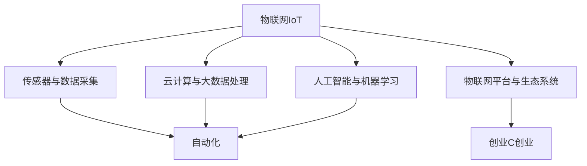

                 

# 物联网技术在自动化创业中的运用

> 关键词：物联网,创业,自动化,技术驱动,智能设备,数字转型

## 1. 背景介绍

### 1.1 问题由来
随着全球经济的数字化转型，自动化和智能化成为了企业提升效率、降低成本、增强竞争力的重要手段。特别是传统制造业，面对激烈的市场竞争和日益增长的消费者需求，自动化技术的应用变得尤为关键。物联网(IoT)技术以其广泛的覆盖性和强大的互联能力，为自动化创业提供了广阔的空间。

近年来，随着传感器、云计算、大数据、人工智能等技术的快速发展，物联网技术在自动化创业中得到了广泛应用。许多初创公司正在利用物联网技术，开发智能设备、软件系统和服务，为各行各业提供自动化解决方案，助力数字化转型升级。

### 1.2 问题核心关键点
物联网技术在自动化创业中的应用，主要集中在以下几个关键点上：
- **传感器与数据采集**：利用各种传感器收集设备状态、环境参数、用户行为等数据，为自动化决策提供依据。
- **云计算与大数据处理**：通过云平台集中存储和处理大规模数据，为数据分析和算法优化提供基础。
- **人工智能与机器学习**：结合AI技术，对采集到的数据进行建模分析，提取有价值的信息，实现精准控制和决策。
- **物联网平台与生态系统**：构建设备间互联互通的标准化平台，支持不同设备和服务间的协同工作。

这些关键技术点共同构成了物联网技术在自动化创业中的核心竞争力，为创业公司提供了强大的技术支持和应用潜力。

## 2. 核心概念与联系

### 2.1 核心概念概述

为更好地理解物联网技术在自动化创业中的应用，本节将介绍几个密切相关的核心概念：

- **物联网(IoT)**：通过互联网将各种物理设备、传感器、软件应用等连接起来，实现设备间的数据交互和信息共享。物联网技术的应用涵盖从智能家居、智慧城市到工业自动化等多个领域。

- **自动化(Automation)**：指使用机器、软件等技术代替人工操作，提高效率和精度。自动化技术应用广泛，包括制造、服务、管理等多个层面。

- **创业(C创业)**：指创立新企业或创新的过程。物联网技术在自动化领域的创业，主要涉及开发智能设备、系统软件、解决方案等服务。

- **技术驱动**：指依靠技术创新推动产品和服务发展的创业模式。物联网技术的快速发展，为自动化创业提供了强大的技术驱动力。

- **智能设备**：指集成了传感器、处理器、通信模块等的智能硬件，能够实时采集、处理和传输数据，实现自动化控制。

- **数字转型**：指通过数字化手段，提升企业的生产、运营、管理等各个环节的效率和质量，实现从传统模式向智能化模式转型。

这些核心概念之间的逻辑关系可以通过以下Mermaid流程图来展示：



这个流程图展示了大语言模型的核心概念及其之间的关系：

1. 物联网技术为自动化创业提供了技术基础。
2. 传感器与数据采集为自动化提供实时、准确的数据输入。
3. 云计算与大数据处理为自动化提供强大的数据处理能力。
4. 人工智能与机器学习为自动化提供智能决策和优化能力。
5. 物联网平台与生态系统为自动化提供标准化、互联互通的支撑。
6. 通过这些技术手段，实现创业项目的自动化需求。

## 3. 核心算法原理 & 具体操作步骤
### 3.1 算法原理概述

物联网技术在自动化创业中的核心算法原理，可以归纳为以下几个方面：

- **数据采集与处理**：通过传感器、RFID、二维码等技术，实时采集设备状态和环境参数，并上传至云端平台进行数据处理。
- **数据分析与建模**：利用机器学习算法，对采集到的数据进行建模分析，提取有价值的信息，辅助自动化决策。
- **智能控制与决策**：结合人工智能技术，实现设备间的数据交互和智能控制，优化生产流程、提升效率和精度。
- **系统集成与互操作性**：通过物联网平台，实现不同设备和系统间的互联互通，形成统一的自动化生态系统。

### 3.2 算法步骤详解

以下将详细介绍物联网技术在自动化创业中核心算法的详细步骤：

1. **数据采集与预处理**：
   - 使用传感器、RFID、二维码等技术，实时采集设备状态和环境参数。
   - 对采集到的原始数据进行清洗、筛选、转换等预处理操作，确保数据的准确性和一致性。

2. **数据上传与存储**：
   - 将预处理后的数据通过网络上传到云端平台，存储在分布式数据库中。
   - 利用云计算技术，进行数据备份和冗余，确保数据的安全性和可靠性。

3. **数据处理与分析**：
   - 在云端平台，对存储的数据进行实时处理和分析，提取有价值的信息。
   - 利用机器学习算法，对数据进行建模分析，识别模式、预测趋势、优化决策。

4. **智能控制与决策**：
   - 根据分析结果，结合人工智能技术，进行智能控制和决策。
   - 例如，通过深度学习模型，预测生产线的故障风险，提前采取预防措施。

5. **系统集成与互操作性**：
   - 利用物联网平台，实现不同设备和系统间的互联互通。
   - 通过API接口，支持不同设备和服务间的协同工作，形成统一的自动化生态系统。

### 3.3 算法优缺点

物联网技术在自动化创业中的应用，具有以下优点：

- **实时性强**：传感器和云计算技术可以实时采集和处理数据，满足自动化对实时性的要求。
- **数据量丰富**：大量传感器和设备采集的数据，为数据分析和决策提供了丰富的信息源。
- **灵活性高**：物联网平台和生态系统支持不同设备和服务的灵活集成，提高系统的可扩展性和灵活性。
- **成本效益高**：通过自动化和智能化改造，大幅提升生产效率和质量，降低人工成本和错误率。

同时，也存在一些局限性：

- **技术门槛高**：物联网和自动化技术涉及多个领域的知识，需要跨学科的专业技能。
- **数据安全问题**：大量的数据采集和存储，带来了数据隐私和安全的风险。
- **初期投入大**：传感器、设备和平台建设等初期投入较高，需要较长时间才能看到回报。

尽管存在这些局限性，但物联网技术在自动化创业中的应用前景依然广阔，通过不断的技术创新和应用实践，有望突破这些挑战，实现更高的应用价值。

### 3.4 算法应用领域

物联网技术在自动化创业中的应用领域非常广泛，以下是几个典型的应用场景：

- **智能制造**：通过物联网技术，实现设备间的数据交互和协同工作，提升生产效率和质量。例如，利用传感器监测设备运行状态，自动调整生产参数，减少故障和停机时间。
- **智慧物流**：通过物联网技术，实现货物和设备的实时跟踪、管理、调度，提高物流效率和可靠性。例如，利用RFID标签和传感器，实时监控货物位置和状态，优化物流路径。
- **智能家居**：通过物联网技术，实现家庭设备的互联互通和智能化控制，提升生活品质和便利性。例如，利用智能门锁、智能照明、智能安防等设备，实现家居自动化和智能化管理。
- **智慧农业**：通过物联网技术，实现对农田、作物的实时监测和智能控制，提升农业生产效率和产量。例如，利用土壤传感器、气象传感器，实时监测土壤湿度、温度、光照等参数，优化灌溉和施肥方案。
- **智能医疗**：通过物联网技术，实现医疗设备和数据的互联互通，提高医疗服务的效率和质量。例如，利用可穿戴设备、智能病床等设备，实时监测患者健康状况，提供个性化医疗服务。

## 4. 数学模型和公式 & 详细讲解
### 4.1 数学模型构建

以下我们将使用数学语言对物联网技术在自动化创业中的应用进行更加严格的刻画。

记物联网系统为 $S$，包括传感器 $S_s$、数据采集器 $S_a$、云平台 $S_c$、自动化决策器 $S_d$ 等部分。系统的工作流程可以抽象为如下数学模型：

$$
S: \{S_s, S_a, S_c, S_d\}
$$

其中，$S_s$ 表示传感器集合，$S_a$ 表示数据采集器集合，$S_c$ 表示云平台，$S_d$ 表示自动化决策器。系统的工作流程可以表示为：

$$
S: S_s \rightarrow S_a \rightarrow S_c \rightarrow S_d
$$

即传感器采集数据，上传至云平台进行存储和处理，最终通过决策器实现自动化控制。

### 4.2 公式推导过程

以下将推导物联网技术在自动化创业中的应用公式，以智能制造为例。

假设物联网系统采集到的设备状态参数为 $x_t$，其中 $t$ 为时间。设传感器采集的频率为 $f$，采集到的数据长度为 $n$。根据传感器和数据采集器的参数，可以得到数据采集过程的数学模型：

$$
x_t = \sum_{i=1}^{n} x_{t,i}
$$

其中 $x_{t,i}$ 表示第 $i$ 次采集到的设备状态参数。

将采集到的数据上传至云平台，利用大数据处理算法进行分析，可以得到设备状态的变化趋势：

$$
\frac{dx_t}{dt} = f(x_{t-1}, x_{t-2}, ..., x_{t-n})
$$

利用深度学习算法，对历史数据进行建模分析，可以得到设备状态预测模型：

$$
\hat{x}_t = \mathcal{M}(x_{t-1}, x_{t-2}, ..., x_{t-n})
$$

其中 $\mathcal{M}$ 表示深度学习模型，$\hat{x}_t$ 表示设备状态预测值。

根据设备状态预测结果，结合生产任务的需求，可以进行自动化决策，例如调整生产参数、调度设备、发出告警等：

$$
\mathcal{D}(x_t, \hat{x}_t) = \left\{
\begin{array}{ll}
1 & \text{设备正常运行} \\
0 & \text{设备异常} \\
2 & \text{设备需要维护}
\end{array}
\right.
$$

其中 $\mathcal{D}(x_t, \hat{x}_t)$ 表示自动化决策结果，$x_t$ 表示实际设备状态参数，$\hat{x}_t$ 表示预测的设备状态参数。

### 4.3 案例分析与讲解

假设某智能制造企业使用物联网技术对生产线进行自动化改造。系统采集到的设备状态参数包括温度、湿度、振动等。通过传感器和数据采集器，实时采集设备状态数据，上传到云平台进行存储和处理。利用深度学习算法，对历史数据进行建模分析，建立设备状态预测模型。根据设备状态预测结果，进行自动化决策，例如调整生产参数、调度设备、发出告警等。

## 5. 项目实践：代码实例和详细解释说明
### 5.1 开发环境搭建

在进行物联网技术在自动化创业中的实践前，我们需要准备好开发环境。以下是使用Python进行开发的环境配置流程：

1. 安装Python：从官网下载并安装Python，建议安装最新版本，以确保兼容性和性能。
2. 安装相关库：安装IoT相关的Python库，如paho-mqtt、pyserial、numpy等。例如，可以通过pip命令安装：
   ```bash
   pip install paho-mqtt pyserial numpy
   ```
3. 搭建开发环境：在本地搭建开发环境，包括配置Python环境、安装开发工具、安装相关库等。

完成上述步骤后，即可在本地开发环境中开始物联网技术在自动化创业中的实践。

### 5.2 源代码详细实现

下面我们以智能制造系统为例，给出使用Python实现物联网技术在自动化创业中的代码实现。

```python
import paho.mqtt.client as mqtt
import serial
import numpy as np
from sklearn.ensemble import RandomForestRegressor

class IoTSystem:
    def __init__(self, broker, topic, serial_port, baud_rate):
        self.broker = broker
        self.topic = topic
        self.serial_port = serial_port
        self.baud_rate = baud_rate
        self.data = []
        self.model = RandomForestRegressor()

    def on_connect(self, client, userdata, flags, rc):
        print("Connected to MQTT broker")
        self.client.subscribe(self.topic)

    def on_message(self, client, userdata, msg):
        data = msg.payload.decode('utf-8').split(',')
        self.data.append(data)
        self.train_model()

    def train_model(self):
        X = np.array(self.data)
        y = np.array([int(x[-1]) for x in self.data])
        X = X[:, :-1]
        self.model.fit(X, y)

    def predict(self, data):
        data = [float(x) for x in data.split(',')]
        data = np.array(data)
        X = data.reshape(1, -1)
        return self.model.predict(X)[0]

    def publish_result(self, result):
        self.client.publish(self.topic, f"{result},1")

    def connect_serial(self):
        self.serial = serial.Serial(self.serial_port, self.baud_rate)
        self.serial.readline()

    def start(self):
        self.client = mqtt.Client()
        self.client.on_connect = self.on_connect
        self.client.on_message = self.on_message
        self.client.connect(self.broker)
        self.client.loop_start()
        self.connect_serial()
        self.client.loop_forever()

# 配置物联网系统参数
broker = "broker.example.com"
topic = "device/status"
serial_port = "/dev/ttyUSB0"
baud_rate = 9600

# 创建物联网系统实例
system = IoTSystem(broker, topic, serial_port, baud_rate)

# 启动物联网系统
system.start()
```

### 5.3 代码解读与分析

让我们再详细解读一下关键代码的实现细节：

**IoTSystem类**：
- `__init__`方法：初始化物联网系统，包括MQTT broker地址、数据采集主题、串口参数等。
- `on_connect`方法：连接MQTT broker时触发，用于订阅数据采集主题。
- `on_message`方法：收到MQTT broker的数据时触发，解析数据并调用`train_model`方法训练模型。
- `train_model`方法：对历史数据进行建模分析，训练随机森林回归模型。
- `predict`方法：对新数据进行预测，返回预测结果。
- `publish_result`方法：将预测结果发布到MQTT broker。
- `connect_serial`方法：连接到串口，读取设备状态数据。
- `start`方法：启动MQTT客户端，连接MQTT broker，连接串口，进入主循环。

**配置参数**：
- `broker`：MQTT broker地址。
- `topic`：数据采集主题。
- `serial_port`：串口地址。
- `baud_rate`：串口通信速率。

**运行流程**：
- 初始化物联网系统实例。
- 调用`start`方法启动系统。
- 系统连接MQTT broker，订阅数据采集主题，连接串口。
- 进入主循环，等待MQTT broker的数据和新串口数据。
- 对新数据进行解析，调用`train_model`方法训练模型，预测结果并发布。

## 6. 实际应用场景
### 6.1 智能制造

物联网技术在智能制造中的应用非常广泛，可以实现设备的实时监控、预测性维护、生产调度和质量控制等。

- **设备监控**：通过传感器和数据采集器，实时监控设备的运行状态，如温度、湿度、振动等参数。利用云计算和大数据技术，实时处理和分析采集到的数据，生成设备状态报告。
- **预测性维护**：结合深度学习算法，对历史数据进行建模分析，预测设备故障和维护需求。提前采取维护措施，避免意外停机和生产损失。
- **生产调度**：利用物联网平台，实现设备间的互联互通，进行生产任务调度。例如，根据设备状态和生产需求，自动调整生产参数和设备配置。
- **质量控制**：通过物联网技术，实时监控生产过程中的质量参数，如温度、压力、湿度等。结合机器学习算法，预测和控制产品质量，提升产品合格率。

### 6.2 智慧物流

物联网技术在智慧物流中的应用，可以实现货物和设备的实时跟踪、管理、调度，提高物流效率和可靠性。

- **货物跟踪**：通过RFID标签和传感器，实时跟踪货物的位置和状态。利用云计算和大数据技术，对货物数据进行集中存储和分析，生成货物运输报告。
- **设备调度**：利用物联网平台，实现设备间的互联互通，进行设备调度。例如，根据货物位置和状态，自动调整运输路线和设备配置。
- **库存管理**：通过物联网技术，实时监控库存水平和货物状态。结合机器学习算法，预测库存需求和补货需求，优化库存管理。

### 6.3 智能家居

物联网技术在智能家居中的应用，可以实现家庭设备的互联互通和智能化控制，提升生活品质和便利性。

- **智能门锁**：通过物联网技术，实现智能门锁的远程控制和身份认证。例如，通过手机APP远程控制门锁开关，同时记录门锁开启和关闭的时间。
- **智能照明**：利用物联网技术，实现智能灯光的自动控制和场景设置。例如，根据用户行为和环境条件，自动调整灯光亮度和颜色。
- **智能安防**：通过物联网技术，实现智能安防设备的远程监控和报警。例如，利用摄像头和传感器，实时监控家庭安全，遇到异常情况自动报警。

### 6.4 未来应用展望

随着物联网技术的不断发展，未来的应用场景将更加广阔，进一步提升各行各业的自动化和智能化水平。

- **智能农业**：利用物联网技术，实时监控农田和作物的生长状态，进行智能灌溉和施肥。结合机器学习算法，优化农业生产，提高产量和质量。
- **智能医疗**：通过物联网技术，实现医疗设备和数据的互联互通，提高医疗服务的效率和质量。例如，利用可穿戴设备、智能病床等设备，实时监测患者健康状况，提供个性化医疗服务。
- **智能交通**：利用物联网技术，实现交通设备的实时监控和调度。例如，通过传感器和摄像头，实时监测交通流量和路况，自动调整信号灯和交通流向。

## 7. 工具和资源推荐
### 7.1 学习资源推荐

为了帮助开发者系统掌握物联网技术在自动化创业中的应用，这里推荐一些优质的学习资源：

1. **《物联网技术与应用》**：一本详细介绍物联网技术原理、应用场景、发展趋势的书籍，适合物联网初学者和从业者阅读。
2. **《Python IoT开发实战》**：一本详细介绍Python在物联网开发中的实战项目，包括传感器、数据采集、云平台、自动化控制等技术。
3. **IoT平台官方文档**：各大物联网平台（如AWS IoT、Azure IoT、腾讯IoT）的官方文档，提供了详细的API接口和开发指南，适合开发者参考。
4. **IoT社区论坛**：如IoT论坛、IoT Stack Overflow等社区，汇集了大量物联网开发者的经验和问题，适合开发者交流和学习。
5. **IoT开发实战项目**：如GitHub上的IoT开发项目，提供了大量实战案例和代码示例，适合开发者学习参考。

通过对这些资源的学习实践，相信你一定能够快速掌握物联网技术在自动化创业中的精髓，并用于解决实际的物联网问题。

### 7.2 开发工具推荐

高效的开发离不开优秀的工具支持。以下是几款用于物联网技术在自动化创业中开发的常用工具：

1. **IoT平台**：如AWS IoT、Azure IoT、腾讯IoT等，提供了完整的物联网基础设施和开发工具，支持设备管理、数据采集、云平台、自动化控制等功能。
2. **传感器和数据采集器**：如温度传感器、RFID标签、摄像头等，用于实时采集设备状态和环境参数。
3. **云计算平台**：如AWS、Azure、阿里云等，提供了强大的云计算服务，支持数据存储、处理和分析。
4. **大数据处理工具**：如Hadoop、Spark、Flink等，用于处理大规模数据，支持数据分析和建模。
5. **深度学习框架**：如TensorFlow、PyTorch、MXNet等，用于深度学习算法的开发和训练。
6. **MQTT协议库**：如paho-mqtt、mosquitto等，用于实现MQTT通信协议，支持设备间的消息传递。

合理利用这些工具，可以显著提升物联网技术在自动化创业中的开发效率，加快创新迭代的步伐。

### 7.3 相关论文推荐

物联网技术在自动化创业中的应用，源于学界的持续研究。以下是几篇奠基性的相关论文，推荐阅读：

1. **IoT Cloud Computing: Architectures and Services**：一篇关于物联网云架构和服务设计的综述论文，介绍了物联网云平台的设计理念和技术方案。
2. **Internet of Things (IoT) for Smart Manufacturing**：一篇关于物联网技术在智能制造中应用的综述论文，介绍了物联网技术在设备监控、预测性维护、生产调度和质量控制中的应用。
3. **IoT-based Real-time Monitoring and Prediction of Machine Health**：一篇关于物联网技术在设备健康监测和预测中的应用的论文，介绍了物联网传感器和数据采集技术在设备健康监测中的应用。
4. **IoT for Smart Agriculture: Technologies and Applications**：一篇关于物联网技术在智能农业中的应用综述论文，介绍了物联网技术在智能灌溉、智能施肥、智能养殖等方面的应用。
5. **IoT-based Smart Home and Environmental Monitoring**：一篇关于物联网技术在智能家居和环境监测中的应用综述论文，介绍了物联网传感器和数据采集技术在家居自动化、环境监测中的应用。

这些论文代表了大语言模型微调技术的发展脉络。通过学习这些前沿成果，可以帮助研究者把握学科前进方向，激发更多的创新灵感。

## 8. 总结：未来发展趋势与挑战

### 8.1 总结

本文对物联网技术在自动化创业中的应用进行了全面系统的介绍。首先阐述了物联网技术和自动化创业的背景和意义，明确了物联网技术在自动化创业中的重要地位。其次，从原理到实践，详细讲解了物联网技术在自动化创业中的核心算法和操作步骤，给出了物联网技术在自动化创业中的完整代码实例。同时，本文还广泛探讨了物联网技术在智能制造、智慧物流、智能家居等多个行业领域的应用前景，展示了物联网技术在自动化创业中的广阔应用空间。此外，本文精选了物联网技术的各类学习资源，力求为读者提供全方位的技术指引。

通过本文的系统梳理，可以看到，物联网技术在自动化创业中的应用前景广阔，为各行各业提供了强大的技术支撑和应用潜力。物联网技术能够实现设备的实时监控、数据采集、自动化控制等功能，大幅提升生产效率和质量，降低人工成本和错误率，推动各行各业的数字化转型升级。未来，伴随物联网技术的不断发展，将有更多行业和企业从中受益，实现智能化、自动化、高效化的生产和管理。

### 8.2 未来发展趋势

展望未来，物联网技术在自动化创业中的应用将呈现以下几个发展趋势：

1. **智能化程度提升**：随着人工智能技术的不断进步，物联网设备将具备更强的自主决策和智能化控制能力，实现更高效的自动化生产和管理。
2. **设备互联互通**：未来的物联网系统将实现更广泛的设备互联互通，形成统一的标准化平台，提高系统的可扩展性和灵活性。
3. **数据驱动决策**：利用大数据和机器学习技术，从海量数据中提取有价值的信息，辅助自动化决策，提升生产效率和质量。
4. **实时性增强**：物联网技术将实现更高速的数据采集和传输，满足自动化系统对实时性的要求，提高系统响应速度。
5. **边缘计算普及**：随着边缘计算技术的发展，物联网设备将具备更强的本地计算能力，实现数据就地处理，提高数据处理效率。

这些趋势将推动物联网技术在自动化创业中的应用更加广泛和深入，为各行各业带来更高效、智能、可靠的生产和管理模式。

### 8.3 面临的挑战

尽管物联网技术在自动化创业中的应用前景广阔，但在迈向更加智能化、普适化应用的过程中，仍面临诸多挑战：

1. **技术门槛高**：物联网技术涉及多个领域的知识，需要跨学科的专业技能。
2. **数据安全问题**：大量的数据采集和存储，带来了数据隐私和安全的风险。
3. **初期投入大**：传感器、设备和平台建设等初期投入较高，需要较长时间才能看到回报。
4. **系统复杂度高**：物联网系统涉及多个设备和系统，需要复杂的集成和互操作性支持。
5. **标准不统一**：物联网设备的标准不统一，导致设备间互联互通难度大。

尽管存在这些挑战，但随着物联网技术的不断发展，相信这些问题将逐步得到解决，物联网技术在自动化创业中的应用前景依然广阔。

### 8.4 研究展望

面对物联网技术在自动化创业中所面临的挑战，未来的研究需要在以下几个方面寻求新的突破：

1. **降低技术门槛**：开发更易用的物联网开发工具和平台，降低开发门槛，提高开发者效率。
2. **提升数据安全**：开发更加安全的数据传输和存储技术，保障数据隐私和安全。
3. **优化初期投入**：开发成本更低的物联网设备和平台，降低初期投入，提高投资回报率。
4. **简化系统集成**：开发更易集成的物联网设备和系统，降低系统复杂度，提高系统可扩展性。
5. **推动标准统一**：制定统一的物联网设备标准，促进设备间互联互通，提高系统互操作性。

这些研究方向的探索，将引领物联网技术在自动化创业中的应用进入新的阶段，为各行各业带来更高效、智能、可靠的生产和管理模式。

## 9. 附录：常见问题与解答

**Q1：物联网技术在自动化创业中是否存在安全问题？**

A: 物联网技术在自动化创业中确实存在一定的安全风险，主要包括以下几个方面：
1. **数据泄露**：物联网设备采集的数据可能包含敏感信息，如地理位置、用户行为等，一旦被非法获取，可能带来隐私风险。
2. **设备攻击**：物联网设备容易受到DDoS攻击、恶意软件攻击等安全威胁，影响系统的正常运行。
3. **网络攻击**：物联网系统依赖网络传输数据，可能受到网络攻击，导致数据传输中断或篡改。

为了应对这些安全风险，可以采取以下措施：
1. **数据加密**：对采集的数据进行加密处理，防止数据泄露。
2. **设备认证**：对物联网设备进行身份认证，防止未经授权的访问。
3. **网络安全**：采用防火墙、入侵检测等网络安全措施，防止网络攻击。
4. **安全监控**：对物联网系统进行实时监控，及时发现和应对安全威胁。

**Q2：物联网技术在自动化创业中是否需要高昂的初期投入？**

A: 物联网技术在自动化创业中的初期投入确实较高，主要包括以下几个方面：
1. **设备成本**：物联网设备（如传感器、RFID标签等）的成本较高，需要较大的前期投资。
2. **平台建设**：物联网平台（如云平台、数据存储等）的建设需要较高的技术投入和基础设施投入。
3. **人力资源**：物联网系统的开发、集成、维护需要专业技术人员，需要较高的薪酬成本。

为了降低初期投入，可以采取以下措施：
1. **选择合适的设备**：选择性价比高的物联网设备，降低设备成本。
2. **利用云平台**：利用云端平台，降低基础设施投入和技术维护成本。
3. **开源技术**：利用开源技术，降低开发成本和人力成本。
4. **分阶段实施**：分阶段实施物联网系统，逐步扩展功能，降低初期投入。

**Q3：物联网技术在自动化创业中如何实现设备间的互联互通？**

A: 物联网技术在自动化创业中实现设备间的互联互通，主要依赖以下几个关键技术：
1. **统一标准**：制定统一的物联网设备标准，确保设备间的互操作性。
2. **通信协议**：采用标准的通信协议（如MQTT、CoAP等），确保设备间的通信可靠。
3. **数据模型**：采用统一的数据模型，确保数据格式的一致性。
4. **中间件**：采用物联网中间件，实现设备间的互联互通和数据传递。
5. **平台集成**：将不同设备和服务集成到统一的物联网平台中，支持设备间的协同工作。

通过这些技术手段，可以实现设备间的互联互通，形成统一的物联网系统，提高系统的可扩展性和灵活性。

**Q4：物联网技术在自动化创业中如何实现实时监控和预测性维护？**

A: 物联网技术在自动化创业中实现实时监控和预测性维护，主要依赖以下几个关键技术：
1. **传感器和数据采集器**：利用传感器和数据采集器，实时采集设备的运行状态和环境参数。
2. **数据传输和存储**：利用物联网平台，实现数据的实时传输和存储。
3. **数据处理和分析**：利用大数据和机器学习技术，对采集到的数据进行建模分析，预测设备故障和维护需求。
4. **自动化控制**：根据预测结果，进行自动化决策，提前采取维护措施，避免意外停机和生产损失。

通过这些技术手段，可以实现设备的实时监控和预测性维护，提高生产效率和设备可靠性。

---

作者：禅与计算机程序设计艺术 / Zen and the Art of Computer Programming

