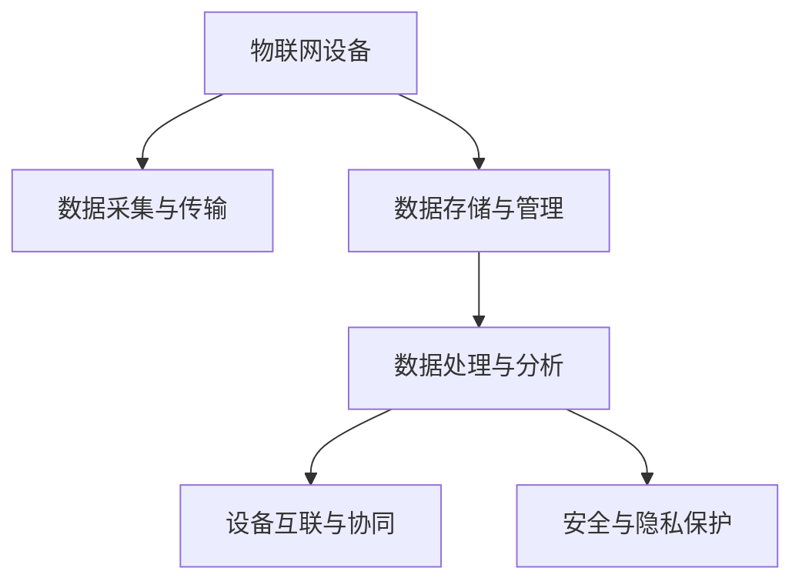

                 

## 1. 背景介绍

### 1.1 问题由来

物联网（IoT）作为新一轮信息技术革命的重要驱动力，正在全面重塑人类社会的生产生活方式。从智能家居到智慧城市，从工业自动化到智能交通，无处不在的物联网设备正在汇聚成庞大的数据流，向云端汇聚。如何高效地处理这些海量数据，提取有用的信息，实现设备的智能互联与协同，是物联网应用研究的重要课题。

### 1.2 问题核心关键点

物联网数据流的处理和分析主要涉及以下关键点：

- **数据采集与传输**：物联网设备的广泛部署和数据量的大幅增长，使得数据采集和传输成为瓶颈。
- **数据存储与管理**：海量数据的存储与管理需要高效的分布式系统和大数据技术支持。
- **数据处理与分析**：利用AI、ML等技术对数据进行特征提取、模式识别、预测分析等，提取有价值的信息。
- **设备互联与协同**：通过互联网、移动互联网、物联网技术实现设备之间的通信与协作，实现智能决策和自动化。
- **安全与隐私保护**：物联网数据涉及敏感信息，需要采取多种安全措施保障数据传输与存储的安全性。

## 2. 核心概念与联系

### 2.1 核心概念概述

为更好地理解物联网数据流处理与分析的原理和架构，本节将介绍几个密切相关的核心概念：

- **物联网设备**：指嵌入电子、软件、传感器等技术，实现物体互联的各类终端设备，如智能家居设备、智能穿戴设备、智能传感器等。
- **数据采集与传输**：指物联网设备将获取到的实时数据通过无线或有线方式传输到云端的过程。
- **数据存储与管理**：指利用分布式数据库、大数据平台等技术，对采集到的海量数据进行存储、组织、管理的过程。
- **数据处理与分析**：指利用机器学习、深度学习等技术对数据进行特征提取、模型训练、预测分析等，以实现智能决策与优化。
- **设备互联与协同**：指通过云计算、边缘计算等技术，实现设备间的协同与通信，以实现自动化与智能化。
- **安全与隐私保护**：指通过数据加密、身份认证、访问控制等手段，保护数据在传输、存储过程中的安全与隐私。

这些核心概念之间的逻辑关系可以通过以下Mermaid流程图来展示：



这个流程图展示了大数据在物联网中的全流程：从物联网设备的实时数据采集，到数据在分布式系统中的存储和管理，再到基于AI技术的数据处理与分析，最后通过设备互联协同实现智能化决策。同时，还需要关注数据安全和隐私保护。

## 3. 核心算法原理 & 具体操作步骤

### 3.1 算法原理概述

物联网数据流的处理与分析过程，本质上是一个数据驱动的决策过程。其核心思想是通过数据采集、存储、处理与分析，提取有用信息，实现设备的智能化和自动化。

形式化地，设物联网设备采集的数据流为 $X$，其传输和存储的数据为 $Y$，处理与分析后提取的信息为 $Z$。则物联网数据流的处理与分析过程可以表示为：

$$
Z = f(Y)
$$

其中 $f$ 为数据处理与分析函数。

### 3.2 算法步骤详解

物联网数据流的处理与分析一般包括以下几个关键步骤：

**Step 1: 数据采集与传输**
- 通过传感器、摄像头、RFID等技术采集物联网设备的数据，如温度、湿度、位置、声音等。
- 将采集的数据通过Wi-Fi、蓝牙、LTE等无线技术，或者以太网、RS-485等有线技术，传输到云端或边缘计算节点。

**Step 2: 数据存储与管理**
- 利用分布式数据库（如Hadoop、Spark）、数据湖（如Amazon S3、Google Cloud Storage）等技术，对采集到的数据进行分布式存储和管理。
- 利用数据管理工具（如ETL工具、数据仓库），实现数据的整合、清洗、归档等功能。

**Step 3: 数据处理与分析**
- 利用机器学习、深度学习等技术，对数据进行特征提取、模型训练、预测分析等，以实现智能决策与优化。
- 利用流处理平台（如Apache Kafka、Apache Flink）对数据流进行实时处理和分析，以实现设备间的数据协同。

**Step 4: 设备互联与协同**
- 利用云计算、边缘计算等技术，实现设备间的通信与协作，实现设备间的自动控制和协同优化。
- 利用物联网协议（如MQTT、CoAP）实现设备间的通信协议，实现设备间的智能互联。

**Step 5: 安全与隐私保护**
- 通过数据加密、身份认证、访问控制等手段，保护数据在传输、存储过程中的安全与隐私。
- 利用安全技术（如TLS、SSH）保护数据通信的安全性，防止数据泄露和篡改。

### 3.3 算法优缺点

物联网数据流的处理与分析方法具有以下优点：

1. **实时性**：通过流处理平台，可以实现对数据流的实时处理和分析，满足设备实时决策的需求。
2. **可扩展性**：分布式存储和管理技术，可以轻松应对海量数据的处理和存储需求。
3. **智能化**：利用机器学习和深度学习技术，可以实现设备的智能化和自动化。
4. **安全性**：通过数据加密和安全协议，保障数据在传输和存储过程中的安全性。

同时，该方法也存在一定的局限性：

1. **数据质量**：物联网设备的数据质量参差不齐，传感器误差、通信延迟等因素可能影响数据精度。
2. **计算资源**：数据处理与分析涉及大量计算，需要强大的计算资源支持。
3. **网络带宽**：数据传输过程中需要大量网络带宽，对于带宽有限的场景可能存在瓶颈。
4. **隐私保护**：数据涉及用户隐私，需要采取多种措施保护用户隐私。

尽管存在这些局限性，但就目前而言，基于数据流处理与分析的方法仍是物联网应用的主流范式。未来相关研究的重点在于如何进一步提升数据采集的准确性、降低计算资源需求、优化网络带宽使用，同时兼顾数据隐私和安全。

### 3.4 算法应用领域

物联网数据流的处理与分析方法，在众多领域都有广泛的应用，例如：

- **智能家居**：通过智能家居设备的数据采集与传输，实现家庭自动化控制和智能化管理。
- **智能制造**：通过工业物联网设备的数据采集与传输，实现生产过程的智能监控和优化。
- **智慧城市**：通过城市基础设施的数据采集与传输，实现智慧交通、智慧环保、智慧安防等功能。
- **智能医疗**：通过医疗设备的数据采集与传输，实现远程监测、智能诊断等功能。
- **农业物联网**：通过农业设备的数据采集与传输，实现农业生产过程的智能监控和优化。

除了上述这些经典应用外，物联网数据流的处理与分析方法还被创新性地应用到更多场景中，如智能物流、智能交通、智能建筑等，为各行各业带来智能化转型升级的新动力。

## 4. 数学模型和公式 & 详细讲解 & 举例说明

### 4.1 数学模型构建

在物联网数据流的处理与分析过程中，涉及大量的数学模型和公式。这里以智能家居为例，介绍如何构建数学模型。

设智能家居设备的温度、湿度、光照等传感器采集的数据为 $x_1, x_2, \dots, x_n$，经过预处理后，输入到智能家居管理系统。系统需要判断是否需要开启空调和加湿器，其数学模型可以表示为：

$$
y = f(x_1, x_2, \dots, x_n)
$$

其中 $y \in \{0, 1\}$ 表示是否需要开启空调和加湿器，$x_i \in [0, 1]$ 表示传感器采集的数据。

### 4.2 公式推导过程

假设智能家居系统的目标是最大化用户舒适度，其优化目标为：

$$
\max_{y} \sum_{i=1}^n w_i x_i y
$$

其中 $w_i$ 为不同传感器数据的权重。

对于这个优化问题，我们可以使用逻辑回归模型进行求解。设 $\theta$ 为模型的参数，则模型输出为：

$$
\hat{y} = \sigma(\theta^T x)
$$

其中 $\sigma$ 为逻辑函数，$\theta$ 为模型的权重向量。

逻辑回归模型的损失函数为：

$$
L(\theta) = -\frac{1}{N} \sum_{i=1}^N [y_i \log \hat{y_i} + (1-y_i) \log (1-\hat{y_i})]
$$

其中 $N$ 为样本总数，$y_i \in \{0, 1\}$ 为样本的真实标签，$\hat{y_i}$ 为模型预测的标签。

利用梯度下降算法求解 $\theta$，可以得到模型参数的更新公式为：

$$
\theta \leftarrow \theta - \eta \nabla_{\theta} L(\theta)
$$

其中 $\eta$ 为学习率。

### 4.3 案例分析与讲解

以智能家居系统为例，假设系统需要判断是否需要开启空调和加湿器。系统先通过传感器采集设备环境数据，将数据输入到逻辑回归模型中，模型输出空调和加湿器的开启概率，系统根据输出结果进行决策。

## 5. 项目实践：代码实例和详细解释说明

### 5.1 开发环境搭建

在进行物联网数据流处理与分析的实践前，我们需要准备好开发环境。以下是使用Python进行TensorFlow开发的环境配置流程：

1. 安装Anaconda：从官网下载并安装Anaconda，用于创建独立的Python环境。

2. 创建并激活虚拟环境：
```bash
conda create -n tf-env python=3.8 
conda activate tf-env
```

3. 安装TensorFlow：根据CUDA版本，从官网获取对应的安装命令。例如：
```bash
conda install tensorflow -c tf -c conda-forge
```

4. 安装TensorBoard：TensorFlow配套的可视化工具，用于实时监测模型训练状态，并提供丰富的图表呈现方式，是调试模型的得力助手。

```bash
pip install tensorboard
```

5. 安装Flask：用于搭建Web服务，实现设备间的通信与协同。

```bash
pip install flask
```

完成上述步骤后，即可在`tf-env`环境中开始物联网数据流处理与分析的实践。

### 5.2 源代码详细实现

下面我们以智能家居系统为例，给出使用TensorFlow进行数据流处理与分析的PyTorch代码实现。

首先，定义数据处理函数：

```python
import tensorflow as tf
from tensorflow.keras import layers

def preprocess_data(data):
    # 将数据转化为模型的输入格式
    return tf.data.Dataset.from_tensor_slices(data).shuffle(buffer_size=10000).batch(batch_size=32)
```

然后，定义模型：

```python
model = tf.keras.Sequential([
    layers.Dense(64, activation='relu', input_shape=(num_features,)),
    layers.Dense(1, activation='sigmoid')
])
```

接着，定义损失函数和优化器：

```python
loss_fn = tf.keras.losses.BinaryCrossentropy(from_logits=True)
optimizer = tf.keras.optimizers.Adam(learning_rate=0.001)
```

最后，定义训练和评估函数：

```python
@tf.function
def train_step(x, y):
    with tf.GradientTape() as tape:
        logits = model(x)
        loss = loss_fn(y, logits)
    grads = tape.gradient(loss, model.trainable_variables)
    optimizer.apply_gradients(zip(grads, model.trainable_variables))
    return loss

@tf.function
def evaluate_step(x, y):
    logits = model(x)
    predictions = (logits > 0.5).astype(int)
    return tf.metrics.AUC(y, predictions)
```

启动训练流程：

```python
epochs = 10
batch_size = 32

for epoch in range(epochs):
    for step, (x, y) in enumerate(train_dataset):
        loss = train_step(x, y)
        if step % 100 == 0:
            print(f'Epoch {epoch+1}, Step {step}, Loss: {loss:.3f}')
    print(f'Epoch {epoch+1}, AUC: {evaluate_step(dev_dataset)}')
```

以上就是使用TensorFlow进行智能家居系统数据流处理与分析的完整代码实现。可以看到，TensorFlow提供了强大的机器学习库，可以快速搭建和训练模型，处理数据流。

### 5.3 代码解读与分析

让我们再详细解读一下关键代码的实现细节：

**preprocess_data函数**：
- 将数据转化为模型的输入格式，包括数据的分批次加载、随机打乱、批量处理等功能。

**model定义**：
- 定义了一个简单的逻辑回归模型，包含一个全连接层和一个sigmoid输出层，适合二分类问题。

**损失函数和优化器定义**：
- 使用二元交叉熵作为损失函数，适合二分类问题。
- 使用Adam优化器，学习率设置为0.001，适合大多数机器学习问题。

**train_step和evaluate_step函数**：
- train_step函数实现了模型的前向传播、损失计算、反向传播和参数更新等步骤。
- evaluate_step函数实现了模型在验证集上的评估，计算了模型的AUC值，用于评估模型性能。

**训练流程**：
- 循环迭代训练次数
- 在每个epoch内，依次处理训练集的数据，计算并输出损失值
- 在每个epoch结束后，评估模型在验证集上的AUC值

通过以上代码，可以看到TensorFlow的强大易用性，可以轻松搭建并训练数据流处理与分析模型。

## 6. 实际应用场景

### 6.1 智能家居

物联网数据流的处理与分析技术在智能家居系统中有着广泛应用。通过智能家居设备的数据采集与传输，可以实现家庭自动化控制和智能化管理，提升用户体验和生活质量。

具体而言，可以收集家中的温度、湿度、光照等传感器数据，通过逻辑回归模型预测是否需要开启空调和加湿器，从而实现家庭环境的智能化调节。对于异常情况，如火灾、水浸等，可以实时监测并自动报警，提高家庭安全性。

### 6.2 智能制造

物联网数据流的处理与分析技术在智能制造领域也有着重要应用。通过工业物联网设备的数据采集与传输，可以实现生产过程的智能监控和优化，提升生产效率和产品质量。

具体而言，可以收集工厂中的设备运行数据、温度、湿度等环境数据，通过时间序列分析和机器学习模型预测设备故障，及时维护和调整，降低生产成本和停机时间。同时，可以通过优化生产计划，提升生产效率和产品质量。

### 6.3 智慧城市

物联网数据流的处理与分析技术在智慧城市治理中也有着广泛应用。通过城市基础设施的数据采集与传输，可以实现智慧交通、智慧环保、智慧安防等功能，提升城市管理水平和居民生活质量。

具体而言，可以收集城市中的交通流量、环境污染、犯罪数据等，通过机器学习和深度学习模型分析数据，实时监测和预测城市状况，提供决策支持。例如，通过实时交通数据，可以优化交通信号灯，缓解交通拥堵；通过实时环境数据，可以预测污染情况，提前采取措施。

### 6.4 未来应用展望

随着物联网数据流的处理与分析技术的不断进步，未来的应用场景将更加广泛，前景更加广阔。

在智慧医疗领域，通过医疗设备的数据采集与传输，可以实现远程监测、智能诊断等功能，提升医疗服务的智能化水平，辅助医生诊疗，降低医疗成本。

在智能教育领域，通过智能穿戴设备的数据采集与传输，可以实现学生学习行为的智能化监测和分析，因材施教，促进教育公平，提高教学质量。

在智慧城市治理中，通过智能交通、智慧环保、智慧安防等功能，提高城市管理的自动化和智能化水平，构建更安全、高效的未来城市。

此外，在企业生产、社会治理、文娱传媒等众多领域，物联网数据流的处理与分析技术也将不断涌现，为传统行业数字化转型升级提供新的技术路径。

## 7. 工具和资源推荐

### 7.1 学习资源推荐

为了帮助开发者系统掌握物联网数据流处理与分析的理论基础和实践技巧，这里推荐一些优质的学习资源：

1. 《深度学习：入门与实践》系列博文：由大模型技术专家撰写，深入浅出地介绍了深度学习在数据流处理与分析中的应用。

2. Coursera《深度学习与神经网络》课程：斯坦福大学开设的深度学习课程，有Lecture视频和配套作业，带你入门深度学习领域的基本概念和经典模型。

3. 《TensorFlow官方文档》：TensorFlow的官方文档，提供了详尽的API文档和代码示例，是上手实践的必备资料。

4. Kaggle机器学习竞赛平台：提供丰富的数据集和算法竞赛，是检验和提升数据流处理与分析技能的绝佳场所。

5. IEEE Xplore数据库：包含大量物联网领域的学术论文和报告，是深入了解前沿技术的绝佳资源。

通过对这些资源的学习实践，相信你一定能够快速掌握物联网数据流处理与分析的精髓，并用于解决实际的物联网问题。

### 7.2 开发工具推荐

高效的开发离不开优秀的工具支持。以下是几款用于物联网数据流处理与分析开发的常用工具：

1. TensorFlow：基于Python的开源深度学习框架，灵活动态的计算图，适合快速迭代研究。适合搭建数据流处理与分析模型。

2. TensorBoard：TensorFlow配套的可视化工具，用于实时监测模型训练状态，并提供丰富的图表呈现方式，是调试模型的得力助手。

3. Apache Kafka：Apache基金会开源的消息队列系统，适用于大规模数据流的实时处理和传输。

4. Apache Flink：Apache基金会开源的流处理框架，支持实时数据流处理和分析，适合大数据处理与分析任务。

5. OpenVINO：英特尔开源的深度学习推理引擎，支持多种深度学习模型在嵌入式设备上的推理加速，适合物联网设备的数据处理与分析。

合理利用这些工具，可以显著提升物联网数据流处理与分析任务的开发效率，加快创新迭代的步伐。

### 7.3 相关论文推荐

物联网数据流的处理与分析技术的研究源于学界的持续研究。以下是几篇奠基性的相关论文，推荐阅读：

1. TensorFlow论文：提出了TensorFlow的计算图模型，支持高效的数据流处理与分析。

2. Apache Kafka论文：介绍了Apache Kafka的消息队列系统，支持大规模数据流的实时处理和传输。

3. Apache Flink论文：介绍了Apache Flink的流处理框架，支持实时数据流处理和分析。

4. OpenVINO论文：介绍了OpenVINO的深度学习推理引擎，支持多种深度学习模型在嵌入式设备上的推理加速。

这些论文代表了大数据流处理与分析技术的发展脉络。通过学习这些前沿成果，可以帮助研究者把握学科前进方向，激发更多的创新灵感。

## 8. 总结：未来发展趋势与挑战

### 8.1 总结

本文对物联网数据流的处理与分析方法进行了全面系统的介绍。首先阐述了物联网数据流处理与分析的研究背景和意义，明确了数据流在物联网应用中的核心地位。其次，从原理到实践，详细讲解了数据流处理与分析的数学原理和关键步骤，给出了数据流处理与分析任务开发的完整代码实例。同时，本文还广泛探讨了数据流处理与分析方法在智能家居、智能制造、智慧城市等多个领域的应用前景，展示了数据流处理与分析技术的巨大潜力。此外，本文精选了数据流处理与分析技术的各类学习资源，力求为读者提供全方位的技术指引。

通过本文的系统梳理，可以看到，物联网数据流的处理与分析方法正在成为物联网应用的重要范式，极大地拓展了物联网设备的应用边界，催生了更多的落地场景。受益于大数据流处理与分析技术的不断演进，相信物联网设备将能够实现更全面、更智能的互联与协同，为人类社会带来更多便利与智慧。

### 8.2 未来发展趋势

展望未来，物联网数据流的处理与分析技术将呈现以下几个发展趋势：

1. **实时性**：随着流处理技术的不断发展，实时数据流的处理能力将进一步提升，实现更快速、更实时的决策与控制。

2. **智能化**：利用AI、ML等技术，实现数据流处理与分析的智能化，提升设备间的协同与优化。

3. **边缘计算**：随着5G等通信技术的发展，边缘计算技术将得到更广泛应用，实现数据流的本地处理与优化，降低网络带宽和计算资源的消耗。

4. **跨领域融合**：数据流处理与分析技术将与其他技术进行更深入的融合，如区块链、大数据、云计算等，实现更全面、更高效的数据处理与分析。

5. **安全与隐私保护**：数据流处理与分析技术将进一步加强数据安全与隐私保护，防范数据泄露和滥用，保障用户权益。

以上趋势凸显了大数据流处理与分析技术的广阔前景。这些方向的探索发展，必将进一步提升物联网设备的智能化和自动化，为人类社会带来更多便利与智慧。

### 8.3 面临的挑战

尽管物联网数据流的处理与分析技术已经取得了瞩目成就，但在迈向更加智能化、普适化应用的过程中，它仍面临着诸多挑战：

1. **数据质量**：物联网设备的数据质量参差不齐，传感器误差、通信延迟等因素可能影响数据精度。
2. **计算资源**：数据处理与分析涉及大量计算，需要强大的计算资源支持。
3. **网络带宽**：数据传输过程中需要大量网络带宽，对于带宽有限的场景可能存在瓶颈。
4. **数据安全**：数据涉及用户隐私，需要采取多种措施保护数据传输与存储的安全性。
5. **标准化问题**：不同设备、不同厂商的数据采集和传输标准不一致，需要统一标准以实现设备间的互通。

尽管存在这些挑战，但物联网数据流的处理与分析技术的发展前景广阔。未来相关研究的重点在于如何进一步提升数据采集的准确性、降低计算资源需求、优化网络带宽使用，同时兼顾数据隐私和安全。

### 8.4 研究展望

面对物联网数据流处理与分析所面临的种种挑战，未来的研究需要在以下几个方面寻求新的突破：

1. **数据预处理**：开发更加高效、准确的数据预处理技术，提升数据采集的准确性和一致性。
2. **高效算法**：研发高效、低耗的数据流处理与分析算法，减少计算资源的消耗。
3. **分布式存储**：开发分布式存储技术，实现海量数据的快速存储和管理。
4. **跨领域融合**：将数据流处理与分析技术与区块链、大数据、云计算等技术进行融合，实现更全面、更高效的数据处理与分析。
5. **安全与隐私保护**：研究数据安全与隐私保护技术，防范数据泄露和滥用，保障用户权益。

这些研究方向将引领物联网数据流处理与分析技术迈向更高的台阶，为物联网设备的智能化和自动化提供更强大的技术支撑。面向未来，物联网数据流处理与分析技术还需要与其他人工智能技术进行更深入的融合，如知识表示、因果推理、强化学习等，多路径协同发力，共同推动物联网设备的智能化和自动化。只有勇于创新、敢于突破，才能不断拓展物联网设备的边界，让智能技术更好地造福人类社会。

## 9. 附录：常见问题与解答

**Q1：物联网数据流的处理与分析是否适用于所有物联网应用？**

A: 物联网数据流的处理与分析方法适用于大多数物联网应用，特别是对于需要实时处理和分析的应用场景。但对于一些不需要实时决策的应用，可以通过传统的批处理技术进行处理。

**Q2：如何选择合适的流处理框架？**

A: 选择流处理框架需要考虑以下几个因素：

1. **数据量**：对于数据量较小的应用，可以选择内存处理的流处理框架，如Apache Kafka、Apache Flink。对于数据量较大的应用，可以选择分布式处理的流处理框架，如Hadoop Streaming、Apache Spark。

2. **实时性**：对于实时性要求较高的应用，可以选择流处理框架中的流处理组件，如Apache Flink的Streaming API、Apache Kafka的Kafka Streams API。对于实时性要求较低的应用，可以选择批处理模式。

3. **生态支持**：选择流处理框架时需要考虑其生态系统支持程度，如是否有丰富的API、工具、社区支持等。

**Q3：如何优化数据流处理与分析的性能？**

A: 数据流处理与分析的性能优化需要从多个方面进行考虑：

1. **数据预处理**：优化数据采集和传输过程，减少数据噪声和冗余，提升数据质量。

2. **算法优化**：选择高效的算法和数据结构，减少计算资源消耗，提升处理速度。

3. **分布式存储**：采用分布式存储技术，实现海量数据的快速存储和管理。

4. **流处理优化**：优化流处理框架的配置参数，如并行度、缓存大小等，提升处理速度和吞吐量。

5. **硬件加速**：利用GPU、FPGA等硬件加速设备，提升处理速度和性能。

这些优化策略需要根据具体应用场景进行灵活组合，以实现最优性能。

**Q4：物联网数据流处理与分析过程中如何保障数据安全？**

A: 保障物联网数据流处理与分析过程中的数据安全需要采取多种措施：

1. **数据加密**：对数据在传输和存储过程中进行加密，防止数据泄露。

2. **身份认证**：采用身份认证技术，确保数据访问者的合法性，防止未授权访问。

3. **访问控制**：采用访问控制技术，限制数据访问权限，防止数据滥用。

4. **安全协议**：采用安全协议，如TLS、SSH等，确保数据传输过程中的安全性。

5. **异常检测**：采用异常检测技术，实时监测数据流，及时发现和处理异常情况，保障数据安全。

通过以上措施，可以有效保障物联网数据流处理与分析过程中的数据安全。

**Q5：物联网数据流处理与分析过程中如何保障数据隐私？**

A: 保障物联网数据流处理与分析过程中的数据隐私需要采取多种措施：

1. **匿名化处理**：对数据进行匿名化处理，去除敏感信息，保护用户隐私。

2. **差分隐私**：采用差分隐私技术，在数据分析过程中加入随机噪声，防止数据泄露。

3. **访问控制**：采用访问控制技术，限制数据访问权限，防止数据滥用。

4. **隐私计算**：采用隐私计算技术，如多方安全计算、联邦学习等，实现数据的隐私保护。

5. **法律保护**：遵守相关法律法规，保障用户隐私权，如GDPR、CCPA等。

通过以上措施，可以有效保障物联网数据流处理与分析过程中的数据隐私。

---

作者：禅与计算机程序设计艺术 / Zen and the Art of Computer Programming

