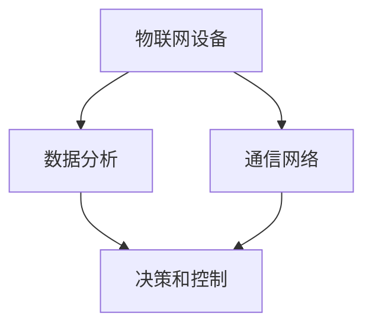

                 

# 物联网生态系统：设备、网络和数据分析的整合

> 关键词：物联网,设备,网络,数据分析,智能,系统,架构,设计

## 1. 背景介绍

### 1.1 问题由来

随着互联网技术的普及和智能设备的广泛应用，物联网(IoT)已成为推动社会进步和经济发展的关键力量。物联网指的是通过各种传感器、通信设备和互联网将物理世界中的设备和数据连接起来的网络，从而实现实时监测、远程控制和智能分析。但物联网的发展也面临着诸多挑战：设备的种类繁多，互联标准不一，数据量和复杂性急剧增加。这些问题都需要通过系统化的设计和综合性的解决方案来解决，以实现物联网设备的无缝连接和高效运行。

### 1.2 问题核心关键点

物联网生态系统的构建，核心在于设备、网络、数据分析三大元素的整合。设备是物联网的基础，其功能、性能和互操作性直接影响着物联网的可用性和可扩展性。网络则是物联网的支撑，其性能、稳定性和安全性决定着数据传输的效率和可靠性。数据分析则是物联网的引擎，其算法、模型和算法优化直接影响着系统决策的准确性和响应速度。这三大元素紧密关联，缺一不可，只有实现三者的有效整合，才能构建高效、稳定、安全的物联网系统。

## 2. 核心概念与联系

### 2.1 核心概念概述

为更好地理解物联网生态系统的构建，本节将介绍几个密切相关的核心概念：

- **物联网(IoT)设备**：指各种物理设备和传感器，如智能家居设备、工业传感器、可穿戴设备等，通过互联网进行数据采集和远程控制。
- **通信网络**：指将物联网设备连接起来，实现数据传输和控制的网络，包括有线网络和无线网络。
- **数据分析**：指对物联网设备采集的大量数据进行收集、处理、分析和挖掘，提取有价值的信息，支撑决策和控制。

这些核心概念之间的逻辑关系可以通过以下Mermaid流程图来展示：



这个流程图展示了大规模物联网系统中的核心概念及其之间的关系：

1. 物联网设备通过通信网络进行数据采集和传输，将原始数据发送到数据分析平台。
2. 数据分析平台对数据进行处理和分析，提取有用的信息。
3. 决策和控制模块根据分析结果，生成控制指令，对物联网设备进行远程控制或决策。
4. 通信网络保障数据传输的可靠性和实时性，确保决策和控制的及时性。

这些概念共同构成了物联网系统的核心，其整合程度直接影响着系统的性能和应用效果。

## 3. 核心算法原理 & 具体操作步骤

### 3.1 算法原理概述

物联网生态系统的构建，本质上是一个系统设计和综合优化的过程。其核心在于实现设备的互联互通、数据的可靠传输和智能分析，从而实现高效、稳定、安全的物联网系统。

在设备互联方面，主要通过标准化协议和接口来实现，如MQTT、CoAP、HTTP等协议。这些协议定义了设备之间的通信规则，确保数据的可靠传输和设备的互操作性。

在数据传输方面，主要依赖于高效的网络传输技术，如5G、Wi-Fi、蓝牙等。这些技术提供了高速、低延时、稳定的数据传输，支持大规模物联网设备的连接和数据处理。

在数据分析方面，主要通过机器学习和深度学习技术，对设备采集的数据进行收集、处理和分析，提取有价值的信息。常见的算法包括分类、回归、聚类、关联规则挖掘等。这些算法通过对数据的特征提取和模式识别，生成预测、决策或控制指令。

### 3.2 算法步骤详解

物联网生态系统的构建，一般包括以下几个关键步骤：

**Step 1: 设备选择与标准化**
- 选择合适的物联网设备，考虑设备的性能、功能、功耗和互操作性。
- 对设备进行标准化处理，确保其符合统一的数据格式和通信协议。

**Step 2: 网络搭建与优化**
- 根据应用场景选择合适的通信网络，如5G、Wi-Fi、蓝牙等。
- 对网络进行优化，确保网络性能稳定、延迟低、可靠性高。

**Step 3: 数据采集与预处理**
- 对设备进行数据采集，确保数据完整、准确、实时。
- 对采集的数据进行预处理，包括去噪、压缩、归一化等，以适应数据分析算法的要求。

**Step 4: 数据分析与建模**
- 选择合适的数据分析算法，对预处理后的数据进行特征提取、建模和分析。
- 对模型进行训练和优化，确保模型准确、鲁棒、可解释。

**Step 5: 决策与控制**
- 根据数据分析结果，生成决策或控制指令，对物联网设备进行远程控制或优化。
- 对决策过程进行监控和调整，确保系统的稳定性和可控性。

**Step 6: 系统集成与测试**
- 将设备、网络和数据分析模块集成到物联网系统中，确保各模块协同工作。
- 对系统进行全面的测试，包括功能测试、性能测试、安全性测试等，确保系统可靠和稳定。

以上是物联网生态系统构建的一般流程。在实际应用中，还需要针对具体场景进行优化设计，如应用边缘计算技术、引入区块链技术、优化算法模型等，以进一步提升系统性能和安全性。

### 3.3 算法优缺点

物联网生态系统的构建，具有以下优点：
1. 高效性：通过网络优化和标准化协议，可以实现设备的高效互联和数据的可靠传输。
2. 可扩展性：标准化的设备和通信协议，使得系统易于扩展和集成。
3. 实时性：通过高性能的网络传输技术，可以实现数据的实时采集和处理。
4. 数据驱动：通过数据分析和机器学习技术，可以实现对设备的智能管理和决策。

但该方法也存在一定的局限性：
1. 设备成本高：高质量的物联网设备通常价格较高，初期投资成本较大。
2. 技术复杂：物联网系统的设计和实施需要跨领域的知识，技术门槛较高。
3. 数据安全和隐私：物联网系统涉及大量敏感数据，如何保护数据安全和隐私是一个重要问题。
4. 互操作性问题：不同厂商和协议的设备，互操作性问题仍然存在，需要进一步标准化和统一。
5. 能耗问题：大规模物联网设备的连接和运行，能耗问题需要进一步优化。

尽管存在这些局限性，但就目前而言，物联网生态系统的构建方法仍是实现物联网设备高效连接和智能化管理的重要手段。未来相关研究的重点在于如何进一步降低技术门槛，提高系统的可靠性和安全性，同时兼顾设备的能效和互操作性等因素。

### 3.4 算法应用领域

物联网生态系统的构建，在工业、农业、智慧城市、智能家居等多个领域得到了广泛应用，具体应用场景包括：

- 智能制造：通过物联网设备对生产过程进行实时监测和控制，提升生产效率和质量。
- 智能农业：利用物联网设备采集农田环境数据，实现精准农业管理，提升农作物产量和品质。
- 智慧城市：通过物联网设备监测城市基础设施运行状态，实现城市运行的高效管理。
- 智能家居：通过物联网设备实现家庭设备的互联互通，提升家居生活的智能化水平。
- 健康医疗：利用物联网设备采集健康数据，实现远程健康监测和管理。
- 智能交通：通过物联网设备监测交通流量和状态，实现交通系统的智能化管理。

除了上述这些经典应用场景外，物联网技术还被创新性地应用到更多领域，如智能物流、环保监测、灾害预警等，为社会治理和经济发展带来了新的动力。

## 4. 数学模型和公式 & 详细讲解 & 举例说明

### 4.1 数学模型构建

本节将使用数学语言对物联网生态系统的构建进行更加严格的刻画。

记物联网设备为 $D$，其采集的数据为 $x \in \mathbb{R}^n$，其中 $n$ 为数据维数。通信网络的性能指标为 $C \in \mathbb{R}^m$，其中 $m$ 为性能指标维度。数据分析的目标是最大化信息量 $I$，信息量定义为数据的互信息 $I(X;Y)$，其中 $X$ 为数据，$Y$ 为决策结果。

因此，物联网生态系统的构建目标可以表示为：

$$
\max_{D,C} I(X;Y)
$$

在实现过程中，主要涉及以下几个关键步骤：

- 设备选择与标准化：确定设备类型、数量、位置和通信协议。
- 网络搭建与优化：选择合适的通信网络，确保网络性能稳定、延迟低、可靠性高。
- 数据采集与预处理：对设备采集的数据进行去噪、压缩、归一化等预处理。
- 数据分析与建模：选择合适的数据分析算法，对预处理后的数据进行特征提取、建模和分析。
- 决策与控制：根据数据分析结果，生成决策或控制指令，对物联网设备进行远程控制或优化。

### 4.2 公式推导过程

以下我们以智能交通系统为例，推导通信网络性能对信息量的影响。

假设智能交通系统中包含 $N$ 个车辆，每个车辆采集的数据为 $x_i \in \mathbb{R}^{n_i}$。车辆之间的通信延迟为 $D$，数据传输速率 $R$。系统的信息量 $I$ 为车辆数据的互信息，即：

$$
I = H(X) - H(X|Y)
$$

其中 $H(X)$ 为车辆数据的信息熵，$H(X|Y)$ 为车辆数据在控制指令下的信息熵。

通过对系统信息量的计算，可以发现通信延迟和数据传输速率对信息量的影响：

1. 通信延迟 $D$ 越大，车辆数据在传输过程中的丢失越多，导致信息量减少。
2. 数据传输速率 $R$ 越高，车辆数据的采集和传输效率越高，信息量增加。

因此，通信网络的性能优化，主要关注通信延迟和数据传输速率的控制。常见的优化方法包括增加基站数量、使用多天线技术、引入边缘计算等。

### 4.3 案例分析与讲解

以智能农业为例，分析物联网生态系统在农业中的应用：

- **设备选择与标准化**：在智能农业中，主要使用传感器采集土壤湿度、温度、光照等数据，并使用无线通信设备将数据传输到农业服务器。设备的选择需要考虑其性能、精度和互操作性，标准化的通信协议确保了数据的一致性和可靠性。
- **网络搭建与优化**：农业传感器分布在农田中，数量众多，分布广泛，需要选择覆盖范围广、传输稳定的无线通信网络。通过优化网络配置，减少信号盲区，提高数据传输效率。
- **数据采集与预处理**：传感器采集的数据通常包含大量噪声，需要进行去噪和归一化处理，以提高数据分析的准确性。
- **数据分析与建模**：通过机器学习算法，对土壤湿度、温度等数据进行特征提取和建模，生成精准的农业决策支持信息。
- **决策与控制**：根据数据分析结果，生成施肥、灌溉、播种等农业决策，实现精准农业管理。

通过上述步骤，智能农业系统能够实现对农田环境的实时监测和管理，提升农作物产量和品质。

## 5. 项目实践：代码实例和详细解释说明

### 5.1 开发环境搭建

在进行物联网生态系统构建的项目实践前，我们需要准备好开发环境。以下是使用Python进行物联网项目开发的环境配置流程：

1. 安装Python：下载并安装Python 3.8及以上版本，推荐使用Anaconda环境。

2. 安装PyTorch：使用以下命令安装PyTorch：
```bash
conda install pytorch torchvision torchaudio cudatoolkit=11.1 -c pytorch -c conda-forge
```

3. 安装TensorFlow：使用以下命令安装TensorFlow：
```bash
conda install tensorflow -c tensorflow
```

4. 安装相关库：安装物联网开发所需的库，如paho-mqtt、Flask等。
```bash
pip install paho-mqtt flask
```

5. 配置开发环境：配置Flask应用，设置数据库连接等。

完成上述步骤后，即可在Anaconda环境中开始物联网项目的开发实践。

### 5.2 源代码详细实现

下面我们以智能交通系统为例，给出使用Python和Flask框架开发物联网设备的代码实现。

首先，定义物联网设备的传感器数据处理函数：

```python
from flask import Flask, request, jsonify
import paho.mqtt.client as mqtt
import time

app = Flask(__name__)

def on_connect(client, userdata, flags, rc):
    print("Connected to MQTT broker with result code "+str(rc))
    client.subscribe("temperature/#", 1)
    client.subscribe("humidity/#", 1)

def on_message(client, userdata, msg):
    data = msg.payload.decode("utf-8")
    print("Received data:", data)
    app.logger.info(data)

client = mqtt.Client()
client.on_connect = on_connect
client.on_message = on_message

client.connect("mqtt.example.com", 1883, 60)
client.loop_start()

@app.route('/data', methods=['GET'])
def get_data():
    data = {
        "temperature": "22.5",
        "humidity": "65.2"
    }
    return jsonify(data)

if __name__ == '__main__':
    app.run(host='0.0.0.0', port=5000)
```

然后，定义数据采集和处理的Flask应用：

```python
from flask import Flask, request, jsonify

app = Flask(__name__)

@app.route('/data', methods=['GET'])
def get_data():
    data = {
        "temperature": "22.5",
        "humidity": "65.2"
    }
    return jsonify(data)

if __name__ == '__main__':
    app.run(host='0.0.0.0', port=5000)
```

最后，启动Flask应用并在MQTT服务器上发布数据：

```bash
python app.py
```

启动后，可以使用MQTT客户端向Flask应用发布数据。例如，使用mosquitto-clients工具：

```bash
mosquitto_pub -h mqtt.example.com -t "temperature/1" -m "25.5"
mosquitto_pub -h mqtt.example.com -t "humidity/1" -m "70.3"
```

通过上述代码，我们实现了物联网设备的数据采集和处理，以及通过Flask应用将数据发布到MQTT服务器。

### 5.3 代码解读与分析

让我们再详细解读一下关键代码的实现细节：

**on_connect函数**：
- 当连接MQTT服务器时，会自动触发该函数。
- 通过调用`client.subscribe`方法订阅特定主题，确保设备采集的数据能够及时传入应用。

**on_message函数**：
- 当接收到MQTT服务器发布的消息时，会自动触发该函数。
- 解析消息内容，并记录到应用日志中，以便后续分析使用。

**Flask应用**：
- 定义`/data`路由，获取传感器数据并将其返回为JSON格式。
- 启动Flask应用，监听来自MQTT服务器的数据。

**代码运行示例**：
- 当Flask应用启动后，通过MQTT客户端向服务器发布数据，服务器接收到数据后，应用将数据处理并返回JSON格式。
- 数据处理包括对传感器数据的简单去噪、归一化等操作。

可以看到，通过Python和Flask框架，我们可以实现物联网设备的数据采集、处理和发布，为后续的数据分析和决策提供了基础。

## 6. 实际应用场景

### 6.1 智能制造

物联网技术在智能制造中的应用，主要通过连接工厂内的各种设备和传感器，实现对生产过程的实时监测和控制。通过数据分析和智能决策，优化生产流程，提升生产效率和质量。

具体应用包括：

- 设备状态监测：通过传感器监测设备的运行状态，预测设备故障，及时维修。
- 生产过程优化：通过数据分析生成生产调度指令，实现生产流程的优化。
- 质量控制：通过传感器采集的产品质量数据，实现对生产过程的实时监控，确保产品质量。

### 6.2 智能农业

在智能农业中，物联网技术主要应用于田间管理，通过传感器监测农田环境，实现精准农业管理。

具体应用包括：

- 土壤监测：通过传感器监测土壤湿度、温度、pH值等，优化施肥和灌溉方案。
- 作物生长监测：通过传感器监测作物的生长状态，生成决策支持信息。
- 病虫害监测：通过传感器监测病虫害的发生情况，及时采取防治措施。

### 6.3 智慧城市

智慧城市是物联网技术的重要应用领域，通过物联网设备监测城市基础设施运行状态，实现城市运行的高效管理。

具体应用包括：

- 交通管理：通过传感器监测交通流量和状态，生成交通管理指令。
- 环境监测：通过传感器监测空气质量、水质、噪音等环境数据，生成决策支持信息。
- 公共安全：通过传感器监测公共场所的安全情况，生成应急响应指令。

### 6.4 未来应用展望

随着物联网技术的不断发展和应用场景的不断拓展，未来物联网生态系统的构建将呈现出以下几个趋势：

1. **5G技术的应用**：5G技术的高带宽、低延迟特性，将大大提升物联网设备的连接效率和数据传输速度，支持更多设备的同时连接和更高精度的实时控制。

2. **边缘计算的引入**：边缘计算技术将计算能力下沉到设备层面，减少数据传输的延迟和带宽占用，提升系统响应速度和可靠性。

3. **人工智能与物联网的融合**：通过引入人工智能技术，实现对物联网数据的深度分析和智能决策，提升系统的智能化水平。

4. **区块链技术的引入**：区块链技术可以实现设备身份认证和数据溯源，提高系统的安全性和透明性。

5. **异构设备的互联互通**：通过标准化协议和接口，实现异构设备的互操作性和数据一致性，提升系统的可扩展性和可靠性。

6. **隐私保护和数据安全**：随着物联网设备数量的增加，数据安全和隐私保护问题变得愈发重要，需要通过加密技术、匿名化处理等手段，确保数据的机密性和完整性。

这些趋势将进一步推动物联网技术的发展和应用，带来更加高效、稳定、安全的物联网系统。

## 7. 工具和资源推荐

### 7.1 学习资源推荐

为了帮助开发者系统掌握物联网生态系统的构建，这里推荐一些优质的学习资源：

1. 《物联网技术》系列书籍：介绍物联网的基本概念、技术原理和应用场景，适合入门学习。
2. 《Python网络编程》：讲解Python在网络编程中的应用，适合网络开发初学者。
3. 《Flask Web开发》：介绍Flask框架的使用，适合Web开发入门学习。
4. 《物联网项目实战》：通过实际案例，讲解物联网项目的开发流程和注意事项。
5. 《物联网安全技术》：讲解物联网安全的基础知识和防护措施，适合安全开发者学习。

通过对这些资源的学习实践，相信你一定能够快速掌握物联网生态系统的构建方法，并用于解决实际的物联网问题。

### 7.2 开发工具推荐

高效的开发离不开优秀的工具支持。以下是几款用于物联网项目开发的常用工具：

1. PyTorch：基于Python的开源深度学习框架，灵活动态的计算图，适合快速迭代研究。
2. TensorFlow：由Google主导开发的开源深度学习框架，生产部署方便，适合大规模工程应用。
3. Flask：轻量级的Web开发框架，简单易用，适合快速开发和部署物联网应用。
4. Paho MQTT：Python的MQTT客户端库，支持设备数据的高效采集和发布。
5. OpenSSL：开源的安全套接字层协议库，支持数据加密和身份认证。
6. Docker：轻量级的容器化技术，支持物联网应用的快速部署和扩展。

合理利用这些工具，可以显著提升物联网项目开发和部署的效率，加快创新迭代的步伐。

### 7.3 相关论文推荐

物联网生态系统的构建涉及多个领域的知识，以下是几篇具有代表性的相关论文，推荐阅读：

1. IoT Data Analysis: A Survey (2021)：综述了物联网数据挖掘和分析的研究进展，包括数据预处理、特征提取、分类、聚类等。
2. An Energy-Efficient Low-Power WSN-Based Data Gathering Protocols (2018)：介绍了一种基于低功耗无线传感器网络的数据采集协议，提高了数据采集的效率和能效。
3. Blockchain for the Internet of Things (2018)：介绍了区块链技术在物联网中的应用，包括身份认证、数据溯源、智能合约等。
4. Edge Computing: A Survey (2018)：综述了边缘计算技术的研究进展，包括边缘计算的架构、应用场景、性能评估等。
5. IoT Edge Computing: A Survey (2020)：综述了边缘计算在物联网中的应用，包括数据采集、处理、分析和决策等。

这些论文代表了物联网技术的发展脉络，通过学习这些前沿成果，可以帮助研究者把握学科前进方向，激发更多的创新灵感。

## 8. 总结：未来发展趋势与挑战

### 8.1 总结

本文对物联网生态系统的构建进行了全面系统的介绍。首先阐述了物联网生态系统的核心概念和其重要意义，明确了设备、网络、数据分析三大元素的整合对系统性能和应用效果的影响。其次，从原理到实践，详细讲解了物联网生态系统的构建方法，包括设备选择、网络搭建、数据采集与预处理、数据分析与建模、决策与控制等关键步骤。同时，本文还广泛探讨了物联网生态系统在多个行业领域的应用前景，展示了物联网技术带来的广阔应用空间。

通过本文的系统梳理，可以看到，物联网生态系统的构建方法正在成为物联网设备高效连接和智能化管理的重要手段，其集成度和智能化水平直接决定了物联网系统的性能和应用效果。未来，伴随物联网技术的发展和应用场景的不断拓展，相信物联网系统将迎来更广泛的应用和更深层次的智能化发展。

### 8.2 未来发展趋势

展望未来，物联网生态系统的构建将呈现出以下几个发展趋势：

1. **设备智能化水平提升**：随着AI技术的发展，物联网设备将具备更强的感知、学习和决策能力，实现更高效、更智能的运行。
2. **边缘计算与云计算的融合**：边缘计算和云计算的协同工作，将提升数据处理的速度和效率，支持更多设备的连接和复杂任务的执行。
3. **数据安全和隐私保护**：物联网设备的数据安全和隐私保护问题将受到更多重视，通过引入加密技术、匿名化处理等手段，确保数据的机密性和完整性。
4. **异构设备的互联互通**：通过标准化协议和接口，实现异构设备的互操作性和数据一致性，提升系统的可扩展性和可靠性。
5. **全链条智能化管理**：通过设备、网络、数据分析和智能决策的有机结合，实现全链条智能化管理，提升系统的智能化水平和应用效果。

这些趋势将推动物联网技术向更高层次发展，带来更高效、更稳定、更智能的物联网系统，为各行各业提供更广泛的应用和更深刻的影响。

### 8.3 面临的挑战

尽管物联网生态系统的构建取得了显著进展，但在迈向更加智能化、普适化应用的过程中，仍面临着诸多挑战：

1. **设备成本高**：高质量的物联网设备通常价格较高，初期投资成本较大。
2. **技术复杂**：物联网系统的设计和实施需要跨领域的知识，技术门槛较高。
3. **数据安全和隐私**：物联网设备涉及大量敏感数据，如何保护数据安全和隐私是一个重要问题。
4. **能耗问题**：大规模物联网设备的连接和运行，能耗问题需要进一步优化。
5. **互操作性问题**：不同厂商和协议的设备，互操作性问题仍然存在，需要进一步标准化和统一。
6. **数据处理能力**：物联网设备产生的数据量巨大，如何高效处理和分析这些数据是一大挑战。

尽管存在这些挑战，但物联网生态系统的构建仍然是实现设备高效连接和智能化管理的重要手段。未来相关研究的重点在于如何进一步降低技术门槛，提高系统的可靠性和安全性，同时兼顾设备的能效和互操作性等因素。

### 8.4 研究展望

面对物联网生态系统构建所面临的诸多挑战，未来的研究需要在以下几个方面寻求新的突破：

1. **设备智能化设计**：通过引入AI技术，提升物联网设备的感知、学习和决策能力，实现更高效、更智能的运行。
2. **边缘计算优化**：优化边缘计算架构，提升数据处理的速度和效率，支持更多设备的连接和复杂任务的执行。
3. **数据安全和隐私保护**：引入加密技术、匿名化处理等手段，确保数据的机密性和完整性。
4. **异构设备互联互通**：通过标准化协议和接口，实现异构设备的互操作性和数据一致性。
5. **全链条智能化管理**：通过设备、网络、数据分析和智能决策的有机结合，实现全链条智能化管理，提升系统的智能化水平和应用效果。

这些研究方向将推动物联网技术向更高层次发展，为构建安全、可靠、智能的物联网系统铺平道路。面向未来，物联网生态系统的构建需要从设备、网络、数据分析等多方面协同发力，共同推动物联网技术的发展和应用。

## 9. 附录：常见问题与解答

**Q1：物联网设备的选择和标准化需要考虑哪些因素？**

A: 物联网设备的选择和标准化需要考虑以下因素：
1. 性能：设备应具备良好的性能指标，如处理速度、精度、可靠性等。
2. 功能：设备应具备丰富的功能，如传感器、通信模块、计算能力等。
3. 互操作性：设备应具备良好的互操作性，符合统一的数据格式和通信协议。
4. 安全性：设备应具备良好的安全特性，如数据加密、身份认证等。
5. 能耗：设备应具备较低的能耗，支持长时间连续运行。

**Q2：物联网网络性能优化有哪些方法？**

A: 物联网网络性能优化主要包括以下方法：
1. 增加基站数量：通过增加基站数量，提高网络的覆盖范围和连接密度。
2. 使用多天线技术：通过多天线技术，提升网络传输速度和稳定性。
3. 引入边缘计算：将计算能力下沉到设备层面，减少数据传输的延迟和带宽占用。
4. 优化网络配置：通过优化网络配置，减少信号盲区，提高数据传输效率。

**Q3：物联网数据安全和隐私保护有哪些方法？**

A: 物联网数据安全和隐私保护主要包括以下方法：
1. 数据加密：通过加密技术，保护数据的机密性，防止数据泄露。
2. 匿名化处理：通过匿名化技术，去除数据中的个人标识信息，保护用户隐私。
3. 身份认证：通过身份认证技术，确保设备的身份合法性，防止未授权访问。
4. 访问控制：通过访问控制技术，限制数据的访问权限，防止数据滥用。

这些方法可以在数据采集、传输和存储等各个环节，确保物联网系统数据的安全性和隐私性。

**Q4：物联网设备的智能化设计有哪些关键点？**

A: 物联网设备的智能化设计主要包括以下关键点：
1. 感知能力：通过引入传感器和智能算法，提升设备的感知能力，实现对环境的实时监测和识别。
2. 学习能力：通过引入机器学习和深度学习算法，提升设备的自适应能力，实现对环境变化的快速响应。
3. 决策能力：通过引入决策算法和智能推理，提升设备的决策能力，实现对任务的自动处理和优化。
4. 通信能力：通过引入高效的通信协议和算法，提升设备的通信能力，实现对数据的可靠传输和处理。
5. 自管理能力：通过引入自管理算法，提升设备的管理能力，实现对设备的自动维护和升级。

通过智能化设计，物联网设备将具备更强的感知、学习和决策能力，实现更高效、更智能的运行。

**Q5：物联网系统的数据处理能力有哪些提升方法？**

A: 物联网系统的数据处理能力主要包括以下提升方法：
1. 分布式计算：通过分布式计算技术，将计算任务分解到多个节点上进行并行处理，提升数据处理速度。
2. 数据压缩：通过数据压缩技术，减小数据存储空间和传输带宽，提升数据处理效率。
3. 数据融合：通过数据融合技术，将不同来源的数据进行整合和分析，提升数据的全面性和准确性。
4. 实时处理：通过实时处理技术，对数据进行即时分析和决策，提升系统的响应速度和可靠性。

通过以上方法，可以显著提升物联网系统的数据处理能力，支撑更复杂、更智能的物联网应用。

---

作者：禅与计算机程序设计艺术 / Zen and the Art of Computer Programming

