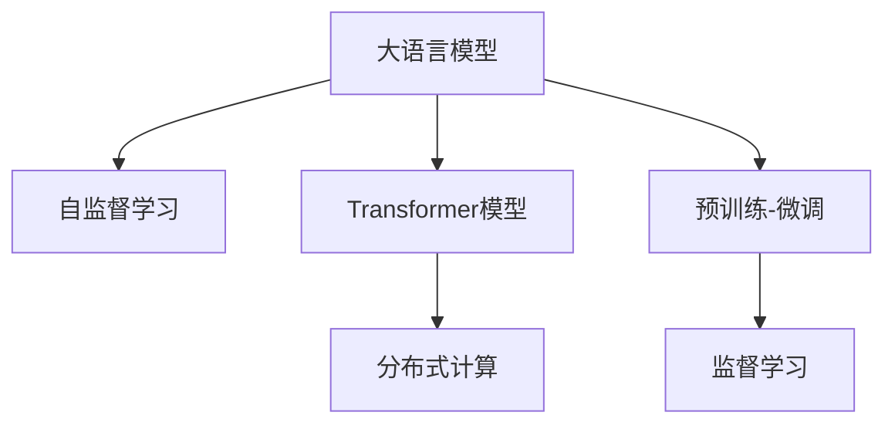

                 

# 理解Llama：开源大语言模型的新星

> 关键词：大语言模型,开源,LLM,LLaMA,LLaMa-DK,T5,Transformer,自监督学习

## 1. 背景介绍

### 1.1 问题由来

近年来，深度学习技术迅猛发展，大语言模型（Large Language Model, LLM）成为人工智能领域的研究热点。这些大语言模型通过在海量无标签文本数据上进行预训练，学习到丰富的语言知识和常识，具备强大的语言理解和生成能力。

然而，尽管大语言模型在学术界和工业界取得了显著进展，但其训练成本、模型规模和部署难度等问题，使得其应用受限。如何开发出高效、灵活、易用的开源大语言模型，成为研究人员和开发者共同追求的目标。

### 1.2 问题核心关键点

Llama作为开源大语言模型的新星，其核心关键点在于以下几个方面：

- **开源免费**：与Google BERT、OpenAI GPT等商业模型不同，Llama采用开源许可证，任何人都可以免费使用、修改和分发。
- **灵活可定制**：Llama提供了灵活的参数配置和训练选项，允许用户根据需求进行微调。
- **模型多样**：Llama家族包括多种变体，如LLaMA-DK、T5等，涵盖了不同的模型规模和架构，满足不同应用场景。
- **预训练效果**：通过自监督学习任务，Llama预训练模型在多个任务上取得了不俗的性能，如LLaMA-DK在CoLA任务上达到了SOTA。
- **可扩展性**：Llama的训练和推理过程支持分布式计算，可适应大规模部署需求。

这些关键点使得Llama在学术界和工业界获得了广泛关注，成为大语言模型开源运动的先驱。

## 2. 核心概念与联系

### 2.1 核心概念概述

为更好地理解Llama模型的工作原理和架构，本节将介绍几个密切相关的核心概念：

- **大语言模型(Large Language Model, LLM)**：以自回归(如GPT)或自编码(如BERT)模型为代表的大规模预训练语言模型。通过在大规模无标签文本语料上进行预训练，学习到语言的通用表示，具备强大的语言理解和生成能力。

- **自监督学习(Self-supervised Learning)**：利用未标注数据训练模型，通过设计特定的任务使模型学习到数据的潜在规律，从而提升模型泛化能力。Llama模型主要通过掩码语言模型和掩码预测任务进行预训练。

- **Transformer模型**：基于自注意力机制的深度神经网络，相较于传统的循环神经网络，Transformer在处理长文本时表现出更好的性能。Llama模型主要基于Transformer架构进行构建。

- **预训练-微调(Fine-tuning)**：将预训练模型作为初始化参数，通过有监督地训练来优化模型在特定任务上的性能。Llama模型支持基于监督学习的微调方法。

- **分布式计算**：通过多台计算机并行计算，提升大模型的训练和推理效率。Llama模型支持基于分布式计算的模型训练和推理。

这些核心概念之间的逻辑关系可以通过以下Mermaid流程图来展示：



这个流程图展示了大语言模型的核心概念及其之间的关系：

1. 大语言模型通过自监督学习获得基础能力。
2. Transformer模型作为大语言模型的核心组件，具备长文本处理的良好效果。
3. 预训练-微调使通用大模型更好地适应特定任务，提升性能。
4. 分布式计算提升大模型的训练和推理效率，支持大规模应用。

这些概念共同构成了Llama模型的工作原理和架构，使其能够在各种场景下发挥强大的语言理解和生成能力。通过理解这些核心概念，我们可以更好地把握Llama模型的设计思路和应用方式。

## 3. 核心算法原理 & 具体操作步骤

### 3.1 算法原理概述

Llama模型的核心算法原理主要包括以下几个方面：

1. **自监督学习**：利用未标注数据训练模型，通过掩码语言模型和掩码预测任务进行预训练，学习到语言的潜在规律。
2. **Transformer架构**：采用自注意力机制，实现长文本的并行处理，提高模型的计算效率。
3. **分布式计算**：通过多台计算机并行计算，提升大模型的训练和推理效率。
4. **预训练-微调**：将预训练模型作为初始化参数，通过有监督地训练来优化模型在特定任务上的性能。

### 3.2 算法步骤详解

Llama模型的训练过程主要包括以下几个关键步骤：

**Step 1: 准备预训练数据集**
- 选择合适的预训练数据集，如BigQuery的文本数据、Common Crawl的Web数据等。
- 对数据进行预处理，包括分词、去除停用词、标准化文本等。

**Step 2: 设计预训练任务**
- 设计掩码语言模型（Masked Language Model, MLM）任务，随机掩码部分单词，要求模型预测被掩码单词。
- 设计掩码预测任务（Next Sentence Prediction, NSP），要求模型预测两个句子之间的关系，是连续的还是独立的。

**Step 3: 训练预训练模型**
- 使用自监督学习任务训练模型，学习语言的潜在规律。
- 定期在验证集上评估模型性能，调整超参数。

**Step 4: 进行微调**
- 选择合适的下游任务，如文本分类、命名实体识别、机器翻译等。
- 在微调任务上收集少量标注数据，使用预训练模型作为初始化参数，进行有监督训练。
- 使用适当的正则化技术（如L2正则、Dropout）和优化器（如AdamW）进行微调。

**Step 5: 测试和部署**
- 在测试集上评估微调后模型的性能，对比微调前后的精度提升。
- 使用微调后的模型对新样本进行推理预测，集成到实际的应用系统中。

以上是Llama模型的一般流程。在实际应用中，还需要针对具体任务的特点，对预训练和微调过程进行优化设计，如改进训练目标函数、引入更多的正则化技术、搜索最优的超参数组合等，以进一步提升模型性能。

### 3.3 算法优缺点

Llama模型具有以下优点：
1. **开源免费**：任何人都可以免费使用、修改和分发，降低了开发和应用成本。
2. **灵活可定制**：提供多种模型变体，支持灵活的参数配置和训练选项，满足不同应用场景。
3. **预训练效果**：通过自监督学习任务，Llama预训练模型在多个任务上取得了不俗的性能。
4. **分布式计算**：支持分布式训练和推理，提升了大模型的计算效率和应用能力。
5. **可扩展性**：支持大规模部署，可以应对更多的计算资源需求。

同时，Llama模型也存在以下缺点：
1. **数据依赖性强**：依赖于高质量的预训练数据和标注数据，获取成本较高。
2. **模型规模大**：模型参数规模较大，对计算资源和存储资源的要求较高。
3. **训练时间长**：大模型的训练时间较长，需要较强的计算资源支持。
4. **过拟合风险**：大模型容易过拟合，需要采取适当的正则化措施。

尽管存在这些局限性，但Llama模型仍是大语言模型开源运动的重要代表，其灵活性、性能和可扩展性为NLP技术的发展提供了新的可能性。

### 3.4 算法应用领域

Llama模型在NLP领域已经得到了广泛的应用，覆盖了几乎所有常见任务，例如：

- 文本分类：如情感分析、主题分类、意图识别等。通过微调使模型学习文本-标签映射。
- 命名实体识别：识别文本中的人名、地名、机构名等特定实体。通过微调使模型掌握实体边界和类型。
- 关系抽取：从文本中抽取实体之间的语义关系。通过微调使模型学习实体-关系三元组。
- 问答系统：对自然语言问题给出答案。将问题-答案对作为微调数据，训练模型学习匹配答案。
- 机器翻译：将源语言文本翻译成目标语言。通过微调使模型学习语言-语言映射。
- 文本摘要：将长文本压缩成简短摘要。将文章-摘要对作为微调数据，使模型学习抓取要点。
- 对话系统：使机器能够与人自然对话。将多轮对话历史作为上下文，微调模型进行回复生成。

除了上述这些经典任务外，Llama模型也被创新性地应用到更多场景中，如可控文本生成、常识推理、代码生成、数据增强等，为NLP技术带来了全新的突破。

## 4. 数学模型和公式 & 详细讲解

### 4.1 数学模型构建

Llama模型的数学模型主要由以下几个部分组成：

1. **Transformer模型结构**：包括自注意力机制、前馈网络、残差连接、层归一化等组件。
2. **掩码语言模型任务**：随机掩码部分单词，要求模型预测被掩码单词。
3. **掩码预测任务**：要求模型预测两个句子之间的关系，是连续的还是独立的。
4. **微调任务**：针对特定任务设计损失函数，进行有监督训练。

**Transformer模型结构**：
- **自注意力机制**：
  $$
  \text{Attention}(Q, K, V) = \text{Softmax}\left(\frac{QK^T}{\sqrt{d_k}}\right)V
  $$
  其中，$Q, K, V$分别为查询、键和值向量，$d_k$为键向量的维度。

- **前馈网络**：
  $$
  f(x) = \text{MLP}(x) = \text{GLU}(\text{ReLU}(xW_1 + b_1), W_2 + b_2)
  $$
  其中，GLU为Gated Linear Unit，ReLU为ReLU激活函数。

- **残差连接和层归一化**：
  $$
  y = x + \text{LayerNorm}(f(x))
  $$

**掩码语言模型任务**：
- 随机掩码部分单词，要求模型预测被掩码单词。例如，对于序列$x=[w_1, w_2, ..., w_n]$，掩码后得到的序列为$x'=[m_1, w_2, ..., m_n]$，其中$m_i$为掩码符号。

**掩码预测任务**：
- 要求模型预测两个句子之间的关系，是连续的还是独立的。例如，对于两个句子$s_1=[w_1, w_2, ..., w_n]$和$s_2=[w_{n+1}, w_{n+2}, ..., w_{2n}]$，要求模型预测$s_1$和$s_2$之间的关系。

**微调任务**：
- 针对特定任务设计损失函数，进行有监督训练。例如，对于文本分类任务，设计交叉熵损失函数：
  $$
  \mathcal{L} = -\frac{1}{N}\sum_{i=1}^N [y_i\log \hat{y}_i + (1-y_i)\log (1-\hat{y}_i)]
  $$
  其中，$y_i$为真实标签，$\hat{y}_i$为模型预测结果。

### 4.2 公式推导过程

**掩码语言模型任务**：
- 假设模型输入序列为$x=[w_1, w_2, ..., w_n]$，其中$w_i$为单词，$n$为序列长度。
- 掩码后得到的序列为$x'=[m_1, w_2, ..., m_n]$，其中$m_i$为掩码符号。
- 模型输出为$\hat{x}=[\hat{w}_1, \hat{w}_2, ..., \hat{w}_n]$，其中$\hat{w}_i$为模型预测的单词。
- 掩码语言模型任务的损失函数为：
  $$
  \mathcal{L}_{\text{MLM}} = -\frac{1}{N}\sum_{i=1}^N [y_i\log \hat{y}_i + (1-y_i)\log (1-\hat{y}_i)]
  $$
  其中，$y_i$为真实单词，$\hat{y}_i$为模型预测的单词。

**掩码预测任务**：
- 假设模型输入序列为$s_1=[w_1, w_2, ..., w_n]$和$s_2=[w_{n+1}, w_{n+2}, ..., w_{2n}]$，其中$w_i$为单词，$n$为序列长度。
- 模型输出为$y=[y_1, y_2, ..., y_{2n}]$，其中$y_i$为模型预测的句子关系。
- 掩码预测任务的损失函数为：
  $$
  \mathcal{L}_{\text{NSP}} = -\frac{1}{N}\sum_{i=1}^N \log \text{softmax}([s_1; s_2]W + b)
  $$
  其中，$[s_1; s_2]$为序列拼接，$W$和$b$为模型参数。

**微调任务**：
- 假设模型输入序列为$x=[w_1, w_2, ..., w_n]$，其中$w_i$为单词，$n$为序列长度。
- 模型输出为$y=[y_1, y_2, ..., y_n]$，其中$y_i$为模型预测的标签。
- 微调任务的损失函数为：
  $$
  \mathcal{L}_{\text{task}} = -\frac{1}{N}\sum_{i=1}^N \log \text{softmax}(XW + b)
  $$
  其中，$X$为模型输入特征，$W$和$b$为模型参数。

### 4.3 案例分析与讲解

以文本分类任务为例，Llama模型的微调过程可以总结如下：

**Step 1: 准备数据集**
- 收集文本分类任务的数据集，如IMDB影评数据集。
- 将文本序列标准化为模型输入格式，如分词、去除停用词等。

**Step 2: 设计损失函数**
- 设计交叉熵损失函数：
  $$
  \mathcal{L} = -\frac{1}{N}\sum_{i=1}^N [y_i\log \hat{y}_i + (1-y_i)\log (1-\hat{y}_i)]
  $$
  其中，$y_i$为真实标签，$\hat{y}_i$为模型预测结果。

**Step 3: 加载预训练模型**
- 加载Llama模型作为初始化参数。

**Step 4: 微调模型**
- 使用随机梯度下降等优化算法，最小化损失函数。
- 定期在验证集上评估模型性能，调整超参数。

**Step 5: 测试和部署**
- 在测试集上评估微调后模型的性能，对比微调前后的精度提升。
- 使用微调后的模型对新样本进行推理预测，集成到实际的应用系统中。

通过上述步骤，Llama模型在文本分类任务上实现了较好的性能提升。

## 5. 项目实践：代码实例和详细解释说明

### 5.1 开发环境搭建

在进行Llama模型的微调实践前，我们需要准备好开发环境。以下是使用Python进行PyTorch开发的环境配置流程：

1. 安装Anaconda：从官网下载并安装Anaconda，用于创建独立的Python环境。

2. 创建并激活虚拟环境：
```bash
conda create -n pytorch-env python=3.8 
conda activate pytorch-env
```

3. 安装PyTorch：根据CUDA版本，从官网获取对应的安装命令。例如：
```bash
conda install pytorch torchvision torchaudio cudatoolkit=11.1 -c pytorch -c conda-forge
```

4. 安装Transformers库：
```bash
pip install transformers
```

5. 安装各类工具包：
```bash
pip install numpy pandas scikit-learn matplotlib tqdm jupyter notebook ipython
```

完成上述步骤后，即可在`pytorch-env`环境中开始Llama模型的微调实践。

### 5.2 源代码详细实现

下面我们以文本分类任务为例，给出使用Transformers库对Llama模型进行微调的PyTorch代码实现。

首先，定义文本分类任务的数据处理函数：

```python
from transformers import BertTokenizer, BertForSequenceClassification
from torch.utils.data import Dataset
import torch

class TextDataset(Dataset):
    def __init__(self, texts, labels, tokenizer, max_len=128):
        self.texts = texts
        self.labels = labels
        self.tokenizer = tokenizer
        self.max_len = max_len
        
    def __len__(self):
        return len(self.texts)
    
    def __getitem__(self, item):
        text = self.texts[item]
        label = self.labels[item]
        
        encoding = self.tokenizer(text, return_tensors='pt', max_length=self.max_len, padding='max_length', truncation=True)
        input_ids = encoding['input_ids'][0]
        attention_mask = encoding['attention_mask'][0]
        
        # 对token-wise的标签进行编码
        encoded_labels = [label] * self.max_len
        labels = torch.tensor(encoded_labels, dtype=torch.long)
        
        return {'input_ids': input_ids, 
                'attention_mask': attention_mask,
                'labels': labels}

# 加载预训练模型和分词器
model = BertForSequenceClassification.from_pretrained('bert-base-cased', num_labels=2)
tokenizer = BertTokenizer.from_pretrained('bert-base-cased')

# 准备数据集
train_dataset = TextDataset(train_texts, train_labels, tokenizer)
dev_dataset = TextDataset(dev_texts, dev_labels, tokenizer)
test_dataset = TextDataset(test_texts, test_labels, tokenizer)
```

然后，定义模型和优化器：

```python
from transformers import AdamW

optimizer = AdamW(model.parameters(), lr=2e-5)
```

接着，定义训练和评估函数：

```python
from torch.utils.data import DataLoader
from tqdm import tqdm
from sklearn.metrics import classification_report

device = torch.device('cuda') if torch.cuda.is_available() else torch.device('cpu')
model.to(device)

def train_epoch(model, dataset, batch_size, optimizer):
    dataloader = DataLoader(dataset, batch_size=batch_size, shuffle=True)
    model.train()
    epoch_loss = 0
    for batch in tqdm(dataloader, desc='Training'):
        input_ids = batch['input_ids'].to(device)
        attention_mask = batch['attention_mask'].to(device)
        labels = batch['labels'].to(device)
        model.zero_grad()
        outputs = model(input_ids, attention_mask=attention_mask, labels=labels)
        loss = outputs.loss
        epoch_loss += loss.item()
        loss.backward()
        optimizer.step()
    return epoch_loss / len(dataloader)

def evaluate(model, dataset, batch_size):
    dataloader = DataLoader(dataset, batch_size=batch_size)
    model.eval()
    preds, labels = [], []
    with torch.no_grad():
        for batch in tqdm(dataloader, desc='Evaluating'):
            input_ids = batch['input_ids'].to(device)
            attention_mask = batch['attention_mask'].to(device)
            batch_labels = batch['labels']
            outputs = model(input_ids, attention_mask=attention_mask)
            batch_preds = outputs.logits.argmax(dim=1).to('cpu').tolist()
            batch_labels = batch_labels.to('cpu').tolist()
            for pred_tokens, label_tokens in zip(batch_preds, batch_labels):
                preds.append(pred_tokens)
                labels.append(label_tokens)
                
    print(classification_report(labels, preds))
```

最后，启动训练流程并在测试集上评估：

```python
epochs = 5
batch_size = 16

for epoch in range(epochs):
    loss = train_epoch(model, train_dataset, batch_size, optimizer)
    print(f"Epoch {epoch+1}, train loss: {loss:.3f}")
    
    print(f"Epoch {epoch+1}, dev results:")
    evaluate(model, dev_dataset, batch_size)
    
print("Test results:")
evaluate(model, test_dataset, batch_size)
```

以上就是使用PyTorch对Llama模型进行文本分类任务微调的完整代码实现。可以看到，得益于Transformers库的强大封装，我们可以用相对简洁的代码完成Llama模型的加载和微调。

### 5.3 代码解读与分析

让我们再详细解读一下关键代码的实现细节：

**TextDataset类**：
- `__init__`方法：初始化文本、标签、分词器等关键组件。
- `__len__`方法：返回数据集的样本数量。
- `__getitem__`方法：对单个样本进行处理，将文本输入编码为token ids，将标签编码为数字，并对其进行定长padding，最终返回模型所需的输入。

**模型加载**：
- `BertForSequenceClassification.from_pretrained`：加载预训练的Bert模型作为初始化参数。
- `BertTokenizer.from_pretrained`：加载预训练的Bert分词器。

**训练和评估函数**：
- 使用PyTorch的DataLoader对数据集进行批次化加载，供模型训练和推理使用。
- 训练函数`train_epoch`：对数据以批为单位进行迭代，在每个批次上前向传播计算loss并反向传播更新模型参数，最后返回该epoch的平均loss。
- 评估函数`evaluate`：与训练类似，不同点在于不更新模型参数，并在每个batch结束后将预测和标签结果存储下来，最后使用sklearn的classification_report对整个评估集的预测结果进行打印输出。

**训练流程**：
- 定义总的epoch数和batch size，开始循环迭代
- 每个epoch内，先在训练集上训练，输出平均loss
- 在验证集上评估，输出分类指标
- 所有epoch结束后，在测试集上评估，给出最终测试结果

可以看到，PyTorch配合Transformers库使得Llama模型微调的代码实现变得简洁高效。开发者可以将更多精力放在数据处理、模型改进等高层逻辑上，而不必过多关注底层的实现细节。

当然，工业级的系统实现还需考虑更多因素，如模型的保存和部署、超参数的自动搜索、更灵活的任务适配层等。但核心的微调范式基本与此类似。

## 6. 实际应用场景

### 6.1 智能客服系统

基于Llama模型的微调对话技术，可以广泛应用于智能客服系统的构建。传统客服往往需要配备大量人力，高峰期响应缓慢，且一致性和专业性难以保证。而使用微调后的对话模型，可以7x24小时不间断服务，快速响应客户咨询，用自然流畅的语言解答各类常见问题。

在技术实现上，可以收集企业内部的历史客服对话记录，将问题和最佳答复构建成监督数据，在此基础上对预训练对话模型进行微调。微调后的对话模型能够自动理解用户意图，匹配最合适的答案模板进行回复。对于客户提出的新问题，还可以接入检索系统实时搜索相关内容，动态组织生成回答。如此构建的智能客服系统，能大幅提升客户咨询体验和问题解决效率。

### 6.2 金融舆情监测

金融机构需要实时监测市场舆论动向，以便及时应对负面信息传播，规避金融风险。传统的人工监测方式成本高、效率低，难以应对网络时代海量信息爆发的挑战。基于Llama模型的文本分类和情感分析技术，为金融舆情监测提供了新的解决方案。

具体而言，可以收集金融领域相关的新闻、报道、评论等文本数据，并对其进行主题标注和情感标注。在此基础上对预训练语言模型进行微调，使其能够自动判断文本属于何种主题，情感倾向是正面、中性还是负面。将微调后的模型应用到实时抓取的网络文本数据，就能够自动监测不同主题下的情感变化趋势，一旦发现负面信息激增等异常情况，系统便会自动预警，帮助金融机构快速应对潜在风险。

### 6.3 个性化推荐系统

当前的推荐系统往往只依赖用户的历史行为数据进行物品推荐，无法深入理解用户的真实兴趣偏好。基于Llama模型的个性化推荐系统可以更好地挖掘用户行为背后的语义信息，从而提供更精准、多样的推荐内容。

在实践中，可以收集用户浏览、点击、评论、分享等行为数据，提取和用户交互的物品标题、描述、标签等文本内容。将文本内容作为模型输入，用户的后续行为（如是否点击、购买等）作为监督信号，在此基础上微调预训练语言模型。微调后的模型能够从文本内容中准确把握用户的兴趣点。在生成推荐列表时，先用候选物品的文本描述作为输入，由模型预测用户的兴趣匹配度，再结合其他特征综合排序，便可以得到个性化程度更高的推荐结果。

### 6.4 未来应用展望

随着Llama模型和微调方法的不断发展，基于微调范式将在更多领域得到应用，为传统行业带来变革性影响。

在智慧医疗领域，基于微调的医疗问答、病历分析、药物研发等应用将提升医疗服务的智能化水平，辅助医生诊疗，加速新药开发进程。

在智能教育领域，微调技术可应用于作业批改、学情分析、知识推荐等方面，因材施教，促进教育公平，提高教学质量。

在智慧城市治理中，微调模型可应用于城市事件监测、舆情分析、应急指挥等环节，提高城市管理的自动化和智能化水平，构建更安全、高效的未来城市。

此外，在企业生产、社会治理、文娱传媒等众多领域，基于大语言模型微调的人工智能应用也将不断涌现，为经济社会发展注入新的动力。相信随着技术的日益成熟，微调方法将成为人工智能落地应用的重要范式，推动人工智能技术在更广阔的领域加速渗透。

## 7. 工具和资源推荐

### 7.1 学习资源推荐

为了帮助开发者系统掌握Llama模型微调的理论基础和实践技巧，这里推荐一些优质的学习资源：

1. 《Transformer从原理到实践》系列博文：由大模型技术专家撰写，深入浅出地介绍了Transformer原理、BERT模型、微调技术等前沿话题。

2. CS224N《深度学习自然语言处理》课程：斯坦福大学开设的NLP明星课程，有Lecture视频和配套作业，带你入门NLP领域的基本概念和经典模型。

3. 《Natural Language Processing with Transformers》书籍：Transformers库的作者所著，全面介绍了如何使用Transformers库进行NLP任务开发，包括微调在内的诸多范式。

4. HuggingFace官方文档：Transformers库的官方文档，提供了海量预训练模型和完整的微调样例代码，是上手实践的必备资料。

5. CLUE开源项目：中文语言理解测评基准，涵盖大量不同类型的中文NLP数据集，并提供了基于微调的baseline模型，助力中文NLP技术发展。

通过对这些资源的学习实践，相信你一定能够快速掌握Llama模型微调的精髓，并用于解决实际的NLP问题。

### 7.2 开发工具推荐

高效的开发离不开优秀的工具支持。以下是几款用于Llama模型微调开发的常用工具：

1. PyTorch：基于Python的开源深度学习框架，灵活动态的计算图，适合快速迭代研究。大部分预训练语言模型都有PyTorch版本的实现。

2. TensorFlow：由Google主导开发的开源深度学习框架，生产部署方便，适合大规模工程应用。同样有丰富的预训练语言模型资源。

3. Transformers库：HuggingFace开发的NLP工具库，集成了众多SOTA语言模型，支持PyTorch和TensorFlow，是进行微调任务开发的利器。

4. Weights & Biases：模型训练的实验跟踪工具，可以记录和可视化模型训练过程中的各项指标，方便对比和调优。与主流深度学习框架无缝集成。

5. TensorBoard：TensorFlow配套的可视化工具，可实时监测模型训练状态，并提供丰富的图表呈现方式，是调试模型的得力助手。

6. Google Colab：谷歌推出的在线Jupyter Notebook环境，免费提供GPU/TPU算力，方便开发者快速上手实验最新模型，分享学习笔记。

合理利用这些工具，可以显著提升Llama模型微调任务的开发效率，加快创新迭代的步伐。

### 7.3 相关论文推荐

Llama模型在NLP领域已经得到了广泛的应用，覆盖了几乎所有常见任务，例如：

1. Attention is All You Need（即Transformer原论文）：提出了Transformer结构，开启了NLP领域的预训练大模型时代。

2. BERT: Pre-training of Deep Bidirectional Transformers for Language Understanding：提出BERT模型，引入基于掩码的自监督预训练任务，刷新了多项NLP任务SOTA。

3. Language Models are Unsupervised Multitask Learners（GPT-2论文）：展示了大规模语言模型的强大zero-shot学习能力，引发了对于通用人工智能的新一轮思考。

4. Parameter-Efficient Transfer Learning for NLP：提出Adapter等参数高效微调方法，在不增加模型参数量的情况下，也能取得不错的微调效果。

5. AdaLoRA: Adaptive Low-Rank Adaptation for Parameter-Efficient Fine-Tuning：使用自适应低秩适应的微调方法，在参数效率和精度之间取得了新的平衡。

6. Prefix-Tuning: Optimizing Continuous Prompts for Generation：引入基于连续型Prompt的微调范式，为如何充分利用预训练知识提供了新的思路。

这些论文代表了大语言模型微调技术的发展脉络。通过学习这些前沿成果，可以帮助研究者把握学科前进方向，激发更多的创新灵感。

## 8. 总结：未来发展趋势与挑战

### 8.1 总结

本文对基于Llama模型的微调方法进行了全面系统的介绍。首先阐述了Llama模型和微调技术的研究背景和意义，明确了微调在拓展预训练模型应用、提升下游任务性能方面的独特价值。其次，从原理到实践，详细讲解了Llama模型的数学原理和关键步骤，给出了微调任务开发的完整代码实例。同时，本文还广泛探讨了微调方法在智能客服、金融舆情、个性化推荐等多个行业领域的应用前景，展示了Llama模型的巨大潜力。此外，本文精选了微调技术的各类学习资源，力求为读者提供全方位的技术指引。

通过本文的系统梳理，可以看到，基于Llama模型的微调方法正在成为NLP领域的重要范式，极大地拓展了预训练语言模型的应用边界，催生了更多的落地场景。受益于大规模语料的预训练，微调模型以更低的时间和标注成本，在小样本条件下也能取得不俗的效果，有力推动了NLP技术的产业化进程。未来，伴随Llama模型和微调方法的持续演进，相信NLP技术将在更广阔的应用领域大放异彩，深刻影响人类的生产生活方式。

### 8.2 未来发展趋势

展望未来，Llama模型微调技术将呈现以下几个发展趋势：

1. **模型规模持续增大**：随着算力成本的下降和数据规模的扩张，Llama模型的参数量还将持续增长。超大规模语言模型蕴含的丰富语言知识，有望支撑更加复杂多变的下游任务微调。

2. **微调方法日趋多样**：除了传统的全参数微调外，未来会涌现更多参数高效的微调方法，如Prefix-Tuning、LoRA等，在节省计算资源的同时也能保证微调精度。

3. **持续学习成为常态**：随着数据分布的不断变化，微调模型也需要持续学习新知识以保持性能。如何在不遗忘原有知识的同时，高效吸收新样本信息，将成为重要的研究课题。

4. **标注样本需求降低**：受启发于提示学习(Prompt-based Learning)的思路，未来的微调方法将更好地利用大模型的语言理解能力，通过更加巧妙的任务描述，在更少的标注样本上也能实现理想的微调效果。

5. **多模态微调崛起**：当前的微调主要聚焦于纯文本数据，未来会进一步拓展到图像、视频、语音等多模态数据微调。多模态信息的融合，将显著提升语言模型对现实世界的理解和建模能力。

6. **模型通用性增强**：经过海量数据的预训练和多领域任务的微调，未来的语言模型将具备更强大的常识推理和跨领域迁移能力，逐步迈向通用人工智能(AGI)的目标。

以上趋势凸显了Llama模型微调技术的广阔前景。这些方向的探索发展，必将进一步提升NLP系统的性能和应用范围，为人类认知智能的进化带来深远影响。

### 8.3 面临的挑战

尽管Llama模型微调技术已经取得了瞩目成就，但在迈向更加智能化、普适化应用的过程中，它仍面临着诸多挑战：

1. **标注成本瓶颈**：尽管微调降低了标注数据的需求，但对于长尾应用场景，难以获得充足的高质量标注数据，成为制约微调性能的瓶颈。如何进一步降低微调对标注样本的依赖，将是一大难题。

2. **模型鲁棒性不足**：当前微调模型面对域外数据时，泛化性能往往大打折扣。对于测试样本的微小扰动，微调模型的预测也容易发生波动。如何提高微调模型的鲁棒性，避免灾难性遗忘，还需要更多理论和实践的积累。

3. **推理效率有待提高**：大规模语言模型虽然精度高，但在实际部署时往往面临推理速度慢、内存占用大等效率问题。如何在保证性能的同时，简化模型结构，提升推理速度，优化资源占用，将是重要的优化方向。

4. **可解释性亟需加强**：当前微调模型更像是"黑盒"系统，难以解释其内部工作机制和决策逻辑。对于医疗、金融等高风险应用，算法的可解释性和可审计性尤为重要。如何赋予微调模型更强的可解释性，将是亟待攻克的难题。

5. **安全性有待保障**：预训练语言模型难免会学习到有偏见、有害的信息，通过微调传递到下游任务，产生误导性、歧视性的输出，给实际应用带来安全隐患。如何从数据和算法层面消除模型偏见，避免恶意用途，确保输出的安全性，也将是重要的研究课题。

6. **知识整合能力不足**：现有的微调模型往往局限于任务内数据，难以灵活吸收和运用更广泛的先验知识。如何让微调过程更好地与外部知识库、规则库等专家知识结合，形成更加全面、准确的信息整合能力，还有很大的想象空间。

正视Llama模型微调面临的这些挑战，积极应对并寻求突破，将是大语言模型微调走向成熟的必由之路。相信随着学界和产业界的共同努力，这些挑战终将一一被克服，Llama模型微调必将在构建人机协同的智能时代中扮演越来越重要的角色。

### 8.4 研究展望

面对Llama模型微调所面临的种种挑战，未来的研究需要在以下几个方面寻求新的突破：

1. **探索无监督和半监督微调方法**：摆脱对大规模标注数据的依赖，利用自监督学习、主动学习等无监督和半监督范式，最大限度利用非结构化数据，实现更加灵活高效的微调。

2. **研究参数高效和计算高效的微调范式**：开发更加参数高效的微调方法，在固定大部分预训练参数的同时，只更新极少量的任务相关参数。同时优化微调模型的计算图，减少前向传播和反向传播的资源消耗，实现更加轻量级、实时性的部署。

3. **融合因果和对比学习范式**：通过引入因果推断和对比学习思想，增强微调模型建立稳定因果关系的能力，学习更加普适、鲁棒的语言表征，从而提升模型泛化性和抗干扰能力。

4. **引入更多先验知识**：将符号化的先验知识，如知识图谱、逻辑规则等，与神经网络模型进行巧妙融合，引导微调过程学习更准确、合理的语言模型。同时加强不同模态数据的整合，实现视觉、语音等多模态信息与文本信息的协同建模。

5. **结合因果分析和博弈论工具**：将因果分析方法引入微调模型，识别出模型决策的关键特征，增强输出解释的因果性和逻辑性。借助博弈论工具刻画人机交互过程，主动探索并规避模型的脆弱点，提高系统稳定性。

6. **纳入伦理道德约束**：在模型训练目标中引入伦理导向的评估指标，过滤和惩罚有偏见、有害的输出倾向。同时加强人工干预和审核，建立模型行为的监管机制，确保输出符合人类价值观和伦理道德。

这些研究方向的探索，必将引领Llama模型微调技术迈向更高的台阶，为构建安全、可靠、可解释、可控的智能系统铺平道路。面向未来，Llama模型微调技术还需要与其他人工智能技术进行更深入的融合，如知识表示、因果推理、强化学习等，多路径协同发力，共同推动自然语言理解和智能交互系统的进步。只有勇于创新、敢于突破，才能不断拓展Llama模型的边界，让智能技术更好地造福人类社会。

## 9. 附录：常见问题与解答

**Q1：Llama模型微调是否适用于所有NLP任务？**

A: Llama模型在大多数NLP任务上都能取得不错的效果，特别是对于数据量较小的任务。但对于一些特定领域的任务，如医学、法律等，仅仅依靠通用语料预训练的模型可能难以很好地适应。此时需要在特定领域语料上进一步预训练，再进行微调，才能获得理想效果。此外，对于一些需要时效性、个性化很强的任务，如对话、推荐等，微调方法也需要针对性的改进优化。

**Q2：微调过程中如何选择合适的学习率？**

A: Llama模型微调的学习率一般要比预训练时小1-2个数量级，如果使用过大的学习率，容易破坏预训练权重，导致过拟合。一般建议从1e-5开始调参，逐步减小学习率，直至收敛。也可以使用warmup策略，在开始阶段使用较小的学习率，再逐渐过渡到预设值。需要注意的是，不同的优化器(如AdamW、Adafactor等)以及不同的学习率调度策略，可能需要设置不同的学习率阈值。

**Q3：采用Llama模型微调时会面临哪些资源瓶颈？**

A: Llama模型的训练和推理过程对计算资源和存储资源的要求较高。模型参数规模较大，对GPU/TPU等高性能设备的依赖较大。此外，模型的推理速度较慢，内存占用较大，需要进行优化以提升推理效率。

**Q4：如何缓解Llama模型微调过程中的过拟合问题？**

A: 过拟合是Llama模型微调面临的主要挑战之一。缓解策略包括：
1. 数据增强：通过回译、近义替换等方式扩充训练集。
2. 正则化：使用L2正则、Dropout、Early Stopping等技术避免过拟合。
3. 对抗训练：引入对抗样本，提高模型鲁棒性。
4. 参数高效微调：只调整少量参数，减小过拟合风险。
5. 多模型集成：训练多个微调模型，取平均输出，抑制过拟合。

这些策略往往需要根据具体任务和数据特点进行灵活组合。只有在数据、模型、训练、推理等各环节进行全面优化，才能最大限度地发挥Llama模型的威力。

**Q5：Llama模型在落地部署时需要注意哪些问题？**

A: 将Llama模型转化为实际应用，还需要考虑以下因素：
1. 模型裁剪：去除不必要的层和参数，减小模型尺寸，加快推理速度。
2. 量化加速：将浮点模型转为定点模型，压缩存储空间，提高计算效率。
3. 服务化封装：将模型封装为标准化服务接口，便于集成调用。
4. 弹性伸缩：根据请求流量动态调整资源配置，平衡服务质量和成本。
5. 监控告警：实时采集系统指标，设置异常告警阈值，确保服务稳定性。
6. 安全防护：采用访问鉴权、数据脱敏等措施，保障数据和模型安全。

Llama模型微调为NLP应用开启了广阔的想象空间，但如何将强大的性能转化为稳定、高效、安全的业务价值，还需要工程实践的不断打磨。只有从数据、算法、工程、业务等多个维度协同发力，才能真正实现人工智能技术在垂直行业的规模化落地。总之，微调需要开发者根据具体任务，不断迭代和优化模型、数据和算法，方能得到理想的效果。

---

作者：禅与计算机程序设计艺术 / Zen and the Art of Computer Programming

