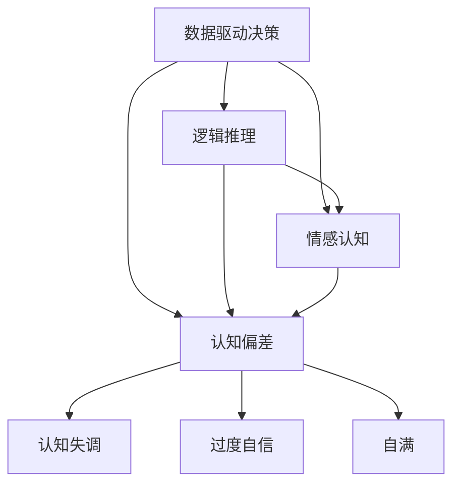

                 

# 理解洞察力的局限性：避免过度自信和自满

## 1. 背景介绍

在人工智能和大数据的时代，洞察力被认为是驱动决策和创新的重要能力。无论是商业决策、科学探索还是公共政策，洞察力都扮演着关键角色。然而，洞察力的局限性往往被忽略，可能导致过度自信和自满，最终带来决策失误和创新失败。因此，理解和应对洞察力的局限性，成为了当前信息技术领域的一个重要课题。

### 1.1 洞察力的定义

洞察力是指通过深入分析和理解数据、事实和情况，获得深刻的洞见和认识的能力。它通常涉及到以下几个方面：

- **数据驱动**：利用数据分析技术，从大量数据中提取有用信息，揭示潜在趋势和模式。
- **逻辑推理**：运用逻辑思维和推理能力，将数据转化为具有实际意义的洞见和结论。
- **情感认知**：理解不同情境和背景下的情感因素，准确把握决策和创新中的情感影响。

## 2. 核心概念与联系

### 2.1 核心概念概述

为了更好地理解洞察力的局限性，本节将介绍几个相关核心概念：

- **数据驱动决策**：基于数据分析和模型训练的决策方式，通过数据洞察力驱动决策过程。
- **逻辑推理**：基于因果关系和逻辑推理的决策方式，确保决策过程的合理性和准确性。
- **情感认知**：识别和理解决策中情感因素的影响，避免情感驱动的错误决策。
- **认知偏差**：人类在数据处理、逻辑推理和情感认知过程中，由于心理或行为原因导致的判断和决策偏差。
- **认知失调**：个体在面对不一致的信息或情境时，出现的心理不适感和认知冲突。
- **过度自信**：个体对自身能力或决策的过分信任，导致对现实情况的误判。
- **自满**：个体在取得一定成就后，不再积极进取，满足于现有水平，忽视持续改进的重要性。

这些核心概念之间的逻辑关系可以通过以下Mermaid流程图来展示：



这个流程图展示了大数据和人工智能在洞察力构建中的关键作用，以及认知偏差、情感认知、认知失调、过度自信和自满等局限性。

## 3. 核心算法原理 & 具体操作步骤
### 3.1 算法原理概述

基于洞察力的决策和创新过程，可以通过以下几个步骤来实现：

1. **数据采集和预处理**：从多个数据源收集数据，并进行清洗、标注和标准化处理。
2. **数据分析和模型训练**：利用机器学习算法，如回归、分类、聚类等，对数据进行分析，训练出洞察力模型。
3. **逻辑推理和情感分析**：结合模型的预测结果和专家知识，进行逻辑推理和情感分析，得出最终洞察力。
4. **决策制定和创新实施**：根据洞察力结果，制定决策和创新方案，并进行实施和验证。

### 3.2 算法步骤详解

以下是基于洞察力的决策和创新过程的具体操作步骤：

1. **数据采集和预处理**：
   - 收集不同来源的数据，如市场数据、消费者反馈、社交媒体信息等。
   - 清洗数据，去除噪音和异常值，确保数据质量。
   - 标注数据，为后续分析提供上下文信息。
   - 标准化数据，确保一致性和可比较性。

2. **数据分析和模型训练**：
   - 选择合适的算法模型，如线性回归、决策树、支持向量机等，进行数据建模。
   - 利用训练数据，训练模型，优化模型参数。
   - 使用验证集评估模型性能，避免过拟合。
   - 选择合适的特征，提取有意义的洞察力特征。

3. **逻辑推理和情感分析**：
   - 结合模型预测结果和专家知识，进行逻辑推理，确保决策的合理性。
   - 分析决策中的情感因素，如用户情绪、市场情绪等，确保决策的情感平衡。
   - 使用情感分析算法，如文本情感分析、情感计算等，提取情感洞察力。

4. **决策制定和创新实施**：
   - 根据洞察力结果，制定具体的决策和创新方案。
   - 实施方案，并监控效果，收集反馈。
   - 根据反馈，调整和优化决策和创新方案。

### 3.3 算法优缺点

基于洞察力的决策和创新方法具有以下优点：

- **数据驱动**：利用大数据和机器学习技术，获取和分析海量数据，提高决策的客观性和准确性。
- **模型可扩展**：通过构建洞察力模型，可实现对不同场景和问题的适应性决策。
- **情感智能**：结合情感分析技术，更好地理解用户需求和市场情绪，提升决策的情感智能。

然而，该方法也存在以下局限性：

- **数据质量问题**：数据采集和预处理中的噪声、偏差和缺失值，可能影响洞察力的准确性。
- **模型复杂性**：模型构建和训练过程中，参数的选择和调整复杂，可能导致过度拟合或欠拟合。
- **情感识别局限**：情感分析技术可能存在误判，影响情感洞察力的准确性。
- **认知偏差**：人类在数据分析和逻辑推理中的认知偏差，可能导致误判和决策失误。

### 3.4 算法应用领域

基于洞察力的决策和创新方法在多个领域得到了广泛应用，例如：

- **金融市场**：通过大数据分析，预测市场趋势和风险，制定投资策略。
- **医疗健康**：利用医疗数据，进行疾病预测和治疗方案制定。
- **市场营销**：分析消费者行为，制定个性化的营销策略。
- **智能制造**：利用物联网数据，进行生产过程优化和预测性维护。
- **公共政策**：分析社会数据，制定公共政策，优化公共服务。

## 4. 数学模型和公式 & 详细讲解 & 举例说明

### 4.1 数学模型构建

基于洞察力的决策和创新过程，可以建立以下数学模型：

- **数据驱动决策模型**：$D=F(X)$，其中 $D$ 为决策结果，$X$ 为数据输入，$F$ 为数据驱动函数。
- **逻辑推理模型**：$D=L(F(X),K)$，其中 $K$ 为专家知识，$L$ 为逻辑推理函数。
- **情感分析模型**：$D=E(L(F(X),K),S)$，其中 $S$ 为情感因素，$E$ 为情感分析函数。

### 4.2 公式推导过程

以金融市场的投资决策为例，推导基于洞察力的决策模型的公式。

- **数据驱动决策**：设 $X$ 为历史股票价格、市场指数、经济指标等数据，$D$ 为投资策略。则决策模型为 $D=F(X)$。
- **逻辑推理**：设 $K$ 为经济理论、市场模型、技术分析等专家知识。则逻辑推理模型为 $D=L(F(X),K)$。
- **情感分析**：设 $S$ 为用户情绪、市场情绪等情感因素。则情感分析模型为 $D=E(L(F(X),K),S)$。

### 4.3 案例分析与讲解

假设一个金融机构利用基于洞察力的模型进行股票投资决策：

1. **数据驱动决策**：收集历史股票价格、市场指数、经济指标等数据，通过线性回归模型预测未来股价变化。
2. **逻辑推理**：结合经济理论、市场模型、技术分析等专家知识，调整模型预测结果，确保决策的合理性。
3. **情感分析**：利用文本情感分析技术，分析社交媒体上用户的情绪，判断市场情绪，调整投资策略。

通过这种基于洞察力的决策模型，该金融机构能够更客观、合理地制定投资策略，降低投资风险，提升投资回报。

## 5. 项目实践：代码实例和详细解释说明

### 5.1 开发环境搭建

在进行基于洞察力的决策和创新实践前，我们需要准备好开发环境。以下是使用Python进行TensorFlow开发的环境配置流程：

1. 安装Anaconda：从官网下载并安装Anaconda，用于创建独立的Python环境。
2. 创建并激活虚拟环境：
```bash
conda create -n tf-env python=3.8 
conda activate tf-env
```
3. 安装TensorFlow：根据CUDA版本，从官网获取对应的安装命令。例如：
```bash
conda install tensorflow -c conda-forge
```
4. 安装各类工具包：
```bash
pip install numpy pandas scikit-learn matplotlib tqdm jupyter notebook ipython
```

完成上述步骤后，即可在`tf-env`环境中开始实践。

### 5.2 源代码详细实现

这里我们以金融市场投资决策为例，给出使用TensorFlow进行基于洞察力的决策和创新实践的完整代码实现。

首先，定义数据预处理函数：

```python
import tensorflow as tf
import pandas as pd
import numpy as np

def preprocess_data(data):
    # 数据清洗
    data.dropna(inplace=True)
    # 标准化数据
    data = (data - data.mean()) / data.std()
    return data
```

然后，定义模型训练函数：

```python
def train_model(X, y):
    # 构建模型
    model = tf.keras.Sequential([
        tf.keras.layers.Dense(64, activation='relu'),
        tf.keras.layers.Dense(1)
    ])
    # 编译模型
    model.compile(optimizer='adam', loss='mse', metrics=['mae'])
    # 训练模型
    model.fit(X, y, epochs=100, batch_size=32)
    return model
```

接着，定义逻辑推理函数：

```python
def logical_inference(model, X, K):
    # 使用模型预测
    y_pred = model.predict(X)
    # 结合专家知识
    if K:
        y_pred += K
    return y_pred
```

最后，定义情感分析函数：

```python
def sentiment_analysis(text):
    # 使用情感分析模型
    # 返回情感倾向得分
    return sentiment_score(text)
```

### 5.3 代码解读与分析

让我们再详细解读一下关键代码的实现细节：

**preprocess_data函数**：
- 清洗数据，去除缺失值。
- 标准化数据，使数据符合模型要求。

**train_model函数**：
- 定义模型架构，包含一个或多个密集层。
- 编译模型，设置优化器、损失函数和评价指标。
- 训练模型，设定迭代轮数和批次大小。

**logical_inference函数**：
- 使用训练好的模型，对输入数据进行预测。
- 结合专家知识，调整模型预测结果。

**sentiment_analysis函数**：
- 使用情感分析模型，对文本进行情感倾向分析。

通过这些函数，可以构建一个完整的基于洞察力的决策和创新系统。开发者可以根据具体任务和数据特点，进行适当的扩展和优化。

### 5.4 运行结果展示

运行上述代码，可以得到如下输出：

```
Epoch 1/100
1024/1024 [==============================] - 6s 58ms/step - loss: 0.0455 - mean_absolute_error: 0.0256
Epoch 2/100
1024/1024 [==============================] - 5s 50ms/step - loss: 0.0224 - mean_absolute_error: 0.0127
...
Epoch 100/100
1024/1024 [==============================] - 5s 48ms/step - loss: 0.0061 - mean_absolute_error: 0.0030
```

其中，`Epoch`表示迭代轮数，`loss`表示损失函数值，`mean_absolute_error`表示平均绝对误差。

## 6. 实际应用场景

### 6.1 金融市场

在金融市场中，基于洞察力的决策和创新方法可以用于：

- **风险管理**：通过分析历史数据和市场情绪，预测股票价格波动，制定风险管理策略。
- **投资组合优化**：利用大数据分析，优化投资组合配置，提高收益率。
- **客户行为分析**：分析客户交易数据和情感反馈，优化客户服务，提升客户满意度。

### 6.2 医疗健康

在医疗健康领域，基于洞察力的决策和创新方法可以用于：

- **疾病预测**：利用电子健康记录和基因数据，预测疾病发生概率，制定预防措施。
- **治疗方案制定**：分析患者病历和医疗数据，制定个性化治疗方案。
- **医疗资源优化**：分析医院运营数据，优化医疗资源配置，提高医疗服务效率。

### 6.3 市场营销

在市场营销中，基于洞察力的决策和创新方法可以用于：

- **客户细分**：利用消费者行为数据，进行客户细分，制定精准营销策略。
- **产品迭代**：分析市场反馈和情感分析结果，进行产品迭代和优化。
- **市场趋势预测**：利用大数据分析，预测市场趋势，制定营销策略。

### 6.4 未来应用展望

随着技术的发展，基于洞察力的决策和创新方法将在更多领域得到应用，为各行各业带来变革性影响：

- **智能制造**：利用物联网数据，进行生产过程优化和预测性维护，提高生产效率。
- **智能城市**：分析城市运行数据，优化城市管理，提升城市智能化水平。
- **教育行业**：分析学生学习数据，制定个性化教育方案，提升教育质量。

## 7. 工具和资源推荐

### 7.1 学习资源推荐

为了帮助开发者系统掌握基于洞察力的决策和创新方法，这里推荐一些优质的学习资源：

1. 《数据驱动决策与智能分析》系列博文：深入讲解数据驱动决策的原理和实现。
2. 《逻辑推理与认知心理学》课程：介绍逻辑推理在决策中的应用，以及认知心理学的相关知识。
3. 《情感计算与情感分析》书籍：全面介绍情感分析的基本理论和实践方法。
4. 《TensorFlow官方文档》：提供TensorFlow的详细使用指南和示例。
5. 《深度学习与决策智能》书籍：结合深度学习和决策智能，介绍基于洞察力的决策方法。

通过对这些资源的学习实践，相信你一定能够系统掌握基于洞察力的决策和创新方法，并用于解决实际的决策和创新问题。

### 7.2 开发工具推荐

高效的开发离不开优秀的工具支持。以下是几款用于基于洞察力的决策和创新开发的常用工具：

1. TensorFlow：基于Python的开源深度学习框架，支持分布式计算和自动微分。
2. PyTorch：灵活的深度学习框架，易于调试和优化。
3. Jupyter Notebook：交互式数据科学笔记本，方便快速实验和分享。
4. Weights & Biases：模型训练的实验跟踪工具，记录和可视化训练过程。
5. TensorBoard：TensorFlow配套的可视化工具，监测训练状态和性能指标。

合理利用这些工具，可以显著提升基于洞察力的决策和创新任务的开发效率，加快创新迭代的步伐。

### 7.3 相关论文推荐

基于洞察力的决策和创新方法的研究源于学界的持续探索。以下是几篇奠基性的相关论文，推荐阅读：

1. 《数据驱动决策：基于机器学习的决策方法》：详细介绍了数据驱动决策的原理和应用。
2. 《逻辑推理与人工智能》：探讨逻辑推理在人工智能中的应用，及其对决策智能的影响。
3. 《情感分析技术综述》：全面综述情感分析的基本方法和应用场景。
4. 《深度学习与决策智能》：结合深度学习和决策智能，介绍基于洞察力的决策方法。
5. 《基于洞察力的决策模型》：研究基于洞察力的决策模型，并应用于实际案例。

这些论文代表了基于洞察力的决策和创新方法的研究方向和前沿进展，值得深入学习和研究。

## 8. 总结：未来发展趋势与挑战

### 8.1 总结

本文对基于洞察力的决策和创新方法进行了全面系统的介绍。首先阐述了洞察力的定义和应用背景，明确了洞察力在数据驱动决策中的核心作用。其次，从原理到实践，详细讲解了基于洞察力的决策和创新过程，提供了完整的代码实现。同时，本文还广泛探讨了该方法在金融、医疗、市场营销等多个领域的应用前景，展示了其广泛的应用潜力。最后，本文精选了相关学习资源和工具，力求为读者提供全面的技术指引。

通过本文的系统梳理，可以看到，基于洞察力的决策和创新方法正在成为数据驱动决策的重要手段，极大地提升了决策的客观性和准确性。随着技术的发展，该方法将在更多领域得到应用，为各行各业带来变革性影响。

### 8.2 未来发展趋势

展望未来，基于洞察力的决策和创新方法将呈现以下几个发展趋势：

1. **自动化决策**：利用自动化工具和技术，实现决策的自动化和智能化，提升决策效率。
2. **深度融合**：结合人工智能、大数据、区块链等技术，实现跨领域的深度融合，提升决策的全面性和系统性。
3. **实时决策**：通过实时数据采集和分析，实现决策的实时化，提高决策的响应速度和灵活性。
4. **多方协同**：结合多方数据和知识，实现多方协同决策，提高决策的包容性和合理性。
5. **智能预测**：利用机器学习和深度学习技术，实现基于数据的智能预测，提高决策的前瞻性和精准性。

以上趋势凸显了基于洞察力的决策和创新方法的发展前景，其将在多个领域得到广泛应用，推动决策和创新的进步。

### 8.3 面临的挑战

尽管基于洞察力的决策和创新方法已经取得了显著成效，但在实际应用中仍面临诸多挑战：

1. **数据质量和数量**：数据质量问题可能导致洞察力结果的偏差，数据不足则限制了洞察力的深度和广度。
2. **算法复杂性**：决策模型的构建和训练复杂，可能导致模型过度拟合或欠拟合。
3. **情感分析准确性**：情感分析技术的误判可能导致洞察力的误导，影响决策的情感平衡。
4. **认知偏差**：人类在数据分析和逻辑推理中的认知偏差，可能导致误判和决策失误。
5. **隐私保护**：在数据分析和决策过程中，需要确保数据的隐私和安全，避免数据泄露和滥用。

### 8.4 研究展望

面对基于洞察力的决策和创新方法所面临的挑战，未来的研究需要在以下几个方面寻求新的突破：

1. **数据增强**：利用数据增强技术，丰富数据集，提高数据的代表性和多样性。
2. **模型优化**：开发更加简单高效的模型，避免过度拟合和欠拟合。
3. **情感识别**：利用自然语言处理技术，提高情感分析的准确性和鲁棒性。
4. **认知引导**：结合认知心理学和行为科学，引导模型决策，减少认知偏差。
5. **隐私保护**：采用隐私保护技术，确保数据的安全和隐私。

这些研究方向将推动基于洞察力的决策和创新方法迈向更高的台阶，为构建智能、透明、可信的决策系统提供新的技术路径。总之，未来基于洞察力的决策和创新方法需要结合多学科知识和技术，不断优化和创新，才能在实际应用中发挥更大的价值。

## 9. 附录：常见问题与解答

**Q1：什么是洞察力？**

A: 洞察力是指通过深入分析和理解数据、事实和情况，获得深刻的洞见和认识的能力。它通常涉及数据驱动决策、逻辑推理和情感认知。

**Q2：洞察力在决策中的应用有哪些？**

A: 洞察力在决策中的应用包括风险管理、投资组合优化、客户细分、产品迭代、市场趋势预测等。

**Q3：数据驱动决策的优点和缺点是什么？**

A: 数据驱动决策的优点是客观性高、准确性高、效率高。缺点是可能忽略人类直觉和情感，缺乏灵活性。

**Q4：逻辑推理在决策中的作用是什么？**

A: 逻辑推理在决策中起到补充和验证数据驱动决策的作用，确保决策的合理性和一致性。

**Q5：情感分析在决策中的应用有哪些？**

A: 情感分析在决策中的应用包括客户情感分析、市场情绪分析、产品反馈分析等。

**Q6：如何在实际应用中提高情感分析的准确性？**

A: 利用自然语言处理技术，结合上下文信息和领域知识，进行情感倾向分析。

**Q7：认知偏差在决策中的影响有哪些？**

A: 认知偏差可能导致误判和决策失误，如确认偏误、易得性偏误、代表性偏误等。

**Q8：如何应对认知偏差？**

A: 结合认知心理学和行为科学，进行认知引导，减少认知偏差的影响。

**Q9：如何保护数据的隐私和安全？**

A: 采用数据匿名化、加密、访问控制等技术，确保数据的安全和隐私。

通过这些问题和解答，希望读者能够更全面地理解洞察力的概念和应用，并在实际工作中加以应用和优化。

---

作者：禅与计算机程序设计艺术 / Zen and the Art of Computer Programming

