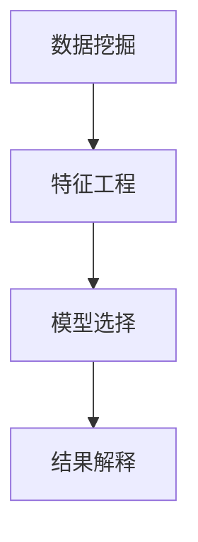

                 

# 理解洞察力的本质：在复杂中把握简单

> 关键词：洞察力, 复杂性, 简化, 数据分析, 机器学习, 深度学习, 人工智能, 数据科学

## 1. 背景介绍

### 1.1 问题由来
在现代社会中，信息过载已经成为一个普遍现象。无论是个人用户还是企业，每天都需要从海量数据中提取有价值的信息，以做出正确的决策。然而，复杂的数据和不断更新的业务需求，使得传统的统计方法和人工分析方法越来越难以应对。

在这种背景下，洞察力成为了企业竞争力的关键。如何从复杂的数据海洋中发现趋势、识别问题、做出决策，成为了每个决策者所必须掌握的技能。

### 1.2 问题核心关键点
洞察力指的是能够从复杂的数据中提取关键信息，形成深入理解和认识的过程。在数据分析和机器学习领域，洞察力通常与数据挖掘、特征工程、模型构建等技术紧密相关。

具体而言，洞察力涉及以下几个关键点：
- **数据质量与预处理**：高质量的数据是洞察力提取的基础，数据预处理（如去重、清洗、归一化等）能够减少噪声和错误，提高数据的准确性和一致性。
- **特征工程**：通过分析数据的统计特征、业务特征等，构造有意义的特征，为模型提供高质量输入。
- **模型构建**：选择合适的模型架构和算法，捕捉数据中的复杂关系和模式。
- **结果解读**：对模型的输出进行解释，结合业务知识，形成可操作的洞察力。

本文将深入探讨这些核心技术，并结合实际案例，展示如何利用洞察力技术解决复杂的数据分析问题。

## 2. 核心概念与联系

### 2.1 核心概念概述

为了更好地理解洞察力技术，本节将介绍几个密切相关的核心概念：

- **数据挖掘**：通过算法和技术手段，从大量数据中发现模式、趋势、异常等有价值的信息。数据挖掘包括描述性分析、预测性分析、分类和聚类等技术。
- **特征工程**：通过特征选择、构造、转换等技术手段，从原始数据中提取最有价值的特征，供模型使用。
- **模型选择**：根据数据类型和业务需求，选择合适的模型架构和算法。模型包括决策树、随机森林、支持向量机、神经网络等。
- **结果解释**：对模型的输出进行解释，结合业务知识，形成可操作的洞察力。

这些核心概念之间的逻辑关系可以通过以下Mermaid流程图来展示：



这个流程图展示了你数据洞察力的核心概念及其之间的关系：

1. 数据挖掘对原始数据进行初步分析，提取初步的信息。
2. 特征工程对初步信息进行处理，提取最有价值的特征。
3. 模型选择基于特征构建模型，捕捉数据中的复杂关系和模式。
4. 结果解释对模型输出进行解释，形成可操作的洞察力。

## 3. 核心算法原理 & 具体操作步骤
### 3.1 算法原理概述

洞察力技术的核心在于通过数据挖掘和机器学习手段，从复杂数据中提取有价值的信息。其基本流程包括数据预处理、特征工程、模型选择和结果解释等步骤。

洞察力技术的核心算法原理主要包括：

- **聚类算法**：将数据分成不同的群组，识别出数据中的模式和趋势。常用的聚类算法包括K-means、层次聚类等。
- **分类算法**：将数据分为不同的类别，识别出数据中的异常和偏差。常用的分类算法包括决策树、随机森林、支持向量机等。
- **关联规则学习**：从大规模交易数据中发现频繁项集和关联规则，识别出数据中的潜在关联和规律。常用的算法包括Apriori、FP-Growth等。
- **神经网络**：通过多层次的非线性映射，捕捉数据中的复杂模式和关系，适用于非线性和高维数据的分析。

### 3.2 算法步骤详解

洞察力技术的实现通常包括以下几个关键步骤：

**Step 1: 数据预处理**
- 清洗数据，去除噪声和错误。
- 处理缺失值，填补缺失的数据。
- 归一化数据，使不同特征处于相同量级。
- 数据划分，将数据分为训练集、验证集和测试集。

**Step 2: 特征工程**
- 特征选择：通过统计方法和业务知识，选择对模型有用的特征。
- 特征构造：通过计算、变换、组合等技术手段，构造新的特征。
- 特征转换：通过数据标准化、离散化、编码等技术手段，转换特征形式。

**Step 3: 模型选择与训练**
- 选择适合的模型架构和算法，构建模型。
- 根据模型复杂度、数据量、特征数量等设定模型参数。
- 在训练集上训练模型，通过迭代优化模型参数，最小化模型误差。

**Step 4: 模型评估与优化**
- 在验证集上评估模型性能，选择合适的模型和参数。
- 对模型进行调优，进一步提高模型性能。
- 在测试集上测试模型，确保模型具有泛化能力。

**Step 5: 结果解释与应用**
- 对模型的输出进行解释，结合业务知识，形成可操作的洞察力。
- 将洞察力应用于业务决策，优化业务流程。

### 3.3 算法优缺点

洞察力技术具有以下优点：
1. **自动化**：通过算法和技术手段，自动化地从数据中提取洞察力，大大提高数据分析效率。
2. **可解释性**：洞察力技术可以提供模型的可解释性，帮助用户理解模型的决策过程。
3. **灵活性**：可以根据不同业务需求和数据特征，灵活选择算法和技术手段，适应性强。

同时，该方法也存在一些局限性：
1. **数据质量要求高**：洞察力技术依赖于高质量的数据，数据质量问题会影响分析结果。
2. **模型复杂度高**：一些复杂的算法（如神经网络）可能需要较高的计算资源和时间。
3. **业务知识要求高**：洞察力技术的有效性依赖于业务知识的应用，缺乏业务知识的应用场景可能难以取得理想效果。

尽管存在这些局限性，但就目前而言，洞察力技术仍是大数据分析和决策支持的重要手段。未来相关研究的重点在于如何进一步降低算法对数据质量的要求，提高算法的可扩展性和鲁棒性，同时兼顾算法的可解释性和业务知识的应用。

### 3.4 算法应用领域

洞察力技术在众多领域中得到了广泛的应用，例如：

- **金融分析**：利用洞察力技术对交易数据进行分析，识别出潜在的市场趋势和交易异常。
- **营销分析**：通过洞察力技术对客户数据进行分析，识别出客户行为模式和消费趋势，制定个性化营销策略。
- **供应链管理**：利用洞察力技术对供应链数据进行分析，识别出供应链中的瓶颈和风险，优化供应链管理。
- **医疗健康**：通过洞察力技术对患者数据进行分析，识别出疾病趋势和患者行为模式，提高诊疗效率。
- **自然灾害预测**：利用洞察力技术对气象数据进行分析，预测自然灾害的发生和影响范围。

这些应用展示了洞察力技术的强大能力，为不同行业带来了巨大的价值。

## 4. 数学模型和公式 & 详细讲解 & 举例说明
### 4.1 数学模型构建

本节将使用数学语言对洞察力技术的核心算法进行更加严格的刻画。

假设数据集 $D=\{(x_i,y_i)\}_{i=1}^N, x_i \in \mathbb{R}^d, y_i \in \mathcal{Y}$，其中 $x_i$ 为输入特征，$y_i$ 为输出标签。

定义洞察力模型 $M_{\theta}$，其中 $\theta$ 为模型参数。假设选择的洞察力算法为 $A$，其数学模型为 $M_{\theta}^{A}(D)$。

洞察力模型的目标是最小化预测误差：

$$
\min_{\theta} \sum_{i=1}^N \ell(M_{\theta}^{A}(x_i),y_i)
$$

其中 $\ell$ 为损失函数，常用的损失函数包括均方误差损失、交叉熵损失等。

### 4.2 公式推导过程

以K-means聚类算法为例，推导聚类模型的数学推导过程。

设 $D=\{x_1, x_2, \ldots, x_N\}$，聚类算法将数据分为 $K$ 个簇，每个簇的中心为 $\mu_k$，其中 $k=1,2,\ldots,K$。则K-means算法的目标是最小化簇内平方误差（Intra-cluster Sum of Squares, I-SOS）：

$$
\min_{\mu_1, \mu_2, \ldots, \mu_K} \sum_{k=1}^K \sum_{x_i \in C_k} \| x_i - \mu_k \|^2
$$

其中 $C_k$ 为第 $k$ 个簇，$\| \cdot \|$ 为欧氏距离。

为了求解上述优化问题，通常采用迭代优化算法，如EM算法。在每次迭代中，首先固定簇中心 $\mu_k$，计算每个数据点 $x_i$ 属于每个簇 $C_k$ 的概率 $p_{ik}$，然后更新簇中心 $\mu_k$：

$$
\mu_k = \frac{\sum_{x_i \in C_k} x_i}{\sum_{x_i \in C_k} 1}
$$

其中 $C_k = \{ x_i | p_{ik} = \max\limits_{j=1,2,\ldots,K} p_{ij} \}$。

迭代优化过程中，更新概率 $p_{ik}$ 的公式为：

$$
p_{ik} = \frac{\exp(-\| x_i - \mu_k \|^2)}{\sum_{j=1}^K \exp(-\| x_i - \mu_j \|^2)}
$$

通过不断迭代，直至簇中心收敛，即 $|\mu_k^{(t+1)} - \mu_k^{(t)}| < \epsilon$，其中 $t$ 为迭代次数，$\epsilon$ 为预设的收敛阈值。

### 4.3 案例分析与讲解

以零售数据分析为例，展示洞察力技术的应用。

假设某零售公司有大量历史销售数据，目标是识别出影响销售额的关键因素，优化库存管理和商品陈列。具体步骤如下：

**Step 1: 数据预处理**
- 清洗数据，去除噪声和错误，处理缺失值。
- 归一化数据，使不同特征处于相同量级。
- 数据划分，将数据分为训练集、验证集和测试集。

**Step 2: 特征工程**
- 特征选择：选择对销售额影响较大的特征，如销售额、季节性、节假日、促销活动等。
- 特征构造：构造新的特征，如销售额对季节性的变化趋势、节假日对销售额的影响等。
- 特征转换：对某些特征进行编码，如将类别型特征转换为数值型特征。

**Step 3: 模型选择与训练**
- 选择适合的模型架构和算法，构建聚类模型。
- 根据模型复杂度、数据量、特征数量等设定模型参数。
- 在训练集上训练模型，通过迭代优化模型参数，最小化模型误差。

**Step 4: 模型评估与优化**
- 在验证集上评估模型性能，选择合适的模型和参数。
- 对模型进行调优，进一步提高模型性能。
- 在测试集上测试模型，确保模型具有泛化能力。

**Step 5: 结果解释与应用**
- 对模型的输出进行解释，识别出销售额的关键因素。
- 将洞察力应用于库存管理和商品陈列优化，提升销售额和客户满意度。

通过以上步骤，可以有效地从历史销售数据中提取洞察力，帮助零售公司优化库存管理和商品陈列，提升业务绩效。

## 5. 项目实践：代码实例和详细解释说明
### 5.1 开发环境搭建

在进行洞察力技术实践前，我们需要准备好开发环境。以下是使用Python进行Scikit-learn开发的环境配置流程：

1. 安装Anaconda：从官网下载并安装Anaconda，用于创建独立的Python环境。

2. 创建并激活虚拟环境：
```bash
conda create -n sklearn-env python=3.8 
conda activate sklearn-env
```

3. 安装Scikit-learn：
```bash
conda install scikit-learn
```

4. 安装各类工具包：
```bash
pip install numpy pandas matplotlib seaborn matplotlib.pyplot
```

完成上述步骤后，即可在`sklearn-env`环境中开始洞察力技术实践。

### 5.2 源代码详细实现

下面我们以K-means聚类算法为例，给出使用Scikit-learn库进行数据分类的PyTorch代码实现。

首先，定义数据处理函数：

```python
import pandas as pd
from sklearn.preprocessing import StandardScaler
from sklearn.cluster import KMeans

def preprocess_data(data_file):
    # 读取数据文件
    data = pd.read_csv(data_file)
    # 处理缺失值
    data.fillna(method='ffill', inplace=True)
    # 归一化数据
    scaler = StandardScaler()
    data = scaler.fit_transform(data)
    return data
```

然后，定义模型和训练函数：

```python
def kmeans_clustering(data, num_clusters=5):
    # 构建K-means模型
    model = KMeans(n_clusters=num_clusters, random_state=0)
    # 训练模型
    model.fit(data)
    # 返回模型和聚类结果
    return model, model.labels_
```

最后，使用K-means算法进行数据分类：

```python
# 数据预处理
data = preprocess_data('sales_data.csv')
# 进行K-means聚类
model, labels = kmeans_clustering(data, num_clusters=5)
# 打印聚类结果
print('聚类结果：', labels)
```

以上就是使用Scikit-learn进行K-means聚类算法的完整代码实现。可以看到，Scikit-learn提供了简单易用的API接口，可以快速搭建和训练聚类模型。

### 5.3 代码解读与分析

让我们再详细解读一下关键代码的实现细节：

**preprocess_data函数**：
- 读取数据文件，处理缺失值。
- 归一化数据，使其处于相同量级。

**kmeans_clustering函数**：
- 构建K-means模型，设定聚类数。
- 在数据集上训练模型。
- 返回训练后的模型和聚类结果。

**使用代码进行K-means聚类**：
- 预处理数据集。
- 进行K-means聚类。
- 打印聚类结果。

通过以上步骤，可以有效地使用Scikit-learn进行K-means聚类算法的实践。

## 6. 实际应用场景
### 6.1 智能客服系统

基于洞察力技术的对话技术，可以广泛应用于智能客服系统的构建。传统客服往往需要配备大量人力，高峰期响应缓慢，且一致性和专业性难以保证。

通过洞察力技术，可以自动分析客户的历史对话记录，识别出常见问题和客户需求。基于分析结果，设计合理的对话流程和问题回答模板，构建智能客服系统。该系统能够7x24小时不间断服务，快速响应客户咨询，用自然流畅的语言解答各类常见问题。对于客户提出的新问题，还可以接入检索系统实时搜索相关内容，动态组织生成回答。

### 6.2 金融舆情监测

金融机构需要实时监测市场舆论动向，以便及时应对负面信息传播，规避金融风险。传统的人工监测方式成本高、效率低，难以应对网络时代海量信息爆发的挑战。

通过洞察力技术，可以自动分析金融领域相关的新闻、报道、评论等文本数据，识别出市场舆情和趋势。基于分析结果，设计预警系统，实时监测市场舆情变化，一旦发现负面信息激增等异常情况，系统便会自动预警，帮助金融机构快速应对潜在风险。

### 6.3 个性化推荐系统

当前的推荐系统往往只依赖用户的历史行为数据进行物品推荐，无法深入理解用户的真实兴趣偏好。基于洞察力技术，个性化推荐系统可以更好地挖掘用户行为背后的语义信息，从而提供更精准、多样的推荐内容。

通过洞察力技术，可以自动分析用户浏览、点击、评论、分享等行为数据，提取和用户交互的物品标题、描述、标签等文本内容。将文本内容作为模型输入，用户的后续行为（如是否点击、购买等）作为监督信号，在此基础上训练模型，学习用户兴趣点。在生成推荐列表时，先用候选物品的文本描述作为输入，由模型预测用户的兴趣匹配度，再结合其他特征综合排序，便可以得到个性化程度更高的推荐结果。

### 6.4 未来应用展望

随着洞察力技术的不断发展，其应用领域将不断扩展，为各行各业带来变革性影响。

在智慧医疗领域，基于洞察力技术的医疗问答、病历分析、药物研发等应用将提升医疗服务的智能化水平，辅助医生诊疗，加速新药开发进程。

在智能教育领域，洞察力技术可应用于作业批改、学情分析、知识推荐等方面，因材施教，促进教育公平，提高教学质量。

在智慧城市治理中，洞察力技术可应用于城市事件监测、舆情分析、应急指挥等环节，提高城市管理的自动化和智能化水平，构建更安全、高效的未来城市。

此外，在企业生产、社会治理、文娱传媒等众多领域，基于洞察力技术的人工智能应用也将不断涌现，为经济社会发展注入新的动力。相信随着技术的日益成熟，洞察力技术将成为数据分析和决策支持的重要手段，推动人工智能技术向更广阔的领域加速渗透。

## 7. 工具和资源推荐
### 7.1 学习资源推荐

为了帮助开发者系统掌握洞察力技术的基础知识和应用实践，这里推荐一些优质的学习资源：

1. 《数据挖掘与统计学习》系列博文：由数据挖掘领域专家撰写，系统介绍了数据挖掘的基本概念、方法和应用。

2. 《机器学习》课程：由斯坦福大学开设的机器学习课程，涵盖机器学习的基本概念、算法和实践。

3. 《Python数据科学手册》书籍：介绍如何使用Python进行数据分析、机器学习和数据可视化。

4. Scikit-learn官方文档：Scikit-learn的官方文档，提供了丰富的API接口和示例代码，是学习和实践洞察力技术的必备资料。

5. Kaggle：全球最大的数据科学竞赛平台，提供了大量的数据集和竞赛项目，有助于实践洞察力技术。

通过对这些资源的学习实践，相信你一定能够快速掌握洞察力技术的精髓，并用于解决实际的分析问题。

### 7.2 开发工具推荐

高效的开发离不开优秀的工具支持。以下是几款用于洞察力技术开发的常用工具：

1. Python：简单易用的编程语言，广泛用于数据分析、机器学习和深度学习领域。
2. Scikit-learn：Python数据挖掘和机器学习库，提供了丰富的算法和工具，支持快速原型设计和模型训练。
3. Jupyter Notebook：交互式的编程环境，支持代码运行和数据可视化，便于学习和实验。
4. Pandas：Python数据分析库，支持数据清洗、处理和分析，是洞察力技术实践的必备工具。
5. Matplotlib：Python数据可视化库，支持多种图表类型，便于直观展示数据分析结果。

合理利用这些工具，可以显著提升洞察力技术的开发效率，加快创新迭代的步伐。

### 7.3 相关论文推荐

洞察力技术的发展源于学界的持续研究。以下是几篇奠基性的相关论文，推荐阅读：

1. K-means：Clustering by Distances：经典的K-means聚类算法，提出了一种高效的聚类方法。

2. Support Vector Machines for Pattern Recognition：介绍支持向量机算法，提出了一种高效的分类方法。

3. Decision Trees for Regression and Classification：介绍决策树算法，提出了一种高效的分类和回归方法。

4. Neural Networks and Deep Learning：介绍神经网络算法，提出了一种高效的非线性映射方法。

5. Unsupervised Feature Learning with Deep Neural Networks：提出深度神经网络算法，提出了一种高效的无监督特征学习方法。

这些论文代表了大数据挖掘和机器学习领域的发展脉络。通过学习这些前沿成果，可以帮助研究者把握学科前进方向，激发更多的创新灵感。

## 8. 总结：未来发展趋势与挑战
### 8.1 研究成果总结

本文对洞察力技术进行了全面系统的介绍。首先阐述了洞察力技术在数据分析和决策支持中的重要性，明确了洞察力技术在提升数据处理效率、优化决策支持方面的独特价值。其次，从原理到实践，详细讲解了洞察力技术的基本算法和操作步骤，给出了洞察力技术实践的完整代码实例。同时，本文还广泛探讨了洞察力技术在智能客服、金融舆情、个性化推荐等多个行业领域的应用前景，展示了洞察力技术的强大能力。最后，本文精选了洞察力技术的各类学习资源，力求为读者提供全方位的技术指引。

通过本文的系统梳理，可以看到，洞察力技术已经成为数据分析和决策支持的重要手段，极大地拓展了数据挖掘和机器学习的应用边界，推动了人工智能技术向更广阔的领域加速渗透。

### 8.2 未来发展趋势

展望未来，洞察力技术将呈现以下几个发展趋势：

1. **自动化**：随着算法的不断优化和工具的进步，洞察力技术的自动化程度将不断提高，从数据预处理到模型训练、结果解释等环节都将实现自动化。
2. **可解释性**：洞察力技术的可解释性将逐渐增强，结合自然语言处理技术，模型输出将更具可解释性，帮助用户更好地理解和应用洞察力结果。
3. **可扩展性**：随着大数据和分布式计算技术的发展，洞察力技术的可扩展性将显著提升，能够处理更大规模和更复杂的数据。
4. **模型融合**：洞察力技术与深度学习、强化学习等技术的融合将更加紧密，形成多模态、多层次的洞察力模型。
5. **智能化**：洞察力技术与业务知识和规则的融合将更加深入，形成更加智能化和自动化的决策支持系统。

以上趋势凸显了洞察力技术的广阔前景。这些方向的探索发展，必将进一步提升数据分析和决策支持的智能化水平，为经济社会发展注入新的动力。

### 8.3 面临的挑战

尽管洞察力技术已经取得了瞩目成就，但在迈向更加智能化、普适化应用的过程中，它仍面临着诸多挑战：

1. **数据质量问题**：高质量的数据是洞察力提取的基础，但实际应用中数据质量问题依然存在，数据清洗和预处理需要更多时间和精力。
2. **算法复杂度**：一些复杂的算法（如神经网络）可能需要较高的计算资源和时间，难以在实时系统中应用。
3. **业务知识缺乏**：洞察力技术的有效性依赖于业务知识的应用，缺乏业务知识的应用场景可能难以取得理想效果。
4. **模型解释性不足**：一些复杂的模型（如深度神经网络）难以提供可解释的输出，缺乏透明性和可信度。
5. **数据隐私和安全**：洞察力技术处理的数据可能包含敏感信息，数据隐私和安全问题需要进一步解决。

尽管存在这些挑战，但随着技术的发展和应用的不断深入，这些问题有望逐步得到解决。

### 8.4 研究展望

面对洞察力技术面临的种种挑战，未来的研究需要在以下几个方面寻求新的突破：

1. **数据质量提升**：探索更高效的数据清洗和预处理技术，降低数据质量对洞察力技术的影响。
2. **算法优化**：开发更加高效的算法和工具，支持大规模、高复杂度数据的处理。
3. **业务知识结合**：加强洞察力技术与业务知识、规则的结合，提升模型解释性和可信度。
4. **隐私保护**：探索隐私保护技术，保护数据隐私和安全，满足用户隐私需求。
5. **智能化决策**：结合人工智能技术，增强洞察力技术的智能化水平，实现更加自动化的决策支持。

这些研究方向的探索，必将引领洞察力技术迈向更高的台阶，为数据驱动的决策支持提供更加智能化、自动化的解决方案。面向未来，洞察力技术还需要与其他人工智能技术进行更深入的融合，如知识表示、因果推理、强化学习等，多路径协同发力，共同推动数据驱动的决策支持系统的进步。只有勇于创新、敢于突破，才能不断拓展洞察力技术的边界，让数据驱动的决策支持系统更好地服务于经济社会发展。

## 9. 附录：常见问题与解答

**Q1：洞察力技术是否适用于所有数据分析任务？**

A: 洞察力技术在大多数数据分析任务上都能取得不错的效果，特别是对于数据量较大的任务。但对于一些特定领域的任务，如医学、法律等，仅仅依靠通用数据集可能难以很好地适应。此时需要在特定领域数据集上进一步预处理和分析，才能获得理想结果。此外，对于一些需要时效性、个性化很强的任务，如推荐、对话等，洞察力技术也需要针对性的改进优化。

**Q2：洞察力技术在实际应用中需要注意哪些问题？**

A: 在实际应用中，洞察力技术需要注意以下问题：
1. 数据质量问题：高质量的数据是洞察力提取的基础，数据预处理环节需要充分注意，确保数据质量。
2. 算法选择问题：根据具体任务选择适合的算法和模型，确保算法的有效性和高效性。
3. 模型解释问题：洞察力技术的有效性依赖于模型的可解释性，需要通过可视化、报告等方式提高模型输出结果的解释性。
4. 隐私安全问题：洞察力技术处理的数据可能包含敏感信息，需要采取数据脱敏、加密等措施，确保数据隐私和安全。
5. 应用场景问题：洞察力技术的有效性依赖于业务知识的应用，需要结合具体业务场景进行设计和优化。

通过注意这些问题，可以更好地发挥洞察力技术的作用，提升数据分析和决策支持的效率和准确性。

**Q3：如何提高洞察力技术的可扩展性？**

A: 提高洞察力技术的可扩展性，可以从以下几个方面入手：
1. 分布式计算：利用分布式计算技术，将数据和计算任务分布到多个节点上，提升计算效率。
2. 大数据处理：采用大数据处理技术，如Hadoop、Spark等，处理大规模数据集。
3. 内存管理：使用内存管理技术，如in-memory计算，减少数据在磁盘和网络上的传输，提高计算速度。
4. 算法优化：优化算法和数据结构，提升算法效率，减少计算时间。
5. 模型压缩：采用模型压缩技术，如剪枝、量化等，减少模型参数和计算量，降低内存和计算资源消耗。

通过以上措施，可以显著提升洞察力技术的可扩展性，支持更大规模和更复杂的数据处理。

**Q4：如何提高洞察力技术的可解释性？**

A: 提高洞察力技术的可解释性，可以从以下几个方面入手：
1. 可视化：通过可视化技术，将模型的输出结果转换为图表和图形，增强可解释性。
2. 报告生成：生成详细的报告，描述模型的输入、输出和参数，提供可解释的分析和解释。
3. 业务融合：结合业务知识，解释模型的输出结果，提供具体的业务解释和建议。
4. 模型简化：简化模型结构，去除冗余的参数和层，提高模型的可解释性。
5. 特征重要性分析：分析模型的特征重要性，解释每个特征对模型的贡献和影响。

通过以上措施，可以显著提高洞察力技术的可解释性，增强模型输出的可信度和透明度。

**Q5：洞察力技术在实际应用中如何优化性能？**

A: 在实际应用中，洞察力技术可以通过以下方式优化性能：
1. 数据预处理：清洗数据，去除噪声和错误，处理缺失值，归一化数据，使其处于相同量级。
2. 特征工程：选择对模型有用的特征，构造新的特征，转换特征形式，提高模型的特征质量。
3. 算法选择：根据具体任务选择适合的算法和模型，确保算法的有效性和高效性。
4. 模型调优：对模型进行调优，选择合适的参数和超参数，提升模型性能。
5. 数据增强：采用数据增强技术，扩充训练集，提高模型的泛化能力。
6. 模型融合：结合多种算法和技术，形成多模态、多层次的模型，提升模型的综合性能。

通过以上措施，可以显著优化洞察力技术的性能，提高模型输出的准确性和可信度。

总之，洞察力技术将成为数据分析和决策支持的重要手段，为各行各业带来巨大的价值。通过不断优化和创新，洞察力技术必将在未来发挥更大的作用，推动数据驱动的决策支持系统的进步。

