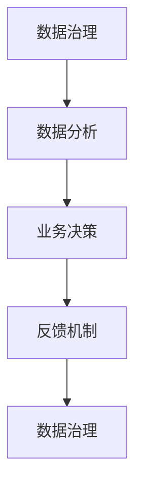

                 

# 理解洞察力的艺术：在纷繁中把握本质

## 1. 背景介绍

### 1.1 问题由来

在当今这个信息爆炸的时代，数据的数量和质量都在快速增长。然而，数据仅仅是解决问题的基础，如何从海量数据中提取有价值的洞察力，才是真正推动业务发展的关键。洞察力不仅仅是数据分析的结果，更是对业务本质的深入理解和把握。因此，理解洞察力的艺术，成为了企业和组织在复杂多变的环境中不断前进的必备技能。

### 1.2 问题核心关键点

洞察力的提取涉及多个核心关键点，包括但不限于：

- **数据质量**：数据是否准确、完整、及时，是否反映业务真实情况。
- **数据治理**：数据的收集、存储、处理、传输等过程是否规范，是否遵循数据安全法规。
- **数据分析**：能否选择正确的分析方法和工具，从数据中提取有意义的业务洞见。
- **洞察应用**：能否将洞察力转化为具体的业务决策和行动，实现业务增长。

在当今数字化时代，企业对于洞察力的需求日益增长，但是如何高效、准确、安全地从数据中提取洞察力，仍是众多企业面临的挑战。本文将从多个角度探讨如何理解洞察力的艺术，帮助读者在纷繁复杂的数据环境中把握本质。

## 2. 核心概念与联系

### 2.1 核心概念概述

洞察力指的是通过数据分析、挖掘、提炼，从大量数据中发现有意义的模式、趋势、关联等信息，进而对业务做出指导决策的能力。洞察力的提取不仅需要先进的数据分析技术，更需要科学的管理理念和创新的思维方式。

### 2.2 核心概念联系

洞察力的提取涉及以下几个核心概念的联系：

1. **数据治理**：确保数据质量、数据安全，是洞察力提取的前提条件。
2. **数据分析**：通过多种数据处理技术，从原始数据中提取出有意义的洞察。
3. **业务决策**：将洞察力转化为具体的决策和行动，实现业务目标。
4. **反馈机制**：对决策结果进行评估，形成反馈循环，不断优化洞察力和决策过程。

这些概念之间的联系可以通过以下Mermaid流程图来展示：



这个流程图展示了数据治理、数据分析、业务决策和反馈机制之间的相互关系。数据治理为数据分析提供高质量的数据，数据分析为业务决策提供支持，业务决策的执行效果反馈到数据治理，形成闭环，不断优化数据治理和数据分析。

## 3. 核心算法原理 & 具体操作步骤

### 3.1 算法原理概述

洞察力的提取可以理解为从数据中学习并识别模式和关联的过程。这一过程可以通过多种算法和技术来实现，包括但不限于：

- **聚类分析**：将数据集分成多个组，每组内具有相似特征的数据点。
- **关联规则学习**：发现数据集中的频繁项集和关联规则，从而发现潜在的商业关系。
- **回归分析**：通过预测模型，建立输入变量和输出变量之间的关系。
- **时间序列分析**：分析时间序列数据中的趋势、周期和季节性等特征。
- **文本分析**：通过自然语言处理技术，从文本数据中提取情感、主题等信息。

这些算法和技术在实际应用中往往需要结合使用，以实现更全面、更深入的洞察力提取。

### 3.2 算法步骤详解

洞察力的提取一般包括以下关键步骤：

**Step 1: 数据收集和准备**

- 确定需要收集的数据类型和来源。
- 清洗和整理数据，去除无效、重复或错误的数据。
- 确保数据的完整性和一致性，遵循数据治理规范。

**Step 2: 数据探索和分析**

- 使用数据可视化工具，如Tableau、Power BI等，对数据进行探索性分析，发现数据中的异常点和趋势。
- 应用各种算法和技术，对数据进行深入分析，提取有意义的洞察。
- 使用模型评估工具，对分析结果进行验证和优化。

**Step 3: 洞察应用和反馈**

- 将洞察力转化为具体的业务决策和行动。
- 对决策结果进行评估，形成反馈循环，不断优化洞察力和决策过程。
- 持续收集新数据，更新和扩展现有的洞察。

### 3.3 算法优缺点

洞察力提取算法和技术的优点包括：

- **高效性**：通过自动化技术，可以快速分析大量数据，提取洞察力。
- **准确性**：先进的算法和技术能够识别复杂的模式和关联，提供高质量的洞察。
- **灵活性**：结合多种算法和技术，可以适应不同的业务需求。

同时，这些算法和技术的缺点也值得注意：

- **复杂性**：算法的实现和优化需要一定的技术背景和经验。
- **数据依赖**：算法的准确性和效果高度依赖于数据的质量和完整性。
- **结果解释**：有些算法的结果难以解释，需要结合业务知识进行解读。

### 3.4 算法应用领域

洞察力的提取技术在多个领域得到了广泛应用，包括但不限于：

- **市场营销**：通过分析消费者行为和偏好，制定更有效的营销策略。
- **金融风控**：通过分析交易数据，识别潜在的欺诈和风险。
- **供应链管理**：通过分析供应链数据，优化库存管理和物流调度。
- **产品研发**：通过分析用户反馈和市场数据，指导产品设计和改进。

这些领域的洞察力提取，不仅能提升业务的效率和质量，还能帮助企业做出更加精准的决策，实现可持续的发展。

## 4. 数学模型和公式 & 详细讲解

### 4.1 数学模型构建

洞察力的提取涉及多个数学模型，以下是几个典型的模型：

- **聚类分析**：使用K-Means算法，将数据集分成K个簇。
- **关联规则学习**：使用Apriori算法，发现频繁项集和关联规则。
- **回归分析**：使用线性回归模型，建立输入变量和输出变量之间的关系。
- **时间序列分析**：使用ARIMA模型，分析时间序列数据中的趋势和周期。
- **文本分析**：使用TF-IDF算法，计算文本的权重和重要程度。

这些模型在实际应用中需要结合具体业务场景进行选择和调整。

### 4.2 公式推导过程

以线性回归模型为例，推导其公式：

$$
y = \beta_0 + \beta_1x_1 + \beta_2x_2 + \cdots + \beta_nx_n + \epsilon
$$

其中，$y$为输出变量，$\beta_0$为截距，$\beta_i$为输入变量的系数，$x_i$为输入变量，$\epsilon$为误差项。

线性回归模型的最小二乘法求解公式为：

$$
\hat{\beta} = (X^TX)^{-1}X^Ty
$$

其中，$\hat{\beta}$为求解的系数，$X$为输入变量的矩阵，$y$为输出变量的向量。

### 4.3 案例分析与讲解

假设有一个电商平台，希望通过分析用户的购买行为，预测其下一次购买的可能性。

1. **数据准备**：收集用户的基本信息、购买记录、浏览记录等数据，并进行清洗和处理。
2. **模型选择**：选择线性回归模型，分析用户行为和购买结果之间的关系。
3. **模型训练**：使用历史数据训练模型，求解系数$\hat{\beta}$。
4. **模型验证**：使用测试数据验证模型的预测效果，评估模型的准确性和鲁棒性。
5. **业务应用**：将模型应用于实际业务中，对用户进行分组，推荐商品，提升销售额。

## 5. 项目实践：代码实例和详细解释说明

### 5.1 开发环境搭建

在开始项目实践前，需要搭建好开发环境。以下是Python环境配置的具体步骤：

1. 安装Python：从官网下载并安装Python 3.x版本。
2. 安装Anaconda：从官网下载并安装Anaconda，用于创建独立的Python环境。
3. 创建虚拟环境：
```bash
conda create -n insights_env python=3.8 
conda activate insights_env
```

### 5.2 源代码详细实现

下面以线性回归模型为例，给出Python代码实现。

```python
import pandas as pd
import numpy as np
from sklearn.linear_model import LinearRegression
from sklearn.metrics import mean_squared_error

# 加载数据
data = pd.read_csv('data.csv')

# 准备数据
X = data[['feature1', 'feature2', 'feature3']]
y = data['target']

# 分割数据
X_train, X_test, y_train, y_test = train_test_split(X, y, test_size=0.2, random_state=42)

# 训练模型
model = LinearRegression()
model.fit(X_train, y_train)

# 预测结果
y_pred = model.predict(X_test)

# 评估模型
mse = mean_squared_error(y_test, y_pred)
print(f"Mean Squared Error: {mse}")
```

### 5.3 代码解读与分析

- **数据加载**：使用pandas库加载数据，并进行初步的清洗和处理。
- **模型训练**：使用sklearn库中的LinearRegression模型，对数据进行拟合，求解系数。
- **模型评估**：使用均方误差（MSE）评估模型的预测效果，MSE越小，表示模型的预测越准确。
- **业务应用**：根据模型预测结果，对用户进行分组，制定个性化推荐策略。

### 5.4 运行结果展示

运行上述代码，可以得到模型的MSE值，从而评估模型的预测效果。实际应用中，根据MSE值的大小，可以调整模型的参数，优化模型的预测效果。

## 6. 实际应用场景

### 6.1 市场营销

市场营销中，洞察力的提取可以帮助企业更好地了解消费者需求和行为，制定更有效的营销策略。

- **消费者分析**：通过分析消费者购买数据、浏览记录等，识别消费者的偏好和需求。
- **市场细分**：将消费者分成不同的群体，针对不同群体制定个性化营销策略。
- **广告投放**：通过分析广告效果，优化广告投放策略，提高广告ROI。

### 6.2 金融风控

金融风控中，洞察力的提取可以帮助银行和金融机构识别潜在的欺诈和风险，保障金融安全。

- **异常检测**：通过分析交易数据，识别异常交易行为，及时发现潜在欺诈。
- **信用评分**：通过分析用户信用记录，建立信用评分模型，评估用户信用风险。
- **风险管理**：通过分析市场数据，预测市场风险，制定风险管理策略。

### 6.3 供应链管理

供应链管理中，洞察力的提取可以帮助企业优化库存管理和物流调度，提升供应链效率。

- **需求预测**：通过分析历史销售数据，预测未来需求，优化库存水平。
- **物流优化**：通过分析运输数据，优化物流路线和运输方式，降低物流成本。
- **供应商评估**：通过分析供应商数据，评估供应商绩效，选择优质供应商。

### 6.4 产品研发

产品研发中，洞察力的提取可以帮助企业了解用户需求，指导产品设计和改进，提升产品质量和用户满意度。

- **用户反馈分析**：通过分析用户反馈，识别产品缺陷和改进需求。
- **市场趋势分析**：通过分析市场数据，预测产品趋势，制定产品规划。
- **产品迭代优化**：通过分析用户使用数据，优化产品功能，提高用户满意度。

## 7. 工具和资源推荐

### 7.1 学习资源推荐

为了帮助开发者系统掌握洞察力提取的技术，这里推荐一些优质的学习资源：

1. **Coursera《数据科学专项课程》**：由斯坦福大学和IBM提供，涵盖数据科学的基础知识和应用技能。
2. **Kaggle数据科学竞赛**：通过参与实际数据科学竞赛，提升数据处理和分析能力。
3. **《Python数据科学手册》**：系统介绍Python在数据科学中的应用，包括数据处理、分析、可视化等。
4. **Tableau和Power BI官方文档**：详细介绍了数据可视化的技术和工具，帮助用户进行数据探索和分析。
5. **GitHub开源项目**：通过学习开源项目，掌握洞察力提取的实际应用和最佳实践。

### 7.2 开发工具推荐

高效的开发离不开优秀的工具支持。以下是几款用于洞察力提取开发的常用工具：

1. **Python**：作为数据科学的主流语言，Python提供丰富的数据处理和分析库。
2. **R语言**：专门用于数据科学和统计分析，提供强大的数据处理和建模能力。
3. **Tableau**：数据可视化的领先工具，支持多种数据源和复杂的可视化效果。
4. **Power BI**：微软推出的数据可视化工具，支持大规模数据分析和交互式可视化。
5. **Jupyter Notebook**：基于Python的交互式编程环境，支持代码编写和可视化展示。

### 7.3 相关论文推荐

洞察力提取技术的发展源于学界的持续研究。以下是几篇奠基性的相关论文，推荐阅读：

1. **《Data Mining: Concepts and Techniques》**：介绍数据挖掘的基本概念和技术，包括聚类、关联规则等算法。
2. **《Pattern Recognition and Machine Learning》**：讲解机器学习的基本方法和模型，涵盖回归分析、时间序列分析等技术。
3. **《Natural Language Processing with Python》**：介绍自然语言处理的基础知识和实践技能，包括文本分析和情感分析等技术。
4. **《Data Science for Business》**：介绍数据科学在商业应用中的基本原则和技能，帮助读者将数据转化为商业洞察力。
5. **《An Introduction to Statistical Learning》**：介绍统计学习的基本方法和技术，涵盖回归分析、聚类分析等算法。

这些论文代表了洞察力提取技术的最新进展，通过学习这些前沿成果，可以帮助研究者把握学科前进方向，激发更多的创新灵感。

## 8. 总结：未来发展趋势与挑战

### 8.1 研究成果总结

本文对洞察力的提取方法进行了全面系统的介绍，帮助读者理解如何从纷繁复杂的数据中提取有价值的洞察力。以下是对本文的研究成果总结：

1. **数据治理**：强调数据质量和管理规范的重要性。
2. **数据分析**：介绍多种数据分析算法和技术，包括聚类、关联规则、回归等。
3. **业务决策**：讨论如何应用洞察力，制定具体的业务决策和行动。
4. **反馈机制**：构建反馈循环，不断优化洞察力和决策过程。

### 8.2 未来发展趋势

展望未来，洞察力的提取技术将呈现以下几个发展趋势：

1. **自动化和智能化**：通过机器学习和人工智能技术，实现自动化的洞察力提取和智能化分析。
2. **多源数据融合**：结合多源数据，提升洞察力提取的准确性和全面性。
3. **实时分析**：通过流式计算和实时数据处理技术，实现实时洞察力提取和决策。
4. **跨领域应用**：洞察力提取技术在更多领域得到应用，如医疗、金融、教育等。
5. **伦理和安全**：加强数据隐私和安全保护，避免洞察力提取过程中出现伦理和安全问题。

### 8.3 面临的挑战

尽管洞察力提取技术已经取得了一定的进展，但在迈向更加智能化和普适化的过程中，仍面临以下挑战：

1. **数据质量问题**：数据质量低下、不完整、不一致等问题，影响洞察力提取的准确性和可靠性。
2. **数据隐私和安全**：数据隐私和安全问题，如数据泄露、数据滥用等，需要加强保护。
3. **技术复杂性**：洞察力提取算法和技术复杂，需要一定的技术背景和经验。
4. **结果解释**：洞察力提取结果难以解释，需要结合业务知识进行解读。
5. **多源数据融合**：多源数据融合技术有待提高，以提升洞察力提取的全面性和准确性。

### 8.4 研究展望

面对洞察力提取面临的挑战，未来的研究需要在以下几个方面寻求新的突破：

1. **自动化和智能化**：通过机器学习和人工智能技术，实现自动化的洞察力提取和智能化分析。
2. **多源数据融合**：结合多源数据，提升洞察力提取的准确性和全面性。
3. **实时分析**：通过流式计算和实时数据处理技术，实现实时洞察力提取和决策。
4. **跨领域应用**：洞察力提取技术在更多领域得到应用，如医疗、金融、教育等。
5. **伦理和安全**：加强数据隐私和安全保护，避免洞察力提取过程中出现伦理和安全问题。

这些研究方向的探索，必将引领洞察力提取技术迈向更高的台阶，为构建智能化的决策支持系统铺平道路。

## 9. 附录：常见问题与解答

**Q1：如何确保数据治理的有效性？**

A: 数据治理的有效性主要依赖于以下几个方面：

1. **数据质量管理**：定期进行数据质量检查，及时发现和纠正数据错误。
2. **数据安全管理**：采取加密、访问控制等措施，保障数据安全。
3. **数据标准规范**：制定统一的数据标准和规范，确保数据的完整性和一致性。
4. **数据共享和协作**：建立数据共享和协作机制，促进数据治理的协同效应。

**Q2：如何选择适合的洞察力提取算法？**

A: 选择适合的洞察力提取算法需要考虑以下几个因素：

1. **数据类型**：根据数据的类型（数值型、分类型、时间序列型等）选择适合的算法。
2. **业务需求**：根据业务需求（预测、分类、关联等）选择适合的算法。
3. **数据规模**：根据数据规模（大规模、小规模）选择适合的算法。
4. **算法复杂度**：根据算法的复杂度（简单、复杂）选择适合的算法。

**Q3：如何提升洞察力提取的准确性？**

A: 提升洞察力提取的准确性主要依赖于以下几个方面：

1. **数据清洗**：清洗数据，去除无效、重复或错误的数据。
2. **算法优化**：选择合适的算法，并对其进行参数调优和模型优化。
3. **数据增强**：使用数据增强技术，增加数据的多样性和丰富性。
4. **特征工程**：进行特征工程，提取有意义的特征，提升模型的预测能力。
5. **模型验证**：使用多种验证方法（交叉验证、留出法等）评估模型的效果，并进行模型调优。

**Q4：如何评估洞察力提取的结果？**

A: 评估洞察力提取的结果主要依赖于以下几个指标：

1. **准确率**：评估模型的预测准确率，衡量模型对数据的拟合程度。
2. **召回率**：评估模型的召回率，衡量模型对数据的覆盖程度。
3. **F1分数**：综合评估模型的准确率和召回率，衡量模型的综合性能。
4. **ROC曲线**：绘制ROC曲线，评估模型的分类性能。
5. **MSE（均方误差）**：评估回归模型的预测效果，衡量模型对数据的拟合程度。

**Q5：如何处理多源数据融合问题？**

A: 处理多源数据融合问题主要依赖于以下几个方法：

1. **数据清洗**：对不同数据源的数据进行清洗和预处理，确保数据的一致性和完整性。
2. **数据对齐**：对不同数据源的数据进行对齐和匹配，建立数据的一致性。
3. **特征融合**：对不同数据源的特征进行融合，提升数据的丰富性和多样性。
4. **模型集成**：使用集成学习方法，结合多个模型的预测结果，提升模型的综合性能。
5. **数据治理**：建立数据治理机制，确保数据的来源、质量和一致性。

---

作者：禅与计算机程序设计艺术 / Zen and the Art of Computer Programming

