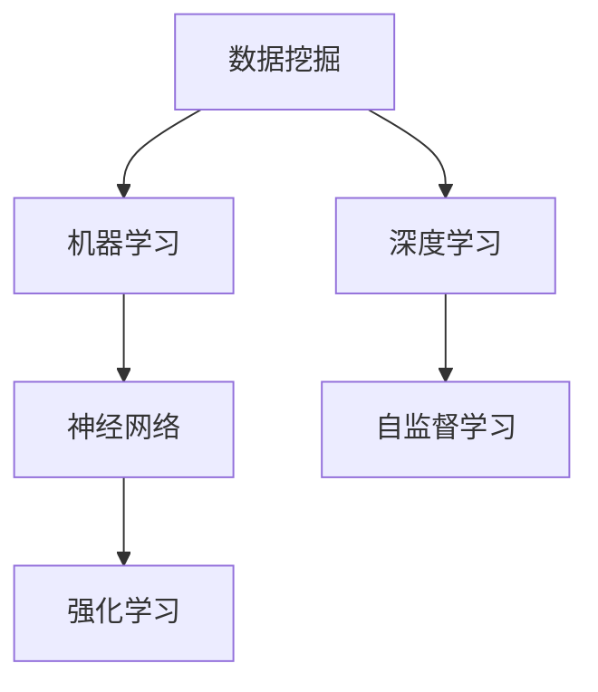

                 

# 理解洞察力：在复杂中寻找秩序

在信息爆炸的时代，数据量呈指数级增长，人们面临着前所未有的数据复杂性。为了在复杂的数据海洋中发现规律，洞察力显得尤为关键。本文将探讨如何通过理解和应用洞察力，在复杂的数据中寻找秩序，并给出具体的算法原理、操作步骤、数学模型和实例分析。

## 1. 背景介绍

### 1.1 问题由来

随着大数据时代的到来，数据不仅量多，而且结构复杂，传统的数据处理技术已经无法满足需求。而洞察力在复杂数据中寻找秩序，正是解决这一问题的重要手段。应用洞察力的方法，可以帮助我们从庞大的数据集中抽取出有价值的信息，用于决策支持、预测分析、客户关系管理等领域。

### 1.2 问题核心关键点

洞察力在数据中的寻找和提取，主要依赖于数据挖掘、机器学习和深度学习等技术手段。这些技术通过数据处理、模型训练和优化，识别出数据中的潜在模式和关联，帮助人们理解复杂现象背后的本质规律。

## 2. 核心概念与联系

### 2.1 核心概念概述

为了更好地理解洞察力在复杂数据中的应用，本节将介绍几个密切相关的核心概念：

- 数据挖掘（Data Mining）：从大量数据中提取出有用信息和知识的过程。包括分类、聚类、关联规则学习等算法。

- 机器学习（Machine Learning）：基于数据训练模型，使其具备预测、分类、回归等功能的技术。

- 深度学习（Deep Learning）：建立在神经网络基础上的高级机器学习方法，能够处理更加复杂和抽象的数据。

- 神经网络（Neural Network）：模拟人脑神经元处理信息的方式，由多个层次的非线性变换组成。

- 自监督学习（Self-Supervised Learning）：通过数据自身的特性进行训练，不依赖于人工标注，适用于大规模数据集。

- 强化学习（Reinforcement Learning）：通过智能体与环境的交互，优化决策策略以最大化奖励的技术。

这些核心概念之间的逻辑关系可以通过以下Mermaid流程图来展示：



这个流程图展示了一些关键数据科学领域的核心概念及其之间的关系：

1. 数据挖掘是机器学习和深度学习的输入来源，提供原始数据集。
2. 机器学习和深度学习是数据挖掘的输出结果，通过对数据进行建模和训练，实现数据抽取和转换。
3. 神经网络是机器学习和深度学习的关键技术，提供非线性映射和模式识别能力。
4. 自监督学习和强化学习是机器学习和深度学习的辅助方法，通过不同的训练方式增强模型的泛化能力。

## 3. 核心算法原理 & 具体操作步骤

### 3.1 算法原理概述

应用洞察力的主要过程，通常包括数据预处理、模型训练、特征工程和结果解读等步骤。本文主要聚焦于模型训练和特征工程，详细解释如何通过这些步骤从复杂数据中提取有意义的洞察力。

### 3.2 算法步骤详解

基于洞察力的数据分析过程，通常包含以下几个关键步骤：

**Step 1: 数据预处理**

- 数据清洗：处理缺失值、异常值、重复数据等，确保数据的质量。
- 数据转换：通过标准化、归一化等方法，将数据转换到相同的范围。
- 特征选择：选择最具有代表性的特征，降低数据维度，避免过拟合。

**Step 2: 模型训练**

- 选择模型：根据任务类型和数据特性，选择合适的模型，如线性回归、决策树、神经网络等。
- 训练模型：在训练集上对模型进行训练，调整超参数，最小化损失函数。
- 验证模型：在验证集上评估模型的性能，检查过拟合和欠拟合问题。

**Step 3: 特征工程**

- 特征提取：通过降维、编码等方法，将原始特征转换为模型可用的特征。
- 特征组合：将不同特征进行组合，构造新的特征变量。
- 特征选择：根据特征重要性进行筛选，保留最能反映数据特性的特征。

**Step 4: 结果解读**

- 结果可视化：将模型的输出结果可视化，帮助理解数据的潜在模式和关联。
- 业务解读：结合领域知识，对模型结果进行解读，形成业务洞察。
- 优化迭代：根据解读结果，调整模型和特征工程策略，进一步提升洞察力。

### 3.3 算法优缺点

应用洞察力的算法通常具有以下优点：

- 高效灵活：能够处理大规模数据集，适应多种数据类型和特征。
- 自动化程度高：通过机器学习自动化模型训练和特征提取，减少人工干预。
- 结果准确性高：通过大量数据训练，能够发现数据中的潜在模式和关联。

但同时，这些算法也存在一些局限性：

- 需要大量标注数据：模型训练依赖于人工标注的数据集，成本较高。
- 对数据质量敏感：数据清洗和预处理过程中需要人工干预，容易出错。
- 难以解释结果：深度学习模型往往是"黑盒"，难以解释其内部工作机制和决策过程。
- 模型复杂度高：深度学习模型结构复杂，计算资源消耗大。

尽管存在这些局限性，应用洞察力的方法在实际应用中已经展现出强大的能力，被广泛应用于金融、医疗、电商等多个领域。

### 3.4 算法应用领域

基于洞察力的数据分析技术，已经被广泛用于以下领域：

- 金融风险预测：通过分析历史交易数据，识别出潜在的风险点，进行风险控制。
- 医疗诊断和治疗：利用患者的历史健康数据，预测疾病风险和治疗效果，提高诊疗效率。
- 电商推荐系统：通过分析用户行为数据，推荐个性化的商品和服务，提升用户体验。
- 社交媒体分析：通过分析用户互动数据，发现潜在的用户需求和趋势，优化产品设计。
- 供应链管理：通过分析供应链数据，预测库存需求和物流瓶颈，优化供应链管理。

除了这些经典应用，基于洞察力的数据分析技术还在不断拓展，服务于更多创新场景，推动数据驱动的决策过程。

## 4. 数学模型和公式 & 详细讲解

### 4.1 数学模型构建

应用洞察力的核心在于通过数学模型对数据进行建模和分析。本文将重点介绍几个常见的数学模型，并给出其详细的构建过程。

**线性回归模型（Linear Regression）**

线性回归模型假设数据集遵循线性关系，通过最小化预测值与实际值之间的误差，找到最优的线性拟合线。其数学模型如下：

$$
\min_{\theta} \sum_{i=1}^n (y_i - \theta_0 - \theta_1x_i)^2
$$

其中，$\theta_0$ 和 $\theta_1$ 为模型的斜率和截距，$x_i$ 和 $y_i$ 为样本的输入和输出值。

**决策树模型（Decision Tree）**

决策树模型通过划分数据集，构建一棵树形结构，每个节点表示一个特征，每个分支表示一个特征值，叶子节点表示最终分类结果。其数学模型如下：

$$
\min_{T} \sum_{i=1}^n C(y_i, f_T(x_i))
$$

其中，$T$ 为决策树模型，$y_i$ 和 $x_i$ 为样本的输出和输入值，$f_T(x_i)$ 为决策树模型在输入 $x_i$ 上的预测输出。

**神经网络模型（Neural Network）**

神经网络模型通过多层非线性变换，构建一个由输入层、隐藏层和输出层组成的模型。其数学模型如下：

$$
y = \sigma(\sum_{j=1}^n w_{j,i}x_i + b_i)
$$

其中，$x_i$ 为输入样本，$w_{j,i}$ 为权重，$b_i$ 为偏置，$\sigma$ 为激活函数。

### 4.2 公式推导过程

下面以线性回归模型为例，推导其最小二乘法求解过程。

假设样本数据集为 $(x_1, y_1), (x_2, y_2), ..., (x_n, y_n)$，线性回归模型为 $y = \theta_0 + \theta_1x_i$。

根据最小二乘法，求解线性回归模型的最优参数 $\theta_0$ 和 $\theta_1$，最小化预测值与实际值之间的误差平方和。

$$
\min_{\theta} \sum_{i=1}^n (y_i - \theta_0 - \theta_1x_i)^2
$$

对上述方程求导，并令导数等于0，可得：

$$
\frac{\partial}{\partial\theta_0} \sum_{i=1}^n (y_i - \theta_0 - \theta_1x_i)^2 = -2\sum_{i=1}^n (y_i - \theta_0 - \theta_1x_i)
$$

$$
\frac{\partial}{\partial\theta_1} \sum_{i=1}^n (y_i - \theta_0 - \theta_1x_i)^2 = -2\sum_{i=1}^n x_i(y_i - \theta_0 - \theta_1x_i)
$$

求解上述方程组，即可得到最优的线性回归参数 $\theta_0$ 和 $\theta_1$。

### 4.3 案例分析与讲解

假设我们有一组房价数据，包含面积（$x$）和价格（$y$），共100个样本。我们想要通过线性回归模型预测房价。

首先，对数据进行标准化处理，使得每个特征值都在0到1之间：

$$
x'_i = \frac{x_i - \mu}{\sigma}
$$

其中，$\mu$ 为均值，$\sigma$ 为标准差。

然后，使用最小二乘法求解线性回归参数：

$$
\hat{\theta}_0 = \bar{y} - \hat{\theta}_1\bar{x}
$$

$$
\hat{\theta}_1 = \frac{\sum_{i=1}^n x_i(y_i - \hat{\theta}_0 - \hat{\theta}_1x_i)}{\sum_{i=1}^n x_i^2}
$$

其中，$\bar{y}$ 和 $\bar{x}$ 分别为价格的均值和面积的均值。

将求解得到的参数代入线性回归模型，即可对新数据进行房价预测。

## 5. 项目实践：代码实例和详细解释说明

### 5.1 开发环境搭建

在进行数据分析实践前，我们需要准备好开发环境。以下是使用Python进行Scikit-learn开发的环境配置流程：

1. 安装Anaconda：从官网下载并安装Anaconda，用于创建独立的Python环境。

2. 创建并激活虚拟环境：
```bash
conda create -n data-mining python=3.8 
conda activate data-mining
```

3. 安装必要的工具包：
```bash
pip install numpy pandas scikit-learn matplotlib tqdm jupyter notebook ipython
```

4. 安装可视化工具：
```bash
pip install seaborn plotly
```

完成上述步骤后，即可在`data-mining`环境中开始数据分析实践。

### 5.2 源代码详细实现

这里以线性回归模型为例，给出使用Scikit-learn进行数据建模的Python代码实现。

首先，导入必要的库：

```python
import numpy as np
import pandas as pd
from sklearn.linear_model import LinearRegression
from sklearn.model_selection import train_test_split
from sklearn.metrics import mean_squared_error
from sklearn.preprocessing import StandardScaler
import seaborn as sns
import matplotlib.pyplot as plt
```

然后，准备数据集：

```python
# 假设已经有一个pandas DataFrame，名为'data'
data = pd.read_csv('data.csv')

# 选择需要的特征和标签
X = data[['area']]
y = data['price']

# 标准化数据
scaler = StandardScaler()
X = scaler.fit_transform(X)
y = scaler.fit_transform(y.reshape(-1, 1))
```

接着，分割数据集：

```python
X_train, X_test, y_train, y_test = train_test_split(X, y, test_size=0.2, random_state=42)
```

然后，训练模型：

```python
# 初始化线性回归模型
model = LinearRegression()

# 训练模型
model.fit(X_train, y_train)
```

最后，评估模型：

```python
# 预测测试集
y_pred = model.predict(X_test)

# 计算均方误差
mse = mean_squared_error(y_test, y_pred)
print('Mean Squared Error:', mse)
```

### 5.3 代码解读与分析

让我们再详细解读一下关键代码的实现细节：

**数据准备**：
- `pd.read_csv('data.csv')`：从CSV文件中读取数据集。
- `X = data[['area']]`：选择需要的特征，这里以面积为例。
- `y = data['price']`：选择需要的标签，这里以价格为例。
- `scaler = StandardScaler()`：初始化标准化器，用于对数据进行标准化处理。
- `X = scaler.fit_transform(X)`：对特征进行标准化处理。

**数据分割**：
- `train_test_split`：将数据集分割为训练集和测试集，比例为80:20。
- `X_train, X_test, y_train, y_test`：返回分割后的特征和标签数据。

**模型训练**：
- `LinearRegression()`：初始化线性回归模型。
- `model.fit(X_train, y_train)`：在训练集上训练模型。

**模型评估**：
- `y_pred = model.predict(X_test)`：对测试集进行预测。
- `mean_squared_error(y_test, y_pred)`：计算预测值和实际值之间的均方误差。

可以看到，Scikit-learn的API设计非常简洁，易于上手，同时提供了丰富的模型和工具，方便进行数据分析和建模。

## 6. 实际应用场景

### 6.1 金融风险预测

金融行业利用洞察力技术，可以预测市场波动、识别欺诈行为、进行信用评分等。通过分析历史交易数据，建立风险预测模型，帮助金融机构及时识别潜在的风险点，进行风险控制和防范。

### 6.2 医疗诊断和治疗

医疗行业通过应用洞察力，可以实现疾病的早期预测和诊断，优化治疗方案，提升医疗服务质量。利用患者的历史健康数据，训练疾病预测模型，帮助医生提前发现潜在疾病，优化治疗策略。

### 6.3 电商推荐系统

电商行业利用洞察力，可以个性化推荐商品和服务，提升用户体验和销售转化率。通过分析用户行为数据，建立个性化推荐模型，帮助电商平台推荐用户可能感兴趣的商品，增加用户粘性和购买率。

### 6.4 社交媒体分析

社交媒体平台利用洞察力，可以分析用户互动数据，发现潜在的用户需求和趋势，优化产品设计。通过分析用户评论和互动数据，建立情感分析模型，帮助企业了解用户对产品的反馈，优化产品功能和服务。

## 7. 工具和资源推荐

### 7.1 学习资源推荐

为了帮助开发者系统掌握洞察力的理论基础和实践技巧，这里推荐一些优质的学习资源：

1. 《Python数据科学手册》系列书籍：由Kaggle数据科学家撰写，详细介绍了数据科学的基本概念和Python库的使用方法。

2. Coursera《数据科学专项课程》：由斯坦福大学开设，提供了一系列关于数据科学的在线课程，涵盖从数据清洗到模型训练的多个方面。

3. Kaggle数据科学竞赛：参加Kaggle数据科学竞赛，可以学习和实践前沿数据科学技术，积累实战经验。

4. GitHub开源项目：在GitHub上搜索相关开源项目，学习和借鉴先进的洞察力实现方法。

通过这些资源的学习实践，相信你一定能够快速掌握洞察力的精髓，并用于解决实际的分析问题。

### 7.2 开发工具推荐

高效的开发离不开优秀的工具支持。以下是几款用于洞察力开发常用的工具：

1. Jupyter Notebook：基于Python的交互式开发环境，支持代码编写、数据可视化、模型训练等功能。

2. PyCharm：功能强大的Python IDE，提供代码高亮、自动补全、版本控制等开发工具。

3. RStudio：R语言开发环境，提供丰富的数据可视化和统计分析工具。

4. Microsoft Excel：传统的电子表格工具，适合进行简单的数据处理和分析。

5. Tableau：流行的数据可视化工具，支持多种数据源和可视化图表。

合理利用这些工具，可以显著提升洞察力开发和分析的效率，加快创新迭代的步伐。

### 7.3 相关论文推荐

洞察力技术的发展源于学界的持续研究。以下是几篇奠基性的相关论文，推荐阅读：

1. "An Introduction to Statistical Learning" by Gareth James et al.：介绍了机器学习的基本概念和方法，包括回归、分类、聚类等。

2. "Pattern Recognition and Machine Learning" by Christopher Bishop：介绍了机器学习和深度学习的基本原理，适合深入学习相关技术。

3. "Deep Learning" by Ian Goodfellow et al.：介绍了深度学习的基本概念和方法，适合学习复杂的神经网络模型。

4. "Data Science for Business" by Foster Provost and Tom Fawcett：介绍了数据科学在商业中的应用，涵盖数据分析、模型训练和结果解读等方面。

这些论文代表了大数据时代洞察力技术的理论基础，通过学习这些前沿成果，可以帮助研究者把握学科前进方向，激发更多的创新灵感。

## 8. 总结：未来发展趋势与挑战

### 8.1 总结

本文对洞察力在复杂数据中的应用进行了全面系统的介绍。首先阐述了洞察力在复杂数据分析中的重要作用，明确了其在数据挖掘、机器学习和深度学习中的关键地位。其次，从原理到实践，详细讲解了洞察力的数学模型和操作步骤，给出了完整的代码实例。同时，本文还广泛探讨了洞察力技术在金融、医疗、电商等多个领域的应用前景，展示了其强大的能力。

通过本文的系统梳理，可以看到，洞察力技术在复杂数据中的应用，不仅能帮助我们发现数据的潜在模式和关联，还能推动数据驱动的决策过程。未来，伴随技术的不断进步，洞察力技术必将在更多领域大放异彩。

### 8.2 未来发展趋势

展望未来，洞察力技术的发展趋势主要体现在以下几个方面：

1. 自动化程度提升：洞察力技术的自动化程度将进一步提升，降低人工干预，提高模型训练和特征工程效率。

2. 模型复杂度优化：未来的模型将更加高效、轻量，能够在移动设备等资源受限的环境中快速运行。

3. 多模态融合：洞察力技术将与视觉、语音、文本等多模态数据进行深度融合，形成更全面的数据分析能力。

4. 自监督学习普及：自监督学习将在洞察力技术中得到广泛应用，解决大规模标注数据获取难的问题。

5. 模型解释性增强：未来的洞察力模型将具备更强的可解释性，提供更直观、易懂的分析结果。

6. 多领域应用拓展：洞察力技术将进一步拓展到更多行业领域，如教育、政府、交通等，带来更广泛的应用场景。

以上趋势凸显了洞察力技术的发展潜力，未来必将在更多领域得到应用，提升数据驱动的决策效率和质量。

### 8.3 面临的挑战

尽管洞察力技术已经取得了不少成果，但在应用过程中仍面临诸多挑战：

1. 数据质量问题：数据清洗和预处理过程中容易出错，影响模型训练效果。

2. 模型过拟合：洞察力模型往往复杂度较高，容易出现过拟合问题，影响泛化性能。

3. 资源消耗大：模型训练和推理过程中资源消耗较大，尤其是在大规模数据集上。

4. 结果解释性不足：深度学习模型往往是"黑盒"，难以解释其内部工作机制和决策过程。

5. 安全与隐私问题：洞察力技术涉及大量个人数据，数据隐私和安全问题需要引起重视。

6. 伦理与法律问题：洞察力技术的应用需要遵守相关法律法规，避免歧视和偏见。

尽管存在这些挑战，但伴随技术不断进步和行业规范的完善，这些问题将逐渐得到解决，洞察力技术必将在更多领域得到应用。

### 8.4 研究展望

面对洞察力技术面临的挑战，未来的研究需要在以下几个方面寻求新的突破：

1. 数据预处理自动化：研究数据预处理的自动化技术，降低人工干预，提高数据清洗和预处理的效率和准确性。

2. 模型结构简化：研究高效的模型结构和算法，降低计算资源消耗，提升模型的可解释性和泛化性能。

3. 多模态数据融合：研究多模态数据融合技术，提升洞察力模型对不同数据源的理解能力。

4. 自监督学习扩展：研究自监督学习技术，探索更多无标注数据的利用方法，减少对大规模标注数据的依赖。

5. 结果可视化增强：研究更直观、易懂的可视化方法，提高洞察力结果的可解释性和决策支持能力。

6. 伦理与法律保障：研究数据隐私保护和伦理监管技术，确保洞察力技术的应用符合法律和道德标准。

这些研究方向将推动洞察力技术的不断进步，为数据驱动的决策过程带来新的动力。面向未来，洞察力技术需要在理论与实践之间不断迭代和优化，才能真正实现其价值。

## 9. 附录：常见问题与解答

**Q1: 如何选择合适的洞察力模型？**

A: 选择合适的洞察力模型需要考虑多个因素，包括数据类型、任务类型、计算资源等。一般而言，对于简单数据集，线性回归和逻辑回归等传统模型即可满足需求；对于复杂数据集，神经网络模型和深度学习模型更为合适。在选择模型时，可以先进行简单的特征工程和数据预处理，评估不同模型的性能，选择最优模型。

**Q2: 洞察力模型中的正则化技术有哪些？**

A: 洞察力模型中的正则化技术主要包括L1正则、L2正则、Dropout等。L1正则和L2正则通过添加正则项，惩罚模型的复杂度，防止过拟合。Dropout通过随机丢弃部分神经元，降低模型的复杂度，增强泛化能力。这些技术通常需要根据具体任务和数据特点进行灵活选择和组合。

**Q3: 如何降低洞察力模型的计算资源消耗？**

A: 降低计算资源消耗可以从以下几个方面入手：
1. 数据预处理：尽量减少数据的复杂度和维度，降低计算资源消耗。
2. 模型简化：选择更简单、更高效的模型结构，如线性回归、决策树等。
3. 特征选择：选择最具有代表性的特征，减少计算资源消耗。
4. 多模型集成：采用模型集成技术，如Bagging、Boosting等，提高模型效率。
5. 硬件加速：利用GPU、TPU等硬件加速技术，提升计算速度。

**Q4: 洞察力模型中的特征工程包括哪些步骤？**

A: 洞察力模型中的特征工程主要包括以下步骤：
1. 特征选择：选择最具有代表性的特征，减少计算资源消耗。
2. 特征提取：通过降维、编码等方法，将原始特征转换为模型可用的特征。
3. 特征组合：将不同特征进行组合，构造新的特征变量。
4. 特征编码：将特征转换为模型可接受的数据类型，如数值型、二值型等。
5. 特征缩放：对特征进行标准化或归一化处理，提高模型训练效率和效果。

通过以上步骤，可以优化模型的输入数据，提高模型的性能和效率。

**Q5: 如何提高洞察力模型的可解释性？**

A: 提高洞察力模型的可解释性可以从以下几个方面入手：
1. 可视化结果：将模型输出结果进行可视化，直观展示数据的潜在模式和关联。
2. 特征重要性分析：通过特征重要性分析，了解模型中哪些特征对预测结果影响最大。
3. 模型简化：选择更简单、更透明的模型结构，提高模型的可解释性。
4. 解释模型原理：解释模型的训练过程和内部机制，提供清晰的决策逻辑。

通过以上方法，可以提高洞察力模型的可解释性，增强其决策支持能力。

---

作者：禅与计算机程序设计艺术 / Zen and the Art of Computer Programming

