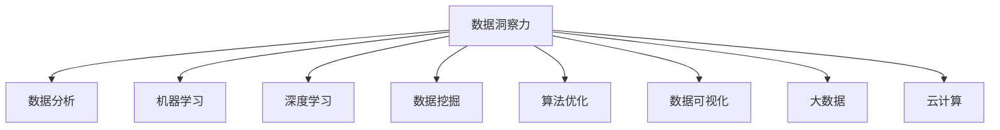

                 

# 理解洞察力：在纷杂中寻找本质

> 关键词：数据洞察力,数据分析,机器学习,深度学习,数据挖掘,算法优化,数据可视化,大数据,云计算

## 1. 背景介绍

### 1.1 问题由来

在当今信息爆炸的时代，数据量呈现出爆炸式增长，如何从海量数据中提取有价值的信息，进行深入洞察，成为一个重要的议题。从商业决策到公共政策，从科学研究到日常生活的方方面面，数据洞察力都在发挥着越来越重要的作用。

传统的统计分析和人工直觉方法已经难以应对复杂的现代数据。机器学习和深度学习技术的兴起，为数据洞察力提供了新的工具和方法。但机器学习的核心——算法和模型，其复杂性和难度常常让人们望而却步。

本文将从数据洞察力的核心概念、技术原理以及实际应用场景入手，详细介绍如何通过算法和技术手段，从纷杂的数据中寻找本质，揭示隐藏在数据背后的规律和洞见。

### 1.2 问题核心关键点

本文将主要关注以下几个关键问题：
1. 数据洞察力的定义和价值
2. 主要数据洞察力技术和算法原理
3. 数据洞察力的应用场景和挑战
4. 如何通过技术手段提升数据洞察力

## 2. 核心概念与联系

### 2.1 核心概念概述

为更好地理解数据洞察力，本节将介绍几个密切相关的核心概念：

- **数据洞察力(Data Insight)**：通过数据分析和处理，从原始数据中挖掘出有价值的信息和洞见，用于指导决策和行动的过程。
- **数据分析(Analysis)**：使用统计、机器学习和深度学习等方法，对数据进行系统化的分析，揭示数据背后的规律和关系。
- **机器学习(Machine Learning)**：一种通过算法和模型，从数据中自动学习知识，并应用于预测和决策的技术。
- **深度学习(Deep Learning)**：机器学习的一个分支，通过多层神经网络模拟人脑神经网络结构，解决复杂模式识别和预测问题。
- **数据挖掘(Data Mining)**：从原始数据中发现有用信息和知识的过程，包括数据清洗、数据挖掘、数据可视化等步骤。
- **算法优化(Algorithm Optimization)**：通过算法设计、模型训练等手段，提升算法效率和性能的过程。
- **数据可视化(Data Visualization)**：将数据转换为图形化表示，使数据洞见更直观、易理解。
- **大数据(Big Data)**：体量大、速度快、种类多的数据集合，需要借助分布式计算和云计算等技术进行处理。
- **云计算(Cloud Computing)**：基于互联网的计算方式，通过分布式计算资源池，提供按需服务。

这些核心概念之间的逻辑关系可以通过以下Mermaid流程图来展示：



这个流程图展示了大数据洞察力的核心概念及其之间的关系：

1. 数据洞察力作为目标，包含数据分析、机器学习、深度学习、数据挖掘、算法优化、数据可视化等多种技术手段。
2. 数据分析、机器学习、深度学习、数据挖掘、算法优化等技术，分别用于处理和分析数据，挖掘数据中的洞见。
3. 数据可视化技术，用于直观展示数据洞见。
4. 大数据和云计算技术，提供计算和存储资源，支撑数据洞察力的实现。

这些概念共同构成了数据洞察力的技术体系，使其能够高效、准确地从复杂数据中提取有价值的洞见。

## 3. 核心算法原理 & 具体操作步骤

### 3.1 算法原理概述

数据洞察力是一个涵盖多个技术领域的过程，其核心在于算法和模型。本文将介绍几种常见的数据洞察力算法和技术，包括线性回归、决策树、随机森林、神经网络和深度学习等。

### 3.2 算法步骤详解

数据洞察力的具体实现步骤如下：

**Step 1: 数据准备与预处理**
- 收集原始数据，并进行清洗、去噪、归一化等预处理步骤。
- 对缺失数据进行填补，处理异常值，保证数据质量。

**Step 2: 特征选择与工程**
- 根据业务需求，选择有意义的特征，构建特征集。
- 对特征进行工程处理，如特征编码、归一化、特征降维等。

**Step 3: 模型训练与优化**
- 选择合适的模型，如线性回归、决策树、随机森林、神经网络等。
- 对模型进行训练，使用交叉验证等技术优化模型参数。

**Step 4: 模型评估与验证**
- 使用测试集评估模型性能，计算各种指标如准确率、召回率、F1分数等。
- 对模型进行调参，优化模型结构，提高模型泛化能力。

**Step 5: 结果展示与解读**
- 使用数据可视化工具展示模型结果。
- 对模型结果进行解读，发现数据背后的洞见和规律。

### 3.3 算法优缺点

数据洞察力的主要算法和技术各有优缺点：

**线性回归(Linear Regression)**
- 优点：简单易实现，适用于小规模数据集。
- 缺点：难以处理非线性关系，模型容易过拟合。

**决策树(Decision Tree)**
- 优点：可解释性强，适用于处理分类和回归问题。
- 缺点：容易过拟合，且对噪声敏感。

**随机森林(Random Forest)**
- 优点：鲁棒性好，可处理高维数据。
- 缺点：计算复杂度高，对计算资源要求较高。

**神经网络(Neural Networks)**
- 优点：适用于大规模数据，预测能力强。
- 缺点：模型复杂度高，需要大量数据和计算资源。

**深度学习(Deep Learning)**
- 优点：能够自动学习特征，适用于复杂模式识别问题。
- 缺点：计算资源需求大，模型难以解释。

### 3.4 算法应用领域

数据洞察力技术已经在众多领域得到广泛应用，例如：

- **金融领域**：用于信用评分、风险评估、交易预测等。
- **零售行业**：用于顾客行为分析、库存管理、市场趋势预测等。
- **医疗行业**：用于疾病预测、诊断、治疗方案推荐等。
- **电商领域**：用于用户行为分析、推荐系统、广告投放优化等。
- **物流行业**：用于货物运输路线规划、仓库管理等。
- **制造行业**：用于设备故障预测、生产流程优化等。

## 4. 数学模型和公式 & 详细讲解 & 举例说明

### 4.1 数学模型构建

本节将使用数学语言对数据洞察力的核心算法进行更加严格的刻画。

记输入特征集为 $X$，输出目标为 $y$，假设模型 $f$ 可以表示为：

$$ f(X) = W_1 f_1(X) + W_2 f_2(X) + \cdots + W_n f_n(X) + b $$

其中 $W_i$ 为第 $i$ 层权重，$f_i(X)$ 为第 $i$ 层特征函数，$b$ 为偏置项。

模型的损失函数 $L$ 可以表示为：

$$ L = \frac{1}{m} \sum_{i=1}^m (y_i - f(X_i))^2 $$

其中 $m$ 为样本数量。

### 4.2 公式推导过程

以下我们以线性回归为例，推导最小二乘法(Least Squares)损失函数的求解公式。

最小二乘法损失函数的求解过程如下：

1. 根据样本数据 $(x_1, y_1), (x_2, y_2), \cdots, (x_m, y_m)$，构建目标函数：

$$ \sum_{i=1}^m (y_i - Wf(x_i) - b)^2 $$

2. 对 $W$ 和 $b$ 求偏导数：

$$ \frac{\partial L}{\partial W} = -2 \sum_{i=1}^m (y_i - Wf(x_i) - b)f(x_i) $$
$$ \frac{\partial L}{\partial b} = -2 \sum_{i=1}^m (y_i - Wf(x_i) - b) $$

3. 令偏导数为0，解得：

$$ W = \frac{\sum_{i=1}^m (y_i - \bar{y})f(x_i)}{\sum_{i=1}^m f(x_i)^2} $$
$$ b = \bar{y} - W\bar{f} $$

其中 $\bar{y}$ 为 $y$ 的均值，$\bar{f}$ 为 $f(x_i)$ 的均值。

### 4.3 案例分析与讲解

假设有一组数据集 $(x_1, y_1), (x_2, y_2), \cdots, (x_m, y_m)$，其中 $x_i$ 为输入特征，$y_i$ 为输出目标。

1. 构建线性回归模型：

$$ y = Wf(x) + b $$

2. 使用最小二乘法损失函数进行训练：

$$ L = \frac{1}{m} \sum_{i=1}^m (y_i - Wf(x_i) - b)^2 $$

3. 求解损失函数最小值，得到权重和偏置项：

$$ W = \frac{\sum_{i=1}^m (y_i - \bar{y})x_i}{\sum_{i=1}^m x_i^2} $$
$$ b = \bar{y} - W\bar{x} $$

通过上述过程，可以构建出线性回归模型，用于预测和分析数据。

## 5. 项目实践：代码实例和详细解释说明

### 5.1 开发环境搭建

在进行数据洞察力项目实践前，我们需要准备好开发环境。以下是使用Python进行Scikit-learn开发的典型环境配置流程：

1. 安装Anaconda：从官网下载并安装Anaconda，用于创建独立的Python环境。

2. 创建并激活虚拟环境：
```bash
conda create -n sklearn-env python=3.8 
conda activate sklearn-env
```

3. 安装Scikit-learn：
```bash
conda install scikit-learn
```

4. 安装各类工具包：
```bash
pip install numpy pandas matplotlib scikit-image scikit-learn matplotlib seaborn
```

完成上述步骤后，即可在`sklearn-env`环境中开始数据洞察力项目的开发。

### 5.2 源代码详细实现

这里我们以线性回归为例，给出一个使用Scikit-learn进行数据洞察力实践的完整代码实现。

首先，定义一个线性回归模型：

```python
from sklearn.linear_model import LinearRegression
import pandas as pd
import numpy as np

# 读取数据集
data = pd.read_csv('data.csv')

# 定义输入和输出
X = data[['feature_1', 'feature_2', 'feature_3']]
y = data['target']

# 构建线性回归模型
model = LinearRegression()

# 训练模型
model.fit(X, y)

# 预测
y_pred = model.predict(X)
```

接着，使用数据可视化工具，展示模型的训练结果和预测效果：

```python
import matplotlib.pyplot as plt

# 绘制模型系数
plt.figure(figsize=(8, 6))
plt.plot(model.coef_, label='Model Coefficients')
plt.legend()
plt.show()

# 绘制预测结果
plt.figure(figsize=(8, 6))
plt.plot(y, label='Actual')
plt.plot(y_pred, label='Predicted')
plt.legend()
plt.show()
```

通过上述代码，我们可以构建线性回归模型，并对输入数据进行预测和可视化分析。

### 5.3 代码解读与分析

让我们再详细解读一下关键代码的实现细节：

**定义数据集**：
- 使用Pandas库读取数据集，将其转换为NumPy数组。
- 定义输入特征和输出目标。

**训练模型**：
- 使用Scikit-learn的LinearRegression类构建线性回归模型。
- 使用fit方法进行模型训练，将输入特征和输出目标作为训练数据。

**预测并可视化**：
- 使用predict方法进行预测。
- 使用Matplotlib库绘制模型系数和预测结果的图形。

可以看到，Scikit-learn库的封装使得数据洞察力的实现变得简洁高效。开发者可以将更多精力放在数据处理、模型改进等高层逻辑上，而不必过多关注底层的实现细节。

当然，工业级的系统实现还需考虑更多因素，如模型保存和部署、超参数的自动搜索、更灵活的任务适配层等。但核心的数据洞察力范式基本与此类似。

## 6. 实际应用场景

### 6.1 金融风险管理

在金融领域，数据洞察力技术可以用于风险管理和投资决策。通过分析历史交易数据、市场趋势、财务指标等，可以构建预测模型，评估信用风险、市场风险等，并据此制定相应的风险管理策略和投资方案。

**具体应用**：
- 构建信用评分模型，评估贷款申请人的信用风险。
- 使用市场预测模型，评估股票、债券等资产的投资价值。
- 构建模型预测经济指标，如GDP增长率、通货膨胀率等。

### 6.2 医疗健康管理

在医疗领域，数据洞察力技术可以用于疾病预测、治疗方案推荐和资源管理等。通过分析患者病历、治疗历史、基因信息等数据，可以构建预测模型，评估疾病风险、推荐治疗方案、优化医疗资源配置等。

**具体应用**：
- 使用基因数据构建疾病风险预测模型，帮助医生早期发现疾病。
- 构建治疗方案推荐模型，根据患者情况推荐最佳治疗方案。
- 使用医疗资源预测模型，优化医院床位、药品等资源的配置。

### 6.3 电商个性化推荐

在电商领域，数据洞察力技术可以用于个性化推荐、广告投放优化和销售预测等。通过分析用户行为数据、商品属性、交易历史等，可以构建推荐模型，推荐用户感兴趣的商品、优化广告投放效果和预测销售趋势。

**具体应用**：
- 使用协同过滤算法，推荐用户可能感兴趣的商品。
- 构建广告投放模型，根据用户行为预测广告效果。
- 使用时间序列预测模型，预测商品销售趋势。

### 6.4 未来应用展望

随着数据洞察力技术的不断发展，未来的应用场景将更加广泛，前景广阔。

1. **智慧城市管理**：在智慧城市领域，数据洞察力可以用于交通管理、环境监测、公共安全等。通过分析交通流量、气象数据、安防信息等，可以构建预测模型，优化交通管理、监测环境污染和提升公共安全水平。

2. **智能制造管理**：在智能制造领域，数据洞察力可以用于设备故障预测、生产流程优化和供应链管理等。通过分析生产数据、设备状态、供应链信息等，可以构建预测模型，提前发现设备故障、优化生产流程和降低供应链成本。

3. **能源管理优化**：在能源领域，数据洞察力可以用于电力需求预测、风能发电优化和能源管理等。通过分析历史能源数据、气象信息、用电负荷等，可以构建预测模型，优化能源供应和配置，提高能源利用效率。

4. **农业管理决策**：在农业领域，数据洞察力可以用于农作物产量预测、病虫害检测和资源管理等。通过分析土壤数据、气象信息、病虫害数据等，可以构建预测模型，优化农业生产管理，提高农业生产效率和质量。

## 7. 工具和资源推荐

### 7.1 学习资源推荐

为了帮助开发者系统掌握数据洞察力的理论基础和实践技巧，这里推荐一些优质的学习资源：

1. **《Python数据科学手册》**：由Jake VanderPlas编写，全面介绍了Python在数据科学中的应用，包括Scikit-learn库的使用。
2. **Coursera《机器学习》课程**：由Andrew Ng主讲的机器学习课程，深入浅出地介绍了机器学习的基本概念和常用算法。
3. **Kaggle竞赛平台**：Kaggle提供了大量数据洞察力竞赛和案例，可以实践和验证数据洞察力算法。
4. **Scikit-learn官方文档**：Scikit-learn库的官方文档，提供了丰富的算法实现和样例代码，是数据洞察力开发的重要参考。
5. **《机器学习实战》**：Wes McKinney编写，介绍了机器学习的基本算法和实现，适合初学者入门。

通过对这些资源的学习实践，相信你一定能够快速掌握数据洞察力的精髓，并用于解决实际的商业问题。

### 7.2 开发工具推荐

高效的开发离不开优秀的工具支持。以下是几款用于数据洞察力开发的常用工具：

1. **Jupyter Notebook**：基于Python的交互式开发环境，可以实时展示代码执行结果，适合数据洞察力项目开发。
2. **TensorFlow**：由Google主导开发的深度学习框架，提供了丰富的神经网络模型，适合数据洞察力项目开发。
3. **Scikit-learn**：Python的机器学习库，封装了多种经典算法，适合数据洞察力项目开发。
4. **Keras**：高层次的深度学习库，提供了简单易用的API，适合数据洞察力项目开发。
5. **NumPy**：Python的科学计算库，提供了高效的数组操作，适合数据洞察力项目开发。

合理利用这些工具，可以显著提升数据洞察力项目的开发效率，加快创新迭代的步伐。

### 7.3 相关论文推荐

数据洞察力技术的发展源于学界的持续研究。以下是几篇奠基性的相关论文，推荐阅读：

1. **《深度学习》(Deep Learning)**：Ian Goodfellow、Yoshua Bengio、Aaron Courville合著，全面介绍了深度学习的基本原理和应用。
2. **《机器学习实战》**：Peter Harrington编写，介绍了机器学习的基本算法和实现，适合初学者入门。
3. **《Python数据科学手册》**：Jake VanderPlas编写，全面介绍了Python在数据科学中的应用，包括Scikit-learn库的使用。
4. **《数据挖掘导论》**：Jerry Kohavi、John C. Platt合著，介绍了数据挖掘的基本概念和算法，适合数据洞察力项目开发。
5. **《统计学习方法》**：李航编写，介绍了统计学习的基本概念和算法，适合数据洞察力项目开发。

这些论文代表了大数据洞察力技术的发展脉络。通过学习这些前沿成果，可以帮助研究者把握学科前进方向，激发更多的创新灵感。

## 8. 总结：未来发展趋势与挑战

### 8.1 总结

本文对数据洞察力的核心概念、技术原理以及实际应用场景进行了全面系统的介绍。首先阐述了数据洞察力的定义和价值，明确了数据洞察力在商业决策、科学研究和日常生活中的重要地位。其次，从线性回归、决策树、随机森林、神经网络和深度学习等技术角度，详细讲解了数据洞察力的实现步骤和算法原理。同时，本文还探讨了数据洞察力的未来应用前景和面临的挑战，提供了丰富的学习资源、开发工具和论文推荐，力求为读者提供全方位的技术指引。

通过本文的系统梳理，可以看到，数据洞察力技术正在成为数据科学和人工智能领域的核心范式，极大地拓展了数据的应用边界，催生了更多的落地场景。受益于机器学习和深度学习等技术的不断进步，数据洞察力有望在未来持续发展和优化，成为各行各业智能化决策的重要基础。

### 8.2 未来发展趋势

展望未来，数据洞察力技术将呈现以下几个发展趋势：

1. **算法和模型不断演进**：随着深度学习技术的不断发展，新的算法和模型不断涌现，数据洞察力将进入更加高效、智能的阶段。
2. **计算资源持续提升**：云计算、分布式计算等技术不断发展，数据洞察力将能够处理更大规模、更复杂的数据集。
3. **跨领域数据融合**：数据洞察力技术将与其他领域的技术，如自然语言处理、计算机视觉、智能推荐等，进行更深入的融合，拓展数据洞察力的应用范围。
4. **实时性要求提高**：数据洞察力将逐渐走向实时化，能够实时处理和分析数据，提供即时决策支持。
5. **算法透明性和可解释性提升**：数据洞察力算法将更加注重透明性和可解释性，能够提供更有意义的洞见和解释。

以上趋势凸显了数据洞察力技术的广阔前景。这些方向的探索发展，必将进一步提升数据洞察力的性能和应用范围，为各行各业智能化决策提供更坚实的基础。

### 8.3 面临的挑战

尽管数据洞察力技术已经取得了瞩目成就，但在迈向更加智能化、普适化应用的过程中，它仍面临着诸多挑战：

1. **数据质量和多样性**：数据洞察力的效果很大程度上取决于数据的质量和多样性，如何获取高质量、多样化的数据，是数据洞察力面临的重要挑战。
2. **模型复杂性和可解释性**：深度学习模型虽然精度高，但复杂度高，难以解释其内部工作机制。如何提高模型的可解释性，是数据洞察力需要解决的关键问题。
3. **计算资源需求**：深度学习模型的计算资源需求大，如何优化模型结构和算法，降低计算成本，是数据洞察力面临的重要挑战。
4. **数据隐私和安全**：数据洞察力项目往往涉及大量敏感数据，如何保护数据隐私和安全，是数据洞察力需要解决的重要问题。
5. **跨领域应用难度**：数据洞察力技术在不同领域的应用存在差异，如何结合领域知识和数据特点，构建高效的模型，是数据洞察力面临的重要挑战。
6. **算法的鲁棒性和泛化能力**：数据洞察力算法需要具备鲁棒性和泛化能力，能够在不同数据集和场景下保持稳定性能。

### 8.4 研究展望

面对数据洞察力技术面临的挑战，未来的研究需要在以下几个方面寻求新的突破：

1. **跨领域算法优化**：结合领域知识和数据特点，设计更加高效、鲁棒的算法和模型。
2. **数据增强和合成**：通过数据增强和合成技术，提高数据的多样性和质量，减少数据样本的依赖。
3. **模型压缩和加速**：通过模型压缩和加速技术，提高数据洞察力算法的计算效率和实时性。
4. **可解释性提升**：通过算法透明性和可解释性技术，提高模型的可解释性，增强用户信任和应用可靠性。
5. **隐私保护和数据安全**：通过隐私保护和数据安全技术，保护数据隐私和安全，增强用户信任。
6. **实时数据处理**：通过实时数据处理技术，提高数据洞察力的实时性，提供即时决策支持。

这些研究方向的探索，必将引领数据洞察力技术迈向更高的台阶，为各行各业智能化决策提供更坚实的基础。

## 9. 附录：常见问题与解答

**Q1：数据洞察力与数据挖掘有何区别？**

A: 数据洞察力和数据挖掘都是数据处理和分析的重要方法，但侧重点有所不同。数据挖掘强调从数据中挖掘出有用的知识和模式，关注的是数据内部的关系和规律。而数据洞察力更加注重将数据中的洞见应用于实际问题，关注的是数据对业务和决策的影响。

**Q2：如何提高数据洞察力算法的准确性？**

A: 提高数据洞察力算法的准确性，可以从以下几个方面入手：
1. 收集更多、更高质量的数据，增加数据样本的多样性和覆盖面。
2. 选择合适的特征和特征工程方法，提高特征的表达能力。
3. 选择适合的算法和模型，并进行模型优化和调参。
4. 使用正则化、dropout等技术，防止过拟合。
5. 使用集成学习技术，如随机森林、梯度提升树等，提高模型的鲁棒性和泛化能力。

**Q3：数据洞察力在电商行业有哪些应用？**

A: 数据洞察力在电商行业有很多应用，例如：
1. 用户行为分析：通过分析用户的浏览、购买、评价等行为，发现用户偏好和购买意愿，进行个性化推荐和促销策略优化。
2. 库存管理：通过分析历史销售数据，预测未来的销售趋势，优化库存管理和供应链管理。
3. 广告投放优化：通过分析广告点击率、转化率等数据，优化广告投放策略，提高广告效果。
4. 商品推荐：通过分析用户历史行为和商品属性，推荐用户可能感兴趣的商品，提高用户满意度和购买转化率。
5. 价格优化：通过分析市场价格变化和用户购买行为，制定合理的价格策略，提高销售收益。

**Q4：数据洞察力在金融风险管理中的应用有哪些？**

A: 数据洞察力在金融风险管理中的应用包括：
1. 信用评分：通过分析用户的信用历史、收入情况、负债情况等数据，评估用户的信用风险，进行贷款审批和授信管理。
2. 市场预测：通过分析历史市场数据、宏观经济指标等，预测股票、债券等资产的市场表现，制定投资策略。
3. 风险评估：通过分析历史交易数据、市场波动等数据，评估交易风险，制定风险管理策略。
4. 反欺诈检测：通过分析交易数据、用户行为等数据，识别和防范欺诈行为，保护金融安全。
5. 保险定价：通过分析保险数据、用户风险评估等数据，制定合理的保险定价策略，降低保险公司风险。

**Q5：数据洞察力在医疗健康管理中的应用有哪些？**

A: 数据洞察力在医疗健康管理中的应用包括：
1. 疾病预测：通过分析患者病历、基因数据、生活方式等数据，预测疾病风险，进行早期干预和预防。
2. 治疗方案推荐：通过分析患者的病历、基因数据、治疗历史等数据，推荐最佳治疗方案，提高治疗效果。
3. 资源优化：通过分析医院床位、药品库存等数据，优化医疗资源配置，提高医疗服务质量。
4. 患者管理：通过分析患者的健康数据、行为数据等，制定个性化的健康管理方案，提高患者生活质量。
5. 医疗决策支持：通过分析医疗数据、市场数据等，支持医生和医疗机构制定科学的医疗决策，提高医疗服务水平。

---

作者：禅与计算机程序设计艺术 / Zen and the Art of Computer Programming

