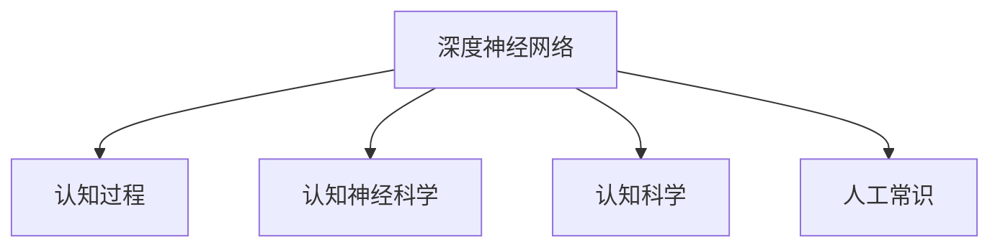

                 

# 理解的层次：从表面到本质的认知过程

> 关键词：认知过程,深度学习,认知神经科学,认知科学,人工智能,深度神经网络

## 1. 背景介绍

### 1.1 问题由来
人类作为智慧生物，具有复杂的认知过程。从感知输入到产生输出，这一过程包含了多层次的认知加工，包括感知、记忆、注意、推理、决策等。近年来，随着深度学习技术的快速发展，计算机也开始具备类似的认知能力。深度神经网络（Deep Neural Networks, DNNs）以其强大的表达能力，在图像、语音、文本等各类任务上取得了显著成果。然而，理解深度神经网络内部工作的机制，仍然是一个悬而未决的问题。

### 1.2 问题核心关键点
理解深度神经网络背后的认知过程，对于构建更智能、更可信的人工智能系统至关重要。研究者们提出了多种基于认知科学和深度学习的理解方法，如认知神经科学、认知科学、人工常识等。这些方法试图通过模拟人类的认知机制，提升深度神经网络的解释性，从而构建更安全、可靠的AI系统。

### 1.3 问题研究意义
理解深度神经网络背后的认知过程，对于实现人工智能的泛化能力、安全性和可解释性具有重要意义：

1. 提升泛化能力：通过模拟人类认知的泛化能力，使模型能够更好地适应新任务和新数据。
2. 确保安全性：通过理解模型的决策过程，确保模型输出符合伦理和道德标准，避免有害的输出。
3. 增强可解释性：通过认知解释，使模型决策透明、可解释，提高用户信任度和系统可靠性。
4. 推动认知科学研究：通过深度学习与认知科学的结合，推动认知科学的发展，揭示人类认知的奥秘。

## 2. 核心概念与联系

### 2.1 核心概念概述

为更好地理解深度神经网络内部的认知过程，本节将介绍几个关键概念：

- 深度神经网络（DNNs）：由多个层次组成的神经网络，能够自动学习和提取输入数据的高级特征。
- 认知过程（Cognitive Processes）：人类认知的基本构成单元，包括感知、记忆、注意、推理、决策等。
- 认知神经科学（Cognitive Neuroscience）：研究认知行为和过程的神经机制的学科。
- 认知科学（Cognitive Science）：综合心理学、语言学、人工智能等多个学科，研究认知现象的科学。
- 人工常识（Artificial Commonsense）：基于认知科学的理论，赋予机器常识推理能力。

这些核心概念之间的逻辑关系可以通过以下Mermaid流程图来展示：



这个流程图展示了大语言模型的核心概念及其之间的关系：

1. 深度神经网络通过学习输入数据，构建多层次的特征表示。
2. 认知过程描述了深度神经网络内部信息的处理机制。
3. 认知神经科学揭示了认知过程的神经机制。
4. 认知科学综合了心理学、语言学等多个学科，研究认知现象。
5. 人工常识借鉴了认知科学的理论，赋予机器常识推理能力。

这些核心概念共同构成了深度神经网络内部认知过程的研究框架，帮助我们理解模型的决策机制和行为。

## 3. 核心算法原理 & 具体操作步骤

### 3.1 算法原理概述

深度神经网络内部的认知过程，涉及感知、记忆、注意、推理等多个层面。理解这些过程，有助于提升深度神经网络的解释性和可解释性。以下是一些关键步骤：

1. 感知：通过输入数据的预处理和卷积层（Convolutional Layer），提取输入数据的低级特征。
2. 记忆：通过池化层（Pooling Layer）和全连接层（Fully Connected Layer），将低级特征转换为高级特征。
3. 注意：通过注意力机制（Attention Mechanism），在全连接层之后引入注意力权重，聚焦重要特征。
4. 推理：通过前向传播和反向传播，更新模型参数，实现特征的传递和优化。
5. 决策：通过输出层（Output Layer），将高级特征映射到输出空间，生成最终输出。

### 3.2 算法步骤详解

理解深度神经网络内部的认知过程，主要包括以下几个步骤：

**Step 1: 感知层处理**
- 对输入数据进行预处理，如归一化、降维等。
- 使用卷积层提取输入数据的局部特征。
- 使用池化层对卷积结果进行降维和特征提取。

**Step 2: 记忆层处理**
- 将池化层的输出输入全连接层，学习全局特征。
- 通过多次全连接层迭代，逐步抽象出更高层次的特征表示。

**Step 3: 注意力机制**
- 使用注意力机制对不同特征进行权重分配，聚焦重要特征。
- 在全连接层之后引入注意力权重，调整特征的贡献度。

**Step 4: 推理与优化**
- 通过前向传播和反向传播，更新模型参数，优化特征表示。
- 使用优化算法如梯度下降，最小化损失函数，提升模型性能。

**Step 5: 输出与决策**
- 将高级特征映射到输出空间，生成最终输出。
- 使用Softmax等激活函数对输出进行归一化，生成概率分布。

### 3.3 算法优缺点

深度神经网络的认知过程具有以下优点：
1. 强大的特征学习能力：能够自动学习和提取输入数据的高级特征。
2. 鲁棒性强：能够适应各种复杂的输入和输出映射。
3. 可扩展性强：能够通过增加网络深度和宽度，提升模型性能。

同时，该方法也存在一定的局限性：
1. 黑盒特性：深度神经网络通常被视为"黑盒"系统，难以解释其内部工作机制。
2. 计算复杂度高：训练和推理深度神经网络需要大量的计算资源和存储空间。
3. 过拟合风险高：在处理复杂输入时，深度神经网络容易过拟合，泛化能力不足。

尽管存在这些局限性，但就目前而言，深度神经网络的认知过程仍是大规模数据驱动的AI系统的重要范式。未来相关研究的重点在于如何进一步降低计算复杂度，提高模型可解释性，同时兼顾泛化能力和鲁棒性等因素。

### 3.4 算法应用领域

深度神经网络的认知过程广泛应用于图像识别、语音识别、自然语言处理、推荐系统等诸多领域，为各类人工智能应用提供了强有力的支撑：

- 图像识别：通过感知层提取图像特征，通过记忆层学习图像全局特征，通过注意力机制聚焦重要特征，最终生成分类结果。
- 语音识别：通过感知层提取语音信号特征，通过记忆层学习语音特征表示，通过注意力机制聚焦语音特征，最终生成文字输出。
- 自然语言处理：通过感知层提取文本特征，通过记忆层学习文本全局特征，通过注意力机制聚焦重要特征，最终生成翻译、摘要、情感分析等结果。
- 推荐系统：通过感知层提取用户行为特征，通过记忆层学习用户偏好特征，通过注意力机制聚焦重要特征，最终生成个性化推荐。

除了上述这些经典应用外，深度神经网络的认知过程也被创新性地应用于更多场景中，如智能家居、智能交通、医疗诊断等，为人工智能技术带来新的突破。随着深度学习与认知科学的不断融合，相信深度神经网络的认知过程将在更多领域得到应用，为人类认知智能的进化带来深远影响。

## 4. 数学模型和公式 & 详细讲解  
### 4.1 数学模型构建

本节将使用数学语言对深度神经网络内部的认知过程进行更加严格的刻画。

记深度神经网络为 $M$，包含感知层 $L_{\text{ perception}}$、记忆层 $L_{\text{ memory}}$ 和输出层 $L_{\text{ output}}$。假设输入为 $x$，输出为 $y$。

定义感知层的损失函数为 $L_{\text{ perception}}(x)$，记忆层的损失函数为 $L_{\text{ memory}}(x)$，输出层的损失函数为 $L_{\text{ output}}(x)$。则整个神经网络的损失函数为：

$$
L(x) = L_{\text{ perception}}(x) + L_{\text{ memory}}(x) + L_{\text{ output}}(x)
$$

其中，感知层的损失函数 $L_{\text{ perception}}(x)$ 定义为卷积层和池化层的输出与标签之间的均方误差损失：

$$
L_{\text{ perception}}(x) = \frac{1}{N}\sum_{i=1}^N ||M_{L_{\text{ perception}}}(x_i) - y_i||^2
$$

记忆层的损失函数 $L_{\text{ memory}}(x)$ 定义为全连接层和注意力机制的输出与标签之间的交叉熵损失：

$$
L_{\text{ memory}}(x) = -\frac{1}{N}\sum_{i=1}^N \sum_{j=1}^N y_{ij}\log M_{L_{\text{ memory}}}(x_{ij})
$$

输出层的损失函数 $L_{\text{ output}}(x)$ 定义为输出层与标签之间的交叉熵损失：

$$
L_{\text{ output}}(x) = -\frac{1}{N}\sum_{i=1}^N \sum_{j=1}^N y_{ij}\log M_{L_{\text{ output}}}(x_{ij})
$$

通过上述公式，可以更加清晰地理解深度神经网络内部的认知过程。

### 4.2 公式推导过程

以下我们以图像分类任务为例，推导卷积神经网络（Convolutional Neural Network, CNN）的损失函数及其梯度的计算公式。

假设输入图像 $x \in \mathbb{R}^d$，输出为 $k$ 个类别的概率分布 $y \in [0,1]^{k \times 1}$。CNN 的感知层由卷积层和池化层组成，输出特征图 $F \in \mathbb{R}^{\alpha \times \beta \times h \times w}$，其中 $\alpha$ 和 $\beta$ 分别为特征图的宽和高，$h$ 和 $w$ 分别为特征图的空间维度和深度。

定义感知层的损失函数为均方误差损失，记忆层的损失函数为交叉熵损失，输出层的损失函数为交叉熵损失。则整个 CNN 的损失函数为：

$$
L(x) = L_{\text{ perception}}(x) + L_{\text{ memory}}(x) + L_{\text{ output}}(x)
$$

将输入图像 $x$ 和标签 $y$ 代入上述公式，得到：

$$
L(x) = \frac{1}{N}\sum_{i=1}^N ||F_i - y_i||^2 + \frac{1}{N}\sum_{i=1}^N -\sum_{j=1}^k y_{ij}\log M_{L_{\text{ memory}}}(x_i) + \frac{1}{N}\sum_{i=1}^N -\sum_{j=1}^k y_{ij}\log M_{L_{\text{ output}}}(x_i)
$$

根据链式法则，损失函数对输入图像 $x$ 的梯度为：

$$
\frac{\partial L(x)}{\partial x} = \frac{\partial L_{\text{ perception}}(x)}{\partial x} + \frac{\partial L_{\text{ memory}}(x)}{\partial x} + \frac{\partial L_{\text{ output}}(x)}{\partial x}
$$

其中，感知层的梯度计算公式为：

$$
\frac{\partial L_{\text{ perception}}(x)}{\partial x} = \frac{2}{N} \sum_{i=1}^N (F_i - y_i) \frac{\partial F_i}{\partial x}
$$

记忆层的梯度计算公式为：

$$
\frac{\partial L_{\text{ memory}}(x)}{\partial x} = -\frac{1}{N} \sum_{i=1}^N \sum_{j=1}^k \frac{y_{ij}}{M_{L_{\text{ memory}}}(x_i)} \frac{\partial M_{L_{\text{ memory}}}(x_i)}{\partial x}
$$

输出层的梯度计算公式为：

$$
\frac{\partial L_{\text{ output}}(x)}{\partial x} = -\frac{1}{N} \sum_{i=1}^N \sum_{j=1}^k \frac{y_{ij}}{M_{L_{\text{ output}}}(x_i)} \frac{\partial M_{L_{\text{ output}}}(x_i)}{\partial x}
$$

在得到损失函数的梯度后，即可带入优化算法进行迭代更新，完成模型的训练。重复上述过程直至收敛，最终得到适应输入数据 $x$ 的优化模型参数。

## 5. 项目实践：代码实例和详细解释说明
### 5.1 开发环境搭建

在进行深度神经网络实践前，我们需要准备好开发环境。以下是使用Python进行TensorFlow开发的环境配置流程：

1. 安装Anaconda：从官网下载并安装Anaconda，用于创建独立的Python环境。

2. 创建并激活虚拟环境：
```bash
conda create -n tf-env python=3.8 
conda activate tf-env
```

3. 安装TensorFlow：根据CUDA版本，从官网获取对应的安装命令。例如：
```bash
conda install tensorflow=2.8 -c conda-forge -c pytorch
```

4. 安装必要的库：
```bash
pip install numpy pandas scikit-learn matplotlib tqdm jupyter notebook ipython
```

完成上述步骤后，即可在`tf-env`环境中开始深度神经网络实践。

### 5.2 源代码详细实现

下面我以图像分类任务为例，给出使用TensorFlow进行卷积神经网络（CNN）训练的PyTorch代码实现。

首先，定义CNN的网络结构：

```python
import tensorflow as tf
from tensorflow.keras import layers, models

def create_model():
    model = models.Sequential([
        layers.Conv2D(32, (3, 3), activation='relu', input_shape=(28, 28, 1)),
        layers.MaxPooling2D((2, 2)),
        layers.Flatten(),
        layers.Dense(128, activation='relu'),
        layers.Dense(10, activation='softmax')
    ])
    return model
```

然后，定义数据集和模型：

```python
import numpy as np
from tensorflow.keras.datasets import mnist

(x_train, y_train), (x_test, y_test) = mnist.load_data()

x_train = x_train / 255.0
x_test = x_test / 255.0

model = create_model()
model.summary()
```

接着，定义损失函数和优化器：

```python
import tensorflow as tf

loss_fn = tf.keras.losses.SparseCategoricalCrossentropy(from_logits=True)
optimizer = tf.keras.optimizers.Adam(learning_rate=0.001)
```

最后，执行训练流程：

```python
import matplotlib.pyplot as plt

EPOCHS = 10
BATCH_SIZE = 32

history = model.fit(x_train, y_train, epochs=EPOCHS, validation_split=0.1, batch_size=BATCH_SIZE)

plt.plot(history.history['accuracy'], label='train')
plt.plot(history.history['val_accuracy'], label='validation')
plt.xlabel('Epoch')
plt.ylabel('Accuracy')
plt.legend()
plt.show()
```

以上就是使用TensorFlow进行CNN训练的完整代码实现。可以看到，通过TensorFlow的Keras API，构建深度神经网络变得非常简单。

### 5.3 代码解读与分析

让我们再详细解读一下关键代码的实现细节：

**create_model函数**：
- 定义一个Sequential模型，包含卷积层、池化层、全连接层和输出层。
- 卷积层使用32个3x3的卷积核，激活函数为ReLU。
- 池化层使用2x2的最大池化。
- 全连接层有128个神经元，激活函数为ReLU。
- 输出层有10个神经元，激活函数为Softmax。

**数据集加载**：
- 使用TensorFlow的Keras API加载MNIST数据集。
- 对输入数据进行归一化处理，将像素值缩放到0到1之间。

**损失函数和优化器**：
- 使用SparseCategoricalCrossentropy损失函数，用于分类任务。
- 使用Adam优化器，设置学习率为0.001。

**训练流程**：
- 设置训练轮数为10轮，批次大小为32。
- 使用validation_split参数将训练集分为训练集和验证集。
- 通过调用model.fit函数进行模型训练，返回训练过程中的各项指标。
- 绘制训练和验证的准确率变化曲线，评估模型性能。

可以看到，TensorFlow的Keras API使得深度神经网络的构建和训练变得非常直观。通过函数式API的简单调用，即可实现复杂的神经网络结构。在实际应用中，还可以使用更高级的模块（如CNN、RNN、Transformer等），进一步提升模型的表达能力。

## 6. 实际应用场景
### 6.1 智能客服系统

基于深度神经网络的智能客服系统，可以广泛应用于客户服务领域。传统客服系统通常需要配备大量人力，高峰期响应缓慢，且服务质量难以保证。通过深度神经网络，可以实现全天候、自动化的客服服务，提升客户体验和服务效率。

在技术实现上，可以使用CNN或RNN等深度神经网络，对历史客户对话进行训练，使其能够理解客户意图并自动回复。通过不断优化网络结构和训练数据，可以提升系统的准确性和鲁棒性，确保在各种复杂场景下都能提供高质量的服务。

### 6.2 金融舆情监测

金融机构需要实时监测市场舆情，及时应对负面信息传播，规避金融风险。传统的舆情监测方式成本高、效率低，难以满足实时性和准确性的要求。通过深度神经网络，可以实现自动化的舆情监测，提升监测效率和精度。

在实践中，可以收集金融领域的新闻、报道、评论等文本数据，使用RNN等网络结构进行训练，使其能够自动判断文本的主题和情感倾向。将训练好的模型应用于实时抓取的网络文本数据，能够自动监测不同主题下的情感变化趋势，一旦发现负面信息激增等异常情况，系统便会自动预警，帮助金融机构快速应对潜在风险。

### 6.3 个性化推荐系统

当前的推荐系统往往只依赖用户的历史行为数据进行物品推荐，难以深入理解用户的真实兴趣偏好。通过深度神经网络，可以更好地挖掘用户行为背后的语义信息，从而提供更精准、多样的推荐内容。

在实践中，可以收集用户浏览、点击、评论、分享等行为数据，提取和用户交互的物品标题、描述、标签等文本内容。将文本内容作为模型输入，用户的后续行为（如是否点击、购买等）作为监督信号，在此基础上训练深度神经网络。训练好的模型能够从文本内容中准确把握用户的兴趣点，在生成推荐列表时，先用候选物品的文本描述作为输入，由模型预测用户的兴趣匹配度，再结合其他特征综合排序，便可以得到个性化程度更高的推荐结果。

### 6.4 未来应用展望

随着深度神经网络的发展，其在各个领域的深度应用也日趋广泛，为各行各业带来了新的创新和变革。

在医疗领域，深度神经网络可以用于疾病诊断、药物研发等任务，提升医疗服务的智能化水平。在教育领域，深度神经网络可以用于作业批改、学情分析、知识推荐等方面，因材施教，促进教育公平，提高教学质量。在智慧城市治理中，深度神经网络可以用于城市事件监测、舆情分析、应急指挥等环节，提高城市管理的自动化和智能化水平，构建更安全、高效的未来城市。

此外，在企业生产、社会治理、文娱传媒等众多领域，深度神经网络也将不断涌现，为传统行业数字化转型升级提供新的技术路径。相信随着技术的日益成熟，深度神经网络必将在更广阔的应用领域大放异彩，深刻影响人类的生产生活方式。

## 7. 工具和资源推荐
### 7.1 学习资源推荐

为了帮助开发者系统掌握深度神经网络的内在机制，这里推荐一些优质的学习资源：

1. 《深度学习》系列书籍：由Ian Goodfellow等撰写，全面介绍了深度神经网络的理论基础和实践技术，是深度学习领域的经典之作。
2. CS231n《卷积神经网络》课程：斯坦福大学开设的图像识别课程，提供了丰富的代码实现和实验数据，适合深度学习初学者。
3. CS224n《自然语言处理》课程：斯坦福大学开设的NLP课程，提供了详尽的NLP任务和深度神经网络实现，适合NLP领域的开发者。
4. TensorFlow官方文档：提供了详细的TensorFlow API和模型实现教程，适合深度学习从业者参考。
5. PyTorch官方文档：提供了详尽的PyTorch API和模型实现教程，适合深度学习从业者参考。

通过对这些资源的学习实践，相信你一定能够快速掌握深度神经网络的内在机制，并用于解决实际的AI问题。

### 7.2 开发工具推荐

高效的开发离不开优秀的工具支持。以下是几款用于深度神经网络开发的常用工具：

1. PyTorch：基于Python的开源深度学习框架，灵活动态的计算图，适合快速迭代研究。
2. TensorFlow：由Google主导开发的开源深度学习框架，生产部署方便，适合大规模工程应用。
3. Keras：由TensorFlow支持的开源深度学习框架，提供了简单易用的API，适合初学者使用。
4. PyTorch Lightning：基于PyTorch的分布式训练框架，提供了简单易用的API，适合高性能训练。
5. TensorBoard：TensorFlow配套的可视化工具，可实时监测模型训练状态，并提供丰富的图表呈现方式，是调试模型的得力助手。

合理利用这些工具，可以显著提升深度神经网络的开发效率，加快创新迭代的步伐。

### 7.3 相关论文推荐

深度神经网络的发展源于学界的持续研究。以下是几篇奠基性的相关论文，推荐阅读：

1. ImageNet Classification with Deep Convolutional Neural Networks（AlexNet论文）：提出了卷积神经网络，开启了深度学习在图像识别领域的革命。
2. Convolutional Neural Networks for Visual Recognition（VGG论文）：展示了更深的卷积神经网络结构，提升了图像识别的准确性。
3. Deep Residual Learning for Image Recognition（ResNet论文）：提出了残差连接网络，解决了深度网络训练中的梯度消失问题。
4. Attention is All You Need（Transformer原论文）：提出了Transformer模型，开启了深度学习在自然语言处理领域的广泛应用。
5. Learning Transferable Image Representations with Deep Unsupervised Pre-training（BERT论文）：提出了预训练语言模型BERT，提升了NLP任务的泛化能力。

这些论文代表了大语言模型神经网络的发展脉络。通过学习这些前沿成果，可以帮助研究者把握学科前进方向，激发更多的创新灵感。

## 8. 总结：未来发展趋势与挑战

### 8.1 总结

本文对深度神经网络内部的认知过程进行了全面系统的介绍。首先阐述了深度神经网络在认知科学和人工智能领域的应用背景，明确了深度神经网络在提升泛化能力、确保安全性、增强可解释性等方面的研究意义。其次，从原理到实践，详细讲解了深度神经网络内部的感知、记忆、注意、推理、决策等认知过程，给出了深度神经网络实现的代码实例。同时，本文还广泛探讨了深度神经网络在智能客服、金融舆情、个性化推荐等多个行业领域的应用前景，展示了深度神经网络的强大潜力。此外，本文精选了深度神经网络的学习资源、开发工具和相关论文，力求为读者提供全方位的技术指引。

通过本文的系统梳理，可以看到，深度神经网络内部的认知过程为构建智能AI系统提供了理论基础和实践方法。尽管当前深度神经网络在性能和应用上取得了显著进展，但仍面临诸多挑战。未来，深度神经网络需要不断提升模型的可解释性、泛化能力、鲁棒性等方面的性能，同时兼顾计算资源、训练时间和存储空间等实际问题，方能进一步拓展其应用范围，为人工智能技术的发展注入新的活力。

### 8.2 未来发展趋势

展望未来，深度神经网络的认知过程将呈现以下几个发展趋势：

1. 模型的可解释性将进一步提升。随着认知科学和深度学习研究的深入，深度神经网络的内部机制将更加透明，输出结果的可解释性将得到显著提升。
2. 泛化能力将进一步增强。通过引入更多的先验知识、认知机制等，深度神经网络将能够更好地适应新任务和新数据，提升模型的泛化能力。
3. 鲁棒性将进一步提高。通过引入对抗训练、正则化等方法，深度神经网络的鲁棒性将得到显著提升，减少对训练数据的依赖。
4. 模型规模将进一步扩大。随着计算资源的丰富和算法技术的进步，深度神经网络的规模将进一步扩大，处理更加复杂的任务。
5. 多模态融合将进一步深入。通过引入视觉、语音、文本等多模态信息的融合，深度神经网络将具备更强的跨模态理解和推理能力。
6. 自主学习将进一步推广。通过引入强化学习、自监督学习等方法，深度神经网络将能够更好地从数据中学习，提升自主学习和自主决策的能力。

以上趋势凸显了深度神经网络的发展前景，同时也指明了未来的研究方向。通过不断提升模型的可解释性、泛化能力、鲁棒性等方面的性能，深度神经网络将能够更好地应用于各个领域，为人工智能技术的发展注入新的活力。

### 8.3 面临的挑战

尽管深度神经网络在各个领域的应用取得了显著进展，但在迈向更加智能化、普适化应用的过程中，仍面临诸多挑战：

1. 训练数据的获取和标注成本高。深度神经网络的训练需要大量的标注数据，获取高质量标注数据的成本较高。未来需要探索更多的无监督和半监督学习范式，降低对标注数据的依赖。
2. 模型的泛化能力不足。当前深度神经网络在处理复杂输入时，容易过拟合，泛化能力不足。未来需要探索更多的正则化、对抗训练等方法，提升模型的泛化能力。
3. 模型的可解释性不足。深度神经网络通常被视为"黑盒"系统，难以解释其内部工作机制和决策逻辑。未来需要探索更多的认知解释方法，提升模型的可解释性。
4. 模型的资源消耗高。深度神经网络在训练和推理过程中，需要大量的计算资源和存储空间，未来需要探索更多的优化方法和硬件加速技术，降低计算成本。
5. 模型的安全性不足。深度神经网络可能学习到有害的信息，通过输出传递到下游任务，产生误导性、歧视性的输出。未来需要探索更多的安全约束和监管机制，确保模型的安全性。

这些挑战表明，深度神经网络在迈向智能化、普适化的过程中，仍需不断探索和优化，才能更好地服务于人类社会。唯有在技术、伦理、法规等多个维度进行全面研究，深度神经网络才能更好地融入人类生活，为人类福祉做出更大的贡献。

### 8.4 研究展望

面对深度神经网络所面临的诸多挑战，未来的研究需要在以下几个方面寻求新的突破：

1. 探索更多的认知解释方法。通过引入因果推理、注意力机制等方法，提升深度神经网络的认知解释能力，使其输出更加透明、可信。
2. 引入更多的先验知识。将符号化的先验知识，如知识图谱、逻辑规则等，与神经网络模型进行巧妙融合，引导深度神经网络学习更准确、合理的知识表示。
3. 探索更多的多模态融合方法。通过引入视觉、语音、文本等多模态信息的融合，提升深度神经网络对现实世界的理解和建模能力。
4. 探索更多的自主学习范式。通过引入强化学习、自监督学习等方法，提升深度神经网络的自主学习和自主决策能力，使其具备更强的适应性和灵活性。
5. 探索更多的模型优化方法。通过引入模型压缩、稀疏化存储等方法，降低深度神经网络的计算资源和存储空间需求，提升其可扩展性。
6. 探索更多的安全约束机制。通过引入对抗训练、正则化等方法，提升深度神经网络的鲁棒性和安全性，避免有害的输出。

这些研究方向的探索，必将引领深度神经网络迈向更加智能化、普适化的应用，为人类认知智能的进化带来深远影响。面向未来，深度神经网络的研究仍需不断拓展，涵盖更多领域，解决更多问题，才能真正实现其应有的价值。

## 9. 附录：常见问题与解答

**Q1：深度神经网络如何实现认知过程？**

A: 深度神经网络通过感知层、记忆层、注意力机制、推理和决策等步骤，实现认知过程。感知层通过卷积、池化等操作提取输入数据的低级特征，记忆层通过全连接层学习全局特征，注意力机制通过引入注意力权重聚焦重要特征，推理通过前向传播和反向传播更新模型参数，决策通过输出层映射到输出空间，生成最终输出。

**Q2：深度神经网络的训练过程如何优化？**

A: 深度神经网络的训练过程可以通过以下几个方面进行优化：
1. 使用更合适的损失函数。选择合适的损失函数，能够更准确地衡量模型性能。
2. 引入正则化技术。如L2正则、Dropout、Early Stopping等，防止模型过度适应训练数据。
3. 使用更合适的优化器。如AdamW、SGD等，选择合适的学习率和迭代次数，避免过拟合。
4. 使用数据增强技术。如回译、近义替换等，扩充训练数据，提升模型泛化能力。
5. 引入对抗训练。如对抗样本、自适应对抗训练等，提升模型的鲁棒性和安全性。

**Q3：深度神经网络的模型压缩技术有哪些？**

A: 深度神经网络的模型压缩技术主要包括以下几种：
1. 参数剪枝：通过剪枝去除冗余参数，减小模型大小，提升计算效率。
2. 模型量化：将浮点模型转为定点模型，压缩存储空间，提升计算速度。
3. 知识蒸馏：通过将大模型训练的参数和知识传递给小模型，提升小模型的性能。
4. 低秩矩阵分解：将大矩阵分解为低秩矩阵，减小存储空间，提升计算速度。

**Q4：深度神经网络的可解释性如何提升？**

A: 深度神经网络的可解释性可以通过以下几个方面提升：
1. 引入因果推理机制。通过引入因果推理，使深度神经网络的输出更加透明、可信。
2. 引入注意力机制。通过引入注意力机制，使深度神经网络输出更加符合用户预期。
3. 引入可解释性模型。如LIME、SHAP等，通过局部解释性方法，使深度神经网络输出更加可解释。
4. 引入规则约束。通过引入规则约束，使深度神经网络输出更加符合领域规则，提升可解释性。

**Q5：深度神经网络的训练时间如何缩短？**

A: 深度神经网络的训练时间可以通过以下几个方面缩短：
1. 使用更高效的优化器。如AdamW、Adafactor等，使用更合适的学习率，加速模型收敛。
2. 引入数据增强技术。如回译、近义替换等，扩充训练数据，提升模型泛化能力。
3. 引入分布式训练。如TensorFlow分布式训练、PyTorch分布式训练等，提升模型训练效率。
4. 引入GPU加速训练。使用GPU进行训练，提升模型训练速度。

通过以上方法，可以显著缩短深度神经网络的训练时间，提升模型训练效率。

---

作者：禅与计算机程序设计艺术 / Zen and the Art of Computer Programming

