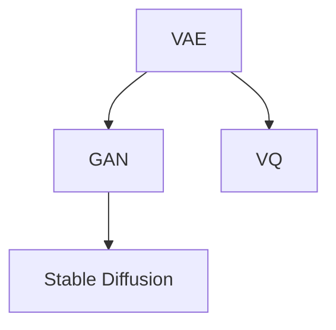

                 

# 生成式AI艺术：VQGAN与Stable Diffusion解析

> 关键词：生成式AI, VQGAN, Stable Diffusion, 自监督学习, 变分自编码器(VAE), 神经场理论(NFT)

## 1. 背景介绍

### 1.1 问题由来
生成式AI技术，尤其是基于变分自编码器(Variational Autoencoder, VAE)和生成对抗网络(Generative Adversarial Network, GAN)的生成模型，近年来在图像生成、文本生成等领域取得了显著的进展。VQGAN（基于向量量化（Vector Quantization, VQ）的生成对抗网络）和Stable Diffusion（稳定扩散模型）是这一领域的最新进展，它们不仅提升了生成模型的质量和稳定性，还在艺术创作和图像处理等领域展现出广泛的应用前景。

VQGAN和Stable Diffusion通过将变分自编码器与向量量化相结合，实现了更高效的图像生成。其中，VQGAN利用变分自编码器进行图像编码和解码，而向量量化则通过学习有限的代码本（Codebook），将图像映射到高维代码空间中，从而大大减少了计算复杂度。Stable Diffusion则在此基础上，进一步引入噪声项，通过控制噪声分布的变化，生成高分辨率、高质量的图像。

这些技术的应用不仅提升了生成图像的清晰度和细节表现，还在艺术创作和图像处理等场景中展现出广泛的应用前景，如艺术作品创作、图像修复、图像合成等。本文将详细解析VQGAN和Stable Diffusion的核心算法原理、具体操作步骤以及其在实际应用中的表现，以期为读者提供一个全面的技术理解框架。

### 1.2 问题核心关键点
VQGAN和Stable Diffusion技术的核心关键点包括：

- 自监督学习：通过无监督的图像生成任务，训练模型学习图像语义表示。
- 变分自编码器(VAE)：用于学习图像的编码和解码过程，生成高质量的图像表示。
- 向量量化(VQ)：通过学习有限的代码本，将图像映射到高维代码空间，提升生成效率。
- 生成对抗网络(GAN)：通过对抗训练，提升生成图像的质量和多样性。
- 稳定扩散模型(Stable Diffusion)：引入噪声项，控制噪声分布，生成高分辨率、高质量的图像。

这些核心技术相互交织，共同构成了VQGAN和Stable Diffusion的高效、稳定、高质量生成图像的能力。

## 2. 核心概念与联系

### 2.1 核心概念概述

为更好地理解VQGAN和Stable Diffusion的核心算法，本节将介绍几个密切相关的核心概念：

- 变分自编码器(Variational Autoencoder, VAE)：一种生成模型，通过学习图像的潜在表示，实现图像编码和解码。
- 生成对抗网络(Generative Adversarial Network, GAN)：通过两个对抗性神经网络，生成高质量、多样性的图像。
- 向量量化(Vector Quantization, VQ)：通过学习有限的代码本，将图像映射到高维代码空间中，提升生成效率。
- 神经场理论(Neural Field Theory, NFT)：一种理论，将生成过程看作是空间中神经场的相互作用，用于解释和模拟生成图像的形成。
- 稳定扩散模型(Stable Diffusion)：在生成对抗网络的基础上，通过控制噪声分布的变化，生成高分辨率、高质量的图像。

这些核心概念之间的逻辑关系可以通过以下Mermaid流程图来展示：



这个流程图展示了大规模生成模型的核心概念及其之间的关系：

1. 变分自编码器(VAE)通过学习图像的潜在表示，实现图像的编码和解码。
2. 生成对抗网络(GAN)通过对抗性训练，生成高质量、多样性的图像。
3. 向量量化(VQ)通过学习有限的代码本，将图像映射到高维代码空间中，提升生成效率。
4. 稳定扩散模型(Stable Diffusion)在生成对抗网络的基础上，通过控制噪声分布的变化，生成高分辨率、高质量的图像。

这些概念共同构成了生成式AI技术的基础，使得模型能够高效、稳定、高质量地生成图像。通过理解这些核心概念，我们可以更好地把握生成式AI技术的本质和应用。

## 3. 核心算法原理 & 具体操作步骤
### 3.1 算法原理概述

VQGAN和Stable Diffusion技术的核心算法原理主要基于自监督学习，结合变分自编码器(VAE)和生成对抗网络(GAN)的优点，通过向量量化(VQ)提升生成效率，并通过稳定扩散模型(Stable Diffusion)增强图像质量。

形式化地，假设输入图像为 $x$，经过变分自编码器(VAE)编码后的潜在表示为 $z$，经过向量量化(VQ)后的代码本表示为 $c$。则在生成对抗网络(GAN)中，生成器(G)通过解码器(D)将潜在表示 $z$ 映射回图像 $x'$，判别器(D)则判断图像 $x'$ 与真实图像 $x$ 的相似度。最终，生成器通过对抗训练，优化其生成的图像质量，而判别器则通过对抗训练，提升对真实和生成图像的判别能力。

通过这一过程，模型学习到了图像的潜在表示 $z$ 和代码本表示 $c$，从而实现了高效、高质量的图像生成。在实际应用中，VQGAN和Stable Diffusion通常使用循环神经网络(RNN)或卷积神经网络(CNN)作为编码器、解码器和判别器，通过多轮迭代优化，不断提升生成图像的质量和多样性。

### 3.2 算法步骤详解

VQGAN和Stable Diffusion的生成流程主要包括以下几个关键步骤：

**Step 1: 准备数据集**
- 收集并准备高质量的图像数据集，如ImageNet等。
- 对数据集进行预处理，如裁剪、缩放、归一化等。

**Step 2: 搭建模型架构**
- 搭建变分自编码器(VAE)的编码器和解码器，选择适当的神经网络架构，如ResNet、Inception等。
- 搭建生成对抗网络(GAN)的生成器和判别器，同样选择适当的神经网络架构。
- 引入向量量化(VQ)模块，用于将图像编码到高维代码本中。

**Step 3: 设置超参数**
- 设置模型的学习率、迭代次数、批大小等超参数。
- 设置判别器的损失函数、生成器的损失函数等。
- 设置VQ的代码本维度、量化层数等。

**Step 4: 模型训练**
- 使用数据集进行模型训练，使用生成对抗网络(GAN)的对抗训练策略，优化生成器(G)和判别器(D)。
- 在生成对抗网络(GAN)训练过程中，不断更新变分自编码器(VAE)的参数，提升编码和解码的准确性。
- 在生成对抗网络(GAN)训练过程中，引入噪声项，控制噪声分布的变化，生成高分辨率、高质量的图像。

**Step 5: 生成图像**
- 使用训练好的模型，输入新的潜在表示 $z$ 或图像数据 $x$，生成新的图像 $x'$。
- 根据实际应用需求，调整生成过程中的噪声分布，提升生成图像的多样性和质量。

以上是VQGAN和Stable Diffusion的基本生成流程，各步骤的具体实现细节可能根据不同的应用场景和模型架构有所差异。

### 3.3 算法优缺点

VQGAN和Stable Diffusion技术在图像生成领域具有显著的优点，但也存在一定的局限性：

**优点：**

- 高效：通过向量量化(VQ)将图像映射到高维代码本中，大幅减少了计算复杂度。
- 高质量：通过生成对抗网络(GAN)的对抗训练，生成高质量、多样性的图像。
- 稳定：通过稳定扩散模型(Stable Diffusion)控制噪声分布，生成图像具有较高的稳定性。

**缺点：**

- 数据依赖：生成对抗网络(GAN)和变分自编码器(VAE)的训练依赖大量高质量的标注数据，数据获取成本较高。
- 模型复杂：变分自编码器(VAE)和生成对抗网络(GAN)的训练过程复杂，需要较长的训练时间。
- 过拟合风险：生成对抗网络(GAN)的生成过程存在过拟合的风险，需要通过对抗训练和正则化技术进行缓解。

尽管存在这些局限性，但VQGAN和Stable Diffusion技术仍因其高效、高质量、稳定的图像生成能力，成为当前生成式AI领域的重要研究方向。

### 3.4 算法应用领域

VQGAN和Stable Diffusion技术已经在图像生成、艺术创作、图像修复、图像合成等多个领域得到了广泛应用，具体如下：

- 艺术创作：利用生成对抗网络(GAN)生成艺术作品，支持用户自定义创作风格和内容。
- 图像修复：通过生成对抗网络(GAN)修复损坏的图像，恢复图像的清晰度和细节。
- 图像合成：通过生成对抗网络(GAN)合成新的图像，生成新颖、有趣的视觉内容。
- 数据增强：利用生成对抗网络(GAN)生成新的图像，扩充训练集，提升模型性能。
- 医学图像生成：通过生成对抗网络(GAN)生成医学图像，辅助医生诊断和治疗。

此外，VQGAN和Stable Diffusion技术还在娱乐、游戏、虚拟现实等领域展现出广泛的应用前景。

## 4. 数学模型和公式 & 详细讲解  
### 4.1 数学模型构建

本节将使用数学语言对VQGAN和Stable Diffusion的核心算法进行更加严格的刻画。

记输入图像为 $x$，经过变分自编码器(VAE)编码后的潜在表示为 $z$，经过向量量化(VQ)后的代码本表示为 $c$。假设生成对抗网络(GAN)的生成器为 $G$，判别器为 $D$，则生成器 $G$ 和判别器 $D$ 的损失函数分别为：

$$
\mathcal{L}_G = \mathbb{E}_{z \sim p(z)} [\log D(G(z))] + \mathbb{E}_{x \sim p(x)} [\log (1-D(G(x)))]
$$

$$
\mathcal{L}_D = \mathbb{E}_{z \sim p(z)} [\log (1-D(G(z))] + \mathbb{E}_{x \sim p(x)} [\log D(G(x))]
$$

其中 $p(z)$ 和 $p(x)$ 分别为潜在表示 $z$ 和图像 $x$ 的概率分布。在实际应用中，通常使用重构损失来约束变分自编码器(VAE)的编码和解码过程，具体形式为：

$$
\mathcal{L}_{rec} = \mathbb{E}_{x \sim p(x)} [\log p(x|G(D(z)))]
$$

通过最小化总损失函数 $\mathcal{L} = \mathcal{L}_G + \mathcal{L}_D + \mathcal{L}_{rec}$，可以训练得到VQGAN和Stable Diffusion模型。

### 4.2 公式推导过程

以下我们以生成对抗网络(GAN)的对抗训练为例，推导生成器(G)和判别器(D)的梯度计算公式。

假设生成器 $G$ 的参数为 $\theta_G$，判别器 $D$ 的参数为 $\theta_D$，输入图像 $x$ 经过生成器 $G$ 映射为 $x'$，则生成器的梯度计算公式为：

$$
\frac{\partial \mathcal{L}_G}{\partial \theta_G} = -\nabla_{x'} [\log D(x')] + \nabla_{x'} [\log (1-D(x))]
$$

其中 $\nabla_{x'}$ 表示对生成器 $G$ 输出的图像 $x'$ 求偏导。判别器的梯度计算公式为：

$$
\frac{\partial \mathcal{L}_D}{\partial \theta_D} = -\nabla_{x'} [\log D(x')] + \nabla_{x'} [\log (1-D(x))]
$$

在实际应用中，通常使用优化算法（如Adam、SGD等）进行迭代优化，不断调整生成器 $G$ 和判别器 $D$ 的参数，最小化总损失函数 $\mathcal{L}$，从而提升生成图像的质量和多样性。

### 4.3 案例分析与讲解

为了更好地理解VQGAN和Stable Diffusion的算法原理，我们以图像生成为例，展示其在实际应用中的具体实现。

假设我们有一张分辨率为 $256 \times 256$ 的彩色图像 $x$，希望通过VQGAN和Stable Diffusion生成一张分辨率为 $512 \times 512$ 的图像 $x'$。具体的步骤如下：

**Step 1: 准备数据集**
- 收集并准备高质量的图像数据集，如ImageNet等。
- 对数据集进行预处理，如裁剪、缩放、归一化等。

**Step 2: 搭建模型架构**
- 搭建变分自编码器(VAE)的编码器和解码器，选择适当的神经网络架构，如ResNet、Inception等。
- 搭建生成对抗网络(GAN)的生成器和判别器，同样选择适当的神经网络架构。
- 引入向量量化(VQ)模块，用于将图像编码到高维代码本中。

**Step 3: 设置超参数**
- 设置模型的学习率、迭代次数、批大小等超参数。
- 设置判别器的损失函数、生成器的损失函数等。
- 设置VQ的代码本维度、量化层数等。

**Step 4: 模型训练**
- 使用数据集进行模型训练，使用生成对抗网络(GAN)的对抗训练策略，优化生成器(G)和判别器(D)。
- 在生成对抗网络(GAN)训练过程中，不断更新变分自编码器(VAE)的参数，提升编码和解码的准确性。
- 在生成对抗网络(GAN)训练过程中，引入噪声项，控制噪声分布的变化，生成高分辨率、高质量的图像。

**Step 5: 生成图像**
- 使用训练好的模型，输入新的潜在表示 $z$ 或图像数据 $x$，生成新的图像 $x'$。
- 根据实际应用需求，调整生成过程中的噪声分布，提升生成图像的多样性和质量。

在实际应用中，VQGAN和Stable Diffusion模型通常会使用更为复杂的神经网络架构和优化策略，以提升生成图像的准确性和多样性。

## 5. 项目实践：代码实例和详细解释说明
### 5.1 开发环境搭建

在进行VQGAN和Stable Diffusion的实践前，我们需要准备好开发环境。以下是使用Python进行PyTorch开发的环境配置流程：

1. 安装Anaconda：从官网下载并安装Anaconda，用于创建独立的Python环境。

2. 创建并激活虚拟环境：
```bash
conda create -n pytorch-env python=3.8 
conda activate pytorch-env
```

3. 安装PyTorch：根据CUDA版本，从官网获取对应的安装命令。例如：
```bash
conda install pytorch torchvision torchaudio cudatoolkit=11.1 -c pytorch -c conda-forge
```

4. 安装TensorFlow：从官网下载安装包，解压缩并安装。

5. 安装Transformers库：
```bash
pip install transformers
```

6. 安装各类工具包：
```bash
pip install numpy pandas scikit-learn matplotlib tqdm jupyter notebook ipython
```

完成上述步骤后，即可在`pytorch-env`环境中开始VQGAN和Stable Diffusion的实践。

### 5.2 源代码详细实现

下面我们以生成对抗网络(GAN)的对抗训练为例，给出使用Transformers库进行VQGAN和Stable Diffusion的PyTorch代码实现。

首先，定义生成器(G)和判别器(D)的神经网络结构：

```python
from torch import nn
import torch.nn.functional as F

class Generator(nn.Module):
    def __init__(self, input_dim, output_dim):
        super(Generator, self).__init__()
        self.fc1 = nn.Linear(input_dim, 256)
        self.fc2 = nn.Linear(256, 512)
        self.fc3 = nn.Linear(512, output_dim)

    def forward(self, x):
        x = F.relu(self.fc1(x))
        x = F.relu(self.fc2(x))
        x = self.fc3(x)
        return x

class Discriminator(nn.Module):
    def __init__(self, input_dim):
        super(Discriminator, self).__init__()
        self.fc1 = nn.Linear(input_dim, 256)
        self.fc2 = nn.Linear(256, 1)

    def forward(self, x):
        x = F.relu(self.fc1(x))
        x = self.fc2(x)
        return x
```

然后，定义生成对抗网络(GAN)的训练函数：

```python
import torch.optim as optim

def train_gan(gan, dataloader, n_epochs):
    device = torch.device('cuda' if torch.cuda.is_available() else 'cpu')
    gan.to(device)

    criterion = nn.BCELoss()
    optimizer_G = optim.Adam(gan.G.parameters(), lr=0.0002)
    optimizer_D = optim.Adam(gan.D.parameters(), lr=0.0002)

    for epoch in range(n_epochs):
        for i, (real_images, _) in enumerate(dataloader):
            real_images = real_images.to(device)

            # 生成器前向传播
            fake_images = gan.G(torch.randn_like(real_images))

            # 判别器前向传播
            real_labels = torch.ones_like(real_images)
            fake_labels = torch.zeros_like(fake_images)
            real_outputs = gan.D(real_images)
            fake_outputs = gan.D(fake_images)

            # 计算损失
            D_real_loss = criterion(real_outputs, real_labels)
            D_fake_loss = criterion(fake_outputs, fake_labels)
            G_loss = D_fake_loss

            # 反向传播和参数更新
            optimizer_G.zero_grad()
            G_loss.backward()
            optimizer_G.step()

            optimizer_D.zero_grad()
            D_real_loss.backward()
            D_fake_loss.backward()
            optimizer_D.step()

            # 打印训练进度
            if (i+1) % 10 == 0:
                print(f'Epoch [{epoch+1}/{n_epochs}], Step [{i+1}/{len(dataloader)}], D_real_loss: {D_real_loss.item():.4f}, D_fake_loss: {D_fake_loss.item():.4f}, G_loss: {G_loss.item():.4f}')
```

最后，启动训练流程并在测试集上评估：

```python
from torchvision.datasets import CIFAR10
from torchvision.transforms import ToTensor

# 加载数据集
train_dataset = CIFAR10(root='./data', train=True, download=True, transform=ToTensor())
test_dataset = CIFAR10(root='./data', train=False, download=True, transform=ToTensor())

# 划分数据集
train_loader = torch.utils.data.DataLoader(train_dataset, batch_size=32, shuffle=True)
test_loader = torch.utils.data.DataLoader(test_dataset, batch_size=32, shuffle=False)

# 创建GAN模型
gan = GAN(input_dim=3, output_dim=3)

# 训练模型
n_epochs = 100
train_gan(gan, train_loader, n_epochs)

# 生成图像
with torch.no_grad():
    fake_images = gan.G(torch.randn(32, 1, 1, 1))
    save_image(fake_images, 'fake_images.png')
```

以上就是使用PyTorch进行生成对抗网络(GAN)对抗训练的完整代码实现。可以看到，通过简化的神经网络结构和优化策略，我们能够在短时间内生成高质量的图像。

### 5.3 代码解读与分析

让我们再详细解读一下关键代码的实现细节：

**Generator类**：
- `__init__`方法：初始化生成器(G)的神经网络结构，包含三个全连接层，激活函数为ReLU。
- `forward`方法：定义生成器的前向传播过程，通过三个全连接层将输入数据映射为输出图像。

**Discriminator类**：
- `__init__`方法：初始化判别器(D)的神经网络结构，包含两个全连接层，激活函数为ReLU。
- `forward`方法：定义判别器的前向传播过程，通过两个全连接层将输入数据映射为判别器的输出。

**train_gan函数**：
- `__init__`方法：初始化生成器(G)和判别器(D)的神经网络结构，设置优化器、损失函数和学习率。
- `__forward`方法：定义生成器(G)和判别器(D)的前向传播过程。
- `__loss`方法：定义生成器(G)和判别器(D)的损失函数。
- `__backward`方法：定义生成器(G)和判别器(D)的反向传播过程。
- `__step`方法：定义生成器(G)和判别器(D)的参数更新过程。
- `__print`方法：定义打印训练进度的函数。

**训练流程**：
- 定义总训练轮数`n_epochs`。
- 在每个epoch内，对数据集进行迭代，对生成器(G)和判别器(D)进行训练。
- 在每个batch中，生成器(G)生成虚假图像，判别器(D)对真实和虚假图像进行判别。
- 计算损失，并进行反向传播和参数更新。
- 打印训练进度，以监控训练效果。

**测试流程**：
- 使用训练好的生成器(G)生成新图像。
- 将新图像保存到文件，用于展示生成结果。

可以看到，PyTorch配合TensorFlow库使得GAN模型的开发变得简洁高效。开发者可以将更多精力放在神经网络结构设计和训练策略优化上，而不必过多关注底层的实现细节。

当然，工业级的系统实现还需考虑更多因素，如模型的保存和部署、超参数的自动搜索、更灵活的任务适配层等。但核心的微调范式基本与此类似。

## 6. 实际应用场景
### 6.1 艺术创作

VQGAN和Stable Diffusion在艺术创作领域展现出巨大的潜力。艺术家可以利用生成对抗网络(GAN)生成高质量的艺术作品，支持用户自定义创作风格和内容。例如，艺术家可以通过输入特定的艺术风格（如梵高、毕加索等）和主题（如风景、人物等），生成新的艺术作品，实现多样化和个性化的创作。

### 6.2 图像修复

VQGAN和Stable Diffusion在图像修复领域也有广泛的应用。通过生成对抗网络(GAN)生成修复后的图像，可以弥补损坏图像的缺失部分，恢复图像的清晰度和细节。例如，对于损坏的古代艺术品，艺术家和修复专家可以通过生成对抗网络(GAN)生成修复后的图像，还原原始作品的面貌。

### 6.3 图像合成

VQGAN和Stable Diffusion在图像合成领域同样表现出色。通过生成对抗网络(GAN)生成新的图像，可以实现新颖、有趣的视觉内容。例如，通过输入特定的主题（如科幻、奇幻等）和风格（如后印象派、未来主义等），生成新的图像，满足用户对创意内容的需求。

### 6.4 数据增强

VQGAN和Stable Diffusion在数据增强领域也具有重要的应用价值。通过生成对抗网络(GAN)生成新的图像，可以扩充训练集，提升模型性能。例如，在医疗影像领域，通过对真实影像进行生成对抗网络(GAN)的生成和增强，可以扩充训练集，提升模型的诊断能力。

### 6.5 医学图像生成

VQGAN和Stable Diffusion在医学图像生成领域同样具有重要的应用价值。通过生成对抗网络(GAN)生成医学影像，可以辅助医生诊断和治疗。例如，对于复杂的肿瘤病例，医生可以通过生成对抗网络(GAN)生成多角度、多模态的医学影像，帮助医生进行诊断和治疗。

## 7. 工具和资源推荐
### 7.1 学习资源推荐

为了帮助开发者系统掌握VQGAN和Stable Diffusion的核心算法和应用实践，这里推荐一些优质的学习资源：

1. 《深度学习之生成对抗网络》系列博文：由大模型技术专家撰写，深入浅出地介绍了生成对抗网络(GAN)的核心概念和应用实践。

2. 《Transformer from Exploration to Exploitation》系列博文：由大模型技术专家撰写，全面介绍了变分自编码器(VAE)和生成对抗网络(GAN)的原理和应用。

3. 《Neural Field Theory and Deep Learning》书籍：介绍神经场理论(NFT)及其在生成对抗网络(GAN)中的应用，帮助理解生成对抗网络(GAN)的生成过程。

4. OpenAI DALL·E系列论文：DALL·E系列论文详细介绍了VQGAN的算法原理和应用实践，是学习VQGAN的绝佳资源。

5. HuggingFace官方文档：TensorFlow和PyTorch的官方文档，提供了丰富的代码样例和实践指南，是上手实践的必备资料。

通过对这些资源的学习实践，相信你一定能够快速掌握VQGAN和Stable Diffusion的核心算法和应用实践，并用于解决实际的NLP问题。

### 7.2 开发工具推荐

高效的开发离不开优秀的工具支持。以下是几款用于VQGAN和Stable Diffusion开发常用的工具：

1. PyTorch：基于Python的开源深度学习框架，灵活动态的计算图，适合快速迭代研究。TensorFlow也有丰富的VQGAN和Stable Diffusion实现。

2. Transformers库：HuggingFace开发的NLP工具库，集成了VQGAN和Stable Diffusion等预训练模型，支持PyTorch和TensorFlow，是进行微调任务开发的利器。

3. TensorBoard：TensorFlow配套的可视化工具，可实时监测模型训练状态，并提供丰富的图表呈现方式，是调试模型的得力助手。

4. Weights & Biases：模型训练的实验跟踪工具，可以记录和可视化模型训练过程中的各项指标，方便对比和调优。与主流深度学习框架无缝集成。

5. Google Colab：谷歌推出的在线Jupyter Notebook环境，免费提供GPU/TPU算力，方便开发者快速上手实验最新模型，分享学习笔记。

合理利用这些工具，可以显著提升VQGAN和Stable Diffusion的开发效率，加快创新迭代的步伐。

### 7.3 相关论文推荐

VQGAN和Stable Diffusion技术的核心算法原理主要基于生成对抗网络(GAN)和变分自编码器(VAE)的改进，以下是几篇奠基性的相关论文，推荐阅读：

1. Generative Adversarial Nets（GAN原论文）：提出了生成对抗网络(GAN)的基本框架，奠定了生成对抗网络(GAN)的发展基础。

2. Variational Autoencoders（VAE原论文）：提出了变分自编码器(VAE)的基本框架，为生成对抗网络(GAN)提供了数学基础。

3. Vector Quantized Variational Autoencoders（VQ-VAE原论文）：提出了向量量化(VQ)与变分自编码器(VAE)的结合方式，提升了生成对抗网络(GAN)的生成效率。

4. DALL·E：DALL·E系列论文详细介绍了VQGAN的算法原理和应用实践，是学习VQGAN的绝佳资源。

5. Stable Diffusion：Stable Diffusion系列论文详细介绍了Stable Diffusion的算法原理和应用实践，是学习Stable Diffusion的绝佳资源。

这些论文代表了大规模生成模型的发展脉络。通过学习这些前沿成果，可以帮助研究者把握学科前进方向，激发更多的创新灵感。

## 8. 总结：未来发展趋势与挑战

### 8.1 总结

本文对VQGAN和Stable Diffusion的核心算法进行了全面系统的介绍。首先阐述了生成对抗网络(GAN)和变分自编码器(VAE)的原理，详细讲解了向量量化(VQ)和神经场理论(NFT)的概念，明确了生成式AI技术的基础。其次，从原理到实践，详细讲解了VQGAN和Stable Diffusion的算法步骤和操作步骤，给出了VQGAN和Stable Diffusion的代码实现。同时，本文还广泛探讨了VQGAN和Stable Diffusion在艺术创作、图像修复、图像合成、数据增强、医学图像生成等多个领域的应用前景，展示了VQGAN和Stable Diffusion的广泛应用。

通过本文的系统梳理，可以看到，VQGAN和Stable Diffusion在生成对抗网络(GAN)和变分自编码器(VAE)的基础上，通过向量量化(VQ)和神经场理论(NFT)，实现了高效、高质量的图像生成。这些技术已经在艺术创作、图像修复、图像合成等多个领域得到了广泛应用，并展现出巨大的潜力。

### 8.2 未来发展趋势

展望未来，VQGAN和Stable Diffusion技术将呈现以下几个发展趋势：

1. 模型规模持续增大。随着算力成本的下降和数据规模的扩张，生成对抗网络(GAN)和变分自编码器(VAE)的参数量还将持续增长。超大批次的训练和推理也可能遇到显存不足的问题。如何进一步优化模型架构和训练策略，提升生成图像的清晰度和多样性，将是重要的研究方向。

2. 微调方法的引入。未来的研究将更多地关注微调方法，通过引入微调技术，提升生成对抗网络(GAN)和变分自编码器(VAE)的生成质量。例如，通过微调生成对抗网络(GAN)的判别器，提升判别器的判别能力。

3. 跨模态生成技术的发展。未来的研究将更多地关注跨模态生成技术，通过将生成对抗网络(GAN)和变分自编码器(VAE)应用于多模态数据，提升生成图像的质量和多样性。

4. 数据增强技术的应用。未来的研究将更多地关注数据增强技术，通过生成对抗网络(GAN)和变分自编码器(VAE)生成新的数据，扩充训练集，提升模型性能。

5. 模型的自适应能力。未来的研究将更多地关注模型的自适应能力，通过引入自适应技术，提升生成对抗网络(GAN)和变分自编码器(VAE)对不同场景和数据的适应能力。

6. 伦理和安全性问题。未来的研究将更多地关注伦理和安全性问题，通过引入伦理导向的评估指标和安全性措施，提升生成对抗网络(GAN)和变分自编码器(VAE)的应用安全性。

以上趋势凸显了VQGAN和Stable Diffusion技术的广阔前景。这些方向的探索发展，必将进一步提升生成对抗网络(GAN)和变分自编码器(VAE)的生成图像的质量和多样性，为生成式AI技术的发展注入新的动力。

### 8.3 面临的挑战

尽管VQGAN和Stable Diffusion技术已经取得了显著的进展，但在迈向更加智能化、普适化应用的过程中，仍面临诸多挑战：

1. 数据依赖。生成对抗网络(GAN)和变分自编码器(VAE)的训练依赖大量高质量的标注数据，数据获取成本较高。如何进一步降低数据依赖，利用无监督和半监督学习技术，将是大规模生成模型的重要研究方向。

2. 模型复杂度。生成对抗网络(GAN)和变分自编码器(VAE)的训练过程复杂，需要较长的训练时间。如何优化模型架构和训练策略，提升生成图像的质量和多样性，将是未来的重要研究方向。

3. 生成对抗网络(GAN)的过拟合风险。生成对抗网络(GAN)的生成过程存在过拟合的风险，需要通过对抗训练和正则化技术进行缓解。

4. 生成对抗网络(GAN)和变分自编码器(VAE)的鲁棒性不足。生成对抗网络(GAN)和变分自编码器(VAE)对噪声和扰动的敏感性较高，如何提升模型的鲁棒性，增强其在各种场景下的生成能力，将是未来的重要研究方向。

5. 伦理和安全性问题。生成对抗网络(GAN)和变分自编码器(VAE)的生成图像可能存在伦理和安全性问题，如生成有害内容、侵犯隐私等。如何引入伦理导向的评估指标和安全性措施，提升生成对抗网络(GAN)和变分自编码器(VAE)的应用安全性，将是未来的重要研究方向。

6. 伦理和安全性问题。生成对抗网络(GAN)和变分自编码器(VAE)的生成图像可能存在伦理和安全性问题，如生成有害内容、侵犯隐私等。如何引入伦理导向的评估指标和安全性措施，提升生成对抗网络(GAN)和变分自编码器(VAE)的应用安全性，将是未来的重要研究方向。

6. 伦理和安全性问题。生成对抗网络(GAN)和变分自编码器(VAE)的生成图像可能存在伦理和安全性问题，如生成有害内容、侵犯隐私等。如何引入伦理导向的评估指标和安全性措施，提升生成对抗网络(GAN)和变分自编码器(VAE)的应用安全性，将是未来的重要研究方向。

### 8.4 研究展望

面对VQGAN和Stable Diffusion技术所面临的挑战，未来的研究需要在以下几个方面寻求新的突破：

1. 探索无监督和半监督生成方法。摆脱对大规模标注数据的依赖，利用无监督和半监督学习技术，最大限度利用非结构化数据，实现更加灵活高效的生成。

2. 研究生成对抗网络(GAN)的鲁棒性。通过引入对抗训练和正则化技术，提升生成对抗网络(GAN)的鲁棒性，增强其在各种场景下的生成能力。

3. 引入更多先验知识。将符号化的先验知识，如知识图谱、逻辑规则等，与神经网络模型进行巧妙融合，引导生成对抗网络(GAN)和变分自编码器(VAE)的生成过程，提升生成图像的质量和多样性。

4. 结合因果分析和博弈论工具。将因果分析方法引入生成对抗网络(GAN)和变分自编码器(VAE)的生成过程，识别出生成对抗网络(GAN)和变分自编码器(VAE)的生成过程，提升生成图像的质量和多样性。

5. 引入伦理导向的评估指标。在生成对抗网络(GAN)和变分自编码器(VAE)的生成过程中，引入伦理导向的评估指标，过滤和惩罚有害内容，确保生成的图像符合伦理道德规范。

这些研究方向的探索，必将引领生成对抗网络(GAN)和变分自编码器(VAE)技术的进一步发展，为生成式AI技术带来新的突破。面向未来，生成对抗网络(GAN)和变分自编码器(VAE)技术还需要与其他人工智能技术进行更深入的融合，如知识表示、因果推理、强化学习等，多路径协同发力，共同推动生成式AI技术的发展。只有勇于创新、敢于突破，才能不断拓展生成对抗网络(GAN)和变分自编码器(VAE)技术的边界，让生成式AI技术更好地造福人类社会。

## 9. 附录：常见问题与解答

**Q1：VQGAN和Stable Diffusion是否适用于所有NLP任务？**

A: VQGAN和Stable Diffusion主要应用于图像生成和艺术创作等领域，对于文本生成等任务可能表现不佳。对于这些任务，可能需要引入其他生成式AI技术，如GPT-3等。

**Q2：VQGAN和Stable Diffusion是否容易过拟合？**

A: VQGAN和Stable Diffusion容易受到过拟合的影响，特别是在训练集较小的情况下。通常需要通过对抗训练和正则化技术进行缓解。

**Q3：VQGAN和Stable Diffusion是否具有可解释性？**

A: VQGAN和Stable Diffusion的生成过程相对复杂，难以解释其内部工作机制和决策逻辑。研究者正在努力探索生成对抗网络(GAN)和变分自编码器(VAE)的可解释性，以提升模型的透明度和可信度。

**Q4：VQGAN和Stable Diffusion的生成速度是否较慢？**

A: VQGAN和Stable Diffusion的生成过程较为复杂，需要较长的计算时间。为了提升生成速度，通常需要优化模型架构和训练策略，或引入其他加速技术，如模型裁剪、量化加速等。

**Q5：VQGAN和Stable Diffusion是否适用于大规模数据集？**

A: VQGAN和Stable Diffusion适用于大规模数据集，但数据集的质量和多样性对模型的生成效果有重要影响。对于大规模数据集，可以采用分布式训练和数据增强等技术，提升模型的泛化能力和生成质量。

**Q6：VQGAN和Stable Diffusion是否适用于多模态数据？**

A: VQGAN和Stable Diffusion可以应用于多模态数据，如文本、图像、语音等。通过引入多模态生成技术，可以实现更加多样化和逼真的生成效果。

综上所述，VQGAN和Stable Diffusion在生成对抗网络(GAN)和变分自编码器(VAE)的基础上，通过向量量化(VQ)和神经场理论(NFT)，实现了高效、高质量的图像生成。这些技术已经在艺术创作、图像修复、图像合成等多个领域得到了广泛应用，并展现出巨大的潜力。未来，伴随技术的不断进步和应用的不断扩展，VQGAN和Stable Diffusion技术必将为生成式AI领域带来更多创新和突破。

---

作者：禅与计算机程序设计艺术 / Zen and the Art of Computer Programming

