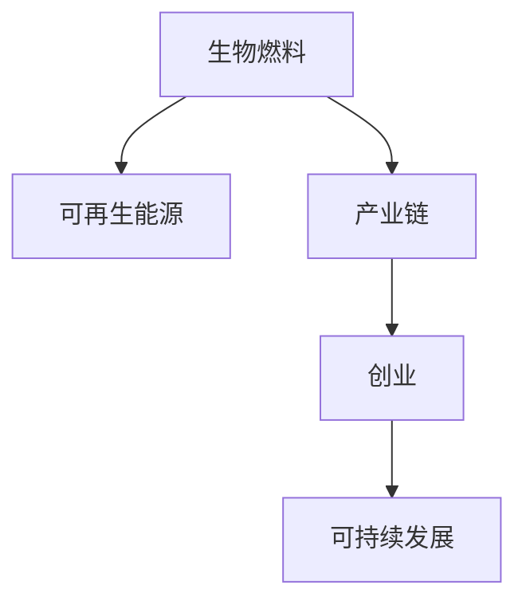

                 

# 生物燃料创业：可再生能源的未来方向

## 1. 背景介绍

### 1.1 问题由来
随着全球能源需求的不断增长和化石燃料的逐渐枯竭，可再生能源的开发利用成为了各国政府和企业关注的重点。生物燃料作为一种重要的可再生能源形式，以其环保、可持续等优点，受到越来越多的重视。然而，生物燃料产业的发展面临着诸多挑战，如生产成本高、技术复杂、市场接受度低等。因此，本文旨在探讨生物燃料创业的可行性，分析其发展方向和潜力，为创业者提供有益的指导。

### 1.2 问题核心关键点
本文的核心关键点包括：
- 生物燃料创业的可行性分析
- 生物燃料产业链解析
- 生物燃料生产技术的现状与发展
- 生物燃料市场的未来趋势
- 生物燃料创业的挑战与应对策略

## 2. 核心概念与联系

### 2.1 核心概念概述

为了更好地理解生物燃料创业的可行性及其发展方向，需要明确几个关键概念：

- 生物燃料(Biofuels)：利用生物质（如农作物、植物残渣、动物粪便等）通过化学或生物方法转化而成的燃料，主要包括生物乙醇、生物柴油、生物天然气等。
- 可再生能源(Renewable Energy)：指能够自我更新的能源，如太阳能、风能、水能、地热能等，与化石燃料相比，可再生能源更加环保和可持续。
- 产业链(Integrated Chain)：指从原料采集、预处理、发酵/提取、燃料生产、市场销售等各环节组成的企业链条，是生物燃料产业发展的重要组成部分。
- 创业(Entrepreneurship)：指创业者通过创新和风险投资，利用市场需求和创新技术，开发新产品、新服务或新业务，实现商业价值的过程。
- 可持续发展(Sustainable Development)：指满足当代需求的同时，不损害后代满足其需求的能力，实现经济、社会和环境的协调发展。

这些概念之间的逻辑关系可以通过以下Mermaid流程图来展示：



这个流程图展示了生物燃料、可再生能源、产业链、创业与可持续发展之间的相互关系：

1. 生物燃料是一种可再生能源，依赖于生物质的转化和利用。
2. 产业链是生物燃料从原料到成品的转化过程中各环节的有机连接。
3. 创业是生物燃料产业链创新和发展的关键驱动力。
4. 可持续发展是生物燃料创业的重要目标和方向。

## 3. 核心算法原理 & 具体操作步骤

### 3.1 算法原理概述

生物燃料创业的可行性分析主要基于以下几个方面：市场需求、技术成熟度、成本控制和政策支持。其中，市场需求是生物燃料创业成功的关键驱动力，技术成熟度是实现产业化的重要保障，成本控制是商业可持续性的核心因素，政策支持则是产业健康发展的重要保障。

生物燃料创业的成功取决于是否能够整合这些要素，实现从原料到燃料的高效转化。因此，创业企业需要深入分析市场需求、评估技术可行性、优化成本结构、充分利用政策红利，才能实现商业价值和社会效益的双赢。

### 3.2 算法步骤详解

#### 3.2.1 市场需求分析
市场需求分析是生物燃料创业的首要步骤，需要从以下几个方面进行评估：
- **市场规模**：评估全球及各地区生物燃料的市场需求量，包括市场渗透率、增长潜力等。
- **消费者需求**：分析消费者对生物燃料的接受度和使用习惯，如环保意识、支付意愿等。
- **竞争对手分析**：评估现有生物燃料生产商的产能、技术水平、市场份额等。

#### 3.2.2 技术成熟度评估
技术成熟度评估主要包括以下几个方面：
- **原料预处理**：评估原料采集、预处理（如粉碎、除杂等）的工艺流程和成本效益。
- **转化技术**：评估生物乙醇、生物柴油等转化技术的成熟度，包括发酵效率、提取率、反应时间等。
- **燃料质量**：评估生物燃料的质量指标，如纯度、能量密度等，是否达到市场标准。

#### 3.2.3 成本结构优化
成本结构优化是生物燃料创业的核心问题，需要从以下几个方面进行优化：
- **原料成本**：评估不同生物质原料的采集成本、运输成本、储存成本等。
- **生产成本**：评估发酵/提取、燃料生产等环节的成本构成，包括设备投资、能源消耗、人工成本等。
- **销售成本**：评估燃料运输、销售网络建设等环节的成本，包括物流成本、营销费用等。

#### 3.2.4 政策支持利用
政策支持是生物燃料创业的重要保障，需要从以下几个方面进行利用：
- **补贴政策**：评估各国政府对生物燃料生产的补贴政策，包括直接补贴、税收减免、贷款优惠等。
- **环保政策**：评估政府对环保的重视程度，包括碳排放限制、环保法规等。
- **科技创新支持**：评估政府对生物燃料技术的科研投入和技术转化支持力度。

### 3.3 算法优缺点

生物燃料创业的算法优点主要包括：
- **环保优势**：生物燃料可以有效减少温室气体排放，缓解气候变化。
- **能源多样化**：生物燃料可以替代部分化石燃料，实现能源的多样化和可持续发展。
- **技术创新空间**：生物燃料产业链涉及多个技术环节，创业企业可以针对性地进行技术创新。

同时，生物燃料创业的算法缺点也显而易见：
- **生产成本高**：生物燃料的生产成本相对较高，需要大量的资金和技术投入。
- **技术复杂性**：生物燃料产业链技术复杂，涉及到发酵、提取、转化等多个环节，技术难度较大。
- **市场需求不确定**：生物燃料市场受多方面因素影响，市场需求存在不确定性。

### 3.4 算法应用领域

生物燃料创业主要应用于以下几个领域：

- **农业副产品利用**：利用农业废弃物如麦秸、甘蔗渣、稻壳等作为原料，生产生物乙醇、生物柴油等。
- **能源替代**：替代部分石油燃料，降低对化石能源的依赖，实现能源结构的优化。
- **交通燃料**：将生物燃料应用于交通运输领域，降低运输行业的碳排放。
- **化工原料**：利用生物乙醇等生物燃料的副产品，如乙醇酸、乙酸等，制备化工原料。
- **热能利用**：利用生物燃料发电，生产生物天然气，提供清洁能源。

## 4. 数学模型和公式 & 详细讲解 & 举例说明

### 4.1 数学模型构建

生物燃料创业的数学模型主要基于市场需求、技术成熟度和成本控制等要素构建。其中，市场需求、技术成熟度、成本控制和政策支持可以分别用不同的变量表示，构建数学模型如下：

$$
\text{市场需求} = \text{市场规模} + \text{消费者需求} + \text{竞争对手分析}
$$

$$
\text{技术成熟度} = \text{原料预处理} + \text{转化技术} + \text{燃料质量}
$$

$$
\text{成本结构} = \text{原料成本} + \text{生产成本} + \text{销售成本}
$$

$$
\text{政策支持} = \text{补贴政策} + \text{环保政策} + \text{科技创新支持}
$$

### 4.2 公式推导过程

以市场需求和成本控制为例，推导公式如下：

假设市场需求为 $D$，市场规模为 $S$，消费者需求为 $C$，竞争对手分析为 $A$。市场需求 $D$ 可以表示为：

$$
D = S + C + A
$$

其中，$S$ 表示市场规模，$C$ 表示消费者需求，$A$ 表示竞争对手分析。

假设成本结构为 $C$，原料成本为 $M$，生产成本为 $P$，销售成本为 $S$。成本结构 $C$ 可以表示为：

$$
C = M + P + S
$$

其中，$M$ 表示原料成本，$P$ 表示生产成本，$S$ 表示销售成本。

### 4.3 案例分析与讲解

以美国乙醇产业为例，分析市场需求和成本控制的影响。

**市场需求分析**：
- 美国乙醇市场需求量从2000年的约2亿加仑增长至2020年的约28亿加仑。
- 消费者对环保意识的增强，愿意选择可再生燃料的比例逐年上升。
- 竞争对手分析显示，美国的生物乙醇产量逐年增加，但市场渗透率仍较低。

**成本控制分析**：
- 原料成本占总成本的比例为40%，主要来自玉米等作物。
- 生产成本占总成本的比例为30%，主要来自发酵和提取等技术。
- 销售成本占总成本的比例为30%，主要来自运输和销售网络建设。

通过对美国乙醇产业的市场需求和成本结构进行分析，可以得出以下结论：

- 市场需求逐年增长，但市场渗透率仍较低。
- 原料成本和生产成本占总成本比例较高，需要进一步优化。
- 销售成本占总成本比例较高，需要优化销售网络，降低运输成本。

## 5. 项目实践：代码实例和详细解释说明

### 5.1 开发环境搭建

生物燃料创业的开发环境搭建需要以下工具和库：
- Python：作为主要编程语言。
- NumPy和Pandas：用于数据分析和处理。
- Matplotlib和Seaborn：用于数据可视化。
- Scikit-learn：用于机器学习和统计分析。

以下是一个简单的生物燃料市场需求分析代码示例：

```python
import pandas as pd
import matplotlib.pyplot as plt

# 读取市场需求数据
market_data = pd.read_csv('market_data.csv')

# 计算市场需求规模
market_size = market_data['scale'].sum()

# 计算消费者需求
consumer_demand = market_data['demand'].sum()

# 计算竞争对手分析
competitor_analysis = market_data['analysis'].sum()

# 绘制市场需求图
plt.figure(figsize=(8, 6))
plt.plot(market_size, color='b', label='Market Size')
plt.plot(consumer_demand, color='r', label='Consumer Demand')
plt.plot(competitor_analysis, color='g', label='Competitor Analysis')
plt.xlabel('Year')
plt.ylabel('Demand (亿加仑)')
plt.title('Market Demand Analysis')
plt.legend()
plt.show()
```

### 5.2 源代码详细实现

以下是一个生物燃料成本控制的代码示例：

```python
import pandas as pd
import matplotlib.pyplot as plt

# 读取成本数据
cost_data = pd.read_csv('cost_data.csv')

# 计算原料成本
material_cost = cost_data['material_cost'].sum()

# 计算生产成本
production_cost = cost_data['production_cost'].sum()

# 计算销售成本
sale_cost = cost_data['sale_cost'].sum()

# 绘制成本结构图
plt.figure(figsize=(8, 6))
plt.bar(['Material Cost', 'Production Cost', 'Sale Cost'], [material_cost, production_cost, sale_cost])
plt.xlabel('Cost Category')
plt.ylabel('Cost (百万美元)')
plt.title('Cost Structure Analysis')
plt.show()
```

### 5.3 代码解读与分析

生物燃料创业的代码实现主要基于数据分析和可视化。以市场需求分析为例，代码首先读取市场需求数据，然后计算市场需求规模、消费者需求和竞争对手分析，最后绘制市场需求图。通过可视化工具，可以直观地展示市场需求的变化趋势，便于创业企业进行决策分析。

类似地，成本控制代码读取成本数据，计算原料成本、生产成本和销售成本，并绘制成本结构图。通过分析成本结构，可以优化原料采购、生产工艺和销售策略，降低总成本，提高经济效益。

### 5.4 运行结果展示

通过以上代码，可以生成市场需求图和成本结构图，展示市场需求和成本控制的基本情况。

市场需求图展示了美国乙醇市场需求量的变化趋势，消费者需求逐年增长，但市场渗透率仍较低。这表明生物乙醇市场仍有很大的增长空间，创业企业需要加大市场推广力度，提高消费者接受度。

成本结构图展示了生物乙醇的原料成本、生产成本和销售成本占比情况，原料成本和生产成本占总成本比例较高。这表明创业企业需要重点关注原料采购和生产工艺的优化，降低生产成本。

## 6. 实际应用场景

### 6.1 生物燃料在交通运输中的应用

生物燃料在交通运输领域的应用前景广阔，主要体现在以下几个方面：

- **替代石油燃料**：生物燃料如生物乙醇、生物柴油等可以替代部分石油燃料，降低对化石能源的依赖，减少碳排放。
- **提高燃料效率**：生物燃料的燃烧效率较高，可以在一定程度上提高交通运输的能源效率。
- **减少环境污染**：生物燃料燃烧产生的污染物较少，对环境污染较小。

### 6.2 生物燃料在农业中的利用

生物燃料在农业中的应用主要体现在以下几个方面：

- **利用农业副产品**：利用农业废弃物如麦秸、甘蔗渣、稻壳等作为原料，生产生物乙醇、生物柴油等，实现农业副产品的最大化利用。
- **推动农业结构调整**：生物燃料产业的发展可以带动农业结构的调整，促进农业可持续发展。
- **提高农民收入**：生物燃料产业的发展可以带动农民增收，改善农村经济状况。

### 6.3 生物燃料在能源产业中的应用

生物燃料在能源产业中的应用主要体现在以下几个方面：

- **发电**：利用生物燃料发电，生产生物天然气，提供清洁能源。
- **热能利用**：利用生物燃料进行热能利用，供暖、工业生产等。
- **化工原料**：利用生物乙醇等生物燃料的副产品，如乙醇酸、乙酸等，制备化工原料。

## 7. 工具和资源推荐

### 7.1 学习资源推荐

为了帮助创业者系统掌握生物燃料创业的理论基础和实践技巧，以下是一些推荐的学习资源：

1. **《生物燃料：技术、市场与挑战》**：由生物燃料领域的专家撰写，系统介绍了生物燃料的技术原理、市场发展及面临的挑战。
2. **国际可再生能源署(IRENA)**：提供丰富的可再生能源相关资料和报告，是了解生物燃料创业的权威机构之一。
3. **《生物燃料市场分析报告》**：由市场研究机构发布，提供生物燃料市场规模、增长趋势和竞争格局等数据。
4. **Coursera生物燃料课程**：由知名大学开设，提供生物燃料创业的理论与实践知识，适合初学者和进阶学习者。

### 7.2 开发工具推荐

以下是一些常用的生物燃料创业开发工具：

1. **Python**：作为生物燃料创业开发的主要编程语言，具有强大的数据分析和处理能力。
2. **Jupyter Notebook**：用于编写和运行Python代码，支持代码块、注释和可视化。
3. **RapidMiner**：用于数据预处理、特征工程和模型训练，提供可视化界面和丰富的算法库。
4. **Tableau**：用于数据可视化，支持交互式图表和仪表盘。

### 7.3 相关论文推荐

以下是一些生物燃料创业领域的经典论文：

1. **《生物乙醇生产与市场分析》**：分析了生物乙醇的生产工艺、市场需求和市场挑战，提供生物乙醇创业的思路和方法。
2. **《生物柴油生产技术综述》**：介绍了生物柴油的生产技术、经济性和环境影响，为生物柴油创业提供参考。
3. **《生物天然气技术进展》**：探讨了生物天然气的生产技术、市场前景和应用案例，适合生物天然气创业者阅读。

## 8. 总结：未来发展趋势与挑战

### 8.1 研究成果总结

本文从市场需求、技术成熟度、成本控制和政策支持四个方面，系统分析了生物燃料创业的可行性，并结合实际案例进行讲解。通过数据分析和可视化，展示了生物燃料的市场需求和成本控制情况，为创业者提供了有益的指导。

### 8.2 未来发展趋势

未来生物燃料创业的发展趋势主要体现在以下几个方面：

- **技术创新**：生物燃料产业链涉及多个技术环节，创业企业需要不断进行技术创新，提高生产效率和产品质量。
- **市场拓展**：生物燃料市场的需求潜力巨大，创业企业需要积极拓展市场，提高市场渗透率。
- **政策支持**：各国政府对可再生能源的支持力度逐渐加大，创业企业应充分利用政策红利，加速产业发展。
- **可持续发展**：生物燃料创业需要注重环保和可持续发展，实现经济效益和社会效益的双赢。

### 8.3 面临的挑战

生物燃料创业面临的主要挑战包括：

- **技术复杂性**：生物燃料产业链涉及多个技术环节，技术复杂性较高。
- **市场接受度**：生物燃料市场受多方面因素影响，市场需求存在不确定性。
- **政策不确定性**：各国政府的政策支持力度和方向具有不确定性，需要密切关注政策变化。
- **成本控制**：生物燃料的生产成本较高，创业企业需要优化成本结构，降低生产成本。

### 8.4 研究展望

未来生物燃料创业的研究方向主要包括以下几个方面：

- **技术优化**：进一步优化生物燃料的生产工艺，提高生产效率和产品质量。
- **市场推广**：加强市场推广力度，提高消费者对生物燃料的接受度和使用量。
- **政策研究**：深入研究各国政府的政策支持力度和方向，制定适应性策略。
- **可持续发展**：探索生物燃料的环保和可持续发展路径，实现经济效益和社会效益的双赢。

## 9. 附录：常见问题与解答

**Q1: 生物燃料创业的主要技术难点是什么？**

A: 生物燃料创业的主要技术难点包括：
1. 原料预处理：需要高效、低成本的原料采集和预处理技术。
2. 转化技术：需要高效的生物乙醇、生物柴油等转化技术，提高转化效率和产品质量。
3. 燃料质量：需要确保生物燃料的质量符合市场标准，如纯度、能量密度等。

**Q2: 生物燃料创业需要多少初始投资？**

A: 生物燃料创业的初始投资主要包括以下几个方面：
1. 设备投资：购买发酵设备、提取设备、燃料生产设备等。
2. 技术研发：进行技术研发和专利申请，投入人力和财力。
3. 市场推广：建立销售网络和品牌推广，投入营销费用。
4. 土地和设施：购买土地和建设厂房，投资基础设施。

**Q3: 生物燃料创业的盈利模式有哪些？**

A: 生物燃料创业的盈利模式主要包括以下几个方面：
1. 燃料销售：通过销售生物乙醇、生物柴油等燃料获取收入。
2. 化工原料销售：利用生物乙醇等副产品生产化工原料，销售获得收入。
3. 热能利用：利用生物燃料发电，销售电力获得收入。
4. 政府补贴：获取政府对可再生能源生产的补贴和税收优惠。

**Q4: 生物燃料创业的风险有哪些？**

A: 生物燃料创业的风险主要包括：
1. 技术风险：技术研发和生产工艺可能存在不稳定性，影响生产效率和产品质量。
2. 市场风险：市场需求和市场接受度存在不确定性，可能导致产品滞销。
3. 政策风险：政策支持力度和方向具有不确定性，可能导致政策变化影响企业经营。
4. 成本风险：生产成本和运营成本可能超出预期，影响企业盈利能力。

---

作者：禅与计算机程序设计艺术 / Zen and the Art of Computer Programming

