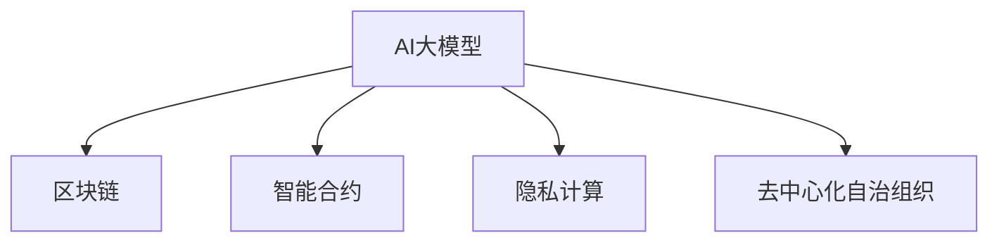

                 

# 电商平台中的AI大模型与区块链技术结合

> 关键词：AI大模型,区块链,电商平台,智能合约,隐私保护,电商平台治理,金融科技

## 1. 背景介绍

### 1.1 问题由来
随着电子商务的迅速发展，电商平台已成为现代社会不可或缺的商业形态。传统的电商平台依赖于中心化的管理模式，易受数据泄漏、用户信任度不足、假冒商品等问题困扰。近年来，AI大模型与区块链技术的结合，为电商平台的治理和管理提供了新的思路。利用AI大模型的强大分析能力和区块链的去中心化特性，电商平台可以提升交易效率、增强用户信任、保障数据安全，逐步实现数字化、智能化转型。

### 1.2 问题核心关键点
当前电商平台面临的主要问题是：
- **数据泄漏**：电商平台存储了大量用户交易数据，易遭黑客攻击。
- **用户信任不足**：平台信任度难以验证，易产生纠纷。
- **假冒商品**：商品来源难以追溯，易产生假冒商品问题。
- **交易效率低**：传统电商平台依赖中心化信任机制，导致交易效率低下。

这些问题亟需有效技术手段解决，而AI大模型和区块链技术的结合，为电商平台提供了新的解决方案。

### 1.3 问题研究意义
利用AI大模型和区块链技术结合，电商平台可以实现：
- **交易透明性**：区块链可记录每一笔交易的详细记录，增加交易透明性。
- **数据隐私保护**：AI大模型可以在不泄露用户隐私的前提下，利用数据进行智能推荐。
- **商品溯源**：区块链记录商品生产、运输、销售全过程，实现商品溯源。
- **增强用户信任**：利用AI大模型进行用户行为分析，提升平台信誉度。
- **提升交易效率**：区块链的去中心化特性，提高了交易的实时性、安全性。

本文聚焦于电商平台中的AI大模型和区块链技术结合，旨在通过理论和技术实践，系统阐述二者如何共同助力电商平台的智能化转型。

## 2. 核心概念与联系

### 2.1 核心概念概述

为更好地理解AI大模型和区块链技术在电商平台中的应用，本节将介绍几个密切相关的核心概念：

- **AI大模型(AI Large Models)**：如GPT-3、BERT等，基于大规模无标签数据预训练，具备强大的语言处理和图像识别能力，可用于电商平台的推荐、搜索、客服等场景。

- **区块链(Blockchain)**：一种分布式账本技术，通过去中心化共识机制，确保数据不可篡改、可追溯。

- **智能合约(Smart Contracts)**：一种自动执行的合约，通过区块链记录和执行，无需第三方干预。

- **隐私计算(Privacy-Computing)**：通过加密技术、差分隐私等手段，保护数据隐私，实现安全的数据共享。

- **去中心化自治组织(Decentralized Autonomous Organization, DAO)**：一种无中心管理者的组织形式，通过区块链协议运行，实现自主决策和执行。

这些核心概念之间的逻辑关系可以通过以下Mermaid流程图来展示：



这个流程图展示了大模型、区块链技术以及相关概念之间的连接关系：

1. 大模型通过预训练获得通用知识，再通过区块链技术记录和验证其分析结果。
2. 智能合约利用区块链进行自动执行，确保交易的透明性和安全性。
3. 隐私计算在大模型处理数据时提供隐私保护，确保数据安全。
4. DAO通过区块链实现无中心化管理，提升平台自治性。

这些概念共同构成了电商平台中的AI大模型和区块链技术的融合框架，为电商平台提供强大的数据处理、交易管理和信任保障能力。

## 3. 核心算法原理 & 具体操作步骤
### 3.1 算法原理概述

基于AI大模型和区块链技术的电商平台，其核心算法原理包括以下几个方面：

1. **AI大模型预训练与微调**：利用大规模无标签数据对大模型进行预训练，然后在电商平台数据上微调，使其具备电商场景下的特定能力。
2. **区块链数据记录与验证**：利用区块链技术记录电商平台的交易、行为数据，确保数据的不可篡改性和可追溯性。
3. **智能合约逻辑设计**：设计智能合约逻辑，自动化执行电商平台的各类规则，如支付、交易、评价等。
4. **隐私计算数据处理**：在大模型处理数据时，应用差分隐私、联邦学习等隐私计算技术，保护用户隐私。
5. **去中心化自治组织决策**：通过DAO实现平台规则的自主决策和执行，提升平台自治性。

### 3.2 算法步骤详解

基于AI大模型和区块链技术的电商平台实现步骤如下：

**Step 1: AI大模型预训练与微调**

1. 收集电商平台业务相关的大规模无标签数据。
2. 利用这些数据对AI大模型进行预训练，如BERT、GPT-3等。
3. 在电商平台特定场景下，对预训练模型进行微调，以获得电商平台的推荐、搜索等能力。

**Step 2: 区块链数据记录与验证**

1. 将电商平台的交易、评价、行为等数据上传至区块链，记录成不可篡改的账本。
2. 利用区块链的去中心化特性，实现数据的透明性、安全性。

**Step 3: 智能合约逻辑设计**

1. 根据电商平台需求，设计智能合约逻辑。
2. 将合约代码部署至区块链，实现自动化的交易、支付、评价等功能。

**Step 4: 隐私计算数据处理**

1. 利用差分隐私、联邦学习等隐私计算技术，保护用户隐私。
2. 在AI大模型处理电商数据时，确保数据隐私安全。

**Step 5: 去中心化自治组织决策**

1. 通过DAO构建电商平台的治理框架，实现自主决策。
2. 利用区块链协议，执行DAO决策，提升平台自治性。

### 3.3 算法优缺点

基于AI大模型和区块链技术的电商平台，具有以下优点：

1. **提升交易效率**：区块链的去中心化特性，提高了交易的实时性、安全性。
2. **增强用户信任**：区块链记录交易历史，确保交易的透明性，增强用户信任。
3. **保障数据安全**：AI大模型和隐私计算技术保护用户隐私，确保数据安全。
4. **灵活决策**：DAO实现了平台的自主决策，提升治理灵活性。

但同时，该方法也存在一些局限：

1. **技术复杂性**：AI大模型和区块链技术的结合，增加了系统实现的复杂性。
2. **性能瓶颈**：AI大模型和区块链的并发处理能力有限，易出现性能瓶颈。
3. **共识算法复杂**：不同的共识算法有不同的适用场景，需根据具体情况选择。
4. **隐私保护挑战**：隐私计算技术需平衡数据隐私和模型性能。

尽管存在这些局限，但AI大模型和区块链技术的结合，无疑为电商平台的智能化转型提供了新的方向。

### 3.4 算法应用领域

基于AI大模型和区块链技术的电商平台，已经在以下几个领域得到了广泛应用：

- **推荐系统**：利用AI大模型处理用户行为数据，生成个性化推荐。
- **支付与结算**：利用智能合约自动执行支付规则，确保交易安全性。
- **商品溯源**：利用区块链记录商品全生命周期信息，实现商品溯源。
- **用户信任体系**：利用区块链记录用户评价，增强用户信任。
- **风险管理**：利用AI大模型预测交易风险，智能合约自动执行风险管理措施。
- **智能客服**：利用AI大模型进行智能客服，提升用户服务体验。

## 4. 数学模型和公式 & 详细讲解 & 举例说明

### 4.1 数学模型构建

本节将使用数学语言对基于AI大模型和区块链技术的电商平台实现进行更加严格的刻画。

记电商平台上的交易数据为 $D=\{(x_i, y_i)\}_{i=1}^N$，其中 $x_i$ 为交易信息，$y_i$ 为交易结果。假设利用AI大模型 $M_{\theta}$ 对交易数据进行分类，则损失函数为：

$$
\mathcal{L}(\theta) = -\frac{1}{N}\sum_{i=1}^N \log P(y_i | x_i; \theta)
$$

其中 $P(y_i | x_i; \theta)$ 为模型对交易结果 $y_i$ 的预测概率。

利用区块链技术，记录交易数据，确保数据的不可篡改性和可追溯性。

### 4.2 公式推导过程

以智能合约为例，推导其自动执行的交易逻辑。设交易合同为 $C$，智能合约为 $M_C$，则交易执行的逻辑为：

$$
M_C(x, D) = 
\begin{cases}
执行交易 & \text{如果交易符合合同条款} \\
拒绝交易 & \text{如果交易不符合合同条款}
\end{cases}
$$

其中 $x$ 为交易请求，$D$ 为区块链上的交易数据。

在智能合约中，利用AI大模型对交易数据进行分类，判断是否符合合同条款。

### 4.3 案例分析与讲解

假设一个电商平台利用智能合约自动执行退款规则，具体步骤如下：

1. 电商平台在智能合约中定义退款规则，如订单金额小于100元自动退款。
2. 用户提交退款申请，智能合约自动调用AI大模型对订单数据进行分类，判断是否符合退款条件。
3. 如符合退款条件，智能合约自动执行退款操作，更新区块链上的交易记录。

通过智能合约和AI大模型的结合，电商平台可以自动化执行复杂的退款规则，确保交易的透明度和公平性。

## 5. 项目实践：代码实例和详细解释说明

### 5.1 开发环境搭建

在进行电商平台AI大模型和区块链技术的结合实现前，我们需要准备好开发环境。以下是使用Python进行区块链开发的环境配置流程：

1. 安装Anaconda：从官网下载并安装Anaconda，用于创建独立的Python环境。

2. 创建并激活虚拟环境：
```bash
conda create -n blockchain-env python=3.8 
conda activate blockchain-env
```

3. 安装Python区块链库：
```bash
pip install pyblockchain
```

4. 安装AI大模型库：
```bash
pip install transformers
```

5. 安装智能合约相关库：
```bash
pip install web3 pyethereum
```

完成上述步骤后，即可在`blockchain-env`环境中开始区块链和AI大模型的结合实践。

### 5.2 源代码详细实现

这里我们以一个简单的智能合约为例，展示如何利用AI大模型进行交易分类，并在区块链上自动执行。

```python
from pyblockchain import BlockChain
from transformers import BertTokenizer, BertForSequenceClassification
from pyethereum import Web3

# 创建区块链实例
chain = BlockChain()

# 初始化智能合约实例
contract = chain.createContract()

# 初始化AI大模型实例
tokenizer = BertTokenizer.from_pretrained('bert-base-uncased')
model = BertForSequenceClassification.from_pretrained('bert-base-uncased', num_labels=2)

# 定义智能合约函数
@contract.function
def processTransaction(tx_hash):
    # 加载并处理交易数据
    tx = Web3.toHex(tx_hash)
    transaction_data = chain.transactionByHash(tx)
    
    # 处理数据并使用大模型进行分类
    tokenized_input = tokenizer(transaction_data['data'], return_tensors='pt')
    input_ids = tokenized_input['input_ids']
    attention_mask = tokenized_input['attention_mask']
    with torch.no_grad():
        outputs = model(input_ids, attention_mask=attention_mask)
        logits = outputs.logits
        probability = torch.softmax(logits, dim=1).tolist()[0]
        
        # 判断是否符合智能合约规则
        if probability[1] > probability[0]:
            contract.setContractState(True)
        else:
            contract.setContractState(False)
```

以上代码实现了通过AI大模型对交易数据进行分类，并在智能合约中根据分类结果自动执行的操作。在实际应用中，根据具体需求，可以进一步扩展智能合约的逻辑，实现更复杂的功能。

### 5.3 代码解读与分析

让我们再详细解读一下关键代码的实现细节：

**智能合约函数**：
- 使用`@contract.function`装饰器定义智能合约函数。
- `processTransaction`函数接收交易哈希，获取交易数据，并将其处理成大模型所需的格式。
- 利用`tokenizer`对交易数据进行分词和编码，得到模型所需的输入。
- 通过`model`对输入数据进行分类，得到分类概率。
- 根据概率判断是否符合智能合约规则，并更新合约状态。

**区块链操作**：
- 使用`chain`实例，创建并操作区块链。
- 使用`contract`实例，定义和操作智能合约。
- 在`processTransaction`函数中，使用智能合约的`setContractState`函数，根据大模型的分类结果，自动更新合约状态。

通过上述代码，可以看到AI大模型和区块链技术的结合，实现了对交易数据的分类和智能合约的自动执行。开发者可以根据具体需求，灵活设计合约逻辑，利用大模型提升合约的智能化水平。

## 6. 实际应用场景

### 6.1 智能推荐系统

在电商平台中，智能推荐系统是用户购物体验的重要组成部分。利用AI大模型对用户行为数据进行分析和建模，可以生成个性化的推荐内容，提升用户转化率。同时，将推荐结果记录到区块链上，确保推荐数据的安全性和透明性。

### 6.2 金融科技应用

金融科技是未来电商平台的必然趋势。利用AI大模型进行风险评估和欺诈检测，确保交易安全。通过智能合约实现自动化支付和结算，提升交易效率。将交易记录上传至区块链，确保数据的不可篡改性和可追溯性。

### 6.3 供应链管理

电商平台中的商品供应链管理涉及众多环节，如采购、仓储、配送等。利用AI大模型进行供应链数据分析和优化，提升物流效率。通过区块链记录供应链各环节数据，确保数据透明性和可追溯性。

### 6.4 未来应用展望

伴随AI大模型和区块链技术的不断演进，基于二者的电商平台将呈现以下几个发展趋势：

1. **智能治理**：利用智能合约和DAO，实现平台治理的自动化和去中心化。
2. **隐私计算与AI融合**：结合差分隐私、联邦学习等隐私计算技术，保护用户隐私。
3. **自动化决策**：利用AI大模型进行智能决策，提升平台自主性。
4. **跨链融合**：实现不同区块链之间的数据互操作性，构建统一的平台生态。
5. **边缘计算与AI结合**：将AI模型部署在边缘计算节点，提升数据处理效率。
6. **数据可信度提升**：利用区块链技术，提升数据的可信度和权威性。

以上趋势凸显了AI大模型和区块链技术在电商平台中的巨大潜力。这些方向的探索发展，必将进一步推动电商平台的智能化转型，为用户的购物体验和商家的运营效率带来深远影响。

## 7. 工具和资源推荐

### 7.1 学习资源推荐

为了帮助开发者系统掌握AI大模型和区块链技术的电商平台实现，这里推荐一些优质的学习资源：

1. 《区块链基础》系列博文：从零开始介绍区块链技术的基本原理和实现方法。

2. 《深度学习自然语言处理》课程：斯坦福大学开设的NLP明星课程，涵盖深度学习在NLP中的广泛应用。

3. 《智能合约实战指南》书籍：详细介绍智能合约的基本概念和实战开发方法。

4. HuggingFace官方文档：Transformers库的官方文档，提供了海量预训练模型和完整的微调样例代码。

5. Web3.js官方文档：Web3库的官方文档，详细介绍如何利用Python与区块链进行交互。

通过对这些资源的学习实践，相信你一定能够快速掌握AI大模型和区块链技术在电商平台中的应用，并用于解决实际的电商问题。

### 7.2 开发工具推荐

高效的开发离不开优秀的工具支持。以下是几款用于AI大模型和区块链技术结合的电商平台开发常用的工具：

1. PyTorch：基于Python的开源深度学习框架，灵活动态的计算图，适合快速迭代研究。

2. TensorFlow：由Google主导开发的开源深度学习框架，生产部署方便，适合大规模工程应用。

3. Transformers库：HuggingFace开发的NLP工具库，集成了众多SOTA语言模型，支持PyTorch和TensorFlow，是进行模型微调和开发的基础。

4. Web3.js：用于与区块链进行交互的JavaScript库，方便开发者快速接入区块链功能。

5. Ethermine：提供算力的区块链服务平台，支持以太坊网络，方便开发者进行智能合约部署和测试。

6. MetaMask：一款区块链钱包应用，支持多币种交易，方便开发者进行测试和调试。

合理利用这些工具，可以显著提升AI大模型和区块链技术在电商平台中的开发效率，加快创新迭代的步伐。

### 7.3 相关论文推荐

AI大模型和区块链技术在电商平台中的应用，吸引了众多学者的关注。以下是几篇奠基性的相关论文，推荐阅读：

1. 《Blockchain in the Cloud: A Case Study of Blockchain Technology for E-commerce》：介绍区块链技术在电商平台中的应用，包括智能合约和数据存储。

2. 《Transformers in Natural Language Processing》：详细阐述了AI大模型在NLP中的应用，包括预训练、微调和任务适配。

3. 《Smart Contracts and Blockchain-based Applications》：介绍了智能合约的基本原理和应用场景，涵盖了电商平台的各类功能。

4. 《Privacy-Preserving Machine Learning》：探讨了AI大模型中的隐私计算技术，介绍了差分隐私、联邦学习等隐私保护方法。

5. 《Decentralized Autonomous Organizations》：介绍了DAO的基本概念和治理机制，讨论了其在电商平台中的应用。

这些论文代表了大模型和区块链技术在电商平台中的研究进展，通过学习这些前沿成果，可以帮助研究者把握学科前进方向，激发更多的创新灵感。

## 8. 总结：未来发展趋势与挑战

### 8.1 总结

本文对基于AI大模型和区块链技术的电商平台进行了全面系统的介绍。首先阐述了AI大模型和区块链技术的研究背景和意义，明确了二者在电商平台中的应用场景。其次，从原理到实践，详细讲解了二者的结合实现步骤，给出了电商平台的完整代码实例。同时，本文还广泛探讨了AI大模型和区块链技术在电商平台的广泛应用，展示了其在智能推荐、金融科技、供应链管理等领域的巨大潜力。此外，本文精选了AI大模型和区块链技术的各类学习资源，力求为读者提供全方位的技术指引。

通过本文的系统梳理，可以看到，AI大模型和区块链技术的结合，正在成为电商平台智能化转型的重要方向。得益于AI大模型的强大分析能力和区块链技术的去中心化特性，电商平台可以大幅提升交易效率、增强用户信任、保障数据安全，逐步实现数字化、智能化转型。未来，伴随AI大模型和区块链技术的不断演进，基于二者的电商平台必将迎来更加广阔的发展前景。

### 8.2 未来发展趋势

展望未来，AI大模型和区块链技术在电商平台中将呈现以下几个发展趋势：

1. **智能治理**：利用智能合约和DAO，实现平台治理的自动化和去中心化。
2. **隐私计算与AI融合**：结合差分隐私、联邦学习等隐私计算技术，保护用户隐私。
3. **自动化决策**：利用AI大模型进行智能决策，提升平台自主性。
4. **跨链融合**：实现不同区块链之间的数据互操作性，构建统一的平台生态。
5. **边缘计算与AI结合**：将AI模型部署在边缘计算节点，提升数据处理效率。
6. **数据可信度提升**：利用区块链技术，提升数据的可信度和权威性。

这些趋势凸显了AI大模型和区块链技术在电商平台中的巨大潜力。这些方向的探索发展，必将进一步推动电商平台的智能化转型，为用户的购物体验和商家的运营效率带来深远影响。

### 8.3 面临的挑战

尽管AI大模型和区块链技术的结合在电商平台中已经取得了显著成效，但在迈向更加智能化、普适化应用的过程中，它仍面临着诸多挑战：

1. **技术复杂性**：AI大模型和区块链技术的结合，增加了系统实现的复杂性。
2. **性能瓶颈**：AI大模型和区块链的并发处理能力有限，易出现性能瓶颈。
3. **共识算法复杂**：不同的共识算法有不同的适用场景，需根据具体情况选择。
4. **隐私保护挑战**：隐私计算技术需平衡数据隐私和模型性能。
5. **系统安全性**：智能合约和区块链系统易受攻击，需保证系统的安全性。
6. **数据互操作性**：不同区块链之间的数据互操作性仍需提升。

尽管存在这些挑战，但AI大模型和区块链技术的结合，无疑为电商平台的智能化转型提供了新的方向。通过学界和产业界的共同努力，这些挑战终将一一被克服，大模型和区块链技术必将在构建智能化的电商平台中发挥重要作用。

### 8.4 研究展望

面对AI大模型和区块链技术在电商平台中面临的挑战，未来的研究需要在以下几个方面寻求新的突破：

1. **智能合约优化**：研究更加高效的智能合约设计方法，提升合约执行的效率和安全性。
2. **隐私保护技术**：探索更强的隐私计算技术，确保数据隐私的同时，提升模型的预测准确性。
3. **跨链互操作**：研究跨链互操作技术，实现不同区块链之间的数据互通。
4. **边缘计算与AI结合**：研究边缘计算与AI模型的结合方式，提升数据处理效率。
5. **平台安全性**：研究区块链和智能合约的安全性问题，确保系统的安全性。
6. **用户界面设计**：研究更加友好的用户界面设计，提升用户体验。

这些研究方向将进一步推动AI大模型和区块链技术在电商平台中的应用，为构建更加智能、安全、可靠的电商平台提供有力支持。

## 9. 附录：常见问题与解答

**Q1：电商平台中的AI大模型和区块链技术是如何结合的？**

A: AI大模型和区块链技术的结合主要体现在以下几个方面：
1. 利用AI大模型对电商平台数据进行分析和建模，生成智能推荐、风险评估等结果。
2. 将AI大模型分析结果记录到区块链上，确保数据透明性和可追溯性。
3. 利用智能合约实现自动化交易和支付，提升交易效率。
4. 利用隐私计算技术保护用户隐私，确保数据安全。

**Q2：AI大模型和区块链技术在电商平台中主要解决了哪些问题？**

A: AI大模型和区块链技术在电商平台中主要解决了以下几个问题：
1. 数据泄漏：通过区块链技术记录交易数据，确保数据不可篡改和可追溯。
2. 用户信任不足：通过智能合约和区块链记录用户行为，增强用户信任。
3. 假冒商品：利用区块链记录商品全生命周期信息，实现商品溯源。
4. 交易效率低：通过智能合约自动执行交易和支付规则，提升交易效率。

**Q3：如何平衡AI大模型的性能和隐私保护？**

A: 在AI大模型处理电商平台数据时，应用差分隐私、联邦学习等隐私计算技术，保护用户隐私。具体方法包括：
1. 差分隐私：在模型训练和预测时加入噪声，确保个体隐私不被泄露。
2. 联邦学习：在分布式环境下，多个设备共同参与模型训练，不共享个体数据，保护用户隐私。
3. 联邦强化学习：结合差分隐私和联邦学习，提升模型性能和隐私保护。

**Q4：如何确保智能合约的安全性？**

A: 确保智能合约的安全性需要考虑以下几个方面：
1. 使用智能合约审计工具，如MythX、Audius等，对智能合约进行安全审计。
2. 在智能合约设计中，考虑防范常见攻击，如重放攻击、代码注入等。
3. 利用多重签名、延迟执行等机制，提高智能合约的安全性。

**Q5：如何进行跨链互操作？**

A: 进行跨链互操作主要需要考虑以下几个方面：
1. 设计跨链协议，确保不同区块链之间的数据互通。
2. 实现跨链资产转移，支持不同区块链之间的资产交换。
3. 优化跨链通信效率，确保跨链操作的实时性。

通过跨链互操作，可以实现不同区块链之间的数据共享和协同，进一步提升电商平台的智能化水平。

---

作者：禅与计算机程序设计艺术 / Zen and the Art of Computer Programming

