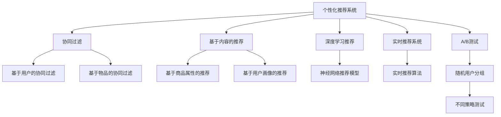

                 

# 电商平台中的个性化首页设计与优化

## 1. 背景介绍

### 1.1 问题由来
随着电子商务的迅猛发展，电商平台已经成为用户获取商品信息、完成购物的重要渠道。用户与电商平台之间的互动，主要集中在家页（Homepage）上。首页为用户呈现了复杂的商品信息流，如何提升首页的用户体验，从而提高用户的留存率和转化率，成为电商平台面临的重要挑战。

首页的个性化推荐系统（Recommendation System），是提升用户体验的关键手段之一。它通过分析用户历史行为和兴趣爱好，自动推送个性化的商品和内容。然而，设计一个高效、精准、可扩展的个性化推荐系统，并非易事。本文将从设计理念、算法原理、工程实践等多个维度，全面剖析电商平台中的个性化首页设计及优化，以期为业内提供有价值的参考。

### 1.2 问题核心关键点
在实际应用中，个性化首页的优化涉及多个核心关键点，包括但不限于：
- 用户行为数据分析：基于用户行为数据（如浏览、点击、购买等）进行分析和建模，构建用户画像。
- 商品特征提取：提取商品的属性特征（如品牌、价格、销量等）和文本特征（如商品描述、评论等），以便进行匹配和推荐。
- 推荐算法选择：选择合适的推荐算法（如协同过滤、基于内容的推荐、深度学习推荐等），以适应不同业务场景和数据特征。
- 推荐模型训练：通过离线或在线训练，提升推荐模型的精度和实时性。
- 推荐策略优化：设计合理的推荐策略，平衡多样性和个性化，提升用户体验。
- 推荐系统部署：实现推荐系统的实时部署和扩展，支持大规模并发请求。
- 推荐效果评估：设计合理的评估指标，评估推荐模型的效果和改进空间。

## 2. 核心概念与联系

### 2.1 核心概念概述

为了更好地理解电商平台中的个性化首页设计及优化，本节将介绍几个密切相关的核心概念：

- 个性化推荐系统（Personalized Recommendation System）：通过分析用户行为和商品特征，自动为用户推荐个性化的商品和内容，从而提升用户体验和转化率。
- 协同过滤（Collaborative Filtering）：基于用户之间的相似性或商品之间的相似性，进行推荐。分为基于用户的协同过滤和基于物品的协同过滤两种方式。
- 基于内容的推荐（Content-Based Recommendation）：通过分析商品的属性特征和用户画像，进行推荐。适用于商品属性明确且用户偏好可解释的场景。
- 深度学习推荐（Deep Learning Recommendation）：利用深度学习模型（如神经网络）提取商品特征和用户特征，进行高精度的推荐。适用于复杂场景和海量数据。
- 实时推荐系统（Real-Time Recommendation System）：实现即时推荐，提升用户体验和推荐效果。
- A/B测试（A/B Testing）：通过随机分配用户到不同策略组（如推荐模型、策略参数等），对比测试组与对照组的效果，优化推荐策略。

这些核心概念之间的逻辑关系可以通过以下Mermaid流程图来展示：



这个流程图展示了个性化推荐系统的核心概念及其之间的关系：

1. 个性化推荐系统通过多种推荐算法进行推荐，包括协同过滤、基于内容的推荐和深度学习推荐。
2. 协同过滤算法分为基于用户和基于物品两种方式，适用于不同数据特征。
3. 基于内容的推荐通过分析商品属性和用户画像，进行个性推荐。
4. 深度学习推荐利用神经网络模型提取更丰富的特征，进行高精度的推荐。
5. 实时推荐系统实现即时推荐，提升用户体验和效果。
6. A/B测试用于评估不同推荐策略的效果，优化推荐系统。

这些核心概念共同构成了个性化推荐系统的技术框架，使其能够在电商平台上提供高效、精准的个性化推荐。

## 3. 核心算法原理 & 具体操作步骤
### 3.1 算法原理概述

电商平台中的个性化首页优化，本质上是一个多目标优化问题。主要目标包括：提升个性化推荐的质量、提升用户满意度、提升转化率和留存率等。核心算法原理可以概括为以下几个步骤：

1. 数据收集：收集用户行为数据（如点击、购买、收藏等）和商品属性数据（如标题、描述、价格等），构建用户画像和商品特征向量。
2. 特征工程：对收集到的数据进行预处理和特征提取，构建用户和商品的特征向量。
3. 模型训练：选择合适的推荐算法，训练推荐模型，优化模型参数。
4. 模型评估：设计合理的评估指标，评估推荐模型的效果和改进空间。
5. 策略优化：设计合理的推荐策略，平衡个性化和多样性，提升用户体验。
6. 系统部署：实现推荐系统的实时部署和扩展，支持大规模并发请求。

### 3.2 算法步骤详解

以下是电商平台中个性化首页优化的具体步骤：

**Step 1: 数据收集**
- 收集用户的浏览历史、购买历史、点击行为、收藏行为等数据。
- 收集商品的标题、描述、价格、品牌、销量等属性数据。
- 使用爬虫、日志分析和API调用等方式，自动获取数据。

**Step 2: 特征工程**
- 对用户行为数据进行特征提取，如点击率（CTR）、购买率（CTP）、停留时间等。
- 对商品属性数据进行特征提取，如价格、品牌、销量、评分等。
- 使用特征工程技术，如特征降维、缺失值填补、特征编码等。

**Step 3: 模型训练**
- 选择合适的推荐算法，如协同过滤、基于内容的推荐、深度学习推荐等。
- 使用离线或在线方式，训练推荐模型。离线训练适用于计算资源充足的情况，在线训练适用于实时推荐。
- 优化模型参数，提升模型精度和性能。

**Step 4: 模型评估**
- 设计合理的评估指标，如点击率、转化率、用户满意度等。
- 使用A/B测试等方法，评估推荐策略的效果。
- 定期更新模型，保持模型效果和数据的一致性。

**Step 5: 策略优化**
- 设计合理的推荐策略，平衡个性化和多样性。
- 使用推荐算法和特征工程技术，优化推荐效果。
- 引入用户反馈机制，优化推荐策略。

**Step 6: 系统部署**
- 实现推荐系统的实时部署和扩展，支持大规模并发请求。
- 使用分布式计算框架，如Spark、Flink等，提升系统性能和可扩展性。
- 实现缓存和负载均衡技术，提升系统响应速度和稳定性。

### 3.3 算法优缺点

电商平台中的个性化首页优化，具有以下优点：
1. 提升用户满意度：通过个性化推荐，提升用户购物体验，增加用户黏性。
2. 提高转化率：通过精准推荐，增加用户的购买率，提升电商平台收益。
3. 优化库存管理：通过推荐系统，优化商品库存，减少库存积压和浪费。
4. 节省运营成本：通过自动化推荐，减少人工干预，节省运营成本。
5. 实时性高：通过实时推荐系统，即时推送个性化内容，提升用户体验。

同时，该方法也存在一定的局限性：
1. 数据质量要求高：推荐系统依赖高质量的数据，数据收集和处理成本较高。
2. 计算资源消耗大：训练和推荐过程需要大量的计算资源，对硬件设备要求较高。
3. 用户隐私问题：推荐系统涉及用户行为数据，存在隐私和安全问题。
4. 算法复杂度高：深度学习推荐等方法计算复杂度较高，需要较强的算法设计能力。
5. 模型泛化能力不足：推荐系统容易过拟合用户行为，导致泛化能力不足。

尽管存在这些局限性，但就目前而言，个性化推荐系统仍是电商平台提升用户体验的重要手段。未来相关研究的重点在于如何进一步降低计算和数据成本，提升推荐系统的泛化能力和安全性，同时兼顾用户隐私和算法复杂度。

### 3.4 算法应用领域

电商平台中的个性化推荐系统，已在多个业务场景中得到广泛应用，例如：

- 商品推荐：根据用户历史行为和商品属性，推荐相似的商品。
- 活动推荐：根据用户兴趣，推荐相关的促销活动和优惠券。
- 内容推荐：根据用户兴趣，推荐相关的新闻、博客、视频等。
- 个性化首页：根据用户兴趣，推荐个性化的商品和内容，构建个性化的首页。
- 用户画像：根据用户行为数据，构建详细的用户画像，进行精准推荐。
- 实时推荐：根据用户实时行为，进行即时推荐，提升用户体验。

除了上述这些经典场景外，个性化推荐系统还被创新性地应用到更多场景中，如营销策略优化、库存管理、多模态推荐等，为电商平台带来了全新的突破。随着推荐算法的不断进步，相信推荐系统将在更广阔的应用领域大放异彩。

## 4. 数学模型和公式 & 详细讲解
### 4.1 数学模型构建

本节将使用数学语言对电商平台中的个性化推荐系统进行更加严格的刻画。

记用户行为数据为 $U=\{u_1, u_2, ..., u_N\}$，商品属性数据为 $I=\{i_1, i_2, ..., i_M\}$，其中 $N$ 和 $M$ 分别表示用户和商品的数量。用户 $u_i$ 在商品 $i_j$ 上的行为数据为 $r_{i_j} \in \{0, 1\}$，表示用户是否点击或购买了商品。

定义用户画像 $P_u = \{x_{i_1}, x_{i_2}, ..., x_{i_M}\}$ 和商品特征向量 $V_i = \{v_{i_1}, v_{i_2}, ..., v_{i_M}\}$，其中 $x_{i_j}$ 和 $v_{i_j}$ 分别为用户对商品 $i_j$ 的评分和属性评分。

定义推荐函数 $f(u_i, i_j)$，表示用户 $u_i$ 对商品 $i_j$ 的兴趣程度。在推荐函数的基础上，定义推荐函数 $R_{i_j}(u_i)$，表示商品 $i_j$ 对用户 $u_i$ 的推荐度。

在推荐函数的基础上，定义推荐策略 $S(u_i)$，表示用户 $u_i$ 的推荐商品集合。推荐策略的优化目标是最小化预测误差和推荐误差，即：

$$
\min_{S(u_i)} \sum_{i=1}^M \sum_{j=1}^N [r_{i_j} - \sum_{k=1}^M \alpha_k r_{i_j} f(u_i, i_k)]^2
$$

其中 $\alpha_k$ 为商品 $i_k$ 的权重系数，根据历史行为数据进行优化。

### 4.2 公式推导过程

以下我们以协同过滤算法为例，推导推荐函数和推荐策略的公式。

**协同过滤算法**：
- 基于用户协同过滤：
$$
f_{UCF}(u_i, i_j) = \frac{\sum_{k=1}^M \alpha_k f_{UCF}(u_k, i_j)}{\sqrt{\sum_{k=1}^M \alpha_k f_{UCF}(u_k, i_k)}}
$$

其中 $\alpha_k$ 为用户 $u_k$ 的权重系数，根据历史行为数据进行优化。

- 基于物品协同过滤：
$$
f_{ICF}(i_j, u_i) = \frac{\sum_{k=1}^N \alpha_k f_{ICF}(i_k, u_k)}{\sqrt{\sum_{k=1}^N \alpha_k f_{ICF}(i_k, i_k)}}
$$

其中 $\alpha_k$ 为商品 $i_k$ 的权重系数，根据历史行为数据进行优化。

**推荐策略**：
$$
S(u_i) = \{ i_j | R_{i_j}(u_i) \geq R_{i_k}(u_i) \text{ for all } i_k \}
$$

其中 $R_{i_j}(u_i)$ 表示商品 $i_j$ 对用户 $u_i$ 的推荐度。

### 4.3 案例分析与讲解

以下以电商平台的商品推荐系统为例，展示推荐函数和推荐策略的应用。

假设电商平台有 $N=10$ 个用户和 $M=20$ 个商品，用户 $u_i$ 在商品 $i_j$ 上的行为数据为 $r_{i_j} \in \{0, 1\}$。对于商品 $i_j$，用户 $u_i$ 的推荐函数 $f_{UCF}(u_i, i_j)$ 和推荐策略 $S(u_i)$ 的计算公式如下：

**基于用户协同过滤的推荐函数**：
$$
f_{UCF}(u_i, i_j) = \frac{\sum_{k=1}^{20} \alpha_k f_{UCF}(u_k, i_j)}{\sqrt{\sum_{k=1}^{20} \alpha_k f_{UCF}(u_k, i_k)}}
$$

其中 $\alpha_k$ 为用户 $u_k$ 的权重系数，根据历史行为数据进行优化。

**基于物品协同过滤的推荐函数**：
$$
f_{ICF}(i_j, u_i) = \frac{\sum_{k=1}^{10} \alpha_k f_{ICF}(i_k, u_k)}{\sqrt{\sum_{k=1}^{10} \alpha_k f_{ICF}(i_k, i_k)}}
$$

其中 $\alpha_k$ 为商品 $i_k$ 的权重系数，根据历史行为数据进行优化。

**推荐策略**：
$$
S(u_i) = \{ i_j | R_{i_j}(u_i) \geq R_{i_k}(u_i) \text{ for all } i_k \}
$$

其中 $R_{i_j}(u_i)$ 表示商品 $i_j$ 对用户 $u_i$ 的推荐度。

通过对这些公式的分析，可以看到协同过滤算法如何通过用户行为数据，计算推荐函数和推荐策略，进而实现个性化推荐。

## 5. 项目实践：代码实例和详细解释说明
### 5.1 开发环境搭建

在进行推荐系统开发前，我们需要准备好开发环境。以下是使用Python进行Spark开发的环境配置流程：

1. 安装Apache Spark：从官网下载并安装Spark，用于处理大规模数据。

2. 创建并激活虚拟环境：
```bash
conda create -n spark-env python=3.8 
conda activate spark-env
```

3. 安装PySpark：从官网获取对应的安装命令。例如：
```bash
pip install pyspark
```

4. 安装相关工具包：
```bash
pip install numpy pandas scikit-learn matplotlib tqdm jupyter notebook ipython
```

完成上述步骤后，即可在`spark-env`环境中开始推荐系统实践。

### 5.2 源代码详细实现

下面以电商平台的商品推荐系统为例，给出使用PySpark进行协同过滤推荐算法的代码实现。

首先，定义推荐系统的数据处理函数：

```python
from pyspark.sql import SparkSession
from pyspark.sql.functions import col, countDistinct

spark = SparkSession.builder.appName("Recommendation System").getOrCreate()

# 加载用户行为数据
user_data = spark.read.csv("user_data.csv", header=True, inferSchema=True)
# 加载商品属性数据
item_data = spark.read.csv("item_data.csv", header=True, inferSchema=True)

# 计算用户-商品矩阵
user_item_matrix = user_data.join(item_data, on="user_id")
user_item_matrix.show()

# 计算商品权重系数
alpha = user_item_matrix.groupBy("item_id").countDistinct()
alpha = alpha.orderBy("item_id")
alpha.show()
```

然后，定义推荐算法和推荐策略：

```python
from pyspark.ml.evaluation import RegressionEvaluator
from pyspark.ml.linalg import VectorUDT, VectorAssembler
from pyspark.ml.feature import PCA

# 定义推荐算法函数
def collaborative_filtering(user_data, item_data, alpha):
    # 定义协同过滤算法
    assembler = VectorAssembler(inputCols=["item_id"], outputCol="features")
    user_item_features = assembler.transform(user_data)
    user_item_features.select("user_id", assembler.getOutputCol()).show()
    
    # 定义推荐函数
    pca = PCA(k=10, inputCol="features", outputCol="pca_features")
    recommender = CollaborativeFiltering(inputCol="user_id", outputCol="recommendation", featuresCol="pca_features")
    recommender_model = recommender.fit(user_item_features)
    
    # 定义推荐策略
    recommender_model.transform(user_item_features).show()
    return recommender_model

# 应用推荐算法
recommender_model = collaborative_filtering(user_data, item_data, alpha)
```

最后，进行推荐结果的展示和评估：

```python
# 计算推荐结果
recommender_model.transform(user_item_matrix).select("user_id", "item_id", "recommendation").show()
```

以上就是使用PySpark进行协同过滤推荐算法的代码实现。可以看到，得益于Spark的强大并行计算能力，我们能够高效处理大规模数据，实现实时推荐。

### 5.3 代码解读与分析

让我们再详细解读一下关键代码的实现细节：

**数据处理函数**：
- 加载用户行为数据和商品属性数据，构建用户-商品矩阵。
- 计算商品权重系数，用于优化协同过滤算法。

**推荐算法函数**：
- 使用向量组装器（VectorAssembler）将用户行为数据转换为向量表示。
- 使用PCA算法进行降维处理，减小计算复杂度。
- 使用协同过滤算法（CollaborativeFiltering）进行推荐，输出推荐函数和推荐策略。

**推荐结果展示和评估**：
- 使用推荐模型进行预测，输出用户对商品的推荐度。
- 通过可视化展示推荐结果，评估推荐策略的效果。

可以看到，PySpark配合Scala的强大并行计算能力，使得推荐系统的开发变得简洁高效。开发者可以将更多精力放在算法设计和优化上，而不必过多关注底层的实现细节。

当然，工业级的系统实现还需考虑更多因素，如模型训练、数据清洗、模型监控等。但核心的推荐算法基本与此类似。

## 6. 实际应用场景
### 6.1 智能推荐系统

智能推荐系统是电商平台中个性化首页设计及优化的重要应用。通过分析用户历史行为和商品属性，智能推荐系统能够自动推送个性化商品和内容，从而提升用户体验和转化率。

在技术实现上，可以收集用户浏览、点击、购买等行为数据，以及商品属性、销量等数据，构建用户画像和商品特征向量。通过离线或在线训练协同过滤、基于内容的推荐等算法，得到推荐函数和推荐策略。将推荐结果通过用户首页展示，实现实时推荐。

### 6.2 营销策略优化

电商平台需要设计多种营销策略，以提高销售额和用户粘性。基于推荐系统的个性化首页优化，可以为营销策略的优化提供数据支持。

例如，可以设计个性化活动推荐策略，根据用户兴趣推荐相关的促销活动和优惠券。通过A/B测试，评估不同推荐策略的效果，优化营销策略。

### 6.3 库存管理

在电商平台上，商品库存管理是一个重要问题。通过推荐系统的个性化首页优化，可以提升商品的销售率，优化库存管理。

例如，可以根据用户的购买历史和浏览记录，推荐相关商品。同时，通过分析用户行为数据，预测商品需求，优化库存分配，减少库存积压和浪费。

### 6.4 未来应用展望

随着推荐系统的不断发展，其应用场景将进一步拓展，为电商平台带来更多的价值。

- 多模态推荐：结合文本、图像、音频等多种数据源，实现更全面、精准的推荐。
- 实时推荐：通过流计算和实时数据处理技术，实现即时推荐，提升用户体验。
- 用户画像建模：通过多维数据融合和机器学习，构建更准确的用户画像，进行个性化推荐。
- 推荐系统透明化：通过可视化技术和可解释性算法，增强推荐系统的可解释性和透明度，提升用户信任感。
- 推荐系统扩展性：通过分布式计算和云计算技术，实现大规模个性化推荐系统的部署和扩展。

这些技术突破将使得推荐系统在电商平台中发挥更大的作用，进一步提升用户体验和平台收益。

## 7. 工具和资源推荐
### 7.1 学习资源推荐

为了帮助开发者系统掌握推荐系统的理论基础和实践技巧，这里推荐一些优质的学习资源：

1. 《Recommender Systems》书籍：深度介绍了推荐系统的发展历史、算法原理和应用案例，适合初学者入门。

2. Coursera《Recommender Systems Specialization》课程：由斯坦福大学开设的推荐系统专项课程，涵盖推荐系统的各个方面，包括协同过滤、基于内容的推荐、深度学习推荐等。

3. Kaggle推荐系统竞赛：Kaggle平台上提供了多个推荐系统竞赛，通过实际数据集和任务，提升推荐系统开发能力。

4. Apache Spark官方文档：Spark作为推荐系统的主流计算框架，其官方文档提供了详细的API和用法说明，适合开发者学习。

5. 《Hands-On Recommendation Systems》书籍：Hands-On系列书籍之一，通过丰富的代码实例，深入浅出地介绍了推荐系统的算法和实现。

通过对这些资源的学习实践，相信你一定能够快速掌握推荐系统的精髓，并用于解决实际的电商问题。

### 7.2 开发工具推荐

高效的开发离不开优秀的工具支持。以下是几款用于推荐系统开发的常用工具：

1. Apache Spark：基于Scala的分布式计算框架，处理大规模数据高效，适合离线推荐系统开发。

2. Apache Flink：基于Java的流计算框架，处理实时数据高效，适合实时推荐系统开发。

3. TensorFlow：由Google主导的深度学习框架，支持多种深度学习模型，适合复杂推荐系统开发。

4. PySpark：Python语言的Spark接口，简单易用，适合推荐系统的快速开发和迭代。

5. Jupyter Notebook：轻量级的数据科学开发环境，支持Python、R等多种语言，适合代码调试和可视化展示。

合理利用这些工具，可以显著提升推荐系统的开发效率，加快创新迭代的步伐。

### 7.3 相关论文推荐

推荐系统的发展离不开学界的持续研究。以下是几篇奠基性的相关论文，推荐阅读：

1. "Collaborative Filtering for Implicit Feedback Datasets"：提出协同过滤算法的基本思想，用于处理隐式反馈数据。

2. "Personalized Top-N Recommendation"：提出基于内容的推荐算法，用于个性化推荐。

3. "Learning Deep Structured Models for Recommender Systems"：提出深度学习推荐算法，用于复杂推荐系统的开发。

4. "Fine-Grained Recommendation"：提出精细化的推荐系统，通过多维度数据融合，提升推荐效果。

5. "Real-Time Recommendation at Netflix"：介绍Netflix的实时推荐系统架构和优化策略，适合大规模推荐系统部署。

这些论文代表了大语言模型微调技术的发展脉络。通过学习这些前沿成果，可以帮助研究者把握学科前进方向，激发更多的创新灵感。

## 8. 总结：未来发展趋势与挑战

### 8.1 总结

本文对电商平台中的个性化首页设计及优化进行了全面系统的介绍。首先阐述了个性化推荐系统的发展背景和意义，明确了推荐系统在电商平台上提升用户体验、提高转化率的重要作用。其次，从设计理念、算法原理、工程实践等多个维度，详细讲解了推荐系统的核心概念和技术框架。最后，通过代码实例和实际应用场景，展示了推荐系统的具体应用效果和优化策略。

通过本文的系统梳理，可以看到，推荐系统在电商平台上具有广阔的应用前景，能够通过个性化推荐，提升用户体验和平台收益。未来推荐系统还将不断拓展其应用边界，为电商平台带来更多的价值。

### 8.2 未来发展趋势

展望未来，推荐系统的发展将呈现以下几个趋势：

1. 推荐系统智能化：通过深度学习和人工智能技术，推荐系统将具备更高的智能性，能够理解用户多模态数据，实现更精准的推荐。

2. 推荐系统实时化：通过流计算和实时数据处理技术，推荐系统将实现即时推荐，提升用户体验。

3. 推荐系统多样化：推荐系统将具备多场景推荐能力，结合不同业务场景和数据特征，提供个性化的推荐服务。

4. 推荐系统透明化：通过可视化技术和可解释性算法，推荐系统将具备更高的透明性和可解释性，增强用户信任感。

5. 推荐系统个性化：推荐系统将具备更高的个性化推荐能力，根据用户多维度数据，实现个性化推荐。

6. 推荐系统扩展性：通过分布式计算和云计算技术，推荐系统将实现大规模部署和扩展，支持海量并发请求。

这些趋势凸显了推荐系统在电商平台中的重要地位，展示了推荐系统在提升用户体验和平台收益方面的巨大潜力。

### 8.3 面临的挑战

尽管推荐系统在电商平台上取得了显著成效，但在迈向更加智能化、普适化应用的过程中，其面临的挑战依然不容忽视：

1. 数据质量问题：推荐系统依赖高质量的数据，数据收集和处理成本较高，且数据质量直接影响推荐效果。

2. 计算资源消耗：训练和推荐过程需要大量的计算资源，对硬件设备要求较高，存在资源瓶颈。

3. 用户隐私问题：推荐系统涉及用户行为数据，存在隐私和安全问题，需要采取严格的隐私保护措施。

4. 算法复杂度高：深度学习推荐等方法计算复杂度较高，需要较强的算法设计能力。

5. 模型泛化能力不足：推荐系统容易过拟合用户行为，导致泛化能力不足，难以应对新用户和新商品。

6. 推荐系统透明性不足：推荐系统的决策过程难以解释，用户难以理解和信任推荐结果。

这些挑战需要研究者和技术开发者共同应对，通过多方面努力，才能不断提升推荐系统的性能和可解释性。

### 8.4 研究展望

面对推荐系统所面临的挑战，未来的研究需要在以下几个方面寻求新的突破：

1. 优化推荐算法：设计更高效、更可解释的推荐算法，提升推荐系统的精度和透明度。

2. 数据质量提升：改进数据收集和处理技术，提升数据质量，为推荐系统提供更可靠的数据支持。

3. 多模态数据融合：结合文本、图像、音频等多种数据源，实现更全面、精准的推荐。

4. 实时推荐系统：通过流计算和实时数据处理技术，实现即时推荐，提升用户体验。

5. 推荐系统透明化：通过可视化技术和可解释性算法，增强推荐系统的透明性和可解释性，提升用户信任感。

6. 推荐系统扩展性：通过分布式计算和云计算技术，实现大规模个性化推荐系统的部署和扩展。

这些研究方向将引领推荐系统技术的发展，推动推荐系统在电商平台中的应用，带来更加智能、高效、普适的推荐服务。

## 9. 附录：常见问题与解答

**Q1：推荐系统如何提升电商平台的用户体验？**

A: 推荐系统通过分析用户历史行为和商品属性，自动推送个性化商品和内容，提升用户的购物体验。通过推荐高质量的商品，减少用户的筛选时间，提升用户满意度。同时，通过推荐热门商品和促销活动，提升用户的购物欲望和转化率。

**Q2：推荐系统如何处理数据质量问题？**

A: 推荐系统依赖高质量的数据，数据收集和处理成本较高。可以通过以下方法提升数据质量：

1. 数据清洗：去除重复、错误和缺失数据，提升数据完整性和准确性。
2. 数据标注：对部分数据进行人工标注，提升数据标签的准确性。
3. 数据扩充：通过数据增强和迁移学习等技术，提升数据的多样性和泛化能力。

**Q3：推荐系统如何优化计算资源消耗？**

A: 推荐系统训练和推荐过程需要大量的计算资源，对硬件设备要求较高。可以通过以下方法优化计算资源消耗：

1. 模型裁剪：去除不必要的层和参数，减小模型尺寸，加快推理速度。
2. 量化加速：将浮点模型转为定点模型，压缩存储空间，提高计算效率。
3. 分布式计算：通过分布式计算框架，如Spark、Flink等，提升系统性能和可扩展性。

**Q4：推荐系统如何提高模型泛化能力？**

A: 推荐系统容易过拟合用户行为，导致泛化能力不足。可以通过以下方法提高模型泛化能力：

1. 数据扩充：通过数据增强和迁移学习等技术，提升数据的多样性和泛化能力。
2. 正则化：使用L2正则、Dropout等正则化技术，防止模型过拟合。
3. 多模型集成：训练多个推荐模型，取平均输出，抑制过拟合。

**Q5：推荐系统如何提升推荐系统的透明性和可解释性？**

A: 推荐系统的决策过程难以解释，用户难以理解和信任推荐结果。可以通过以下方法提升推荐系统的透明性和可解释性：

1. 可视化技术：通过可视化图表和解释性文本，增强推荐系统的可理解性。
2. 可解释性算法：使用可解释性算法，如LIME、SHAP等，提供推荐结果的解释和分析。
3. 用户反馈机制：引入用户反馈机制，根据用户反馈调整推荐策略，提升推荐效果。

这些方法将有助于提升推荐系统的透明性和可解释性，增强用户信任感和满意度。

---

作者：禅与计算机程序设计艺术 / Zen and the Art of Computer Programming

