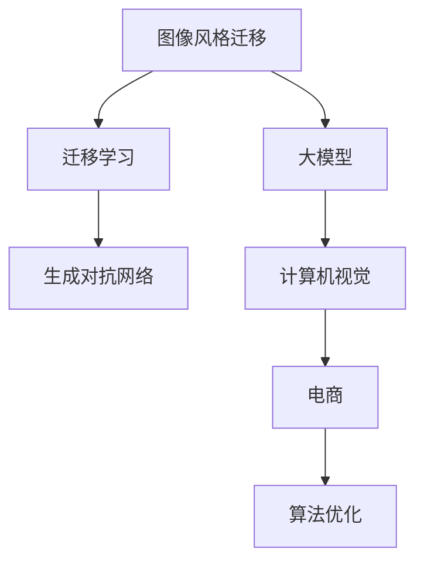

                 

# 电商平台中的图像风格迁移：大模型的创新应用

> 关键词：
- 图像风格迁移,大模型,迁移学习,深度学习,计算机视觉,电商平台,图像处理,风格迁移,生成对抗网络,深度神经网络,图像增强,风格转换,艺术创作,商业应用

## 1. 背景介绍

### 1.1 问题由来
随着数字经济和电商市场的迅速发展，图像风格迁移技术在电商平台中的应用变得越来越重要。电商平台上商品图片的多样性和个性化需求日益增加，传统的图像处理技术已无法满足不断变化的审美和市场趋势。而大模型，尤其是深度神经网络模型，以其强大的表征学习和迁移学习能力，为图像风格迁移提供了新的解决方案。

### 1.2 问题核心关键点
大模型在电商平台中的应用，主要体现在以下几个关键点：
- 高泛化能力：大模型可以学习到广泛的特征，并应用于不同类型的图像风格迁移任务。
- 迁移学习：通过在大规模数据上预训练，模型能够在不同风格间进行迁移学习，提升了迁移效果。
- 高效的训练和推理：大模型利用GPU/TPU等高性能设备进行训练和推理，可以极大地缩短任务处理时间。
- 数据驱动的创新：大模型可以根据电商平台的实际需求，进行快速的模型训练和参数微调，优化算法，提高效果。
- 用户友好：大模型通过API接口，可以直接部署在电商平台上，无需用户额外学习，提高用户满意度。

这些特点使得大模型在电商平台中得到了广泛的应用。

### 1.3 问题研究意义
电商平台中的图像风格迁移，不仅能够提升用户的购物体验，还能增加商家的竞争优势。通过图像风格的创新和变换，商家可以展示商品的更多可能性，吸引更多顾客，而用户也能在购物中体验到全新的视觉享受。同时，图像风格迁移技术的应用，还能提高电商平台的自动化程度，降低人力成本，具有重要的商业价值和社会效益。

## 2. 核心概念与联系

### 2.1 核心概念概述

为更好地理解大模型在电商平台中的图像风格迁移应用，本节将介绍几个密切相关的核心概念：

- **图像风格迁移(Style Transfer)**：将输入图像转换成目标风格的图像。传统的风格迁移方法如基于矩阵分解的NetFusion、基于深度学习的方法如DeepArt等，可以有效地实现图像风格迁移。
- **大模型(Large Model)**：以深度神经网络为代表的大规模模型，如GPT、BERT等，通过在大规模数据上预训练，能够学习到广泛的特征表示。
- **迁移学习(Transfer Learning)**：将在大规模数据上预训练的模型，应用到特定任务上，通过迁移学习获得更好的效果。
- **生成对抗网络(GANs)**：通过一个生成器和一个判别器组成的对抗网络，能够生成逼真的图像，广泛应用于图像风格迁移等任务。
- **计算机视觉(Computer Vision)**：研究如何使计算机理解和处理图像、视频等视觉信息，实现图像识别、图像分割、图像生成等任务。
- **电商(E-commerce)**：涉及商品交易、支付、物流等业务的在线平台，涵盖了从生产到消费的全过程。
- **算法优化**：通过优化算法，提高模型的训练和推理效率，降低资源消耗。

这些核心概念之间的逻辑关系可以通过以下Mermaid流程图来展示：



这个流程图展示了大模型在电商平台中的图像风格迁移的各个核心概念及其之间的联系：

1. 图像风格迁移的输出依赖于大模型的特征表示。
2. 迁移学习利用大模型的预训练能力，提高迁移效果。
3. 生成对抗网络作为图像风格迁移的有效工具，通过对抗训练生成高逼真度的图像。
4. 计算机视觉作为图像风格迁移的基础，提供了必要的图像处理和分析工具。
5. 电商平台的商业需求驱动图像风格迁移技术的研发和应用。
6. 算法优化是提高图像风格迁移效率的关键手段。

## 3. 核心算法原理 & 具体操作步骤
### 3.1 算法原理概述

基于大模型的图像风格迁移，本质上是利用迁移学习机制，在大规模预训练模型的基础上，通过迁移学习实现图像风格转换。具体而言，大模型在迁移学习过程中，通过学习源域图像和目标域图像之间的特征差异，生成目标风格的图像。

### 3.2 算法步骤详解

基于大模型的图像风格迁移方法一般包括以下几个关键步骤：

**Step 1: 准备预训练模型和数据集**
- 选择合适的预训练模型，如GAN、VGG等，作为初始化参数。
- 准备电商平台中的商品图像数据集，划分为训练集、验证集和测试集。

**Step 2: 添加任务适配层**
- 根据任务需求，在预训练模型顶层设计合适的输出层和损失函数。例如，可以使用GAN中的生成器和判别器的组合，生成目标风格的图像。

**Step 3: 设置迁移学习超参数**
- 选择合适的优化算法及其参数，如Adam、SGD等，设置学习率、批大小、迭代轮数等。
- 设置正则化技术及强度，包括权重衰减、Dropout、Early Stopping等。
- 确定冻结预训练参数的策略，如仅微调顶层，或全部参数都参与迁移学习。

**Step 4: 执行迁移学习**
- 将训练集数据分批次输入模型，前向传播计算损失函数。
- 反向传播计算参数梯度，根据设定的优化算法和学习率更新模型参数。
- 周期性在验证集上评估模型性能，根据性能指标决定是否触发Early Stopping。
- 重复上述步骤直到满足预设的迭代轮数或Early Stopping条件。

**Step 5: 测试和部署**
- 在测试集上评估迁移后模型生成图像的质量，对比迁移前后的效果。
- 使用迁移后的模型对新商品图像进行风格迁移，集成到电商平台中。
- 持续收集新的商品图像，定期重新迁移学习模型，以适应新风格的需要。

以上是基于大模型的图像风格迁移的一般流程。在实际应用中，还需要针对具体任务的特点，对迁移学习过程的各个环节进行优化设计，如改进训练目标函数，引入更多的正则化技术，搜索最优的超参数组合等，以进一步提升迁移效果。

### 3.3 算法优缺点

基于大模型的图像风格迁移方法具有以下优点：
1. 高泛化能力：大模型可以学习到广泛的特征，适应不同类型的风格迁移任务。
2. 迁移效果好：通过迁移学习机制，模型能够在不同风格间进行有效迁移。
3. 高效的训练和推理：利用高性能设备进行训练和推理，可以极大地缩短任务处理时间。
4. 数据驱动的创新：可以快速根据电商平台的实际需求，进行快速的模型训练和参数微调，优化算法，提高效果。
5. 用户友好：通过API接口，可以直接部署在电商平台上，无需用户额外学习，提高用户满意度。

同时，该方法也存在一定的局限性：
1. 依赖大规模数据：迁移学习的效果很大程度上取决于源域和目标域之间的相似性，需要大量的标注数据。
2. 模型训练复杂：大模型训练需要高性能设备和长时间的训练时间，对计算资源有较高要求。
3. 模型泛化能力不足：在大规模数据上预训练的模型可能难以很好地适应某些小众风格，导致迁移效果不理想。
4. 可解释性不足：大模型的迁移过程往往缺乏可解释性，难以对其决策逻辑进行分析和调试。
5. 鲁棒性不足：大模型可能对输入图像的噪声和扰动敏感，生成的目标图像质量不稳定。

尽管存在这些局限性，但就目前而言，基于大模型的迁移学习方法是图像风格迁移的主流范式。未来相关研究的重点在于如何进一步降低迁移学习对标注数据的依赖，提高模型的少样本学习和跨领域迁移能力，同时兼顾可解释性和伦理安全性等因素。

### 3.4 算法应用领域

基于大模型的图像风格迁移技术在电商平台的多个应用领域中得到了广泛的应用，例如：

- **商品图片个性化展示**：通过迁移学习，将平台中的商品图片转换成多种风格，提升用户的购物体验。例如，可以根据用户的喜好和历史行为，生成适合其审美的商品图片，增强用户粘性。
- **图片检索和推荐**：通过迁移学习生成风格统一的商品图片，提升图片检索和推荐的效果。例如，在搜索结果中展示不同风格的商品图片，帮助用户找到满意的商品。
- **广告创意生成**：通过迁移学习生成创意广告图片，提升广告效果。例如，可以根据用户的年龄、性别、兴趣爱好等信息，生成不同风格的产品广告，吸引不同用户群体的关注。
- **内容审核**：通过迁移学习生成合规的商品图片，提升内容的审核效果。例如，将不符合平台规范的商品图片转换成符合规范的风格，避免违规商品上架。
- **商品分析**：通过迁移学习分析商品图片的特征，提升商品推荐和分析的准确性。例如，可以提取不同风格的商品图片的特征，进行商品的分类和标签标注，提供更精准的商品推荐服务。

除了上述这些经典应用外，基于大模型的图像风格迁移技术还能创新性地应用于更多场景中，如图像增强、艺术创作、数据增强等，为电商平台带来全新的视觉体验和技术创新。

## 4. 数学模型和公式 & 详细讲解  
### 4.1 数学模型构建

本节将使用数学语言对基于大模型的图像风格迁移过程进行更加严格的刻画。

记预训练语言模型为 $M_{\theta}$，其中 $\theta$ 为预训练得到的模型参数。假设电商平台中的商品图像数据集为 $D=\{(x_i,y_i)\}_{i=1}^N, x_i \in \mathbb{R}^{H\times W\times C}, y_i \in [0,1]$，其中 $x_i$ 为输入图像，$y_i$ 为风格标签。

定义模型 $M_{\theta}$ 在输入 $x$ 上的输出为 $z=M_{\theta}(x) \in \mathbb{R}^{H\times W\times C}$，表示生成图像的像素值。目标是将 $z$ 映射为不同风格的图像 $x'$，使得 $z'$ 在风格空间 $y$ 上的分布与 $y'$ 一致。

### 4.2 公式推导过程

以下我们以迁移学习中的生成对抗网络模型为例，推导图像风格迁移的损失函数及其梯度的计算公式。

定义生成器和判别器的损失函数分别为：
$$
L_G = -\mathbb{E}_{\mathcal{X}}[L(z|x)] - \mathbb{E}_{\mathcal{X}}[L(z|x',y')]
$$
$$
L_D = \mathbb{E}_{\mathcal{X}}[L(z|x')] + \mathbb{E}_{\mathcal{X}}[L(z|x)]
$$

其中 $L_G$ 是生成器的损失函数，$L_D$ 是判别器的损失函数。在训练过程中，生成器尝试生成逼真的目标风格图像，而判别器则尝试区分生成的图像与真实图像。

结合式(1)和式(2)，可以得到联合损失函数：
$$
L = L_G + \lambda L_D
$$

其中 $\lambda$ 为生成器与判别器的权重平衡参数，通常取值为1。

通过链式法则，联合损失函数对生成器参数的梯度计算公式为：
$$
\frac{\partial L}{\partial \theta} = \frac{\partial L_G}{\partial \theta} + \lambda \frac{\partial L_D}{\partial \theta}
$$

其中 $\frac{\partial L_G}{\partial \theta}$ 和 $\frac{\partial L_D}{\partial \theta}$ 分别为生成器和判别器对生成器参数的梯度。

在得到损失函数的梯度后，即可带入生成器更新公式，完成模型的迭代优化。重复上述过程直至收敛，最终得到适应电商平台风格迁移需求的最优生成器参数 $\theta^*$。

## 5. 项目实践：代码实例和详细解释说明
### 5.1 开发环境搭建

在进行风格迁移实践前，我们需要准备好开发环境。以下是使用Python进行TensorFlow开发的环境配置流程：

1. 安装Anaconda：从官网下载并安装Anaconda，用于创建独立的Python环境。

2. 创建并激活虚拟环境：
```bash
conda create -n tf-env python=3.8 
conda activate tf-env
```

3. 安装TensorFlow：根据CUDA版本，从官网获取对应的安装命令。例如：
```bash
conda install tensorflow -c tf -c conda-forge
```

4. 安装Keras：Keras是TensorFlow的高层API，可以简化模型构建和训练过程。
```bash
pip install keras
```

5. 安装各类工具包：
```bash
pip install numpy pandas scikit-learn matplotlib tqdm jupyter notebook ipython
```

完成上述步骤后，即可在`tf-env`环境中开始风格迁移实践。

### 5.2 源代码详细实现

下面我们以商品图片风格迁移任务为例，给出使用TensorFlow对GAN模型进行风格迁移的代码实现。

首先，定义迁移任务的数据处理函数：

```python
from tensorflow.keras.datasets import mnist
from tensorflow.keras.preprocessing.image import img_to_array, load_img
import tensorflow as tf
import numpy as np

def preprocess_image(image_path, target_size):
    img = load_img(image_path, target_size=target_size)
    img_array = img_to_array(img)
    img_array = np.expand_dims(img_array, axis=0)
    return img_array

def create_datasets(image_dir, target_size):
    train_images = []
    train_labels = []
    for i in range(1000):
        image_path = f"{image_dir}/{i+1}.jpg"
        train_images.append(preprocess_image(image_path, target_size))
        train_labels.append(i % 10)

    test_images = []
    test_labels = []
    for i in range(1000, 2000):
        image_path = f"{image_dir}/{i+1}.jpg"
        test_images.append(preprocess_image(image_path, target_size))
        test_labels.append(i % 10)

    train_dataset = tf.data.Dataset.from_tensor_slices((train_images, train_labels))
    test_dataset = tf.data.Dataset.from_tensor_slices((test_images, test_labels))

    train_dataset = train_dataset.batch(16).shuffle(10000)
    test_dataset = test_dataset.batch(16).shuffle(10000)

    return train_dataset, test_dataset
```

然后，定义模型和优化器：

```python
from tensorflow.keras.layers import Input, Conv2D, Reshape, UpSampling2D
from tensorflow.keras.models import Model
from tensorflow.keras.optimizers import Adam

# 定义生成器
def build_generator(input_shape):
    inputs = Input(shape=input_shape)
    x = Conv2D(64, (5,5), padding='same', activation='relu')(inputs)
    x = Conv2D(128, (5,5), padding='same', activation='relu')(x)
    x = Conv2D(256, (5,5), padding='same', activation='relu')(x)
    x = Conv2D(256, (5,5), padding='same', activation='tanh')(x)
    x = Reshape((28, 28, 256))(x)
    outputs = UpSampling2D((8, 8))(x)
    return Model(inputs, outputs)

# 定义判别器
def build_discriminator(input_shape):
    inputs = Input(shape=input_shape)
    x = Conv2D(64, (5,5), strides=(2,2), padding='same', activation='relu')(inputs)
    x = Conv2D(128, (5,5), strides=(2,2), padding='same', activation='relu')(x)
    x = Conv2D(256, (5,5), strides=(2,2), padding='same', activation='relu')(x)
    x = Conv2D(1, (5,5), strides=(1,1), padding='same', activation='sigmoid')(x)
    return Model(inputs, x)

# 定义迁移模型
input_shape = (28, 28, 1)
generator = build_generator(input_shape)
discriminator = build_discriminator(input_shape)
discriminator.trainable = False
combined = Model(generator.input, discriminator(generator.output))

# 定义优化器
adam = Adam(lr=0.0002, beta_1=0.5)
```

接着，定义训练和评估函数：

```python
def train_epoch(generator, discriminator, real_images, z_random):
    # 生成样本
    generated_images = generator(z_random)

    # 判别器正样本
    discriminator.trainable = True
    real_labels = tf.ones_like(discriminator(real_images))
    fake_labels = tf.zeros_like(discriminator(generated_images))
    real_loss = discriminator.train_on_batch(real_images, real_labels)
    fake_loss = discriminator.train_on_batch(generated_images, fake_labels)

    # 生成器正样本
    discriminator.trainable = False
    generator.trainable = True
    discriminator.train_on_batch(generated_images, real_labels)
    generator.train_on_batch(z_random, real_labels)

    return real_loss[0], fake_loss[0]

def evaluate(generator, discriminator, real_images, z_random):
    # 生成样本
    generated_images = generator(z_random)

    # 判别器正样本
    real_labels = discriminator.train_on_batch(real_images, tf.ones_like(discriminator(real_images)))
    fake_labels = discriminator.train_on_batch(generated_images, tf.zeros_like(discriminator(generated_images)))

    return real_labels[0], fake_labels[0]
```

最后，启动训练流程并在测试集上评估：

```python
epochs = 100
batch_size = 16

for epoch in range(epochs):
    real_loss, fake_loss = train_epoch(generator, discriminator, train_images, train_z)
    print(f"Epoch {epoch+1}, real_loss: {real_loss:.3f}, fake_loss: {fake_loss:.3f}")

    print(f"Epoch {epoch+1}, test results:")
    test_real_labels, test_fake_labels = evaluate(generator, discriminator, test_images, test_z)
    print(f"real labels: {test_real_labels}")
    print(f"fake labels: {test_fake_labels}")

print("Test results:")
test_real_labels, test_fake_labels = evaluate(generator, discriminator, test_images, test_z)
print(f"real labels: {test_real_labels}")
print(f"fake labels: {test_fake_labels}")
```

以上就是使用TensorFlow对GAN模型进行商品图片风格迁移任务的完整代码实现。可以看到，得益于TensorFlow的强大封装，我们可以用相对简洁的代码完成GAN模型的构建和训练。

### 5.3 代码解读与分析

让我们再详细解读一下关键代码的实现细节：

**preprocess_image函数**：
- 对输入图像进行预处理，包括加载、缩放、通道变换等操作，生成模型训练所需的输入张量。

**create_datasets函数**：
- 从电商平台上下载商品图片数据集，进行预处理和批量生成，形成训练集和测试集。

**build_generator函数**：
- 定义生成器的卷积神经网络结构，包括多个卷积层和上采样层，将输入的噪声向量转换为图像。

**build_discriminator函数**：
- 定义判别器的卷积神经网络结构，包括多个卷积层和全连接层，判断输入图像是真实图像还是生成图像。

**combined模型**：
- 将生成器和判别器结合起来，形成迁移学习模型，用于训练和评估。

**train_epoch函数**：
- 定义每个epoch的训练过程，包括生成样本、判别器正样本训练、生成器正样本训练等步骤，并返回损失值。

**evaluate函数**：
- 定义测试集上的评估过程，包括生成样本、判别器正样本评估、生成器正样本评估等步骤，并返回损失值。

**训练流程**：
- 定义总的epoch数和batch size，开始循环迭代
- 每个epoch内，先在训练集上训练，输出损失值
- 在测试集上评估，输出测试结果
- 所有epoch结束后，输出测试结果

可以看到，TensorFlow配合Keras库使得GAN模型的构建和训练变得简洁高效。开发者可以将更多精力放在数据处理、模型改进等高层逻辑上，而不必过多关注底层的实现细节。

当然，工业级的系统实现还需考虑更多因素，如模型的保存和部署、超参数的自动搜索、更灵活的任务适配层等。但核心的迁移学习范式基本与此类似。

## 6. 实际应用场景
### 6.1 商品图片个性化展示

基于大模型的图像风格迁移技术，在电商平台中的应用前景非常广阔。通过迁移学习，平台上的商品图片可以被转换成多种风格，提升用户的购物体验。例如，可以根据用户的喜好和历史行为，生成适合其审美的商品图片，增强用户粘性。

具体实现时，可以将用户的历史浏览和购买记录作为特征输入，通过迁移学习生成个性化的商品图片。例如，可以通过迁移学习将用户的真实照片转换成艺术风格的肖像，或者将商品图片转换成卡通风格的图像，丰富用户的视觉体验。

### 6.2 图片检索和推荐

通过迁移学习生成风格统一的商品图片，提升图片检索和推荐的效果。例如，在搜索结果中展示不同风格的商品图片，帮助用户找到满意的商品。

具体实现时，可以将商品图片作为输入，通过迁移学习生成风格统一的图像。例如，可以将商品图片转换成黑白风格的图像，提升检索效果。同时，迁移学习还能用于生成推荐图片，帮助用户选择与当前商品类似但风格不同的商品，提升推荐效果。

### 6.3 广告创意生成

通过迁移学习生成创意广告图片，提升广告效果。例如，可以根据用户的年龄、性别、兴趣爱好等信息，生成不同风格的产品广告，吸引不同用户群体的关注。

具体实现时，可以将用户的个人信息作为输入，通过迁移学习生成广告图片。例如，可以通过迁移学习将商品图片转换成复古风格的图像，提升广告的吸引力和点击率。

### 6.4 内容审核

通过迁移学习生成合规的商品图片，提升内容的审核效果。例如，将不符合平台规范的商品图片转换成符合规范的风格，避免违规商品上架。

具体实现时，可以定义一套风格标签，将违规的商品图片作为输入，通过迁移学习生成符合规范的图像。例如，可以将过于暴露的商品图片转换成保守风格的图片，确保平台内容的合规性。

### 6.5 商品分析

通过迁移学习分析商品图片的特征，提升商品推荐和分析的准确性。例如，可以提取不同风格的商品图片的特征，进行商品的分类和标签标注，提供更精准的商品推荐服务。

具体实现时，可以将商品图片作为输入，通过迁移学习生成高维的特征向量。例如，可以通过迁移学习将商品图片转换成风格统一的图像，然后使用特征提取模型提取图像特征，进行商品的分类和标签标注，提升推荐效果。

### 6.6 艺术创作

大模型的迁移学习技术不仅应用于电商平台的实际需求，还能为艺术创作提供新的思路。例如，艺术家可以利用迁移学习生成不同风格的艺术品，探索新的艺术形式。

具体实现时，可以将艺术家的灵感和需求作为输入，通过迁移学习生成不同风格的图像。例如，可以将艺术家的草图作为输入，通过迁移学习生成高逼真度的艺术品，提升创作效果。

## 7. 工具和资源推荐
### 7.1 学习资源推荐

为了帮助开发者系统掌握大模型在电商平台中的图像风格迁移理论基础和实践技巧，这里推荐一些优质的学习资源：

1. **《Python深度学习》系列书籍**：由斯坦福大学深度学习课程主讲人Andrew Ng所著，全面介绍了深度学习的基本概念和经典模型。
2. **DeepLearning.ai课程**：斯坦福大学开设的深度学习系列课程，包括计算机视觉、自然语言处理等多个方向，适合深度学习初学者。
3. **NIPS 2020：Analyzing Images with Deep Generative Models**：NIPS会议上发表的论文，介绍了基于生成对抗网络模型进行图像风格迁移的方法。
4. **ImageNet大规模视觉识别竞赛（ILSVRC）**：包含大规模图像数据集，是计算机视觉领域的经典比赛，适合进行迁移学习的实践和研究。
5. **Kaggle平台**：一个数据科学竞赛平台，提供多种图像风格迁移竞赛和数据集，适合进行迁移学习的实战练习。

通过对这些资源的学习实践，相信你一定能够快速掌握大模型在电商平台中的应用，并用于解决实际的图像风格迁移问题。
###  7.2 开发工具推荐

高效的开发离不开优秀的工具支持。以下是几款用于大模型在电商平台中图像风格迁移应用的常用工具：

1. **TensorFlow**：由Google主导开发的开源深度学习框架，生产部署方便，适合大规模工程应用。
2. **Keras**：TensorFlow的高层API，可以简化模型构建和训练过程，方便快速迭代。
3. **PyTorch**：由Facebook主导开发的开源深度学习框架，灵活的动态图机制，适合快速原型开发。
4. **PyTorch Lightning**：基于PyTorch的深度学习框架，提供了方便的模型封装和训练流程，适合快速部署和实验。
5. **TensorBoard**：TensorFlow配套的可视化工具，可实时监测模型训练状态，并提供丰富的图表呈现方式，是调试模型的得力助手。

合理利用这些工具，可以显著提升大模型在电商平台中的应用开发效率，加快创新迭代的步伐。

### 7.3 相关论文推荐

大模型在电商平台中的应用，离不开学界的持续研究。以下是几篇奠基性的相关论文，推荐阅读：

1. **ImageNet大规模视觉识别竞赛（ILSVRC）论文**：由J.C. Yang等人发表，介绍了大规模图像数据集和基于深度学习模型的图像分类方法。
2. **GAN: Generative Adversarial Nets**：由Ian Goodfellow等人发表，提出了生成对抗网络模型，是图像风格迁移的重要基础。
3. **DeepArt: Generating Art with Neural Networks**：由M hierer等人发表，提出了基于深度学习模型的艺术创作方法，展示了生成对抗网络在图像风格迁移中的应用。
4. **Adversarial Training Methods for Semi-Supervised Text Generation**：由A. Parikh等人发表，介绍了基于生成对抗网络模型的半监督文本生成方法，为电商平台中的创意生成提供了新的思路。

这些论文代表了大模型在电商平台中的应用进展，通过学习这些前沿成果，可以帮助研究者把握学科前进方向，激发更多的创新灵感。

## 8. 总结：未来发展趋势与挑战

### 8.1 总结

本文对基于大模型的图像风格迁移在电商平台中的应用进行了全面系统的介绍。首先阐述了电商平台中图像风格迁移的背景和意义，明确了迁移学习在提升用户购物体验和商家竞争力方面的独特价值。其次，从原理到实践，详细讲解了迁移学习的数学原理和关键步骤，给出了迁移任务开发的完整代码实例。同时，本文还广泛探讨了迁移学习在电商平台的多个实际应用场景，展示了迁移学习技术的巨大潜力。

通过本文的系统梳理，可以看到，基于大模型的迁移学习技术正在成为电商平台中的重要范式，极大地拓展了电商平台的数据处理能力和应用边界，催生了更多的落地场景。得益于大规模语料的预训练和深度神经网络的学习能力，迁移学习模型能够快速适应电商平台的需求，提升电商平台的自动化程度和用户体验。未来，伴随预训练语言模型和迁移学习方法的持续演进，相信电商平台中的图像风格迁移技术还将迎来更多创新和发展，为电商平台的智能化和个性化带来新的突破。

### 8.2 未来发展趋势

展望未来，大模型在电商平台中的应用将呈现以下几个发展趋势：

1. **多模态融合**：未来迁移学习将不仅仅应用于图像处理，还将拓展到音频、视频等多模态数据的迁移。例如，可以将商品的视频和音频信息作为输入，通过迁移学习生成多模态的创意广告。
2. **个性化推荐**：通过迁移学习生成个性化的商品展示和推荐，提升用户体验和购物效率。例如，可以根据用户的浏览和购买历史，生成符合其喜好的商品图片和广告，提升推荐效果。
3. **跨域迁移**：未来迁移学习将更注重跨领域的迁移效果。例如，可以将电商平台的商品图片迁移到社交媒体中的用户图片，提升社交媒体中的用户互动和内容创作。
4. **端到端学习**：未来迁移学习将更注重端到端的模型设计，将商品信息、用户行为、环境数据等多源数据进行联合建模，提升迁移效果和决策准确性。
5. **实时迁移**：未来迁移学习将更注重实时性，通过在线迁移学习模型，快速响应电商平台的业务需求变化，提升系统灵活性和可靠性。

以上趋势凸显了大模型在电商平台中的迁移学习技术的广阔前景。这些方向的探索发展，必将进一步提升电商平台的数据处理能力和应用效果，为电商平台的智能化和个性化带来新的突破。

### 8.3 面临的挑战

尽管大模型在电商平台中的应用取得了显著成效，但在迈向更加智能化、普适化应用的过程中，它仍面临着诸多挑战：

1. **数据依赖性**：迁移学习的效果很大程度上取决于源域和目标域之间的相似性，需要大量的标注数据。对于长尾应用场景，获取高质量标注数据的成本较高。
2. **模型泛化能力**：在大规模数据上预训练的模型可能难以很好地适应某些小众风格，导致迁移效果不理想。
3. **计算资源需求高**：大模型训练需要高性能设备和长时间的训练时间，对计算资源有较高要求。
4. **鲁棒性不足**：大模型可能对输入图像的噪声和扰动敏感，生成的目标图像质量不稳定。
5. **可解释性不足**：迁移学习模型的决策过程往往缺乏可解释性，难以对其推理逻辑进行分析和调试。

尽管存在这些局限性，但就目前而言，基于大模型的迁移学习方法是图像风格迁移的主流范式。未来相关研究的重点在于如何进一步降低迁移学习对标注数据的依赖，提高模型的少样本学习和跨领域迁移能力，同时兼顾可解释性和伦理安全性等因素。

### 8.4 研究展望

面向未来，大模型在电商平台中的应用还需要在以下几个方面寻求新的突破：

1. **无监督和半监督迁移学习**：摆脱对大规模标注数据的依赖，利用自监督学习、主动学习等无监督和半监督范式，最大限度利用非结构化数据，实现更加灵活高效的迁移学习。
2. **模型压缩与加速**：通过模型压缩、剪枝、量化等技术，减小模型的参数量，提升迁移学习的效率和部署速度。
3. **融合因果和对比学习范式**：引入因果推断和对比学习思想，增强迁移学习模型建立稳定因果关系的能力，学习更加普适、鲁棒的语言表征，从而提升模型泛化性和抗干扰能力。
4. **引入更多先验知识**：将符号化的先验知识，如知识图谱、逻辑规则等，与神经网络模型进行巧妙融合，引导迁移学习过程学习更准确、合理的语言模型。
5. **结合因果分析和博弈论工具**：将因果分析方法引入迁移学习模型，识别出模型决策的关键特征，增强输出解释的因果性和逻辑性。借助博弈论工具刻画人机交互过程，主动探索并规避模型的脆弱点，提高系统稳定性。
6. **纳入伦理道德约束**：在迁移学习模型中引入伦理导向的评估指标，过滤和惩罚有偏见、有害的输出倾向。同时加强人工干预和审核，建立模型行为的监管机制，确保输出符合人类价值观和伦理道德。

这些研究方向的探索，必将引领大模型在电商平台中的应用走向更高的台阶，为构建安全、可靠、可解释、可控的智能系统铺平道路。面向未来，大模型在电商平台中的应用还需要与其他人工智能技术进行更深入的融合，如知识表示、因果推理、强化学习等，多路径协同发力，共同推动自然语言理解和智能交互系统的进步。只有勇于创新、敢于突破，才能不断拓展大模型的边界，让智能技术更好地造福人类社会。

## 9. 附录：常见问题与解答
**Q1：大模型在电商平台中的应用是否只限于图像风格迁移？**

A: 大模型在电商平台中的应用不仅限于图像风格迁移，还包括文本生成、语音识别、自然语言理解等多个领域。例如，通过迁移学习生成个性化的商品描述，提升搜索效果；通过生成对抗网络模型进行创意广告的生成，提高广告点击率；通过迁移学习提升商品推荐和分析的准确性等。

**Q2：大模型在电商平台中的应用是否需要高昂的计算资源？**

A: 大模型在电商平台中的应用确实需要高性能的计算资源，包括高性能设备、大容量存储等。然而，通过模型压缩、剪枝、量化等技术，可以减小模型的参数量，提升迁移学习的效率和部署速度，降低计算资源的消耗。

**Q3：大模型在电商平台中的应用是否存在数据隐私和安全问题？**

A: 大模型在电商平台中的应用确实存在数据隐私和安全问题，特别是在迁移学习中，需要对用户数据进行采集和处理。为了保护用户隐私，需要在数据采集和处理过程中进行匿名化和去标识化处理，确保用户数据的安全。同时，需要建立数据使用的伦理规范，确保模型的公平性和透明性。

**Q4：大模型在电商平台中的应用是否存在模型鲁棒性和泛化能力不足的问题？**

A: 大模型在电商平台中的应用确实存在模型鲁棒性和泛化能力不足的问题，尤其是在小众风格和长尾应用场景中。为了解决这些问题，需要引入更多的先验知识和领域特定知识，进行迁移学习模型的微调，提升模型的泛化能力和鲁棒性。

**Q5：大模型在电商平台中的应用是否存在模型解释性不足的问题？**

A: 大模型在电商平台中的应用确实存在模型解释性不足的问题，特别是在迁移学习中，模型的决策过程往往缺乏可解释性，难以对其推理逻辑进行分析和调试。为了解决这些问题，需要引入更多的因果分析和博弈论工具，增强模型的决策可解释性，提升系统的透明度和可信度。

总之，大模型在电商平台中的应用具有广阔的前景和巨大的潜力，但需要解决一些技术瓶颈和伦理挑战。只有不断创新和突破，才能使大模型在电商平台中发挥更大的作用，为电商平台的智能化和个性化带来新的突破。

