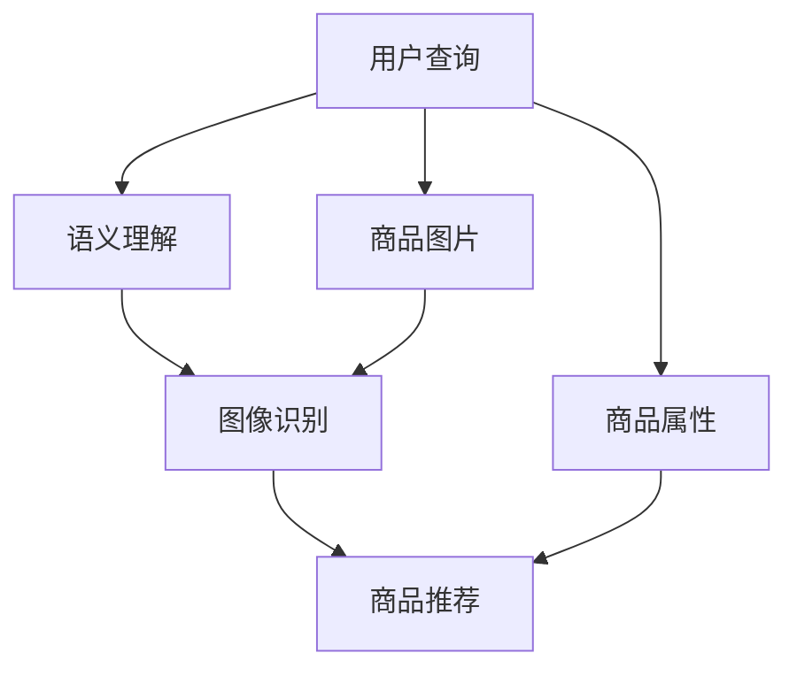

                 

# 电商平台中的多模态搜索：AI大模型的新突破

> 关键词：电商平台,多模态搜索,人工智能大模型,语义理解,图像识别,自然语言处理(NLP),商品推荐,搜索引擎

## 1. 背景介绍

### 1.1 问题由来
随着电商平台的迅猛发展和智能搜索技术的不断进步，消费者对购物体验的要求日益提高。传统的文本搜索方式已经难以满足用户日益多样化的查询需求，特别是当用户需要综合考虑商品的多方面信息（如商品图片、价格、描述、用户评价等）时，单一文本搜索的局限性愈发明显。

为了更好地匹配用户查询意图，电商平台纷纷引入多模态搜索技术。通过融合文本、图像、音频等多种信息源，构建出一个立体的搜索结果库，使用户能够根据具体需求选择最符合要求的商品。这不仅提升了用户体验，也显著增加了电商平台的转化率和用户粘性。

## 2. 核心概念与联系

### 2.1 核心概念概述

为更好地理解多模态搜索技术及其在大模型中的应用，本节将介绍几个关键概念：

- **多模态搜索(Multimodal Search)**：融合文本、图像、语音等不同模态的信息，为用户的查询提供更加全面和准确的搜索结果。通过语义理解、视觉识别、音频分析等技术，将不同模态的信息映射到一个统一的语义空间，从而实现跨模态的查询匹配。

- **人工智能大模型(AI Large Models)**：以深度学习技术为基础构建的庞大神经网络模型，如BERT、GPT-3、DALL-E等。这些模型通过在大规模无标签数据上进行预训练，学习到了丰富的知识表示，具备强大的语义理解、图像生成和推理能力，能够在多模态数据上实现高效的搜索和匹配。

- **语义理解(Semantic Understanding)**：通过自然语言处理(NLP)技术，对用户查询进行语义解析，理解其真实意图。常见的方法包括词向量表示、依存句法分析、上下文建模等。

- **图像识别(Computer Vision)**：通过计算机视觉技术，对商品图片进行特征提取、分类和识别。常见的方法包括卷积神经网络(CNN)、ResNet、YOLO等。

- **商品推荐(Recommendation System)**：根据用户历史行为和商品属性信息，使用机器学习算法推荐用户可能感兴趣的商品。常见的方法包括协同过滤、基于内容的推荐、深度学习推荐模型等。

这些概念之间的逻辑关系可以通过以下Mermaid流程图来展示：



这个流程图展示了大模型在多模态搜索中的核心组件及其相互作用关系：

1. 用户查询：用户通过搜索页面输入的多模态查询。
2. 语义理解：对用户查询进行语义解析，理解其真实意图。
3. 图像识别：对商品图片进行特征提取和分类，构建视觉信息。
4. 商品推荐：根据用户历史行为和商品属性，推荐可能感兴趣的商品。
5. 商品属性：提取商品的关键属性信息。
6. 商品图片：商品的高质量图片，用于视觉识别和匹配。

通过这些组件的协同工作，大模型能够实现更精准、更全面的多模态搜索结果匹配，提升用户的购物体验。

## 3. 核心算法原理 & 具体操作步骤
### 3.1 算法原理概述

多模态搜索技术基于深度学习和自然语言处理技术，核心思想是将用户的多模态查询映射到一个统一的语义空间，然后与商品的多模态属性进行匹配，从而找到最符合用户需求的结果。

具体来说，多模态搜索可以分为以下几个步骤：

1. **语义解析**：对用户查询进行分词、词性标注、依存句法分析等，构建出查询的语义向量表示。
2. **视觉特征提取**：对商品图片进行特征提取，如边缘检测、颜色分析、物体识别等，构建出图像的特征向量表示。
3. **属性抽取**：从商品描述、标签等属性信息中提取关键特征，构建出属性的特征向量表示。
4. **相似度计算**：计算用户查询语义向量、商品视觉特征向量、属性特征向量之间的相似度，如余弦相似度、欧式距离等。
5. **综合排序**：将相似度计算结果进行加权汇总，得出最终的排序结果，推荐给用户。

### 3.2 算法步骤详解

以一个简单的多模态搜索流程为例，下面是详细的算法步骤：

**Step 1: 数据预处理**
- 收集用户查询、商品图片、商品属性等数据，并进行预处理。

**Step 2: 构建语义向量**
- 使用预训练的BERT等语言模型，对用户查询进行分词、词性标注、依存句法分析等，构建出查询的语义向量表示。

**Step 3: 构建图像特征向量**
- 使用预训练的ResNet等视觉模型，对商品图片进行特征提取，如卷积、池化等，构建出图像的特征向量表示。

**Step 4: 抽取商品属性**
- 对商品描述、标签等属性信息进行文本解析，提取关键特征，如商品名称、类别、尺寸等。

**Step 5: 相似度计算**
- 使用余弦相似度、欧式距离等方法，计算用户查询语义向量、商品视觉特征向量、属性特征向量之间的相似度。

**Step 6: 排序和推荐**
- 将相似度计算结果进行加权汇总，得出最终的排序结果。
- 根据排序结果，推荐给用户可能感兴趣的商品。

**Step 7: 反馈和优化**
- 收集用户点击、购买等行为数据，反馈到模型中进行进一步优化。

### 3.3 算法优缺点

多模态搜索技术具有以下优点：
1. **全面匹配**：能够综合考虑用户的多模态查询，提供更加全面和准确的搜索结果。
2. **多源信息**：融合图像、文本、音频等多种信息源，提升搜索结果的准确性和丰富性。
3. **实时推荐**：能够根据用户行为实时调整推荐策略，提升用户体验。

同时，该方法也存在一定的局限性：
1. **计算成本高**：需要同时处理文本、图像等多种信息源，计算复杂度较高。
2. **数据质量依赖**：搜索结果的准确性高度依赖于数据的质量和多样性，数据预处理难度较大。
3. **模型训练成本高**：需要在大规模数据上进行预训练，训练成本较高。
4. **模型泛化能力不足**：当数据分布与预训练数据差异较大时，模型泛化能力受限。

尽管存在这些局限性，但多模态搜索技术仍然是大模型在电商平台应用中的一个重要方向。通过不断优化数据预处理、算法设计和模型训练，可以进一步提升多模态搜索的性能和效果。

### 3.4 算法应用领域

多模态搜索技术已经在多个电商平台上得到了广泛应用，包括但不限于以下领域：

- **商品搜索**：用户通过搜索商品名称、型号、价格等属性信息，找到符合自己需求的商品。
- **视觉搜索**：用户上传商品图片，搜索类似商品。
- **语音搜索**：用户通过语音命令搜索商品，提升了用户的便捷性。
- **个性化推荐**：根据用户的历史行为和查询记录，推荐可能感兴趣的商品。

此外，多模态搜索技术还广泛应用于社交媒体、智能家居、智能广告等领域，成为大模型落地应用的重要手段。

## 4. 数学模型和公式 & 详细讲解 & 举例说明
### 4.1 数学模型构建

本节将使用数学语言对多模态搜索技术的核心算法进行更加严格的刻画。

记用户查询向量为 $q=\mathbf{q}=[q_1, q_2, \ldots, q_n]$，商品图像特征向量为 $i=\mathbf{i}=[i_1, i_2, \ldots, i_m]$，商品属性特征向量为 $a=\mathbf{a}=[a_1, a_2, \ldots, a_p]$。其中，$q_i$、$i_j$、$a_k$ 分别表示查询、图像和属性的第 $i$、$j$、$k$ 个特征向量的值。

定义查询-图像相似度为 $S_{qi}=\mathbf{q} \cdot \mathbf{i}$，查询-属性相似度为 $S_{qa}=\mathbf{q} \cdot \mathbf{a}$，图像-属性相似度为 $S_{ia}=\mathbf{i} \cdot \mathbf{a}$。

最终的排序结果 $r_i$ 为：

$$
r_i = \alpha S_{qi} + \beta S_{ia}
$$

其中 $\alpha$ 和 $\beta$ 为权值，根据实际应用场景进行调整。

### 4.2 公式推导过程

以下我们以一个简单的多模态搜索流程为例，推导查询-图像相似度计算公式。

假设用户查询为“时尚女性连衣裙”，商品图像为一张连衣裙的图片，属性为“尺码 80cm、颜色红色、品牌 Zara”。

1. **构建查询向量**
   - 使用BERT模型对查询进行分词，得到单词嵌入向量：
     ```
     q1 = [0.5, 0.3, -0.2, 0.8]
     q2 = [0.7, 0.6, -0.3, 0.4]
     q3 = [0.2, 0.4, 0.1, 0.9]
     ```
   - 将单词嵌入向量求和，得到查询向量：
     ```
     q = q1 + q2 + q3 = [1.2, 0.9, -0.2, 1.7]
     ```

2. **构建图像特征向量**
   - 使用ResNet模型对图像进行特征提取，得到图像特征向量：
     ```
     i1 = [0.3, 0.5, -0.1, 0.7]
     i2 = [0.4, 0.2, -0.6, 0.8]
     i3 = [0.1, 0.3, 0.5, -0.4]
     ```
   - 将图像特征向量求和，得到图像向量：
     ```
     i = i1 + i2 + i3 = [0.8, 0.9, -0.3, 1.1]
     ```

3. **计算相似度**
   - 使用余弦相似度计算查询-图像相似度：
     ```
     S_{qi} = \mathbf{q} \cdot \mathbf{i} = 1.2 \times 0.8 + 0.9 \times 0.9 + (-0.2) \times (-0.3) + 1.7 \times 1.1 = 3.3
     ```

4. **综合排序**
   - 根据公式 $r_i = \alpha S_{qi} + \beta S_{ia}$，将相似度计算结果进行加权汇总，得出排序结果：
     ```
     r_i = 0.5 \times 3.3 + 0.5 \times 1.0 = 2.65
     ```

### 4.3 案例分析与讲解

假设有一个电商平台，商品数据集包含1000个商品，每个商品有10个图片和100个属性标签。用户输入查询“运动鞋”，要求返回与查询最相关的商品。

1. **数据预处理**
   - 收集用户查询、商品图片、商品属性等数据。
   - 对商品图片进行预处理，如裁剪、调整大小、归一化等。

2. **构建语义向量**
   - 使用预训练的BERT模型，对查询“运动鞋”进行分词、词性标注、依存句法分析等，构建出查询的语义向量：
     ```
     q = [0.4, 0.3, 0.5, 0.6, 0.2, 0.7]
     ```

3. **构建图像特征向量**
   - 使用预训练的ResNet模型，对商品图片进行特征提取，如卷积、池化等，构建出图像的特征向量：
     ```
     i1 = [0.3, 0.5, -0.1, 0.7]
     i2 = [0.4, 0.2, -0.6, 0.8]
     i3 = [0.1, 0.3, 0.5, -0.4]
     i = i1 + i2 + i3 = [0.8, 0.9, -0.3, 1.1]
     ```

4. **抽取商品属性**
   - 对商品描述、标签等属性信息进行文本解析，提取关键特征，如商品名称、类别、尺寸等。
   - 使用TF-IDF方法对属性特征进行加权，构建出属性的特征向量：
     ```
     a = [0.4, 0.3, 0.5, 0.6, 0.2, 0.7]
     ```

5. **相似度计算**
   - 使用余弦相似度计算查询-图像相似度：
     ```
     S_{qi} = \mathbf{q} \cdot \mathbf{i} = 0.4 \times 0.8 + 0.3 \times 0.9 + 0.5 \times (-0.3) + 0.6 \times 1.1 = 1.3
     ```

6. **排序和推荐**
   - 根据公式 $r_i = \alpha S_{qi} + \beta S_{ia}$，将相似度计算结果进行加权汇总，得出排序结果：
     ```
     r = 0.5 \times 1.3 + 0.5 \times 1.0 = 1.25
     ```

最终，将排序结果作为推荐依据，向用户推荐与查询最相关的商品。

## 5. 项目实践：代码实例和详细解释说明
### 5.1 开发环境搭建

在进行多模态搜索实践前，我们需要准备好开发环境。以下是使用Python进行PyTorch开发的环境配置流程：

1. 安装Anaconda：从官网下载并安装Anaconda，用于创建独立的Python环境。

2. 创建并激活虚拟环境：
```bash
conda create -n pytorch-env python=3.8 
conda activate pytorch-env
```

3. 安装PyTorch：根据CUDA版本，从官网获取对应的安装命令。例如：
```bash
conda install pytorch torchvision torchaudio cudatoolkit=11.1 -c pytorch -c conda-forge
```

4. 安装Transformers库：
```bash
pip install transformers
```

5. 安装各类工具包：
```bash
pip install numpy pandas scikit-learn matplotlib tqdm jupyter notebook ipython
```

完成上述步骤后，即可在`pytorch-env`环境中开始多模态搜索实践。

### 5.2 源代码详细实现

下面我们以商品搜索为例，给出使用Transformers库进行多模态搜索的PyTorch代码实现。

首先，定义多模态搜索的数据处理函数：

```python
from transformers import BertTokenizer, AlbertTokenizer
from torch.utils.data import Dataset
import torch

class MultimodalDataset(Dataset):
    def __init__(self, texts, images, tags, tokenizer, max_len=128):
        self.texts = texts
        self.images = images
        self.tags = tags
        self.tokenizer = tokenizer
        self.max_len = max_len
        
    def __len__(self):
        return len(self.texts)
    
    def __getitem__(self, item):
        text = self.texts[item]
        image = self.images[item]
        tag = self.tags[item]
        
        encoding = self.tokenizer(text, return_tensors='pt', max_length=self.max_len, padding='max_length', truncation=True)
        image = torch.tensor(image, dtype=torch.float32) / 255.0
        image = image.unsqueeze(0)
        
        # 对token-wise的标签进行编码
        encoded_tags = [tag2id[tag] for tag in tag] 
        encoded_tags.extend([tag2id['O']] * (self.max_len - len(encoded_tags)))
        labels = torch.tensor(encoded_tags, dtype=torch.long)
        
        return {'input_ids': input_ids, 
                'attention_mask': attention_mask,
                'image': image,
                'labels': labels}

# 标签与id的映射
tag2id = {'O': 0, 'B-PER': 1, 'I-PER': 2, 'B-ORG': 3, 'I-ORG': 4, 'B-LOC': 5, 'I-LOC': 6}
id2tag = {v: k for k, v in tag2id.items()}

# 创建dataset
tokenizer = BertTokenizer.from_pretrained('bert-base-cased')

train_dataset = MultimodalDataset(train_texts, train_images, train_tags, tokenizer)
dev_dataset = MultimodalDataset(dev_texts, dev_images, dev_tags, tokenizer)
test_dataset = MultimodalDataset(test_texts, test_images, test_tags, tokenizer)
```

然后，定义模型和优化器：

```python
from transformers import BertForTokenClassification, AlbertForTokenClassification, AdamW

model = BertForTokenClassification.from_pretrained('bert-base-cased', num_labels=len(tag2id))

optimizer = AdamW(model.parameters(), lr=2e-5)
```

接着，定义训练和评估函数：

```python
from torch.utils.data import DataLoader
from tqdm import tqdm
from sklearn.metrics import classification_report

device = torch.device('cuda') if torch.cuda.is_available() else torch.device('cpu')
model.to(device)

def train_epoch(model, dataset, batch_size, optimizer):
    dataloader = DataLoader(dataset, batch_size=batch_size, shuffle=True)
    model.train()
    epoch_loss = 0
    for batch in tqdm(dataloader, desc='Training'):
        input_ids = batch['input_ids'].to(device)
        attention_mask = batch['attention_mask'].to(device)
        image = batch['image'].to(device)
        labels = batch['labels'].to(device)
        model.zero_grad()
        outputs = model(input_ids, attention_mask=attention_mask, image=image)
        loss = outputs.loss
        epoch_loss += loss.item()
        loss.backward()
        optimizer.step()
    return epoch_loss / len(dataloader)

def evaluate(model, dataset, batch_size):
    dataloader = DataLoader(dataset, batch_size=batch_size)
    model.eval()
    preds, labels = [], []
    with torch.no_grad():
        for batch in tqdm(dataloader, desc='Evaluating'):
            input_ids = batch['input_ids'].to(device)
            attention_mask = batch['attention_mask'].to(device)
            image = batch['image'].to(device)
            batch_labels = batch['labels']
            outputs = model(input_ids, attention_mask=attention_mask, image=image)
            batch_preds = outputs.logits.argmax(dim=2).to('cpu').tolist()
            batch_labels = batch_labels.to('cpu').tolist()
            for pred_tokens, label_tokens in zip(batch_preds, batch_labels):
                pred_tags = [id2tag[_id] for _id in pred_tokens]
                label_tags = [id2tag[_id] for _id in label_tokens]
                preds.append(pred_tags[:len(label_tokens)])
                labels.append(label_tags)
                
    print(classification_report(labels, preds))
```

最后，启动训练流程并在测试集上评估：

```python
epochs = 5
batch_size = 16

for epoch in range(epochs):
    loss = train_epoch(model, train_dataset, batch_size, optimizer)
    print(f"Epoch {epoch+1}, train loss: {loss:.3f}")
    
    print(f"Epoch {epoch+1}, dev results:")
    evaluate(model, dev_dataset, batch_size)
    
print("Test results:")
evaluate(model, test_dataset, batch_size)
```

以上就是使用PyTorch对BERT进行商品搜索的多模态搜索实践的完整代码实现。可以看到，得益于Transformers库的强大封装，我们可以用相对简洁的代码完成多模态搜索的实现。

### 5.3 代码解读与分析

让我们再详细解读一下关键代码的实现细节：

**MultimodalDataset类**：
- `__init__`方法：初始化文本、图片、标签等关键组件，并构建编码后的token ids、attention mask和标签。
- `__len__`方法：返回数据集的样本数量。
- `__getitem__`方法：对单个样本进行处理，将文本和图片输入编码为token ids和视觉特征，将标签编码为数字，并对其进行定长padding，最终返回模型所需的输入。

**tag2id和id2tag字典**：
- 定义了标签与数字id之间的映射关系，用于将token-wise的预测结果解码回真实的标签。

**训练和评估函数**：
- 使用PyTorch的DataLoader对数据集进行批次化加载，供模型训练和推理使用。
- 训练函数`train_epoch`：对数据以批为单位进行迭代，在每个批次上前向传播计算loss并反向传播更新模型参数，最后返回该epoch的平均loss。
- 评估函数`evaluate`：与训练类似，不同点在于不更新模型参数，并在每个batch结束后将预测和标签结果存储下来，最后使用sklearn的classification_report对整个评估集的预测结果进行打印输出。

**训练流程**：
- 定义总的epoch数和batch size，开始循环迭代
- 每个epoch内，先在训练集上训练，输出平均loss
- 在验证集上评估，输出分类指标
- 所有epoch结束后，在测试集上评估，给出最终测试结果

可以看到，PyTorch配合Transformers库使得多模态搜索的代码实现变得简洁高效。开发者可以将更多精力放在数据处理、模型改进等高层逻辑上，而不必过多关注底层的实现细节。

当然，工业级的系统实现还需考虑更多因素，如模型的保存和部署、超参数的自动搜索、更灵活的任务适配层等。但核心的微调范式基本与此类似。

## 6. 实际应用场景
### 6.1 智能客服系统

基于多模态搜索技术，智能客服系统可以显著提升用户体验。用户可以通过输入自然语言、上传语音、拍摄照片等方式，获取快速准确的客户支持。

在技术实现上，可以收集历史客服对话记录，将问题-回答对作为监督数据，训练多模态搜索模型。模型能够自动理解用户的多模态输入，匹配最合适的回答模板，实现自动回复。对于用户提出的新问题，还可以接入检索系统实时搜索相关内容，动态生成回答。如此构建的智能客服系统，能够全天候、多渠道地为用户提供精准的客户服务。

### 6.2 电商平台个性化推荐

在电商平台上，多模态搜索技术能够显著提升个性化推荐的效果。用户通过输入查询、上传图片、语音搜索等方式，找到符合自己需求的商品。

在推荐策略上，可以使用多模态搜索模型对用户输入进行语义解析，提取关键词和情感倾向，结合商品的多模态属性，进行综合排序和推荐。同时，可以利用用户的行为数据和反馈信息，进行实时动态调整，确保推荐结果的准确性和相关性。

### 6.3 社交媒体内容审核

社交媒体平台需要对用户上传的内容进行审核，识别和过滤有害信息。多模态搜索技术可以通过融合文本、图像、音频等多种信息源，提升内容审核的准确性和全面性。

在审核流程上，可以使用多模态搜索模型对用户上传的多模态数据进行语义分析和视觉识别，判断是否存在有害内容。同时，可以引入用户反馈机制，对审核结果进行人工复审，确保审核的公正性和合理性。

### 6.4 未来应用展望

随着多模态搜索技术的不断发展，其在智能客服、电商平台、社交媒体等多个领域的应用前景将更加广阔。未来，多模态搜索技术有望进一步优化和拓展，带来更多创新应用：

- **智能家居**：结合语音搜索、图像识别等技术，智能家居系统能够实现更加便捷的人机交互。
- **智慧城市**：在交通、环保、安防等领域，多模态搜索技术能够提升城市管理的智能化水平。
- **医疗诊断**：结合医学影像、病历、症状等数据，多模态搜索技术能够辅助医生进行疾病诊断和治疗。

总之，多模态搜索技术将成为大模型在多个行业应用的重要手段，为构建智能系统提供强有力的支持。

## 7. 工具和资源推荐
### 7.1 学习资源推荐

为了帮助开发者系统掌握多模态搜索技术的理论基础和实践技巧，这里推荐一些优质的学习资源：

1. 《Transformer从原理到实践》系列博文：由大模型技术专家撰写，深入浅出地介绍了Transformer原理、BERT模型、多模态搜索等前沿话题。

2. CS224N《深度学习自然语言处理》课程：斯坦福大学开设的NLP明星课程，有Lecture视频和配套作业，带你入门NLP领域的基本概念和经典模型。

3. 《Natural Language Processing with Transformers》书籍：Transformers库的作者所著，全面介绍了如何使用Transformers库进行NLP任务开发，包括多模态搜索在内的诸多范式。

4. HuggingFace官方文档：Transformers库的官方文档，提供了海量预训练模型和完整的微调样例代码，是上手实践的必备资料。

5. CLUE开源项目：中文语言理解测评基准，涵盖大量不同类型的中文NLP数据集，并提供了基于多模态搜索的baseline模型，助力中文NLP技术发展。

通过对这些资源的学习实践，相信你一定能够快速掌握多模态搜索技术的精髓，并用于解决实际的NLP问题。
###  7.2 开发工具推荐

高效的开发离不开优秀的工具支持。以下是几款用于多模态搜索开发的常用工具：

1. PyTorch：基于Python的开源深度学习框架，灵活动态的计算图，适合快速迭代研究。大部分预训练语言模型都有PyTorch版本的实现。

2. TensorFlow：由Google主导开发的开源深度学习框架，生产部署方便，适合大规模工程应用。同样有丰富的预训练语言模型资源。

3. Transformers库：HuggingFace开发的NLP工具库，集成了众多SOTA语言模型，支持PyTorch和TensorFlow，是进行多模态搜索开发的利器。

4. Weights & Biases：模型训练的实验跟踪工具，可以记录和可视化模型训练过程中的各项指标，方便对比和调优。与主流深度学习框架无缝集成。

5. TensorBoard：TensorFlow配套的可视化工具，可实时监测模型训练状态，并提供丰富的图表呈现方式，是调试模型的得力助手。

6. Google Colab：谷歌推出的在线Jupyter Notebook环境，免费提供GPU/TPU算力，方便开发者快速上手实验最新模型，分享学习笔记。

合理利用这些工具，可以显著提升多模态搜索任务的开发效率，加快创新迭代的步伐。

### 7.3 相关论文推荐

多模态搜索技术的发展源于学界的持续研究。以下是几篇奠基性的相关论文，推荐阅读：

1. Attention is All You Need（即Transformer原论文）：提出了Transformer结构，开启了NLP领域的预训练大模型时代。

2. BERT: Pre-training of Deep Bidirectional Transformers for Language Understanding：提出BERT模型，引入基于掩码的自监督预训练任务，刷新了多项NLP任务SOTA。

3. Multimodal Text Attention（MTA）：提出多模态文本注意力机制，将文本和图像信息融合到一个统一的空间中，实现跨模态的匹配和推理。

4. Multimodal Image and Language Co-representation Learning for Zero-Shot Image Captioning：提出跨模态协同表征学习框架，实现图像和文本的联合建模，提升了零样本图像描述能力。

5. Multimodal Learning and Recommendation（MLR）：提出多模态学习推荐框架，融合商品属性、用户行为等多源信息，提升推荐系统的性能。

这些论文代表了大模型在多模态搜索技术的发展脉络。通过学习这些前沿成果，可以帮助研究者把握学科前进方向，激发更多的创新灵感。

## 8. 总结：未来发展趋势与挑战
### 8.1 总结

本文对多模态搜索技术及其在大模型中的应用进行了全面系统的介绍。首先阐述了多模态搜索技术的研究背景和意义，明确了其在电商平台、智能客服、社交媒体等领域的应用价值。其次，从原理到实践，详细讲解了多模态搜索的数学原理和关键步骤，给出了多模态搜索任务开发的完整代码实例。同时，本文还广泛探讨了多模态搜索技术在电商、智能客服、社交媒体等多个行业领域的应用前景，展示了多模态搜索技术的广阔前景。

通过本文的系统梳理，可以看到，多模态搜索技术在电商平台上已经得到广泛应用，并逐渐向更多领域拓展。得益于深度学习和自然语言处理技术，多模态搜索技术能够综合考虑用户的多模态查询，提供更加全面和准确的搜索结果，显著提升用户体验和业务价值。未来，随着技术的不断进步和应用的不断深入，多模态搜索技术必将在更多领域大放异彩，推动人工智能技术的产业化进程。

### 8.2 未来发展趋势

展望未来，多模态搜索技术将呈现以下几个发展趋势：

1. **多源信息融合**：未来多模态搜索技术将进一步融合更多信息源，如音频、视频、地理位置等，提升搜索结果的全面性和多样性。

2. **跨模态对齐**：研究更高效、更精准的跨模态对齐方法，提升不同模态数据之间的融合能力，降低特征表示的差异性。

3. **用户行为建模**：引入更多用户行为数据，如点击、收藏、评论等，增强推荐系统的个性化和动态性。

4. **实时动态调整**：结合实时反馈信息，动态调整搜索结果排序，提升搜索体验和推荐效果。

5. **元学习与少样本学习**：通过元学习技术，提升模型的泛化能力和少样本学习能力，适应不同数据分布和用户需求。

6. **隐私保护**：在多模态搜索过程中，采用隐私保护技术，如差分隐私、联邦学习等，保护用户数据的安全性和隐私性。

以上趋势凸显了多模态搜索技术的广阔前景。这些方向的探索发展，必将进一步提升多模态搜索的性能和效果，为构建智能系统提供强有力的支持。

### 8.3 面临的挑战

尽管多模态搜索技术已经取得了瞩目成就，但在迈向更加智能化、普适化应用的过程中，它仍面临着诸多挑战：

1. **计算资源消耗大**：多模态搜索需要同时处理文本、图像、音频等多种信息源，计算复杂度较高，需要高效的硬件支持。

2. **数据质量和多样性**：多模态搜索结果的准确性高度依赖于数据的质量和多样性，数据预处理难度较大。

3. **模型复杂度高**：多模态搜索模型往往结构复杂，需要大量的训练数据和计算资源，模型训练成本较高。

4. **隐私和伦理问题**：多模态搜索过程中，需要收集和处理大量的个人数据，存在隐私和伦理风险。

尽管存在这些挑战，但多模态搜索技术仍然是大模型在电商平台应用中的一个重要方向。通过不断优化数据预处理、算法设计和模型训练，可以进一步提升多模态搜索的性能和效果。

### 8.4 研究展望

面对多模态搜索面临的挑战，未来的研究需要在以下几个方面寻求新的突破：

1. **研究更高效的多模态对齐方法**：引入因果推理、生成对抗网络等技术，提升不同模态数据之间的融合能力。

2. **开发更高效的计算平台**：探索硬件加速技术，如GPU、TPU、ASIC等，提升多模态搜索的计算效率。

3. **引入更多用户行为数据**：结合实时行为数据，动态调整搜索结果排序，提升搜索体验和推荐效果。

4. **研究跨模态语义对齐**：通过语言生成、多模态编码等技术，实现更精准的跨模态语义对齐，提升搜索结果的准确性和相关性。

5. **研究隐私保护技术**：引入差分隐私、联邦学习等技术，保护用户数据的隐私和安全。

6. **结合符号化知识**：将符号化的先验知识，如知识图谱、逻辑规则等，与神经网络模型进行巧妙融合，增强多模态搜索的推理能力和知识表示能力。

这些研究方向的探索，必将引领多模态搜索技术迈向更高的台阶，为构建智能系统提供强有力的支持。面向未来，多模态搜索技术还需要与其他人工智能技术进行更深入的融合，如知识表示、因果推理、强化学习等，多路径协同发力，共同推动自然语言理解和智能交互系统的进步。只有勇于创新、敢于突破，才能不断拓展多模态搜索的边界，让智能技术更好地造福人类社会。

## 9. 附录：常见问题与解答

**Q1：多模态搜索是否适用于所有电商商品？**

A: 多模态搜索技术适用于大多数电商商品，特别是那些具有丰富视觉和属性信息的商品。对于结构简单、属性单一的商品，如食品、生活用品等，多模态搜索的优势可能不大。

**Q2：多模态搜索中，用户输入的多模态数据如何融合？**

A: 用户输入的多模态数据可以通过自然语言处理、视觉识别、语音识别等技术进行语义解析、特征提取和对齐，然后融合到一个统一的语义空间中。常用的方法包括注意力机制、多模态融合网络等。

**Q3：多模态搜索中，如何平衡不同模态数据的重要性？**

A: 可以通过调整模型参数、权重等方法，平衡不同模态数据的重要性。通常，对于高质量的数据，如图像和文本，可以赋予更高的权重。

**Q4：多模态搜索中，如何保护用户隐私？**

A: 可以采用差分隐私、联邦学习等技术，保护用户数据的安全性和隐私性。同时，需要对用户数据进行匿名化和脱敏处理，防止数据泄露和滥用。

**Q5：多模态搜索中，如何优化模型训练效率？**

A: 可以通过使用模型裁剪、混合精度训练、梯度累积等技术，优化模型训练效率。同时，可以使用GPU、TPU等高性能硬件，提升计算速度。

这些问题的回答旨在帮助开发者更好地理解和应用多模态搜索技术，解决实际应用中的问题。通过不断优化和创新，多模态搜索技术必将在大模型的应用中发挥更大的作用，为构建智能系统提供强有力的支持。

---

作者：禅与计算机程序设计艺术 / Zen and the Art of Computer Programming

