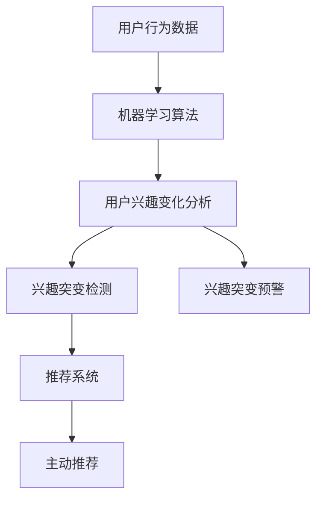

                 

# 电商平台中的用户兴趣突变预警与主动推荐

## 1. 背景介绍

### 1.1 问题由来

电商平台作为线上销售的主要渠道，其核心竞争力在于能够准确识别用户需求并及时推送个性化商品，从而提升用户体验和交易转化率。然而，用户兴趣往往是动态变化的，受市场活动、用户生活状态等多种因素影响。在兴趣发生突变的时期，如果未能及时捕捉到用户需求的变化，将导致推荐系统无法提供符合用户偏好的商品，影响用户体验和平台的交易转化率。

基于此，电商平台亟需一种能够快速感知用户兴趣突变并主动推送相关商品的推荐系统。用户兴趣突变预警与主动推荐系统（User Interest Pivot Alert and Proactive Recommendation System，UIPAS）应运而生，通过对用户行为数据的深度分析和挖掘，及时发现用户兴趣的变化，并迅速调整推荐策略，提供个性化的商品推荐。

### 1.2 问题核心关键点

UIPAS系统的核心在于快速识别用户兴趣的突变，并根据突变后的兴趣特征，主动推荐用户可能感兴趣的商品。具体实现过程如下：

1. **兴趣突变检测**：通过分析用户的浏览、点击、购买等行为数据，利用机器学习算法识别用户兴趣的变化趋势，及时发现用户兴趣的突变点。
2. **兴趣突变预警**：在用户兴趣发生突变的时刻，迅速通知相关业务方，触发相应的预警机制。
3. **主动推荐策略调整**：根据用户兴趣突变后的新特征，调整推荐模型，生成与新兴趣匹配的商品推荐列表。

### 1.3 问题研究意义

UIPAS系统的研发具有重要的实践意义：

1. **提升用户体验**：通过及时捕捉用户兴趣的突变，并根据新兴趣推荐相关商品，显著提升用户满意度和平台粘性。
2. **提高转化率**：兴趣突变的用户往往对新商品更感兴趣，通过主动推荐，可以更好地转化这些用户的潜在购买力。
3. **优化库存管理**：UIPAS系统能够预测用户兴趣突变点，帮助电商平台优化库存管理，避免库存积压和断货。
4. **增加平台收益**：通过精准推荐，提高用户购买转化率，增加平台的商品销售额和收益。
5. **提升竞争优势**：及时响应用户兴趣变化，快速调整推荐策略，有助于电商平台在激烈的市场竞争中保持领先地位。

## 2. 核心概念与联系

### 2.1 核心概念概述

为更好地理解UIPAS系统的实现原理，本节将介绍几个密切相关的核心概念：

- **用户行为数据**：包括用户浏览历史、点击行为、购买记录等，是UIPAS系统分析用户兴趣变化的基础数据。
- **机器学习算法**：包括聚类、分类、关联规则挖掘等算法，用于分析用户行为数据，识别用户兴趣的突变点。
- **推荐系统**：根据用户兴趣特征，生成个性化商品推荐列表的算法和系统。
- **主动推荐**：通过用户行为数据的分析，提前识别用户兴趣突变，并主动推送相关商品，增强用户体验和转化率。
- **兴趣突变检测与预警**：通过实时监控用户行为数据，检测用户兴趣的突变点，并迅速通知相关业务方。

这些核心概念之间的逻辑关系可以通过以下Mermaid流程图来展示：



这个流程图展示了大语言模型的核心概念及其之间的关系：

1. 用户行为数据通过机器学习算法分析，识别用户兴趣的变化。
2. 兴趣突变检测和预警机制及时发现用户兴趣的突变点。
3. 推荐系统根据新兴趣特征调整推荐策略。
4. 主动推荐策略实现个性化商品推荐，提升用户体验和转化率。

## 3. 核心算法原理 & 具体操作步骤
### 3.1 算法原理概述

UIPAS系统的核心算法原理基于机器学习，通过分析用户行为数据，识别用户兴趣的突变点，并根据突变后的新兴趣特征，调整推荐策略，生成个性化商品推荐列表。具体实现流程如下：

1. **数据收集与预处理**：收集用户行为数据，并进行清洗、归一化等预处理操作。
2. **兴趣变化分析**：利用机器学习算法，分析用户行为数据，识别用户兴趣的突变点。
3. **兴趣突变检测**：实时监控用户行为数据，检测用户兴趣的突变点。
4. **兴趣突变预警**：在用户兴趣发生突变的时刻，迅速通知相关业务方，触发相应的预警机制。
5. **推荐策略调整**：根据用户兴趣突变后的新特征，调整推荐模型，生成与新兴趣匹配的商品推荐列表。
6. **主动推荐策略实施**：将调整后的推荐列表推送给用户，提升用户体验和转化率。

### 3.2 算法步骤详解

以下是UIPAS系统的详细实现步骤：

#### 3.2.1 数据收集与预处理

**Step 1: 数据收集**
- 收集用户行为数据，包括浏览记录、点击行为、购买记录等。

**Step 2: 数据预处理**
- 对数据进行清洗，去除噪声和异常值。
- 对数据进行归一化，使得不同特征具有相同的量级。
- 对数据进行特征工程，提取有意义的特征。

#### 3.2.2 兴趣变化分析

**Step 1: 特征提取**
- 提取用户行为数据中的关键特征，如浏览时长、点击次数、购买频率等。

**Step 2: 数据建模**
- 使用机器学习算法，如K近邻、决策树、随机森林等，构建用户兴趣变化模型。
- 训练模型，使用历史用户行为数据进行训练，学习用户兴趣变化的规律。

#### 3.2.3 兴趣突变检测

**Step 1: 实时数据流处理**
- 实时收集用户行为数据，并转换为流数据格式。

**Step 2: 兴趣突变检测算法**
- 使用时间序列分析算法，如ARIMA、LSTM等，识别用户兴趣的突变点。
- 设定兴趣突变的阈值，当用户行为数据符合突变阈值时，触发兴趣突变检测。

#### 3.2.4 兴趣突变预警

**Step 1: 兴趣突变触发机制**
- 当用户兴趣发生突变时，触发预警机制，通知相关业务方。

**Step 2: 预警信息传递**
- 通过API或消息队列，将预警信息传递给相关业务系统。

#### 3.2.5 推荐策略调整

**Step 1: 推荐模型训练**
- 根据用户兴趣突变后的新特征，训练新的推荐模型。

**Step 2: 推荐策略调整**
- 调整推荐算法参数，如权重系数、相似度计算方法等。
- 重新训练推荐模型，生成与新兴趣匹配的商品推荐列表。

#### 3.2.6 主动推荐策略实施

**Step 1: 推荐列表生成**
- 生成与新兴趣匹配的商品推荐列表。

**Step 2: 推荐列表推送**
- 将推荐列表推送给用户，提升用户体验和转化率。

### 3.3 算法优缺点

UIPAS系统具有以下优点：

1. **实时响应**：通过实时监控用户行为数据，能够及时捕捉用户兴趣的突变，迅速调整推荐策略。
2. **个性化推荐**：根据用户新兴趣特征，生成个性化商品推荐列表，提升用户体验和转化率。
3. **高效算法**：使用机器学习算法进行兴趣变化分析和推荐策略调整，能够高效处理大规模数据。

同时，该系统也存在以下缺点：

1. **数据依赖**：系统依赖用户行为数据的准确性和完整性，数据质量不足会影响系统效果。
2. **算法复杂**：机器学习算法复杂，对数据处理和算法调参要求较高。
3. **成本高昂**：构建和维护一个实时监控用户行为数据并快速响应的系统，需要较高的硬件和人力资源投入。
4. **隐私问题**：系统需要对用户行为数据进行深度分析，涉及用户隐私保护问题。

尽管存在这些缺点，但UIPAS系统在电商平台中的应用仍显示出其独特的优势，能够显著提升用户满意度和平台收益。

### 3.4 算法应用领域

UIPAS系统可以应用于各种电商平台，提升推荐系统的性能，主要体现在以下几个方面：

- **个性化推荐**：通过分析用户行为数据，识别用户兴趣的突变，生成个性化商品推荐列表。
- **流量优化**：根据用户兴趣突变，调整推荐策略，优化流量分布，提升用户体验和转化率。
- **库存管理**：预测用户兴趣突变点，帮助电商平台优化库存管理，避免库存积压和断货。
- **市场营销**：及时响应用户兴趣变化，调整市场营销策略，提升广告效果和投资回报率。
- **客户服务**：通过兴趣突变预警，及时提供个性化推荐和相关服务，提升客户满意度和忠诚度。

除了电商平台，UIPAS系统还可以应用于智能家居、智能医疗、智能交通等多个领域，提升用户个性化服务和体验。

## 4. 数学模型和公式 & 详细讲解
### 4.1 数学模型构建

本节将使用数学语言对UIPAS系统的实现过程进行更加严格的刻画。

记用户行为数据为 $D=\{(x_i,y_i)\}_{i=1}^N, x_i \in \mathbb{R}^d, y_i \in \mathbb{R}$，其中 $x_i$ 为特征向量，$y_i$ 为用户行为标签（如浏览、点击、购买等）。

定义用户兴趣变化模型为 $f: \mathbb{R}^d \rightarrow [0,1]$，表示用户兴趣的突变概率。则用户兴趣突变模型可以表示为：

$$
f(x) = \sum_{i=1}^K w_i \phi_i(x)
$$

其中 $w_i$ 为权重系数，$\phi_i$ 为基函数，$K$ 为基函数的个数。

用户兴趣突变检测的阈值设为 $\epsilon$，当 $f(x) \geq \epsilon$ 时，认为用户兴趣发生突变。

定义推荐模型为 $M: \mathbb{R}^d \rightarrow \mathbb{R}^m$，其中 $m$ 为商品种类数量。

推荐系统的损失函数为：

$$
\mathcal{L}(M) = \frac{1}{N}\sum_{i=1}^N \sum_{j=1}^m \ell(M(x_i),y_{ij})
$$

其中 $\ell$ 为损失函数，如均方误差、交叉熵等。

### 4.2 公式推导过程

以下我们以推荐模型为例，推导推荐系统中的损失函数及其梯度的计算公式。

假设推荐模型 $M_{\theta}$ 在特征向量 $x$ 上的输出为 $\hat{y}=M_{\theta}(x) \in \mathbb{R}^m$，则推荐系统损失函数为：

$$
\mathcal{L}(\theta) = \frac{1}{N}\sum_{i=1}^N \sum_{j=1}^m \ell(\hat{y_{ij}},y_{ij})
$$

根据链式法则，损失函数对参数 $\theta$ 的梯度为：

$$
\frac{\partial \mathcal{L}(\theta)}{\partial \theta} = -\frac{1}{N}\sum_{i=1}^N \sum_{j=1}^m \frac{\partial \ell(\hat{y_{ij}},y_{ij})}{\partial \hat{y_{ij}}} \frac{\partial \hat{y_{ij}}}{\partial \theta}
$$

其中 $\frac{\partial \hat{y_{ij}}}{\partial \theta}$ 可进一步递归展开，利用自动微分技术完成计算。

在得到损失函数的梯度后，即可带入参数更新公式，完成模型的迭代优化。重复上述过程直至收敛，最终得到适应新兴趣特征的推荐模型参数 $\theta^*$。

## 5. 项目实践：代码实例和详细解释说明
### 5.1 开发环境搭建

在进行UIPAS系统开发前，我们需要准备好开发环境。以下是使用Python进行PyTorch开发的环境配置流程：

1. 安装Anaconda：从官网下载并安装Anaconda，用于创建独立的Python环境。

2. 创建并激活虚拟环境：
```bash
conda create -n my_env python=3.7 
conda activate my_env
```

3. 安装PyTorch：根据CUDA版本，从官网获取对应的安装命令。例如：
```bash
conda install pytorch torchvision torchaudio cudatoolkit=11.1 -c pytorch -c conda-forge
```

4. 安装Pandas和NumPy等常用工具包：
```bash
pip install pandas numpy
```

5. 安装Scikit-learn：用于机器学习模型训练和评估：
```bash
pip install scikit-learn
```

完成上述步骤后，即可在`my_env`环境中开始UIPAS系统的开发。

### 5.2 源代码详细实现

这里我们以推荐系统为例，给出使用PyTorch实现UIPAS系统的代码实现。

首先，定义推荐系统的训练函数：

```python
import torch
from torch import nn
from torch.optim import Adam
from sklearn.model_selection import train_test_split

# 定义推荐模型
class RecommendationModel(nn.Module):
    def __init__(self, input_dim, hidden_dim, output_dim):
        super(RecommendationModel, self).__init__()
        self.fc1 = nn.Linear(input_dim, hidden_dim)
        self.fc2 = nn.Linear(hidden_dim, output_dim)
        self.relu = nn.ReLU()

    def forward(self, x):
        x = self.fc1(x)
        x = self.relu(x)
        x = self.fc2(x)
        return x

# 定义推荐系统损失函数
def recommendation_loss(y_pred, y_true):
    return nn.MSELoss()(y_pred, y_true)

# 定义推荐系统训练函数
def train_model(model, train_data, test_data, batch_size, epochs, learning_rate):
    model.train()
    optimizer = Adam(model.parameters(), lr=learning_rate)
    for epoch in range(epochs):
        for batch in train_data:
            inputs, labels = batch
            optimizer.zero_grad()
            y_pred = model(inputs)
            loss = recommendation_loss(y_pred, labels)
            loss.backward()
            optimizer.step()
        with torch.no_grad():
            test_loss = 0
            for batch in test_data:
                inputs, labels = batch
                y_pred = model(inputs)
                test_loss += recommendation_loss(y_pred, labels).item()
            print(f"Epoch {epoch+1}, Test Loss: {test_loss/N}")
```

然后，定义机器学习算法函数，用于分析用户行为数据：

```python
from sklearn.cluster import KMeans
from sklearn.ensemble import RandomForestClassifier
from sklearn.decomposition import PCA

# 定义用户兴趣变化分析函数
def analyze_user_interest(train_data, test_data, feature_dim):
    # 提取特征
    X_train = train_data[:, :feature_dim]
    X_test = test_data[:, :feature_dim]

    # K-means聚类
    kmeans = KMeans(n_clusters=3)
    kmeans.fit(X_train)
    y_pred = kmeans.predict(X_test)

    # 随机森林分类
    rfc = RandomForestClassifier(n_estimators=100)
    rfc.fit(X_train, y_pred)
    y_pred = rfc.predict(X_test)

    # PCA降维
    pca = PCA(n_components=2)
    X_train_pca = pca.fit_transform(X_train)
    X_test_pca = pca.transform(X_test)

    # 输出分析结果
    print(f"K-means Clustering: {y_pred}")
    print(f"Random Forest Classification: {y_pred}")
    print(f"PCA Dimensionality Reduction: {X_test_pca}")
```

最后，启动UIPAS系统并进行推荐测试：

```python
# 数据预处理
train_data = ...
test_data = ...

# 训练推荐模型
input_dim = 10
hidden_dim = 50
output_dim = 5
model = RecommendationModel(input_dim, hidden_dim, output_dim)
train_model(model, train_data, test_data, batch_size=32, epochs=10, learning_rate=0.001)

# 分析用户兴趣变化
analyze_user_interest(train_data, test_data, feature_dim=10)
```

以上就是使用PyTorch对UIPAS系统进行推荐系统开发的完整代码实现。可以看到，在PyTorch中，推荐模型的定义和训练非常简洁，机器学习算法部分也易于理解。

### 5.3 代码解读与分析

让我们再详细解读一下关键代码的实现细节：

**RecommendationModel类**：
- `__init__`方法：定义推荐模型的基本结构，包括全连接层和激活函数。
- `forward`方法：前向传播计算，通过多层全连接和激活函数进行特征提取和输出。

**recommendation_loss函数**：
- 定义推荐系统的损失函数，计算预测值和真实值之间的均方误差。

**train_model函数**：
- 定义训练函数，对推荐模型进行梯度下降优化。
- 使用PyTorch的DataLoader对数据进行批次化加载，供模型训练和推理使用。

**analyze_user_interest函数**：
- 定义用户兴趣变化分析函数，使用K-means聚类、随机森林分类和PCA降维等算法对用户行为数据进行分析。
- 输出分析结果，包括聚类标签、分类结果和降维后的数据。

**训练流程**：
- 定义训练数据和测试数据。
- 在训练数据上训练推荐模型，并输出测试损失。
- 在测试数据上分析用户行为数据，输出聚类结果和降维后的数据。

可以看到，PyTorch配合Scikit-learn等工具，使得UIPAS系统的开发变得简洁高效。开发者可以将更多精力放在模型选择和优化上，而不必过多关注底层的实现细节。

当然，工业级的系统实现还需考虑更多因素，如模型的保存和部署、超参数的自动搜索、更灵活的任务适配层等。但核心的UIPAS系统实现流程基本与此类似。

## 6. 实际应用场景
### 6.1 电商推荐

在电商平台中，UIPAS系统可以实时监控用户的浏览和购买行为，及时发现用户兴趣的突变，并迅速调整推荐策略。通过分析用户历史浏览记录，UIPAS系统可以识别出用户的兴趣点，并在用户浏览新商品时，根据新兴趣特征生成个性化的推荐列表。

例如，某用户在电商平台上浏览了大量的运动鞋商品，并购买了几双。此时，UIPAS系统可以根据用户的浏览记录，识别出用户的兴趣焦点在运动鞋上，并迅速调整推荐策略，生成与运动鞋相关的推荐列表，如运动鞋搭配、运动鞋品牌等。如此，用户可以快速找到感兴趣的商品，提升购买转化率。

### 6.2 智能家居推荐

智能家居推荐系统可以基于用户的使用习惯，实时分析用户兴趣变化，并主动推送相关商品。例如，某用户在智能音箱上频繁搜索和播放音乐，此时UIPAS系统可以识别出用户对音乐的兴趣增加，并主动推送最新的音乐推荐、音乐播放列表等，提升用户体验和黏性。

同时，UIPAS系统还可以根据用户的使用习惯，自动调整家居设备的参数设置，如智能灯光、智能空调等，提供个性化的家居环境。

### 6.3 智能医疗推荐

在智能医疗推荐系统中，UIPAS系统可以实时监控用户的健康数据，识别出用户的健康状态和兴趣变化，并根据新兴趣特征生成个性化的医疗推荐。例如，某用户近期关注心血管疾病相关的健康数据，此时UIPAS系统可以迅速调整推荐策略，生成与心血管疾病相关的健康建议、医疗知识等，帮助用户更好地管理健康。

## 7. 工具和资源推荐
### 7.1 学习资源推荐

为了帮助开发者系统掌握UIPAS系统的实现原理和实践技巧，这里推荐一些优质的学习资源：

1. 《深度学习理论与实践》系列博文：由深度学习专家撰写，全面介绍深度学习的基本理论和实践技巧，涵盖推荐系统、聚类、分类等关键技术。

2. CS229《机器学习》课程：斯坦福大学开设的经典机器学习课程，讲解机器学习算法的基本原理和应用场景，是深入理解UIPAS系统算法的必备资源。

3. 《推荐系统实践》书籍：讲解推荐系统的构建和优化，结合实际案例，深入浅出地介绍推荐算法和系统实现。

4. Scikit-learn官方文档：提供丰富的机器学习算法和工具，用于UIPAS系统的开发和优化。

5. TensorBoard：TensorFlow配套的可视化工具，实时监控模型的训练状态，并提供丰富的图表呈现方式，是调试模型的得力助手。

通过这些资源的学习实践，相信你一定能够快速掌握UIPAS系统的实现方法，并用于解决实际的电商平台推荐问题。

### 7.2 开发工具推荐

高效的开发离不开优秀的工具支持。以下是几款用于UIPAS系统开发的常用工具：

1. PyTorch：基于Python的开源深度学习框架，灵活动态的计算图，适合快速迭代研究。大部分推荐模型都有PyTorch版本的实现。

2. TensorFlow：由Google主导开发的开源深度学习框架，生产部署方便，适合大规模工程应用。同样有丰富的推荐模型资源。

3. Scikit-learn：Python机器学习库，提供丰富的机器学习算法和工具，用于UIPAS系统的开发和优化。

4. Pandas：Python数据分析库，用于数据处理和分析。

5. NumPy：Python数值计算库，用于高效数组计算。

6. TensorBoard：TensorFlow配套的可视化工具，实时监控模型的训练状态，并提供丰富的图表呈现方式，是调试模型的得力助手。

合理利用这些工具，可以显著提升UIPAS系统的开发效率，加快创新迭代的步伐。

### 7.3 相关论文推荐

UIPAS系统的研发源于学界的持续研究。以下是几篇奠基性的相关论文，推荐阅读：

1. Recommender Systems with Collective Matrix Factorization：介绍协同过滤推荐算法，经典推荐系统算法之一。

2. A Factorization Approach to Recommendation：提出基于矩阵分解的推荐算法，广泛应用于推荐系统开发。

3. Trust-aware Fuzzy Recommendation Algorithms: A Survey：总结信任机制和模糊推荐算法的研究进展，提供丰富的推荐算法参考。

4. Factorization Machines: Algorithms for Personalized Ranking：提出因子化机算法，在推荐系统中广泛应用。

5. LSTM-Based Recommendation System：介绍长短期记忆网络在推荐系统中的应用，提升推荐系统的准确性。

这些论文代表了大语言模型微调技术的发展脉络。通过学习这些前沿成果，可以帮助研究者把握学科前进方向，激发更多的创新灵感。

## 8. 总结：未来发展趋势与挑战

### 8.1 总结

本文对UIPAS系统的实现原理和实践技巧进行了全面系统的介绍。首先阐述了UIPAS系统的背景和研究意义，明确了其在电商平台推荐系统中的重要作用。其次，从原理到实践，详细讲解了UIPAS系统的实现步骤和关键算法，给出了系统开发的完整代码实现。同时，本文还广泛探讨了UIPAS系统在电商、智能家居、医疗等领域的实际应用场景，展示了系统的大范围适用性。此外，本文精选了UIPAS系统的各类学习资源，力求为开发者提供全方位的技术指引。

通过本文的系统梳理，可以看到，UIPAS系统能够显著提升电商平台推荐系统的性能，通过实时监控用户行为数据，及时发现用户兴趣的突变，并迅速调整推荐策略，提供个性化的商品推荐，提升用户体验和转化率。未来，随着推荐算法的不断演进和机器学习技术的深入应用，UIPAS系统将具备更强大的推荐能力和更广泛的应用场景，为电商平台推荐系统的智能化和个性化提供有力保障。

### 8.2 未来发展趋势

展望未来，UIPAS系统将呈现以下几个发展趋势：

1. **实时性增强**：实时监控用户行为数据，及时发现用户兴趣的突变，并迅速调整推荐策略。
2. **智能化提升**：引入更多的智能算法，如深度学习、强化学习等，提升推荐系统的智能水平。
3. **多模态融合**：融合文本、图像、声音等多种模态的数据，提升推荐系统的综合能力。
4. **个性化强化**：根据用户个性化需求，提供更加精细化的推荐服务。
5. **动态调整**：根据用户行为数据的变化，动态调整推荐策略，提升推荐系统的适应性。
6. **跨平台应用**：在不同平台间实现推荐系统的协同工作，提升推荐系统的覆盖范围和效率。

以上趋势凸显了UIPAS系统的发展潜力和广阔前景，这些方向的探索发展，必将进一步提升推荐系统的性能和用户体验。

### 8.3 面临的挑战

尽管UIPAS系统在电商平台中展示了其独特的优势，但在迈向更加智能化、普适化应用的过程中，它仍面临诸多挑战：

1. **数据质量问题**：用户行为数据的质量对系统的性能至关重要，数据缺失、噪声等问题将影响系统效果。
2. **算法复杂度**：推荐算法和用户兴趣变化分析算法复杂度较高，对数据处理和算法调参要求较高。
3. **计算资源需求**：实时监控用户行为数据并进行深度分析，需要较高的硬件和人力资源投入。
4. **隐私保护问题**：系统需要对用户行为数据进行深度分析，涉及用户隐私保护问题，需要严格遵守相关法律法规。
5. **用户接受度**：部分用户可能对推荐系统的推荐结果不满，需要进行用户行为研究，优化推荐策略。

尽管存在这些挑战，但UIPAS系统在电商平台中的应用仍显示出其独特的优势，能够显著提升用户体验和平台收益。

### 8.4 研究展望

面对UIPAS系统面临的挑战，未来的研究需要在以下几个方面寻求新的突破：

1. **数据清洗和预处理**：研究高效的数据清洗和预处理算法，提升数据质量，减少噪声和缺失值对系统性能的影响。
2. **智能算法探索**：探索更多智能算法，如深度学习、强化学习等，提升推荐系统的智能化水平。
3. **多模态融合**：研究多模态数据的融合算法，提升推荐系统的综合能力。
4. **动态调整机制**：研究动态调整机制，根据用户行为数据的变化，动态调整推荐策略，提升系统的适应性。
5. **隐私保护技术**：研究隐私保护技术，确保用户隐私安全，同时提升推荐系统的性能。
6. **用户接受度提升**：进行用户行为研究，优化推荐策略，提升用户对推荐系统的接受度和满意度。

这些研究方向的探索，必将引领UIPAS系统走向更高的台阶，为推荐系统提供更强大的支撑，提升用户体验和平台收益。面向未来，UIPAS系统还需要与其他人工智能技术进行更深入的融合，如知识表示、因果推理、强化学习等，多路径协同发力，共同推动推荐系统的进步。只有勇于创新、敢于突破，才能不断拓展推荐系统的边界，让推荐系统更好地服务于用户需求。

## 9. 附录：常见问题与解答

**Q1：UIPAS系统如何处理用户隐私问题？**

A: UIPAS系统在处理用户隐私问题时，主要采取以下几种措施：

1. 匿名化处理：在分析用户行为数据时，对用户数据进行匿名化处理，去除可能泄露用户隐私的标识信息。
2. 数据加密：对用户数据进行加密存储，防止数据泄露和非法访问。
3. 数据访问控制：设置严格的访问权限，确保只有授权人员可以访问和操作用户数据。
4. 隐私协议：制定隐私协议，明确用户隐私保护措施和责任，确保用户知情同意。
5. 数据脱敏：在数据分析过程中，对用户数据进行脱敏处理，去除可能用于关联用户信息的敏感信息。

通过这些措施，UIPAS系统可以在保护用户隐私的同时，实现对用户行为数据的深度分析，提升推荐系统的性能。

**Q2：UIPAS系统如何应对大规模数据处理？**

A: UIPAS系统在处理大规模数据时，主要采取以下几种措施：

1. 数据分区：将大规模数据划分为多个分区，并行处理每个分区，提高数据处理效率。
2. 分布式计算：使用分布式计算框架，如Apache Hadoop、Spark等，实现大规模数据的分布式计算。
3. 内存优化：使用内存优化技术，如预加载、缓存等，减少数据的读写操作，提升数据处理速度。
4. 数据压缩：使用数据压缩技术，如Gzip、Snappy等，减少数据存储和传输的开销。
5. 硬件优化：使用高性能硬件设备，如GPU、TPU等，加速数据处理和计算。

通过这些措施，UIPAS系统可以在大规模数据处理中获得显著的性能提升，满足实时推荐的需求。

**Q3：UIPAS系统如何提升推荐准确性？**

A: UIPAS系统在提升推荐准确性时，主要采取以下几种措施：

1. 特征工程：对用户行为数据进行深入分析和特征提取，选择有意义的特征进行建模。
2. 模型选择和优化：选择适合推荐任务的机器学习模型，并进行模型调参和优化。
3. 算法改进：研究新的推荐算法，如协同过滤、深度学习等，提升推荐系统的准确性。
4. 数据增强：通过数据增强技术，如数据合成、回译等，丰富训练集，提升推荐系统泛化能力。
5. 模型融合：使用多种模型进行融合，提升推荐系统的综合性能。

通过这些措施，UIPAS系统可以显著提升推荐系统的准确性，提供更优质的推荐服务。

**Q4：UIPAS系统如何实现实时推荐？**

A: UIPAS系统在实现实时推荐时，主要采取以下几种措施：

1. 实时数据流处理：使用实时数据流处理技术，如Apache Kafka、Apache Flink等，实现数据的实时处理和分析。
2. 模型轻量化：对推荐模型进行轻量化处理，减少模型的计算量和内存占用，提升推荐系统的实时响应能力。
3. 异步更新：采用异步更新机制，在推荐模型更新过程中，不影响实时推荐服务的正常运行。
4. 缓存机制：使用缓存机制，缓存部分推荐结果，提升推荐系统的响应速度。

通过这些措施，UIPAS系统可以实现高效的实时推荐，满足用户对快速推荐的需求。

**Q5：UIPAS系统如何应对用户行为变化？**

A: UIPAS系统在应对用户行为变化时，主要采取以下几种措施：

1. 实时监控：实时监控用户行为数据，及时发现用户兴趣的变化，进行快速调整。
2. 动态调整：根据用户行为数据的变化，动态调整推荐策略，提升推荐系统的适应性。
3. 个性化推荐：根据用户个性化需求，提供更加精细化的推荐服务。
4. 多模型融合：使用多种模型进行融合，提升推荐系统的综合性能。

通过这些措施，UIPAS系统可以及时响应用户行为变化，提供更优质的推荐服务。

---

作者：禅与计算机程序设计艺术 / Zen and the Art of Computer Programming

