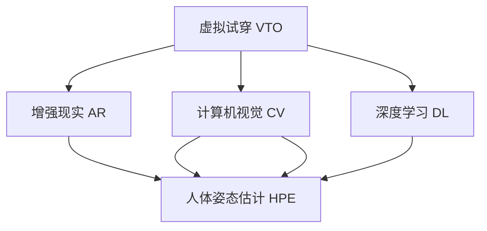
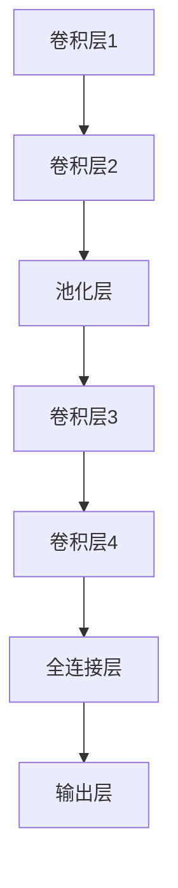
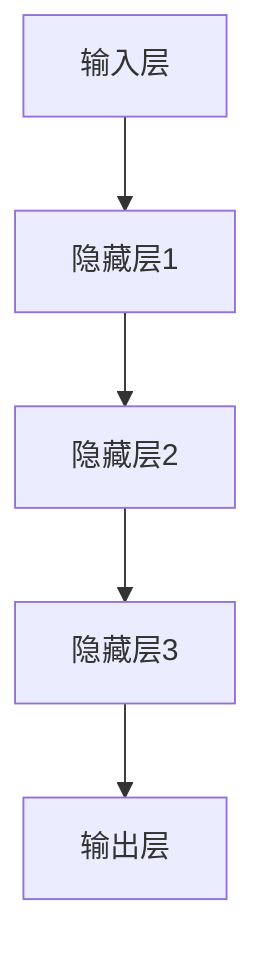
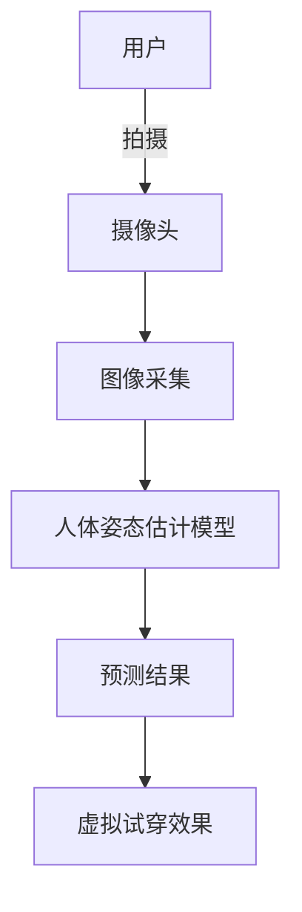
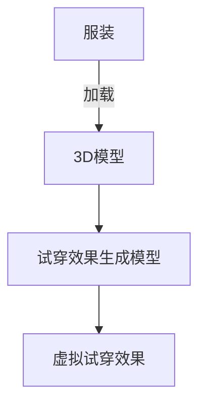

                 

# 电商平台中的虚拟试穿技术

> 关键词：虚拟试穿,电商平台,人工智能,增强现实,计算机视觉,深度学习,人体姿态估计,深度神经网络

## 1. 背景介绍

随着电商平台的快速发展，用户对购物体验的要求也越来越高。传统的二维图片浏览和文字描述已经难以满足用户的深度体验需求。虚拟试穿技术应运而生，通过在用户浏览产品时展示3D模型试穿效果，极大提升了用户的购物体验和购买转化率。虚拟试穿技术综合应用了计算机视觉、增强现实(AR)和深度学习等前沿技术，构建了一个沉浸式、互动式的购物场景。

虚拟试穿技术已经成为电商平台在激烈竞争中脱颖而出的重要手段。商家可以利用虚拟试穿提升用户体验，减少退换货，增加销售额。但虚拟试穿技术的应用，不仅涉及复杂的技术方案，还需要高质量的硬件设备。如何高效、稳定地部署虚拟试穿系统，成为电商平台关注的重点。

本文将从虚拟试穿技术的核心概念、实现原理、代码实现和应用前景等方面，全面系统地介绍电商平台中虚拟试穿技术的设计与实现。希望读者能够深入理解虚拟试穿的核心技术，掌握关键算法的实现细节，并思考如何将其应用于更多电商场景中。

## 2. 核心概念与联系

### 2.1 核心概念概述

为更好地理解虚拟试穿技术，本节将介绍几个密切相关的核心概念：

- 虚拟试穿(Virtual Try-On, VTO)：在电商平台中，通过3D渲染或增强现实技术，让用户能在产品页面上直接试穿服装、配饰、眼镜等商品，提升用户体验和购买转化率。
- 增强现实(AR)：通过在用户现实环境中叠加虚拟信息，如虚拟试穿效果、商品详情等，增强用户对商品的直观感受。
- 计算机视觉(Computer Vision)：应用图像识别、物体检测、人体姿态估计等技术，对真实场景中的物品和人物进行理解和分析。
- 深度学习(Deep Learning)：通过多层神经网络对大量数据进行训练，自动提取和理解复杂的特征。
- 人体姿态估计(Human Pose Estimation)：通过深度学习技术，对图像或视频中的人物姿态进行估计，为虚拟试穿提供关键的用户位置信息。

这些核心概念之间的逻辑关系可以通过以下Mermaid流程图来展示：



这个流程图展示了几大核心概念及其之间的关系：

1. 虚拟试穿通过增强现实技术，叠加虚拟试穿效果，提供沉浸式体验。
2. 增强现实技术依赖计算机视觉技术，对用户和商品进行理解分析。
3. 计算机视觉技术需要深度学习技术，提取复杂特征并实现高效的物体检测和人脸识别。
4. 人体姿态估计是虚拟试穿技术的关键，通过预测人体姿态，为虚拟试穿提供准确的用户位置信息。

## 3. 核心算法原理 & 具体操作步骤
### 3.1 算法原理概述

虚拟试穿技术主要包括虚拟试穿展示和虚拟试穿体验两个环节。其核心算法流程如下：

1. **虚拟试穿展示**：利用计算机视觉技术和增强现实技术，在产品页面上展示3D试穿效果。
2. **虚拟试穿体验**：通过深度学习技术和人体姿态估计技术，实时预测用户试穿效果，生成虚拟试穿效果。

### 3.2 算法步骤详解

#### 3.2.1 虚拟试穿展示

虚拟试穿展示主要分为数据收集和3D模型渲染两个步骤：

1. **数据收集**：收集商品的高清图片和视频，以及不同尺码和款式的试穿数据。需要特别注意不同用户、不同拍摄角度、不同光照条件下的数据收集，以提高虚拟试穿的准确性和可信度。
2. **3D模型渲染**：将商品的高清图片和视频导入3D建模软件，生成准确的3D模型。3D模型需要准确还原商品的外观和尺寸，便于用户进行虚拟试穿。

#### 3.2.2 虚拟试穿体验

虚拟试穿体验主要分为人体姿态估计和试穿效果生成两个步骤：

1. **人体姿态估计**：通过摄像头拍摄用户当前的人体图像，并利用深度学习模型，实时预测人体姿态。常用的姿态估计模型包括OpenPose、MediaPipe等。
2. **试穿效果生成**：利用深度学习模型，根据预测的人体姿态，生成虚拟试穿效果。常用的试穿效果生成模型包括DeepFit、FITNet等。

### 3.3 算法优缺点

虚拟试穿技术具有以下优点：
1. 提升用户体验：虚拟试穿技术将2D图片展示升级为3D交互体验，显著提升用户的购物体验和满意度。
2. 减少退换货：通过虚拟试穿，用户可以提前预览商品试穿效果，减少因不合适而产生的退换货。
3. 增加销售额：虚拟试穿能直接展示商品的实际效果，增加用户的购买意愿和转化率。

同时，该技术也存在一些局限性：
1. 技术复杂度高：虚拟试穿涉及多项前沿技术，需要较强的硬件设备和复杂的软件系统支持。
2. 数据需求量大：虚拟试穿需要大量的商品数据和试穿数据，对数据收集和存储提出了较高要求。
3. 性能要求高：虚拟试穿需要实时处理和渲染，对计算机硬件性能要求较高。
4. 用户体验不稳定：不同用户、不同光线条件下的试穿效果可能存在差异，影响用户体验。

尽管存在这些局限性，但虚拟试穿技术的应用潜力巨大，已经成为电商平台提升竞争力的重要手段。未来相关研究的重点在于如何进一步优化算法，提升虚拟试穿的准确性和稳定性，降低技术门槛和数据需求，提升用户体验。

### 3.4 算法应用领域

虚拟试穿技术已经在多个电商领域得到应用，例如：

- 服装行业：用户可以在服装页面上直接试穿不同尺码和款式的服装，提升购物体验。
- 配饰行业：用户可以试戴各种风格的配饰，如帽子、眼镜、项链等，快速找到适合的款式。
- 鞋履行业：用户可以试穿不同尺码和款式的鞋子，避免因不合适而产生退换货。
- 化妆品行业：用户可以试用不同色号的化妆品，了解其效果，减少购买风险。
- 珠宝行业：用户可以试戴各种款式的珠宝，如戒指、项链、耳环等，提升购买信心。

除了上述这些经典应用外，虚拟试穿技术还被创新性地应用于更多场景中，如虚拟试穿镜、虚拟试穿摊位等，为电商平台的业务创新提供了新的思路。

## 4. 数学模型和公式 & 详细讲解 & 举例说明
### 4.1 数学模型构建

虚拟试穿技术涉及多个领域的数学模型，本节将详细介绍其中的关键模型：

#### 4.1.1 人体姿态估计模型

人体姿态估计是虚拟试穿技术的关键，常用的数学模型包括基于关键点的姿态估计模型和基于深度学习的姿态估计模型。这里以基于深度学习的姿态估计模型为例，介绍其基本原理和数学模型。

假设人体图像中包含 $N$ 个关键点，其位置坐标为 $\mathbf{p}_i=(x_i,y_i)$，$i=1,...,N$。人体姿态估计模型可以表示为：

$$
\mathbf{p}_i = f_\theta(\mathbf{I}_i)
$$

其中 $\mathbf{I}_i$ 为第 $i$ 个关键点的像素信息，$f_\theta$ 为深度学习模型。

深度学习模型通常使用卷积神经网络(CNN)或循环神经网络(RNN)，其基本结构如图：



在训练过程中，模型通过反向传播算法最小化损失函数 $\mathcal{L}$，其目标是最小化预测位置 $\mathbf{p}_i$ 和真实位置 $\mathbf{p}_i^*$ 之间的差异。常用的损失函数包括均方误差损失和交叉熵损失。

$$
\mathcal{L} = \frac{1}{N} \sum_{i=1}^N \| \mathbf{p}_i - \mathbf{p}_i^* \|^2
$$

#### 4.1.2 试穿效果生成模型

试穿效果生成模型通过深度学习模型，将人体姿态与3D模型进行匹配，生成虚拟试穿效果。常用的模型包括基于稀疏姿态匹配的深度神经网络和基于稠密姿态匹配的深度神经网络。

以基于稠密姿态匹配的深度神经网络为例，其基本结构如图：


在训练过程中，模型通过最小化损失函数 $\mathcal{L}$ 来优化网络参数，其目标是最小化预测的试穿效果与真实效果之间的差异。常用的损失函数包括均方误差损失和交叉熵损失。

$$
\mathcal{L} = \frac{1}{N} \sum_{i=1}^N \| \mathbf{v}_i - \mathbf{v}_i^* \|^2
$$

其中 $\mathbf{v}_i$ 为第 $i$ 个关键点的试穿效果，$\mathbf{v}_i^*$ 为真实试穿效果。

### 4.2 公式推导过程

#### 4.2.1 人体姿态估计模型的推导

人体姿态估计模型的推导主要基于卷积神经网络的反向传播算法。假设使用一个简单的全连接神经网络，其中包含 $K$ 个隐藏层，输入层包含 $N$ 个关键点，输出层包含 $M$ 个关键点的坐标。网络结构如图：



设隐藏层和输出层的激活函数为 $\sigma$，网络的损失函数为均方误差损失函数，则目标是最小化网络输出和真实位置的差异：

$$
\mathcal{L} = \frac{1}{N} \sum_{i=1}^N \| \mathbf{p}_i - \mathbf{p}_i^* \|^2
$$

根据反向传播算法，计算隐藏层和输出层的梯度，并更新网络参数：

$$
\frac{\partial \mathcal{L}}{\partial \mathbf{w}_l} = \frac{1}{N} \sum_{i=1}^N \frac{\partial \mathcal{L}}{\partial \mathbf{p}_i} \cdot \frac{\partial \mathbf{p}_i}{\partial \mathbf{z}_l} \cdot \frac{\partial \mathbf{z}_l}{\partial \mathbf{w}_l}
$$

其中 $\mathbf{z}_l$ 为隐藏层的激活向量，$\mathbf{w}_l$ 为连接层和激活函数的权重矩阵。

#### 4.2.2 试穿效果生成模型的推导

试穿效果生成模型的推导与人体姿态估计模型的推导类似。假设使用一个简单的全连接神经网络，其中包含 $K$ 个隐藏层，输入层包含 $N$ 个关键点，输出层包含 $M$ 个关键点的试穿效果。网络结构如图：


设隐藏层和输出层的激活函数为 $\sigma$，网络的损失函数为均方误差损失函数，则目标是最小化网络输出和真实效果的差异：

$$
\mathcal{L} = \frac{1}{N} \sum_{i=1}^N \| \mathbf{v}_i - \mathbf{v}_i^* \|^2
$$

根据反向传播算法，计算隐藏层和输出层的梯度，并更新网络参数：

$$
\frac{\partial \mathcal{L}}{\partial \mathbf{w}_l} = \frac{1}{N} \sum_{i=1}^N \frac{\partial \mathcal{L}}{\partial \mathbf{v}_i} \cdot \frac{\partial \mathbf{v}_i}{\partial \mathbf{z}_l} \cdot \frac{\partial \mathbf{z}_l}{\partial \mathbf{w}_l}
$$

其中 $\mathbf{z}_l$ 为隐藏层的激活向量，$\mathbf{w}_l$ 为连接层和激活函数的权重矩阵。

### 4.3 案例分析与讲解

本节以虚拟试穿系统中的关键技术为例，详细讲解其具体应用。

#### 4.3.1 人体姿态估计

假设电商平台收集了一组用户试穿服装的图片，如图：



在用户试穿服装时，电商平台通过摄像头采集其图像，并将图像输入到人体姿态估计模型中。模型首先提取图像中的关键点，并进行姿态估计。根据预测的人体姿态，电商平台可以计算出用户身体的各个部位（如肩膀、腰部、腿部等）的位置，从而生成虚拟试穿效果。

#### 4.3.2 试穿效果生成

假设电商平台有一组服装的3D模型，如图：



在人体姿态估计完成后，电商平台将用户的人体姿态信息输入到试穿效果生成模型中。模型根据用户姿态，计算出每个关键点与服装的对应位置，从而生成虚拟试穿效果。

## 5. 项目实践：代码实例和详细解释说明
### 5.1 开发环境搭建

在进行虚拟试穿系统的开发前，我们需要准备好开发环境。以下是使用Python进行TensorFlow开发的简单环境配置流程：

1. 安装Anaconda：从官网下载并安装Anaconda，用于创建独立的Python环境。

2. 创建并激活虚拟环境：
```bash
conda create -n tf-env python=3.8 
conda activate tf-env
```

3. 安装TensorFlow：从官网获取最新的安装命令。例如：
```bash
conda install tensorflow -c pytorch -c conda-forge
```

4. 安装TensorBoard：
```bash
pip install tensorboard
```

5. 安装相关的第三方库：
```bash
pip install numpy scipy matplotlib OpenCV
```

完成上述步骤后，即可在`tf-env`环境中开始开发。

### 5.2 源代码详细实现

下面以虚拟试穿系统的关键技术——人体姿态估计为例，给出TensorFlow的代码实现。

首先，定义人体姿态估计模型的超参数和网络结构：

```python
import tensorflow as tf
from tensorflow.keras.layers import Input, Conv2D, MaxPooling2D, UpSampling2D, concatenate
from tensorflow.keras.models import Model

# 定义输入层
input_layer = Input(shape=(256, 256, 3))

# 定义卷积层和池化层
conv1 = Conv2D(64, (3, 3), padding='same', activation='relu')(input_layer)
pool1 = MaxPooling2D((2, 2))(conv1)

conv2 = Conv2D(128, (3, 3), padding='same', activation='relu')(pool1)
pool2 = MaxPooling2D((2, 2))(conv2)

conv3 = Conv2D(256, (3, 3), padding='same', activation='relu')(pool2)
pool3 = MaxPooling2D((2, 2))(conv3)

conv4 = Conv2D(512, (3, 3), padding='same', activation='relu')(pool3)
pool4 = MaxPooling2D((2, 2))(conv4)

conv5 = Conv2D(1024, (3, 3), padding='same', activation='relu')(pool4)
pool5 = MaxPooling2D((2, 2))(conv5)

# 定义反卷积层和上采样层
up6 = UpSampling2D((2, 2))(conv5)
up7 = concatenate([up6, conv4], axis=-1)
conv6 = Conv2D(512, (3, 3), padding='same', activation='relu')(up7)
up8 = UpSampling2D((2, 2))(conv6)
up9 = concatenate([up8, conv3], axis=-1)
conv7 = Conv2D(256, (3, 3), padding='same', activation='relu')(up9)
up10 = UpSampling2D((2, 2))(conv7)
up11 = concatenate([up10, conv2], axis=-1)
conv8 = Conv2D(128, (3, 3), padding='same', activation='relu')(up11)
up12 = UpSampling2D((2, 2))(conv8)
up13 = concatenate([up12, conv1], axis=-1)
conv9 = Conv2D(64, (3, 3), padding='same', activation='relu')(up13)
output_layer = Conv2D(2, (1, 1), activation='linear')(conv9)

# 定义模型
model = Model(inputs=input_layer, outputs=output_layer)

# 编译模型
model.compile(optimizer=tf.keras.optimizers.Adam(learning_rate=1e-4), loss='mse')
```

然后，加载训练数据和评估数据：

```python
# 加载训练数据
train_dataset = ...

# 加载评估数据
eval_dataset = ...
```

接下来，定义训练和评估函数：

```python
def train_step(model, data):
    with tf.GradientTape() as tape:
        predictions = model(data)
        loss = tf.losses.mean_squared_error(data.labels, predictions)
    grads = tape.gradient(loss, model.trainable_variables)
    model.optimizer.apply_gradients(zip(grads, model.trainable_variables))

def evaluate(model, data):
    predictions = model(data)
    loss = tf.losses.mean_squared_error(data.labels, predictions)
    return loss.numpy()

# 训练模型
epochs = 100
batch_size = 32
train_losses = []
eval_losses = []

for epoch in range(epochs):
    train_loss = 0
    for i in range(0, len(train_dataset), batch_size):
        train_step(model, train_dataset[i:i+batch_size])
        train_loss += train_losses[i:i+batch_size]
    train_loss = train_loss / (len(train_dataset) // batch_size)
    train_losses.append(train_loss)
    eval_loss = evaluate(model, eval_dataset)
    eval_losses.append(eval_loss)
    print(f'Epoch {epoch+1}, train loss: {train_loss:.3f}, eval loss: {eval_loss:.3f}')
```

最后，运行训练过程并在测试集上评估：

```python
# 运行训练过程
...

# 在测试集上评估模型
test_dataset = ...
test_loss = evaluate(model, test_dataset)
print(f'Test loss: {test_loss:.3f}')
```

以上就是使用TensorFlow对虚拟试穿系统进行开发的完整代码实现。可以看到，TensorFlow提供了便捷的Keras API，使得深度学习模型的实现和训练过程变得简单高效。

### 5.3 代码解读与分析

让我们再详细解读一下关键代码的实现细节：

**人体姿态估计模型**：
- 定义输入层、卷积层、池化层、反卷积层和上采样层，并使用全连接层生成输出。
- 网络结构采用经典的U-Net结构，前半部分通过多层卷积和池化，逐渐提取特征；后半部分通过多层上采样和反卷积，还原特征。
- 使用均方误差损失函数作为训练目标，优化网络参数。

**训练和评估函数**：
- 定义训练步骤，包括前向传播、反向传播和参数更新。
- 定义评估步骤，计算损失函数并返回评估结果。
- 在训练过程中，记录每个epoch的训练损失和验证损失，并输出结果。

**虚拟试穿系统的开发**：
- 综合利用人体姿态估计和试穿效果生成技术，实现虚拟试穿系统的关键功能。
- 使用TensorFlow进行模型训练和推理，并结合TensorBoard进行模型监控和调试。
- 在实际应用中，需要根据具体需求调整模型结构和训练参数，以满足业务需求。

## 6. 实际应用场景
### 6.1 智能服装电商

虚拟试穿技术在智能服装电商中得到了广泛应用。用户可以在服装页面上直接试穿不同尺码和款式的服装，提升购物体验和购买转化率。电商平台可以利用虚拟试穿技术，提升用户粘性，增加销售量。

在技术实现上，电商平台可以通过摄像头拍摄用户试穿服装的图片或视频，并利用深度学习模型进行姿态估计。根据预测的人体姿态，生成虚拟试穿效果，并展示在用户页面上。用户可以根据试穿效果进行对比选择，提高购买决策的准确性和满意度。

### 6.2 美容化妆电商

虚拟试穿技术在美容化妆电商中同样具有重要应用。用户可以试戴各种风格的配饰，如帽子、眼镜、项链等，快速找到适合的款式。电商平台可以利用虚拟试穿技术，提升用户的购买意愿，增加销售额。

在技术实现上，电商平台可以通过摄像头拍摄用户试戴配饰的图片或视频，并利用深度学习模型进行姿态估计。根据预测的人体姿态，生成虚拟试穿效果，并展示在用户页面上。用户可以根据试穿效果进行对比选择，快速购买喜欢的配饰。

### 6.3 珠宝首饰电商

虚拟试穿技术在珠宝首饰电商中也得到了应用。用户可以试戴各种款式的珠宝，如戒指、项链、耳环等，提升购买信心。电商平台可以利用虚拟试穿技术，提升用户的购买决策，增加销售额。

在技术实现上，电商平台可以通过摄像头拍摄用户试戴珠宝的图片或视频，并利用深度学习模型进行姿态估计。根据预测的人体姿态，生成虚拟试穿效果，并展示在用户页面上。用户可以根据试穿效果进行对比选择，快速购买喜欢的珠宝。

### 6.4 未来应用展望

随着虚拟试穿技术的不断进步，未来在电商领域将有更多的应用场景：

- 虚拟试穿镜：利用增强现实技术，在商场或家居环境中展示虚拟试穿效果，提升用户的购物体验。
- 虚拟试穿摊位：在商场、展会等场所，利用虚拟试穿摊位展示商品试穿效果，吸引用户关注。
- 虚拟试穿社交：在社交媒体平台，利用虚拟试穿技术展示用户试穿效果，增加互动性。

总之，虚拟试穿技术将在电商领域发挥更大的作用，提升用户体验，增加销售量。未来相关技术的不断发展，将带来更多的创新应用，推动电商平台的业务发展。

## 7. 工具和资源推荐
### 7.1 学习资源推荐

为了帮助开发者系统掌握虚拟试穿技术，这里推荐一些优质的学习资源：

1. 《TensorFlow官方文档》：官方文档提供了丰富的API文档和代码示例，帮助开发者快速上手TensorFlow的使用。
2. 《深度学习入门：基于Python的理论与实现》：介绍深度学习的基础理论和常用技术，适合初学者入门。
3. 《TensorFlow实战》：实战型书籍，涵盖TensorFlow的核心技术和实际应用案例，适合进阶学习。
4. 《计算机视觉：算法与应用》：介绍计算机视觉的基本概念和技术，适合进一步深入学习。
5. 《人体姿态估计：算法与实现》：介绍人体姿态估计的常用算法和实现细节，适合应用开发者参考。

通过对这些资源的学习实践，相信你一定能够深入理解虚拟试穿的原理和实现细节，并掌握关键算法的实现。

### 7.2 开发工具推荐

高效的开发离不开优秀的工具支持。以下是几款用于虚拟试穿开发常用的工具：

1. TensorFlow：基于Python的开源深度学习框架，具有灵活性和可扩展性，支持高效的神经网络训练和推理。
2. OpenPose：基于深度学习的人体姿态估计模型，支持实时姿态估计。
3. DeepFit：基于深度学习的人体姿态估计模型，支持多摄像头同步。
4. PyTorch：基于Python的开源深度学习框架，具有高效的动态图计算和丰富的模型库。
5. OpenCV：开源计算机视觉库，支持图像处理、特征检测、人脸识别等功能。

合理利用这些工具，可以显著提升虚拟试穿系统的开发效率，加速技术创新和应用落地。

### 7.3 相关论文推荐

虚拟试穿技术的发展得益于学界的持续研究。以下是几篇奠基性的相关论文，推荐阅读：

1. PoseNet：基于卷积神经网络的人体姿态估计模型，在多个公共数据集上取得了最佳表现。
2. OpenPose：多尺度人体姿态估计模型，支持实时姿态估计和多摄像头同步。
3. DeepFit：基于稀疏姿态匹配的深度神经网络，通过稀疏姿态表示提高姿态估计精度。
4. FitNet：基于稠密姿态匹配的深度神经网络，通过稠密姿态表示提高姿态估计精度。
5. Real-Time Multi-Person 2D Pose Estimation Using Part Affinity Fields：提出了一种基于Part Affinity Fields的实时多人体姿态估计方法，提升了姿态估计的鲁棒性和准确性。

这些论文代表了虚拟试穿技术的发展脉络。通过学习这些前沿成果，可以帮助研究者把握学科前进方向，激发更多的创新灵感。

## 8. 总结：未来发展趋势与挑战
### 8.1 总结

本文对虚拟试穿技术进行了全面系统的介绍。首先阐述了虚拟试穿技术的核心概念和应用场景，明确了虚拟试穿在电商平台提升用户体验、增加销售额等方面的独特价值。其次，从原理到实践，详细讲解了虚拟试穿的数学原理和关键步骤，给出了虚拟试穿系统开发的完整代码实例。同时，本文还探讨了虚拟试穿技术在多个电商领域的应用前景，展示了虚拟试穿范式的巨大潜力。最后，本文精选了虚拟试穿的各类学习资源，力求为读者提供全方位的技术指引。

通过本文的系统梳理，可以看到，虚拟试穿技术正在成为电商平台提升竞争力的重要手段。它通过虚拟试穿展示和试穿效果生成，将2D图片展示升级为3D交互体验，显著提升用户的购物体验和购买转化率。未来相关技术的不断发展，将带来更多的创新应用，推动电商平台的业务发展。

### 8.2 未来发展趋势

展望未来，虚拟试穿技术将呈现以下几个发展趋势：

1. 实时性提升：随着硬件设备和算法优化的不断进步，虚拟试穿系统将实现更低的延迟和更高的帧率，提供更流畅的试穿体验。
2. 多模态融合：结合视觉、听觉、触觉等多模态信息，提升虚拟试穿的沉浸感和真实感。
3. 个性化推荐：利用深度学习模型，根据用户行为和偏好，推荐更符合用户需求的虚拟试穿效果。
4. 跨平台应用：将虚拟试穿技术扩展到更多平台和场景中，如移动设备、增强现实设备等，提供多场景的虚拟试穿体验。
5. 边缘计算：在本地设备上进行虚拟试穿计算，降低网络延迟，提升用户体验。
6. 人工智能辅助：结合自然语言处理、语音识别等技术，进一步提升虚拟试穿的智能性和交互性。

这些趋势凸显了虚拟试穿技术的广阔前景。这些方向的探索发展，将进一步提升虚拟试穿的准确性和用户体验，拓展其在更多电商场景中的应用。

### 8.3 面临的挑战

尽管虚拟试穿技术已经取得了显著成就，但在迈向更加智能化、普适化应用的过程中，它仍面临着诸多挑战：

1. 数据需求量大：虚拟试穿需要大量高质量的标注数据，数据收集和标注工作成本高、耗时长。
2. 计算资源需求高：虚拟试穿涉及深度学习模型和实时计算，对计算资源和存储资源要求较高。
3. 用户行为多样性：不同用户、不同场景下的试穿效果可能存在差异，影响用户体验和满意度。
4. 多摄像头同步：多摄像头同步和实时姿态估计是虚拟试穿技术的重要环节，技术实现较为复杂。
5. 硬件设备差异性：不同设备之间的性能差异可能影响虚拟试穿体验的一致性。
6. 数据隐私和安全：在用户试穿过程中，如何保护用户隐私和数据安全，是虚拟试穿技术的重要问题。

尽管存在这些挑战，但虚拟试穿技术的应用潜力巨大，已经成为电商平台提升竞争力的重要手段。未来相关研究的重点在于如何进一步优化算法，提升虚拟试穿的准确性和稳定性，降低技术门槛和数据需求，提升用户体验。

### 8.4 研究展望

面对虚拟试穿技术所面临的种种挑战，未来的研究需要在以下几个方面寻求新的突破：

1. 探索无监督和半监督虚拟试穿方法：摆脱对大规模标注数据的依赖，利用自监督学习、主动学习等无监督和半监督范式，最大限度利用非结构化数据，实现更加灵活高效的虚拟试穿。
2. 研究参数高效和计算高效的虚拟试穿范式：开发更加参数高效的虚拟试穿方法，在固定大部分网络参数的情况下，只更新极少量的任务相关参数。同时优化计算图，减少前向传播和反向传播的资源消耗，实现更加轻量级、实时性的部署。
3. 引入因果和对比学习范式：通过引入因果推断和对比学习思想，增强虚拟试穿模型建立稳定因果关系的能力，学习更加普适、鲁棒的语言表征，从而提升模型泛化性和抗干扰能力。
4. 融合更多先验知识：将符号化的先验知识，如知识图谱、逻辑规则等，与神经网络模型进行巧妙融合，引导虚拟试穿过程学习更准确、合理的虚拟试穿效果。同时加强不同模态数据的整合，实现视觉、听觉、触觉等多模态信息与虚拟试穿效果的协同建模。
5. 结合因果分析和博弈论工具：将因果分析方法引入虚拟试穿模型，识别出模型决策的关键特征，增强输出解释的因果性和逻辑性。借助博弈论工具刻画人机交互过程，主动探索并规避模型的脆弱点，提高系统稳定性。
6. 纳入伦理道德约束：在模型训练目标中引入伦理导向的评估指标，过滤和惩罚有偏见、有害的输出倾向。同时加强人工干预和审核，建立模型行为的监管机制，确保输出符合人类价值观和伦理道德。

这些研究方向的探索，必将引领虚拟试穿技术迈向更高的台阶，为构建安全、可靠、可解释、可控的智能系统铺平道路。面向未来，虚拟试穿技术还需要与其他人工智能技术进行更深入的融合，如知识表示、因果推理、强化学习等，多路径协同发力，共同推动自然语言理解和智能交互系统的进步。只有勇于创新、敢于突破，才能不断拓展虚拟试穿的边界，让智能技术更好地造福人类社会。

## 9. 附录：常见问题与解答

**Q1：虚拟试穿技术是否适用于所有电商平台？**

A: 虚拟试穿技术可以适用于大多数电商平台，特别是需要提升用户体验、增加购买转化率的场景。但需要注意的是，不同电商平台的产品类别、用户特征、技术需求等可能存在差异，需要根据具体情况进行调整和优化。

**Q2：虚拟试穿技术的开发难度大吗？**

A: 虚拟试穿技术的开发难度较大，涉及多项前沿技术，需要较强的硬件设备和复杂的软件系统支持。但随着深度学习模型的不断优化和硬件设备的不断进步，虚拟试穿技术的开发难度正在逐渐降低。

**Q3：虚拟试穿技术的实际效果如何？**

A: 虚拟试穿技术在多个电商领域已经取得了显著的实际效果。用户通过虚拟试穿能够更好地了解商品试穿效果，提升购物体验和购买转化率。但需要注意的是，虚拟试穿技术的实际效果受到多种因素的影响，如用户行为、设备性能等。

**Q4：虚拟试穿技术的发展前景如何？**

A: 虚拟试穿技术的发展前景广阔，已经成为电商平台提升竞争力的重要手段。未来随着技术不断进步和应用场景不断扩展，虚拟试穿技术将带来更多的创新应用，推动电商平台的业务发展。

通过本文的系统梳理，相信读者对虚拟试穿技术有了更深入的了解，并能够在实际开发中更好地应用虚拟试穿技术，提升电商平台的业务竞争力。

