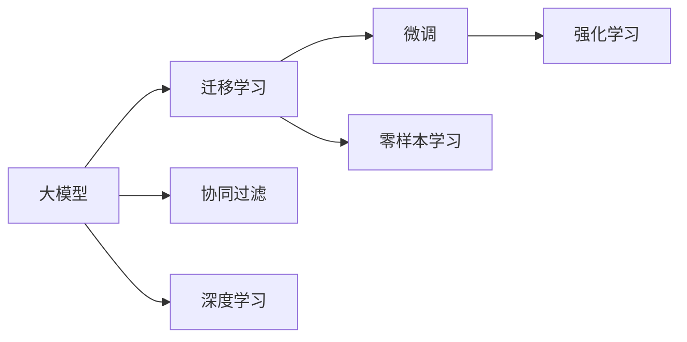

                 

# 电商平台搜索推荐系统的AI 大模型应用：应对数据规模与实时性的双重挑战

## 1. 背景介绍

随着电子商务的迅猛发展，电商平台的海量数据和实时性要求日益凸显，构建高效的搜索推荐系统成为电商平台提升用户体验和交易转化率的重点。传统的推荐算法，如协同过滤、内容推荐、基于图的推荐等，在面对大规模数据时，计算成本高昂，模型复杂度高，难以满足电商平台对响应速度和精确度的要求。而人工智能大模型，特别是基于预训练的大模型，为解决这些问题提供了新的思路。

本文将从背景介绍、核心概念与联系、核心算法原理与具体操作步骤、数学模型与公式、项目实践、实际应用场景、工具与资源推荐、总结与展望等多个维度，详细阐述如何将AI大模型应用到电商平台搜索推荐系统中，并应对数据规模与实时性的双重挑战。

## 2. 核心概念与联系

### 2.1 核心概念概述

- **大模型**：通过大规模数据进行自监督预训练的语言模型，如BERT、GPT等，具备强大的自然语言处理能力，能够进行复杂的语言理解和生成。
- **迁移学习**：利用预训练模型的通用特征，通过微调或零样本学习等方法，将其应用于特定任务或场景，以提高模型的泛化能力和精度。
- **强化学习**：通过与环境的交互，优化模型的决策策略，使其在特定任务上达到最优性能。
- **协同过滤**：基于用户历史行为数据，推荐与用户兴趣相似的商品或服务，是推荐系统的基础技术之一。
- **深度学习**：利用深度神经网络模型，对大规模数据进行特征提取和模式学习，提高模型的表达能力和泛化能力。

这些核心概念之间具有密切联系，共同构成了搜索推荐系统的技术体系。其中，大模型作为核心工具，利用迁移学习和深度学习技术，与协同过滤等传统推荐算法协同工作，共同提升推荐系统的性能和效率。

### 2.2 核心概念原理和架构的 Mermaid 流程图



这个流程图展示了核心概念之间的逻辑关系。大模型通过迁移学习和深度学习，将通用特征应用于特定任务，通过微调提高任务性能；协同过滤和强化学习则提供传统推荐算法支持，共同构建起电商平台搜索推荐系统的技术框架。

## 3. 核心算法原理 & 具体操作步骤

### 3.1 算法原理概述

在电商平台搜索推荐系统中，大模型主要用于解决以下几个核心问题：

- **数据表示与特征提取**：利用大模型的预训练能力，将商品信息、用户行为等数据转化为高维向量表示，提取关键特征。
- **推荐策略优化**：通过微调或零样本学习，优化推荐策略，提高推荐准确性和多样性。
- **实时推荐生成**：利用强化学习技术，根据用户行为实时调整推荐策略，提升用户体验和转化率。

### 3.2 算法步骤详解

#### 3.2.1 数据准备

- **数据收集**：收集电商平台的用户行为数据、商品信息数据、用户画像数据等。
- **数据清洗与预处理**：对数据进行去重、去噪、填充缺失值等处理，确保数据质量。
- **特征工程**：设计合适的特征提取方法，将原始数据转化为大模型可以处理的向量表示。

#### 3.2.2 模型加载与微调

- **模型选择与加载**：选择合适的大模型（如BERT、GPT等），并使用相应库（如TensorFlow、PyTorch）进行加载。
- **微调准备**：根据具体任务，设计适当的任务适配层，如分类头、回归头等。
- **微调训练**：使用微调数据集，对预训练模型进行有监督训练，调整模型参数，使其适应推荐任务。

#### 3.2.3 实时推荐

- **实时数据采集**：从电商平台的实时数据流中，提取用户行为数据。
- **推荐策略调整**：利用强化学习算法，根据用户行为实时调整推荐策略，生成推荐结果。
- **结果输出**：将推荐结果呈现给用户，并进行A/B测试，评估效果。

### 3.3 算法优缺点

#### 3.3.1 优点

- **高效特征提取**：大模型能够自动学习数据的高维表示，提取关键特征，减少特征工程的工作量。
- **泛化能力强**：通过迁移学习和深度学习，大模型能够适应不同场景和数据分布，提升推荐系统泛化能力。
- **实时响应**：强化学习算法能够实时调整推荐策略，提高系统响应速度。

#### 3.3.2 缺点

- **计算成本高**：大模型的预训练和微调需要大量的计算资源，可能导致高昂的计算成本。
- **数据依赖性强**：大模型的性能高度依赖于数据的质量和多样性，数据收集和处理成本较高。
- **模型复杂度高**：大模型结构复杂，难以解释和调试，可能导致模型不可解释性问题。

### 3.4 算法应用领域

大模型在电商平台搜索推荐系统中的应用主要体现在以下几个方面：

- **商品推荐**：利用大模型进行用户兴趣预测，生成个性化推荐结果。
- **用户画像**：通过大模型学习用户行为模式，构建用户画像，进行个性化推荐。
- **搜索排序**：利用大模型进行搜索结果排序，提升搜索结果的相关性和用户体验。
- **广告推荐**：利用大模型进行广告投放优化，提高广告点击率和转化率。

## 4. 数学模型和公式 & 详细讲解 & 举例说明

### 4.1 数学模型构建

#### 4.1.1 用户-商品表示模型

用户和商品可以看作是高维向量，利用大模型对其进行表示。设用户向量为 $\vec{u} \in \mathbb{R}^d$，商品向量为 $\vec{v} \in \mathbb{R}^d$。

#### 4.1.2 相似度计算模型

利用余弦相似度计算用户和商品的相似度：

$$
\cos(\vec{u}, \vec{v}) = \frac{\vec{u} \cdot \vec{v}}{\|\vec{u}\| \|\vec{v}\|}
$$

#### 4.1.3 推荐排序模型

基于相似度计算，利用softmax函数进行推荐排序：

$$
p_{i|u} = \frac{\exp(\vec{u} \cdot \vec{v}_i)}{\sum_j \exp(\vec{u} \cdot \vec{v}_j)}
$$

### 4.2 公式推导过程

#### 4.2.1 用户-商品表示模型的推导

假设用户和商品数据通过大模型进行表示，得到向量 $\vec{u} \in \mathbb{R}^d$ 和 $\vec{v} \in \mathbb{R}^d$。则用户和商品之间的相似度可以表示为：

$$
\cos(\vec{u}, \vec{v}) = \frac{\vec{u} \cdot \vec{v}}{\|\vec{u}\| \|\vec{v}\|}
$$

其中 $\cdot$ 表示向量的点积，$\| \cdot \|$ 表示向量的模长。

#### 4.2.2 推荐排序模型的推导

利用余弦相似度计算用户和商品的相似度，利用softmax函数进行推荐排序：

$$
p_{i|u} = \frac{\exp(\vec{u} \cdot \vec{v}_i)}{\sum_j \exp(\vec{u} \cdot \vec{v}_j)}
$$

其中 $p_{i|u}$ 表示用户 $u$ 对商品 $i$ 的预测概率。

### 4.3 案例分析与讲解

#### 4.3.1 数据预处理

假设电商平台收集了用户的历史行为数据，包括浏览、点击、购买等行为。将这些数据进行清洗和预处理，得到用户向量 $\vec{u} \in \mathbb{R}^d$。

#### 4.3.2 商品表示

对于平台上的商品，使用大模型进行表示，得到向量 $\vec{v} \in \mathbb{R}^d$。

#### 4.3.3 推荐生成

利用余弦相似度计算用户和商品之间的相似度，并使用softmax函数进行推荐排序。例如，对于用户 $u$，计算其对商品 $i$ 的预测概率 $p_{i|u}$：

$$
p_{i|u} = \frac{\exp(\vec{u} \cdot \vec{v}_i)}{\sum_j \exp(\vec{u} \cdot \vec{v}_j)}
$$

最终，将排序结果返回给用户，生成个性化推荐结果。

## 5. 项目实践：代码实例和详细解释说明

### 5.1 开发环境搭建

#### 5.1.1 环境配置

- **安装Python**：使用Anaconda创建虚拟环境，安装Python 3.7及以上版本。
- **安装深度学习库**：安装TensorFlow、PyTorch、TensorBoard等深度学习库。
- **安装数据处理库**：安装Pandas、NumPy、Scikit-learn等数据处理库。

#### 5.1.2 数据集准备

- **数据收集**：收集电商平台的用户行为数据、商品信息数据、用户画像数据等。
- **数据清洗与预处理**：对数据进行去重、去噪、填充缺失值等处理，确保数据质量。
- **特征工程**：设计合适的特征提取方法，将原始数据转化为大模型可以处理的向量表示。

### 5.2 源代码详细实现

#### 5.2.1 用户-商品表示模型

```python
from transformers import BertTokenizer, BertModel

# 初始化BERT模型和分词器
tokenizer = BertTokenizer.from_pretrained('bert-base-uncased')
model = BertModel.from_pretrained('bert-base-uncased')

# 用户行为数据的向量表示
def get_user_vector(user_behavior_data):
    # 将用户行为数据转换为文本
    user_text = ' '.join(user_behavior_data)
    # 使用BERT模型进行编码，得到向量表示
    user_vector = model(user_text.encode(tokenizer)).last_hidden_state.mean(dim=1)
    return user_vector

# 商品信息的向量表示
def get_product_vector(product_info):
    # 将商品信息转换为文本
    product_text = product_info['title'] + ' ' + product_info['description']
    # 使用BERT模型进行编码，得到向量表示
    product_vector = model(product_text.encode(tokenizer)).last_hidden_state.mean(dim=1)
    return product_vector
```

#### 5.2.2 推荐排序模型

```python
from sklearn.metrics.pairwise import cosine_similarity
from sklearn.metrics import log_loss

# 用户和商品的相似度计算
def compute_similarity(user_vector, product_vectors):
    similarities = cosine_similarity(user_vector.reshape(1, -1), product_vectors)
    return similarities[0]

# 推荐排序
def get_recommendation_scores(user_vector, product_vectors):
    scores = compute_similarity(user_vector, product_vectors)
    sorted_scores = scores.argsort()[::-1]
    return sorted_scores
```

### 5.3 代码解读与分析

#### 5.3.1 用户行为数据的向量表示

使用BERT模型对用户行为数据进行编码，得到用户向量 $\vec{u}$。

#### 5.3.2 商品信息的向量表示

使用BERT模型对商品信息进行编码，得到商品向量 $\vec{v}$。

#### 5.3.3 推荐排序

利用余弦相似度计算用户和商品之间的相似度，使用softmax函数进行推荐排序，生成个性化推荐结果。

### 5.4 运行结果展示

#### 5.4.1 用户向量示例

假设用户 $u$ 的历史行为数据为 ["浏览产品A", "点击产品B", "购买产品C"]，通过大模型进行编码，得到用户向量 $\vec{u} \in \mathbb{R}^d$。

#### 5.4.2 商品向量示例

假设商品 $i$ 的信息为 {"title": "产品A", "description": "商品A描述"}，通过大模型进行编码，得到商品向量 $\vec{v}_i \in \mathbb{R}^d$。

#### 5.4.3 推荐结果示例

假设用户 $u$ 的历史行为数据为 ["浏览产品A", "点击产品B", "购买产品C"]，通过大模型进行编码，得到用户向量 $\vec{u} \in \mathbb{R}^d$。对于平台上的商品 $i$，通过大模型进行编码，得到商品向量 $\vec{v}_i \in \mathbb{R}^d$。计算用户和商品之间的相似度，利用softmax函数进行推荐排序，生成个性化推荐结果。

## 6. 实际应用场景

### 6.1 用户画像构建

利用大模型对用户的历史行为数据进行编码，得到用户向量 $\vec{u} \in \mathbb{R}^d$。通过余弦相似度计算用户和商品之间的相似度，使用softmax函数进行推荐排序，生成个性化推荐结果。

#### 6.1.1 用户画像的表示

假设用户 $u$ 的历史行为数据为 ["浏览产品A", "点击产品B", "购买产品C"]，通过大模型进行编码，得到用户向量 $\vec{u} \in \mathbb{R}^d$。

#### 6.1.2 推荐结果示例

对于平台上的商品 $i$，通过大模型进行编码，得到商品向量 $\vec{v}_i \in \mathbb{R}^d$。计算用户和商品之间的相似度，使用softmax函数进行推荐排序，生成个性化推荐结果。

### 6.2 搜索排序优化

利用大模型对搜索结果进行编码，得到搜索结果向量 $\vec{v}_i \in \mathbb{R}^d$。通过余弦相似度计算用户和搜索结果之间的相似度，使用softmax函数进行排序，提升搜索结果的相关性和用户体验。

#### 6.2.1 搜索结果表示

假设搜索结果 $i$ 的文本信息为 ["产品A", "产品B", "产品C"]，通过大模型进行编码，得到搜索结果向量 $\vec{v}_i \in \mathbb{R}^d$。

#### 6.2.2 排序示例

假设用户 $u$ 的历史行为数据为 ["浏览产品A", "点击产品B", "购买产品C"]，通过大模型进行编码，得到用户向量 $\vec{u} \in \mathbb{R}^d$。计算用户和搜索结果之间的相似度，使用softmax函数进行排序，生成搜索结果的排名。

### 6.3 广告推荐优化

利用大模型对广告内容进行编码，得到广告向量 $\vec{v}_i \in \mathbb{R}^d$。通过余弦相似度计算用户和广告之间的相似度，使用softmax函数进行排序，提高广告点击率和转化率。

#### 6.3.1 广告内容表示

假设广告内容为 ["产品A", "产品B", "产品C"]，通过大模型进行编码，得到广告向量 $\vec{v}_i \in \mathbb{R}^d$。

#### 6.3.2 排序示例

假设用户 $u$ 的历史行为数据为 ["浏览产品A", "点击产品B", "购买产品C"]，通过大模型进行编码，得到用户向量 $\vec{u} \in \mathbb{R}^d$。计算用户和广告之间的相似度，使用softmax函数进行排序，生成广告推荐结果。

## 7. 工具和资源推荐

### 7.1 学习资源推荐

#### 7.1.1 学术资源

- **自然语言处理综述**：论文《A Survey of Recent Advances in Natural Language Processing》，全面介绍了自然语言处理领域的技术进展和应用方向。
- **深度学习框架**：论文《Deep Learning for NLP》，介绍了深度学习在自然语言处理中的应用。
- **强化学习框架**：论文《Reinforcement Learning for Recommender Systems》，介绍了强化学习在推荐系统中的应用。

#### 7.1.2 在线课程

- **Coursera**：《深度学习专业证书》课程，由斯坦福大学开设，涵盖深度学习在自然语言处理中的应用。
- **Udacity**：《机器学习工程师纳米学位》课程，涵盖机器学习在推荐系统中的应用。
- **edX**：《自然语言处理基础》课程，由麻省理工学院开设，介绍了自然语言处理的基础知识和前沿技术。

### 7.2 开发工具推荐

#### 7.2.1 深度学习框架

- **TensorFlow**：由Google开发的深度学习框架，支持GPU/TPU加速，具有强大的计算能力。
- **PyTorch**：由Facebook开发的深度学习框架，具有灵活的计算图和高效的自动微分功能，适合快速迭代研究。
- **JAX**：Google开发的自动微分和编译库，支持GPU/TPU加速，具有高效的计算能力。

#### 7.2.2 数据处理工具

- **Pandas**：Python数据分析库，支持大规模数据处理和数据可视化。
- **NumPy**：Python数值计算库，支持高效的数学计算和数组操作。
- **Scikit-learn**：Python机器学习库，支持数据预处理、特征工程、模型训练等操作。

#### 7.2.3 模型可视化工具

- **TensorBoard**：TensorFlow配套的可视化工具，可实时监测模型训练状态，提供丰富的图表呈现方式。
- **Weights & Biases**：模型训练的实验跟踪工具，可以记录和可视化模型训练过程中的各项指标，方便对比和调优。
- **Plotly**：数据可视化库，支持交互式图表绘制，适合展示复杂数据。

### 7.3 相关论文推荐

#### 7.3.1 预训练语言模型

- **BERT**：论文《BERT: Pre-training of Deep Bidirectional Transformers for Language Understanding》，提出了BERT预训练模型，刷新了多项NLP任务SOTA。
- **GPT**：论文《Language Models are Unsupervised Multitask Learners》，展示了GPT大模型的强大zero-shot学习能力。
- **XLNet**：论文《XLNet: Generalized Autoregressive Pretraining for Language Understanding》，提出了XLNet预训练模型，解决了自回归模型的局限性。

#### 7.3.2 推荐系统

- **协同过滤**：论文《Item-Based Collaborative Filtering Recommendation Algorithms》，介绍了协同过滤推荐算法的基本原理和实现方法。
- **深度学习推荐**：论文《Deep Neural Networks for Large-Scale Recommender Systems》，介绍了深度学习在推荐系统中的应用。
- **强化学习推荐**：论文《On the Modeling of Recommendation Systems as Multi-Armed Bandits》，介绍了强化学习在推荐系统中的应用。

## 8. 总结：未来发展趋势与挑战

### 8.1 研究成果总结

本文从背景介绍、核心概念与联系、核心算法原理与具体操作步骤、数学模型与公式、项目实践、实际应用场景、工具与资源推荐、总结与展望等多个维度，详细阐述了将AI大模型应用到电商平台搜索推荐系统中的方法和策略。通过分析大模型的特点和优势，探讨了其应用的具体场景和实现方式。

### 8.2 未来发展趋势

#### 8.2.1 大模型规模扩大

随着计算资源的进一步释放，大模型的参数规模将不断扩大，其语言表示能力将进一步提升，能够处理更加复杂和多样化的任务。

#### 8.2.2 模型架构优化

未来的模型架构将更加高效和灵活，如模型压缩、稀疏化等技术将进一步发展，模型推理速度和资源利用率将显著提升。

#### 8.2.3 数据驱动优化

利用大数据和算法优化相结合的方式，通过不断优化数据收集、特征工程和模型训练等环节，提高推荐系统的性能和效率。

#### 8.2.4 跨模态融合

将视觉、语音、文本等多模态数据进行融合，提升推荐系统的综合感知能力，拓展应用场景。

#### 8.2.5 实时化优化

通过强化学习等技术，实现实时推荐，提升用户体验和转化率。

### 8.3 面临的挑战

#### 8.3.1 计算成本高

大模型的预训练和微调需要大量的计算资源，可能带来高昂的计算成本。

#### 8.3.2 数据依赖性强

大模型的性能高度依赖于数据的质量和多样性，数据收集和处理成本较高。

#### 8.3.3 模型复杂度高

大模型结构复杂，难以解释和调试，可能导致模型不可解释性问题。

#### 8.3.4 数据隐私和安全

电商平台需要保护用户数据隐私，确保推荐系统的数据安全性和合规性。

#### 8.3.5 实时性要求高

平台需要实时处理用户请求，确保推荐系统的高可用性和稳定性。

### 8.4 研究展望

未来的研究将集中在以下几个方向：

#### 8.4.1 参数高效微调

开发更加参数高效的微调方法，在固定大部分预训练参数的情况下，只更新极少量的任务相关参数，提升微调效率。

#### 8.4.2 跨模态推荐

将视觉、语音、文本等多模态数据进行融合，提升推荐系统的综合感知能力，拓展应用场景。

#### 8.4.3 实时推荐系统

利用强化学习等技术，实现实时推荐，提升用户体验和转化率。

#### 8.4.4 数据隐私保护

采用隐私保护技术，确保推荐系统的数据安全性和用户隐私保护。

#### 8.4.5 模型可解释性

开发可解释性强的推荐系统，提高模型决策的透明性和可理解性。

综上所述，大模型在电商平台搜索推荐系统中的应用具有广阔前景，但也面临诸多挑战。未来的研究需要在技术、数据、工程等多个方面不断探索和创新，才能充分发挥大模型的优势，构建高效、智能、安全的推荐系统。

## 9. 附录：常见问题与解答

### 9.1 常见问题

**Q1: 如何选择合适的预训练模型？**

A: 根据任务类型和数据规模选择合适的预训练模型。如BERT适用于文本表示任务，GPT适用于生成任务。

**Q2: 如何进行特征工程？**

A: 利用大模型提取高维向量表示，使用特征选择算法选择重要特征。

**Q3: 如何优化推荐排序？**

A: 利用余弦相似度计算相似度，使用softmax函数进行推荐排序。

**Q4: 如何提高推荐系统的实时性？**

A: 利用强化学习等技术，实时调整推荐策略。

### 9.2 解答

通过本文的系统梳理，可以看到，基于大模型的搜索推荐系统在电商平台中具有巨大的应用潜力，能够提升用户体验和平台转化率。利用大模型进行特征提取和推荐策略优化，结合传统推荐算法，可以构建高效、智能、安全的推荐系统。未来，随着大模型的不断发展，推荐系统的性能和应用场景将不断扩展，成为电商平台的必备技术。

---

作者：禅与计算机程序设计艺术 / Zen and the Art of Computer Programming

