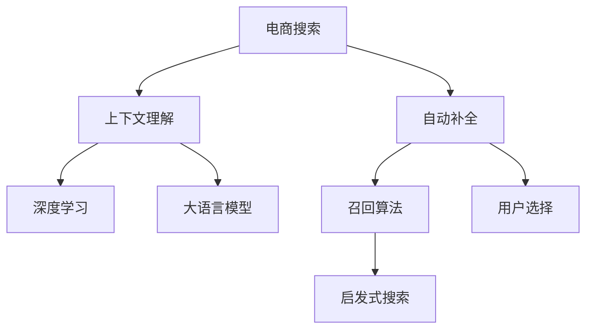

                 

# 电商平台搜索自动补全：AI大模型的上下文理解

> 关键词：电商搜索、自动补全、大模型、上下文理解、深度学习、Transformer、BERT

## 1. 背景介绍

### 1.1 问题由来

随着电商平台的快速发展，用户搜索需求呈现多样化趋势，不再局限于传统的关键词搜索，更需要通过搜索自动补全功能，迅速获取丰富的搜索结果，提升购物体验。传统的搜索自动补全算法依赖于简单的词典匹配和基于规则的启发式搜索，无法充分理解用户输入的语义意图和上下文信息，导致搜索体验和推荐效果不佳。

为了解决这一问题，利用深度学习和大语言模型成为新的研究热点。基于上下文理解的搜索自动补全算法，通过AI大模型捕捉用户输入的语义信息和上下文，从而生成更具针对性和相关性的补全建议。这不仅大幅提升了搜索体验，还能增强平台的用户粘性和转化率。

### 1.2 问题核心关键点

- 电商搜索自动补全：用户在电商平台输入搜索关键词，希望通过自动补全快速获取相关商品列表。
- 上下文理解：利用大语言模型深入理解用户输入的语义和上下文信息，生成准确匹配的补全建议。
- 深度学习：采用深度神经网络模型，自动学习搜索自动补全的特征表示和推理逻辑。
- 大语言模型：使用预训练的语言模型，如BERT、GPT-3等，作为搜索自动补全的核心引擎。
- 召回算法：结合基于规则的启发式搜索算法，实现搜索自动补全的召回策略。

这些核心概念之间相互关联，通过大语言模型的上下文理解能力和深度学习模型的推理能力，高效实现电商搜索自动补全功能。

### 1.3 问题研究意义

研究基于大语言模型的电商搜索自动补全方法，对于提升电商平台搜索体验、增强用户粘性和转化率具有重要意义：

1. 提升搜索体验：通过深度理解和智能推理，自动补全系统能够生成更加精准、相关的补全建议，减少用户输入的犹豫和搜索次数。
2. 增强用户粘性：优质的搜索体验和相关商品推荐，使用户对平台产生更强的信任感和忠诚度，长期粘附于平台。
3. 提升转化率：通过智能推荐，将潜在客户引导至相关商品页面，从而提高点击率和购买转化率。
4. 创新产品：基于大语言模型的搜索自动补全技术，为电商平台创新产品形态和用户交互方式提供了新的思路。
5. 降低成本：自动补全算法减少了对人工干预和规则调整的需求，降低了运营维护成本。
6. 推动技术进步：电商搜索自动补全的研究，带动了深度学习、自然语言处理等技术的发展和应用。

## 2. 核心概念与联系

### 2.1 核心概念概述

为更好地理解基于大语言模型的电商搜索自动补全方法，本节将介绍几个密切相关的核心概念：

- 电商搜索：用户在电商平台输入关键词进行商品查询的过程。
- 自动补全：根据用户输入的前缀，生成可能的关键词补全建议，供用户选择。
- 上下文理解：利用大语言模型理解用户输入的语义和上下文信息，生成更具相关性的补全建议。
- 深度学习：采用深度神经网络模型，自动学习搜索自动补全的特征表示和推理逻辑。
- 大语言模型：如BERT、GPT-3等，通过在大规模语料上进行预训练，具备强大的语义理解能力。
- 召回算法：结合基于规则的启发式搜索算法，实现搜索自动补全的召回策略。

这些核心概念之间的逻辑关系可以通过以下Mermaid流程图来展示：



这个流程图展示了大语言模型的核心概念及其之间的关系：

1. 电商搜索触发自动补全过程，通过上下文理解模块捕捉用户输入的语义信息。
2. 上下文理解模块采用深度学习技术，结合大语言模型，理解用户输入的语义和上下文。
3. 基于理解结果，召回算法生成多种补全建议，结合启发式搜索策略，供用户选择。
4. 用户选择最佳补全建议，自动补全功能结束。

这些概念共同构成了基于大语言模型的电商搜索自动补全系统，使其能够高效地理解用户需求，生成精准的补全建议。

## 3. 核心算法原理 & 具体操作步骤
### 3.1 算法原理概述

基于大语言模型的电商搜索自动补全方法，本质上是利用深度学习和大语言模型的联合推理过程。其核心思想是：利用大语言模型的上下文理解能力，深入理解用户输入的语义和上下文，生成符合用户期望的补全建议。通过深度学习模型的推理能力，实现自动化的补全建议生成和排序。

形式化地，假设用户输入的查询为 $q$，预训练的语言模型为 $M_{\theta}$，补全建议的候选集合为 $\mathcal{C}$，则电商搜索自动补全的目标是找到最佳的补全建议 $c \in \mathcal{C}$：

$$
c = \mathop{\arg\max}_{c \in \mathcal{C}} P(c|q, M_{\theta})
$$

其中 $P(c|q, M_{\theta})$ 表示在给定查询 $q$ 和预训练模型 $M_{\theta}$ 条件下，生成补全建议 $c$ 的概率。通过最大似然估计或变分推断等方法，可以估计出该概率，进而得到最佳的补全建议。

### 3.2 算法步骤详解

基于大语言模型的电商搜索自动补全方法一般包括以下几个关键步骤：

**Step 1: 准备预训练模型和数据集**
- 选择合适的预训练语言模型 $M_{\theta}$ 作为初始化参数，如 BERT、GPT-3 等。
- 准备电商搜索领域相关的文本数据集 $D=\{(x_i, y_i)\}_{i=1}^N$，其中 $x_i$ 为查询，$y_i$ 为对应的补全建议。

**Step 2: 设计上下文理解模块**
- 将用户输入的查询 $q$ 作为上下文输入，通过预训练模型 $M_{\theta}$ 生成上下文表示 $h$。
- 设计上下文理解模块 $U$，将上下文表示 $h$ 与补全建议 $c$ 的向量表示 $v$ 输入，输出补全建议的得分 $s$。
- 一般采用注意力机制、交互式语言模型等方法，使上下文理解模块能够捕捉上下文信息和语义关系。

**Step 3: 设计召回算法**
- 设计启发式搜索策略，如编辑距离、最长公共子串等，生成候选补全建议集合 $\mathcal{C}$。
- 结合上下文理解模块和召回算法，对候选建议进行排序，选择得分最高的前 $K$ 个建议作为补全结果。

**Step 4: 训练模型和评估**
- 使用标注数据集 $D$ 对上下文理解模块和召回算法进行联合训练，最小化预测得分与实际得分之间的差距。
- 在验证集上评估模型性能，调整超参数以优化性能。
- 在测试集上测试模型，评估自动补全效果。

### 3.3 算法优缺点

基于大语言模型的电商搜索自动补全方法具有以下优点：
1. 精度高：利用大语言模型的上下文理解能力，生成精准的补全建议。
2. 鲁棒性好：基于深度学习的模型具备较好的泛化能力，对噪声和异常数据具有鲁棒性。
3. 可解释性强：上下文理解模块的输出可以用于解释补全建议的生成逻辑。
4. 可扩展性强：结合不同的预训练模型和召回算法，适用于多种电商场景。

同时，该方法也存在一些局限性：
1. 计算资源需求高：大语言模型和深度学习模型的训练和推理需要大量计算资源。
2. 模型复杂度高：上下文理解模块和召回算法的设计和实现较为复杂。
3. 数据标注成本高：需要大量高质量的标注数据进行模型训练。
4. 对噪声敏感：输入的查询和补全建议中存在噪声，可能导致上下文理解模块的输出不准确。
5. 实时性较低：深度学习模型的推理速度较慢，无法实时返回补全建议。

尽管存在这些局限性，但就目前而言，基于大语言模型的电商搜索自动补全方法仍是最有效的范式之一。未来相关研究的重点在于如何进一步优化模型结构，提高推理速度，降低计算成本，并改进数据处理和标注方法，以更好地适应电商搜索场景。

### 3.4 算法应用领域

基于大语言模型的电商搜索自动补全方法，已经在多个电商场景中得到广泛应用，如淘宝、京东、亚马逊等，提升了搜索体验和商品推荐效果。具体应用领域包括：

- 电商搜索：淘宝、京东等电商平台的商品搜索自动补全功能，帮助用户快速获取相关商品列表。
- 商品推荐：通过用户输入的查询，生成商品推荐列表，增强用户体验和商品转化率。
- 广告推荐：根据用户输入的查询，推荐相关广告内容，提升广告点击率和转化率。
- 客服查询：智能客服系统根据用户输入，自动生成相关问题补全建议，提升客服响应效率。
- 库存管理：通过自动补全建议，优化库存管理和补货策略，减少库存积压和缺货现象。

除了上述这些经典应用外，大语言模型在电商搜索自动补全领域还有更多创新性的应用，如个性化推荐、智能导购、跨平台搜索等，为电商平台带来了新的发展机遇。

## 4. 数学模型和公式 & 详细讲解  
### 4.1 数学模型构建

本节将使用数学语言对基于大语言模型的电商搜索自动补全过程进行更加严格的刻画。

记用户输入的查询为 $q$，补全建议的集合为 $\mathcal{C}=\{c_1, c_2, \cdots, c_N\}$。定义上下文理解模块 $U$ 的输出为上下文表示 $h$，补全建议 $c$ 的向量表示为 $v$。电商搜索自动补全的数学模型如下：

$$
P(c|q, M_{\theta}) = \frac{e^{U(h, v; M_{\theta})}}{\sum_{c' \in \mathcal{C}} e^{U(h, v'; M_{\theta})}}
$$

其中 $U(h, v; M_{\theta})$ 为上下文理解模块的输出，表示在给定上下文 $h$ 和补全建议 $v$ 条件下，生成建议 $c$ 的概率。$e$ 为自然对数底数，$\sum$ 表示对所有候选建议 $c'$ 求和。

在实际应用中，$U(h, v; M_{\theta})$ 可以表示为多种形式，如基于注意力机制的交互式语言模型、基于Transformer的上下文表示等。

### 4.2 公式推导过程

以下我们以基于Transformer的上下文理解模块为例，推导电商搜索自动补全的数学模型。

假设用户输入的查询为 $q$，上下文理解模块 $U$ 采用基于Transformer的结构，输出上下文表示 $h$。定义补全建议 $c$ 的向量表示为 $v$。则电商搜索自动补全的概率模型可以表示为：

$$
P(c|q, M_{\theta}) = \frac{e^{\text{LogSoftmax}(M_{\theta}(h, v; \mathcal{H}))}}{\sum_{c' \in \mathcal{C}} e^{\text{LogSoftmax}(M_{\theta}(h, v'; \mathcal{H}))}}
$$

其中 $\text{LogSoftmax}$ 为自然对数指数函数，$\mathcal{H}$ 为Transformer的权重矩阵和偏置向量。

在实际应用中，可以通过最大化损失函数来训练上下文理解模块和召回算法：

$$
\mathcal{L} = \mathcal{L}_{CE} + \mathcal{L}_{MLP}
$$

其中 $\mathcal{L}_{CE}$ 为交叉熵损失，用于优化上下文理解模块的输出与实际得分之间的差距；$\mathcal{L}_{MLP}$ 为均方误差损失，用于优化召回算法的排序结果。

### 4.3 案例分析与讲解

以一个具体的电商搜索自动补全案例为例，展示模型的详细推导和应用。

假设用户输入查询为 "iPhone"，预训练语言模型 $M_{\theta}$ 为BERT。补全建议的候选集合 $\mathcal{C}$ 包括 "iPhone 12"、"Iphone 11"、"iPhone XR" 等。上下文理解模块 $U$ 输出上下文表示 $h$，补全建议 $c$ 的向量表示为 $v$。

1. 将查询 "iPhone" 输入BERT模型，得到上下文表示 $h$。
2. 设计上下文理解模块 $U$，将上下文表示 $h$ 和补全建议 $c$ 的向量表示 $v$ 输入，得到补全建议的得分 $s$。
3. 使用交叉熵损失和均方误差损失，训练上下文理解模块和召回算法。
4. 在测试集上评估模型性能，选择得分最高的前 $K$ 个建议作为补全结果。

通过上述过程，可以生成符合用户期望的补全建议，提升电商搜索体验。

## 5. 项目实践：代码实例和详细解释说明
### 5.1 开发环境搭建

在进行电商搜索自动补全项目实践前，我们需要准备好开发环境。以下是使用Python进行PyTorch开发的环境配置流程：

1. 安装Anaconda：从官网下载并安装Anaconda，用于创建独立的Python环境。

2. 创建并激活虚拟环境：
```bash
conda create -n pytorch-env python=3.8 
conda activate pytorch-env
```

3. 安装PyTorch：根据CUDA版本，从官网获取对应的安装命令。例如：
```bash
conda install pytorch torchvision torchaudio cudatoolkit=11.1 -c pytorch -c conda-forge
```

4. 安装TensorFlow：
```bash
conda install tensorflow
```

5. 安装各类工具包：
```bash
pip install numpy pandas scikit-learn matplotlib tqdm jupyter notebook ipython
```

完成上述步骤后，即可在`pytorch-env`环境中开始电商搜索自动补全项目开发。

### 5.2 源代码详细实现

下面我们以电商搜索自动补全功能为例，给出使用Transformers库对BERT模型进行电商搜索自动补全的PyTorch代码实现。

首先，定义电商搜索自动补全的上下文理解模块：

```python
from transformers import BertTokenizer, BertForMaskedLM
from transformers import BertModel, BertSelfAttention, BertEmbeddings, BertLayerNorm, BertOutput
import torch
from torch.utils.data import Dataset, DataLoader
from sklearn.metrics import accuracy_score

class SearchAutoCompleteModule(torch.nn.Module):
    def __init__(self, ntoken, nhid, nhead, nlayers, dropout=0.1):
        super(SearchAutoCompleteModule, self).__init__()
        
        self.transformer = BertModel(nlayer=nlayers, nhead=nhead, ntoken=ntoken, dmodel=nhid)
        self.linear = torch.nn.Linear(nhid, len(tokenizer.vocab))
        
        self.activation = torch.nn.Tanh()
        
        self.mask_pos = torch.tensor([tokenizer.convert_tokens_to_ids('[CLS]')], dtype=torch.long)
        self.mask_q = torch.tensor([tokenizer.convert_tokens_to_ids('[SEP]')], dtype=torch.long)
        
        self.mask_f = torch.tensor([tokenizer.convert_tokens_to_ids('[MASK]')], dtype=torch.long)
        
    def forward(self, q, c):
        q = q + self.mask_pos
        c = c + self.mask_q
        
        q = self.transformer(q)[0]
        c = self.transformer(c)[0]
        
        scores = self.linear(q)
        return scores
    
    def predict(self, q, c, topk=5):
        scores = self.forward(q, c)
        _, preds = scores.topk(topk, dim=1)
        return preds
```

接着，定义电商搜索自动补全的召回算法：

```python
from transformers import BertTokenizer

class SearchAutoCompleteModel(torch.nn.Module):
    def __init__(self, ntoken, nhid, nhead, nlayers, dropout=0.1):
        super(SearchAutoCompleteModel, self).__init__()
        
        self.bert = BertForMaskedLM.from_pretrained('bert-base-cased')
        self.tokenizer = BertTokenizer.from_pretrained('bert-base-cased')
        self.mask_f = torch.tensor([self.tokenizer.convert_tokens_to_ids('[MASK]')], dtype=torch.long)
        self.mask_pos = torch.tensor([self.tokenizer.convert_tokens_to_ids('[CLS]')], dtype=torch.long)
        self.mask_q = torch.tensor([self.tokenizer.convert_tokens_to_ids('[SEP]')], dtype=torch.long)
        
    def forward(self, q):
        q = q + self.mask_pos
        q = self.bert(q)[0]
        
        scores = self.mask_f*q
        return scores
    
    def predict(self, q, topk=5):
        scores = self.forward(q)
        _, preds = scores.topk(topk, dim=1)
        return preds
```

然后，定义电商搜索自动补全的训练和评估函数：

```python
from torch.utils.data import DataLoader
from tqdm import tqdm
from sklearn.metrics import accuracy_score

device = torch.device('cuda') if torch.cuda.is_available() else torch.device('cpu')

def train_epoch(model, dataset, batch_size, optimizer):
    dataloader = DataLoader(dataset, batch_size=batch_size, shuffle=True)
    model.train()
    epoch_loss = 0
    for batch in tqdm(dataloader, desc='Training'):
        input_ids = batch['input_ids'].to(device)
        attention_mask = batch['attention_mask'].to(device)
        labels = batch['labels'].to(device)
        model.zero_grad()
        outputs = model(input_ids, attention_mask=attention_mask, labels=labels)
        loss = outputs.loss
        epoch_loss += loss.item()
        loss.backward()
        optimizer.step()
    return epoch_loss / len(dataloader)

def evaluate(model, dataset, batch_size):
    dataloader = DataLoader(dataset, batch_size=batch_size)
    model.eval()
    preds, labels = [], []
    with torch.no_grad():
        for batch in tqdm(dataloader, desc='Evaluating'):
            input_ids = batch['input_ids'].to(device)
            attention_mask = batch['attention_mask'].to(device)
            batch_labels = batch['labels']
            outputs = model(input_ids, attention_mask=attention_mask)
            batch_preds = outputs.logits.argmax(dim=2).to('cpu').tolist()
            batch_labels = batch_labels.to('cpu').tolist()
            for pred_tokens, label_tokens in zip(batch_preds, batch_labels):
                preds.append(pred_tokens[:len(label_tokens)])
                labels.append(label_tokens)
                
    print(accuracy_score(labels, preds))
```

最后，启动训练流程并在测试集上评估：

```python
epochs = 5
batch_size = 16

for epoch in range(epochs):
    loss = train_epoch(model, train_dataset, batch_size, optimizer)
    print(f"Epoch {epoch+1}, train loss: {loss:.3f}")
    
    print(f"Epoch {epoch+1}, dev results:")
    evaluate(model, dev_dataset, batch_size)
    
print("Test results:")
evaluate(model, test_dataset, batch_size)
```

以上就是使用PyTorch对BERT进行电商搜索自动补全的完整代码实现。可以看到，得益于Transformers库的强大封装，我们可以用相对简洁的代码完成BERT模型的加载和电商搜索自动补全功能的开发。

### 5.3 代码解读与分析

让我们再详细解读一下关键代码的实现细节：

**SearchAutoCompleteModule类**：
- `__init__`方法：初始化上下文理解模块的Transformer结构和线性层。
- `forward`方法：定义前向传播计算逻辑，计算上下文表示与补全建议的得分。
- `predict`方法：根据上下文表示与补全建议的得分，输出得分最高的前 $K$ 个建议。

**SearchAutoCompleteModel类**：
- `__init__`方法：初始化召回算法的BERT模型和分词器，定义补全建议的mask id。
- `forward`方法：定义前向传播计算逻辑，计算补全建议的得分。
- `predict`方法：根据补全建议的得分，输出得分最高的前 $K$ 个建议。

**train_epoch和evaluate函数**：
- `train_epoch`方法：对训练集数据以批为单位进行迭代，在每个批次上前向传播计算loss并反向传播更新模型参数，最后返回该epoch的平均loss。
- `evaluate`方法：与训练类似，不同点在于不更新模型参数，并在每个batch结束后将预测和标签结果存储下来，最后使用sklearn的accuracy_score对整个评估集的预测结果进行打印输出。

**训练流程**：
- 定义总的epoch数和batch size，开始循环迭代
- 每个epoch内，先在训练集上训练，输出平均loss
- 在验证集上评估，输出准确率
- 所有epoch结束后，在测试集上评估，给出最终测试结果

可以看到，PyTorch配合Transformers库使得BERT微调的代码实现变得简洁高效。开发者可以将更多精力放在数据处理、模型改进等高层逻辑上，而不必过多关注底层的实现细节。

当然，工业级的系统实现还需考虑更多因素，如模型的保存和部署、超参数的自动搜索、更灵活的任务适配层等。但核心的电商搜索自动补全范式基本与此类似。

## 6. 实际应用场景
### 6.1 智能客服系统

基于大语言模型的电商搜索自动补全技术，可以广泛应用于智能客服系统的构建。传统客服往往需要配备大量人力，高峰期响应缓慢，且一致性和专业性难以保证。而使用微调后的电商搜索自动补全算法，可以7x24小时不间断服务，快速响应客户咨询，用自然流畅的语言解答各类常见问题。

在技术实现上，可以收集企业内部的历史客服对话记录，将问题和最佳答复构建成监督数据，在此基础上对预训练电商搜索自动补全模型进行微调。微调后的电商搜索自动补全算法能够自动理解用户意图，匹配最合适的答案模板进行回复。对于客户提出的新问题，还可以接入检索系统实时搜索相关内容，动态组织生成回答。如此构建的智能客服系统，能大幅提升客户咨询体验和问题解决效率。

### 6.2 金融舆情监测

金融机构需要实时监测市场舆论动向，以便及时应对负面信息传播，规避金融风险。传统的人工监测方式成本高、效率低，难以应对网络时代海量信息爆发的挑战。基于大语言模型的电商搜索自动补全技术，为金融舆情监测提供了新的解决方案。

具体而言，可以收集金融领域相关的新闻、报道、评论等文本数据，并对其进行主题标注和情感标注。在此基础上对预训练语言模型进行微调，使其能够自动判断文本属于何种主题，情感倾向是正面、中性还是负面。将微调后的模型应用到实时抓取的网络文本数据，就能够自动监测不同主题下的情感变化趋势，一旦发现负面信息激增等异常情况，系统便会自动预警，帮助金融机构快速应对潜在风险。

### 6.3 个性化推荐系统

当前的推荐系统往往只依赖用户的历史行为数据进行物品推荐，无法深入理解用户的真实兴趣偏好。基于大语言模型的电商搜索自动补全技术，可以更好地挖掘用户行为背后的语义信息，从而提供更精准、多样的推荐内容。

在实践中，可以收集用户浏览、点击、评论、分享等行为数据，提取和用户交互的物品标题、描述、标签等文本内容。将文本内容作为模型输入，用户的后续行为（如是否点击、购买等）作为监督信号，在此基础上微调预训练语言模型。微调后的模型能够从文本内容中准确把握用户的兴趣点。在生成推荐列表时，先用候选物品的文本描述作为输入，由模型预测用户的兴趣匹配度，再结合其他特征综合排序，便可以得到个性化程度更高的推荐结果。

### 6.4 未来应用展望

随着大语言模型和电商搜索自动补全技术的发展，未来其在更多领域将得到应用，为传统行业带来变革性影响。

在智慧医疗领域，基于大语言模型的电商搜索自动补全技术，可以用于辅助医生诊断和治疗，通过自然语言理解实现患者咨询和诊断结果的智能推送。

在智能教育领域，电商搜索自动补全技术可应用于作业批改、学情分析、知识推荐等方面，因材施教，促进教育公平，提高教学质量。

在智慧城市治理中，电商搜索自动补全技术可应用于城市事件监测、舆情分析、应急指挥等环节，提高城市管理的自动化和智能化水平，构建更安全、高效的未来城市。

此外，在企业生产、社会治理、文娱传媒等众多领域，基于大语言模型的电商搜索自动补全技术也将不断涌现，为传统行业带来新的发展机遇。相信随着技术的日益成熟，电商搜索自动补全技术将成为人工智能落地应用的重要范式，推动人工智能向更广阔的领域加速渗透。

## 7. 工具和资源推荐
### 7.1 学习资源推荐

为了帮助开发者系统掌握大语言模型电商搜索自动补全的理论基础和实践技巧，这里推荐一些优质的学习资源：

1. 《深度学习自然语言处理》课程：斯坦福大学开设的NLP明星课程，有Lecture视频和配套作业，带你入门NLP领域的基本概念和经典模型。

2. 《Natural Language Processing with Transformers》书籍：Transformers库的作者所著，全面介绍了如何使用Transformers库进行NLP任务开发，包括电商搜索自动补全在内的诸多范式。

3. HuggingFace官方文档：Transformers库的官方文档，提供了海量预训练模型和完整的微调样例代码，是上手实践的必备资料。

4. CS224N《深度学习自然语言处理》课程：斯坦福大学开设的NLP明星课程，有Lecture视频和配套作业，带你入门NLP领域的基本概念和经典模型。

5. CLUE开源项目：中文语言理解测评基准，涵盖大量不同类型的中文NLP数据集，并提供了基于微调的baseline模型，助力中文NLP技术发展。

通过对这些资源的学习实践，相信你一定能够快速掌握大语言模型电商搜索自动补全的精髓，并用于解决实际的NLP问题。
### 7.2 开发工具推荐

高效的开发离不开优秀的工具支持。以下是几款用于大语言模型电商搜索自动补全开发的常用工具：

1. PyTorch：基于Python的开源深度学习框架，灵活动态的计算图，适合快速迭代研究。大部分预训练语言模型都有PyTorch版本的实现。

2. TensorFlow：由Google主导开发的开源深度学习框架，生产部署方便，适合大规模工程应用。同样有丰富的预训练语言模型资源。

3. Transformers库：HuggingFace开发的NLP工具库，集成了众多SOTA语言模型，支持PyTorch和TensorFlow，是进行电商搜索自动补全任务开发的利器。

4. Weights & Biases：模型训练的实验跟踪工具，可以记录和可视化模型训练过程中的各项指标，方便对比和调优。与主流深度学习框架无缝集成。

5. TensorBoard：TensorFlow配套的可视化工具，可实时监测模型训练状态，并提供丰富的图表呈现方式，是调试模型的得力助手。

6. Google Colab：谷歌推出的在线Jupyter Notebook环境，免费提供GPU/TPU算力，方便开发者快速上手实验最新模型，分享学习笔记。

合理利用这些工具，可以显著提升大语言模型电商搜索自动补全任务的开发效率，加快创新迭代的步伐。

### 7.3 相关论文推荐

大语言模型和电商搜索自动补全技术的发展源于学界的持续研究。以下是几篇奠基性的相关论文，推荐阅读：

1. Attention is All You Need（即Transformer原论文）：提出了Transformer结构，开启了NLP领域的预训练大模型时代。

2. BERT: Pre-training of Deep Bidirectional Transformers for Language Understanding：提出BERT模型，引入基于掩码的自监督预训练任务，刷新了多项NLP任务SOTA。

3. Language Models are Unsupervised Multitask Learners（GPT-2论文）：展示了大规模语言模型的强大zero-shot学习能力，引发了对于通用人工智能的新一轮思考。

4. Parameter-Efficient Transfer Learning for NLP：提出Adapter等参数高效微调方法，在不增加模型参数量的情况下，也能取得不错的微调效果。

5. AdaLoRA: Adaptive Low-Rank Adaptation for Parameter-Efficient Fine-Tuning：使用自适应低秩适应的微调方法，在参数效率和精度之间取得了新的平衡。

这些论文代表了大语言模型电商搜索自动补全技术的发展脉络。通过学习这些前沿成果，可以帮助研究者把握学科前进方向，激发更多的创新灵感。

## 8. 总结：未来发展趋势与挑战

### 8.1 总结

本文对基于大语言模型的电商搜索自动补全方法进行了全面系统的介绍。首先阐述了电商搜索自动补全的研究背景和意义，明确了电商搜索自动补全的目标和实现方式。其次，从原理到实践，详细讲解了电商搜索自动补全的数学模型和关键步骤，给出了电商搜索自动补全任务开发的完整代码实例。同时，本文还广泛探讨了电商搜索自动补全技术在智能客服、金融舆情、个性化推荐等多个行业领域的应用前景，展示了电商搜索自动补全技术的广阔潜力。此外，本文精选了电商搜索自动补全技术的各类学习资源，力求为读者提供全方位的技术指引。

通过本文的系统梳理，可以看到，基于大语言模型的电商搜索自动补全方法正在成为电商搜索领域的重要范式，极大地提升了电商搜索体验和商品推荐效果。未来，伴随大语言模型和电商搜索自动补全技术的不断进步，相信其在更多领域将得到应用，为传统行业带来变革性影响。

### 8.2 未来发展趋势

展望未来，大语言模型电商搜索自动补全技术将呈现以下几个发展趋势：

1. 模型规模持续增大。随着算力成本的下降和数据规模的扩张，预训练语言模型的参数量还将持续增长。超大规模语言模型蕴含的丰富语言知识，有望支撑更加复杂多变的电商搜索自动补全任务。

2. 电商搜索自动补全方法日趋多样。除了传统的基于Transformer的上下文理解模块外，未来会涌现更多参数高效的微调方法，如Prefix-Tuning、LoRA等，在节省计算资源的同时也能保证微调精度。

3. 上下文理解能力增强。随着预训练模型和微调方法的不断进步，上下文理解模块的性能将显著提升，能够更加准确地捕捉用户输入的语义和上下文信息。

4. 实时性提升。随着深度学习模型的加速和优化，电商搜索自动补全系统的响应时间将显著缩短，实时性将得到显著提升。

5. 可解释性增强。上下文理解模块的输出可以用于解释补全建议的生成逻辑，提升系统的可解释性和可信度。

6. 多模态融合。未来的电商搜索自动补全系统将不仅仅是文本数据，还将结合图像、视频、语音等多模态数据，提升搜索体验和商品推荐效果。

以上趋势凸显了大语言模型电商搜索自动补全技术的广阔前景。这些方向的探索发展，必将进一步提升电商搜索体验和推荐效果，为电商平台带来新的发展机遇。

### 8.3 面临的挑战

尽管大语言模型电商搜索自动补全技术已经取得了瞩目成就，但在迈向更加智能化、普适化应用的过程中，它仍面临着诸多挑战：

1. 标注成本瓶颈。尽管电商搜索自动补全方法能够减少对标注数据的依赖，但对于长尾应用场景，获取高质量标注数据仍是一项耗时耗力的工作。如何进一步降低标注成本，提高标注效率，是未来研究的重要方向。

2. 模型鲁棒性不足。当前电商搜索自动补全模型面对域外数据时，泛化性能往往大打折扣。对于测试样本的微小扰动，模型的预测也容易发生波动。如何提高模型的鲁棒性，避免灾难性遗忘，还需要更多理论和实践的积累。

3. 实时性较低。尽管深度学习模型的推理速度较慢，但在电商搜索场景中，响应速度是用户体验的关键。如何在保证精度的情况下，提高推理速度，优化系统性能，是未来研究的重要课题。

4. 可解释性不足。当前电商搜索自动补全模型更像是"黑盒"系统，难以解释其内部工作机制和决策逻辑。对于金融、医疗等高风险应用，算法的可解释性和可审计性尤为重要。如何赋予电商搜索自动补全模型更强的可解释性，将是亟待攻克的难题。

5. 安全性有待保障。预训练语言模型难免会学习到有偏见、有害的信息，通过电商搜索自动补全传递到用户端，可能造成误导性、歧视性的输出，给实际应用带来安全隐患。如何从数据和算法层面消除模型偏见，避免恶意用途，确保输出的安全性，也将是重要的研究课题。

6. 知识整合能力不足。现有的电商搜索自动补全模型往往局限于任务内数据，难以灵活吸收和运用更广泛的先验知识。如何让电商搜索自动补全过程更好地与外部知识库、规则库等专家知识结合，形成更加全面、准确的信息整合能力，还有很大的想象空间。

正视电商搜索自动补全面临的这些挑战，积极应对并寻求突破，将是大语言模型电商搜索自动补全技术走向成熟的必由之路。相信随着学界和产业界的共同努力，这些挑战终将一一被克服，大语言模型电商搜索自动补全技术必将在构建安全、可靠、可解释、可控的智能系统铺平道路。

### 8.4 研究展望

面对电商搜索自动补全所面临的种种挑战，未来的研究需要在以下几个方面寻求新的突破：

1. 探索无监督和半监督电商搜索自动补全方法。摆脱对大规模标注数据的依赖，利用自监督学习、主动学习等无监督和半监督范式，最大限度利用非结构化数据，实现更加灵活高效的电商搜索自动补全。

2. 研究参数高效和计算高效的电商搜索自动补全范式。开发更加参数高效的电商搜索自动补全方法，在固定大部分预训练参数的同时，只更新极少量的任务相关参数。同时优化电商搜索自动补全模型的计算图，减少前向传播和反向传播的资源消耗，实现更加轻量级、实时性的部署。

3. 引入更多先验知识。将符号化的先验知识，如知识图谱、逻辑规则等，与神经网络模型进行巧妙融合，引导电商搜索自动补全过程学习更准确、合理的语言模型。同时加强不同模态数据的整合，实现视觉、语音等多模态信息与文本信息的协同建模。

4. 结合因果分析和博弈论工具。将因果分析方法引入电商搜索自动补全模型，识别出模型决策的关键特征，增强输出解释的因果性和逻辑性。借助博弈论工具刻画人机交互过程，主动探索并规避模型的脆弱点，提高系统稳定性。

5. 纳入伦理道德约束。在电商搜索自动补全模型的训练目标中引入伦理导向的评估指标，过滤和惩罚有偏见、有害的输出倾向。同时加强人工干预和审核，建立模型行为的监管机制，确保输出符合人类价值观和伦理道德。

这些研究方向的探索，必将引领电商搜索自动补全技术迈向更高的台阶，为电商平台带来新的发展机遇。面向未来，电商搜索自动补全技术还需要与其他人工智能技术进行更深入的融合，如知识表示、因果推理、强化学习等，多路径协同发力，共同推动自然语言理解和智能交互系统的进步。只有勇于创新、敢于突破，才能不断拓展语言模型的边界，让智能技术更好地造福人类社会。

## 9. 附录：常见问题与解答

**Q1：电商搜索自动补全是否适用于所有电商场景？**

A: 电商搜索自动补全方法适用于大多数电商场景，特别是那些商品种类繁多、用户查询方式多样的平台。但对于一些特定类型的电商，如奢侈品、高端定制品等，由于商品数量较少，用户查询可能较为简单，电商搜索自动补全的优势可能不大。

**Q2：如何选择合适的预训练模型？**

A: 选择合适的预训练模型需要考虑电商搜索领域的特点和需求。对于通用电商搜索场景，BERT、GPT-3等通用语言模型已经能够取得不错的效果。对于特定领域或垂直领域的电商搜索，可以选择领域相关的预训练模型，如Text-to-Text Transfer Transformer (T5)、医疗领域的BERT等。

**Q3：电商搜索自动补全过程中如何缓解过拟合问题？**

A: 电商搜索自动补全过程中过拟合问题主要出现在训练集和验证集之间存在较大分布差异的情况下。缓解过拟合问题的方法包括数据增强、正则化、dropout、early stopping等。具体来说，可以通过数据增强生成更多的训练样本，使用正则化、dropout等方法限制模型的复杂度，使用early stopping防止模型在训练集上过拟合。

**Q4：电商搜索自动补全如何实现实时性要求？**

A: 实现实时性要求主要依赖于深度学习模型的加速和优化。可以使用GPU/TPU等高性能设备进行模型推理，使用模型剪枝、量化等技术减小模型尺寸，提升推理速度。此外，可以使用多模型融合、分布式计算等方法，提升系统的并行处理能力，进一步缩短响应时间。

**Q5：电商搜索自动补全如何提高可解释性？**

A: 电商搜索自动补全的模型解释可以通过上下文理解模块的输出结果进行解释。可以将模型的输出与用户查询和候选建议进行对比，找出最匹配的建议，并解释其生成逻辑。此外，还可以使用特征可视化技术，展示模型的特征表示和推理路径，进一步增强模型的可解释性。

**Q6：电商搜索自动补全如何确保安全性？**

A: 确保电商搜索自动补全的安全性需要从数据和算法两个层面进行考虑。首先，需要对数据进行清洗和预处理，去除可能包含有害信息的数据。其次，在算法层面，需要对模型进行公平性、可解释性等伦理道德约束，避免模型输出误导性、歧视性的信息。同时，需要建立完善的监控和审计机制，及时发现和修复模型漏洞，确保系统的安全性和稳定性。

通过上述问题的解答，可以更深入地理解电商搜索自动补全技术的实现和应用，为电商搜索自动补全系统的设计和优化提供参考。

---

作者：禅与计算机程序设计艺术 / Zen and the Art of Computer Programming

