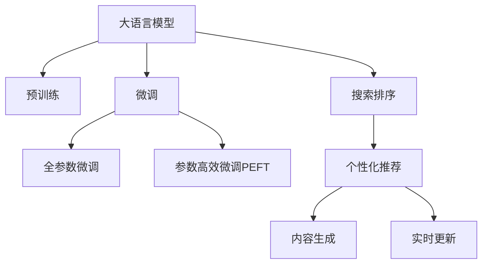

                 

# 电商平台的AI 大模型实践：搜索推荐系统是核心，数据质量控制是重点

在数字化的商业时代，电商平台作为连接商家与消费者的桥梁，其智能化水平直接影响着用户的购物体验和平台的用户粘性。人工智能（AI）技术的大模型实践，尤其是搜索推荐系统的构建，成为了电商平台智能化升级的关键。本文将详细探讨如何基于大模型技术构建电商平台的搜索推荐系统，以及如何通过数据质量控制确保其高效、准确运行。

## 1. 背景介绍

### 1.1 问题由来

电商平台的海量商品和海量用户，使得推荐系统面临的挑战尤为严峻。传统推荐系统多依赖用户的历史行为数据进行个性化推荐，但该方式难以应对新用户的冷启动问题，也难以捕捉用户的深度偏好和长期趋势。而基于大模型的推荐系统能够通过丰富的预训练知识，更全面、准确地了解用户和商品，提供更精准的个性化推荐，从而大幅提升用户满意度。

### 1.2 问题核心关键点

电商平台的推荐系统主要关注以下几个核心问题：

- **搜索排序**：如何根据用户输入的查询词，高效排序搜索结果，返回最相关的商品。
- **个性化推荐**：如何根据用户的浏览历史、购买记录等行为数据，推荐用户可能感兴趣的商品。
- **内容生成**：如何生成高质量的推荐商品描述和图文，提升用户对推荐的信任度和购买意愿。
- **实时更新**：如何实时更新商品库存、价格、评价等信息，保持推荐内容的及时性和准确性。

## 2. 核心概念与联系

### 2.1 核心概念概述

为更好地理解基于大模型的电商推荐系统构建，本节将介绍几个密切相关的核心概念：

- **大语言模型(Large Language Model, LLM)**：以自回归(如GPT)或自编码(如BERT)模型为代表的大规模预训练语言模型。通过在大规模无标签文本语料上进行预训练，学习通用的语言表示，具备强大的语言理解和生成能力。

- **预训练(Pre-training)**：指在大规模无标签文本语料上，通过自监督学习任务训练通用语言模型的过程。常见的预训练任务包括言语建模、遮挡语言模型等。预训练使得模型学习到语言的通用表示。

- **微调(Fine-tuning)**：指在预训练模型的基础上，使用下游任务的少量标注数据，通过有监督学习优化模型在该任务上的性能。通常只需要调整顶层分类器或解码器，并以较小的学习率更新全部或部分的模型参数。

- **迁移学习(Transfer Learning)**：指将一个领域学习到的知识，迁移应用到另一个不同但相关的领域的学习范式。大模型的预训练-微调过程即是一种典型的迁移学习方式。

- **搜索排序**：指根据用户输入的查询词，通过算法模型排序搜索结果，返回最相关的商品。核心在于理解查询词和商品的语义相似度，以及商品的相关性。

- **个性化推荐**：指根据用户的浏览历史、购买记录等行为数据，预测用户可能感兴趣的商品，并提供推荐。核心在于用户和商品的建模，以及用户行为数据的理解。

- **内容生成**：指生成高质量的推荐商品描述和图文，提升用户对推荐的信任度和购买意愿。核心在于自然语言生成(NLG)和图像生成。

- **实时更新**：指实时更新商品库存、价格、评价等信息，保持推荐内容的及时性和准确性。核心在于商品数据的采集和处理，以及推荐模型的动态更新。

这些核心概念之间的逻辑关系可以通过以下Mermaid流程图来展示：



这个流程图展示了大语言模型的核心概念及其之间的关系：

1. 大语言模型通过预训练获得基础能力。
2. 微调是对预训练模型进行任务特定的优化，可以分为全参数微调和参数高效微调（PEFT）。
3. 搜索排序、个性化推荐、内容生成、实时更新等任务都是基于微调模型构建。

这些概念共同构成了大语言模型在电商平台中的应用框架，使其能够在各种场景下发挥强大的推荐能力。通过理解这些核心概念，我们可以更好地把握大语言模型的工作原理和优化方向。

## 3. 核心算法原理 & 具体操作步骤
### 3.1 算法原理概述

基于大模型的电商平台推荐系统，本质上是一个有监督的细粒度迁移学习过程。其核心思想是：将预训练的大语言模型视作一个强大的"特征提取器"，通过在下游任务的标注数据上进行有监督的微调，使得模型输出能够匹配任务标签，从而获得针对特定任务优化的模型。

形式化地，假设预训练模型为 $M_{\theta}$，其中 $\theta$ 为预训练得到的模型参数。给定下游任务 $T$ 的标注数据集 $D=\{(x_i, y_i)\}_{i=1}^N$，微调的目标是找到新的模型参数 $\hat{\theta}$，使得：

$$
\hat{\theta}=\mathop{\arg\min}_{\theta} \mathcal{L}(M_{\theta},D)
$$

其中 $\mathcal{L}$ 为针对任务 $T$ 设计的损失函数，用于衡量模型预测输出与真实标签之间的差异。常见的损失函数包括交叉熵损失、均方误差损失等。

通过梯度下降等优化算法，微调过程不断更新模型参数 $\theta$，最小化损失函数 $\mathcal{L}$，使得模型输出逼近真实标签。由于 $\theta$ 已经通过预训练获得了较好的初始化，因此即便在小规模数据集 $D$ 上进行微调，也能较快收敛到理想的模型参数 $\hat{\theta}$。

### 3.2 算法步骤详解

基于大模型的电商平台推荐系统的一般流程如下：

**Step 1: 准备预训练模型和数据集**
- 选择合适的预训练语言模型 $M_{\theta}$ 作为初始化参数，如 BERT、GPT 等。
- 准备电商平台的商品标签数据集 $D$，划分为训练集、验证集和测试集。一般要求标注数据与预训练数据的分布不要差异过大。

**Step 2: 添加任务适配层**
- 根据任务类型，在预训练模型顶层设计合适的输出层和损失函数。
- 对于搜索排序任务，通常在顶层添加向量相似度计算层和交叉熵损失函数。
- 对于个性化推荐任务，通常使用用户行为数据作为输入，以均方误差损失函数优化模型输出。
- 对于内容生成任务，使用语言生成器生成文本，以交叉熵损失或BertScore等指标进行评估。
- 对于实时更新任务，通常使用在线增量学习算法，如AdaGrad等，实时更新模型参数。

**Step 3: 设置微调超参数**
- 选择合适的优化算法及其参数，如 AdamW、SGD 等，设置学习率、批大小、迭代轮数等。
- 设置正则化技术及强度，包括权重衰减、Dropout、Early Stopping等。
- 确定冻结预训练参数的策略，如仅微调顶层，或全部参数都参与微调。

**Step 4: 执行梯度训练**
- 将训练集数据分批次输入模型，前向传播计算损失函数。
- 反向传播计算参数梯度，根据设定的优化算法和学习率更新模型参数。
- 周期性在验证集上评估模型性能，根据性能指标决定是否触发 Early Stopping。
- 重复上述步骤直到满足预设的迭代轮数或 Early Stopping 条件。

**Step 5: 测试和部署**
- 在测试集上评估微调后模型 $M_{\hat{\theta}}$ 的性能，对比微调前后的精度提升。
- 使用微调后的模型对新样本进行推理预测，集成到实际的应用系统中。
- 持续收集新的数据，定期重新微调模型，以适应数据分布的变化。

以上是基于大模型的电商平台推荐系统的一般流程。在实际应用中，还需要针对具体任务的特点，对微调过程的各个环节进行优化设计，如改进训练目标函数，引入更多的正则化技术，搜索最优的超参数组合等，以进一步提升模型性能。

### 3.3 算法优缺点

基于大模型的电商平台推荐系统具有以下优点：

1. **数据灵活性**：适用于各类商品数据的标注数据，可以覆盖不同的属性、评论、评分等标签信息。
2. **效果显著**：在学术界和工业界的诸多推荐任务上，基于大模型的推荐方法已经刷新了最先进的性能指标。
3. **推荐多样性**：大模型具有强大的语言理解和生成能力，能够生成丰富的推荐内容，满足用户的多样化需求。
4. **实时更新**：利用大模型的在线学习能力，可以实时更新商品信息，保持推荐内容的时效性。

同时，该方法也存在一定的局限性：

1. **数据需求高**：高质量标注数据的获取成本较高，且标注数据的丰富性直接影响推荐效果。
2. **计算资源消耗大**：大模型往往需要较大的计算资源，导致推荐系统的部署和运行成本较高。
3. **模型解释性不足**：推荐模型的决策过程缺乏可解释性，难以对其推理逻辑进行分析和调试。

尽管存在这些局限性，但就目前而言，基于大模型的推荐系统仍是最主流范式。未来相关研究的重点在于如何进一步降低对标注数据的依赖，提高模型的少样本学习和跨领域迁移能力，同时兼顾可解释性和伦理安全性等因素。

### 3.4 算法应用领域

基于大模型的电商平台推荐系统已经在搜索排序、个性化推荐、内容生成、实时更新等多个推荐场景上取得了优异的效果，成为电商平台智能化升级的重要手段。

- **搜索排序**：根据用户输入的查询词，高效排序搜索结果，返回最相关的商品。通常使用BertSequenceClassifier等模型进行微调。
- **个性化推荐**：根据用户的浏览历史、购买记录等行为数据，推荐用户可能感兴趣的商品。使用用户行为数据作为输入，进行多任务学习。
- **内容生成**：生成高质量的推荐商品描述和图文，提升用户对推荐的信任度和购买意愿。使用自回归生成模型，如GPT等。
- **实时更新**：实时更新商品库存、价格、评价等信息，保持推荐内容的及时性和准确性。使用在线学习算法，如AdaGrad等。

除了上述这些经典任务外，大模型的推荐系统还被创新性地应用到更多场景中，如产品搜索推荐、动态价格优化、个性化广告推荐等，为电商平台带来了全新的突破。随着预训练模型和推荐方法的不断进步，相信电商平台推荐系统将在更广阔的应用领域大放异彩。

## 4. 数学模型和公式 & 详细讲解 & 举例说明
### 4.1 数学模型构建

本节将使用数学语言对基于大模型的电商平台推荐系统进行更加严格的刻画。

记预训练语言模型为 $M_{\theta}$，其中 $\theta$ 为预训练得到的模型参数。假设推荐任务的训练集为 $D=\{(x_i,y_i)\}_{i=1}^N, x_i \in \mathcal{X}, y_i \in \mathcal{Y}$。

定义模型 $M_{\theta}$ 在数据样本 $(x,y)$ 上的损失函数为 $\ell(M_{\theta}(x),y)$，则在数据集 $D$ 上的经验风险为：

$$
\mathcal{L}(\theta) = \frac{1}{N} \sum_{i=1}^N \ell(M_{\theta}(x_i),y_i)
$$

微调的优化目标是最小化经验风险，即找到最优参数：

$$
\theta^* = \mathop{\arg\min}_{\theta} \mathcal{L}(\theta)
$$

在实践中，我们通常使用基于梯度的优化算法（如SGD、Adam等）来近似求解上述最优化问题。设 $\eta$ 为学习率，$\lambda$ 为正则化系数，则参数的更新公式为：

$$
\theta \leftarrow \theta - \eta \nabla_{\theta}\mathcal{L}(\theta) - \eta\lambda\theta
$$

其中 $\nabla_{\theta}\mathcal{L}(\theta)$ 为损失函数对参数 $\theta$ 的梯度，可通过反向传播算法高效计算。

### 4.2 公式推导过程

以下我们以推荐排序任务为例，推导交叉熵损失函数及其梯度的计算公式。

假设模型 $M_{\theta}$ 在输入 $x$ 上的输出为 $\hat{y}=M_{\theta}(x) \in [0,1]$，表示样本属于正类的概率。真实标签 $y \in \{0,1\}$。则二分类交叉熵损失函数定义为：

$$
\ell(M_{\theta}(x),y) = -[y\log \hat{y} + (1-y)\log (1-\hat{y})]
$$

将其代入经验风险公式，得：

$$
\mathcal{L}(\theta) = -\frac{1}{N}\sum_{i=1}^N [y_i\log M_{\theta}(x_i)+(1-y_i)\log(1-M_{\theta}(x_i))]
$$

根据链式法则，损失函数对参数 $\theta_k$ 的梯度为：

$$
\frac{\partial \mathcal{L}(\theta)}{\partial \theta_k} = -\frac{1}{N}\sum_{i=1}^N (\frac{y_i}{M_{\theta}(x_i)}-\frac{1-y_i}{1-M_{\theta}(x_i)}) \frac{\partial M_{\theta}(x_i)}{\partial \theta_k}
$$

其中 $\frac{\partial M_{\theta}(x_i)}{\partial \theta_k}$ 可进一步递归展开，利用自动微分技术完成计算。

在得到损失函数的梯度后，即可带入参数更新公式，完成模型的迭代优化。重复上述过程直至收敛，最终得到适应推荐排序任务的最优模型参数 $\theta^*$。

## 5. 项目实践：代码实例和详细解释说明
### 5.1 开发环境搭建

在进行推荐系统实践前，我们需要准备好开发环境。以下是使用Python进行PyTorch开发的环境配置流程：

1. 安装Anaconda：从官网下载并安装Anaconda，用于创建独立的Python环境。

2. 创建并激活虚拟环境：
```bash
conda create -n pytorch-env python=3.8 
conda activate pytorch-env
```

3. 安装PyTorch：根据CUDA版本，从官网获取对应的安装命令。例如：
```bash
conda install pytorch torchvision torchaudio cudatoolkit=11.1 -c pytorch -c conda-forge
```

4. 安装Transformers库：
```bash
pip install transformers
```

5. 安装各类工具包：
```bash
pip install numpy pandas scikit-learn matplotlib tqdm jupyter notebook ipython
```

完成上述步骤后，即可在`pytorch-env`环境中开始推荐系统实践。

### 5.2 源代码详细实现

这里我们以推荐排序任务为例，给出使用Transformers库对BERT模型进行推荐排序的PyTorch代码实现。

首先，定义推荐排序任务的数据处理函数：

```python
from transformers import BertTokenizer
from torch.utils.data import Dataset
import torch

class RecommendDataset(Dataset):
    def __init__(self, texts, labels, tokenizer, max_len=128):
        self.texts = texts
        self.labels = labels
        self.tokenizer = tokenizer
        self.max_len = max_len
        
    def __len__(self):
        return len(self.texts)
    
    def __getitem__(self, item):
        text = self.texts[item]
        label = self.labels[item]
        
        encoding = self.tokenizer(text, return_tensors='pt', max_length=self.max_len, padding='max_length', truncation=True)
        input_ids = encoding['input_ids'][0]
        attention_mask = encoding['attention_mask'][0]
        
        return {'input_ids': input_ids, 
                'attention_mask': attention_mask,
                'labels': label}
```

然后，定义模型和优化器：

```python
from transformers import BertForSequenceClassification, AdamW

model = BertForSequenceClassification.from_pretrained('bert-base-cased', num_labels=2)

optimizer = AdamW(model.parameters(), lr=2e-5)
```

接着，定义训练和评估函数：

```python
from torch.utils.data import DataLoader
from tqdm import tqdm
from sklearn.metrics import roc_auc_score

device = torch.device('cuda') if torch.cuda.is_available() else torch.device('cpu')
model.to(device)

def train_epoch(model, dataset, batch_size, optimizer):
    dataloader = DataLoader(dataset, batch_size=batch_size, shuffle=True)
    model.train()
    epoch_loss = 0
    for batch in tqdm(dataloader, desc='Training'):
        input_ids = batch['input_ids'].to(device)
        attention_mask = batch['attention_mask'].to(device)
        labels = batch['labels'].to(device)
        model.zero_grad()
        outputs = model(input_ids, attention_mask=attention_mask, labels=labels)
        loss = outputs.loss
        epoch_loss += loss.item()
        loss.backward()
        optimizer.step()
    return epoch_loss / len(dataloader)

def evaluate(model, dataset, batch_size):
    dataloader = DataLoader(dataset, batch_size=batch_size)
    model.eval()
    preds, labels = [], []
    with torch.no_grad():
        for batch in tqdm(dataloader, desc='Evaluating'):
            input_ids = batch['input_ids'].to(device)
            attention_mask = batch['attention_mask'].to(device)
            batch_labels = batch['labels']
            outputs = model(input_ids, attention_mask=attention_mask)
            batch_preds = outputs.logits.argmax(dim=2).to('cpu').tolist()
            batch_labels = batch_labels.to('cpu').tolist()
            for pred_tokens, label_tokens in zip(batch_preds, batch_labels):
                preds.append(pred_tokens)
                labels.append(label_tokens)
                
    roc_auc = roc_auc_score(labels, preds)
    print(f"ROC-AUC Score: {roc_auc}")
```

最后，启动训练流程并在测试集上评估：

```python
epochs = 5
batch_size = 16

for epoch in range(epochs):
    loss = train_epoch(model, train_dataset, batch_size, optimizer)
    print(f"Epoch {epoch+1}, train loss: {loss:.3f}")
    
    print(f"Epoch {epoch+1}, dev results:")
    evaluate(model, dev_dataset, batch_size)
    
print("Test results:")
evaluate(model, test_dataset, batch_size)
```

以上就是使用PyTorch对BERT进行推荐排序任务的完整代码实现。可以看到，得益于Transformers库的强大封装，我们可以用相对简洁的代码完成BERT模型的加载和推荐排序任务的微调。

### 5.3 代码解读与分析

让我们再详细解读一下关键代码的实现细节：

**RecommendDataset类**：
- `__init__`方法：初始化文本、标签、分词器等关键组件。
- `__len__`方法：返回数据集的样本数量。
- `__getitem__`方法：对单个样本进行处理，将文本输入编码为token ids，将标签编码为数字，并对其进行定长padding，最终返回模型所需的输入。

**训练和评估函数**：
- 使用PyTorch的DataLoader对数据集进行批次化加载，供模型训练和推理使用。
- 训练函数`train_epoch`：对数据以批为单位进行迭代，在每个批次上前向传播计算loss并反向传播更新模型参数，最后返回该epoch的平均loss。
- 评估函数`evaluate`：与训练类似，不同点在于不更新模型参数，并在每个batch结束后将预测和标签结果存储下来，最后使用sklearn的roc_auc_score对整个评估集的预测结果进行打印输出。

**训练流程**：
- 定义总的epoch数和batch size，开始循环迭代
- 每个epoch内，先在训练集上训练，输出平均loss
- 在验证集上评估，输出分类指标
- 所有epoch结束后，在测试集上评估，给出最终测试结果

可以看到，PyTorch配合Transformers库使得BERT微调的代码实现变得简洁高效。开发者可以将更多精力放在数据处理、模型改进等高层逻辑上，而不必过多关注底层的实现细节。

当然，工业级的系统实现还需考虑更多因素，如模型的保存和部署、超参数的自动搜索、更灵活的任务适配层等。但核心的推荐范式基本与此类似。

## 6. 实际应用场景
### 6.1 智能客服系统

基于大模型的推荐系统，可以广泛应用于智能客服系统的构建。传统客服往往需要配备大量人力，高峰期响应缓慢，且一致性和专业性难以保证。而使用推荐系统推荐最相关的解决方案，可以大幅提升客服效率和质量。

在技术实现上，可以收集企业内部的历史客服对话记录，将问题和最佳答复构建成监督数据，在此基础上对预训练推荐模型进行微调。微调后的推荐系统能够自动理解用户意图，匹配最合适的答复模板进行推荐。对于用户提出的新问题，还可以接入检索系统实时搜索相关内容，动态组织生成回答。如此构建的智能客服系统，能显著提升客服响应速度和用户满意度。

### 6.2 个性化推荐引擎

推荐系统在电商平台的个性化推荐引擎中发挥着核心作用。通过收集用户的浏览历史、购买记录、评分等行为数据，构建用户画像，利用预训练模型进行微调，生成个性化的商品推荐。推荐系统能够根据用户行为数据，预测用户可能感兴趣的商品，并提供推荐。

推荐系统的构建需要考虑多个方面，包括但不限于：

- **商品数据预处理**：对商品数据进行标注，构建商品属性、评论、评分等标签信息，便于推荐模型的训练。
- **用户画像构建**：通过用户的行为数据，构建用户的兴趣模型和行为模型，为用户提供个性化推荐。
- **模型选择和调参**：选择适合任务的推荐模型，如BERT、GPT等，进行微调，并调整超参数，优化推荐效果。
- **推荐效果评估**：使用NDCG、MAP等指标，对推荐系统的推荐效果进行评估，不断优化模型性能。

通过合理设计推荐系统的各个环节，可以构建高性能、低成本、可解释的推荐系统，提升用户的购物体验，增加平台的商业价值。

### 6.3 多模态推荐系统

推荐系统不仅仅是文本数据的推荐，还可以拓展到图像、视频、语音等多模态数据的推荐。通过融合多模态信息，提升推荐系统的性能和用户体验。

例如，对于图像商品，推荐系统可以结合图像特征和多模态文本信息，进行商品推荐。具体实现方式包括：

- **图像特征提取**：利用预训练的图像识别模型，提取商品图片的高层特征。
- **文本特征提取**：利用预训练的语言模型，提取商品描述的语义特征。
- **多模态特征融合**：将图像特征和文本特征进行融合，生成更加丰富的商品特征向量。
- **推荐模型训练**：将融合后的多模态特征向量输入推荐模型，进行训练和微调。

通过多模态信息融合，推荐系统能够更全面地理解商品和用户，提供更加多样化和个性化的推荐，提升用户体验和平台粘性。

## 7. 工具和资源推荐
### 7.1 学习资源推荐

为了帮助开发者系统掌握大语言模型推荐系统构建的理论基础和实践技巧，这里推荐一些优质的学习资源：

1. 《Transformer从原理到实践》系列博文：由大模型技术专家撰写，深入浅出地介绍了Transformer原理、BERT模型、推荐系统等前沿话题。

2. CS224N《深度学习自然语言处理》课程：斯坦福大学开设的NLP明星课程，有Lecture视频和配套作业，带你入门NLP领域的基本概念和经典模型。

3. 《Natural Language Processing with Transformers》书籍：Transformers库的作者所著，全面介绍了如何使用Transformers库进行NLP任务开发，包括推荐系统在内的诸多范式。

4. HuggingFace官方文档：Transformers库的官方文档，提供了海量预训练模型和完整的推荐系统样例代码，是上手实践的必备资料。

5. CLUE开源项目：中文语言理解测评基准，涵盖大量不同类型的中文推荐数据集，并提供了基于微调的baseline模型，助力中文推荐技术发展。

通过对这些资源的学习实践，相信你一定能够快速掌握大语言模型推荐系统的精髓，并用于解决实际的推荐问题。
###  7.2 开发工具推荐

高效的开发离不开优秀的工具支持。以下是几款用于大语言模型推荐系统开发的常用工具：

1. PyTorch：基于Python的开源深度学习框架，灵活动态的计算图，适合快速迭代研究。大部分预训练语言模型都有PyTorch版本的实现。

2. TensorFlow：由Google主导开发的开源深度学习框架，生产部署方便，适合大规模工程应用。同样有丰富的预训练语言模型资源。

3. Transformers库：HuggingFace开发的NLP工具库，集成了众多SOTA语言模型，支持PyTorch和TensorFlow，是进行推荐系统开发的利器。

4. Weights & Biases：模型训练的实验跟踪工具，可以记录和可视化模型训练过程中的各项指标，方便对比和调优。与主流深度学习框架无缝集成。

5. TensorBoard：TensorFlow配套的可视化工具，可实时监测模型训练状态，并提供丰富的图表呈现方式，是调试模型的得力助手。

6. Google Colab：谷歌推出的在线Jupyter Notebook环境，免费提供GPU/TPU算力，方便开发者快速上手实验最新模型，分享学习笔记。

合理利用这些工具，可以显著提升大语言模型推荐系统的开发效率，加快创新迭代的步伐。

### 7.3 相关论文推荐

大语言模型和推荐系统的发展源于学界的持续研究。以下是几篇奠基性的相关论文，推荐阅读：

1. Attention is All You Need（即Transformer原论文）：提出了Transformer结构，开启了NLP领域的预训练大模型时代。

2. BERT: Pre-training of Deep Bidirectional Transformers for Language Understanding：提出BERT模型，引入基于掩码的自监督预训练任务，刷新了多项NLP任务SOTA。

3. Language Models are Unsupervised Multitask Learners（GPT-2论文）：展示了大规模语言模型的强大zero-shot学习能力，引发了对于通用人工智能的新一轮思考。

4. Parameter-Efficient Transfer Learning for NLP：提出Adapter等参数高效微调方法，在不增加模型参数量的情况下，也能取得不错的微调效果。

5. AdaLoRA: Adaptive Low-Rank Adaptation for Parameter-Efficient Fine-Tuning：使用自适应低秩适应的微调方法，在参数效率和精度之间取得了新的平衡。

这些论文代表了大语言模型推荐系统的发展脉络。通过学习这些前沿成果，可以帮助研究者把握学科前进方向，激发更多的创新灵感。

## 8. 总结：未来发展趋势与挑战
### 8.1 总结

本文对基于大模型的电商平台推荐系统进行了全面系统的介绍。首先阐述了电商平台的推荐系统面临的挑战和机遇，明确了推荐系统在智能化升级中的关键作用。其次，从原理到实践，详细讲解了推荐排序、个性化推荐、内容生成、实时更新等任务的数学模型和算法步骤，给出了推荐系统开发的完整代码实例。同时，本文还广泛探讨了推荐系统在智能客服、个性化推荐引擎、多模态推荐等多个电商推荐场景的应用前景，展示了推荐系统的巨大潜力。

通过本文的系统梳理，可以看到，基于大模型的推荐系统正在成为电商平台的智能化核心，极大地提升用户体验和平台价值。受益于大规模语料的预训练和微调技术的不断进步，推荐系统能够在更广泛的场景下发挥作用，为电商平台的智能化转型提供新的技术路径。

### 8.2 未来发展趋势

展望未来，大语言模型推荐系统将呈现以下几个发展趋势：

1. **推荐精度提升**：随着预训练模型的不断进步和推荐算法的优化，推荐系统的精度将进一步提升，能够提供更准确的个性化推荐。
2. **多模态融合**：推荐系统将不仅仅局限于文本数据，通过融合图像、视频、语音等多模态信息，提升推荐系统的表现。
3. **实时性增强**：随着在线学习算法的改进和模型压缩技术的应用，推荐系统将具备更强的实时性，能够及时响应用户需求。
4. **少样本学习**：利用提示学习等技术，推荐系统能够在更少的标注数据下取得良好的推荐效果，降低推荐系统的成本。
5. **跨领域迁移**：推荐系统将通过迁移学习等方式，跨领域拓展其应用范围，覆盖更多的电商商品类别和用户群体。
6. **模型可解释性**：推荐系统将逐步具备更好的可解释性，能够向用户清晰解释推荐决策的依据和逻辑，提升用户信任度。

以上趋势凸显了大语言模型推荐系统的前景。这些方向的探索发展，必将进一步提升推荐系统的性能和应用范围，为电商平台的智能化转型带来新的机遇。

### 8.3 面临的挑战

尽管大语言模型推荐系统已经取得了显著的进展，但在迈向更加智能化、普适化应用的过程中，它仍面临着诸多挑战：

1. **数据质量问题**：推荐系统依赖于高质量的标注数据，但标注数据的获取和维护成本较高，且标注数据的丰富性直接影响推荐效果。如何提高数据标注的效率和质量，是推荐系统发展的关键。
2. **计算资源消耗**：大模型推荐系统需要大量的计算资源，导致推荐系统的部署和运行成本较高。如何优化计算资源的使用，提升推荐系统的效率，是未来需要解决的重要问题。
3. **模型鲁棒性不足**：推荐系统面对域外数据时，泛化性能往往大打折扣。对于测试样本的微小扰动，推荐系统的预测也容易发生波动。如何提高推荐系统的鲁棒性，避免灾难性遗忘，还需要更多理论和实践的积累。
4. **推荐内容多样性**：推荐系统往往难以处理长尾商品，导致推荐结果多样性不足。如何设计合理的推荐策略，提高推荐系统的覆盖范围和多样性，是未来需要关注的方向。
5. **用户隐私保护**：推荐系统需要处理大量的用户行为数据，涉及用户隐私保护问题。如何在推荐过程中保护用户隐私，避免数据泄露，是推荐系统发展的必要条件。

这些挑战凸显了推荐系统发展的复杂性，需要多方协作才能克服。相信随着技术的不断进步和业界标准的制定，推荐系统将在更加智能化的方向上不断前行。

### 8.4 研究展望

面对大语言模型推荐系统所面临的挑战，未来的研究需要在以下几个方面寻求新的突破：

1. **少样本学习**：探索如何在更少的标注数据下取得良好的推荐效果，降低推荐系统的成本和复杂度。
2. **多模态融合**：进一步拓展推荐系统在图像、视频、语音等多模态数据的应用，提升推荐系统的表现。
3. **跨领域迁移**：通过迁移学习等方式，拓展推荐系统的应用范围，覆盖更多的电商商品类别和用户群体。
4. **在线学习优化**：优化在线学习算法，提升推荐系统的实时性和鲁棒性。
5. **模型可解释性**：赋予推荐模型更好的可解释性，向用户清晰解释推荐决策的依据和逻辑，提升用户信任度。
6. **用户隐私保护**：设计合理的隐私保护机制，保护用户数据隐私，避免数据泄露。

这些研究方向的探索，必将引领推荐系统迈向更高的台阶，为电商平台的智能化转型提供新的技术路径。面向未来，大语言模型推荐系统还需要与其他人工智能技术进行更深入的融合，如知识表示、因果推理、强化学习等，多路径协同发力，共同推动电商平台的智能化转型。只有勇于创新、敢于突破，才能不断拓展推荐系统的边界，让推荐技术更好地造福电商平台的智能化升级。

## 9. 附录：常见问题与解答

**Q1：大语言模型推荐系统是否适用于所有电商推荐任务？**

A: 大语言模型推荐系统在大多数电商推荐任务上都能取得不错的效果，特别是对于数据量较小的任务。但对于一些特定领域的任务，如医学、法律等，仅仅依靠通用语料预训练的模型可能难以很好地适应。此时需要在特定领域语料上进一步预训练，再进行微调，才能获得理想效果。此外，对于一些需要时效性、个性化很强的任务，如对话、推荐等，微调方法也需要针对性的改进优化。

**Q2：推荐系统中如何避免过拟合？**

A: 推荐系统中的过拟合问题可以通过以下几种方法解决：

1. **数据增强**：通过回译、近义替换等方式扩充训练集，增加数据的多样性。
2. **正则化**：使用L2正则、Dropout、Early Stopping等技术，防止模型过度适应小规模训练集。
3. **交叉验证**：使用交叉验证技术，评估模型的泛化能力，避免模型在特定数据集上过拟合。
4. **集成学习**：使用集成学习技术，结合多个模型的预测结果，提高模型的泛化性能。

这些方法可以结合使用，根据具体任务的特点，设计合适的过拟合缓解策略。

**Q3：推荐系统中如何提高推荐效果？**

A: 推荐系统中的推荐效果可以通过以下几种方法提升：

1. **多任务学习**：利用用户的多种行为数据，构建多任务推荐模型，提高推荐的准确性。
2. **深度学习模型**：使用深度学习模型如BERT、GPT等，提高推荐模型的表现力。
3. **联合推荐**：结合商品数据和用户数据，构建联合推荐模型，提升推荐的多样性和覆盖范围。
4. **实时更新**：利用在线学习算法，实时更新商品信息和用户行为，提高推荐的时效性。
5. **正则化技术**：使用正则化技术，避免模型在训练过程中的过拟合，提升推荐模型的泛化能力。

这些方法可以结合使用，根据具体任务的特点，设计合适的推荐策略。

**Q4：推荐系统中如何提高用户满意度？**

A: 推荐系统中提高用户满意度的方法包括：

1. **个性化推荐**：利用用户的浏览历史、购买记录等行为数据，构建个性化推荐模型，提供精准的推荐结果。
2. **推荐多样性**：设计合理的推荐策略，提高推荐结果的多样性，避免推荐同质化。
3. **推荐解释性**：向用户解释推荐决策的依据和逻辑，提高用户对推荐结果的理解和信任。
4. **用户反馈机制**：建立用户反馈机制，根据用户反馈调整推荐策略，优化推荐效果。
5. **推荐界面优化**：优化推荐界面，使用户能够更容易理解和选择推荐结果。

这些方法可以结合使用，根据具体任务的特点，设计合适的用户体验策略。

---

作者：禅与计算机程序设计艺术 / Zen and the Art of Computer Programming

