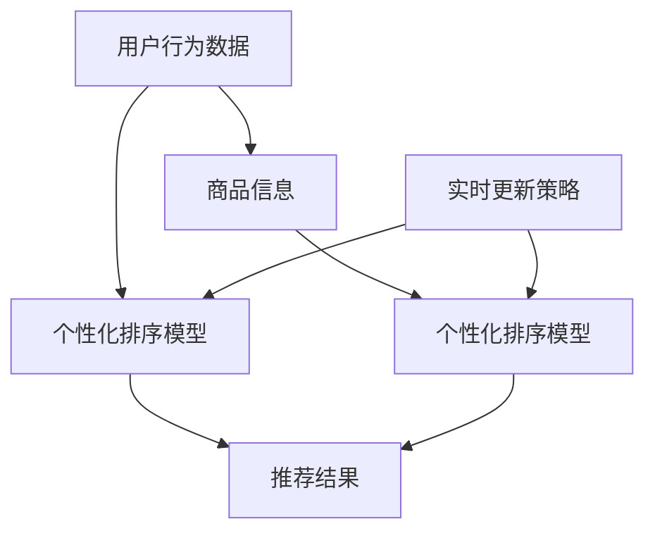

                 

# 电商搜索中的个性化排序模型实时更新

## 1. 背景介绍

随着电子商务的快速发展，各大电商平台都在积极探索如何提升用户体验，提升搜索效率和准确性。传统的基于关键词匹配的搜索算法已经难以满足用户的多样化需求。个性化排序模型（Personalized Ranking Model）应运而生，通过学习用户行为数据和商品特征，推荐最相关的搜索结果。

但随着用户需求和市场变化的不确定性增加，静态的个性化排序模型难以适应快速变化的市场环境。实时更新技术的应用，使个性化排序模型能够及时更新，更好地反映当前的用户需求和市场变化，从而提升电商搜索的个性化和效率。

## 2. 核心概念与联系

### 2.1 核心概念概述

- **个性化排序模型**：通过学习用户行为数据和商品特征，为用户推荐最相关的搜索结果。通常使用基于深度学习的方法，如循环神经网络、序列推荐模型等。

- **实时更新**：在模型训练后，动态获取最新的用户行为数据和商品信息，通过在线学习或增量更新策略，调整模型参数，以保持其预测能力的最新性。

- **在线学习**：一种实时更新的策略，在模型训练时，每次使用一个或多个样本进行更新，实现模型的动态调整。

- **增量更新**：一种适用于大规模数据集的实时更新策略，每次使用一批数据进行批量更新，减少单次更新的计算资源消耗。

- **特征融合**：将用户行为数据、商品特征、时间信息等多种因素综合考虑，提升模型预测的准确性和个性化水平。

- **用户画像**：基于用户行为数据构建的个性化描述，用于提升模型的个性化推荐能力。

### 2.2 核心概念原理和架构的 Mermaid 流程图



以上流程图展示了核心概念之间的联系：
1. 用户行为数据和商品信息输入到个性化排序模型。
2. 模型根据输入数据输出推荐结果。
3. 实时更新策略对模型进行动态调整，以反映最新的数据变化。

## 3. 核心算法原理 & 具体操作步骤

### 3.1 算法原理概述

个性化排序模型的核心思想是通过学习用户行为数据和商品特征，预测每个用户对每个商品的点击概率。假设用户对商品 $i$ 的点击概率为 $p_i$，用户行为数据为 $X$，商品特征为 $Y$，模型的预测公式为：

$$
p_i = \sigma(\hat{\theta}(X, Y))
$$

其中 $\sigma$ 为激活函数，$\hat{\theta}$ 为模型参数。

实时更新则是在模型训练后，动态获取最新的用户行为数据和商品信息，通过在线学习或增量更新策略，调整模型参数，以保持其预测能力的最新性。在线学习每次使用一个或多个样本进行更新，增量更新则每次使用一批数据进行批量更新。

### 3.2 算法步骤详解

#### 3.2.1 数据预处理

1. **数据清洗**：去除无效、缺失数据，对异常值进行处理。
2. **特征工程**：提取、融合各种特征，如用户行为、商品属性、时间戳等。
3. **划分数据集**：将数据集划分为训练集、验证集和测试集，确保模型在未知数据上的泛化性能。

#### 3.2.2 模型训练

1. **选择合适的模型架构**：如循环神经网络、序列推荐模型等，选择合适的激活函数、损失函数等。
2. **训练模型**：使用训练集进行模型训练，调整模型参数以最小化损失函数。
3. **验证模型**：在验证集上评估模型性能，调整超参数和模型架构。

#### 3.2.3 实时更新

1. **在线学习**：每次使用一个或多个样本进行模型更新，如使用梯度下降法更新模型参数。
2. **增量更新**：每次使用一批数据进行批量更新，减少单次更新的计算资源消耗。
3. **模型融合**：将在线学习结果与增量更新结果进行融合，提升模型的鲁棒性和准确性。

#### 3.2.4 模型评估与优化

1. **模型评估**：在测试集上评估模型性能，如使用AUC、PR曲线、精确率、召回率等指标。
2. **模型优化**：根据评估结果，调整模型架构、超参数、训练策略等，进一步提升模型性能。

### 3.3 算法优缺点

#### 3.3.1 优点

- **实时性**：通过实时更新，模型能够快速反映市场和用户需求的变化。
- **精度高**：通过在线学习和增量更新，模型能够不断优化，提升预测精度。
- **灵活性**：模型架构和超参数可以根据需要灵活调整，适应不同的应用场景。

#### 3.3.2 缺点

- **计算资源消耗大**：实时更新需要动态获取数据和调整模型，计算资源消耗较大。
- **复杂度高**：在线学习需要频繁更新模型参数，增量更新需要设计复杂的批处理策略，实现较为复杂。
- **稳定性差**：实时更新的过程中，模型可能会面临不稳定的情况，需要设计合理的更新策略。

### 3.4 算法应用领域

个性化排序模型实时更新的应用领域广泛，包括但不限于：
1. **电子商务**：提升搜索结果的个性化和准确性，提升用户满意度和转化率。
2. **金融服务**：根据用户行为数据，推荐个性化的金融产品，提升客户体验。
3. **广告投放**：根据用户画像和行为数据，推荐个性化的广告内容，提高广告效果。
4. **内容推荐**：根据用户兴趣和行为数据，推荐个性化的视频、音乐、文章等内容，提升用户体验。
5. **智能客服**：根据用户对话历史，推荐个性化的回答模板，提高客户满意度。

## 4. 数学模型和公式 & 详细讲解

### 4.1 数学模型构建

假设用户对商品 $i$ 的点击概率为 $p_i$，用户行为数据为 $X$，商品特征为 $Y$，模型的预测公式为：

$$
p_i = \sigma(\hat{\theta}(X, Y))
$$

其中 $\sigma$ 为激活函数，$\hat{\theta}$ 为模型参数。

模型的损失函数通常为交叉熵损失函数，定义为：

$$
L(p_i, y_i) = -y_i\log p_i - (1-y_i)\log(1-p_i)
$$

其中 $y_i$ 为实际标签（0或1），$p_i$ 为模型预测的概率。

### 4.2 公式推导过程

对于在线学习，假设每次使用样本 $(x_i, y_i)$，使用梯度下降法更新模型参数，则更新公式为：

$$
\theta_{t+1} = \theta_t - \eta \nabla_{\theta} L(p_i, y_i)
$$

其中 $\eta$ 为学习率，$\nabla_{\theta} L(p_i, y_i)$ 为损失函数对参数 $\theta$ 的梯度。

对于增量更新，假设每次使用一批数据 $(x_1, y_1), (x_2, y_2), ..., (x_n, y_n)$，使用梯度下降法批量更新模型参数，则更新公式为：

$$
\theta_{t+1} = \theta_t - \eta \nabla_{\theta} \sum_{i=1}^n L(p_i, y_i)
$$

其中 $\eta$ 为学习率，$\nabla_{\theta} \sum_{i=1}^n L(p_i, y_i)$ 为损失函数对参数 $\theta$ 的梯度。

### 4.3 案例分析与讲解

假设我们有一批新的用户行为数据 $(x_1, y_1), (x_2, y_2), ..., (x_n, y_n)$，其中 $x_i$ 为特征向量，$y_i$ 为点击标签。我们使用增量更新策略，将这批数据分成若干个批次进行更新。以第一个批次的更新为例：

1. **数据准备**：将第一个批次的样本 $(x_1, y_1), (x_2, y_2), ..., (x_n, y_n)$ 输入模型，计算预测概率 $p_i$ 和损失函数 $L(p_i, y_i)$。
2. **梯度计算**：计算损失函数对模型参数 $\theta$ 的梯度 $\nabla_{\theta} \sum_{i=1}^n L(p_i, y_i)$。
3. **模型更新**：使用梯度下降法批量更新模型参数，得到 $\theta_{t+1}$。
4. **验证模型**：在验证集上评估模型性能，根据评估结果，进一步调整模型参数。

## 5. 项目实践：代码实例和详细解释说明

### 5.1 开发环境搭建

在项目实践中，我们需要准备以下开发环境：

1. **数据准备**：收集用户行为数据和商品信息，并进行预处理和特征工程。
2. **模型选择**：选择适合的深度学习模型，如循环神经网络、序列推荐模型等。
3. **训练环境**：搭建深度学习训练环境，如TensorFlow、PyTorch等。
4. **实时更新环境**：搭建实时更新环境，如Kafka、Redis等。

### 5.2 源代码详细实现

以下是一个使用TensorFlow进行在线学习和增量更新的示例代码：

```python
import tensorflow as tf
import numpy as np

class PersonalizedRankingModel(tf.keras.Model):
    def __init__(self, input_size, output_size, hidden_size):
        super(PersonalizedRankingModel, self).__init__()
        self.fc1 = tf.keras.layers.Dense(hidden_size, activation='relu')
        self.fc2 = tf.keras.layers.Dense(output_size, activation='sigmoid')

    def call(self, inputs):
        x = self.fc1(inputs)
        x = self.fc2(x)
        return x

# 构建模型
model = PersonalizedRankingModel(input_size, output_size, hidden_size)

# 损失函数和优化器
loss_fn = tf.keras.losses.BinaryCrossentropy()
optimizer = tf.keras.optimizers.Adam()

# 在线学习函数
def online_learning(x, y):
    with tf.GradientTape() as tape:
        y_pred = model(x)
        loss = loss_fn(y_pred, y)
    grads = tape.gradient(loss, model.trainable_variables)
    optimizer.apply_gradients(zip(grads, model.trainable_variables))

# 增量更新函数
def batch_learning(X, Y):
    with tf.GradientTape() as tape:
        y_pred = model(X)
        loss = loss_fn(y_pred, Y)
    grads = tape.gradient(loss, model.trainable_variables)
    optimizer.apply_gradients(zip(grads, model.trainable_variables))

# 数据准备
X_train = np.random.rand(1000, input_size)
y_train = np.random.randint(0, 2, 1000)

# 训练模型
for i in range(epochs):
    online_learning(X_train, y_train)
    if i % 10 == 0:
        batch_learning(X_train, y_train)
```

### 5.3 代码解读与分析

**PersonalizedRankingModel类**：
- 定义了模型结构和参数。
- 使用TensorFlow的Dense层实现全连接网络。
- 使用ReLU激活函数和Sigmoid激活函数。

**在线学习函数online_learning**：
- 每次使用一个样本进行在线更新。
- 计算预测概率和损失函数。
- 计算梯度并使用Adam优化器更新模型参数。

**增量更新函数batch_learning**：
- 每次使用一批数据进行批量更新。
- 计算预测概率和损失函数。
- 计算梯度并使用Adam优化器批量更新模型参数。

**数据准备**：
- 随机生成训练数据X_train和标签y_train。
- 在线学习和增量更新交替进行。

**训练模型**：
- 在每个epoch内，交替使用在线学习函数和增量更新函数，更新模型参数。
- 每10个epoch输出模型性能。

## 6. 实际应用场景

### 6.1 电商搜索

电商搜索中的个性化排序模型实时更新，可以帮助电商平台提升搜索效率和用户满意度。用户输入搜索关键词后，模型根据用户历史行为和商品信息，实时更新推荐结果，提升搜索结果的相关性和个性化。

### 6.2 金融服务

金融服务中的个性化排序模型实时更新，可以帮助银行和金融机构推荐个性化的金融产品，提升客户体验和满意度。用户输入查询后，模型根据用户行为数据和商品特征，实时更新推荐结果，提供最适合的金融产品。

### 6.3 广告投放

广告投放中的个性化排序模型实时更新，可以帮助广告平台推荐个性化的广告内容，提高广告效果和投资回报率。用户输入查询后，模型根据用户行为数据和商品特征，实时更新推荐结果，提供最适合的广告内容。

### 6.4 内容推荐

内容推荐中的个性化排序模型实时更新，可以帮助视频、音乐、文章等平台推荐个性化的内容，提升用户体验和满意度。用户输入查询后，模型根据用户行为数据和商品特征，实时更新推荐结果，提供最适合的内容。

## 7. 工具和资源推荐

### 7.1 学习资源推荐

1. **TensorFlow官方文档**：详细介绍了TensorFlow的使用方法和深度学习模型的构建。
2. **PyTorch官方文档**：详细介绍了PyTorch的使用方法和深度学习模型的构建。
3. **Deep Learning for Recommender Systems**：介绍了深度学习在推荐系统中的应用，包含在线学习和增量更新等内容。
4. **On-Line Learning in Machine Learning and Statistical Theory**：介绍了在线学习的基本概念和算法。
5. **Adaptive Computation of Statistical Quantities and Support Vector Machines**：介绍了增量更新的基本概念和算法。

### 7.2 开发工具推荐

1. **TensorFlow**：深度学习框架，支持在线学习和增量更新。
2. **PyTorch**：深度学习框架，支持在线学习和增量更新。
3. **Kafka**：分布式消息队列，支持在线学习的消息传递。
4. **Redis**：内存数据库，支持增量更新的高效存储和访问。

### 7.3 相关论文推荐

1. **Online Learning with Generative Models**：介绍了在线学习的基本概念和算法。
2. **Adaptive Learning of Neural Networks**：介绍了增量更新的基本概念和算法。
3. **Adaptive Computation of Statistical Quantities and Support Vector Machines**：介绍了增量更新的基本概念和算法。
4. **Deep Learning for Recommender Systems**：介绍了深度学习在推荐系统中的应用，包含在线学习和增量更新等内容。

## 8. 总结：未来发展趋势与挑战

### 8.1 研究成果总结

本文对基于深度学习的个性化排序模型实时更新方法进行了详细讨论。从数据准备、模型构建、在线学习、增量更新等各个环节，全面介绍了实时更新的原理和步骤。通过详细分析，展示了实时更新的优点和缺点，并对实际应用场景进行了探讨。

### 8.2 未来发展趋势

未来，个性化排序模型实时更新将呈现以下几个发展趋势：
1. **多模态数据融合**：结合用户行为数据、商品信息、时间戳等多模态数据，提升模型的预测能力。
2. **分布式训练**：使用分布式深度学习框架，提升模型训练效率和实时更新能力。
3. **自适应学习**：使用自适应学习算法，提升模型对新数据和新用户的学习能力。
4. **联邦学习**：使用联邦学习算法，保护用户隐私的同时，提升模型的泛化能力。

### 8.3 面临的挑战

个性化排序模型实时更新面临以下挑战：
1. **计算资源消耗大**：实时更新需要频繁计算和更新模型参数，计算资源消耗较大。
2. **模型稳定性差**：实时更新的过程中，模型可能会面临不稳定的情况，需要设计合理的更新策略。
3. **数据质量不稳定**：实时更新的过程中，数据质量不稳定，可能存在噪声和偏差。
4. **模型复杂度高**：在线学习和增量更新的策略较为复杂，需要设计合理的批处理策略。

### 8.4 研究展望

未来，需要在以下几个方面进行深入研究：
1. **自适应学习算法**：研究自适应学习算法，提升模型对新数据和新用户的学习能力。
2. **多模态数据融合**：结合用户行为数据、商品信息、时间戳等多模态数据，提升模型的预测能力。
3. **分布式训练**：使用分布式深度学习框架，提升模型训练效率和实时更新能力。
4. **联邦学习**：使用联邦学习算法，保护用户隐私的同时，提升模型的泛化能力。
5. **模型压缩和优化**：研究模型压缩和优化方法，提升模型实时更新的效率和稳定性。

## 9. 附录：常见问题与解答

**Q1: 在线学习和增量更新的区别是什么？**

A: 在线学习每次使用一个或多个样本进行模型更新，增量更新每次使用一批数据进行批量更新。在线学习的计算资源消耗较小，但更新频率较高，增量更新的计算资源消耗较大，但更新频率较低。

**Q2: 如何选择合适的学习率和批处理大小？**

A: 选择合适的学习率和批处理大小需要根据数据量和计算资源进行权衡。通常可以使用学习率调参的方法，通过验证集的性能调整学习率，通过实验确定批处理大小。

**Q3: 实时更新需要考虑哪些因素？**

A: 实时更新需要考虑计算资源消耗、模型稳定性、数据质量、模型复杂度等因素。需要设计合理的更新策略，保证模型的实时性和准确性。

**Q4: 如何在分布式环境中进行实时更新？**

A: 在分布式环境中进行实时更新，可以使用分布式深度学习框架，如TensorFlow、PyTorch等。通过分布式计算和数据并行，提升实时更新的效率和稳定性。

**Q5: 如何处理实时更新中的噪声和偏差？**

A: 实时更新中的噪声和偏差可以通过数据清洗、特征工程、正则化等方法进行处理。同时可以使用增量更新策略，减少噪声和偏差的影响。

---

作者：禅与计算机程序设计艺术 / Zen and the Art of Computer Programming

