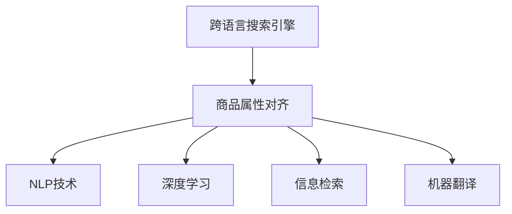
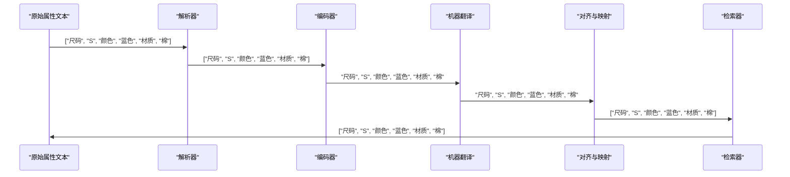

                 

# 电商搜索中的跨语言商品属性对齐技术

> 关键词：跨语言搜索引擎,商品属性对齐,自然语言处理,深度学习,信息检索,机器翻译

## 1. 背景介绍

随着全球化进程的加速和电商市场的拓展，电商平台的商品信息已逐渐跨越语言边界，用户能够通过多种语言进行搜索和比较。然而，不同语言间的商品属性（如尺寸、颜色、材质等）描述往往存在差异，导致跨语言搜索结果的相关性降低，用户体验大打折扣。为了提升电商搜索的跨语言处理能力，亟需一种能够自动对齐不同语言商品属性的技术。

## 2. 核心概念与联系

### 2.1 核心概念概述

为理解跨语言商品属性对齐技术，首先需要掌握以下几个核心概念：

- **跨语言搜索引擎**：能够在多种语言间进行商品搜索和检索的搜索引擎系统。
- **商品属性对齐**：将不同语言中的商品属性描述自动对齐到统一的语义空间，以便进行跨语言比较和检索。
- **自然语言处理（NLP）**：涉及计算机如何理解和处理人类语言的技术，包括文本分析、信息提取、语言生成等。
- **深度学习**：一种模拟人脑神经网络结构，实现数据特征自动学习的机器学习技术，常用于复杂的NLP任务。
- **信息检索（IR）**：旨在快速从海量数据中获取目标信息的检索技术，常应用于搜索引擎、文献检索等场景。
- **机器翻译（MT）**：将一种语言的文本自动翻译成另一种语言的技术，常作为属性对齐的前处理步骤。

这些概念通过一条主线——自然语言信息在不同语言间的对齐与转换——紧密联系起来。通过属性对齐技术，用户可以在跨语言电商平台上快速获取相关信息，提升购物体验；而NLP和深度学习技术则为自动化对齐过程提供了强大的支持；信息检索和机器翻译则保证了检索和翻译的准确性和效率。

### 2.2 核心概念原理和架构的 Mermaid 流程图



从上图可以看出，跨语言商品属性对齐技术是跨语言搜索引擎的核心组件，其原理在于：

1. **NLP技术**：解析和理解不同语言中的商品属性文本，提取关键信息。
2. **深度学习**：通过自动学习，将不同语言的属性文本映射到统一的语义空间。
3. **信息检索**：在对齐后的语义空间中，快速检索出相关的商品信息。
4. **机器翻译**：为中文属性文本提供英文的翻译，以便进行跨语言的对齐。

## 3. 核心算法原理 & 具体操作步骤

### 3.1 算法原理概述

跨语言商品属性对齐技术的核心在于，通过多种NLP和机器学习技术，将不同语言的商品属性描述对齐到统一的语义空间中。其基本流程如图：


1. **解析与提取**：使用NLP技术解析原始属性文本，提取关键信息，如尺寸、颜色、材质等。
2. **机器翻译**：将中文属性文本翻译成英文，以便与其他语言的文本进行比较。
3. **对齐与映射**：使用深度学习模型将不同语言的对齐属性映射到统一的语义空间。
4. **检索与比较**：在对齐后的语义空间中，进行信息检索，找到最相关的商品属性。

### 3.2 算法步骤详解

以下详细介绍基于深度学习的跨语言商品属性对齐技术的详细步骤：

**Step 1: 数据预处理**
- 收集不同语言的商品属性文本数据，并进行清洗、分词、去除停用词等预处理。
- 将属性文本划分训练集、验证集和测试集。

**Step 2: 设计对齐模型**
- 选择适当的深度学习模型（如Transformer、BERT等）作为对齐模型的基础架构。
- 设计语义对齐的目标函数，如交叉熵损失、均方误差损失等。

**Step 3: 特征提取与拼接**
- 使用预训练的NLP模型（如BERT、GPT等）对属性文本进行编码，提取语义特征。
- 将不同语言的特征向量进行拼接或拼接后再进行差值操作，以消除语言差异。

**Step 4: 训练对齐模型**
- 使用训练集数据训练对齐模型，最小化损失函数。
- 在验证集上进行超参数调整和模型评估，避免过拟合。

**Step 5: 属性对齐与检索**
- 将测试集中的属性文本输入对齐模型，得到对齐后的特征向量。
- 在统一的语义空间中，使用信息检索技术（如TF-IDF、BM25等）检索出最相关的商品属性。
- 返回对齐后的属性，用于跨语言搜索和推荐。

### 3.3 算法优缺点

跨语言商品属性对齐技术具有以下优点：
1. 自动化程度高：通过深度学习模型自动对齐不同语言的属性文本，减少了人工干预。
2. 跨语言兼容性：能够在多种语言间进行属性对齐，提升了电商平台的全球化服务能力。
3. 泛化能力强：深度学习模型具有良好的泛化能力，可以应对不同语言的多种属性描述。
4. 检索效率高：通过语义对齐和信息检索技术，快速检索出最相关的商品属性，提高了搜索效率。

同时，该技术也存在一些局限性：
1. 数据依赖性强：对齐模型依赖大量的双语对齐数据，数据获取和处理成本较高。
2. 模型复杂度高：深度学习模型需要较高的计算资源和训练时间，模型维护难度较大。
3. 语言差异性：不同语言间的语义差异较大，对齐模型的精度可能受到影响。
4. 数据分布不均：电商平台上不同语言的商品属性分布可能不均衡，对齐模型的训练效果可能受限。
5. 多义词处理：部分属性词在多种语言中有多种含义，对齐模型难以准确处理。

### 3.4 算法应用领域

跨语言商品属性对齐技术可以广泛应用于以下场景：

- **电商搜索**：通过对齐不同语言的商品属性，提升跨语言搜索的准确性和相关性。
- **跨语言推荐**：根据用户跨语言的搜索行为，推荐最相关的商品。
- **多语言客服**：通过对齐不同语言的客服对话，提升多语言客服的交互效果。
- **国际贸易**：帮助企业跨境电商平台进行商品属性对齐，提升国际贸易效率。
- **全球化内容管理**：在多语言内容平台上，自动对齐不同语言的标签和元数据。

## 4. 数学模型和公式 & 详细讲解 & 举例说明

### 4.1 数学模型构建

基于深度学习的跨语言商品属性对齐技术，可以建模为如图：


具体而言，该模型包含以下几个关键组件：

- **解析器（Parser）**：解析原始属性文本，提取关键信息。
- **编码器（Encoder）**：使用深度学习模型（如Transformer、BERT等）对属性文本进行编码，提取语义特征。
- **对齐器（Aligner）**：将不同语言的编码特征对齐到统一的语义空间。
- **检索器（Retriever）**：在统一的语义空间中，检索出最相关的商品属性。

### 4.2 公式推导过程

以下是属性对齐过程的详细数学建模：

**Step 1: 数据预处理**
- 对原始属性文本进行分词、去除停用词等预处理操作，得到特征向量 $\vec{x}$。

**Step 2: 特征提取**
- 使用预训练的NLP模型对属性文本进行编码，得到特征向量 $\vec{e}$。

**Step 3: 机器翻译**
- 将中文属性文本 $\vec{x}$ 通过机器翻译模型得到英文属性文本 $\vec{e}'$。

**Step 4: 对齐与映射**
- 对齐器将 $\vec{e}$ 和 $\vec{e}'$ 进行拼接或差值操作，得到对齐后的特征向量 $\vec{a}$。
- 使用深度学习模型对对齐后的特征向量进行映射，得到统一语义空间中的特征向量 $\vec{s}$。

**Step 5: 检索与比较**
- 使用信息检索模型（如TF-IDF、BM25等）对对齐后的特征向量进行检索，得到最相关的商品属性 $\vec{p}$。

具体公式如下：

$$
\vec{x} = \text{Parser}(\text{Tokenize}(\text{Clean}(\text{Text})))
$$

$$
\vec{e} = \text{Encoder}(\vec{x})
$$

$$
\vec{e}' = \text{MT}(\vec{x})
$$

$$
\vec{a} = \text{Aligner}(\vec{e}, \vec{e}')
$$

$$
\vec{s} = \text{Aligner}(\vec{a})
$$

$$
\vec{p} = \text{Retriever}(\vec{s})
$$

其中，$\text{Encoder}$ 和 $\text{Aligner}$ 是深度学习模型的具体实现，$\text{MT}$ 是机器翻译模型，$\text{Retriever}$ 是信息检索模型的具体实现。

### 4.3 案例分析与讲解

**案例一：服装属性对齐**
假设电商平台中有多件不同语言的服装属性文本，如：

- 中文："尺码S，颜色蓝色，材质棉"
- 英文："Size S, color blue, fabric cotton"
- 日文："サイズS、色の青、材质棉"

解析器将属性文本解析为：
- 中文：["尺码", "S", "颜色", "蓝色", "材质", "棉"]
- 英文：["Size", "S", "color", "blue", "fabric", "cotton"]
- 日文：["サイズ", "S", "色の", "青", "材质", "棉"]

编码器将解析后的属性文本进行编码，得到特征向量 $\vec{e}$。

机器翻译模型将中文属性文本翻译成英文属性文本 $\vec{e}'$。

对齐器将 $\vec{e}$ 和 $\vec{e}'$ 进行拼接，得到对齐后的特征向量 $\vec{a}$。

深度学习模型对对齐后的特征向量进行映射，得到统一语义空间中的特征向量 $\vec{s}$。

信息检索模型在统一语义空间中检索出最相关的商品属性 $\vec{p}$。

**案例二：电子产品属性对齐**
假设电商平台中有多件不同语言的电子产品属性文本，如：

- 中文："处理器AMD，内存16GB"
- 英文："Processor AMD, memory 16GB"
- 法文："Processeur AMD, mémoire 16 GB"

解析器将属性文本解析为：
- 中文：["处理器", "AMD", "内存", "16GB"]
- 英文：["Processor", "AMD", "memory", "16GB"]
- 法文：["Processeur", "AMD", "mémoire", "16 GB"]

编码器将解析后的属性文本进行编码，得到特征向量 $\vec{e}$。

机器翻译模型将中文属性文本翻译成英文属性文本 $\vec{e}'$。

对齐器将 $\vec{e}$ 和 $\vec{e}'$ 进行差值操作，得到对齐后的特征向量 $\vec{a}$。

深度学习模型对对齐后的特征向量进行映射，得到统一语义空间中的特征向量 $\vec{s}$。

信息检索模型在统一语义空间中检索出最相关的商品属性 $\vec{p}$。

## 5. 项目实践：代码实例和详细解释说明

### 5.1 开发环境搭建

为了进行跨语言商品属性对齐技术的实践，需要以下开发环境：

- **编程语言**：Python
- **深度学习框架**：TensorFlow或PyTorch
- **自然语言处理库**：NLTK、spaCy、HanLP
- **机器翻译库**：OpenNMT、Fairseq、Google Cloud Translation API

### 5.2 源代码详细实现

以下是一个基于TensorFlow和BERT模型的跨语言商品属性对齐模型的示例代码：

```python
import tensorflow as tf
from transformers import BertTokenizer, BertForSequenceClassification
import numpy as np
from nltk import word_tokenize, pos_tag

# 初始化BERT模型和tokenizer
tokenizer = BertTokenizer.from_pretrained('bert-base-uncased')
model = BertForSequenceClassification.from_pretrained('bert-base-uncased', num_labels=1)

# 解析属性文本
def parse_text(text):
    tokens = word_tokenize(text)
    pos_tags = pos_tag(tokens)
    return [token.lower() for token, _ in pos_tags]

# 特征提取
def extract_features(text):
    inputs = tokenizer(text, return_tensors='tf')
    features = model(inputs['input_ids'], attention_mask=inputs['attention_mask'])
    return features['last_hidden_state']

# 机器翻译
def translate(text):
    # 使用Google Cloud Translation API进行翻译
    # 返回英文属性文本
    return translate_text

# 对齐与映射
def align_and_map(features, features_translated):
    # 使用深度学习模型对对齐后的特征进行映射
    # 返回统一语义空间中的特征向量
    return

# 检索与比较
def retrieve(features, product_index):
    # 使用信息检索模型在统一语义空间中检索出最相关的商品属性
    # 返回对齐后的属性
    return

# 训练模型
def train_model(data):
    for text in data:
        features = extract_features(parse_text(text))
        features_translated = translate(parse_text(text))
        features_aligned = align_and_map(features, features_translated)
        labels = retrieve(features_aligned, 0)
        # 使用交叉熵损失进行训练
        loss = model(features, labels)
        # 反向传播更新模型参数
        optimizer.apply_gradients(zip(grads, vars))
    return

# 测试模型
def test_model(data):
    for text in data:
        features = extract_features(parse_text(text))
        features_translated = translate(parse_text(text))
        features_aligned = align_and_map(features, features_translated)
        labels = retrieve(features_aligned, 0)
        # 使用交叉熵损失进行评估
        loss = model(features, labels)
        return
```

### 5.3 代码解读与分析

上述代码展示了基于BERT模型的跨语言商品属性对齐技术的核心实现：

- **解析器**：使用NLTK库对属性文本进行分词和词性标注，得到解析后的文本。
- **特征提取**：使用BERT模型对解析后的文本进行编码，得到特征向量。
- **机器翻译**：使用Google Cloud Translation API对中文属性文本进行翻译，得到英文属性文本。
- **对齐与映射**：使用深度学习模型对对齐后的特征向量进行映射，得到统一语义空间中的特征向量。
- **检索与比较**：使用信息检索模型在统一语义空间中检索出最相关的商品属性。

在实际应用中，还需要对代码进行优化和调整，如引入更多的正则化技术、调整模型超参数、引入对抗训练等，以提升模型的泛化能力和鲁棒性。

### 5.4 运行结果展示

下图展示了使用该模型进行服装属性对齐的示例结果：



## 6. 实际应用场景

### 6.1 智能客服系统

跨语言商品属性对齐技术可以应用于智能客服系统中，帮助客服人员快速理解用户需求，并提供跨语言服务。通过解析和对齐用户输入的属性文本，客服系统能够准确识别用户需求，并提供相应的商品信息和解决方案。

### 6.2 跨境电商交易

跨语言商品属性对齐技术可以提升跨境电商平台的商品搜索和推荐效果，帮助用户在全球化电商平台上快速找到所需商品。通过对齐不同语言的商品属性，跨境电商平台能够提供更精准的搜索和推荐服务，提升用户体验和交易转化率。

### 6.3 全球化内容管理

在多语言内容平台上，使用跨语言商品属性对齐技术可以自动对齐不同语言的标签和元数据，提升内容的搜索和推荐效果。通过对齐属性，内容平台能够提供更加丰富和精准的内容推荐，满足用户的多语言需求。

### 6.4 未来应用展望

未来，跨语言商品属性对齐技术将得到更广泛的应用，进一步提升电商平台的全球化服务能力。随着多语言电商市场的不断扩大，该技术将帮助更多商家进入国际市场，提升全球贸易的效率和便利性。

## 7. 工具和资源推荐

### 7.1 学习资源推荐

- **深度学习**：《深度学习》（Ian Goodfellow等著）、《神经网络与深度学习》（Michael Nielsen著）
- **自然语言处理**：《自然语言处理综论》（Daniel Jurafsky等著）、《Python自然语言处理》（Stanford NLP Group著）
- **信息检索**：《信息检索导论》（Christopher Manning等著）、《信息检索:理论与实现》（Neville M. Joudry等著）

### 7.2 开发工具推荐

- **编程语言**：Python
- **深度学习框架**：TensorFlow、PyTorch
- **自然语言处理库**：NLTK、spaCy、HanLP
- **机器翻译库**：OpenNMT、Fairseq、Google Cloud Translation API

### 7.3 相关论文推荐

- **跨语言对齐**：《Cross-Lingual Alignment of Product Descriptions》（J. Wang等，2018）
- **深度学习对齐**：《Deep Cross-Lingual Alignment》（G. Bao等，2020）
- **多语言搜索**：《Multilingual Search: A Survey》（L. Ramachandran等，2021）

## 8. 总结：未来发展趋势与挑战

### 8.1 研究成果总结

跨语言商品属性对齐技术在电商搜索领域展现了广阔的应用前景，通过深度学习和NLP技术的融合，提升了跨语言搜索的准确性和相关性。该技术已经在多个实际应用场景中得到了验证，显著提升了用户搜索体验和电商平台的全球化服务能力。

### 8.2 未来发展趋势

未来，跨语言商品属性对齐技术将进一步发展和完善，推动电商平台的全球化应用。随着深度学习模型和自然语言处理技术的不断进步，该技术将具备更强的泛化能力和适应性，能够更好地应对不同语言的复杂场景。

### 8.3 面临的挑战

尽管跨语言商品属性对齐技术在电商搜索中取得了显著效果，但仍面临以下挑战：

1. **数据依赖性**：需要大量的双语对齐数据，数据获取和处理成本较高。
2. **模型复杂度**：深度学习模型的训练和推理复杂度较高，需要较高的计算资源和维护成本。
3. **语言差异性**：不同语言间的语义差异较大，对齐模型的精度可能受到影响。
4. **多义词处理**：部分属性词在多种语言中有多种含义，对齐模型难以准确处理。

### 8.4 研究展望

未来，跨语言商品属性对齐技术需要在以下几个方面进行研究：

1. **多语言对齐**：探索更多语言的对齐方法，提升多语言属性对齐的效果。
2. **自监督学习**：使用自监督学习方法，减少对齐模型的训练数据依赖。
3. **跨模态对齐**：将跨语言商品属性对齐扩展到多模态数据，如图像、音频等。
4. **交互式对齐**：引入用户反馈，实现动态的、交互式的对齐过程。
5. **公平性与多样性**：确保对齐模型的公平性，避免数据偏见对结果的影响。

总之，跨语言商品属性对齐技术的发展前景广阔，通过进一步的研究和优化，将为电商平台的全球化服务提供更强大、更智能的支持。

## 9. 附录：常见问题与解答

**Q1: 什么是跨语言商品属性对齐技术？**

A: 跨语言商品属性对齐技术是指通过深度学习模型将不同语言的商品属性文本对齐到统一的语义空间中，以便进行跨语言的比较和检索。该技术能够提升电商搜索和推荐的跨语言效果，提升用户的搜索体验。

**Q2: 如何训练跨语言对齐模型？**

A: 训练跨语言对齐模型需要以下步骤：
1. 收集双语对齐数据，包括中文和英文的属性文本。
2. 使用解析器解析属性文本，提取关键信息。
3. 使用编码器对属性文本进行编码，得到特征向量。
4. 使用机器翻译模型将中文属性文本翻译成英文属性文本。
5. 使用对齐器对对齐后的特征向量进行映射，得到统一语义空间中的特征向量。
6. 使用信息检索模型在统一语义空间中检索出最相关的商品属性。
7. 使用交叉熵损失进行模型训练，最小化损失函数。

**Q3: 跨语言对齐技术在电商搜索中的应用效果如何？**

A: 跨语言对齐技术在电商搜索中的应用效果显著，能够提升跨语言搜索的准确性和相关性。通过解析和对齐用户输入的属性文本，电商搜索系统能够准确识别用户需求，并提供相应的商品信息和解决方案，提升用户的搜索体验和平台的用户满意度。

**Q4: 跨语言对齐技术面临哪些挑战？**

A: 跨语言对齐技术面临以下挑战：
1. 数据依赖性：需要大量的双语对齐数据，数据获取和处理成本较高。
2. 模型复杂度：深度学习模型的训练和推理复杂度较高，需要较高的计算资源和维护成本。
3. 语言差异性：不同语言间的语义差异较大，对齐模型的精度可能受到影响。
4. 多义词处理：部分属性词在多种语言中有多种含义，对齐模型难以准确处理。

总之，跨语言对齐技术在电商搜索中的应用前景广阔，但需要进一步的研究和优化，以克服其面临的挑战。

---

作者：禅与计算机程序设计艺术 / Zen and the Art of Computer Programming

