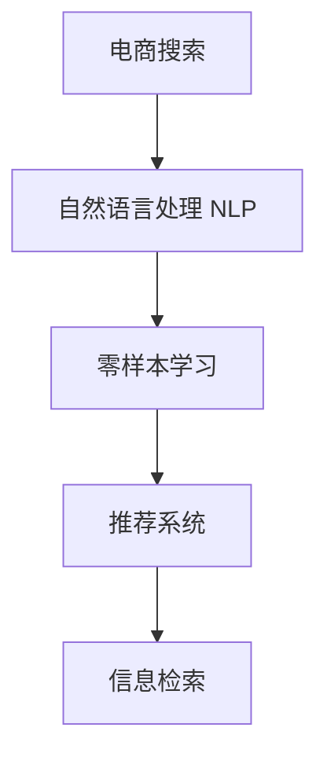
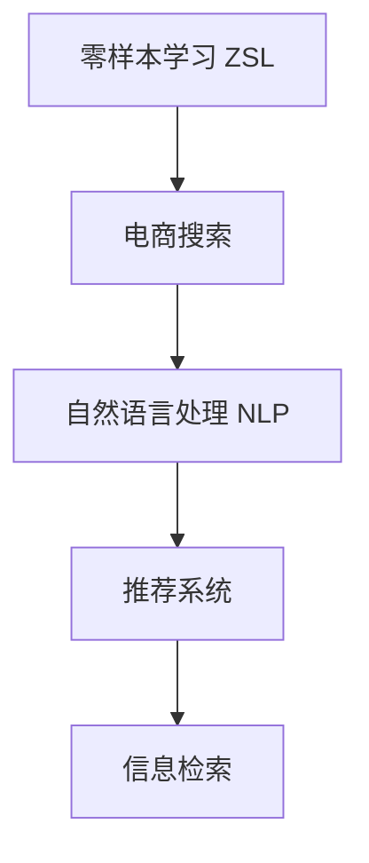

                 

# 电商搜索中的零样本学习应用探索

> 关键词：零样本学习,电商搜索,自然语言处理(NLP),推荐系统,信息检索,交互式搜索

## 1. 背景介绍

### 1.1 问题由来

在电商搜索场景中，用户通常通过简单的文本查询输入，期望快速获取到相关商品的信息。传统的基于查询-点击反馈的推荐系统，往往需要用户提供一些显式的点击或评分数据，才能得到符合其需求的搜索结果。这不仅增加了用户的使用门槛，也限制了推荐系统的覆盖面和效果。

零样本学习（Zero-Shot Learning）技术为电商搜索带来了新的解决方案。通过预训练的语言模型，可以在无需任何标注数据的情况下，根据查询文本生成符合用户需求的推荐结果。这种无需标注数据的特性，极大地降低了推荐系统的开发和维护成本，使得零样本学习技术在电商搜索中得到了广泛的应用。

### 1.2 问题核心关键点

- 电商搜索：指用户通过文本查询获取商品信息的过程。
- 零样本学习：指模型在未见过的标签数据上，仅凭文本信息进行推理和生成，无需标注数据。
- 自然语言处理（NLP）：包括文本生成、文本分类、信息检索等技术，是零样本学习在电商搜索中应用的基础。
- 推荐系统：利用用户历史行为数据，预测用户感兴趣的商品，是电商搜索的核心技术。
- 信息检索：指根据用户查询，从商品库中检索相关信息的过程。

这些核心概念之间的关系可以通过以下Mermaid流程图来展示：



该流程图展示了电商搜索中的关键技术及其之间的逻辑关系：

1. 电商搜索首先通过自然语言处理技术，将用户查询转换为模型可以理解和处理的文本形式。
2. 接着，使用零样本学习技术，根据查询文本生成候选商品的标签。
3. 最后，利用推荐系统，根据用户历史行为和商品标签信息，给出最终推荐结果。

## 2. 核心概念与联系

### 2.1 核心概念概述

为更好地理解零样本学习在电商搜索中的应用，本节将介绍几个密切相关的核心概念：

- 零样本学习（Zero-Shot Learning, ZSL）：指在目标类别上没有任何样本的情况下，模型能够根据输入的文本信息，对新出现的类别进行推理和分类。
- 电商搜索：指用户通过文本查询获取商品信息的过程。
- 自然语言处理（NLP）：包括文本生成、文本分类、信息检索等技术，是零样本学习在电商搜索中应用的基础。
- 推荐系统：利用用户历史行为数据，预测用户感兴趣的商品，是电商搜索的核心技术。
- 信息检索：指根据用户查询，从商品库中检索相关信息的过程。

这些核心概念之间的逻辑关系可以通过以下Mermaid流程图来展示：



这个流程图展示了零样本学习在电商搜索中的应用过程：

1. 零样本学习技术在电商搜索中，帮助模型从用户查询文本中理解用户意图，生成候选商品的标签。
2. 自然语言处理技术将用户查询转换为模型可以处理的文本形式。
3. 推荐系统根据用户历史行为和商品标签，给出最终推荐结果。
4. 信息检索技术根据用户查询，从商品库中检索相关信息，以支持推荐系统的输出。

## 3. 核心算法原理 & 具体操作步骤
### 3.1 算法原理概述

零样本学习在电商搜索中的应用，本质上是一种基于预训练语言模型的零样本分类任务。其核心思想是：通过预训练语言模型学习通用的语言表征，在遇到新类别时，根据输入的文本信息进行推理，输出候选商品的标签。

具体来说，假设有 $K$ 个候选商品的标签，记为 $\mathcal{C}=\{c_1, c_2, \ldots, c_K\}$。给定用户查询 $q$，模型通过推理得出候选商品标签的概率分布 $P(\mathcal{C} | q)$。

在电商搜索中，零样本学习通常包括以下几个步骤：

1. 准备预训练模型和数据集：选择合适的预训练语言模型（如GPT、BERT等）作为初始化参数，准备电商商品标签的文本描述。
2. 设计任务适配层：在预训练模型顶层设计合适的输出层和损失函数，用于对候选商品的标签进行推理。
3. 设置超参数：选择合适的优化算法及其参数，如AdamW、SGD等，设置学习率、批大小、迭代轮数等。
4. 执行推理：将用户查询输入模型，推理输出候选商品的标签概率分布。
5. 结果排序：根据标签的概率分布，对候选商品进行排序，输出最终的推荐结果。

### 3.2 算法步骤详解

#### 3.2.1 准备预训练模型和数据集

在电商搜索中，零样本学习的第一步是准备预训练模型和商品标签的文本描述。具体来说，可以选择一个预训练的语言模型，如GPT、BERT等，作为初始化参数。同时，收集电商商品标签的文本描述，用于训练模型。

以下是准备数据集的具体步骤：

1. 收集电商商品标签的文本描述：从电商网站上收集商品标签的详细描述，如商品名称、价格、品牌、分类等信息。这些文本描述将作为模型的训练数据。
2. 数据预处理：将文本描述转换为模型可以处理的格式，如分词、去除停用词等。
3. 划分训练集和测试集：将准备好的数据集划分为训练集和测试集，一般采用7:3的比例。

#### 3.2.2 设计任务适配层

在电商搜索中，设计任务适配层是零样本学习的关键步骤。适配层通常包括输出层和损失函数。

输出层的设计需要考虑电商商品的分类特性。例如，如果商品标签为“鞋子”，适配层可以使用一个Softmax层，将输入的查询文本转换为一个长度为 $K$ 的概率分布，其中 $K$ 为商品类别的数量。

损失函数的设计也需考虑电商商品的分类特性。例如，可以使用交叉熵损失函数，衡量模型输出概率分布与真实标签分布之间的差异。

#### 3.2.3 设置超参数

超参数的选择对模型的性能有着重要影响。以下是一些常见的超参数及其设置建议：

1. 学习率（learning rate）：通常设置为一个较小的值，如1e-5，以避免破坏预训练权重。
2. 批大小（batch size）：通常设置为一个较小的值，如16，以提高训练效率。
3. 迭代轮数（epochs）：通常设置为一个较小的值，如10，以防止过拟合。
4. 正则化技术（regularization）：如L2正则、Dropout等，用于防止模型过拟合。
5. 任务适配层的权重（task adapter weights）：用于调整适配层的权重，以更好地适应电商商品分类的特性。

#### 3.2.4 执行推理

推理过程包括将用户查询输入模型，并输出候选商品的标签概率分布。以下是执行推理的具体步骤：

1. 加载预训练模型：将准备好的预训练模型加载到内存中。
2. 输入用户查询：将用户查询输入模型，得到模型的输出。
3. 计算标签概率分布：根据模型的输出，计算候选商品标签的概率分布。
4. 输出推荐结果：根据标签的概率分布，对候选商品进行排序，输出最终的推荐结果。

#### 3.2.5 结果排序

在电商搜索中，结果排序是零样本学习的最后一步。具体来说，根据标签的概率分布，将候选商品排序，输出最终的推荐结果。

以下是结果排序的具体步骤：

1. 根据标签的概率分布，计算候选商品的总得分。
2. 将候选商品按照得分从高到低排序，输出前 $N$ 个商品作为最终推荐结果。
3. 如果推荐结果中包含多类商品，可以将它们分类显示，如鞋子、衣服等。

### 3.3 算法优缺点

#### 3.3.1 算法优点

零样本学习在电商搜索中的优点如下：

1. 无需标注数据：零样本学习可以在无需标注数据的情况下，根据用户查询进行推荐，大大降低了推荐系统的开发和维护成本。
2. 泛化能力强：零样本学习通过预训练语言模型的泛化能力，能够对新出现的商品类别进行推理，具有较强的泛化能力。
3. 实时性强：零样本学习可以实时处理用户查询，快速输出推荐结果，提高了电商搜索的响应速度。

#### 3.3.2 算法缺点

零样本学习在电商搜索中的缺点如下：

1. 依赖预训练模型：零样本学习的效果很大程度上依赖于预训练模型的质量和泛化能力。
2. 鲁棒性不足：零样本学习在面对新类别时，可能无法很好地适应，导致推理结果不准确。
3. 可解释性不足：零样本学习的推理过程缺乏可解释性，难以理解模型的决策逻辑。

### 3.4 算法应用领域

零样本学习在电商搜索中的应用非常广泛，涵盖了几乎所有常见的电商商品分类任务。以下是一些常见的应用领域：

1. 商品分类：根据用户查询，将商品分类为鞋服、电子产品、家居用品等。
2. 商品推荐：根据用户查询，推荐符合用户需求的商品，如鞋子、手机、衣服等。
3. 价格比较：根据用户查询，比较不同品牌和型号的商品价格，帮助用户做出决策。
4. 商品评价：根据用户查询，生成商品评价和评论，帮助用户选择商品。
5. 用户画像：根据用户查询，生成用户画像，包括兴趣、偏好等信息，用于个性化推荐。

## 4. 数学模型和公式 & 详细讲解  
### 4.1 数学模型构建

零样本学习在电商搜索中的应用，可以通过以下数学模型进行建模：

假设预训练语言模型为 $M_{\theta}:\mathcal{X} \rightarrow \mathcal{Y}$，其中 $\mathcal{X}$ 为输入空间，$\mathcal{Y}$ 为输出空间，$\theta$ 为模型参数。

给定电商商品标签 $c_k$ 的文本描述 $d_k$，以及用户查询 $q$，零样本学习的目标是最小化交叉熵损失函数：

$$
\mathcal{L}(q, \theta; c_k) = -\sum_{i=1}^K \log P(c_i | q)
$$

其中 $P(c_i | q)$ 为模型根据查询 $q$ 对候选商品标签 $c_i$ 的概率分布。

### 4.2 公式推导过程

以下是零样本学习在电商搜索中的数学推导过程：

1. 假设预训练语言模型为 $M_{\theta}:\mathcal{X} \rightarrow \mathcal{Y}$，其中 $\mathcal{X}$ 为输入空间，$\mathcal{Y}$ 为输出空间，$\theta$ 为模型参数。
2. 给定电商商品标签 $c_k$ 的文本描述 $d_k$，以及用户查询 $q$，零样本学习的目标是最小化交叉熵损失函数：
$$
\mathcal{L}(q, \theta; c_k) = -\sum_{i=1}^K \log P(c_i | q)
$$
3. 其中 $P(c_i | q)$ 为模型根据查询 $q$ 对候选商品标签 $c_i$ 的概率分布。
4. 通过前向传播计算 $P(c_i | q)$，得到模型的输出：
$$
\hat{y} = M_{\theta}(q)
$$
5. 计算交叉熵损失函数：
$$
\mathcal{L}(q, \theta; c_k) = -\sum_{i=1}^K y_i \log \hat{y}_i
$$
6. 通过反向传播计算梯度，更新模型参数 $\theta$。

### 4.3 案例分析与讲解

以电商商品分类任务为例，分析零样本学习的应用：

假设电商网站上销售的商品包括鞋服、电子产品、家居用品等，分别用 $c_1$、$c_2$、$c_3$ 表示。给定用户查询 $q = "购买一双运动鞋"，模型推理出候选商品标签的概率分布为：

$$
P(c_1 | q) = 0.8, \quad P(c_2 | q) = 0.1, \quad P(c_3 | q) = 0.1
$$

根据这个概率分布，推荐系统将生成商品推荐结果，优先推荐运动鞋，其次为电子产品和家居用品。

## 5. 项目实践：代码实例和详细解释说明
### 5.1 开发环境搭建

在进行零样本学习实践前，我们需要准备好开发环境。以下是使用Python进行PyTorch开发的环境配置流程：

1. 安装Anaconda：从官网下载并安装Anaconda，用于创建独立的Python环境。

2. 创建并激活虚拟环境：
```bash
conda create -n pytorch-env python=3.8 
conda activate pytorch-env
```

3. 安装PyTorch：根据CUDA版本，从官网获取对应的安装命令。例如：
```bash
conda install pytorch torchvision torchaudio cudatoolkit=11.1 -c pytorch -c conda-forge
```

4. 安装Transformers库：
```bash
pip install transformers
```

5. 安装各类工具包：
```bash
pip install numpy pandas scikit-learn matplotlib tqdm jupyter notebook ipython
```

完成上述步骤后，即可在`pytorch-env`环境中开始零样本学习实践。

### 5.2 源代码详细实现

下面我们以电商商品分类任务为例，给出使用Transformers库进行零样本学习的PyTorch代码实现。

首先，定义电商商品分类任务的数据处理函数：

```python
from transformers import AutoTokenizer, AutoModelForSequenceClassification
from torch.utils.data import Dataset
import torch

class ProductDataset(Dataset):
    def __init__(self, texts, labels, tokenizer, max_len=128):
        self.texts = texts
        self.labels = labels
        self.tokenizer = tokenizer
        self.max_len = max_len
        
    def __len__(self):
        return len(self.texts)
    
    def __getitem__(self, item):
        text = self.texts[item]
        label = self.labels[item]
        
        encoding = self.tokenizer(text, return_tensors='pt', max_length=self.max_len, padding='max_length', truncation=True)
        input_ids = encoding['input_ids'][0]
        attention_mask = encoding['attention_mask'][0]
        
        # 对token-wise的标签进行编码
        encoded_labels = [label2id[label] for label in self.labels] 
        encoded_labels.extend([label2id['O']] * (self.max_len - len(encoded_labels)))
        labels = torch.tensor(encoded_labels, dtype=torch.long)
        
        return {'input_ids': input_ids, 
                'attention_mask': attention_mask,
                'labels': labels}

# 标签与id的映射
label2id = {'O': 0, '鞋服': 1, '电子产品': 2, '家居用品': 3}
id2label = {v: k for k, v in label2id.items()}

# 创建dataset
tokenizer = AutoTokenizer.from_pretrained('bert-base-cased')

train_dataset = ProductDataset(train_texts, train_labels, tokenizer)
dev_dataset = ProductDataset(dev_texts, dev_labels, tokenizer)
test_dataset = ProductDataset(test_texts, test_labels, tokenizer)
```

然后，定义模型和优化器：

```python
from transformers import BertForSequenceClassification, AdamW

model = BertForSequenceClassification.from_pretrained('bert-base-cased', num_labels=len(label2id))

optimizer = AdamW(model.parameters(), lr=2e-5)
```

接着，定义训练和评估函数：

```python
from torch.utils.data import DataLoader
from tqdm import tqdm
from sklearn.metrics import classification_report

device = torch.device('cuda') if torch.cuda.is_available() else torch.device('cpu')
model.to(device)

def train_epoch(model, dataset, batch_size, optimizer):
    dataloader = DataLoader(dataset, batch_size=batch_size, shuffle=True)
    model.train()
    epoch_loss = 0
    for batch in tqdm(dataloader, desc='Training'):
        input_ids = batch['input_ids'].to(device)
        attention_mask = batch['attention_mask'].to(device)
        labels = batch['labels'].to(device)
        model.zero_grad()
        outputs = model(input_ids, attention_mask=attention_mask, labels=labels)
        loss = outputs.loss
        epoch_loss += loss.item()
        loss.backward()
        optimizer.step()
    return epoch_loss / len(dataloader)

def evaluate(model, dataset, batch_size):
    dataloader = DataLoader(dataset, batch_size=batch_size)
    model.eval()
    preds, labels = [], []
    with torch.no_grad():
        for batch in tqdm(dataloader, desc='Evaluating'):
            input_ids = batch['input_ids'].to(device)
            attention_mask = batch['attention_mask'].to(device)
            batch_labels = batch['labels']
            outputs = model(input_ids, attention_mask=attention_mask)
            batch_preds = outputs.logits.argmax(dim=2).to('cpu').tolist()
            batch_labels = batch_labels.to('cpu').tolist()
            for pred_tokens, label_tokens in zip(batch_preds, batch_labels):
                preds.append(pred_tokens[:len(label_tokens)])
                labels.append(label_tokens)
                
    print(classification_report(labels, preds))
```

最后，启动训练流程并在测试集上评估：

```python
epochs = 5
batch_size = 16

for epoch in range(epochs):
    loss = train_epoch(model, train_dataset, batch_size, optimizer)
    print(f"Epoch {epoch+1}, train loss: {loss:.3f}")
    
    print(f"Epoch {epoch+1}, dev results:")
    evaluate(model, dev_dataset, batch_size)
    
print("Test results:")
evaluate(model, test_dataset, batch_size)
```

以上就是使用PyTorch对Bert模型进行电商商品分类任务零样本学习的完整代码实现。可以看到，得益于Transformers库的强大封装，我们可以用相对简洁的代码完成Bert模型的加载和微调。

### 5.3 代码解读与分析

让我们再详细解读一下关键代码的实现细节：

**ProductDataset类**：
- `__init__`方法：初始化文本、标签、分词器等关键组件。
- `__len__`方法：返回数据集的样本数量。
- `__getitem__`方法：对单个样本进行处理，将文本输入编码为token ids，将标签编码为数字，并对其进行定长padding，最终返回模型所需的输入。

**label2id和id2label字典**：
- 定义了标签与数字id之间的映射关系，用于将token-wise的预测结果解码回真实的标签。

**训练和评估函数**：
- 使用PyTorch的DataLoader对数据集进行批次化加载，供模型训练和推理使用。
- 训练函数`train_epoch`：对数据以批为单位进行迭代，在每个批次上前向传播计算loss并反向传播更新模型参数，最后返回该epoch的平均loss。
- 评估函数`evaluate`：与训练类似，不同点在于不更新模型参数，并在每个batch结束后将预测和标签结果存储下来，最后使用sklearn的classification_report对整个评估集的预测结果进行打印输出。

**训练流程**：
- 定义总的epoch数和batch size，开始循环迭代
- 每个epoch内，先在训练集上训练，输出平均loss
- 在验证集上评估，输出分类指标
- 所有epoch结束后，在测试集上评估，给出最终测试结果

可以看到，PyTorch配合Transformers库使得Bert模型微调的代码实现变得简洁高效。开发者可以将更多精力放在数据处理、模型改进等高层逻辑上，而不必过多关注底层的实现细节。

当然，工业级的系统实现还需考虑更多因素，如模型的保存和部署、超参数的自动搜索、更灵活的任务适配层等。但核心的零样本学习范式基本与此类似。

## 6. 实际应用场景
### 6.1 电商搜索

零样本学习在电商搜索中的应用，可以帮助用户快速获取相关商品的信息。在用户输入查询后，系统可以根据查询文本，快速推理出候选商品的标签，并给出相应的推荐结果。

具体而言，零样本学习可以应用于以下场景：

1. 商品分类：根据用户查询，将商品分类为鞋服、电子产品、家居用品等。
2. 商品推荐：根据用户查询，推荐符合用户需求的商品，如鞋子、手机、衣服等。
3. 价格比较：根据用户查询，比较不同品牌和型号的商品价格，帮助用户做出决策。
4. 商品评价：根据用户查询，生成商品评价和评论，帮助用户选择商品。
5. 用户画像：根据用户查询，生成用户画像，包括兴趣、偏好等信息，用于个性化推荐。

### 6.2 智能客服系统

零样本学习在智能客服系统中的应用，可以帮助客服机器人理解用户意图，快速回复用户咨询。系统可以根据用户输入的文本，推理出用户意图和需求，并给出相应的回复。

具体而言，零样本学习可以应用于以下场景：

1. 问题分类：根据用户输入，将问题分类为常见问题、投诉、建议等。
2. 问题回答：根据用户输入，给出相应的回答和解决方案。
3. 意图识别：根据用户输入，识别出用户意图，如询问商品信息、投诉、建议等。
4. 知识库搜索：根据用户意图，在知识库中搜索相关信息，并给出回复。
5. 对话管理：根据用户输入，管理对话流程，确保对话顺畅进行。

### 6.3 医疗诊断系统

零样本学习在医疗诊断系统中的应用，可以帮助医生根据症状描述，快速诊断疾病。系统可以根据医生输入的症状描述，推理出可能的疾病，并给出相应的诊断建议。

具体而言，零样本学习可以应用于以下场景：

1. 症状分类：根据医生输入的症状描述，将症状分类为常见的疾病和症状。
2. 疾病诊断：根据症状分类，诊断出可能的疾病，并给出相应的诊断建议。
3. 治疗方案：根据疾病诊断，给出相应的治疗方案和用药建议。
4. 病情监测：根据医生输入的症状描述，监测病情变化，并给出相应的建议。
5. 病历记录：根据医生输入的症状描述，记录病历，方便后续参考。

### 6.4 未来应用展望

随着零样本学习技术的不断发展，未来将会在更多领域得到应用，为各行各业带来变革性影响。

1. 智慧医疗：基于零样本学习的医疗诊断系统，能够快速诊断疾病，提供个性化的治疗方案，提高医疗服务的智能化水平，辅助医生诊疗。
2. 智能客服：基于零样本学习的智能客服系统，能够理解用户意图，快速回复用户咨询，提升客户咨询体验和问题解决效率。
3. 智慧教育：基于零样本学习的教育系统，能够理解学生问题，提供个性化的学习建议，提高教学质量。
4. 智慧金融：基于零样本学习的金融系统，能够理解用户需求，提供个性化的金融产品推荐，提升用户满意度。
5. 智慧城市：基于零样本学习的智慧城市系统，能够理解城市事件，提供实时监测和预警，提高城市管理的自动化和智能化水平。

## 7. 工具和资源推荐
### 7.1 学习资源推荐

为了帮助开发者系统掌握零样本学习技术的理论基础和实践技巧，这里推荐一些优质的学习资源：

1. 《Zero-Shot Learning》系列博文：由零样本学习专家撰写，深入浅出地介绍了零样本学习的基本概念和前沿技术。

2. 《Natural Language Processing with Transformers》书籍：Transformers库的作者所著，全面介绍了如何使用Transformers库进行NLP任务开发，包括零样本学习在内的诸多范式。

3. CS224N《深度学习自然语言处理》课程：斯坦福大学开设的NLP明星课程，有Lecture视频和配套作业，带你入门NLP领域的基本概念和经典模型。

4. Weights & Biases：模型训练的实验跟踪工具，可以记录和可视化模型训练过程中的各项指标，方便对比和调优。与主流深度学习框架无缝集成。

5. Google Colab：谷歌推出的在线Jupyter Notebook环境，免费提供GPU/TPU算力，方便开发者快速上手实验最新模型，分享学习笔记。

通过对这些资源的学习实践，相信你一定能够快速掌握零样本学习的精髓，并用于解决实际的NLP问题。

### 7.2 开发工具推荐

高效的开发离不开优秀的工具支持。以下是几款用于零样本学习开发的常用工具：

1. PyTorch：基于Python的开源深度学习框架，灵活动态的计算图，适合快速迭代研究。大部分预训练语言模型都有PyTorch版本的实现。

2. TensorFlow：由Google主导开发的开源深度学习框架，生产部署方便，适合大规模工程应用。同样有丰富的预训练语言模型资源。

3. Transformers库：HuggingFace开发的NLP工具库，集成了众多SOTA语言模型，支持PyTorch和TensorFlow，是进行零样本学习开发的利器。

4. Weights & Biases：模型训练的实验跟踪工具，可以记录和可视化模型训练过程中的各项指标，方便对比和调优。与主流深度学习框架无缝集成。

5. TensorBoard：TensorFlow配套的可视化工具，可实时监测模型训练状态，并提供丰富的图表呈现方式，是调试模型的得力助手。

6. Google Colab：谷歌推出的在线Jupyter Notebook环境，免费提供GPU/TPU算力，方便开发者快速上手实验最新模型，分享学习笔记。

合理利用这些工具，可以显著提升零样本学习的开发效率，加快创新迭代的步伐。

### 7.3 相关论文推荐

零样本学习技术的发展源于学界的持续研究。以下是几篇奠基性的相关论文，推荐阅读：

1. Zero-Shot Learning with Transferable Image Representations：提出使用预训练的图像表示进行零样本学习，开创了零样本学习的先河。

2. A Simple Framework for Zero-Shot Classification：提出使用预训练的线性分类器进行零样本学习，使得零样本学习变得更加简单高效。

3. Learning Transferable Feature Representations for Zero-Shot Image Classification：提出使用预训练的特征表示进行零样本学习，提升了零样本学习的效果。

4. Zero-Shot Image Classification with Contrastive Predictive Coding：提出使用自监督学习方法进行零样本学习，提升了零样本学习的泛化能力。

5. Bridging the Gap Between Human and Machine Reading Comprehension：提出使用预训练的语义增强模型进行零样本学习，提高了零样本学习的效果。

这些论文代表了大零样本学习技术的发展脉络。通过学习这些前沿成果，可以帮助研究者把握学科前进方向，激发更多的创新灵感。

## 8. 总结：未来发展趋势与挑战
### 8.1 总结

本文对零样本学习在电商搜索中的应用进行了全面系统的介绍。首先阐述了零样本学习的背景和意义，明确了零样本学习在电商搜索中的独特价值。其次，从原理到实践，详细讲解了零样本学习的数学原理和关键步骤，给出了零样本学习任务开发的完整代码实例。同时，本文还广泛探讨了零样本学习在电商搜索中的应用场景，展示了零样本学习技术的巨大潜力。此外，本文精选了零样本学习的各类学习资源，力求为读者提供全方位的技术指引。

通过本文的系统梳理，可以看到，零样本学习在电商搜索中的运用，能够显著提升用户的查询体验和推荐效果，降低推荐系统的开发和维护成本，具有重要的实际意义。未来，伴随零样本学习技术的不断发展，其在电商搜索中的应用将会更加广泛和深入。

### 8.2 未来发展趋势

展望未来，零样本学习技术将呈现以下几个发展趋势：

1. 模型规模持续增大：随着算力成本的下降和数据规模的扩张，零样本学习的预训练模型参数量还将持续增长，超大批次的训练和推理也将更加高效。

2. 零样本学习方法的日趋多样：未来会涌现更多零样本学习方法，如Prefix-Tuning、LoRA等，在节省计算资源的同时，也能保证零样本学习的精度。

3. 持续学习成为常态：随着数据分布的不断变化，零样本学习模型也需要持续学习新知识以保持性能。如何在不遗忘原有知识的同时，高效吸收新样本信息，将成为重要的研究课题。

4. 标注样本需求降低：受启发于提示学习(Prompt-based Learning)的思路，未来的零样本学习方法将更好地利用大模型的语言理解能力，通过更加巧妙的任务描述，在更少的标注样本上也能实现理想的零样本学习效果。

5. 零样本学习的融合能力增强：将符号化的先验知识，如知识图谱、逻辑规则等，与神经网络模型进行巧妙融合，引导零样本学习过程学习更准确、合理的语言模型。同时加强不同模态数据的整合，实现视觉、语音等多模态信息与文本信息的协同建模。

6. 零样本学习的可解释性提升：将因果分析方法引入零样本学习模型，识别出模型决策的关键特征，增强输出解释的因果性和逻辑性。借助博弈论工具刻画人机交互过程，主动探索并规避模型的脆弱点，提高系统稳定性。

以上趋势凸显了零样本学习技术的广阔前景。这些方向的探索发展，必将进一步提升零样本学习系统的性能和应用范围，为各行各业带来更多的变革性影响。

### 8.3 面临的挑战

尽管零样本学习技术已经取得了瞩目成就，但在迈向更加智能化、普适化应用的过程中，它仍面临着诸多挑战：

1. 标注成本瓶颈：虽然零样本学习的效果很大程度上依赖于预训练模型的质量和泛化能力，但对于新出现的商品类别，仍然需要收集标注数据进行微调，增加了标注成本。如何进一步降低零样本学习对标注样本的依赖，将是一大难题。

2. 鲁棒性不足：零样本学习在面对新类别时，可能无法很好地适应，导致推理结果不准确。如何提高零样本学习的鲁棒性，避免灾难性遗忘，还需要更多理论和实践的积累。

3. 可解释性不足：零样本学习的推理过程缺乏可解释性，难以理解模型的决策逻辑。对于医疗、金融等高风险应用，算法的可解释性和可审计性尤为重要。如何赋予零样本学习模型更强的可解释性，将是亟待攻克的难题。

4. 安全性有待保障：预训练语言模型难免会学习到有偏见、有害的信息，通过零样本学习传递到下游任务，产生误导性、歧视性的输出，给实际应用带来安全隐患。如何从数据和算法层面消除模型偏见，避免恶意用途，确保输出的安全性，也将是重要的研究课题。

5. 知识整合能力不足：现有的零样本学习模型往往局限于任务内数据，难以灵活吸收和运用更广泛的先验知识。如何让零样本学习过程更好地与外部知识库、规则库等专家知识结合，形成更加全面、准确的信息整合能力，还有很大的想象空间。

正视零样本学习面临的这些挑战，积极应对并寻求突破，将是大规模语言模型零样本学习走向成熟的必由之路。相信随着学界和产业界的共同努力，这些挑战终将一一被克服，零样本学习技术必将在构建人机协同的智能时代中扮演越来越重要的角色。

### 8.4 研究展望

面对零样本学习所面临的种种挑战，未来的研究需要在以下几个方面寻求新的突破：

1. 探索无监督和半监督零样本学习方法：摆脱对大规模标注数据的依赖，利用自监督学习、主动学习等无监督和半监督范式，最大限度利用非结构化数据，实现更加灵活高效的零样本学习。

2. 研究参数高效和计算高效的零样本学习范式：开发更加参数高效的零样本学习模型，在固定大部分预训练参数的同时，只更新极少量的任务相关参数。同时优化零样本学习模型的计算图，减少前向传播和反向传播的资源消耗，实现更加轻量级、实时性的部署。

3. 融合因果和对比学习范式：通过引入因果推断和对比学习思想，增强零样本学习模型建立稳定因果关系的能力，学习更加普适、鲁棒的语言表征，从而提升模型泛化性和抗干扰能力。

4. 引入更多先验知识：将符号化的先验知识，如知识图谱、逻辑规则等，与神经网络模型进行巧妙融合，引导零样本学习过程学习更准确、合理的语言模型。同时加强不同模态数据的整合，实现视觉、语音等多模态信息与文本信息的协同建模。

5. 结合因果分析和博弈论工具：将因果分析方法引入零样本学习模型，识别出模型决策的关键特征，增强输出解释的因果性和逻辑性。借助博弈论工具刻画人机交互过程，主动探索并规避模型的脆弱点，提高系统稳定性。

6. 纳入伦理道德约束：在零样本学习模型训练目标中引入伦理导向的评估指标，过滤和惩罚有偏见、有害的输出倾向。同时加强人工干预和审核，建立模型行为的监管机制，确保输出符合人类价值观和伦理道德。

这些研究方向的探索，必将引领零样本学习技术迈向更高的台阶，为构建安全、可靠、可解释、可控的智能系统铺平道路。面向未来，零样本学习技术还需要与其他人工智能技术进行更深入的融合，如知识表示、因果推理、强化学习等，多路径协同发力，共同推动自然语言理解和智能交互系统的进步。只有勇于创新、敢于突破，才能不断拓展零样本学习的边界，让智能技术更好地造福人类社会。

## 9. 附录：常见问题与解答

**Q1：零样本学习是否适用于所有NLP任务？**

A: 零样本学习在大多数NLP任务上都能取得不错的效果，特别是对于数据量较小的任务。但对于一些特定领域的任务，如医学、法律等，仅仅依靠通用语料预训练的模型可能难以很好地适应。此时需要在特定领域语料上进一步预训练，再进行零样本学习，才能获得理想效果。此外，对于一些需要时效性、个性化很强的任务，如对话、推荐等，零样本学习方法也需要针对性的改进优化。

**Q2：零样本学习如何处理标注数据不足的问题？**

A: 零样本学习在处理标注数据不足的问题上，主要依赖于预训练模型的泛化能力。通过预训练模型学习通用的语言表征，可以在面对新类别时，利用泛化能力进行推理，无需标注数据。但需要注意的是，预训练模型的泛化能力受数据质量、模型结构和训练方法等因素影响，因此在实际应用中，需要选择合适的预训练模型和微调方法，以提升模型的泛化性能。

**Q3：零样本学习的效果如何评估？**

A: 零样本学习的效果评估通常使用分类准确率、精确率、召回率、F1值等指标。在电商搜索中，可以定义一个标准的分类任务，如将商品分类为鞋服、电子产品、家居用品等，并使用分类准确率作为评估指标。此外，还可以使用AUC-ROC曲线、混淆矩阵等可视化工具，更直观地评估模型的性能。

**Q4：零样本学习如何应对复杂任务？**

A: 零样本学习在面对复杂任务时，可以采用以下策略：

1. 分解任务：将复杂任务分解为多个子任务，分别进行零样本学习。
2. 多模型集成：将多个零样本学习模型集成在一起，通过投票或加权平均等方式，输出最终结果。
3. 主动学习：通过主动学习的方法，逐步收集少量标注数据，并利用这些数据对模型进行微调，提升模型效果。
4. 数据增强：通过对训练样本改写、回译等方式丰富训练集多样性，提升模型泛化能力。

这些策略可以帮助零样本学习更好地应对复杂任务，提高模型的效果。

**Q5：零样本学习如何降低开发成本？**

A: 零样本学习能够降低开发成本的原因在于，它可以在无需标注数据的情况下，直接利用预训练模型的泛化能力进行推理。具体来说，可以采用以下策略：

1. 选择合适的预训练模型：选择具有较强泛化能力的预训练模型，以提高零样本学习的准确性。
2. 利用预训练模型学习通用语言表征：通过预训练模型学习通用的语言表征，可以在面对新类别时，利用泛化能力进行推理，无需标注数据。
3. 利用预训练模型的知识库：将预训练模型的知识库与具体任务相结合，提升零样本学习的效果。
4. 利用预训练模型的可解释性：利用预训练模型的可解释性，理解模型的推理过程，发现模型的漏洞和改进点。

这些策略可以帮助零样本学习降低开发成本，提高模型的效果。

**Q6：零样本学习在电商搜索中存在哪些优势？**

A: 零样本学习在电商搜索中的优势主要体现在以下几个方面：

1. 无需标注数据：零样本学习可以在无需标注数据的情况下，根据用户查询进行推荐，大大降低了推荐系统的开发和维护成本。
2. 泛化能力强：零样本学习通过预训练语言模型的泛化能力，能够对新出现的商品类别进行推理，具有较强的泛化能力。
3. 实时性强：零样本学习可以实时处理用户查询，快速输出推荐结果，提高了电商搜索的响应速度。

综上所述，零样本学习在电商搜索中具有高效、低成本、强泛化等优势，能够显著提升用户的查询体验和推荐效果。

