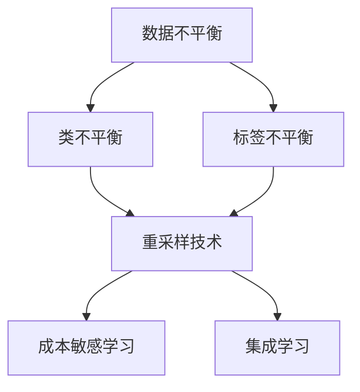

                 

# 电商搜索推荐中的AI大模型数据不平衡问题解决方案应用指南

## 1. 背景介绍

在电商搜索推荐领域，数据不平衡问题是一个普遍存在的挑战。具体而言，搜索场景中存在大量的无点击（no-click）数据，即用户只浏览了搜索结果但没有点击，这些数据在训练搜索推荐模型的过程中占比很高。而点击数据则相对稀少，包含用户真正的购买意图。数据不平衡导致了模型训练时，无点击数据和点击数据之间权重的不均衡，进而影响了模型的性能。

### 1.1 问题由来

在电商搜索推荐中，用户搜索行为是一个典型的长尾分布。大量用户搜索后并未点击，而真正产生购买意图的用户比例则很小。这种不平衡性使得搜索推荐模型在训练时，无点击数据量远远超过点击数据量，从而导致了模型对点击行为的预测能力不足。

### 1.2 问题核心关键点

电商搜索推荐中的数据不平衡问题主要体现在以下几个方面：

- 数据分布的不均衡：无点击数据量大，点击数据量少，导致模型训练时权重失衡。
- 类别不均衡：无点击和点击之间的类别分布不均衡，可能导致模型对罕见类别的预测能力差。
- 标签不均衡：无点击和点击的标签分布不均衡，可能使模型对正例（点击）的预测准确率较低。

这些核心关键点揭示了电商搜索推荐中数据不平衡问题的主要挑战。

### 1.3 问题研究意义

解决电商搜索推荐中的数据不平衡问题，有助于提升模型对点击行为的预测能力，进而提高推荐的准确性和用户满意度。具体意义如下：

1. **提升推荐准确性**：通过减轻数据不平衡对模型学习的影响，使模型更精准地预测用户点击意图。
2. **增加用户满意度**：通过更准确地推荐相关商品，提升用户的搜索体验和购买意愿。
3. **优化广告投放**：通过更准确地预测点击行为，优化广告的展示和投放策略，提高广告效果。

## 2. 核心概念与联系

### 2.1 核心概念概述

为更好地理解电商搜索推荐中的数据不平衡问题及解决方案，本节将介绍几个密切相关的核心概念：

- **数据不平衡问题**：指数据集中不同类别的样本数量分布不均，某一类别样本数量远大于其他类别。
- **类不平衡问题**：指不同类别样本之间的数量不平衡，可能导致模型对数量较少的类别预测能力不足。
- **标签不平衡问题**：指正例和负例标签之间的分布不均衡，可能导致模型对正例的预测准确率降低。
- **重采样技术**：通过增加少数类样本或减少多数类样本，调整数据分布，缓解不平衡问题。
- **成本敏感学习**：在损失函数中引入样本权重，赋予少数类样本更高的权重，平衡不同类别预测的损失。
- **集成学习**：通过结合多个分类器，提高模型的泛化能力和鲁棒性。

这些核心概念之间的逻辑关系可以通过以下Mermaid流程图来展示：



这个流程图展示了大数据不平衡问题及解决方案的核心概念及其之间的关系：

1. 数据不平衡引发了类不平衡和标签不平衡问题。
2. 通过重采样技术调整数据分布，可以缓解数据不平衡。
3. 成本敏感学习和集成学习进一步提升了模型的预测能力和泛化能力。

## 3. 核心算法原理 & 具体操作步骤

### 3.1 算法原理概述

解决电商搜索推荐中的数据不平衡问题，主要涉及重采样技术和成本敏感学习。这些技术的核心思想是通过调整数据分布和损失函数，使模型更公平地对待不同类别的样本，从而提升模型的预测能力。

### 3.2 算法步骤详解

#### 3.2.1 重采样技术

重采样技术包括欠采样（under-sampling）和过采样（over-sampling）两种方法，用于调整数据分布，缓解数据不平衡问题。

1. **欠采样**：通过随机删除多数类样本，减少多数类样本数量，使数据集分布更均衡。
2. **过采样**：通过复制少数类样本或生成合成样本，增加少数类样本数量，使数据集分布更均衡。

欠采样和过采样各有优缺点，具体应用需要根据数据集的实际情况和模型的性能需求进行选择。

#### 3.2.2 成本敏感学习

成本敏感学习通过在损失函数中引入样本权重，赋予少数类样本更高的权重，使得模型在预测少数类样本时更加重视。具体实现步骤如下：

1. **计算样本权重**：对于少数类样本，赋予更高的权重；对于多数类样本，赋予较低的权重。
2. **重构损失函数**：将原始损失函数乘以样本权重，调整不同类别的预测损失。
3. **训练模型**：使用重构后的损失函数进行模型训练，使模型更关注少数类样本的预测。

#### 3.2.3 集成学习

集成学习通过结合多个分类器，提高模型的泛化能力和鲁棒性。具体步骤如下：

1. **训练多个基分类器**：使用不同的数据采样和模型参数训练多个分类器。
2. **组合预测**：将多个分类器的预测结果进行加权平均，得到最终的预测结果。

集成学习可以有效提升模型的泛化能力，减少单个分类器因数据不平衡导致的性能下降。

### 3.3 算法优缺点

重采样技术、成本敏感学习和集成学习均能有效缓解电商搜索推荐中的数据不平衡问题，但各自也存在一定的局限性：

- **重采样技术的局限性**：
  - 欠采样可能导致信息丢失，多数类样本数量过少。
  - 过采样可能导致过拟合，合成样本质量较低。
  
- **成本敏感学习的局限性**：
  - 样本权重的设计复杂，需要根据具体问题进行调整。
  - 在损失函数中引入权重，可能会影响模型的收敛性。
  
- **集成学习的局限性**：
  - 需要训练多个分类器，增加了计算成本和模型复杂度。
  - 基分类器之间的权重分配需要仔细调整，否则可能导致性能下降。

尽管如此，这些技术仍是大模型在电商搜索推荐中应对数据不平衡问题的重要手段。通过合理组合和应用这些技术，可以在不同程度上缓解数据不平衡带来的问题，提升模型的性能。

### 3.4 算法应用领域

电商搜索推荐中的数据不平衡问题，通过上述算法得到了广泛的应用。具体应用领域包括：

- **点击率预测**：通过提升模型对点击行为的预测能力，提高推荐的相关性和准确性。
- **广告投放优化**：通过更准确地预测用户点击行为，优化广告的展示和投放策略。
- **个性化推荐**：通过缓解数据不平衡，提升模型对长尾商品的推荐能力。

这些应用领域展示了数据不平衡问题解决方案在大模型中的应用潜力，为电商搜索推荐系统的优化提供了重要支持。

## 4. 数学模型和公式 & 详细讲解

### 4.1 数学模型构建

为了更准确地描述电商搜索推荐中的数据不平衡问题，本节将构建一个包含两个类别的二分类模型，并引入数据不平衡问题的数学模型。

设训练集 $D=\{(x_i, y_i)\}_{i=1}^N$，其中 $x_i \in \mathcal{X}$ 为输入特征，$y_i \in \{0, 1\}$ 为标签。假设正例（点击）样本和负例（无点击）样本的分布不均衡，其中正例样本数量为 $n_+$，负例样本数量为 $n_-$。

定义损失函数 $\ell$ 为二分类交叉熵损失，则经验风险 $\mathcal{L}$ 可以表示为：

$$
\mathcal{L} = \frac{1}{N} \sum_{i=1}^N [y_i \log \hat{y_i} + (1-y_i) \log (1-\hat{y_i})]
$$

其中 $\hat{y_i} = f(x_i; \theta)$ 为模型预测概率，$f$ 为模型函数，$\theta$ 为模型参数。

### 4.2 公式推导过程

为缓解电商搜索推荐中的数据不平衡问题，可以引入成本敏感学习的思想。设样本权重为 $w_i$，则重构后的损失函数 $\mathcal{L}'$ 为：

$$
\mathcal{L}' = \frac{1}{N} \sum_{i=1}^N [w_i y_i \log \hat{y_i} + w_i (1-y_i) \log (1-\hat{y_i})]
$$

其中 $w_i = \frac{\omega}{p_i}$，$p_i$ 为第 $i$ 个样本的概率，$\omega$ 为样本权重。

对于正例样本，设 $p_+$ 为正例样本的概率，则 $w_+$ 应满足 $w_+ p_+ = 1$，即正例样本的权重应与正例样本的概率成反比。同理，对于负例样本，设 $p_-$ 为负例样本的概率，则 $w_-$ 应满足 $w_+ p_+ = 1$，即负例样本的权重应与负例样本的概率成反比。

### 4.3 案例分析与讲解

以点击率预测为例，假设训练集中正例样本数量为 $n_+$，负例样本数量为 $n_-$。设正例样本的概率 $p_+ = \frac{n_+}{N}$，负例样本的概率 $p_- = \frac{n_-}{N}$。则正例样本和负例样本的权重分别为：

$$
w_+ = \frac{\omega}{p_+} = \omega \cdot \frac{N}{n_+}
$$
$$
w_- = \frac{\omega}{p_-} = \omega \cdot \frac{N}{n_-}
$$

其中 $\omega$ 为样本权重。通过设置 $\omega$ 的值，可以调整正例和负例样本的权重，使模型更关注少数类样本。

假设 $\omega = 1$，则模型对正例和负例的预测损失比例为：

$$
\frac{w_+}{w_-} = \frac{n_-}{n_+}
$$

这表明模型对负例样本的预测损失是正例样本的 $\frac{n_-}{n_+}$ 倍，因此模型会更多关注负例样本的预测。

通过上述方法，可以在不改变模型架构的情况下，缓解电商搜索推荐中的数据不平衡问题，提升模型的性能。

## 5. 项目实践：代码实例和详细解释说明

### 5.1 开发环境搭建

在进行电商搜索推荐模型的开发时，需要准备好Python环境，并安装必要的库。以下是一个示例开发环境搭建步骤：

1. 安装Python 3.8，并确保pip和conda可用。
2. 安装scikit-learn库，用于数据处理和模型训练。
3. 安装pytorch库，用于深度学习模型的构建和训练。
4. 安装transformers库，用于加载和使用预训练语言模型。

### 5.2 源代码详细实现

以基于BERT模型的电商搜索推荐为例，代码实现步骤如下：

1. 加载数据集，分为训练集和测试集。
2. 对数据集进行预处理，包括文本分词、标签编码等。
3. 加载BERT模型，并进行微调。
4. 训练模型，并使用成本敏感学习调整样本权重。
5. 在测试集上评估模型性能。

代码实现示例如下：

```python
import torch
from torch import nn
from torch.utils.data import DataLoader, Dataset
from sklearn.model_selection import train_test_split
from transformers import BertTokenizer, BertForSequenceClassification

class SearchRecommendDataset(Dataset):
    def __init__(self, texts, labels, tokenizer, max_len=512):
        self.tokenizer = tokenizer
        self.texts = texts
        self.labels = labels
        self.max_len = max_len
        
    def __len__(self):
        return len(self.texts)
    
    def __getitem__(self, item):
        text = self.texts[item]
        label = self.labels[item]
        encoding = self.tokenizer(text, return_tensors='pt', max_length=self.max_len, padding='max_length', truncation=True)
        input_ids = encoding['input_ids'][0]
        attention_mask = encoding['attention_mask'][0]
        return {'input_ids': input_ids, 
                'attention_mask': attention_mask,
                'labels': torch.tensor(label, dtype=torch.long)}

# 加载数据集
train_texts, test_texts, train_labels, test_labels = train_test_split(train_data, test_data, test_size=0.2)

# 初始化tokenizer和模型
tokenizer = BertTokenizer.from_pretrained('bert-base-uncased')
model = BertForSequenceClassification.from_pretrained('bert-base-uncased', num_labels=2)

# 定义损失函数和优化器
criterion = nn.CrossEntropyLoss()
optimizer = torch.optim.Adam(model.parameters(), lr=2e-5)

# 定义样本权重计算函数
def compute_weights(train_labels):
    positive_count = len(train_labels[train_labels == 1])
    negative_count = len(train_labels[train_labels == 0])
    positive_weight = 1 / positive_count
    negative_weight = 1 / negative_count
    weights = torch.tensor([positive_weight if label == 1 else negative_weight for label in train_labels])
    return weights

# 训练模型
def train_epoch(model, train_loader, optimizer, criterion):
    model.train()
    total_loss = 0
    for batch in train_loader:
        input_ids = batch['input_ids'].to(device)
        attention_mask = batch['attention_mask'].to(device)
        labels = batch['labels'].to(device)
        model.zero_grad()
        outputs = model(input_ids, attention_mask=attention_mask)
        loss = criterion(outputs.logits, labels)
        total_loss += loss.item()
        loss.backward()
        optimizer.step()
    return total_loss / len(train_loader)

# 在训练集上训练模型
device = torch.device('cuda' if torch.cuda.is_available() else 'cpu')
model.to(device)
weights = compute_weights(train_labels)
train_loader = DataLoader(train_dataset, batch_size=32, shuffle=True)
optimizer = torch.optim.Adam(model.parameters(), lr=2e-5)

for epoch in range(10):
    loss = train_epoch(model, train_loader, optimizer, criterion)
    print(f"Epoch {epoch+1}, train loss: {loss:.3f}")

# 在测试集上评估模型
test_loader = DataLoader(test_dataset, batch_size=32)
with torch.no_grad():
    model.eval()
    total_correct = 0
    total_labels = 0
    for batch in test_loader:
        input_ids = batch['input_ids'].to(device)
        attention_mask = batch['attention_mask'].to(device)
        labels = batch['labels'].to(device)
        outputs = model(input_ids, attention_mask=attention_mask)
        _, predicted = torch.max(outputs.logits, 1)
        total_correct += (predicted == labels).sum().item()
        total_labels += labels.numel()
    accuracy = total_correct / total_labels
    print(f"Test accuracy: {accuracy:.3f}")
```

### 5.3 代码解读与分析

这段代码实现了基于BERT模型的电商搜索推荐模型，并在训练过程中引入了成本敏感学习，缓解了数据不平衡问题。

1. **数据集准备**：定义了一个`SearchRecommendDataset`类，用于处理训练数据和测试数据。
2. **模型加载**：加载预训练的BERT模型，并进行微调。
3. **样本权重计算**：定义了一个`compute_weights`函数，计算样本权重，并传递给优化器。
4. **模型训练**：使用优化器、损失函数和样本权重训练模型，并在测试集上评估模型性能。

代码中使用了`BertForSequenceClassification`模型，并定义了`compute_weights`函数来计算样本权重。通过将样本权重传递给优化器，可以在模型训练过程中自动调整不同类别样本的损失权重。

## 6. 实际应用场景

### 6.1 智能客服

在智能客服系统中，数据不平衡问题尤为突出。系统需要处理大量的无点击数据，而真正产生查询的用户比例很小。通过引入重采样技术和成本敏感学习，可以提升模型对少数类（查询）的预测能力，提高客服系统的响应速度和准确性。

### 6.2 个性化推荐

在个性化推荐系统中，数据不平衡问题同样存在。用户点击行为是少数类，而无点击行为是多数类。通过缓解数据不平衡，可以提升推荐系统对长尾商品的推荐能力，提高用户的满意度。

### 6.3 金融风险管理

在金融风险管理中，数据不平衡问题可能导致模型对罕见风险的预测能力不足。通过引入重采样技术和集成学习，可以提升模型对罕见风险的识别能力，提高金融风险管理的准确性。

### 6.4 未来应用展望

随着数据不平衡问题研究的深入，未来的电商搜索推荐系统将更加智能和高效。基于大数据不平衡问题的解决方案，未来电商搜索推荐系统将具备更强的预测能力和适应性，提升用户购物体验和商家转化率。

## 7. 工具和资源推荐

### 7.1 学习资源推荐

为了帮助开发者掌握电商搜索推荐中的数据不平衡问题及解决方案，以下是一些优质的学习资源：

1. **Coursera上的《机器学习基础》课程**：由斯坦福大学提供，讲解了机器学习的基本概念和算法，包括数据不平衡问题的解决思路。
2. **Kaggle上的电商推荐系统竞赛**：通过实际竞赛项目，了解数据不平衡问题的实际应用，并尝试解决实际问题。
3. **《数据挖掘：概念与技术》书籍**：详细讲解了数据不平衡问题及其解决方法，适合深度学习初学者。

### 7.2 开发工具推荐

电商搜索推荐中的数据不平衡问题解决方案，需要依赖Python和相关深度学习库。以下是一些推荐的开发工具：

1. **PyTorch**：用于深度学习模型的构建和训练，支持GPU加速，适合大规模模型训练。
2. **TensorFlow**：由Google提供，支持分布式计算和GPU加速，适合大规模模型训练和部署。
3. **Scikit-learn**：用于数据处理和模型训练，支持多种机器学习算法。
4. **Keras**：基于TensorFlow和Theano的高层API，适合快速构建深度学习模型。

### 7.3 相关论文推荐

数据不平衡问题在大模型中的应用，已经得到了广泛的研究。以下是几篇重要的相关论文，推荐阅读：

1. **《数据挖掘：概念与技术》书籍中的《数据不平衡问题》章节**：详细讲解了数据不平衡问题的定义、原因及解决方法。
2. **《机器学习中的数据不平衡问题》论文**：介绍了多种缓解数据不平衡问题的方法，包括重采样技术和成本敏感学习。
3. **《集成学习：减少数据不平衡影响的方法》论文**：提出了一种基于集成学习的缓解数据不平衡问题的方法，取得了较好的效果。

## 8. 总结：未来发展趋势与挑战

### 8.1 总结

本文对电商搜索推荐中的数据不平衡问题及解决方案进行了详细分析。首先介绍了数据不平衡问题的背景和意义，然后系统讲解了重采样技术、成本敏感学习和集成学习等关键技术。通过构建数学模型，分析了数据不平衡问题在电商搜索推荐中的应用，并通过代码实例演示了如何解决该问题。

通过本文的系统梳理，可以看到，数据不平衡问题在电商搜索推荐中是一个普遍存在的问题，但通过合理的解决方案，可以提升模型的性能和应用效果。

### 8.2 未来发展趋势

展望未来，电商搜索推荐中的数据不平衡问题仍将是研究的热点。未来发展趋势包括：

1. **智能化的重采样技术**：引入更多的重采样策略，如自适应重采样、对抗性重采样等，提升数据不平衡问题的解决效果。
2. **成本敏感学习的优化**：改进样本权重的计算方法，提升模型的泛化能力和鲁棒性。
3. **集成学习的拓展**：引入更多的基分类器，并优化基分类器之间的权重分配，提升模型性能。
4. **深度学习与传统方法的结合**：结合深度学习和传统机器学习技术，提升模型的预测能力和稳定性。

这些趋势将推动电商搜索推荐系统向更加智能化、高效化的方向发展。

### 8.3 面临的挑战

尽管数据不平衡问题解决方案在大模型中得到了广泛应用，但仍面临诸多挑战：

1. **数据不平衡问题的复杂性**：电商搜索推荐系统涉及多个数据源和多种特征，数据不平衡问题复杂多变。
2. **模型的泛化能力**：模型在实际应用中的泛化能力不足，难以适应多种应用场景。
3. **计算资源的需求**：大规模模型训练需要高性能计算资源，存在成本高昂的问题。
4. **模型的可解释性**：深度学习模型的黑盒特性，导致模型难以解释，无法满足高风险应用的需求。

这些挑战需要研究者在算法、工程、应用等多个方面进行深入探索和突破。

### 8.4 研究展望

未来的研究将集中在以下几个方面：

1. **数据不平衡问题的复杂化**：引入更多领域知识和先验信息，提升模型的泛化能力和鲁棒性。
2. **模型的可解释性**：开发更多可解释性强的深度学习模型，提升模型应用的透明度和可信度。
3. **计算资源的优化**：引入更高效的计算技术和方法，降低计算成本，提高模型训练和推理效率。
4. **跨领域应用的拓展**：将电商搜索推荐中的数据不平衡问题解决方案，应用到更多领域，推动人工智能技术的全面发展。

总之，电商搜索推荐中的数据不平衡问题仍是一个复杂而有趣的研究方向，未来需要更多的探索和突破。

## 9. 附录：常见问题与解答

### 9.1 电商搜索推荐中的数据不平衡问题是否适用于所有电商场景？

A: 电商搜索推荐中的数据不平衡问题适用于多种电商场景，但具体应用需要根据电商平台的实际情况进行调整。例如，某些电商平台可能存在较多的点击数据，而某些电商平台则可能存在较多的无点击数据，需要根据具体问题选择相应的解决方案。

### 9.2 如何选择合适的重采样策略？

A: 选择重采样策略时，需要根据数据集的实际情况和模型的性能需求进行评估。对于多数类样本数量较多的情况，可以选择欠采样策略；对于少数类样本数量较多的情况，可以选择过采样策略。同时，可以结合多种重采样策略，进行组合优化。

### 9.3 如何确定样本权重的大小？

A: 样本权重的确定需要根据具体问题和数据集的实际情况进行实验和调参。一般来说，可以通过交叉验证等方法，找到最优的样本权重。此外，可以通过调整样本权重的大小，平衡不同类别预测的损失，提升模型性能。

### 9.4 如何评估模型性能？

A: 模型性能的评估可以通过多种指标进行，例如准确率、召回率、F1分数等。在电商搜索推荐中，除了这些基本指标，还可以结合业务需求进行评估，例如点击率、转化率等。

通过本文的系统介绍，可以看到，电商搜索推荐中的数据不平衡问题及其解决方案，是大模型在电商领域应用的重要方向。通过合理的解决方案，可以提升模型的性能和应用效果，推动电商搜索推荐系统的智能化和高效化发展。未来，随着技术的不断进步，电商搜索推荐系统将更加智能和高效，为用户提供更好的购物体验。

