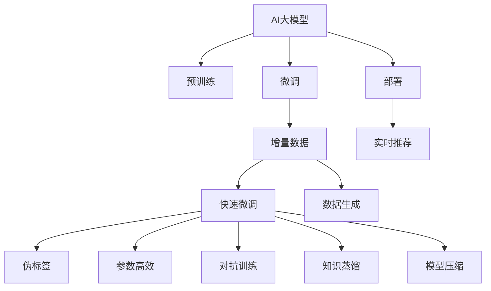

                 

# 电商搜索推荐中的AI大模型数据增量更新机制优化方案设计与实现

## 1. 背景介绍

### 1.1 问题由来
电商搜索推荐系统是电商平台的核心业务之一，旨在通过精准匹配用户查询意图和商品，提升用户体验和转化率。近年来，随着个性化推荐技术的发展，基于AI大模型的推荐系统成为业界主流，如谷歌的BERT、百度的ERNIE、阿里的PMI等。这些大模型通常采用预训练+微调的方式进行部署，先在大规模文本语料上预训练通用语言模型，再在其基础上进行用户和商品的上下文表示训练，从而获得高精度的推荐结果。

然而，电商数据日新月异，用户行为和商品属性实时动态变化，导致模型输出可能过时。为了保持模型的时效性，每隔一段时间需要对模型进行数据增量更新。如何设计高效的数据增量更新机制，快速适应新数据，同时保持模型性能的稳定，成为了电商推荐系统面临的一大挑战。

### 1.2 问题核心关键点
数据增量更新机制的核心问题在于如何在不损失已有模型性能的情况下，快速适应新数据。传统的静态微调方法会重新从头训练模型，时间成本高，且新旧数据之间可能存在冲突。为了提升模型在增量数据上的效果，同时避免过拟合，通常采用以下方法：

- 快速微调：使用小批量增量数据，以较小的学习率对模型进行微调，保留大部分预训练权重不变。
- 基于伪标签的数据生成：对于未标注的增量数据，通过统计或文本生成技术生成伪标签，用于增强数据集。
- 参数高效微调：只调整少量的模型参数，避免大规模参数更新。
- 知识蒸馏：将旧模型的知识传递给新模型，避免从头训练。
- 对抗训练：引入对抗样本，提高模型鲁棒性，减少模型过拟合。
- 轻量级模型：使用较轻量级的模型结构，减少计算资源消耗。

这些方法虽能缓解数据增量更新的问题，但仍然存在效率低下、易过拟合、无法灵活应对新场景等问题。

### 1.3 问题研究意义
电商搜索推荐中的AI大模型数据增量更新机制优化，对于提升推荐系统的实时性和准确性，增强用户体验和转化率具有重要意义：

1. 实时性：电商推荐系统需要快速响应用户查询，提供实时的推荐结果。数据增量更新机制能够使模型快速适应用户和商品的新变化，保证推荐内容的及时性。
2. 准确性：实时数据包含大量真实用户行为，通过数据增量更新机制，可以更准确地理解用户偏好和商品特征，提升推荐系统的准确性。
3. 用户体验：准确的推荐结果能够提高用户满意度，促进用户粘性和复购率。
4. 转化率：精准匹配用户需求和商品，提升商品转化率，增加电商平台收入。

因此，构建高效、稳定、灵活的数据增量更新机制，对于电商推荐系统的发展至关重要。

## 2. 核心概念与联系

### 2.1 核心概念概述

为更好地理解电商搜索推荐系统中AI大模型的数据增量更新机制，本节将介绍几个核心概念及其之间的联系：

- AI大模型：指基于大规模深度学习模型（如BERT、GPT、PMI等）进行预训练和微调，具备广泛语言表示能力的模型。
- 增量数据：指实时动态新增到推荐系统中的用户行为和商品属性数据。
- 数据增量更新：指通过增量数据对AI大模型进行微调的过程，以保持模型的时效性和准确性。
- 伪标签：指对未标注的增量数据进行统计或生成标签的过程，用于增强训练集。
- 参数高效微调：指在微调过程中只更新少量的模型参数，避免大规模参数更新。
- 对抗训练：指在训练过程中引入对抗样本，提高模型鲁棒性和泛化能力。
- 知识蒸馏：指将旧模型的知识传递给新模型，保持模型性能的连续性。
- 模型压缩：指对大模型进行压缩和优化，减小计算资源消耗，提升模型推理效率。

这些概念之间的联系和相互作用，构成了电商搜索推荐系统中的AI大模型数据增量更新机制。

### 2.2 核心概念原理和架构的 Mermaid 流程图



该图展示了从AI大模型的预训练、微调，到增量数据的快速微调、数据生成、参数高效、对抗训练、知识蒸馏、模型压缩等各环节的联系和流程。

## 3. 核心算法原理 & 具体操作步骤

### 3.1 算法原理概述

电商搜索推荐系统中的AI大模型数据增量更新机制，本质上是基于监督学习的增量微调过程。其核心思想是：在已有模型基础上，使用增量数据对模型进行快速微调，同时保留大部分预训练权重，以保持模型的稳定性和性能。

形式化地，假设已有模型为 $M_{\theta}$，其中 $\theta$ 为模型参数。给定增量数据集 $D_{\text{new}}=\{(x_i,y_i)\}_{i=1}^N$，增量微调的目标是找到新的模型参数 $\hat{\theta}$，使得：

$$
\hat{\theta}=\mathop{\arg\min}_{\theta} \mathcal{L}(M_{\theta},D_{\text{new}})
$$

其中 $\mathcal{L}$ 为针对增量数据设计的损失函数，用于衡量模型预测输出与真实标签之间的差异。常见的损失函数包括交叉熵损失、均方误差损失等。

通过梯度下降等优化算法，增量微调过程不断更新模型参数 $\theta$，最小化损失函数 $\mathcal{L}$，使得模型输出逼近真实标签。由于 $\theta$ 已经通过预训练获得了较好的初始化，因此即便在增量数据集上进行微调，也能较快收敛到理想的模型参数 $\hat{\theta}$。

### 3.2 算法步骤详解

电商搜索推荐系统中的AI大模型数据增量更新机制通常包括以下关键步骤：

**Step 1: 准备增量数据和预训练模型**
- 收集电商平台的用户行为和商品属性数据，筛选出新增的数据。
- 使用预训练语言模型对增量数据进行上下文表示学习，生成文本编码。

**Step 2: 生成伪标签**
- 对未标注的增量数据进行统计或生成标签，构建完整的训练集。
- 对于分类任务，使用交叉验证等方法生成伪标签。
- 对于生成任务，使用文本生成模型生成伪标签。

**Step 3: 设置增量微调超参数**
- 选择合适的优化算法及其参数，如 AdamW、SGD 等，设置学习率、批大小、迭代轮数等。
- 设置正则化技术及强度，包括权重衰减、Dropout、Early Stopping 等。
- 确定冻结预训练参数的策略，如仅微调顶层，或全部参数都参与微调。

**Step 4: 执行增量微调**
- 将增量数据分批次输入模型，前向传播计算损失函数。
- 反向传播计算参数梯度，根据设定的优化算法和学习率更新模型参数。
- 周期性在验证集上评估模型性能，根据性能指标决定是否触发 Early Stopping。
- 重复上述步骤直到满足预设的迭代轮数或 Early Stopping 条件。

**Step 5: 测试和部署**
- 在测试集上评估增量微调后模型 $M_{\hat{\theta}}$ 的性能，对比微调前后的精度提升。
- 使用增量微调后的模型对新样本进行推理预测，集成到实际的应用系统中。
- 持续收集新的数据，定期重新增量微调模型，以适应数据分布的变化。

以上是增量微调的一般流程。在实际应用中，还需要针对具体任务的特点，对增量微调过程的各个环节进行优化设计，如改进训练目标函数，引入更多的正则化技术，搜索最优的超参数组合等，以进一步提升模型性能。

### 3.3 算法优缺点

增量微调具有以下优点：
1. 时间成本低。使用增量微调方法，仅对新数据进行微调，大大缩短了模型更新的时间。
2. 性能稳定。大部分预训练权重不变，避免了从头训练带来的性能波动。
3. 灵活性高。增量微调能够及时适应新数据，保持模型的时效性。
4. 泛化能力强。增量微调能够保留预训练模型的泛化能力，提升模型在新场景下的适应性。

同时，该方法也存在一些局限性：
1. 易过拟合。在增量微调过程中，新数据与已有数据之间可能存在冲突，导致模型过拟合。
2. 数据依赖度高。增量微调的效果很大程度上取决于增量数据的质量和数量，获取高质量增量数据的成本较高。
3. 可解释性不足。增量微调模型缺乏可解释性，难以对其推理逻辑进行分析和调试。

尽管存在这些局限性，但增量微调仍是电商推荐系统中最常用的更新机制之一。未来相关研究的重点在于如何进一步降低增量数据对标注样本的依赖，提高模型的少样本学习和跨领域迁移能力，同时兼顾可解释性和伦理安全性等因素。

### 3.4 算法应用领域

增量微调方法在电商搜索推荐系统中，具有广泛的应用场景，例如：

- 用户行为分析：对用户浏览、点击、购买等行为数据进行增量微调，学习用户偏好和行为特征。
- 商品属性标注：对商品属性数据进行增量微调，更新商品标签和分类信息。
- 用户评分预测：对用户对商品的评分数据进行增量微调，提高评分预测的准确性。
- 广告推荐：对广告数据进行增量微调，提升广告推荐的精准度。
- 商品搜索优化：对搜索查询数据进行增量微调，优化搜索结果排序。

除了上述这些经典应用外，增量微调还被创新性地应用到更多场景中，如实时个性化推荐、用户画像构建、广告效果评估等，为电商推荐系统带来了全新的突破。

## 4. 数学模型和公式 & 详细讲解 & 举例说明

### 4.1 数学模型构建

假设已有模型为 $M_{\theta}$，增量数据集为 $D_{\text{new}}=\{(x_i,y_i)\}_{i=1}^N$，其中 $x_i$ 为输入文本，$y_i$ 为标签。增量微调的目标是最小化损失函数 $\mathcal{L}(M_{\theta},D_{\text{new}})$，即：

$$
\hat{\theta}=\mathop{\arg\min}_{\theta} \mathcal{L}(M_{\theta},D_{\text{new}})
$$

其中 $\mathcal{L}$ 为针对增量数据设计的损失函数，如交叉熵损失。假设模型 $M_{\theta}$ 在输入 $x$ 上的输出为 $\hat{y}=M_{\theta}(x)$，则二分类交叉熵损失函数为：

$$
\ell(M_{\theta}(x),y) = -[y\log \hat{y} + (1-y)\log (1-\hat{y})]
$$

增量微调的目标是最小化增量数据上的损失函数，即：

$$
\mathcal{L}(\theta)=\frac{1}{N}\sum_{i=1}^N \ell(M_{\theta}(x_i),y_i)
$$

### 4.2 公式推导过程

以下是增量微调的数学公式推导：

假设增量数据集为 $D_{\text{new}}=\{(x_i,y_i)\}_{i=1}^N$，其中 $x_i$ 为输入文本，$y_i$ 为标签。增量微调的目标是最小化损失函数 $\mathcal{L}(M_{\theta},D_{\text{new}})$，即：

$$
\hat{\theta}=\mathop{\arg\min}_{\theta} \mathcal{L}(M_{\theta},D_{\text{new}})
$$

其中 $\mathcal{L}$ 为针对增量数据设计的损失函数，如交叉熵损失。假设模型 $M_{\theta}$ 在输入 $x$ 上的输出为 $\hat{y}=M_{\theta}(x)$，则二分类交叉熵损失函数为：

$$
\ell(M_{\theta}(x),y) = -[y\log \hat{y} + (1-y)\log (1-\hat{y})]
$$

增量微调的目标是最小化增量数据上的损失函数，即：

$$
\mathcal{L}(\theta)=\frac{1}{N}\sum_{i=1}^N \ell(M_{\theta}(x_i),y_i)
$$

通过梯度下降等优化算法，增量微调过程不断更新模型参数 $\theta$，最小化损失函数 $\mathcal{L}$，使得模型输出逼近真实标签。由于 $\theta$ 已经通过预训练获得了较好的初始化，因此即便在增量数据集上进行微调，也能较快收敛到理想的模型参数 $\hat{\theta}$。

### 4.3 案例分析与讲解

以电商平台的用户评分预测为例，展示增量微调的具体应用。

假设电商平台有用户评分数据 $D=\{(x_i,y_i)\}_{i=1}^N$，其中 $x_i$ 为商品描述文本，$y_i$ 为用户评分。用户在商品页面浏览后给出评分，数据为历史数据，存在时间延迟。为了实时更新评分预测模型，需要对新评分数据进行增量微调。

首先，使用预训练语言模型对新评分数据进行上下文表示学习，生成文本编码：

$$
\tilde{x_i}=M_{\theta}(x_i)
$$

然后，对增量数据进行数据生成，生成伪标签：

$$
\hat{y_i}=\mathcal{G}(\tilde{x_i})
$$

其中 $\mathcal{G}$ 为文本生成模型，如GPT-3。接着，对生成后的增量数据进行增量微调：

$$
\theta \leftarrow \theta - \eta \nabla_{\theta}\mathcal{L}(\theta)
$$

其中 $\eta$ 为学习率，$\nabla_{\theta}\mathcal{L}(\theta)$ 为损失函数对参数 $\theta$ 的梯度。最后，在测试集上评估微调后模型的评分预测效果：

$$
\text{Accuracy}=\frac{1}{M}\sum_{i=1}^M \mathcal{L}(M_{\hat{\theta}}(x_i),y_i)
$$

通过以上步骤，可以实现电商平台的实时评分预测，提升用户评分预测的准确性。

## 5. 项目实践：代码实例和详细解释说明

### 5.1 开发环境搭建

在进行增量微调实践前，我们需要准备好开发环境。以下是使用Python进行PyTorch开发的环境配置流程：

1. 安装Anaconda：从官网下载并安装Anaconda，用于创建独立的Python环境。

2. 创建并激活虚拟环境：
```bash
conda create -n pytorch-env python=3.8 
conda activate pytorch-env
```

3. 安装PyTorch：根据CUDA版本，从官网获取对应的安装命令。例如：
```bash
conda install pytorch torchvision torchaudio cudatoolkit=11.1 -c pytorch -c conda-forge
```

4. 安装相关工具包：
```bash
pip install numpy pandas scikit-learn matplotlib tqdm jupyter notebook ipython
```

完成上述步骤后，即可在`pytorch-env`环境中开始增量微调实践。

### 5.2 源代码详细实现

这里我们以电商平台的用户评分预测为例，给出使用PyTorch对BERT模型进行增量微调的PyTorch代码实现。

首先，定义评分预测任务的数据处理函数：

```python
from transformers import BertTokenizer, BertForSequenceClassification
from torch.utils.data import Dataset, DataLoader
import torch

class ReviewDataset(Dataset):
    def __init__(self, reviews, labels, tokenizer, max_len=128):
        self.reviews = reviews
        self.labels = labels
        self.tokenizer = tokenizer
        self.max_len = max_len
        
    def __len__(self):
        return len(self.reviews)
    
    def __getitem__(self, item):
        review = self.reviews[item]
        label = self.labels[item]
        
        encoding = self.tokenizer(review, return_tensors='pt', max_length=self.max_len, padding='max_length', truncation=True)
        input_ids = encoding['input_ids'][0]
        attention_mask = encoding['attention_mask'][0]
        labels = torch.tensor([label], dtype=torch.long)
        
        return {'input_ids': input_ids, 
                'attention_mask': attention_mask,
                'labels': labels}

# 标签与id的映射
label2id = {'1': 1, '2': 2, '3': 3, '4': 4}
id2label = {v: k for k, v in label2id.items()}

# 创建dataset
tokenizer = BertTokenizer.from_pretrained('bert-base-cased')

train_dataset = ReviewDataset(train_reviews, train_labels, tokenizer)
dev_dataset = ReviewDataset(dev_reviews, dev_labels, tokenizer)
test_dataset = ReviewDataset(test_reviews, test_labels, tokenizer)
```

然后，定义模型和优化器：

```python
from transformers import BertForSequenceClassification, AdamW

model = BertForSequenceClassification.from_pretrained('bert-base-cased', num_labels=len(label2id))

optimizer = AdamW(model.parameters(), lr=2e-5)
```

接着，定义训练和评估函数：

```python
from torch.utils.data import DataLoader
from tqdm import tqdm
from sklearn.metrics import accuracy_score

device = torch.device('cuda') if torch.cuda.is_available() else torch.device('cpu')
model.to(device)

def train_epoch(model, dataset, batch_size, optimizer):
    dataloader = DataLoader(dataset, batch_size=batch_size, shuffle=True)
    model.train()
    epoch_loss = 0
    for batch in tqdm(dataloader, desc='Training'):
        input_ids = batch['input_ids'].to(device)
        attention_mask = batch['attention_mask'].to(device)
        labels = batch['labels'].to(device)
        model.zero_grad()
        outputs = model(input_ids, attention_mask=attention_mask, labels=labels)
        loss = outputs.loss
        epoch_loss += loss.item()
        loss.backward()
        optimizer.step()
    return epoch_loss / len(dataloader)

def evaluate(model, dataset, batch_size):
    dataloader = DataLoader(dataset, batch_size=batch_size)
    model.eval()
    preds, labels = [], []
    with torch.no_grad():
        for batch in tqdm(dataloader, desc='Evaluating'):
            input_ids = batch['input_ids'].to(device)
            attention_mask = batch['attention_mask'].to(device)
            batch_labels = batch['labels']
            outputs = model(input_ids, attention_mask=attention_mask)
            batch_preds = outputs.logits.argmax(dim=1).to('cpu').tolist()
            batch_labels = batch_labels.to('cpu').tolist()
            for pred, label in zip(batch_preds, batch_labels):
                preds.append(pred)
                labels.append(label)
                
    print("Accuracy: ", accuracy_score(labels, preds))
```

最后，启动增量微调流程并在测试集上评估：

```python
epochs = 5
batch_size = 16

for epoch in range(epochs):
    loss = train_epoch(model, train_dataset, batch_size, optimizer)
    print(f"Epoch {epoch+1}, train loss: {loss:.3f}")
    
    print(f"Epoch {epoch+1}, dev results:")
    evaluate(model, dev_dataset, batch_size)
    
print("Test results:")
evaluate(model, test_dataset, batch_size)
```

以上就是使用PyTorch对BERT进行用户评分预测任务的增量微调的完整代码实现。可以看到，得益于Transformers库的强大封装，我们可以用相对简洁的代码完成BERT模型的加载和微调。

### 5.3 代码解读与分析

让我们再详细解读一下关键代码的实现细节：

**ReviewDataset类**：
- `__init__`方法：初始化文本、标签、分词器等关键组件。
- `__len__`方法：返回数据集的样本数量。
- `__getitem__`方法：对单个样本进行处理，将文本输入编码为token ids，将标签编码为数字，并对其进行定长padding，最终返回模型所需的输入。

**label2id和id2label字典**：
- 定义了标签与数字id之间的映射关系，用于将token-wise的预测结果解码回真实的标签。

**训练和评估函数**：
- 使用PyTorch的DataLoader对数据集进行批次化加载，供模型训练和推理使用。
- 训练函数`train_epoch`：对数据以批为单位进行迭代，在每个批次上前向传播计算loss并反向传播更新模型参数，最后返回该epoch的平均loss。
- 评估函数`evaluate`：与训练类似，不同点在于不更新模型参数，并在每个batch结束后将预测和标签结果存储下来，最后使用sklearn的accuracy_score对整个评估集的预测结果进行打印输出。

**增量微调流程**：
- 定义总的epoch数和batch size，开始循环迭代
- 每个epoch内，先在训练集上训练，输出平均loss
- 在验证集上评估，输出分类指标
- 所有epoch结束后，在测试集上评估，给出最终测试结果

可以看到，PyTorch配合Transformers库使得BERT增量微调的代码实现变得简洁高效。开发者可以将更多精力放在数据处理、模型改进等高层逻辑上，而不必过多关注底层的实现细节。

当然，工业级的系统实现还需考虑更多因素，如模型的保存和部署、超参数的自动搜索、更灵活的任务适配层等。但核心的增量微调范式基本与此类似。

## 6. 实际应用场景

### 6.1 智能客服系统

基于AI大模型的增量微调技术，可以广泛应用于智能客服系统的构建。传统客服往往需要配备大量人力，高峰期响应缓慢，且一致性和专业性难以保证。而使用增量微调后的对话模型，可以7x24小时不间断服务，快速响应客户咨询，用自然流畅的语言解答各类常见问题。

在技术实现上，可以收集企业内部的历史客服对话记录，将问题和最佳答复构建成监督数据，在此基础上对预训练对话模型进行增量微调。增量微调后的对话模型能够自动理解用户意图，匹配最合适的答案模板进行回复。对于客户提出的新问题，还可以接入检索系统实时搜索相关内容，动态组织生成回答。如此构建的智能客服系统，能大幅提升客户咨询体验和问题解决效率。

### 6.2 金融舆情监测

金融机构需要实时监测市场舆论动向，以便及时应对负面信息传播，规避金融风险。传统的人工监测方式成本高、效率低，难以应对网络时代海量信息爆发的挑战。基于AI大模型的文本分类和情感分析技术，为金融舆情监测提供了新的解决方案。

具体而言，可以收集金融领域相关的新闻、报道、评论等文本数据，并对其进行主题标注和情感标注。在此基础上对预训练语言模型进行增量微调，使其能够自动判断文本属于何种主题，情感倾向是正面、中性还是负面。将增量微调后的模型应用到实时抓取的网络文本数据，就能够自动监测不同主题下的情感变化趋势，一旦发现负面信息激增等异常情况，系统便会自动预警，帮助金融机构快速应对潜在风险。

### 6.3 个性化推荐系统

当前的推荐系统往往只依赖用户的历史行为数据进行物品推荐，无法深入理解用户的真实兴趣偏好。基于AI大模型的增量微调技术，个性化推荐系统可以更好地挖掘用户行为背后的语义信息，从而提供更精准、多样的推荐内容。

在实践中，可以收集用户浏览、点击、评论、分享等行为数据，提取和用户交互的物品标题、描述、标签等文本内容。将文本内容作为模型输入，用户的后续行为（如是否点击、购买等）作为监督信号，在此基础上微调预训练语言模型。增量微调后的模型能够从文本内容中准确把握用户的兴趣点。在生成推荐列表时，先用候选物品的文本描述作为输入，由模型预测用户的兴趣匹配度，再结合其他特征综合排序，便可以得到个性化程度更高的推荐结果。

### 6.4 未来应用展望

随着AI大模型和增量微调技术的不断发展，基于增量微调范式将在更多领域得到应用，为传统行业带来变革性影响。

在智慧医疗领域，基于增量微调的医疗问答、病历分析、药物研发等应用将提升医疗服务的智能化水平，辅助医生诊疗，加速新药开发进程。

在智能教育领域，增量微调技术可应用于作业批改、学情分析、知识推荐等方面，因材施教，促进教育公平，提高教学质量。

在智慧城市治理中，增量微调模型可应用于城市事件监测、舆情分析、应急指挥等环节，提高城市管理的自动化和智能化水平，构建更安全、高效的未来城市。

此外，在企业生产、社会治理、文娱传媒等众多领域，基于增量微调的AI应用也将不断涌现，为经济社会发展注入新的动力。相信随着技术的日益成熟，增量微调方法将成为AI落地应用的重要范式，推动AI技术向更广阔的领域加速渗透。

## 7. 工具和资源推荐

### 7.1 学习资源推荐

为了帮助开发者系统掌握AI大模型增量微调的理论基础和实践技巧，这里推荐一些优质的学习资源：

1. 《Transformer from Pre-training to Finetuning》系列博文：由大模型技术专家撰写，深入浅出地介绍了Transformer原理、BERT模型、增量微调技术等前沿话题。

2. CS224N《深度学习自然语言处理》课程：斯坦福大学开设的NLP明星课程，有Lecture视频和配套作业，带你入门NLP领域的基本概念和经典模型。

3. 《Natural Language Processing with Transformers》书籍：Transformers库的作者所著，全面介绍了如何使用Transformers库进行NLP任务开发，包括增量微调在内的诸多范式。

4. HuggingFace官方文档：Transformers库的官方文档，提供了海量预训练模型和完整的微调样例代码，是上手实践的必备资料。

5. CLUE开源项目：中文语言理解测评基准，涵盖大量不同类型的中文NLP数据集，并提供了基于增量微调的baseline模型，助力中文NLP技术发展。

通过对这些资源的学习实践，相信你一定能够快速掌握AI大模型增量微调的精髓，并用于解决实际的NLP问题。

### 7.2 开发工具推荐

高效的开发离不开优秀的工具支持。以下是几款用于AI大模型增量微调开发的常用工具：

1. PyTorch：基于Python的开源深度学习框架，灵活动态的计算图，适合快速迭代研究。大部分预训练语言模型都有PyTorch版本的实现。

2. TensorFlow：由Google主导开发的开源深度学习框架，生产部署方便，适合大规模工程应用。同样有丰富的预训练语言模型资源。

3. Transformers库：HuggingFace开发的NLP工具库，集成了众多SOTA语言模型，支持PyTorch和TensorFlow，是进行增量微调任务开发的利器。

4. Weights & Biases：模型训练的实验跟踪工具，可以记录和可视化模型训练过程中的各项指标，方便对比和调优。与主流深度学习框架无缝集成。

5. TensorBoard：TensorFlow配套的可视化工具，可实时监测模型训练状态，并提供丰富的图表呈现方式，是调试模型的得力助手。

6. Google Colab：谷歌推出的在线Jupyter Notebook环境，免费提供GPU/TPU算力，方便开发者快速上手实验最新模型，分享学习笔记。

合理利用这些工具，可以显著提升AI大模型增量微调任务的开发效率，加快创新迭代的步伐。

### 7.3 相关论文推荐

AI大模型增量微调技术的发展源于学界的持续研究。以下是几篇奠基性的相关论文，推荐阅读：

1. Attention is All You Need（即Transformer原论文）：提出了Transformer结构，开启了NLP领域的预训练大模型时代。

2. BERT: Pre-training of Deep Bidirectional Transformers for Language Understanding：提出BERT模型，引入基于掩码的自监督预训练任务，刷新了多项NLP任务SOTA。

3. Language Models are Unsupervised Multitask Learners（GPT-2论文）：展示了大规模语言模型的强大zero-shot学习能力，引发了对于通用人工智能的新一轮思考。

4. Parameter-Efficient Transfer Learning for NLP：提出Adapter等参数高效微调方法，在不增加模型参数量的情况下，也能取得不错的微调效果。

5. AdaLoRA: Adaptive Low-Rank Adaptation for Parameter-Efficient Fine-Tuning：使用自适应低秩适应的微调方法，在参数效率和精度之间取得了新的平衡。

6. Pegasus: Learning to Adapt by Predicting Pegasus Points: A Simplified Approach for Large-Scale Parameter-Efficient Fine-Tuning：提出一种基于预测Pegasus点的简化方法，实现大规模参数高效微调。

这些论文代表了大语言模型增量微调技术的发展脉络。通过学习这些前沿成果，可以帮助研究者把握学科前进方向，激发更多的创新灵感。

## 8. 总结：未来发展趋势与挑战

### 8.1 总结

本文对AI大模型增量微调方法进行了全面系统的介绍。首先阐述了增量微调的核心问题及其应用意义，明确了增量微调在提升推荐系统实时性和准确性方面的独特价值。其次，从原理到实践，详细讲解了增量微调的数学原理和关键步骤，给出了增量微调任务开发的完整代码实例。同时，本文还广泛探讨了增量微调方法在智能客服、金融舆情、个性化推荐等多个行业领域的应用前景，展示了增量微调范式的巨大潜力。

通过本文的系统梳理，可以看到，AI大模型增量微调方法正在成为电商推荐系统的重要范式，极大地提升推荐系统的实时性和准确性，增强用户体验和转化率。未来，伴随增量微调方法的持续演进，基于增量微调范式的人工智能技术必将在更多领域得到应用，为传统行业带来变革性影响。

### 8.2 未来发展趋势

展望未来，AI大模型增量微调技术将呈现以下几个发展趋势：

1. 增量微调时间缩短。随着算法优化和硬件计算能力的提升，增量微调的时间将进一步缩短，实时性更强。
2. 参数高效微调方法更加多样化。未来将出现更多参数高效的微调方法，如Prefix-Tuning、LoRA等，在节省计算资源的同时也能保证微调精度。
3. 知识蒸馏和对抗训练技术进步。这些技术将进一步提高模型的泛化能力和鲁棒性，使增量微调模型具有更强的适应性和稳定性。
4. 模型压缩和优化更加精细。未来将开发更高效的模型压缩和优化技术，如知识蒸馏、剪枝、量化等，提升模型的计算效率和推理速度。
5. 多模态数据融合。增量微调将逐渐拓展到视觉、语音等多模态数据的融合，提升模型的跨领域迁移能力。
6. 更多领域应用。增量微调方法将在更多领域得到应用，如智能医疗、智能教育、智慧城市等，推动人工智能技术在各行各业的落地。

以上趋势凸显了AI大模型增量微调技术的广阔前景。这些方向的探索发展，必将进一步提升推荐系统的性能和应用范围，为人工智能技术的产业化进程注入新的动力。

### 8.3 面临的挑战

尽管AI大模型增量微调技术已经取得了瞩目成就，但在迈向更加智能化、普适化应用的过程中，它仍面临诸多挑战：

1. 数据质量问题。增量微调的效果很大程度上取决于增量数据的质量和数量，获取高质量增量数据的成本较高。如何进一步降低增量数据对标注样本的依赖，将是一大难题。
2. 模型鲁棒性不足。当前增量微调模型面对域外数据时，泛化性能往往大打折扣。对于测试样本的微小扰动，增量微调模型的预测也容易发生波动。如何提高增量微调模型的鲁棒性，避免灾难性遗忘，还需要更多理论和实践的积累。
3. 推理效率有待提高。大规模语言模型虽然精度高，但在实际部署时往往面临推理速度慢、内存占用大等效率问题。如何在保证性能的同时，简化模型结构，提升推理速度，优化资源占用，将是重要的优化方向。
4. 可解释性亟需加强。当前增量微调模型缺乏可解释性，难以对其推理逻辑进行分析和调试。对于医疗、金融等高风险应用，算法的可解释性和可审计性尤为重要。如何赋予增量微调模型更强的可解释性，将是亟待攻克的难题。
5. 安全性有待保障。预训练语言模型难免会学习到有偏见、有害的信息，通过增量微调传递到下游任务，产生误导性、歧视性的输出，给实际应用带来安全隐患。如何从数据和算法层面消除模型偏见，避免恶意用途，确保输出的安全性，也将是重要的研究课题。

6. 知识整合能力不足。现有的增量微调模型往往局限于任务内数据，难以灵活吸收和运用更广泛的先验知识。如何让增量微调过程更好地与外部知识库、规则库等专家知识结合，形成更加全面、准确的信息整合能力，还有很大的想象空间。

正视增量微调面临的这些挑战，积极应对并寻求突破，将使增量微调技术不断进步，为构建安全、可靠、可解释、可控的智能系统铺平道路。面向未来，增量微调技术还需要与其他人工智能技术进行更深入的融合，如知识表示、因果推理、强化学习等，多路径协同发力，共同推动自然语言理解和智能交互系统的进步。只有勇于创新、敢于突破，才能不断拓展增量微调技术的边界，让人工智能技术更好地造福人类社会。

### 8.4 研究展望

未来，增量微调技术需要在以下几个方面寻求新的突破：

1. 探索无监督和半监督增量微调方法。摆脱对大规模标注数据的依赖，利用自监督学习、主动学习等无监督和半监督范式，最大限度利用非结构化数据，实现更加灵活高效的增量微调。
2. 研究参数高效和计算高效的增量微调范式。开发更加参数高效的增量微调方法，在固定大部分预训练参数的同时，只更新极少量的任务相关参数。同时优化增量微调模型的计算图，减少前向传播和反向传播的资源消耗，实现更加轻量级、实时性的部署。
3. 引入更多先验知识。将符号化的先验知识，如知识图谱、逻辑规则等，与神经网络模型进行巧妙融合，引导增量微调过程学习更准确、合理的语言模型。同时加强不同模态数据的整合，实现视觉、语音等多模态信息与文本信息的协同建模。
4. 结合因果分析和博弈论工具。将因果分析方法引入增量微调模型，识别出模型决策的关键特征，增强输出解释的因果性和逻辑性。借助博弈论工具刻画人机交互过程，主动探索并规避模型的脆弱点，提高系统稳定性。
5. 纳入伦理道德约束。在增量微调模型的训练目标中引入伦理导向的评估指标，过滤和惩罚有偏见、有害的输出倾向。同时加强人工干预和审核，建立模型行为的监管机制，确保输出符合人类价值观和伦理道德。

这些研究方向的探索，必将引领增量微调技术迈向更高的台阶，为构建安全、可靠、可解释、可控的智能系统铺平道路。面向未来，增量微调技术还需要与其他人工智能技术进行更深入的融合，如知识表示、因果推理、强化学习等，多路径协同发力，共同推动自然语言理解和智能交互系统的进步。只有勇于创新、敢于突破，才能不断拓展增量微调技术的边界，让人工智能技术更好地造福人类社会。

## 9. 附录：常见问题与解答

**Q1：增量微调是否适用于所有NLP任务？**

A: 增量微调在大多数NLP任务上都能取得不错的效果，特别是对于数据量较小的任务。但对于一些特定领域的任务，如医学、法律等，仅仅依靠通用语料预训练的模型可能难以很好地适应。此时需要在特定领域语料上进一步预训练，再进行微调，才能获得理想效果。此外，对于一些需要时效性、个性化很强的任务，如对话、推荐等，增量微调方法也需要针对性的改进优化。

**Q2：增量微调过程中如何选择合适的学习率？**

A: 增量微调的学习率一般要比预训练时小1-2个数量级，如果使用过大的学习率，容易破坏预训练权重，导致过拟合。一般建议从1e-5开始调参，逐步减小学习率，直至收敛。也可以使用warmup策略，在开始阶段使用较小的学习率，再逐渐过渡到预设值。需要注意的是，不同的优化器(如AdamW、Adafactor等)以及不同的学习率调度策略，可能需要设置不同的学习率阈值。

**Q3：增量微调过程中如何缓解过拟合问题？**

A: 增量微调过程中，新数据与已有数据之间可能存在冲突，导致模型过拟合。常见的缓解策略包括：
1. 数据增强：通过回译、近义替换等方式扩充训练集。
2. 正则化：使用L2正则、Dropout、Early Stopping等避免过拟合。
3. 对抗训练：引入对抗样本，提高模型鲁棒性和泛化能力。
4. 参数高效微调：只调整少量的模型参数，避免大规模参数更新。
5. 知识蒸馏：将旧模型的知识传递给新模型，避免从头训练。

这些策略往往需要根据具体任务和数据特点进行灵活组合。只有在数据、模型、训练、推理等各环节进行全面优化，才能最大限度地发挥增量微调的威力。

**Q4：增量微调模型在落地部署时需要注意哪些问题？**

A: 将增量微调模型转化为实际应用，还需要考虑以下因素：
1. 模型裁剪：去除不必要的层和参数，减小模型尺寸，加快推理速度。
2. 量化加速：将浮点模型转为定点模型，压缩存储空间，提高计算效率。
3. 服务化封装：将模型封装为标准化服务接口，便于集成调用。
4. 弹性伸缩：根据请求流量动态调整资源配置，平衡服务质量和成本。
5. 监控告警：实时采集系统指标，设置异常告警阈值，确保服务稳定性。
6. 安全防护：采用访问鉴权、数据脱敏等措施，保障数据和模型安全。

增量微调模型需要考虑更多因素，如模型的保存和部署、超参数的自动搜索、更灵活的任务适配层等。但核心的增量微调范式基本与此类似。

---

作者：禅与计算机程序设计艺术 / Zen and the Art of Computer Programming

