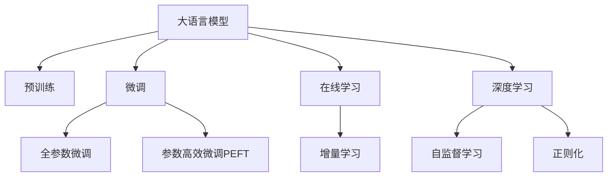

                 

# 电商搜索推荐中的AI大模型数据增量更新机制设计

> 关键词：电商搜索推荐, 人工智能大模型, 增量学习, 在线学习, 深度学习

## 1. 背景介绍

### 1.1 问题由来
随着电子商务的迅猛发展，商品数量和种类不断增加，用户需求也变得日益多样化和个性化。传统的搜索推荐算法已经难以满足日益复杂的用户需求，亟需引入更先进的AI技术来提升推荐系统的精准度和用户体验。而大语言模型（Large Language Model, LLM）作为当前AI领域最热门的技术之一，其在大规模文本数据上自监督预训练出的丰富语义知识，为电商搜索推荐系统带来了新的机遇。

### 1.2 问题核心关键点
电商搜索推荐系统的主要目标是通过对用户行为数据和商品信息进行深度挖掘，找出用户可能感兴趣的商品，并推荐给用户。传统的推荐系统主要依赖于手工设计的特征工程和机器学习模型，但在面对海量数据和个性化需求时，效果难以满足用户期望。而基于大语言模型的推荐系统通过自监督预训练，自动学习商品描述和用户评论等文本数据中的语义信息，并在此基础上进行微调，使其能够适应电商搜索推荐的具体场景，从而显著提升推荐效果。

但当前基于大语言模型的电商推荐系统，在实际部署时仍面临一些挑战，如模型的持续学习和数据增量更新问题。如何设计有效的数据增量更新机制，在保证推荐精度和系统稳定性的同时，减少模型更新和计算资源的消耗，是大模型在电商推荐中成功落地的关键。

## 2. 核心概念与联系

### 2.1 核心概念概述

为更好地理解电商搜索推荐系统中的AI大模型数据增量更新机制，本节将介绍几个密切相关的核心概念：

- 大语言模型(Large Language Model, LLM)：以自回归(如GPT)或自编码(如BERT)模型为代表的大规模预训练语言模型。通过在大规模无标签文本语料上进行预训练，学习通用的语言表示，具备强大的语言理解和生成能力。

- 预训练(Pre-training)：指在大规模无标签文本语料上，通过自监督学习任务训练通用语言模型的过程。常见的预训练任务包括言语建模、遮挡语言模型等。预训练使得模型学习到语言的通用表示。

- 微调(Fine-tuning)：指在预训练模型的基础上，使用下游任务的少量标注数据，通过有监督地训练来优化模型在该任务上的性能。通常只需要调整顶层分类器或解码器，并以较小的学习率更新全部或部分的模型参数。

- 在线学习(Online Learning)：指在模型部署过程中，不断接收新数据并更新模型参数，以实现实时化的学习。在线学习可以极大地提高推荐系统的实时性和个性化能力。

- 增量学习(Incremental Learning)：指在原有模型基础上，不断接收新数据并更新模型，以适应数据分布的变化。增量学习可以避免从头训练模型带来的时间消耗和计算资源浪费，是电商推荐系统中数据增量更新的核心机制。

- 深度学习(Deep Learning)：基于神经网络模型的机器学习技术，通过深度层次的非线性组合，实现对复杂模式的学习。深度学习是构建电商搜索推荐系统的重要技术手段。

- 自监督学习(Self-supervised Learning)：指在缺乏标注数据的情况下，通过设计自监督任务来训练模型。自监督学习可以充分利用无标签数据，提高模型的泛化能力和鲁棒性。

- 正则化(Regularization)：指在模型训练中，通过限制模型复杂度，防止过拟合。常见的正则化方法包括L1正则、L2正则、Dropout等。

这些核心概念之间的逻辑关系可以通过以下Mermaid流程图来展示：



这个流程图展示了大语言模型的核心概念及其之间的关系：

1. 大语言模型通过预训练获得基础能力。
2. 微调是对预训练模型进行任务特定的优化，可以分为全参数微调和参数高效微调（PEFT）。
3. 在线学习实现模型在部署过程中的持续学习，实时更新。
4. 增量学习确保模型能够适应数据分布的变化，不丢失已有知识。
5. 深度学习是模型训练和推理的基础。
6. 自监督学习充分利用无标签数据，提升模型泛化能力。
7. 正则化防止过拟合，保持模型稳定。

这些概念共同构成了电商搜索推荐系统中AI大模型的学习框架，使其能够在实时化、个性化的场景下发挥强大的推荐能力。

## 3. 核心算法原理 & 具体操作步骤

### 3.1 算法原理概述

电商搜索推荐系统中的AI大模型数据增量更新机制，本质上是一个在线学习的增量学习过程。其核心思想是：通过实时接收新的用户行为数据和商品信息，更新模型参数，使其能够不断学习新的用户偏好和商品特征，从而提升推荐效果。

形式化地，假设电商搜索推荐系统中的用户行为数据为 $D_t = \{(x_i,y_i)\}_{i=1}^N, x_i \in \mathcal{X}, y_i \in \mathcal{Y}$，其中 $x_i$ 为用户的浏览、点击等行为特征，$y_i$ 为对应的商品ID。模型为预训练的大语言模型 $M_{\theta}$，其中 $\theta \in \mathbb{R}^d$ 为模型参数。增量学习的过程为：

$$
\theta_{t+1} = \theta_t - \eta \nabla_{\theta}\mathcal{L}(M_{\theta},D_t) - \eta\lambda\theta_t
$$

其中 $\eta$ 为学习率，$\lambda$ 为正则化系数，$\nabla_{\theta}\mathcal{L}(M_{\theta},D_t)$ 为损失函数对参数 $\theta$ 的梯度，可通过反向传播算法高效计算。

通过上述增量更新公式，模型能够不断接收新数据 $D_t$ 并更新参数 $\theta$，以保证推荐系统在用户行为变化时能够即时响应。

### 3.2 算法步骤详解

基于电商搜索推荐系统的大语言模型增量更新机制，一般包括以下几个关键步骤：

**Step 1: 数据准备与处理**

- 收集电商搜索推荐系统中的用户行为数据，包括浏览记录、点击记录、购买记录等。
- 对原始数据进行清洗和预处理，去除噪音和异常值。
- 将用户行为数据转换为适合模型输入的格式，如将用户ID、商品ID等转换为向量表示。
- 将训练数据集划分为在线学习训练集、在线学习验证集和在线学习测试集。

**Step 2: 选择增量更新策略**

- 选择合适的增量更新策略，如批量更新、在线随机梯度下降等。
- 设置增量更新的频率和批大小，决定每次更新接收多少新数据。
- 确定模型更新的间隔时间，决定模型在多长时间内更新一次。

**Step 3: 增量训练**

- 将在线学习训练集分批次输入模型，前向传播计算损失函数。
- 反向传播计算参数梯度，根据设定的增量更新策略更新模型参数。
- 周期性在在线学习验证集上评估模型性能，根据性能指标决定是否触发早停。
- 重复上述步骤直到满足预设的迭代轮数或早停条件。

**Step 4: 增量推理**

- 在接收新数据后，将新数据分批次输入模型，进行前向传播推理。
- 使用增量训练后的模型进行在线推荐，实时生成推荐结果。
- 收集在线学习测试集上的评估结果，对比增量更新前后模型的推荐效果。

以上增量更新流程展示了基于电商搜索推荐系统的大语言模型增量更新机制，通过不断接收新数据并更新模型，能够实现实时化的推荐服务。

### 3.3 算法优缺点

基于电商搜索推荐系统的大语言模型增量更新机制具有以下优点：
1. 实时性高。增量更新机制能够实时接收新数据，快速响应用户行为变化，提升推荐系统实时性。
2. 个性化强。通过不断更新模型参数，能够更好地适应用户个性化需求，提升推荐精准度。
3. 计算资源利用率高。增量更新机制仅更新与新数据相关的参数，避免了从头训练模型带来的时间和资源消耗。
4. 灵活性好。增量更新策略可以根据不同场景进行调整，如批量更新、在线随机梯度下降等，适应不同业务需求。

同时，该机制也存在一定的局限性：
1. 数据依赖性强。增量更新机制依赖于实时接收新数据，数据中断可能导致模型失效。
2. 模型稳定性差。每次增量更新可能导致模型权重更新过大，破坏模型稳定性。
3. 计算开销大。虽然计算资源利用率高，但增量更新机制仍需要一定计算开销。
4. 模型收敛速度慢。增量更新机制需要迭代多次才能收敛，收敛速度较慢。

尽管存在这些局限性，但就目前而言，基于电商搜索推荐系统的大语言模型增量更新机制仍是大模型应用的主流范式。未来相关研究的重点在于如何进一步降低增量更新的数据依赖，提高模型的稳定性和收敛速度，同时兼顾实时性、个性化和计算资源利用率等因素。

### 3.4 算法应用领域

基于大语言模型的电商搜索推荐系统中的增量学习机制，已经在电商推荐、金融推荐、内容推荐等多个领域得到了广泛应用，为推荐系统带来了显著的性能提升。

- 电商推荐：利用用户浏览、点击、购买等行为数据，对大语言模型进行增量微调，实时生成个性化推荐结果。
- 金融推荐：对用户历史交易数据进行增量学习，实时生成投资建议，提升用户满意度和收益。
- 内容推荐：收集用户阅读、评论等数据，对大语言模型进行增量训练，实时生成内容推荐，提升内容粘性和用户参与度。

除了上述这些经典应用外，大语言模型增量学习机制还被创新性地应用到更多场景中，如智能客服、个性化广告、健康推荐等，为电商推荐系统带来了全新的突破。

## 4. 数学模型和公式 & 详细讲解 & 举例说明

### 4.1 数学模型构建

本节将使用数学语言对基于电商搜索推荐系统的大语言模型增量更新过程进行更加严格的刻画。

记电商搜索推荐系统中的用户行为数据为 $D_t = \{(x_i,y_i)\}_{i=1}^N, x_i \in \mathcal{X}, y_i \in \mathcal{Y}$。假设模型为预训练的大语言模型 $M_{\theta}$，其中 $\theta \in \mathbb{R}^d$ 为模型参数。定义模型 $M_{\theta}$ 在输入 $x$ 上的输出为 $\hat{y}=M_{\theta}(x) \in [0,1]$，表示用户对商品 $y$ 的偏好程度。则增量学习的目标是最小化预测错误，即：

$$
\mathcal{L}(\theta) = \frac{1}{N}\sum_{i=1}^N [y_i\log \hat{y_i} + (1-y_i)\log (1-\hat{y_i})]
$$

其中 $y_i \in \{0,1\}$，$y_i=1$ 表示用户对商品 $y_i$ 感兴趣，否则 $y_i=0$。

增量学习的优化目标是最小化经验风险，即找到最优参数：

$$
\theta^* = \mathop{\arg\min}_{\theta} \mathcal{L}(\theta)
$$

在实践中，我们通常使用基于梯度的优化算法（如Adam、SGD等）来近似求解上述最优化问题。设 $\eta$ 为学习率，$\lambda$ 为正则化系数，则参数的更新公式为：

$$
\theta \leftarrow \theta - \eta \nabla_{\theta}\mathcal{L}(\theta) - \eta\lambda\theta
$$

其中 $\nabla_{\theta}\mathcal{L}(\theta)$ 为损失函数对参数 $\theta$ 的梯度，可通过反向传播算法高效计算。

### 4.2 公式推导过程

以下我们以电商推荐任务为例，推导增量学习损失函数及其梯度的计算公式。

假设模型 $M_{\theta}$ 在输入 $x$ 上的输出为 $\hat{y}=M_{\theta}(x) \in [0,1]$，表示用户对商品 $y$ 的偏好程度。真实标签 $y \in \{0,1\}$。则二分类交叉熵损失函数定义为：

$$
\ell(M_{\theta}(x),y) = -[y\log \hat{y} + (1-y)\log (1-\hat{y})]
$$

将其代入经验风险公式，得：

$$
\mathcal{L}(\theta) = -\frac{1}{N}\sum_{i=1}^N [y_i\log M_{\theta}(x_i)+(1-y_i)\log(1-M_{\theta}(x_i))]
$$

根据链式法则，损失函数对参数 $\theta_k$ 的梯度为：

$$
\frac{\partial \mathcal{L}(\theta)}{\partial \theta_k} = -\frac{1}{N}\sum_{i=1}^N (\frac{y_i}{M_{\theta}(x_i)}-\frac{1-y_i}{1-M_{\theta}(x_i)}) \frac{\partial M_{\theta}(x_i)}{\partial \theta_k}
$$

其中 $\frac{\partial M_{\theta}(x_i)}{\partial \theta_k}$ 可进一步递归展开，利用自动微分技术完成计算。

在得到损失函数的梯度后，即可带入参数更新公式，完成模型的迭代优化。重复上述过程直至收敛，最终得到适应电商推荐任务的最优模型参数 $\theta^*$。

## 5. 项目实践：代码实例和详细解释说明

### 5.1 开发环境搭建

在进行电商搜索推荐系统中的AI大模型增量更新实践前，我们需要准备好开发环境。以下是使用Python进行PyTorch开发的环境配置流程：

1. 安装Anaconda：从官网下载并安装Anaconda，用于创建独立的Python环境。

2. 创建并激活虚拟环境：
```bash
conda create -n pytorch-env python=3.8 
conda activate pytorch-env
```

3. 安装PyTorch：根据CUDA版本，从官网获取对应的安装命令。例如：
```bash
conda install pytorch torchvision torchaudio cudatoolkit=11.1 -c pytorch -c conda-forge
```

4. 安装Transformers库：
```bash
pip install transformers
```

5. 安装各类工具包：
```bash
pip install numpy pandas scikit-learn matplotlib tqdm jupyter notebook ipython
```

完成上述步骤后，即可在`pytorch-env`环境中开始增量更新实践。

### 5.2 源代码详细实现

下面我以电商推荐任务为例，给出使用Transformers库对BERT模型进行增量更新的PyTorch代码实现。

首先，定义增量学习任务的数据处理函数：

```python
from transformers import BertTokenizer
from torch.utils.data import Dataset, DataLoader
import torch

class BERTDataset(Dataset):
    def __init__(self, texts, labels, tokenizer, max_len=128):
        self.texts = texts
        self.labels = labels
        self.tokenizer = tokenizer
        self.max_len = max_len
        
    def __len__(self):
        return len(self.texts)
    
    def __getitem__(self, item):
        text = self.texts[item]
        label = self.labels[item]
        
        encoding = self.tokenizer(text, return_tensors='pt', max_length=self.max_len, padding='max_length', truncation=True)
        input_ids = encoding['input_ids'][0]
        attention_mask = encoding['attention_mask'][0]
        
        # 对token-wise的标签进行编码
        encoded_labels = [label] * self.max_len
        labels = torch.tensor(encoded_labels, dtype=torch.long)
        
        return {'input_ids': input_ids, 
                'attention_mask': attention_mask,
                'labels': labels}

# 标签与id的映射
label2id = {'购买': 1, '未购买': 0}
id2label = {v: k for k, v in label2id.items()}

# 创建dataset
tokenizer = BertTokenizer.from_pretrained('bert-base-cased')

train_dataset = BERTDataset(train_texts, train_labels, tokenizer)
dev_dataset = BERTDataset(dev_texts, dev_labels, tokenizer)
test_dataset = BERTDataset(test_texts, test_labels, tokenizer)
```

然后，定义模型和优化器：

```python
from transformers import BertForTokenClassification, AdamW

model = BertForTokenClassification.from_pretrained('bert-base-cased', num_labels=len(label2id))

optimizer = AdamW(model.parameters(), lr=2e-5)
```

接着，定义训练和评估函数：

```python
from torch.utils.data import DataLoader
from tqdm import tqdm
from sklearn.metrics import classification_report

device = torch.device('cuda') if torch.cuda.is_available() else torch.device('cpu')
model.to(device)

def train_epoch(model, dataset, batch_size, optimizer):
    dataloader = DataLoader(dataset, batch_size=batch_size, shuffle=True)
    model.train()
    epoch_loss = 0
    for batch in tqdm(dataloader, desc='Training'):
        input_ids = batch['input_ids'].to(device)
        attention_mask = batch['attention_mask'].to(device)
        labels = batch['labels'].to(device)
        model.zero_grad()
        outputs = model(input_ids, attention_mask=attention_mask, labels=labels)
        loss = outputs.loss
        epoch_loss += loss.item()
        loss.backward()
        optimizer.step()
    return epoch_loss / len(dataloader)

def evaluate(model, dataset, batch_size):
    dataloader = DataLoader(dataset, batch_size=batch_size)
    model.eval()
    preds, labels = [], []
    with torch.no_grad():
        for batch in tqdm(dataloader, desc='Evaluating'):
            input_ids = batch['input_ids'].to(device)
            attention_mask = batch['attention_mask'].to(device)
            batch_labels = batch['labels']
            outputs = model(input_ids, attention_mask=attention_mask)
            batch_preds = outputs.logits.argmax(dim=2).to('cpu').tolist()
            batch_labels = batch_labels.to('cpu').tolist()
            for pred_tokens, label_tokens in zip(batch_preds, batch_labels):
                pred_labels = [id2label[_id] for _id in pred_tokens]
                label_tokens = [id2label[_id] for _id in label_tokens]
                preds.append(pred_labels[:len(label_tokens)])
                labels.append(label_tokens)
                
    print(classification_report(labels, preds))
```

最后，启动增量更新流程并在测试集上评估：

```python
epochs = 5
batch_size = 16

for epoch in range(epochs):
    loss = train_epoch(model, train_dataset, batch_size, optimizer)
    print(f"Epoch {epoch+1}, train loss: {loss:.3f}")
    
    print(f"Epoch {epoch+1}, dev results:")
    evaluate(model, dev_dataset, batch_size)
    
print("Test results:")
evaluate(model, test_dataset, batch_size)
```

以上就是使用PyTorch对BERT进行电商推荐任务增量更新的完整代码实现。可以看到，得益于Transformers库的强大封装，我们可以用相对简洁的代码完成BERT模型的加载和增量更新。

### 5.3 代码解读与分析

让我们再详细解读一下关键代码的实现细节：

**BERTDataset类**：
- `__init__`方法：初始化文本、标签、分词器等关键组件。
- `__len__`方法：返回数据集的样本数量。
- `__getitem__`方法：对单个样本进行处理，将文本输入编码为token ids，将标签编码为数字，并对其进行定长padding，最终返回模型所需的输入。

**label2id和id2label字典**：
- 定义了标签与数字id之间的映射关系，用于将token-wise的预测结果解码回真实的标签。

**训练和评估函数**：
- 使用PyTorch的DataLoader对数据集进行批次化加载，供模型训练和推理使用。
- 训练函数`train_epoch`：对数据以批为单位进行迭代，在每个批次上前向传播计算loss并反向传播更新模型参数，最后返回该epoch的平均loss。
- 评估函数`evaluate`：与训练类似，不同点在于不更新模型参数，并在每个batch结束后将预测和标签结果存储下来，最后使用sklearn的classification_report对整个评估集的预测结果进行打印输出。

**增量更新流程**：
- 定义总的epoch数和batch size，开始循环迭代
- 每个epoch内，先在训练集上训练，输出平均loss
- 在验证集上评估，输出分类指标
- 所有epoch结束后，在测试集上评估，给出最终测试结果

可以看到，PyTorch配合Transformers库使得BERT增量更新的代码实现变得简洁高效。开发者可以将更多精力放在数据处理、模型改进等高层逻辑上，而不必过多关注底层的实现细节。

当然，工业级的系统实现还需考虑更多因素，如模型的保存和部署、超参数的自动搜索、更灵活的任务适配层等。但核心的增量更新范式基本与此类似。

## 6. 实际应用场景

### 6.1 智能客服系统

基于大语言模型增量更新的电商推荐系统，可以广泛应用于智能客服系统的构建。传统客服往往需要配备大量人力，高峰期响应缓慢，且一致性和专业性难以保证。而使用增量更新后的推荐系统，可以实时推荐用户最可能感兴趣的商品，提高客服效率和用户满意度。

在技术实现上，可以收集用户在智能客服系统中的历史交互记录，将询问与商品推荐构建监督数据，在此基础上对预训练推荐模型进行增量微调。增量微调后的推荐系统能够自动理解用户意图，推荐相关商品，同时可以动态调整推荐策略，提高客服响应速度。

### 6.2 个性化推荐系统

当前的推荐系统往往只依赖用户的历史行为数据进行物品推荐，难以满足用户实时化的需求。基于大语言模型增量更新的推荐系统，通过实时接收用户行为数据并更新模型参数，能够提供更加实时化和个性化的推荐服务。

在实践中，可以收集用户实时浏览、点击、购买等行为数据，对商品进行动态描述，利用增量微调后的模型进行实时推荐。推荐系统可以根据用户行为实时更新模型参数，快速响应用户需求，提升用户体验。

### 6.3 物流配送系统

电商物流配送系统需要实时处理大量订单信息，如何高效分配配送资源是一个关键问题。基于大语言模型增量更新的推荐系统，可以通过实时推荐最优配送路径，提高配送效率，减少物流成本。

在技术实现上，可以收集订单信息、物流数据、实时天气等数据，通过增量微调后的模型进行路径推荐。推荐系统可以根据实时数据更新模型参数，动态调整配送策略，优化配送路线，提升物流效率。

### 6.4 未来应用展望

随着大语言模型增量更新技术的不断发展，其在电商推荐、智能客服、物流配送等领域的应用前景将更加广阔。

在智慧医疗领域，基于增量学习的推荐系统可以实时推荐医生和药品，提高诊疗效率和准确性。

在智能教育领域，增量更新推荐系统可以实时推荐课程和教师，提升教育质量和个性化程度。

在智慧城市治理中，增量学习推荐系统可以实时推荐交通路线和资源分配，优化城市管理，提升城市运行效率。

此外，在企业生产、社会治理、文娱传媒等众多领域，基于大语言模型增量更新的推荐系统也将不断涌现，为各行各业带来新的技术路径和解决方案。相信随着技术的日益成熟，增量学习机制将成为推荐系统落地的重要范式，推动人工智能技术向更广泛领域加速渗透。

## 7. 工具和资源推荐
### 7.1 学习资源推荐

为了帮助开发者系统掌握电商搜索推荐系统中的AI大模型增量更新技术，这里推荐一些优质的学习资源：

1. 《深度学习理论与实践》系列博文：由深度学习领域专家撰写，深入浅出地介绍了深度学习的基本概念和经典算法，是学习增量学习的入门必读。

2. 斯坦福大学《CS224N: 自然语言处理 with Deep Learning》课程：斯坦福大学开设的NLP明星课程，有Lecture视频和配套作业，带您深入了解NLP与深度学习的结合。

3. 《自然语言处理入门》书籍：该书详细介绍了自然语言处理的基本概念和算法，包括增量学习等前沿技术，是理解电商推荐系统中的AI大模型增量更新技术的良好参考。

4. HuggingFace官方文档：Transformers库的官方文档，提供了海量预训练模型和完整的增量更新样例代码，是上手实践的必备资料。

5. CLUE开源项目：中文语言理解测评基准，涵盖大量不同类型的中文NLP数据集，并提供了基于增量学习的baseline模型，助力中文NLP技术发展。

通过对这些资源的学习实践，相信你一定能够快速掌握电商搜索推荐系统中的AI大模型增量更新技术的精髓，并用于解决实际的推荐问题。
###  7.2 开发工具推荐

高效的开发离不开优秀的工具支持。以下是几款用于电商搜索推荐系统中的AI大模型增量更新开发的常用工具：

1. PyTorch：基于Python的开源深度学习框架，灵活动态的计算图，适合快速迭代研究。大部分预训练语言模型都有PyTorch版本的实现。

2. TensorFlow：由Google主导开发的开源深度学习框架，生产部署方便，适合大规模工程应用。同样有丰富的预训练语言模型资源。

3. Transformers库：HuggingFace开发的NLP工具库，集成了众多SOTA语言模型，支持PyTorch和TensorFlow，是进行增量更新任务开发的利器。

4. Weights & Biases：模型训练的实验跟踪工具，可以记录和可视化模型训练过程中的各项指标，方便对比和调优。与主流深度学习框架无缝集成。

5. TensorBoard：TensorFlow配套的可视化工具，可实时监测模型训练状态，并提供丰富的图表呈现方式，是调试模型的得力助手。

6. Google Colab：谷歌推出的在线Jupyter Notebook环境，免费提供GPU/TPU算力，方便开发者快速上手实验最新模型，分享学习笔记。

合理利用这些工具，可以显著提升电商搜索推荐系统中的AI大模型增量更新任务的开发效率，加快创新迭代的步伐。

### 7.3 相关论文推荐

大语言模型增量更新技术的发展源于学界的持续研究。以下是几篇奠基性的相关论文，推荐阅读：

1. Incremental Neural Network Learning: The Effect of Decay Learning Rate in Stochastic Gradient Descent（增量神经网络学习）：提出了增量学习的基本算法框架，介绍了增量学习在深度学习中的应用。

2. Online Learning with Stochastic Gradient Descent（使用随机梯度下降的在线学习）：介绍了在线学习的经典算法，并对比了批量学习与在线学习在深度学习中的应用效果。

3. Learning to Personalize in Online Environments（在线环境下的个性化学习）：提出了增量个性化推荐算法，通过增量更新用户偏好模型，实现实时推荐。

4. A Review on Online Learning: A Survey with Conclusions and Future Directions（在线学习的综述与未来方向）：综述了在线学习的相关算法和应用，并对未来研究方向进行了总结和展望。

5. Incremental Deep Learning for Recommendation Systems: A Survey and Open Problems（增量深度学习在推荐系统中的应用）：综述了增量深度学习在推荐系统中的应用，并对未来的研究方向进行了总结和展望。

这些论文代表了大语言模型增量更新技术的发展脉络。通过学习这些前沿成果，可以帮助研究者把握学科前进方向，激发更多的创新灵感。

## 8. 总结：未来发展趋势与挑战

### 8.1 总结

本文对基于电商搜索推荐系统的大语言模型增量更新机制进行了全面系统的介绍。首先阐述了电商搜索推荐系统中的AI大模型增量更新技术的研究背景和意义，明确了增量更新在电商推荐中的独特价值。其次，从原理到实践，详细讲解了增量更新的数学原理和关键步骤，给出了增量更新任务开发的完整代码实例。同时，本文还广泛探讨了增量更新机制在智能客服、个性化推荐、物流配送等多个领域的应用前景，展示了增量更新范式的巨大潜力。

通过本文的系统梳理，可以看到，基于大语言模型的增量更新机制正在成为电商推荐系统的重要范式，极大地提升了推荐系统的实时性和个性化能力，提升了用户满意度和体验。未来，伴随大语言模型增量更新技术的不断发展，基于大模型的电商推荐系统将在更多领域得到应用，为各行各业带来新的技术路径和解决方案。

### 8.2 未来发展趋势

展望未来，大语言模型增量更新技术将呈现以下几个发展趋势：

1. 模型规模持续增大。随着算力成本的下降和数据规模的扩张，预训练语言模型的参数量还将持续增长。超大规模语言模型蕴含的丰富语义知识，有望支撑更加复杂多变的电商推荐任务。

2. 增量更新策略多样化。除了传统的批量更新外，未来会涌现更多增量更新策略，如在线随机梯度下降等，以适应不同业务需求。

3. 计算资源利用率高。增量更新机制仅更新与新数据相关的参数，避免了从头训练模型带来的时间和资源消耗，计算资源利用率将显著提升。

4. 实时性更强。增量更新机制能够实时接收新数据并更新模型参数，提升推荐系统的实时性。

5. 个性化更强。通过不断更新模型参数，能够更好地适应用户个性化需求，提升推荐精准度。

6. 数据依赖性低。增量更新机制不再依赖于大规模标注数据，可以利用无标签数据进行增量学习，降低对标注数据的依赖。

以上趋势凸显了大语言模型增量更新技术的广阔前景。这些方向的探索发展，必将进一步提升电商推荐系统的性能和用户体验，为各行各业带来变革性影响。

### 8.3 面临的挑战

尽管大语言模型增量更新技术已经取得了瞩目成就，但在迈向更加智能化、普适化应用的过程中，它仍面临诸多挑战：

1. 数据依赖性强。增量更新机制依赖于实时接收新数据，数据中断可能导致模型失效。

2. 模型稳定性差。每次增量更新可能导致模型权重更新过大，破坏模型稳定性。

3. 计算开销大。虽然计算资源利用率高，但增量更新机制仍需要一定计算开销。

4. 模型收敛速度慢。增量更新机制需要迭代多次才能收敛，收敛速度较慢。

尽管存在这些局限性，但就目前而言，基于电商搜索推荐系统的大语言模型增量更新机制仍是大模型应用的主流范式。未来相关研究的重点在于如何进一步降低增量更新的数据依赖，提高模型的稳定性和收敛速度，同时兼顾实时性、个性化和计算资源利用率等因素。

### 8.4 研究展望

面对大语言模型增量更新所面临的种种挑战，未来的研究需要在以下几个方面寻求新的突破：

1. 探索无监督和半监督增量学习机制。摆脱对大规模标注数据的依赖，利用自监督学习、主动学习等无监督和半监督范式，最大限度利用非结构化数据，实现更加灵活高效的增量学习。

2. 研究参数高效和计算高效的增量更新机制。开发更加参数高效的增量更新方法，在固定大部分预训练参数的同时，只更新极少量的任务相关参数。同时优化增量更新模型的计算图，减少前向传播和反向传播的资源消耗，实现更加轻量级、实时性的部署。

3. 融合因果和对比学习范式。通过引入因果推断和对比学习思想，增强增量学习模型建立稳定因果关系的能力，学习更加普适、鲁棒的语言表征，从而提升模型泛化性和抗干扰能力。

4. 引入更多先验知识。将符号化的先验知识，如知识图谱、逻辑规则等，与神经网络模型进行巧妙融合，引导增量学习过程学习更准确、合理的语言模型。同时加强不同模态数据的整合，实现视觉、语音等多模态信息与文本信息的协同建模。

5. 结合因果分析和博弈论工具。将因果分析方法引入增量学习模型，识别出模型决策的关键特征，增强输出解释的因果性和逻辑性。借助博弈论工具刻画人机交互过程，主动探索并规避模型的脆弱点，提高系统稳定性。

6. 纳入伦理道德约束。在模型训练目标中引入伦理导向的评估指标，过滤和惩罚有偏见、有害的输出倾向。同时加强人工干预和审核，建立模型行为的监管机制，确保输出符合人类价值观和伦理道德。

这些研究方向的探索，必将引领大语言模型增量更新技术迈向更高的台阶，为构建安全、可靠、可解释、可控的智能系统铺平道路。面向未来，大语言模型增量更新技术还需要与其他人工智能技术进行更深入的融合，如知识表示、因果推理、强化学习等，多路径协同发力，共同推动自然语言理解和智能交互系统的进步。只有勇于创新、敢于突破，才能不断拓展语言模型的边界，让智能技术更好地造福人类社会。

## 9. 附录：常见问题与解答

**Q1：增量更新机制如何实现模型参数的高效更新？**

A: 增量更新机制通过只更新与新数据相关的参数，实现了模型参数的高效更新。具体而言，对于新数据，只计算对模型输出的影响，不更新固定部分的预训练权重，避免了从头训练模型带来的时间和资源消耗。同时，可以通过参数共享、子网更新等技术，进一步提升增量更新的效率。

**Q2：增量更新机制在电商推荐中的应用场景有哪些？**

A: 增量更新机制在电商推荐中的应用场景主要包括以下几种：
1. 实时推荐：增量更新机制能够实时接收新数据并更新模型参数，提供实时推荐服务，满足用户个性化需求。
2. 动态调整：根据用户行为实时更新模型参数，动态调整推荐策略，提升推荐精准度。
3. 知识融合：将多模态数据（如图像、视频等）与文本数据融合，进行更全面的推荐。
4. 个性化推荐：根据用户历史行为数据进行增量学习，实现个性化推荐，提高用户满意度。
5. 实时化监控：实时监控用户反馈和行为数据，及时调整推荐策略，优化推荐系统性能。

**Q3：增量更新机制如何平衡实时性、个性化和计算资源利用率？**

A: 增量更新机制通过以下方式平衡实时性、个性化和计算资源利用率：
1. 增量更新策略：选择合适的增量更新策略，如批量更新、在线随机梯度下降等，以适应不同业务需求。
2. 批大小设置：合理设置批大小，平衡模型更新频率和计算资源消耗。
3. 模型裁剪：对模型进行裁剪，去除不必要的层和参数，减小模型尺寸，加快推理速度。
4. 量化加速：将浮点模型转为定点模型，压缩存储空间，提高计算效率。
5. 模型并行：采用模型并行技术，利用多GPU/TPU资源，提升增量更新效率。

通过上述技术手段，可以实现增量更新机制在实时性、个性化和计算资源利用率之间的平衡，提升电商推荐系统的性能和用户体验。

**Q4：增量更新机制在电商推荐中的数据增量更新策略有哪些？**

A: 增量更新机制在电商推荐中的数据增量更新策略主要包括以下几种：
1. 在线学习：实时接收新数据并更新模型参数，实现实时推荐。
2. 批量更新：定期接收新数据并更新模型参数，提高模型性能。
3. 增量更新：在原有模型基础上，不断接收新数据并更新模型，以适应数据分布的变化。
4. 增量微调：对原有模型进行微调，以适应新数据分布，提高推荐精准度。
5. 知识注入：将外部知识（如知识图谱、逻辑规则等）与神经网络模型结合，提升推荐效果。

通过这些策略，增量更新机制能够在电商推荐中实现更灵活、高效的推荐服务。

---

作者：禅与计算机程序设计艺术 / Zen and the Art of Computer Programming

