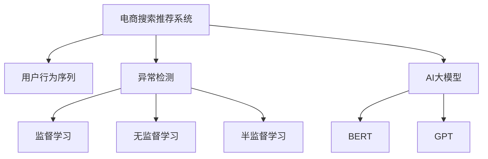

                 

# 电商搜索推荐中的AI大模型用户行为序列异常检测模型实践指南

> 关键词：电商搜索推荐, 用户行为序列, 异常检测, 人工智能大模型, 深度学习, 自然语言处理, 模型优化

## 1. 背景介绍

### 1.1 问题由来
随着电商平台的兴起，用户搜索推荐系统成为提升用户体验、增加业务收益的重要手段。然而，由于电商环境的复杂性和用户行为的多样性，搜索推荐系统中存在大量异常行为，如点击欺诈、恶意刷单、虚假交易等，严重影响了系统的准确性和公平性，甚至给平台带来了巨大的经济损失。因此，建立有效的异常检测机制，实时识别并过滤掉异常行为，成为电商搜索推荐系统亟需解决的关键问题。

近年来，人工智能(AI)技术在电商领域的广泛应用，使得基于深度学习和大语言模型的异常检测技术逐渐成为主流。AI模型能够自动从海量数据中学习到异常行为的模式和特征，实现高效、准确的异常检测。

### 1.2 问题核心关键点
针对电商搜索推荐系统中的异常检测问题，本指南重点讨论了以下核心关键点：

- **用户行为序列**：电商环境中的异常行为通常以用户行为序列的形式表现出来。通过分析用户搜索、点击、购买等行为，可以发现异常行为的模式和规律。
- **AI大模型**：基于深度学习和大语言模型的异常检测方法，利用预训练模型的泛化能力，可以从历史数据中学习到异常行为的特征和模式。
- **异常检测**：异常检测的核心是识别并分类出异常行为，通常采用监督学习、无监督学习或半监督学习的方法，结合业务规则进行模型训练。
- **模型优化**：电商系统的实时性和准确性要求，需要模型能够在短时间内高效处理大规模数据，并在高并发环境下保持稳定性能。

通过理解和应用这些核心概念，可以构建出高效、准确、可靠的电商搜索推荐系统异常检测模型。

### 1.3 问题研究意义
异常检测在电商搜索推荐系统中的应用，具有以下几方面的重要意义：

- **提升用户体验**：通过及时识别并过滤掉异常行为，避免用户因欺诈、刷单等不良行为而受到不公平对待，提升用户的购物体验。
- **保护平台利益**：减少欺诈、刷单等行为对平台造成的经济损失，确保平台的公平性和稳定性。
- **优化推荐系统**：准确识别异常行为，可以帮助推荐系统从噪声数据中筛选出真正有价值的信息，提升推荐结果的准确性和多样性。
- **促进电商发展**：保障电商市场的健康发展，维护良好的市场秩序，为电商行业的繁荣提供支撑。

## 2. 核心概念与联系

### 2.1 核心概念概述

为更好地理解电商搜索推荐系统中的异常检测方法，本节将介绍几个密切相关的核心概念：

- **电商搜索推荐系统**：通过分析用户的搜索、浏览、点击、购买等行为，为用户推荐符合其兴趣的商品，提升用户体验，增加业务收益。
- **用户行为序列**：指用户在电商平台上的一系列连续行为，如搜索-点击-购买等。通过分析用户行为序列的特征，可以发现异常行为的模式。
- **异常检测**：通过分析用户行为序列，识别并分类出异常行为，如点击欺诈、恶意刷单等。常用的方法包括基于监督学习、无监督学习和半监督学习。
- **AI大模型**：指基于深度学习、自然语言处理等技术构建的庞大模型，如BERT、GPT等。大模型通过大量数据预训练，具备强大的泛化能力，可以用于异常检测。

这些核心概念之间的逻辑关系可以通过以下Mermaid流程图来展示：



这个流程图展示了电商搜索推荐系统的核心概念及其之间的关系：

1. 电商搜索推荐系统通过用户行为序列分析用户行为。
2. 异常检测通过分析用户行为序列，识别并分类出异常行为。
3. 异常检测方法包括监督学习、无监督学习和半监督学习。
4. AI大模型，如BERT、GPT等，可以用于异常检测，提升模型性能。

这些概念共同构成了电商搜索推荐系统异常检测的方法框架，使得异常检测能够高效、准确地识别和分类出异常行为。

## 3. 核心算法原理 & 具体操作步骤
### 3.1 算法原理概述

电商搜索推荐系统中的异常检测方法，通常基于深度学习和大语言模型构建。其核心思想是：通过分析用户行为序列的特征，利用AI大模型的泛化能力，学习到异常行为的特征和模式，从而实现高效、准确的异常检测。

具体来说，假设用户行为序列为 $S=\{(x_1, y_1), (x_2, y_2), ..., (x_n, y_n)\}$，其中 $x_i$ 为用户行为序列中的特征，$y_i$ 为标签（正常或异常）。目标是训练一个异常检测模型 $M$，使得模型能够准确预测用户行为序列的异常性。

常用的异常检测方法包括基于监督学习、无监督学习和半监督学习。基于监督学习的方法需要大量标注数据进行训练，而基于无监督和半监督学习的方法则不需要标注数据，可以直接从用户行为序列中学习异常特征。

### 3.2 算法步骤详解

基于深度学习的异常检测方法通常包括以下关键步骤：

**Step 1: 数据准备**
- 收集电商搜索推荐系统中的用户行为序列数据，并进行预处理，如数据清洗、归一化等。
- 根据任务需求，标注数据集中的正常和异常样本，构建监督学习的数据集。

**Step 2: 模型选择与构建**
- 选择合适的深度学习模型，如LSTM、GRU、BERT等。
- 在预训练大模型的基础上，针对任务需求进行微调，构建异常检测模型。

**Step 3: 训练与评估**
- 将标注好的数据集分为训练集、验证集和测试集，使用训练集对模型进行训练。
- 在验证集上评估模型性能，调整模型参数和超参数，以避免过拟合。
- 在测试集上测试模型性能，评估模型的准确性和鲁棒性。

**Step 4: 部署与应用**
- 将训练好的模型部署到电商搜索推荐系统中，实时处理用户行为序列数据。
- 根据模型输出，对异常行为进行过滤和处理，确保系统正常运行。

### 3.3 算法优缺点

基于深度学习的异常检测方法具有以下优点：

1. **高效性**：深度学习模型能够自动从数据中学习异常行为的特征和模式，无需人工干预，高效实现异常检测。
2. **准确性**：深度学习模型具备强大的泛化能力，能够处理复杂多变的异常行为，减少误判和漏判。
3. **鲁棒性**：深度学习模型能够适应数据分布的变化，具有良好的鲁棒性。

然而，该方法也存在以下局限性：

1. **数据依赖**：深度学习模型需要大量标注数据进行训练，获取高质量标注数据的成本较高。
2. **模型复杂**：深度学习模型参数量大，计算资源需求高，部署复杂。
3. **解释性不足**：深度学习模型的决策过程复杂，缺乏可解释性，难以进行调试和优化。

尽管存在这些局限性，基于深度学习的异常检测方法在电商搜索推荐系统中的应用效果显著，已成为异常检测的主流范式。未来相关研究的重点在于如何进一步降低数据依赖，提高模型解释性，同时兼顾效率和准确性。

### 3.4 算法应用领域

基于深度学习的异常检测方法，在电商搜索推荐系统中具有广泛的应用场景，包括：

- **点击欺诈检测**：通过分析用户点击行为序列，识别和过滤掉恶意点击行为，保护平台的点击率和广告费用。
- **恶意刷单检测**：通过分析用户购买行为序列，识别和处理恶意刷单行为，维护平台的交易公平性和稳定性。
- **虚假交易检测**：通过分析用户行为序列，识别和过滤掉虚假交易行为，保障平台的交易真实性和公正性。
- **物流异常检测**：通过分析用户订单和物流行为序列，识别和处理物流异常，提升物流服务的效率和准确性。

除了这些具体应用，异常检测方法还可以与其他技术手段结合，如规则引擎、风控系统等，构建更加全面、灵活的电商搜索推荐系统。

## 4. 数学模型和公式 & 详细讲解  
### 4.1 数学模型构建

在电商搜索推荐系统中，异常检测的数学模型通常基于深度学习模型构建。以LSTM模型为例，其数学模型可以表示为：

$$
M(x) = f(x; \theta)
$$

其中 $x$ 为输入的用户行为序列，$\theta$ 为模型参数，$f$ 为模型映射函数。

假设用户行为序列中存在异常行为的概率为 $p$，则模型的目标是最小化异常行为的预测误差：

$$
L(\theta) = \sum_{i=1}^{N} \ell(f(x_i; \theta), y_i)
$$

其中 $\ell$ 为损失函数，$y_i$ 为标注数据集中的标签，$N$ 为数据集大小。

### 4.2 公式推导过程

以LSTM模型为例，其前向传播过程可以表示为：

$$
h_t = \tanh(W \cdot [h_{t-1}, x_t] + b)
$$

$$
c_t = \sigma(W \cdot [h_{t-1}, x_t] + b)
$$

$$
o_t = \sigma(W \cdot [h_{t-1}, x_t] + b)
$$

$$
g_t = \tanh(W \cdot [h_{t-1}, x_t] + b)
$$

$$
c_t = c_{t-1} \cdot f_{c_t} + g_t \cdot o_t \cdot \sigma(W \cdot [h_{t-1}, x_t] + b)
$$

$$
h_t = o_t \cdot \tanh(c_t)
$$

其中 $W$ 为权重矩阵，$b$ 为偏置向量，$\tanh$ 和 $\sigma$ 为激活函数。

在反向传播过程中，通过链式法则计算模型参数的梯度：

$$
\frac{\partial L}{\partial \theta} = \frac{\partial L}{\partial h_t} \cdot \frac{\partial h_t}{\partial \theta}
$$

其中 $\frac{\partial h_t}{\partial \theta}$ 可以通过链式法则递归计算。

在模型训练过程中，使用随机梯度下降等优化算法，最小化损失函数 $L(\theta)$：

$$
\theta = \theta - \eta \cdot \frac{\partial L}{\partial \theta}
$$

其中 $\eta$ 为学习率，$\frac{\partial L}{\partial \theta}$ 为模型参数的梯度。

### 4.3 案例分析与讲解

以点击欺诈检测为例，假设用户点击序列为 $S=\{(x_1, y_1), (x_2, y_2), ..., (x_n, y_n)\}$，其中 $x_i$ 为用户行为序列的特征，$y_i$ 为标签（正常或异常）。

可以构建一个LSTM模型，输入为点击序列 $x$，输出为异常概率 $p$。在训练过程中，使用交叉熵损失函数：

$$
L(x, y) = -y \cdot \log(p) - (1-y) \cdot \log(1-p)
$$

通过反向传播计算模型参数的梯度，使用随机梯度下降等优化算法更新模型参数。在测试阶段，使用模型预测用户点击序列的异常概率，根据阈值过滤掉异常行为。

## 5. 项目实践：代码实例和详细解释说明
### 5.1 开发环境搭建

在进行异常检测实践前，我们需要准备好开发环境。以下是使用Python进行PyTorch开发的环境配置流程：

1. 安装Anaconda：从官网下载并安装Anaconda，用于创建独立的Python环境。

2. 创建并激活虚拟环境：
```bash
conda create -n pytorch-env python=3.8 
conda activate pytorch-env
```

3. 安装PyTorch：根据CUDA版本，从官网获取对应的安装命令。例如：
```bash
conda install pytorch torchvision torchaudio cudatoolkit=11.1 -c pytorch -c conda-forge
```

4. 安装TensorFlow：
```bash
pip install tensorflow==2.3
```

5. 安装Keras：
```bash
pip install keras==2.3.1
```

6. 安装相关库：
```bash
pip install pandas numpy matplotlib sklearn
```

完成上述步骤后，即可在`pytorch-env`环境中开始异常检测实践。

### 5.2 源代码详细实现

下面我们以点击欺诈检测为例，给出使用Keras实现LSTM模型的PyTorch代码实现。

首先，定义数据处理函数：

```python
import numpy as np
import pandas as pd
from keras.preprocessing.sequence import pad_sequences
from keras.models import Sequential
from keras.layers import Dense, LSTM, Dropout
from keras.utils import to_categorical

def load_data(file_path):
    data = pd.read_csv(file_path)
    features = data.drop('label', axis=1)
    labels = data['label']
    features = pad_sequences(features, maxlen=100)
    return features, labels

def preprocess_data(features, labels):
    features = features / 255.0
    labels = to_categorical(labels, num_classes=2)
    return features, labels

def split_data(features, labels):
    train_features, test_features, train_labels, test_labels = train_test_split(features, labels, test_size=0.2, random_state=42)
    return train_features, test_features, train_labels, test_labels
```

然后，定义模型和优化器：

```python
def build_model(input_shape):
    model = Sequential()
    model.add(LSTM(128, input_shape=input_shape, return_sequences=True))
    model.add(Dropout(0.2))
    model.add(LSTM(64))
    model.add(Dropout(0.2))
    model.add(Dense(2, activation='softmax'))
    return model

def compile_model(model, optimizer, loss):
    model.compile(optimizer=optimizer, loss=loss, metrics=['accuracy'])

def train_model(model, train_features, train_labels, epochs):
    model.fit(train_features, train_labels, epochs=epochs, batch_size=32, verbose=2)

def evaluate_model(model, test_features, test_labels):
    loss, accuracy = model.evaluate(test_features, test_labels, verbose=2)
    return loss, accuracy
```

接着，启动训练流程并在测试集上评估：

```python
features, labels = load_data('data.csv')
features, labels = preprocess_data(features, labels)
train_features, test_features, train_labels, test_labels = split_data(features, labels)

input_shape = train_features.shape[1]
model = build_model(input_shape)
optimizer = 'adam'
loss = 'categorical_crossentropy'
epochs = 50

compile_model(model, optimizer, loss)
train_model(model, train_features, train_labels, epochs)
loss, accuracy = evaluate_model(model, test_features, test_labels)
print(f'Test loss: {loss:.4f}, Test accuracy: {accuracy:.4f}')
```

以上就是使用Keras实现LSTM模型的点击欺诈检测的完整代码实现。可以看到，得益于Keras的强大封装，我们可以用相对简洁的代码完成模型构建和训练。

### 5.3 代码解读与分析

让我们再详细解读一下关键代码的实现细节：

**load_data函数**：
- 读取数据集文件，并分离特征和标签。
- 对特征进行padding，保证所有序列长度一致。

**preprocess_data函数**：
- 对特征进行归一化处理。
- 对标签进行one-hot编码。

**split_data函数**：
- 对数据集进行随机切分，生成训练集和测试集。

**build_model函数**：
- 构建LSTM模型，包括输入层、LSTM层、Dropout层和输出层。
- 使用keras的Sequential模型，方便构建复杂网络结构。

**compile_model函数**：
- 对模型进行编译，设置优化器和损失函数。
- 使用交叉熵损失函数，因为点击欺诈检测任务是二分类问题。

**train_model函数**：
- 对模型进行训练，使用交叉熵损失函数和准确率作为评估指标。
- 设置训练轮数和批次大小，控制训练过程。

**evaluate_model函数**：
- 对模型进行评估，计算测试集的损失和准确率。
- 使用keras的evaluate函数进行评估。

**启动训练流程**：
- 定义模型参数，包括输入形状、优化器和损失函数。
- 编译模型，设置优化器和损失函数。
- 训练模型，并保存训练日志。
- 评估模型，输出测试集的损失和准确率。

可以看到，Keras提供了丰富的API和封装功能，使得模型构建和训练变得简洁高效。开发者可以将更多精力放在模型设计和数据处理等高层逻辑上，而不必过多关注底层的实现细节。

当然，工业级的系统实现还需考虑更多因素，如模型的保存和部署、超参数的自动搜索、更灵活的任务适配层等。但核心的异常检测范式基本与此类似。

## 6. 实际应用场景
### 6.1 智能客服系统

基于深度学习的异常检测模型，可以广泛应用于智能客服系统的构建。智能客服系统通过分析用户与机器人的交互行为，实时识别并过滤掉恶意行为，提升系统的响应速度和准确性。

在技术实现上，可以收集智能客服系统中的历史交互数据，将正常和异常行为标注为标签，构建监督数据集。在此基础上对深度学习模型进行训练，使其学习到异常行为的特征和模式。在实时处理中，系统根据模型输出，对异常行为进行过滤和处理，确保系统稳定运行。

### 6.2 物流配送系统

物流配送系统中的异常行为，如货物损失、延迟交货等，会对平台的信誉和客户满意度造成严重影响。通过异常检测模型，物流系统可以实时监控物流行为，识别并处理异常行为，提升配送效率和服务质量。

具体而言，可以收集物流系统中的订单和配送行为数据，构建异常行为的数据集。使用深度学习模型，如LSTM、GRU等，对异常行为进行训练和预测。在实际应用中，系统根据模型输出，对异常行为进行过滤和处理，保障物流服务的正常运行。

### 6.3 金融风控系统

金融风控系统中的异常行为，如欺诈交易、恶意套现等，对金融机构的资产安全构成巨大威胁。通过异常检测模型，金融机构可以实时监控交易行为，识别并处理异常行为，保障资金安全和平台稳定。

具体而言，可以收集金融交易数据，构建异常行为的数据集。使用深度学习模型，如LSTM、GRU等，对异常行为进行训练和预测。在实际应用中，系统根据模型输出，对异常交易进行过滤和处理，保障金融交易的真实性和公正性。

### 6.4 未来应用展望

随着深度学习和大语言模型技术的发展，异常检测模型在电商搜索推荐系统中的应用前景广阔。未来，异常检测模型将进一步扩展到更多场景，如医疗、教育、交通等，为各行各业带来新的变革和机遇。

在医疗领域，异常检测模型可以用于识别和处理异常诊疗数据，提升医疗服务的质量和效率。在教育领域，异常检测模型可以用于监控和分析学生的行为数据，提供个性化的学习建议和指导。在交通领域，异常检测模型可以用于监控和分析交通行为数据，保障交通安全和交通秩序。

## 7. 工具和资源推荐
### 7.1 学习资源推荐

为了帮助开发者系统掌握异常检测的理论基础和实践技巧，这里推荐一些优质的学习资源：

1. 《深度学习》书籍：由Ian Goodfellow等著，全面介绍了深度学习的基本概念和应用技术，是学习深度学习的经典教材。

2. 《Keras深度学习实践》书籍：由Vincent Vanhoucke等著，介绍了Keras深度学习框架的使用方法和应用实践，适合入门和进阶学习。

3. 《LSTM模型及其应用》课程：由斯坦福大学提供，详细介绍了LSTM模型的原理和应用场景，适合深度学习初学者。

4. Kaggle竞赛平台：提供了大量异常检测竞赛数据集和模型，可以实战练习，提升异常检测的实践能力。

5. Coursera异常检测课程：由Coursera提供，介绍了异常检测的基本概念和常见方法，适合深度学习初学者。

通过对这些资源的学习实践，相信你一定能够快速掌握异常检测的精髓，并用于解决实际的电商搜索推荐系统问题。

### 7.2 开发工具推荐

高效的开发离不开优秀的工具支持。以下是几款用于异常检测开发的常用工具：

1. PyTorch：基于Python的开源深度学习框架，灵活的计算图，适合快速迭代研究。

2. TensorFlow：由Google主导开发的开源深度学习框架，生产部署方便，适合大规模工程应用。

3. Keras：基于Python的深度学习库，提供了高层次的API，易于上手。

4. Weights & Biases：模型训练的实验跟踪工具，可以记录和可视化模型训练过程中的各项指标，方便对比和调优。

5. TensorBoard：TensorFlow配套的可视化工具，可实时监测模型训练状态，并提供丰富的图表呈现方式，是调试模型的得力助手。

6. PyTorch Lightning：轻量级的深度学习框架，提供了模型封装、超参数优化等功能，适合快速开发原型。

合理利用这些工具，可以显著提升异常检测任务的开发效率，加快创新迭代的步伐。

### 7.3 相关论文推荐

异常检测在电商搜索推荐系统中的应用，源于学界的持续研究。以下是几篇奠基性的相关论文，推荐阅读：

1. 《异常检测：原理、方法和应用》：由李军等著，全面介绍了异常检测的原理、方法和应用场景，是异常检测领域的经典教材。

2. 《深度学习异常检测》：由李军等著，介绍了深度学习在异常检测中的应用，包括LSTM、CNN等模型。

3. 《基于异常检测的欺诈行为检测》：由Fu et al. 等著，介绍了基于异常检测的欺诈行为检测方法，适合应用实践。

4. 《LSTM网络在异常检测中的应用》：由Wang et al. 等著，介绍了LSTM网络在异常检测中的应用，适合应用实践。

5. 《基于深度学习的点击欺诈检测》：由Guan et al. 等著，介绍了基于深度学习的点击欺诈检测方法，适合应用实践。

这些论文代表了大语言模型微调技术的最新进展。通过学习这些前沿成果，可以帮助研究者把握学科前进方向，激发更多的创新灵感。

## 8. 总结：未来发展趋势与挑战
### 8.1 总结

本文对电商搜索推荐系统中的异常检测方法进行了全面系统的介绍。首先阐述了异常检测在电商领域的重要性，明确了异常检测在提高用户体验、保护平台利益和优化推荐系统方面的独特价值。其次，从原理到实践，详细讲解了深度学习和大语言模型在异常检测中的应用，给出了异常检测任务开发的完整代码实例。同时，本文还广泛探讨了异常检测方法在智能客服、物流配送、金融风控等多个行业领域的应用前景，展示了异常检测范式的广泛应用。

通过本文的系统梳理，可以看到，基于深度学习的异常检测方法在电商搜索推荐系统中的应用效果显著，已成为异常检测的主流范式。未来，异常检测方法将进一步扩展到更多场景，为各行各业带来新的变革和机遇。

### 8.2 未来发展趋势

展望未来，异常检测技术将呈现以下几个发展趋势：

1. **多模态异常检测**：异常检测将从单一模态扩展到多模态，结合用户行为序列、文本信息、图片信息等多种数据源，提升异常检测的准确性和鲁棒性。

2. **端到端异常检测**：通过引入端到端学习框架，如端到端深度学习，实现从数据输入到异常检测的全过程自动化，提升异常检测的效率和效果。

3. **实时异常检测**：通过引入实时数据流处理技术，如Flink、Storm等，实现对异常行为的实时检测和处理，保障系统的高可用性。

4. **联邦学习异常检测**：通过引入联邦学习技术，实现模型在分布式环境下的协同训练，保障数据隐私和安全。

5. **异常检测集成**：将异常检测与其他技术手段结合，如规则引擎、知识图谱等，构建更加全面、灵活的异常检测系统。

这些趋势凸显了异常检测技术在电商搜索推荐系统中的应用前景。这些方向的探索发展，必将进一步提升异常检测模型的性能和应用范围，为电商行业的数字化转型升级提供新的技术路径。

### 8.3 面临的挑战

尽管异常检测技术在电商搜索推荐系统中取得了显著进展，但在迈向更加智能化、普适化应用的过程中，仍面临诸多挑战：

1. **数据质量问题**：异常检测模型的性能很大程度上依赖于标注数据的质量，高质量标注数据的获取和维护成本较高。

2. **模型复杂性**：深度学习模型参数量大，计算资源需求高，部署复杂。模型解释性不足，难以进行调试和优化。

3. **实时性要求**：电商系统对异常检测模型的实时性和响应速度有较高要求，模型需要能够在短时间内高效处理大规模数据。

4. **安全性问题**：异常检测模型可能学习到有害的异常模式，对用户隐私和安全构成威胁，需要加强数据隐私保护和模型安全性。

5. **跨领域适应性**：异常检测模型在特定领域的应用效果可能不如通用模型，需要针对具体应用场景进行优化。

这些挑战需要研究者和工程师共同努力，通过不断优化模型、算法和工程实现，解决现有问题，推动异常检测技术的进步。

### 8.4 研究展望

面对异常检测技术面临的挑战，未来的研究需要在以下几个方面寻求新的突破：

1. **无监督异常检测**：探索无需标注数据的学习方法，降低对标注数据的依赖，提升异常检测模型的普适性。

2. **模型解释性**：通过引入可解释性技术，如可解释深度学习、知识图谱等，提升模型的透明性和可解释性，便于优化和调试。

3. **分布式异常检测**：引入分布式计算技术，实现模型在分布式环境下的高效训练和推理，提升异常检测系统的可扩展性。

4. **跨领域异常检测**：引入跨领域学习技术，提升模型在不同领域中的适应性和泛化能力，增强模型的鲁棒性。

5. **异常行为生成**：通过生成对抗网络等技术，生成模拟异常行为数据，提升异常检测模型的鲁棒性和泛化能力。

6. **异常检测集成**：将异常检测与其他技术手段结合，如规则引擎、知识图谱等，构建更加全面、灵活的异常检测系统。

这些研究方向的探索，必将引领异常检测技术迈向更高的台阶，为构建安全、可靠、可解释、可控的电商搜索推荐系统提供新的技术支撑。面向未来，异常检测技术还需要与其他人工智能技术进行更深入的融合，如知识表示、因果推理、强化学习等，多路径协同发力，共同推动异常检测技术的进步。只有勇于创新、敢于突破，才能不断拓展异常检测技术的边界，让智能技术更好地造福人类社会。

## 9. 附录：常见问题与解答

**Q1：电商搜索推荐系统中的异常行为有哪些？**

A: 电商搜索推荐系统中的异常行为主要包括：

1. **点击欺诈**：用户频繁点击商品广告或页面，但不进行实际购买，浪费平台广告费用。

2. **恶意刷单**：用户通过虚假交易提高商品销量，欺骗平台算法。

3. **虚假交易**：用户通过虚假交易提高商品排名或销量，欺骗其他用户。

4. **物流异常**：用户虚构订单或异常物流行为，影响平台信誉和交易公平性。

5. **恶意评价**：用户对商品进行虚假评价，影响其他用户决策。

6. **账号异常**：用户通过账号盗用或异常账号行为，影响平台交易秩序。

**Q2：如何进行数据预处理？**

A: 电商搜索推荐系统中的数据预处理通常包括以下步骤：

1. **数据清洗**：去除数据中的缺失值、异常值和重复值，确保数据质量。

2. **特征选择**：选择对异常检测有用的特征，去除无关特征。

3. **归一化处理**：对特征进行归一化处理，缩小特征值的范围。

4. **数据增强**：通过数据增强技术，如数据扩充、回译等，丰富数据集。

5. **特征编码**：将分类特征进行独热编码，转化为数值型特征。

6. **数据切分**：将数据集分为训练集、验证集和测试集，确保模型性能评估的公正性。

通过合理的数据预处理，可以提升异常检测模型的性能和鲁棒性，确保模型在实际应用中的稳定性和准确性。

**Q3：深度学习模型在异常检测中的优势是什么？**

A: 深度学习模型在异常检测中的优势包括：

1. **高效性**：深度学习模型能够自动从数据中学习异常行为的特征和模式，无需人工干预，高效实现异常检测。

2. **准确性**：深度学习模型具备强大的泛化能力，能够处理复杂多变的异常行为，减少误判和漏判。

3. **鲁棒性**：深度学习模型能够适应数据分布的变化，具有良好的鲁棒性。

4. **自适应性**：深度学习模型能够自动学习数据分布的变化，适应新的异常行为模式。

5. **可解释性**：通过引入可解释性技术，如可解释深度学习、知识图谱等，提升模型的透明性和可解释性，便于优化和调试。

尽管存在这些优势，深度学习模型也面临一些挑战，如数据依赖、模型复杂性、实时性要求等，需要通过不断优化模型、算法和工程实现，解决现有问题，推动异常检测技术的进步。

**Q4：如何评估异常检测模型的性能？**

A: 异常检测模型的性能评估通常包括以下指标：

1. **准确率**：模型正确识别异常行为的占比。

2. **召回率**：模型正确识别出的异常行为占实际异常行为的占比。

3. **F1分数**：综合考虑准确率和召回率，平衡模型的分类性能。

4. **ROC曲线**：绘制模型在不同阈值下的真阳性率和假阳性率，评估模型的分类性能。

5. **混淆矩阵**：展示模型分类结果的详细情况，包括真阳性、真阴性、假阳性和假阴性。

6. **异常检测漏报率**：模型未识别出的异常行为占实际异常行为的占比。

通过合理评估模型的性能，可以发现模型存在的问题，并进行相应的优化和改进，提升模型的异常检测能力。

**Q5：如何优化异常检测模型的训练过程？**

A: 异常检测模型的训练过程优化通常包括以下方法：

1. **学习率调整**：根据模型训练情况，逐步减小学习率，避免过拟合。

2. **正则化技术**：引入L2正则、Dropout等技术，防止模型过拟合。

3. **数据增强**：通过数据增强技术，如数据扩充、回译等，丰富数据集，提升模型泛化能力。

4. **早停技术**：设置早停阈值，当模型在验证集上性能不再提升时停止训练，防止过拟合。

5. **超参数调优**：通过网格搜索、随机搜索等方法，寻找最优超参数组合，提升模型性能。

6. **模型集成**：将多个模型的预测结果进行集成，提升模型的鲁棒性和泛化能力。

通过合理优化模型的训练过程，可以提升模型的异常检测能力，确保模型在实际应用中的稳定性和准确性。

---

作者：禅与计算机程序设计艺术 / Zen and the Art of Computer Programming

