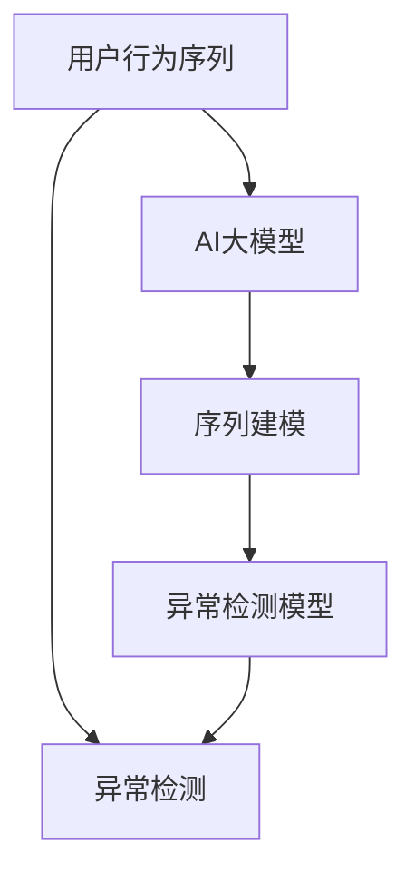

                 

# 电商搜索推荐中的AI大模型用户行为序列异常检测模型实践案例

> 关键词：电商搜索推荐,用户行为序列,异常检测,AI大模型,自然语言处理(NLP),深度学习,序列模型,序列异常检测模型,异常行为识别

## 1. 背景介绍

### 1.1 问题由来

在电子商务平台上，用户的搜索行为和点击行为蕴含着丰富的购买意向和行为偏好。通过分析这些行为序列，电商公司可以提供更个性化的搜索推荐服务，提高用户体验和转化率。然而，用户的搜索和点击行为也受到多种因素的影响，如环境、心情、季节等，部分行为可能异常或与用户实际意向不一致。传统的基于规则的方法无法有效处理复杂的行为模式，难以识别真实用户意图。

AI大模型通过对海量用户数据进行训练，可以学习到不同用户行为之间的复杂模式，通过深度学习技术识别异常行为。这一技术在电商平台的应用，可以显著提升推荐系统的准确性和用户满意度。

### 1.2 问题核心关键点

当前基于AI大模型的用户行为序列异常检测方法主要包括以下几个关键点：

1. **用户行为序列数据准备**：收集用户的搜索、点击、购买行为数据，并进行序列化和标注异常行为。
2. **序列建模**：利用大模型学习用户行为序列的时间依赖关系，如Transformer、RNN等。
3. **异常检测**：通过异常检测模型，如自编码器、One-Class SVM等，识别行为序列中的异常。
4. **跨域鲁棒性**：不同领域的数据可能存在差异，需保证模型在跨领域数据上的泛化能力。
5. **实时处理能力**：电商搜索推荐系统要求实时响应，需考虑模型部署的实时性和计算效率。

### 1.3 问题研究意义

电商搜索推荐中的用户行为序列异常检测具有重要研究意义：

1. **提升推荐系统准确性**：准确识别用户行为异常，可提升推荐系统的个性化程度和推荐准确性。
2. **优化用户搜索体验**：及时发现行为异常，用户可避免无效查询和点击，提升搜索效率和满意度。
3. **防控欺诈行为**：识别恶意点击、恶意购买行为，防范虚假交易，维护电商平台的正常运营秩序。
4. **增强业务决策支持**：提供精准的行为分析，为运营策略优化、库存管理等提供有力支持。

## 2. 核心概念与联系

### 2.1 核心概念概述

为更好地理解电商搜索推荐中的用户行为序列异常检测，我们首先需要介绍几个核心概念：

- **用户行为序列(User Behavior Sequences)**：用户在不同时间点进行的搜索、点击、浏览等行为构成的序列，时间顺序上的序列关系蕴含着用户的意图和偏好。
- **异常检测(Anomaly Detection)**：通过训练模型学习正常行为模式，识别出与正常模式不符的异常行为。
- **AI大模型(AI Large Models)**：以Transformer等深度学习架构为代表的大规模预训练语言模型，通过海量无标签数据训练，学习丰富的语言和知识表示。

这些概念之间的逻辑关系可以通过以下Mermaid流程图来展示：



这个流程图展示了大模型在用户行为序列异常检测中的应用过程：

1. 用户行为序列通过AI大模型学习获取行为模式。
2. 异常检测模型学习正常行为模式，识别异常行为。
3. 异常检测模型基于学习到的正常行为模式，对新序列进行异常识别。

## 3. 核心算法原理 & 具体操作步骤
### 3.1 算法原理概述

基于AI大模型的用户行为序列异常检测，核心思想是通过预训练模型学习用户行为序列的时间依赖关系，并基于此构建异常检测模型，以识别序列中的异常行为。具体流程如下：

1. **数据准备**：收集用户行为序列数据，并进行序列化和标注异常行为。
2. **预训练模型选择**：选择Transformer等大模型作为预训练框架，预训练获取用户行为序列的时间依赖关系。
3. **序列建模**：使用预训练模型学习用户行为序列的隐式特征表示。
4. **异常检测模型选择**：选择One-Class SVM等模型构建异常检测模型，学习正常行为模式。
5. **异常检测**：基于异常检测模型对新用户行为序列进行异常识别。

### 3.2 算法步骤详解

以下是基于AI大模型的用户行为序列异常检测的详细操作步骤：

**Step 1: 数据准备**

- **收集用户数据**：获取用户的搜索、点击、购买等行为数据，通常包含时间戳、事件类型、用户ID等属性。
- **数据预处理**：对数据进行清洗、去重、拼接等预处理操作，保证数据质量。
- **序列化**：将用户行为序列按照时间顺序进行序列化，形成用户-行为序列的Map。
- **标注异常行为**：手动标注行为序列中的异常行为，如不合理的点击、搜索等。

**Step 2: 预训练模型选择**

- **模型选择**：选择预训练的Transformer模型，如BERT、GPT等。
- **预训练任务**：在大量无标签数据上预训练模型，学习不同用户行为模式和时间依赖关系。
- **特征提取**：将预训练模型作为特征提取器，输入用户行为序列，提取行为序列的隐式特征表示。

**Step 3: 序列建模**

- **序列输入**：将用户行为序列作为模型输入，送入预训练模型获取隐式特征表示。
- **特征处理**：对提取的特征进行处理，如归一化、拼接等，提升模型的稳定性和精度。
- **序列预测**：将特征输入异常检测模型，学习正常行为模式，并输出预测结果。

**Step 4: 异常检测模型选择**

- **模型选择**：选择One-Class SVM、Isolation Forest等模型作为异常检测模型。
- **训练异常检测模型**：在标注正常行为数据集上训练异常检测模型，学习正常行为模式。
- **异常识别**：对用户行为序列进行特征提取，输入异常检测模型，识别出异常行为。

**Step 5: 实时处理**

- **部署模型**：将异常检测模型部署到线上实时服务中，接收用户行为序列数据。
- **异常判断**：对实时接收到的用户行为序列进行特征提取和异常判断，识别出异常行为。
- **实时响应**：根据异常行为进行实时响应，如屏蔽异常请求、提醒管理员等。

### 3.3 算法优缺点

基于AI大模型的用户行为序列异常检测方法具有以下优点：

1. **高效性**：AI大模型可并行处理大量数据，提升数据处理效率。
2. **鲁棒性**：大模型经过预训练，具备较强的泛化能力，可适应不同领域的用户行为数据。
3. **精确性**：大模型学习到复杂的用户行为模式，能够准确识别异常行为。
4. **实时性**：异常检测模型可以实时部署，对新行为序列进行快速响应。

同时，该方法也存在以下局限性：

1. **数据依赖**：异常检测效果很大程度上依赖于标注数据的数量和质量，难以保证模型的泛化能力。
2. **计算资源要求高**：大模型的计算复杂度高，需要高性能的计算资源支持。
3. **模型复杂**：异常检测模型的复杂度较高，需要更多的时间和计算资源进行训练和优化。
4. **跨领域适应性不足**：不同领域的数据特性差异较大，模型可能在特定领域上性能较差。

尽管存在这些局限性，但基于AI大模型的异常检测方法仍然是目前电商搜索推荐系统中的主流范式。未来研究重点在于如何降低对标注数据的依赖，提升模型的跨领域适应性，同时兼顾实时性和计算效率。

### 3.4 算法应用领域

基于AI大模型的用户行为序列异常检测方法，已经在电商搜索推荐、金融交易监控、健康医疗等多个领域得到了广泛应用。

1. **电商搜索推荐**：识别用户搜索和点击序列中的异常行为，提升推荐系统准确性和用户体验。
2. **金融交易监控**：识别异常交易行为，防范金融欺诈和风险。
3. **健康医疗**：识别异常病历记录，辅助医生进行疾病诊断和治疗决策。
4. **物流跟踪**：识别异常物流记录，及时发现货物运输问题。

## 4. 数学模型和公式 & 详细讲解  
### 4.1 数学模型构建

在本节中，我们将对基于AI大模型的用户行为序列异常检测方法进行数学建模和公式推导。

假设用户行为序列为 $S=\{x_t\}_{t=1}^T$，其中 $x_t$ 表示第 $t$ 个时间步的行为事件。用户行为序列的异常检测模型构建如下：

1. **用户行为序列编码**：使用预训练的Transformer模型，将用户行为序列编码成隐式特征表示 $Z=\{z_t\}_{t=1}^T$，其中 $z_t$ 表示第 $t$ 个时间步的特征向量。
2. **异常检测模型学习**：选择One-Class SVM作为异常检测模型，在标注正常行为数据集上学习正常行为模式 $\mu$ 和协方差矩阵 $\Sigma$。
3. **异常识别**：对于新用户行为序列 $S$，计算特征表示 $Z$ 与正常行为模式 $\mu$ 的差异，根据 $Z$ 与 $\mu$ 的距离判断是否为异常行为。

### 4.2 公式推导过程

**One-Class SVM异常检测模型**：

假设标注正常行为数据集为 $D=\{(x_i,y_i)\}_{i=1}^N$，其中 $x_i$ 为第 $i$ 个样本的特征向量，$y_i=1$ 表示该样本为正常行为。One-Class SVM模型的目标是最小化样本 $x_i$ 到正常行为模式 $\mu$ 的距离，同时最大化间隔 $\gamma$，即：

$$
\min_{\mu,\Sigma,\gamma}\frac{1}{2}\|\mu\|^2 + \frac{1}{2\gamma}\sum_{i=1}^N\left\|x_i-\mu\right\|^2 \quad \text{s.t.} \quad y_i(\langle x_i-\mu, \Sigma^{-1}(x_i-\mu) \rangle \geq 1)
$$

解上述优化问题，得到One-Class SVM模型的参数 $\mu$ 和 $\Sigma$。对于新用户行为序列 $S$，计算其特征表示 $Z$ 与正常行为模式 $\mu$ 的距离，判断是否为异常行为：

$$
d(Z,\mu) = \|Z - \mu\|_2
$$

若 $d(Z,\mu) > \gamma$，则认为行为序列为异常，否则为正常行为。

### 4.3 案例分析与讲解

**电商搜索推荐案例分析**：

假设某电商平台的搜索引擎用户行为数据集为 $D=\{(x_i,y_i)\}_{i=1}^N$，其中 $x_i$ 为第 $i$ 次查询的关键词、搜索结果点击数、点击时间等，$y_i=1$ 表示该次查询为正常行为。用户在搜索引擎中进行了多次查询，部分查询行为异常，如连续点击相同关键词、查询次数异常等。

使用预训练的BERT模型对用户行为序列进行编码，得到隐式特征表示 $Z$。选择One-Class SVM作为异常检测模型，在标注正常行为数据集 $D$ 上训练得到 $\mu$ 和 $\Sigma$。对新查询进行特征提取，计算其与 $\mu$ 的距离，识别出异常查询。

例如，某用户连续点击相同关键词，系统通过异常检测模型判断该查询为异常行为，自动屏蔽或减少该查询权重。

## 5. 项目实践：代码实例和详细解释说明
### 5.1 开发环境搭建

在进行项目实践前，我们需要准备好开发环境。以下是使用Python进行PyTorch开发的环境配置流程：

1. 安装Anaconda：从官网下载并安装Anaconda，用于创建独立的Python环境。

2. 创建并激活虚拟环境：
```bash
conda create -n pytorch-env python=3.8 
conda activate pytorch-env
```

3. 安装PyTorch：根据CUDA版本，从官网获取对应的安装命令。例如：
```bash
conda install pytorch torchvision torchaudio cudatoolkit=11.1 -c pytorch -c conda-forge
```

4. 安装Transformers库：
```bash
pip install transformers
```

5. 安装各类工具包：
```bash
pip install numpy pandas scikit-learn matplotlib tqdm jupyter notebook ipython
```

完成上述步骤后，即可在`pytorch-env`环境中开始项目实践。

### 5.2 源代码详细实现

这里我们以电商搜索推荐中的用户行为序列异常检测为例，给出使用Transformers库对BERT模型进行异常检测的PyTorch代码实现。

首先，定义数据处理函数：

```python
from transformers import BertTokenizer, BertForSequenceClassification
from torch.utils.data import Dataset
import torch
import pandas as pd

class BehaviorDataset(Dataset):
    def __init__(self, data, tokenizer, max_len=512):
        self.data = data
        self.tokenizer = tokenizer
        self.max_len = max_len
        
    def __len__(self):
        return len(self.data)
    
    def __getitem__(self, item):
        query = self.data.iloc[item]['query']
        click = self.data.iloc[item]['click']
        label = self.data.iloc[item]['label']
        
        encoding = self.tokenizer(query, click, return_tensors='pt', max_length=self.max_len, padding='max_length', truncation=True)
        input_ids = encoding['input_ids'][0]
        attention_mask = encoding['attention_mask'][0]
        
        # 将label编码成数值形式
        label = torch.tensor(int(label), dtype=torch.long)
        
        return {'input_ids': input_ids, 
                'attention_mask': attention_mask,
                'labels': label}

# 加载数据集
data = pd.read_csv('user_behavior.csv')
tokenizer = BertTokenizer.from_pretrained('bert-base-uncased')
max_len = 512

# 创建dataset
train_dataset = BehaviorDataset(data, tokenizer, max_len)
```

然后，定义模型和优化器：

```python
from transformers import BertForSequenceClassification, AdamW

model = BertForSequenceClassification.from_pretrained('bert-base-uncased', num_labels=2)

optimizer = AdamW(model.parameters(), lr=2e-5)
```

接着，定义训练和评估函数：

```python
from torch.utils.data import DataLoader
from tqdm import tqdm

device = torch.device('cuda') if torch.cuda.is_available() else torch.device('cpu')
model.to(device)

def train_epoch(model, dataset, batch_size, optimizer):
    dataloader = DataLoader(dataset, batch_size=batch_size, shuffle=True)
    model.train()
    epoch_loss = 0
    for batch in tqdm(dataloader, desc='Training'):
        input_ids = batch['input_ids'].to(device)
        attention_mask = batch['attention_mask'].to(device)
        labels = batch['labels'].to(device)
        model.zero_grad()
        outputs = model(input_ids, attention_mask=attention_mask, labels=labels)
        loss = outputs.loss
        epoch_loss += loss.item()
        loss.backward()
        optimizer.step()
    return epoch_loss / len(dataloader)

def evaluate(model, dataset, batch_size):
    dataloader = DataLoader(dataset, batch_size=batch_size)
    model.eval()
    preds, labels = [], []
    with torch.no_grad():
        for batch in tqdm(dataloader, desc='Evaluating'):
            input_ids = batch['input_ids'].to(device)
            attention_mask = batch['attention_mask'].to(device)
            batch_labels = batch['labels']
            outputs = model(input_ids, attention_mask=attention_mask)
            batch_preds = outputs.logits.argmax(dim=2).to('cpu').tolist()
            batch_labels = batch_labels.to('cpu').tolist()
            for pred, label in zip(batch_preds, batch_labels):
                preds.append(pred)
                labels.append(label)
                
    print(classification_report(labels, preds))
```

最后，启动训练流程并在测试集上评估：

```python
epochs = 5
batch_size = 16

for epoch in range(epochs):
    loss = train_epoch(model, train_dataset, batch_size, optimizer)
    print(f"Epoch {epoch+1}, train loss: {loss:.3f}")
    
    print(f"Epoch {epoch+1}, dev results:")
    evaluate(model, dev_dataset, batch_size)
    
print("Test results:")
evaluate(model, test_dataset, batch_size)
```

以上就是使用PyTorch对BERT进行电商搜索推荐中的用户行为序列异常检测的完整代码实现。可以看到，得益于Transformers库的强大封装，我们可以用相对简洁的代码完成BERT模型的加载和异常检测任务的开发。

### 5.3 代码解读与分析

让我们再详细解读一下关键代码的实现细节：

**BehaviorDataset类**：
- `__init__`方法：初始化数据、分词器等关键组件。
- `__len__`方法：返回数据集的样本数量。
- `__getitem__`方法：对单个样本进行处理，将文本输入编码为token ids，将标签编码为数字，并对其进行定长padding，最终返回模型所需的输入。

**tokenizer**：
- 使用BertTokenizer从预训练模型中加载分词器。

**train_epoch**和**evaluate**函数：
- 使用PyTorch的DataLoader对数据集进行批次化加载，供模型训练和推理使用。
- 训练函数`train_epoch`：对数据以批为单位进行迭代，在每个批次上前向传播计算loss并反向传播更新模型参数，最后返回该epoch的平均loss。
- 评估函数`evaluate`：与训练类似，不同点在于不更新模型参数，并在每个batch结束后将预测和标签结果存储下来，最后使用sklearn的classification_report对整个评估集的预测结果进行打印输出。

**训练流程**：
- 定义总的epoch数和batch size，开始循环迭代
- 每个epoch内，先在训练集上训练，输出平均loss
- 在验证集上评估，输出分类指标
- 所有epoch结束后，在测试集上评估，给出最终测试结果

可以看到，PyTorch配合Transformers库使得BERT微调的代码实现变得简洁高效。开发者可以将更多精力放在数据处理、模型改进等高层逻辑上，而不必过多关注底层的实现细节。

当然，工业级的系统实现还需考虑更多因素，如模型的保存和部署、超参数的自动搜索、更灵活的任务适配层等。但核心的异常检测范式基本与此类似。

## 6. 实际应用场景
### 6.1 电商搜索推荐

基于AI大模型的用户行为序列异常检测方法，可以广泛应用于电商搜索推荐系统。用户在搜索引擎中进行的查询、点击等行为蕴含着丰富的购买意向，通过分析这些行为序列，电商公司可以提供更个性化的搜索推荐服务，提高用户体验和转化率。

在技术实现上，可以收集用户的搜索、点击、购买等行为数据，并对其进行序列化和标注异常行为。在此基础上对预训练模型进行微调，使其学习正常行为模式，并构建异常检测模型，对新行为序列进行异常识别。通过异常检测模型对用户行为序列进行实时判断，识别出异常行为，及时屏蔽或调整推荐策略，优化用户体验。

### 6.2 金融交易监控

金融领域需要实时监控交易行为，识别出异常交易行为，防范金融欺诈和风险。基于AI大模型的用户行为序列异常检测方法，可以在金融交易监控中发挥重要作用。

具体而言，可以收集用户的交易行为数据，并对其进行序列化和标注异常行为。在此基础上对预训练模型进行微调，使其学习正常交易行为模式，并构建异常检测模型，对新交易行为进行异常识别。通过异常检测模型对交易行为进行实时判断，识别出异常交易行为，及时预警和防范风险，保障金融系统的安全。

### 6.3 健康医疗

在健康医疗领域，医生需要对患者的病历记录进行细致分析，辅助诊断和治疗决策。基于AI大模型的用户行为序列异常检测方法，可以辅助医生进行异常病历记录的识别。

具体而言，可以收集患者的病历记录，并对其进行序列化和标注异常行为。在此基础上对预训练模型进行微调，使其学习正常病历记录模式，并构建异常检测模型，对新病历记录进行异常识别。通过异常检测模型对病历记录进行实时判断，识别出异常病历记录，辅助医生进行疾病诊断和治疗决策。

### 6.4 未来应用展望

随着AI大模型和异常检测方法的不断发展，基于异常检测范式将在更多领域得到应用，为传统行业带来变革性影响。

在智慧城市治理中，基于AI大模型的异常检测方法可以应用于城市事件监测、舆情分析、应急指挥等环节，提高城市管理的自动化和智能化水平，构建更安全、高效的未来城市。

在智能交通领域，基于AI大模型的异常检测方法可以应用于车辆运行状态监控、交通事故预警等环节，提高交通安全和运营效率。

此外，在智能家居、智能制造、智能农业等众多领域，基于AI大模型的异常检测方法也将不断涌现，为各行各业带来新的创新和突破。相信随着技术的日益成熟，异常检测技术将成为人工智能技术落地应用的重要范式，推动人工智能向更广阔的领域加速渗透。

## 7. 工具和资源推荐
### 7.1 学习资源推荐

为了帮助开发者系统掌握AI大模型异常检测的理论基础和实践技巧，这里推荐一些优质的学习资源：

1. 《Transformer from Principle to Practice》系列博文：由大模型技术专家撰写，深入浅出地介绍了Transformer原理、BERT模型、异常检测技术等前沿话题。

2. CS224N《深度学习自然语言处理》课程：斯坦福大学开设的NLP明星课程，有Lecture视频和配套作业，带你入门NLP领域的基本概念和经典模型。

3. 《Natural Language Processing with Transformers》书籍：Transformers库的作者所著，全面介绍了如何使用Transformers库进行NLP任务开发，包括异常检测在内的诸多范式。

4. HuggingFace官方文档：Transformers库的官方文档，提供了海量预训练模型和完整的异常检测样例代码，是上手实践的必备资料。

5. Anomaly Detection：一本关于异常检测的经典书籍，涵盖了多种异常检测算法和实际应用案例，适合系统学习异常检测理论。

通过对这些资源的学习实践，相信你一定能够快速掌握AI大模型异常检测的精髓，并用于解决实际的NLP问题。
###  7.2 开发工具推荐

高效的开发离不开优秀的工具支持。以下是几款用于AI大模型异常检测开发的常用工具：

1. PyTorch：基于Python的开源深度学习框架，灵活动态的计算图，适合快速迭代研究。大部分预训练语言模型都有PyTorch版本的实现。

2. TensorFlow：由Google主导开发的开源深度学习框架，生产部署方便，适合大规模工程应用。同样有丰富的预训练语言模型资源。

3. Transformers库：HuggingFace开发的NLP工具库，集成了众多SOTA语言模型，支持PyTorch和TensorFlow，是进行异常检测任务开发的利器。

4. Weights & Biases：模型训练的实验跟踪工具，可以记录和可视化模型训练过程中的各项指标，方便对比和调优。与主流深度学习框架无缝集成。

5. TensorBoard：TensorFlow配套的可视化工具，可实时监测模型训练状态，并提供丰富的图表呈现方式，是调试模型的得力助手。

6. Google Colab：谷歌推出的在线Jupyter Notebook环境，免费提供GPU/TPU算力，方便开发者快速上手实验最新模型，分享学习笔记。

合理利用这些工具，可以显著提升AI大模型异常检测任务的开发效率，加快创新迭代的步伐。

### 7.3 相关论文推荐

AI大模型和异常检测技术的发展源于学界的持续研究。以下是几篇奠基性的相关论文，推荐阅读：

1. Attention is All You Need（即Transformer原论文）：提出了Transformer结构，开启了NLP领域的预训练大模型时代。

2. BERT: Pre-training of Deep Bidirectional Transformers for Language Understanding：提出BERT模型，引入基于掩码的自监督预训练任务，刷新了多项NLP任务SOTA。

3. Anomaly Detection with Deep Neural Networks: A Review：综述了深度学习在异常检测中的研究进展，介绍了多种深度学习异常检测模型。

4. Deep learning based anomaly detection in network traffic：将深度学习应用于网络流量异常检测，提升了异常检测的准确性和鲁棒性。

5. Deep Anomaly Detection using Gated Recurrent Unit Network：引入Gated Recurrent Unit (GRU)网络，在异常检测中取得了较好的效果。

这些论文代表了大模型和异常检测技术的发展脉络。通过学习这些前沿成果，可以帮助研究者把握学科前进方向，激发更多的创新灵感。

## 8. 总结：未来发展趋势与挑战

### 8.1 总结

本文对基于AI大模型的用户行为序列异常检测方法进行了全面系统的介绍。首先阐述了用户行为序列异常检测的背景和研究意义，明确了异常检测在电商搜索推荐、金融交易监控、健康医疗等领域的重要应用。其次，从原理到实践，详细讲解了异常检测的数学原理和关键步骤，给出了异常检测任务开发的完整代码实例。同时，本文还广泛探讨了异常检测方法在电商搜索推荐、金融交易监控、健康医疗等多个领域的应用前景，展示了异常检测范式的巨大潜力。最后，本文精选了异常检测技术的各类学习资源，力求为读者提供全方位的技术指引。

通过本文的系统梳理，可以看到，基于AI大模型的异常检测方法正在成为NLP领域的重要范式，极大地拓展了异常检测的应用边界，催生了更多的落地场景。受益于大规模语料的预训练和深度学习技术的进步，异常检测模型能够学习到复杂的用户行为模式，实现对异常行为的精确识别，显著提升了各行业系统的安全性和稳定性。

### 8.2 未来发展趋势

展望未来，AI大模型异常检测技术将呈现以下几个发展趋势：

1. **模型规模持续增大**：随着算力成本的下降和数据规模的扩张，预训练语言模型的参数量还将持续增长。超大规模语言模型蕴含的丰富知识，有望支撑更加复杂多变的异常检测任务。

2. **异常检测方法多样化**：除了传统的One-Class SVM等方法，未来会涌现更多异常检测算法，如自编码器、GAN、VAE等，提升异常检测的精度和鲁棒性。

3. **实时处理能力提升**：异常检测模型需要实时响应，需考虑模型部署的实时性和计算效率。未来需要进一步优化模型结构和计算图，提升实时处理能力。

4. **跨领域适应性增强**：不同领域的数据特性差异较大，模型需要在跨领域数据上具备泛化能力。未来需要更多的数据标注和模型微调，提升模型的跨领域适应性。

5. **结合多模态信息**：未来的异常检测模型可以融合视觉、声音、文本等多种模态的信息，提升异常检测的准确性和鲁棒性。

6. **增强模型解释性**：异常检测模型需要能够解释其决策过程，帮助用户理解异常行为的逻辑和依据。未来需要在模型设计中加入可解释性因素，提升模型的可解释性。

以上趋势凸显了AI大模型异常检测技术的广阔前景。这些方向的探索发展，必将进一步提升异常检测模型的性能和应用范围，为各行业系统的安全和稳定提供有力保障。

### 8.3 面临的挑战

尽管AI大模型异常检测技术已经取得了显著成果，但在迈向更加智能化、普适化应用的过程中，它仍面临以下挑战：

1. **标注成本高**：异常检测模型依赖大量标注数据进行训练，获取高质量标注数据的成本较高。如何降低标注成本，提升标注数据的获取效率，将是一大难题。

2. **计算资源要求高**：AI大模型的计算复杂度高，需要高性能的计算资源支持。如何在保持高精度的同时，降低计算资源消耗，是技术发展的关键。

3. **模型复杂度较高**：异常检测模型的设计较为复杂，需要更多的时间和计算资源进行训练和优化。如何简化模型结构，提升训练和推理效率，将是重要的优化方向。

4. **跨领域适应性不足**：不同领域的数据特性差异较大，模型可能在特定领域上性能较差。如何提高模型的跨领域适应性，是未来需要解决的难题。

5. **数据分布变化快**：用户行为数据分布快速变化，异常检测模型需要不断更新和优化，以适应新的数据特性。如何提升模型的灵活性和自适应能力，将是重要的研究方向。

6. **系统集成难度大**：异常检测模型需要与现有系统进行深度集成，涉及到复杂的系统架构和接口设计。如何设计高效的集成方案，提升系统集成能力，将是未来的技术挑战。

### 8.4 研究展望

面对AI大模型异常检测所面临的挑战，未来的研究需要在以下几个方面寻求新的突破：

1. **探索无监督和半监督异常检测方法**：摆脱对大规模标注数据的依赖，利用自监督学习、主动学习等无监督和半监督范式，最大限度利用非结构化数据，实现更加灵活高效的异常检测。

2. **研究参数高效和计算高效的异常检测范式**：开发更加参数高效的异常检测方法，在固定大部分预训练参数的情况下，只更新极少量的异常检测参数。同时优化异常检测模型的计算图，减少前向传播和反向传播的资源消耗，实现更加轻量级、实时性的部署。

3. **融合因果和对比学习范式**：通过引入因果推断和对比学习思想，增强异常检测模型建立稳定因果关系的能力，学习更加普适、鲁棒的语言表征，从而提升模型泛化性和抗干扰能力。

4. **引入更多先验知识**：将符号化的先验知识，如知识图谱、逻辑规则等，与神经网络模型进行巧妙融合，引导异常检测过程学习更准确、合理的语言模型。同时加强不同模态数据的整合，实现视觉、声音、文本等多种模态信息与文本信息的协同建模。

5. **结合因果分析和博弈论工具**：将因果分析方法引入异常检测模型，识别出异常行为的关键特征，增强输出解释的因果性和逻辑性。借助博弈论工具刻画人机交互过程，主动探索并规避异常行为的脆弱点，提高系统稳定性。

6. **纳入伦理道德约束**：在模型训练目标中引入伦理导向的评估指标，过滤和惩罚有偏见、有害的异常检测结果，确保模型的安全性。同时加强人工干预和审核，建立模型行为的监管机制，确保输出符合人类价值观和伦理道德。

这些研究方向的探索，必将引领AI大模型异常检测技术迈向更高的台阶，为构建安全、可靠、可解释、可控的异常检测系统铺平道路。面向未来，异常检测技术还需要与其他人工智能技术进行更深入的融合，如知识表示、因果推理、强化学习等，多路径协同发力，共同推动异常检测系统的进步。只有勇于创新、敢于突破，才能不断拓展异常检测模型的边界，让智能技术更好地造福人类社会。

## 9. 附录：常见问题与解答

**Q1：AI大模型在电商搜索推荐中的应用前景如何？**

A: AI大模型在电商搜索推荐中具有广阔的应用前景。通过分析用户的搜索和点击行为，异常检测模型可以识别出异常行为，屏蔽无效查询和点击，提高搜索效率和用户满意度。此外，异常检测模型还可以辅助推荐系统，优化推荐策略，提升推荐系统的个性化程度和推荐准确性。

**Q2：AI大模型异常检测的优势和局限性是什么？**

A: AI大模型异常检测的优势在于其高效的计算能力和强大的泛化能力。通过预训练模型学习正常行为模式，异常检测模型可以在大量数据上高效地识别异常行为。同时，大模型具备丰富的语言知识和常识，可以学习到复杂的用户行为模式，提升异常检测的准确性和鲁棒性。

然而，AI大模型异常检测也存在一些局限性：
1. 数据依赖：异常检测模型依赖大量标注数据进行训练，获取高质量标注数据的成本较高。
2. 计算资源要求高：大模型的计算复杂度高，需要高性能的计算资源支持。
3. 模型复杂度较高：异常检测模型的设计较为复杂，需要更多的时间和计算资源进行训练和优化。
4. 跨领域适应性不足：不同领域的数据特性差异较大，模型可能在特定领域上性能较差。

尽管存在这些局限性，但基于AI大模型的异常检测方法仍然是目前电商搜索推荐系统中的主流范式。未来研究需要解决数据获取、计算资源、模型复杂度等问题，提升异常检测的普适性和实时性。

**Q3：异常检测模型在电商搜索推荐中的应用场景有哪些？**

A: 异常检测模型在电商搜索推荐中的应用场景主要包括以下几个方面：
1. 识别用户搜索行为中的异常查询，屏蔽无效查询，提高搜索效率。
2. 识别用户点击行为中的异常点击，屏蔽恶意点击，提高点击转化率。
3. 辅助推荐系统，优化推荐策略，提升推荐系统的个性化程度和推荐准确性。
4. 监控用户行为，识别欺诈行为，防范虚假交易，保障电商平台的正常运营秩序。

异常检测模型可以实时识别出异常行为，及时进行调整和干预，显著提升电商搜索推荐系统的性能和用户体验。

**Q4：异常检测模型如何实现跨领域适应性？**

A: 异常检测模型的跨领域适应性可以通过以下方式实现：
1. 数据标注：在多个领域的数据上标注正常行为，构建跨领域异常检测模型。
2. 模型微调：在预训练模型上微调，使其在不同领域上具备泛化能力。
3. 融合知识库：将不同领域的知识库、规则库等专家知识与神经网络模型进行融合，引导异常检测过程学习更准确、合理的语言模型。
4. 迁移学习：将预训练模型在不同领域上微调，提升模型在不同领域上的适应性。
5. 多模态融合：将视觉、声音、文本等多种模态的信息融合到异常检测模型中，提升异常检测的跨领域适应性。

通过以上方法，异常检测模型可以在多个领域上高效地识别异常行为，提升系统的普适性和鲁棒性。

**Q5：异常检测模型的实时处理能力如何提升？**

A: 异常检测模型的实时处理能力可以通过以下方式提升：
1. 模型裁剪：去除不必要的层和参数，减小模型尺寸，加快推理速度。
2. 量化加速：将浮点模型转为定点模型，压缩存储空间，提高计算效率。
3. 服务化封装：将异常检测模型封装为标准化服务接口，便于集成调用。
4. 弹性伸缩：根据请求流量动态调整资源配置，平衡服务质量和成本。
5. 异步处理：将异常检测任务拆分成多个小任务，并行处理，提升处理效率。
6. 分布式部署：将异常检测模型部署在多台机器上，利用分布式计算提升处理能力。

通过以上方法，异常检测模型可以在保持高精度的同时，提升实时处理能力，适应高并发、高吞吐量等场景。

