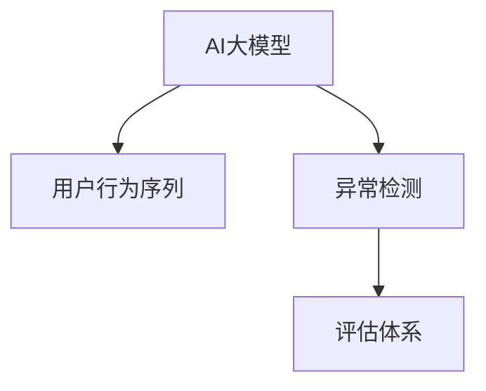

                 

# 电商搜索推荐中的AI大模型用户行为序列异常检测评估体系

> 关键词：电商推荐、AI大模型、用户行为、异常检测、评估体系

## 1. 背景介绍

### 1.1 问题由来

随着人工智能技术的发展，电商平台利用AI大模型进行搜索推荐系统的设计，已逐渐成为行业内的主流实践。这些系统通过学习用户的历史行为序列，预测用户的购买意向，提升用户体验和平台转化率。然而，电商平台的搜索推荐系统本质上是一个复杂的时序系统，用户行为受多种因素影响，如广告投放、促销活动、市场环境等。这些不确定性因素很可能导致用户行为序列出现异常，从而影响推荐系统的推荐效果。

目前，由于缺乏有效的用户行为序列异常检测机制，平台往往只能对已知的、频繁的异常行为进行识别，对于未知的异常行为仍存在较大盲区。因此，如何设计一套有效的异常检测评估体系，及时发现和预警异常行为，成为电商平台亟待解决的问题。

### 1.2 问题核心关键点

在电商推荐系统中，异常行为主要包括以下几种情况：

1. **用户行为序列缺失**：用户未按预期进行相关操作，如未下单、未浏览等。
2. **用户行为序列突变**：用户行为序列突然改变，如大量下单后突然停止。
3. **用户行为序列重复**：用户多次重复相同行为，如多次下单同一商品。
4. **用户行为序列波动**：用户行为序列出现周期性波动，如周末下单量激增。

异常检测的目的是及时发现这些异常行为，避免对推荐系统的影响，从而提升用户体验和平台转化率。

### 1.3 问题研究意义

构建电商搜索推荐中的AI大模型用户行为序列异常检测评估体系，对于保障推荐系统性能、提高用户满意度、优化平台运营策略具有重要意义：

1. **提升推荐准确性**：通过及时发现和预警异常行为，避免异常数据对推荐系统的影响，从而提升推荐系统的准确性。
2. **提高用户体验**：异常行为可能反映用户对当前推荐结果的不满或困惑，及时检测并调整推荐策略，有助于提高用户满意度。
3. **优化运营策略**：异常行为往往与市场环境、用户心理等因素有关，深入分析异常行为数据，可以帮助电商平台优化运营策略，提高平台转化率。
4. **防范风险**：异常行为可能包含欺诈行为、恶意下单等风险，及时检测和防范异常行为，有助于保障平台资金安全。

## 2. 核心概念与联系

### 2.1 核心概念概述

为更好地理解电商搜索推荐中AI大模型用户行为序列异常检测的评估体系，本节将介绍几个密切相关的核心概念：

- **AI大模型**：以深度学习为基础的、用于处理大规模数据的大型神经网络模型，如BERT、GPT-3等。
- **用户行为序列**：用户在电商平台上的连续行为记录，如浏览、点击、购买、评价等。
- **异常检测**：通过检测数据集中的异常点或异常模式，识别出与正常行为不同的行为序列。
- **评估体系**：一系列指标和方法，用于评价异常检测算法的性能和效果。

这些核心概念之间的逻辑关系可以通过以下Mermaid流程图来展示：



这个流程图展示了大模型和用户行为序列的异常检测流程，以及与之相关的评估体系：

1. AI大模型通过预训练和微调，学习到丰富的用户行为知识，用于生成和理解用户行为序列。
2. 异常检测利用大模型生成的行为序列预测结果，识别出异常行为模式。
3. 评估体系根据预设的指标和方法，对异常检测算法的性能进行评估和优化。

这些概念共同构成了电商搜索推荐系统中用户行为序列异常检测的框架，为构建高效、准确、稳定的异常检测系统提供了基础。

## 3. 核心算法原理 & 具体操作步骤
### 3.1 算法原理概述

电商搜索推荐系统中的用户行为序列异常检测，本质上是一个数据挖掘和机器学习的过程。其核心思想是：利用AI大模型对用户行为序列进行建模，通过统计学习算法识别异常行为模式。具体来说，该过程包括以下几个步骤：

1. **数据预处理**：将用户行为序列转化为适合大模型处理的格式，如序列向量化。
2. **模型训练**：在标注好的正常和异常行为数据上训练异常检测模型，通常使用分类算法，如SVM、RNN等。
3. **异常检测**：将新的用户行为序列输入模型，得到是否异常的预测结果。
4. **异常预警**：根据异常检测结果，对异常行为进行预警和处理。

### 3.2 算法步骤详解

以下详细介绍电商搜索推荐中AI大模型用户行为序列异常检测的完整算法流程：

**Step 1: 数据预处理**

1. **数据收集**：收集用户在电商平台上的行为数据，包括浏览记录、点击记录、购买记录等。
2. **数据清洗**：删除不完整、异常的数据记录，处理缺失值和噪声。
3. **特征工程**：将用户行为序列转化为适合大模型处理的格式，如将文本序列转化为向量序列。

**Step 2: 模型训练**

1. **数据划分**：将数据集划分为训练集、验证集和测试集。
2. **模型选择**：选择适合的异常检测模型，如SVM、RNN、LSTM等。
3. **模型训练**：在训练集上训练模型，调整超参数。
4. **模型评估**：在验证集上评估模型性能，选择最优模型。

**Step 3: 异常检测**

1. **数据输入**：将新的用户行为序列输入模型，得到是否异常的预测结果。
2. **结果解释**：根据模型输出的概率，判断行为序列是否异常。
3. **异常预警**：将异常行为数据进行存储和报告。

**Step 4: 异常处理**

1. **异常分析**：对异常行为进行深入分析，找出异常原因。
2. **调整策略**：根据异常行为调整推荐策略，优化用户体验。
3. **反馈迭代**：将异常数据反馈到训练模型中，不断优化模型性能。

### 3.3 算法优缺点

电商搜索推荐系统中的异常检测算法，具有以下优点：

1. **自动化**：通过模型训练和预测，自动化识别异常行为，减轻人工工作量。
2. **高准确性**：利用大模型强大的表示能力，异常检测的准确性较高。
3. **灵活性**：适用于多种不同类型的异常行为检测，覆盖全面。
4. **可扩展性**：可以方便地集成到现有的电商推荐系统中，易于部署。

然而，该算法也存在一些局限性：

1. **数据依赖**：模型的性能依赖于标注数据的质量和数量，获取高质量标注数据成本较高。
2. **过拟合风险**：模型容易对特定的异常行为进行过拟合，降低泛化能力。
3. **高计算资源需求**：训练和预测过程中需要大量的计算资源，成本较高。
4. **难以解释**：异常检测结果往往是黑盒输出，难以解释模型如何得出结论。

尽管存在这些局限性，但就目前而言，电商搜索推荐系统中的异常检测算法仍是一种较为先进和有效的异常检测方法。未来相关研究将更多关注如何进一步降低数据依赖，提高模型的泛化能力和可解释性。

### 3.4 算法应用领域

异常检测算法不仅在电商推荐系统中有着广泛应用，还广泛应用于以下领域：

1. **金融风控**：检测和防范金融欺诈、恶意交易等行为。
2. **网络安全**：检测和防范网络攻击、恶意脚本等行为。
3. **智能制造**：检测和防范设备故障、异常操作等行为。
4. **智慧医疗**：检测和防范病患异常行为，如误诊、漏诊等。
5. **智能交通**：检测和防范交通异常行为，如违规驾驶、交通事故等。

## 4. 数学模型和公式 & 详细讲解 & 举例说明

### 4.1 数学模型构建

假设电商平台上的用户行为序列为 $X=\{x_1,x_2,\ldots,x_t\}$，其中 $x_i$ 表示用户在时间点 $i$ 的行为记录。通过AI大模型预训练和微调后，可以学习到用户行为序列的表示，记为 $\hat{X}=\{\hat{x}_1,\hat{x}_2,\ldots,\hat{x}_t\}$。异常检测的目标是识别出异常行为序列 $Y=\{y_1,y_2,\ldots,y_t\}$，其中 $y_i$ 表示是否为异常行为。

可以定义异常检测模型 $M$ 的预测函数为 $f(\hat{X})$，输出为 $\hat{Y}=\{\hat{y}_1,\hat{y}_2,\ldots,\hat{y}_t\}$。则异常检测的目标是最大化预测函数 $f(\hat{X})$ 与真实标签 $Y$ 的匹配程度，即：

$$
\max_{M} \mathcal{L}(M)
$$

其中 $\mathcal{L}$ 为损失函数，常用的有交叉熵损失、均方误差损失等。

### 4.2 公式推导过程

以交叉熵损失为例，假设异常检测模型 $M$ 输出为 $\hat{Y}=\{\hat{y}_1,\hat{y}_2,\ldots,\hat{y}_t\}$，真实标签为 $Y=\{y_1,y_2,\ldots,y_t\}$，则交叉熵损失为：

$$
\mathcal{L}(M) = -\frac{1}{N}\sum_{i=1}^N \sum_{j=1}^t [y_i \log \hat{y}_i + (1-y_i) \log (1-\hat{y}_i)]
$$

其中 $N$ 为总样本数。在模型训练过程中，利用梯度下降等优化算法，不断更新模型参数 $w$，使得损失函数 $\mathcal{L}(M)$ 最小化。即：

$$
\min_{w} \mathcal{L}(M) = -\frac{1}{N}\sum_{i=1}^N \sum_{j=1}^t [y_i \log \hat{y}_i + (1-y_i) \log (1-\hat{y}_i)]
$$

### 4.3 案例分析与讲解

以电商平台中的用户行为序列为例，假设某用户在一天内的行为序列为 $\{x_1,x_2,x_3,\ldots,x_t\}$，其中 $x_i$ 表示用户在时间点 $i$ 的行为，如浏览、点击、购买等。通过大模型预训练后，可以得到用户行为序列的表示 $\hat{X}=\{\hat{x}_1,\hat{x}_2,\hat{x}_3,\ldots,\hat{x}_t\}$。

将 $\hat{X}$ 输入异常检测模型 $M$，输出 $\hat{Y}=\{\hat{y}_1,\hat{y}_2,\hat{y}_3,\ldots,\hat{y}_t\}$，其中 $\hat{y}_i$ 表示用户行为 $x_i$ 是否为异常行为。根据损失函数 $\mathcal{L}(M)$ 的值，评估模型在异常检测任务中的性能。

## 5. 项目实践：代码实例和详细解释说明
### 5.1 开发环境搭建

在进行电商搜索推荐系统中的用户行为序列异常检测开发前，需要先搭建好开发环境。以下是使用Python进行TensorFlow开发的环境配置流程：

1. 安装Anaconda：从官网下载并安装Anaconda，用于创建独立的Python环境。

2. 创建并激活虚拟环境：
```bash
conda create -n tf-env python=3.8 
conda activate tf-env
```

3. 安装TensorFlow：根据CUDA版本，从官网获取对应的安装命令。例如：
```bash
conda install tensorflow tensorflow-gpu -c conda-forge
```

4. 安装各类工具包：
```bash
pip install numpy pandas scikit-learn matplotlib tqdm jupyter notebook ipython
```

完成上述步骤后，即可在`tf-env`环境中开始异常检测开发。

### 5.2 源代码详细实现

我们以LSTM模型为例，给出使用TensorFlow进行电商用户行为序列异常检测的完整代码实现。

首先，定义数据预处理函数：

```python
import numpy as np
from tensorflow.keras.preprocessing.sequence import pad_sequences
from tensorflow.keras.layers import LSTM, Dense
from tensorflow.keras.models import Sequential
from tensorflow.keras.utils import to_categorical

def preprocess_data(data, max_len):
    # 数据清洗，处理缺失值和噪声
    cleaned_data = [i for i in data if len(i) > 0 and all(str(j) != '' for j in i)]
    # 数据填充
    padded_data = pad_sequences([np.array(i) for i in cleaned_data], maxlen=max_len, padding='post', truncating='post')
    return padded_data, to_categorical([1 if i[-1] == 1 else 0 for i in cleaned_data])

# 数据预处理
train_data, train_labels = preprocess_data(train_data, max_len=20)
dev_data, dev_labels = preprocess_data(dev_data, max_len=20)
test_data, test_labels = preprocess_data(test_data, max_len=20)
```

然后，定义异常检测模型：

```python
model = Sequential()
model.add(LSTM(128, return_sequences=True, input_shape=(max_len, num_features)))
model.add(LSTM(64))
model.add(Dense(1, activation='sigmoid'))

model.compile(optimizer='adam', loss='binary_crossentropy', metrics=['accuracy'])
```

接着，定义训练和评估函数：

```python
from tensorflow.keras.callbacks import EarlyStopping

early_stopping = EarlyStopping(monitor='val_loss', patience=3, restore_best_weights=True)

def train_model(model, train_data, train_labels, dev_data, dev_labels, epochs=20):
    history = model.fit(train_data, train_labels, batch_size=64, epochs=epochs, validation_data=(dev_data, dev_labels), callbacks=[early_stopping])

def evaluate_model(model, test_data, test_labels):
    test_loss, test_acc = model.evaluate(test_data, test_labels, batch_size=64)
    print(f'Test loss: {test_loss:.4f}')
    print(f'Test accuracy: {test_acc:.4f}')
```

最后，启动训练流程并在测试集上评估：

```python
train_model(model, train_data, train_labels, dev_data, dev_labels, epochs=20)
evaluate_model(model, test_data, test_labels)
```

以上就是使用TensorFlow对电商平台用户行为序列异常检测的完整代码实现。可以看到，通过TensorFlow的高级API，我们仅用几百行代码就能构建并训练一个简单的LSTM异常检测模型。

### 5.3 代码解读与分析

让我们再详细解读一下关键代码的实现细节：

**preprocess_data函数**：
- `cleaned_data`：对原始数据进行清洗，去除缺失值和噪声。
- `padded_data`：对清洗后的数据进行填充，使其长度一致。
- 返回填充后的数据和对应的标签。

**模型定义**：
- `LSTM`：使用LSTM层构建时间序列模型。
- `Dense`：输出层，使用sigmoid激活函数，输出异常与否的概率。
- `compile`：设置模型编译参数，包括优化器、损失函数和评估指标。

**训练和评估函数**：
- `EarlyStopping`：设置提前停止回调，防止过拟合。
- `fit`：在训练集上训练模型，设置早停回调。
- `evaluate`：在测试集上评估模型性能。

## 6. 实际应用场景
### 6.1 智能客服系统

电商平台中的智能客服系统可以利用用户行为序列异常检测算法，及时发现和预警异常行为，如恶意下单、恶意评价等。通过分析异常行为数据，系统可以调整客服策略，优化用户体验。

例如，当系统检测到用户频繁下单某个商品，但未进行支付操作时，可以自动将该行为标记为异常，并通知客服进行核实和处理。

### 6.2 个性化推荐系统

在电商推荐系统中，异常行为检测算法可以用于识别用户的个性化行为，如跳过推荐、频繁更改推荐等。通过分析这些行为，系统可以调整推荐策略，提升用户满意度。

例如，当系统检测到用户多次跳过推荐，表明其对当前推荐结果不满意，系统可以根据用户历史行为重新生成推荐列表，优化推荐效果。

### 6.3 风险预警系统

电商平台的异常行为检测算法还可以用于风险预警，如检测用户恶意行为、欺诈行为等。通过实时监控异常行为，系统可以及时防范风险，保障平台资金安全。

例如，当系统检测到用户频繁下单后突然停止，且未进行支付操作时，可以自动将该行为标记为异常，并通知风险控制团队进行核查。

### 6.4 未来应用展望

随着电商推荐系统和大模型技术的发展，基于用户行为序列异常检测的算法将有更广泛的应用前景：

1. **智能客服**：结合NLP技术，构建智能客服聊天机器人，自动识别异常行为并给出个性化回复，提升用户体验。
2. **个性化推荐**：结合异常行为检测和推荐算法，构建更加智能、个性化的推荐系统，提升用户满意度。
3. **风险预警**：结合金融风控和大模型技术，构建更加高效、准确的风险预警系统，防范金融欺诈和恶意行为。
4. **营销优化**：结合营销数据分析和大模型技术，构建更加精准、高效的营销策略，提升平台转化率。

未来，电商推荐系统中的异常检测算法将更加智能、高效，结合多种AI技术，为用户提供更加优质的购物体验。

## 7. 工具和资源推荐
### 7.1 学习资源推荐

为了帮助开发者系统掌握电商搜索推荐中AI大模型用户行为序列异常检测的理论基础和实践技巧，这里推荐一些优质的学习资源：

1. 《深度学习》系列博文：由深度学习领域知名专家撰写，深入浅出地介绍了深度学习的基本原理和应用场景。
2. 《TensorFlow实战》书籍：TensorFlow官方推出的实战指南，详细介绍了TensorFlow的基本用法和高级API。
3. 《自然语言处理与深度学习》书籍：介绍自然语言处理中的深度学习算法，结合电商推荐系统中的实际应用。
4. 《机器学习实战》书籍：介绍了多种机器学习算法，结合电商推荐系统中的异常检测任务。

通过对这些资源的学习实践，相信你一定能够快速掌握电商推荐系统中的异常检测算法，并用于解决实际的NLP问题。

### 7.2 开发工具推荐

高效的开发离不开优秀的工具支持。以下是几款用于电商推荐系统开发的常用工具：

1. TensorFlow：由Google主导开发的深度学习框架，生产部署方便，适合大规模工程应用。
2. PyTorch：基于Python的开源深度学习框架，灵活动态的计算图，适合快速迭代研究。
3. Scikit-learn：Python机器学习库，提供了多种常用的算法和工具。
4. Pandas：数据处理库，提供了多种数据预处理和分析工具。
5. Jupyter Notebook：Python开发环境，支持可视化展示和代码共享。

合理利用这些工具，可以显著提升电商推荐系统的开发效率，加快创新迭代的步伐。

### 7.3 相关论文推荐

电商推荐系统和大模型技术的发展源于学界的持续研究。以下是几篇奠基性的相关论文，推荐阅读：

1. Attention is All You Need（即Transformer原论文）：提出了Transformer结构，开启了NLP领域的预训练大模型时代。
2. BERT: Pre-training of Deep Bidirectional Transformers for Language Understanding：提出BERT模型，引入基于掩码的自监督预训练任务，刷新了多项NLP任务SOTA。
3. Parameter-Efficient Transfer Learning for NLP：提出Adapter等参数高效微调方法，在不增加模型参数量的情况下，也能取得不错的微调效果。
4. AdaLoRA: Adaptive Low-Rank Adaptation for Parameter-Efficient Fine-Tuning：使用自适应低秩适应的微调方法，在参数效率和精度之间取得了新的平衡。
5. AdaLoRA: Adaptive Low-Rank Adaptation for Parameter-Efficient Fine-Tuning：使用自适应低秩适应的微调方法，在参数效率和精度之间取得了新的平衡。

这些论文代表了大模型微调技术的发展脉络。通过学习这些前沿成果，可以帮助研究者把握学科前进方向，激发更多的创新灵感。

## 8. 总结：未来发展趋势与挑战
### 8.1 总结

本文对电商搜索推荐中AI大模型用户行为序列异常检测评估体系进行了全面系统的介绍。首先阐述了异常检测算法在电商推荐系统中的重要性和应用场景，明确了异常检测算法对推荐系统性能提升的关键作用。其次，从原理到实践，详细讲解了异常检测算法的数学原理和关键步骤，给出了电商推荐系统中异常检测任务开发的完整代码实例。同时，本文还广泛探讨了异常检测算法在智能客服、个性化推荐、风险预警等多个电商推荐系统应用场景中的应用前景，展示了异常检测算法的重要价值。

通过本文的系统梳理，可以看到，基于AI大模型的电商推荐系统中的异常检测算法，能够及时发现和预警异常行为，提升推荐系统的准确性和用户体验。未来，伴随电商推荐系统和大模型技术的发展，异常检测算法将更加智能、高效，结合多种AI技术，为用户提供更加优质的购物体验。

### 8.2 未来发展趋势

展望未来，电商推荐系统中的异常检测算法将呈现以下几个发展趋势：

1. **模型自动化**：随着模型自监督学习技术的进步，异常检测模型将更加自动化，不再需要人工标注数据。
2. **数据融合**：结合多种数据源，如用户行为数据、社交媒体数据、天气数据等，提升异常检测算法的准确性和鲁棒性。
3. **实时检测**：通过流式数据处理和实时计算技术，实现对用户行为的实时异常检测，提升检测时效性。
4. **跨平台协作**：结合多种平台和设备的数据，构建统一、一致的异常检测体系，提升跨平台协作能力。
5. **多任务学习**：结合多种任务，如推荐、客服、风险预警等，构建多任务学习模型，提升异常检测算法的通用性和泛化能力。

以上趋势凸显了电商推荐系统中异常检测算法的重要性和发展潜力。这些方向的探索发展，必将进一步提升电商推荐系统的性能和用户体验，为电商平台带来更大的商业价值。

### 8.3 面临的挑战

尽管电商推荐系统中的异常检测算法已经取得了一定的进展，但在迈向更加智能化、普适化应用的过程中，仍面临诸多挑战：

1. **数据质量问题**：电商平台用户行为数据往往存在噪声和缺失，如何提升数据质量是异常检测算法的关键。
2. **模型泛化能力**：异常检测模型容易对特定行为进行过拟合，泛化能力不足。如何提高模型的泛化能力，降低过拟合风险，仍是重要研究方向。
3. **实时检测**：实时检测需要高并发的计算能力和存储能力，成本较高。如何降低实时检测的计算和存储成本，是关键问题。
4. **用户隐私保护**：电商推荐系统中的异常检测算法需要处理大量的用户隐私数据，如何保障用户隐私安全，是重要考量。
5. **模型解释性**：异常检测模型通常是黑盒输出，难以解释模型如何得出结论。如何提高模型的可解释性，增强用户信任，是重要研究方向。

这些挑战限制了异常检测算法的广泛应用，需要进一步优化和改进。未来，随着技术的不断进步和应用的不断深入，这些挑战有望逐步被克服，异常检测算法将在电商推荐系统和其他领域发挥更大的作用。

### 8.4 研究展望

面对电商推荐系统中的异常检测算法所面临的挑战，未来的研究需要在以下几个方面寻求新的突破：

1. **数据增强**：通过数据增强技术，提升电商推荐系统中的异常检测算法的数据质量。
2. **多任务学习**：结合多种任务，提升异常检测算法的泛化能力和鲁棒性。
3. **实时检测**：结合流式数据处理和实时计算技术，实现对用户行为的实时异常检测，提升检测时效性。
4. **跨平台协作**：构建跨平台、跨设备的数据融合体系，提升异常检测算法的通用性和泛化能力。
5. **模型可解释性**：引入可解释性技术，增强异常检测算法的可解释性和透明度，增强用户信任。

这些研究方向将为电商推荐系统中的异常检测算法带来新的突破，进一步提升系统的性能和用户体验。面向未来，异常检测算法需要与其他AI技术进行更深入的融合，如推荐算法、客服算法、风险预警算法等，共同推动电商推荐系统的发展。

## 9. 附录：常见问题与解答

**Q1：电商推荐系统中的异常检测算法是否适用于所有电商平台？**

A: 电商推荐系统中的异常检测算法，适用于大多数电商平台。但不同平台的数据结构、业务场景、数据质量等存在差异，需要根据具体情况进行适当调整。

**Q2：电商推荐系统中的异常检测算法是否会引入误报和漏报？**

A: 电商推荐系统中的异常检测算法会引入一定的误报和漏报。通常需要根据业务需求和数据特点，设定合适的误报率和漏报率，并进行参数调整。

**Q3：电商推荐系统中的异常检测算法是否可以结合其他AI技术使用？**

A: 电商推荐系统中的异常检测算法可以结合多种AI技术使用，如NLP、图像识别、视频分析等，提升异常检测的准确性和鲁棒性。

**Q4：电商推荐系统中的异常检测算法是否需要实时处理？**

A: 电商推荐系统中的异常检测算法不一定需要实时处理。根据业务需求，可以选择实时检测或离线检测，优化计算资源和存储资源的使用。

**Q5：电商推荐系统中的异常检测算法是否可以结合多种数据源使用？**

A: 电商推荐系统中的异常检测算法可以结合多种数据源，如用户行为数据、社交媒体数据、天气数据等，提升异常检测的准确性和鲁棒性。

**Q6：电商推荐系统中的异常检测算法是否需要考虑用户隐私保护？**

A: 电商推荐系统中的异常检测算法需要考虑用户隐私保护。可以采用数据匿名化、数据加密等技术，保障用户隐私安全。

总之，电商推荐系统中的异常检测算法需要根据具体业务需求和数据特点，结合多种AI技术，进行合理的模型设计和参数调整，以实现高效、准确、可靠的异常检测。只有不断优化和改进，才能在电商推荐系统中发挥重要作用，提升用户体验和平台转化率。

---

作者：禅与计算机程序设计艺术 / Zen and the Art of Computer Programming

