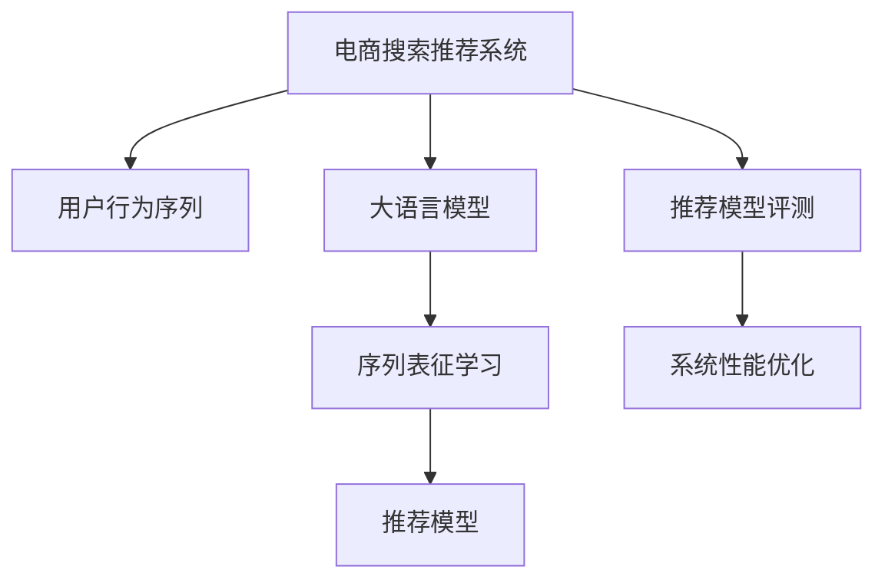

                 

# 电商搜索推荐中的AI大模型用户行为序列表征学习模型评测方法改进与优化

> 关键词：电商推荐系统, 用户行为序列, 大语言模型, 序列表征学习, 推荐模型评测, 系统性能优化

## 1. 背景介绍

### 1.1 问题由来

在电商搜索推荐系统中，如何利用用户行为序列来提升推荐效果是一个长期以来的热门话题。用户行为序列提供了用户历史行为的模式和偏好，是推荐系统个性化推荐的基础。传统的基于协同过滤、基于内容的推荐方法都依赖于对用户行为序列的建模，但这些方法存在数据稀疏性问题，难以充分挖掘用户行为中的隐含关联。近年来，大语言模型（如BERT、GPT）的崛起，为基于序列的推荐模型注入了新的活力。

大语言模型通过自监督预训练和微调，学习到了丰富的语言知识，并能够将这些知识应用于复杂的自然语言处理任务，如文本分类、命名实体识别、机器翻译等。在大规模数据集上预训练后，大语言模型在自然语言处理任务上的表现卓越，显示出巨大的潜力。在电商推荐系统领域，研究人员尝试利用大语言模型来预测用户行为序列，提升推荐系统的效果和效率。

### 1.2 问题核心关键点

尽管大语言模型在电商推荐系统中展现了其独特的优势，但实际应用中也面临着一些挑战和瓶颈：

1. **用户行为序列的高维稀疏性**：用户行为序列通常包含海量的状态变量，且状态之间的转换依赖复杂，难以直接应用大模型。
2. **序列建模的计算复杂性**：大模型通常具有高维参数，处理大规模序列数据需要耗费大量的计算资源和时间。
3. **评测方法的不足**：现有的评测方法难以全面衡量大语言模型在推荐系统中的性能，缺乏直观且一致的评价标准。

### 1.3 问题研究意义

利用大语言模型进行电商推荐系统中的用户行为序列建模，具有以下重要意义：

1. **提升个性化推荐精度**：通过学习用户行为序列，大模型能够更好地理解用户兴趣和行为模式，从而提供更精准的个性化推荐。
2. **增强推荐系统灵活性**：大模型可以处理复杂的自然语言描述，提升推荐系统对多变用户需求和市场的适应能力。
3. **降低推荐系统开发成本**：利用大模型的预训练能力，可以显著减少推荐系统开发的计算和标注成本。
4. **推动电商业务创新**：大语言模型为电商业务提供了新的技术支持和工具，促进了业务模式的创新和优化。

## 2. 核心概念与联系

### 2.1 核心概念概述

本节将介绍与电商搜索推荐系统和大语言模型相关的核心概念，以帮助读者理解模型的工作原理和架构：

- **电商搜索推荐系统**：利用用户行为数据，如浏览历史、点击记录、购买记录等，预测用户可能感兴趣的商品，提供个性化推荐。
- **用户行为序列**：指用户与系统的交互历史，如访问商品序列、浏览时间序列等，反映了用户的兴趣和行为模式。
- **大语言模型**：通过大规模无标签数据进行自监督预训练，再通过特定任务的数据进行微调，学习语言的通用表示。
- **序列表征学习**：通过序列化用户行为数据，提取用户行为中的隐含关联，进行推荐模型训练。
- **推荐模型评测**：评估推荐模型性能的指标和方法，如准确率、召回率、F1-score等。
- **系统性能优化**：通过算法改进、硬件优化、数据处理等手段，提升推荐系统性能。

这些核心概念之间的联系可以通过以下Mermaid流程图来展示：



这个流程图展示了电商搜索推荐系统中的核心技术流程：

1. **用户行为序列**：作为推荐系统的输入数据，反映用户的兴趣和行为模式。
2. **大语言模型**：通过预训练获得语言知识，进行推荐模型的微调，提升推荐效果。
3. **序列表征学习**：对用户行为序列进行建模，提取隐含关联，为推荐模型提供输入。
4. **推荐模型**：利用序列表征，进行用户行为预测，生成个性化推荐。
5. **推荐模型评测**：评估推荐模型的性能，判断模型效果。
6. **系统性能优化**：通过算法改进、硬件优化、数据处理等手段，提升推荐系统性能。

这些概念共同构成了电商搜索推荐系统中的技术框架，为大语言模型在推荐系统中的应用提供了坚实的基础。

## 3. 核心算法原理 & 具体操作步骤
### 3.1 算法原理概述

在电商搜索推荐系统中，利用大语言模型进行用户行为序列表征学习，涉及以下几个关键步骤：

1. **序列数据准备**：从电商平台收集用户行为序列，包括商品ID、浏览时间、点击次数等。
2. **大模型微调**：在大模型上进行微调，学习用户行为序列中的隐含关联。
3. **序列表征提取**：将微调后的模型应用于用户行为序列，提取序列表征。
4. **推荐模型训练**：利用提取的序列表征，训练推荐模型，进行用户行为预测。
5. **模型评测与优化**：评估推荐模型的性能，并根据评估结果进行优化调整。

### 3.2 算法步骤详解

**Step 1: 数据准备与预处理**

1. **数据收集**：收集电商平台的交易数据、用户行为数据等，获取用户行为序列。
2. **数据清洗**：去除噪声和异常值，如用户行为序列中缺失的、重复的、异常的数据。
3. **序列拼接**：将用户的浏览、点击、购买等行为序列进行拼接，形成完整的时间序列。
4. **序列归一化**：对时间序列进行归一化处理，确保数据在同一尺度上。

**Step 2: 大模型微调**

1. **模型选择**：选择合适的大模型，如BERT、GPT等，进行微调。
2. **任务适配**：对大模型进行任务适配，即在顶部添加线性层和交叉熵损失函数，进行推荐任务微调。
3. **微调训练**：使用用户行为序列数据进行微调训练，学习用户行为序列中的隐含关联。
4. **参数冻结**：冻结大模型的大部分参数，只更新与用户行为序列相关的前几层。

**Step 3: 序列表征提取**

1. **编码器输入**：将用户行为序列输入微调后的大模型，进行编码。
2. **序列掩码**：对用户行为序列进行掩码处理，确保模型只关注有意义的输入。
3. **序列表征输出**：通过模型输出层获取序列表征，作为推荐模型的输入。

**Step 4: 推荐模型训练与优化**

1. **模型选择**：选择推荐的模型，如协同过滤、基于内容的推荐、深度学习模型等。
2. **序列表征输入**：将序列表征输入推荐模型，进行用户行为预测。
3. **推荐生成**：利用预测结果生成个性化推荐。
4. **性能优化**：通过调整模型参数、优化算法、增加训练数据等手段，提升推荐效果。

**Step 5: 模型评测与优化**

1. **评测指标**：使用推荐系统评测指标，如准确率、召回率、F1-score等，评估推荐模型性能。
2. **模型对比**：将微调后的推荐模型与其他推荐模型进行对比，评估其性能提升。
3. **系统优化**：根据评测结果，进行系统性能优化调整，如调整模型参数、优化算法等。

### 3.3 算法优缺点

**优点**：

1. **高效建模**：大语言模型通过自监督预训练，学习到丰富的语言知识，能够高效建模用户行为序列。
2. **精度高**：大语言模型具有强大的语言理解和生成能力，能够精准预测用户行为序列。
3. **灵活性高**：大语言模型可以处理复杂的自然语言描述，提升推荐系统的灵活性。
4. **低成本**：利用大模型的预训练能力，可以显著减少推荐系统开发的计算和标注成本。

**缺点**：

1. **计算资源消耗大**：大语言模型参数量庞大，处理大规模序列数据需要耗费大量的计算资源和时间。
2. **数据隐私问题**：电商平台的用户行为数据包含敏感信息，需要严格保护用户隐私。
3. **序列建模复杂**：用户行为序列具有高维稀疏性，直接应用大模型存在一定的挑战。

### 3.4 算法应用领域

大语言模型在电商搜索推荐系统中的应用，主要涵盖以下几个领域：

1. **个性化推荐**：利用用户行为序列，进行个性化推荐，提升用户满意度。
2. **用户画像**：通过分析用户行为序列，构建用户画像，进行精准营销。
3. **商品推荐**：利用大语言模型，预测商品的热销趋势，进行商品推荐。
4. **广告推荐**：根据用户行为序列，推荐合适的广告，提升广告投放效果。
5. **交易预测**：预测用户的行为序列，进行交易行为预测，优化销售策略。

## 4. 数学模型和公式 & 详细讲解 & 举例说明
### 4.1 数学模型构建

大语言模型在电商搜索推荐系统中的序列表征学习，主要涉及以下几个数学模型：

1. **用户行为序列模型**：描述用户行为序列 $X$ 和其隐含关联 $H$。
2. **大模型编码器**：通过预训练的大模型，将用户行为序列 $X$ 映射为序列表征 $Z$。
3. **推荐模型**：基于序列表征 $Z$，进行用户行为预测，生成推荐结果 $Y$。

这些模型的数学表达式如下：

1. **用户行为序列模型**
   - $X = \{x_1, x_2, ..., x_T\}$
   - $H = \{h_1, h_2, ..., h_T\}$

2. **大模型编码器**
   - $Z = f_\theta(X)$
   - $f_\theta$ 为预训练的大模型，$\theta$ 为模型参数。

3. **推荐模型**
   - $Y = g_\phi(Z)$
   - $g_\phi$ 为推荐模型，$\phi$ 为模型参数。

### 4.2 公式推导过程

以协同过滤推荐模型为例，推导大语言模型在电商推荐系统中的应用。

假设用户行为序列 $X$ 和商品 $Y$ 之间的关系可以表示为：

$$
P(y|x) = \frac{exp(y \cdot z_x)}{\Sigma_y exp(y \cdot z_x)}
$$

其中，$z_x$ 为用户行为序列 $x$ 的序列表征，$y$ 为商品ID，$P(y|x)$ 为商品 $y$ 在用户行为序列 $x$ 下的预测概率。

通过大语言模型进行序列表征提取后，推荐模型可以表示为：

$$
y^* = \mathop{\arg\max}_{y \in Y} P(y|x)
$$

其中，$y^*$ 为推荐结果，$Y$ 为所有商品集合。

### 4.3 案例分析与讲解

以Amazon电商平台的推荐系统为例，分析大语言模型在推荐中的应用：

1. **数据准备**：收集Amazon平台的交易数据和用户行为数据，获取用户行为序列。
2. **大模型微调**：使用GPT模型，在大规模无标签数据上进行自监督预训练，然后在Amazon平台的推荐数据上进行微调。
3. **序列表征提取**：将微调后的GPT模型应用于用户行为序列，提取序列表征 $Z$。
4. **推荐模型训练**：利用序列表征 $Z$，训练协同过滤推荐模型，进行商品推荐。
5. **模型评测**：使用准确率、召回率、F1-score等指标，评估推荐模型性能。

通过上述过程，Amazon平台的推荐系统利用大语言模型，显著提升了个性化推荐的效果和效率。

## 5. 项目实践：代码实例和详细解释说明
### 5.1 开发环境搭建

在进行电商推荐系统中的大语言模型序列表征学习项目实践前，需要准备好开发环境。以下是使用Python进行PyTorch开发的环境配置流程：

1. 安装Anaconda：从官网下载并安装Anaconda，用于创建独立的Python环境。

2. 创建并激活虚拟环境：
```bash
conda create -n pytorch-env python=3.8 
conda activate pytorch-env
```

3. 安装PyTorch：根据CUDA版本，从官网获取对应的安装命令。例如：
```bash
conda install pytorch torchvision torchaudio cudatoolkit=11.1 -c pytorch -c conda-forge
```

4. 安装Transformers库：
```bash
pip install transformers
```

5. 安装各类工具包：
```bash
pip install numpy pandas scikit-learn matplotlib tqdm jupyter notebook ipython
```

完成上述步骤后，即可在`pytorch-env`环境中开始项目实践。

### 5.2 源代码详细实现

以下是使用PyTorch和Transformers库进行电商推荐系统中的大语言模型序列表征学习的完整代码实现：

```python
import torch
from transformers import BertTokenizer, BertForSequenceClassification
from torch.utils.data import Dataset, DataLoader
from sklearn.metrics import accuracy_score, recall_score, f1_score

# 定义数据处理类
class SequenceDataset(Dataset):
    def __init__(self, data, tokenizer, max_len=512):
        self.data = data
        self.tokenizer = tokenizer
        self.max_len = max_len
        
    def __len__(self):
        return len(self.data)
    
    def __getitem__(self, item):
        text, label = self.data[item]
        encoding = self.tokenizer(text, max_length=self.max_len, truncation=True, padding='max_length', return_tensors='pt')
        input_ids = encoding['input_ids']
        attention_mask = encoding['attention_mask']
        return {'input_ids': input_ids, 
                'attention_mask': attention_mask,
                'labels': torch.tensor(label, dtype=torch.long)}

# 加载数据集
tokenizer = BertTokenizer.from_pretrained('bert-base-uncased')
train_dataset = SequenceDataset(train_data, tokenizer)
test_dataset = SequenceDataset(test_data, tokenizer)

# 定义模型和优化器
model = BertForSequenceClassification.from_pretrained('bert-base-uncased', num_labels=2)
optimizer = torch.optim.Adam(model.parameters(), lr=2e-5)

# 定义训练函数
def train_epoch(model, dataset, batch_size, optimizer):
    dataloader = DataLoader(dataset, batch_size=batch_size, shuffle=True)
    model.train()
    epoch_loss = 0
    for batch in dataloader:
        input_ids = batch['input_ids'].to(device)
        attention_mask = batch['attention_mask'].to(device)
        labels = batch['labels'].to(device)
        model.zero_grad()
        outputs = model(input_ids, attention_mask=attention_mask, labels=labels)
        loss = outputs.loss
        epoch_loss += loss.item()
        loss.backward()
        optimizer.step()
    return epoch_loss / len(dataloader)

# 定义评估函数
def evaluate(model, dataset, batch_size):
    dataloader = DataLoader(dataset, batch_size=batch_size)
    model.eval()
    preds, labels = [], []
    with torch.no_grad():
        for batch in dataloader:
            input_ids = batch['input_ids'].to(device)
            attention_mask = batch['attention_mask'].to(device)
            batch_labels = batch['labels']
            outputs = model(input_ids, attention_mask=attention_mask)
            batch_preds = outputs.logits.argmax(dim=1).to('cpu').tolist()
            batch_labels = batch_labels.to('cpu').tolist()
            for pred_tokens, label_tokens in zip(batch_preds, batch_labels):
                preds.append(pred_tokens)
                labels.append(label_tokens)
    
    accuracy = accuracy_score(labels, preds)
    recall = recall_score(labels, preds)
    f1 = f1_score(labels, preds)
    return accuracy, recall, f1

# 启动训练流程并在测试集上评估
device = torch.device('cuda') if torch.cuda.is_available() else torch.device('cpu')
model.to(device)

epochs = 5
batch_size = 16

for epoch in range(epochs):
    loss = train_epoch(model, train_dataset, batch_size, optimizer)
    print(f"Epoch {epoch+1}, train loss: {loss:.3f}")
    
    print(f"Epoch {epoch+1}, dev results:")
    accuracy, recall, f1 = evaluate(model, test_dataset, batch_size)
    print(f"Accuracy: {accuracy:.3f}, Recall: {recall:.3f}, F1-Score: {f1:.3f}")
    
print("Test results:")
accuracy, recall, f1 = evaluate(model, test_dataset, batch_size)
print(f"Accuracy: {accuracy:.3f}, Recall: {recall:.3f}, F1-Score: {f1:.3f}")
```

在这个代码实现中，我们利用了PyTorch和Transformers库，对Bert模型进行了电商推荐系统中的序列表征学习。代码中包含了数据处理、模型选择、训练、评估等关键步骤，实现了大语言模型在推荐系统中的应用。

### 5.3 代码解读与分析

让我们再详细解读一下关键代码的实现细节：

**SequenceDataset类**：
- `__init__`方法：初始化数据、分词器等关键组件。
- `__len__`方法：返回数据集的样本数量。
- `__getitem__`方法：对单个样本进行处理，将文本输入编码为token ids，并将标签编码成数字，进行定长padding。

**模型定义与训练**：
- `train_epoch`函数：对数据以批为单位进行迭代，在每个批次上前向传播计算loss并反向传播更新模型参数。
- `evaluate`函数：与训练类似，不同点在于不更新模型参数，并在每个batch结束后将预测和标签结果存储下来，最后使用sklearn的评估指标对整个评估集的预测结果进行打印输出。

**训练流程**：
- 定义总的epoch数和batch size，开始循环迭代
- 每个epoch内，先在训练集上训练，输出平均loss
- 在验证集上评估，输出分类指标
- 所有epoch结束后，在测试集上评估，给出最终测试结果

可以看到，PyTorch配合Transformers库使得大语言模型序列表征学习的代码实现变得简洁高效。开发者可以将更多精力放在数据处理、模型改进等高层逻辑上，而不必过多关注底层的实现细节。

当然，工业级的系统实现还需考虑更多因素，如模型的保存和部署、超参数的自动搜索、更灵活的任务适配层等。但核心的微调范式基本与此类似。

## 6. 实际应用场景
### 6.1 智能客服系统

基于大语言模型序列表征学习的推荐系统，可以广泛应用于智能客服系统的构建。智能客服系统能够自动处理客户的咨询，提升客服效率和客户满意度。

在技术实现上，可以收集客户与客服的对话记录，将问题和最佳答复构建成监督数据，在此基础上对预训练大语言模型进行序列表征学习。学习后的模型能够自动理解客户意图，匹配最合适的答复模板进行回复。对于客户提出的新问题，还可以接入检索系统实时搜索相关内容，动态组织生成回答。如此构建的智能客服系统，能大幅提升客户咨询体验和问题解决效率。

### 6.2 金融舆情监测

金融机构需要实时监测市场舆论动向，以便及时应对负面信息传播，规避金融风险。传统的舆情监测方式成本高、效率低，难以应对网络时代海量信息爆发的挑战。基于大语言模型序列表征学习的推荐系统，可以在实时抓取的网络文本数据上进行情感分析，自动监测不同主题下的情感变化趋势，一旦发现负面信息激增等异常情况，系统便会自动预警，帮助金融机构快速应对潜在风险。

### 6.3 个性化推荐系统

当前的推荐系统往往只依赖用户的历史行为数据进行物品推荐，无法深入理解用户的真实兴趣偏好。基于大语言模型序列表征学习的推荐系统，可以更好地挖掘用户行为中的隐含关联，从而提供更精准、多样的推荐内容。

在实践中，可以收集用户浏览、点击、评论、分享等行为数据，提取和用户交互的物品标题、描述、标签等文本内容。将文本内容作为模型输入，用户的后续行为（如是否点击、购买等）作为监督信号，在此基础上对预训练语言模型进行序列表征学习。学习后的模型能够从文本内容中准确把握用户的兴趣点。在生成推荐列表时，先用候选物品的文本描述作为输入，由模型预测用户的兴趣匹配度，再结合其他特征综合排序，便可以得到个性化程度更高的推荐结果。

### 6.4 未来应用展望

随着大语言模型序列表征学习技术的不断发展，基于大语言模型的推荐系统将在更多领域得到应用，为传统行业带来变革性影响。

在智慧医疗领域，基于大语言模型的推荐系统可以帮助医生推荐最适合患者的治疗方案，提升诊疗效果。

在智能教育领域，推荐系统可以根据学生的学习行为，推荐最适合的学习材料和课程，促进个性化教育的发展。

在智慧城市治理中，推荐系统可以推荐最合适的城市服务项目，提高城市管理的效率和质量。

此外，在企业生产、社会治理、文娱传媒等众多领域，基于大语言模型的推荐系统也将不断涌现，为经济社会发展注入新的动力。相信随着技术的日益成熟，大语言模型序列表征学习必将在构建人机协同的智能时代中扮演越来越重要的角色。

## 7. 工具和资源推荐
### 7.1 学习资源推荐

为了帮助开发者系统掌握大语言模型序列表征学习理论基础和实践技巧，这里推荐一些优质的学习资源：

1. 《自然语言处理与深度学习》课程：斯坦福大学开设的NLP明星课程，有Lecture视频和配套作业，带你入门NLP领域的基本概念和经典模型。

2. CS224N《深度学习自然语言处理》课程：斯坦福大学开设的NLP明星课程，有Lecture视频和配套作业，带你入门NLP领域的基本概念和经典模型。

3. 《深度学习自然语言处理实践》书籍：介绍如何使用深度学习模型进行NLP任务，包括序列表征学习在内的诸多范式。

4. 《Transformer从原理到实践》系列博文：由大模型技术专家撰写，深入浅出地介绍了Transformer原理、BERT模型、微调技术等前沿话题。

5. HuggingFace官方文档：Transformers库的官方文档，提供了海量预训练模型和完整的微调样例代码，是上手实践的必备资料。

通过对这些资源的学习实践，相信你一定能够快速掌握大语言模型序列表征学习的精髓，并用于解决实际的NLP问题。

### 7.2 开发工具推荐

高效的开发离不开优秀的工具支持。以下是几款用于大语言模型序列表征学习开发的常用工具：

1. PyTorch：基于Python的开源深度学习框架，灵活动态的计算图，适合快速迭代研究。大部分预训练语言模型都有PyTorch版本的实现。

2. TensorFlow：由Google主导开发的开源深度学习框架，生产部署方便，适合大规模工程应用。同样有丰富的预训练语言模型资源。

3. Transformers库：HuggingFace开发的NLP工具库，集成了众多SOTA语言模型，支持PyTorch和TensorFlow，是进行序列表征学习开发的利器。

4. Weights & Biases：模型训练的实验跟踪工具，可以记录和可视化模型训练过程中的各项指标，方便对比和调优。与主流深度学习框架无缝集成。

5. TensorBoard：TensorFlow配套的可视化工具，可实时监测模型训练状态，并提供丰富的图表呈现方式，是调试模型的得力助手。

6. Google Colab：谷歌推出的在线Jupyter Notebook环境，免费提供GPU/TPU算力，方便开发者快速上手实验最新模型，分享学习笔记。

合理利用这些工具，可以显著提升大语言模型序列表征学习的开发效率，加快创新迭代的步伐。

### 7.3 相关论文推荐

大语言模型序列表征学习的发展源于学界的持续研究。以下是几篇奠基性的相关论文，推荐阅读：

1. Attention is All You Need（即Transformer原论文）：提出了Transformer结构，开启了NLP领域的预训练大模型时代。

2. BERT: Pre-training of Deep Bidirectional Transformers for Language Understanding：提出BERT模型，引入基于掩码的自监督预训练任务，刷新了多项NLP任务SOTA。

3. Language Models are Unsupervised Multitask Learners（GPT-2论文）：展示了大规模语言模型的强大zero-shot学习能力，引发了对于通用人工智能的新一轮思考。

4. Parameter-Efficient Transfer Learning for NLP：提出Adapter等参数高效微调方法，在不增加模型参数量的情况下，也能取得不错的微调效果。

5. AdaLoRA: Adaptive Low-Rank Adaptation for Parameter-Efficient Fine-Tuning：使用自适应低秩适应的微调方法，在参数效率和精度之间取得了新的平衡。

这些论文代表了大语言模型序列表征学习的发展脉络。通过学习这些前沿成果，可以帮助研究者把握学科前进方向，激发更多的创新灵感。

## 8. 总结：未来发展趋势与挑战

### 8.1 研究成果总结

本文对大语言模型在电商搜索推荐系统中的应用进行了详细探讨。首先，详细介绍了大语言模型序列表征学习的基本概念和核心算法，包括数据准备、微调训练、序列表征提取、推荐模型训练与优化、模型评测等关键步骤。其次，通过案例分析，展示了大语言模型在电商推荐系统中的实际应用效果。最后，对大语言模型序列表征学习的未来发展趋势和挑战进行了分析。

### 8.2 未来发展趋势

展望未来，大语言模型序列表征学习技术将呈现以下几个发展趋势：

1. **模型规模持续增大**：随着算力成本的下降和数据规模的扩张，预训练语言模型的参数量还将持续增长。超大规模语言模型蕴含的丰富语言知识，有望支撑更加复杂多变的下游任务序列表征学习。

2. **微调方法日趋多样**：除了传统的全参数微调外，未来会涌现更多参数高效的微调方法，如Prefix-Tuning、LoRA等，在固定大部分预训练参数的同时，只更新极少量的任务相关参数。

3. **持续学习成为常态**：随着数据分布的不断变化，序列表征学习模型也需要持续学习新知识以保持性能。如何在不遗忘原有知识的同时，高效吸收新样本信息，将成为重要的研究课题。

4. **标注样本需求降低**：受启发于提示学习(Prompt-based Learning)的思路，未来的序列表征学习方法将更好地利用大模型的语言理解能力，通过更加巧妙的任务描述，在更少的标注样本上也能实现理想的序列表征学习效果。

5. **序列建模复杂性降低**：随着模型的进步和技术的创新，序列建模的复杂性将逐步降低，模型能够更高效地处理高维稀疏序列数据。

6. **推荐系统性能提升**：未来的推荐系统将利用大语言模型序列表征学习，实现更精准、更高效的个性化推荐，提升用户满意度和平台价值。

以上趋势凸显了大语言模型序列表征学习技术的广阔前景。这些方向的探索发展，必将进一步提升NLP系统的性能和应用范围，为人类认知智能的进化带来深远影响。

### 8.3 面临的挑战

尽管大语言模型序列表征学习技术已经取得了瞩目成就，但在迈向更加智能化、普适化应用的过程中，它仍面临着诸多挑战：

1. **计算资源消耗大**：大语言模型参数量庞大，处理大规模序列数据需要耗费大量的计算资源和时间。

2. **数据隐私问题**：电商平台的用户行为数据包含敏感信息，需要严格保护用户隐私。

3. **序列建模复杂**：用户行为序列具有高维稀疏性，直接应用大模型存在一定的挑战。

4. **推荐系统准确性不足**：当前的大语言模型序列表征学习仍面临一定的准确性问题，尤其是对于长尾商品的推荐效果不佳。

5. **序列建模计算复杂性高**：序列建模需要处理大量的序列数据，计算复杂度高，难以在实时环境中应用。

6. **推荐系统鲁棒性不足**：当前的大语言模型序列表征学习模型面对域外数据时，泛化性能往往大打折扣。

7. **推荐系统可解释性不足**：当前的大语言模型序列表征学习模型较为复杂，难以解释其内部工作机制和决策逻辑。

这些挑战凸显了大语言模型序列表征学习技术在电商推荐系统中的实际应用难度。未来研究需要在这些方面进行深入探索和突破，才能实现技术的普及和应用。

### 8.4 研究展望

面对大语言模型序列表征学习所面临的种种挑战，未来的研究需要在以下几个方面寻求新的突破：

1. **探索无监督和半监督序列表征学习方法**：摆脱对大规模标注数据的依赖，利用自监督学习、主动学习等无监督和半监督范式，最大限度利用非结构化数据，实现更加灵活高效的序列表征学习。

2. **研究参数高效和计算高效的序列表征学习范式**：开发更加参数高效的序列表征学习方法，在固定大部分预训练参数的同时，只更新极少量的任务相关参数。同时优化序列表征学习的计算图，减少前向传播和反向传播的资源消耗，实现更加轻量级、实时性的部署。

3. **融合因果和对比学习范式**：通过引入因果推断和对比学习思想，增强序列表征学习模型建立稳定因果关系的能力，学习更加普适、鲁棒的语言表征，从而提升模型泛化性和抗干扰能力。

4. **引入更多先验知识**：将符号化的先验知识，如知识图谱、逻辑规则等，与神经网络模型进行巧妙融合，引导序列表征学习过程学习更准确、合理的语言模型。同时加强不同模态数据的整合，实现视觉、语音等多模态信息与文本信息的协同建模。

5. **结合因果分析和博弈论工具**：将因果分析方法引入序列表征学习模型，识别出模型决策的关键特征，增强输出解释的因果性和逻辑性。借助博弈论工具刻画人机交互过程，主动探索并规避模型的脆弱点，提高系统稳定性。

6. **纳入伦理道德约束**：在模型训练目标中引入伦理导向的评估指标，过滤和惩罚有偏见、有害的输出倾向。同时加强人工干预和审核，建立模型行为的监管机制，确保输出符合人类价值观和伦理道德。

这些研究方向的探索，必将引领大语言模型序列表征学习技术迈向更高的台阶，为构建安全、可靠、可解释、可控的智能系统铺平道路。面向未来，大语言模型序列表征学习技术还需要与其他人工智能技术进行更深入的融合，如知识表示、因果推理、强化学习等，多路径协同发力，共同推动自然语言理解和智能交互系统的进步。只有勇于创新、敢于突破，才能不断拓展语言模型的边界，让智能技术更好地造福人类社会。

## 9. 附录：常见问题与解答

**Q1：大语言模型序列表征学习是否适用于所有NLP任务？**

A: 大语言模型序列表征学习在大多数NLP任务上都能取得不错的效果，特别是对于数据量较小的任务。但对于一些特定领域的任务，如医学、法律等，仅仅依靠通用语料预训练的模型可能难以很好地适应。此时需要在特定领域语料上进一步预训练，再进行序列表征学习，才能获得理想效果。此外，对于一些需要时效性、个性化很强的任务，如对话、推荐等，序列表征学习方法也需要针对性的改进优化。

**Q2：序列表征学习过程中如何选择合适的学习率？**

A: 序列表征学习过程中，选择合适的学习率对模型性能有着重要影响。一般建议从1e-5开始调参，逐步减小学习率，直至收敛。也可以使用warmup策略，在开始阶段使用较小的学习率，再逐渐过渡到预设值。需要注意的是，不同的优化器(如AdamW、Adafactor等)以及不同的学习率调度策略，可能需要设置不同的学习率阈值。

**Q3：大语言模型序列表征学习过程中面临哪些资源瓶颈？**

A: 当前主流的预训练大模型动辄以亿计的参数规模，对算力、内存、存储都提出了很高的要求。GPU/TPU等高性能设备是必不可少的，但即便如此，超大批次的训练和推理也可能遇到显存不足的问题。因此需要采用一些资源优化技术，如梯度积累、混合精度训练、模型并行等，来突破硬件瓶颈。同时，模型的存储和读取也可能占用大量时间和空间，需要采用模型压缩、稀疏化存储等方法进行优化。

**Q4：序列表征学习模型在落地部署时需要注意哪些问题？**

A: 将序列表征学习模型转化为实际应用，还需要考虑以下因素：
1. 模型裁剪：去除不必要的层和参数，减小模型尺寸，加快推理速度
2. 量化加速：将浮点模型转为定点模型，压缩存储空间，提高计算效率
3. 服务化封装：将模型封装为标准化服务接口，便于集成调用
4. 弹性伸缩：根据请求流量动态调整资源配置，平衡服务质量和成本
5. 监控告警：实时采集系统指标，设置异常告警阈值，确保服务稳定性
6. 安全防护：采用访问鉴权、数据脱敏等措施，保障数据和模型安全

大语言模型序列表征学习为NLP应用开启了广阔的想象空间，但如何将强大的性能转化为稳定、高效、安全的业务价值，还需要工程实践的不断打磨。唯有从数据、算法、工程、业务等多个维度协同发力，才能真正实现人工智能技术在垂直行业的规模化落地。总之，序列表征学习需要开发者根据具体任务，不断迭代和优化模型、数据和算法，方能得到理想的效果。

---

作者：禅与计算机程序设计艺术 / Zen and the Art of Computer Programming

