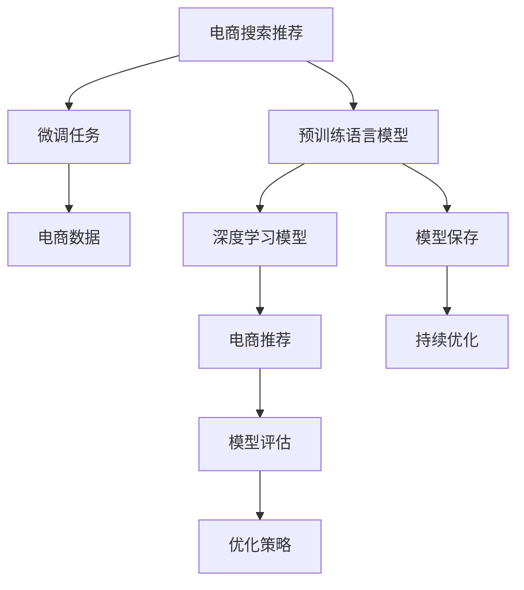

                 

# 电商搜索推荐场景下的AI大模型模型评估体系构建

> 关键词：电商搜索推荐, AI大模型, 模型评估体系, 应用场景, 性能指标, 实际测试, 评测方法

## 1. 背景介绍

在电子商务领域，个性化推荐系统已成为提升用户体验、增加用户粘性、提高转化率的关键技术。现代推荐系统融合了深度学习、知识图谱、自然语言处理等多种技术，为电商平台的商品推荐、搜索排序、广告投放等提供支撑。其中，基于大规模预训练语言模型（Large Language Models, LLMs）的推荐系统，以其高效、鲁棒、精准等优点，成为电商领域AI应用的新热点。

### 1.1 问题由来

近年来，电商平台的推荐系统经历了多次迭代升级。传统的协同过滤算法、基于内容的推荐方法，由于其高计算成本、低扩展性等缺点，逐渐被深度学习模型所替代。而基于深度学习的推荐系统，通过大量标注数据进行模型训练，虽然取得了良好的推荐效果，但存在训练数据量大、模型泛化能力不足等问题。

与此同时，预训练语言模型在NLP领域取得了突飞猛进的发展，如BERT、GPT-3等模型，通过在大规模语料上进行自监督预训练，获得了丰富的语言知识和语义表示。将这类预训练模型应用到电商推荐任务中，可以更好地理解和处理自然语言，提升推荐系统的精准度和鲁棒性。

### 1.2 问题核心关键点

在电商搜索推荐场景下，构建基于AI大模型的推荐系统，其核心关键点包括：
1. 选择合适的预训练语言模型：如BERT、GPT-3等，作为电商推荐的基础模型。
2. 设计合理的微调任务：将预训练模型与电商数据融合，微调模型以适应电商推荐需求。
3. 评估模型性能：使用严格的评估体系，评估模型在电商推荐场景下的表现。
4. 持续优化：根据实际应用中的反馈数据，不断优化模型结构和微调策略。

## 2. 核心概念与联系

### 2.1 核心概念概述

为了更清晰地理解基于AI大模型的电商推荐系统，这里介绍几个关键概念：

- **预训练语言模型**：指通过在大规模无标签语料上进行自监督学习任务（如掩码语言模型、下一句预测等）训练的模型，如BERT、GPT-3等。这类模型在预训练阶段学习了丰富的语言知识和语义表示。

- **微调（Fine-Tuning）**：指在预训练模型的基础上，使用特定的电商数据进行有监督学习，优化模型以适应电商推荐任务。微调可以显著提升模型在特定任务上的性能。

- **推荐系统（Recommendation System）**：指通过分析用户行为、商品属性、用户画像等数据，为用户推荐感兴趣的电商商品。推荐系统可以分为基于内容的推荐、协同过滤推荐和混合推荐等。

- **电商搜索推荐**：指在电商平台上，根据用户输入的查询词，为用户推荐最相关的商品，同时对搜索结果进行排序优化，提升用户体验和转化率。

- **模型评估体系**：指一套全面的评估方法，用于衡量基于AI大模型的电商推荐系统在实际应用中的表现。该体系应覆盖推荐效果、鲁棒性、可解释性、资源消耗等多个维度。

### 2.2 核心概念原理和架构的 Mermaid 流程图



这张图展示了电商推荐系统中，预训练语言模型与电商数据的融合路径。预训练模型通过微调任务与电商数据结合，生成电商推荐模型，并通过评估体系进行效果评估，进而通过优化策略进行迭代优化。

## 3. 核心算法原理 & 具体操作步骤

### 3.1 算法原理概述

在电商搜索推荐场景下，基于AI大模型的推荐系统，核心算法包括：

- **预训练模型**：选择如BERT、GPT-3等预训练语言模型，作为电商推荐的基础模型。
- **微调任务**：设计合理的微调任务，将预训练模型与电商数据融合，优化模型以适应电商推荐需求。
- **推荐模型**：基于微调后的模型，构建电商推荐模型，用于商品推荐、搜索排序等任务。
- **评估体系**：使用多维度、多层次的评估方法，评估推荐模型的效果和鲁棒性。

### 3.2 算法步骤详解

电商搜索推荐系统构建步骤主要包括以下几个环节：

**Step 1: 数据准备与预处理**
- 收集电商平台的交易数据、用户画像、商品属性等，作为电商推荐的基础数据。
- 对原始数据进行清洗、去重、归一化等预处理，确保数据质量。

**Step 2: 模型选择与微调**
- 选择适当的预训练语言模型，如BERT、GPT-3等。
- 将预训练模型作为初始化参数，设计合适的微调任务，进行有监督学习。
- 使用小规模标注数据进行微调，优化模型以适应电商推荐需求。

**Step 3: 推荐模型构建**
- 基于微调后的模型，设计推荐模型的结构。
- 在电商推荐任务上，使用微调后的模型进行商品推荐、搜索排序等任务。

**Step 4: 模型评估与优化**
- 使用多种评估方法，评估推荐模型的效果和鲁棒性。
- 根据评估结果，使用优化策略，不断迭代优化推荐模型。

### 3.3 算法优缺点

基于AI大模型的电商推荐系统，具有以下优点：
1. 精度高：利用预训练模型丰富的语言知识和语义表示，推荐系统能更好地理解和处理自然语言，提升推荐精准度。
2. 鲁棒性强：预训练模型的通用性和泛化能力，使得推荐系统对异常数据和噪音具有较强的鲁棒性。
3. 可扩展性好：预训练模型可以通过微调任务进行定制化调整，适应不同的电商业务需求。

同时，该方法也存在一定的局限性：
1. 数据需求大：电商推荐系统需要大量的电商数据进行微调，标注成本较高。
2. 模型复杂：预训练模型参数量巨大，计算资源消耗较大。
3. 结果可解释性不足：预训练模型通常被认为是"黑盒"系统，难以解释其推荐决策过程。

尽管如此，在电商推荐场景下，基于AI大模型的推荐系统仍以其高效、精准、鲁棒等优点，得到了广泛的应用。

### 3.4 算法应用领域

基于AI大模型的电商推荐系统，已经在电商搜索推荐、个性化推荐、广告投放等多个领域得到应用，具体包括：

- 电商搜索推荐：根据用户输入的查询词，推荐最相关的商品，同时对搜索结果进行排序优化。
- 个性化推荐：基于用户历史行为和偏好，推荐用户感兴趣的商品，提高转化率。
- 广告投放：基于用户画像和商品属性，精准投放广告，提升广告点击率和转化率。
- 商品评价：基于用户评价，生成商品推荐和排序结果，提升商品质量。

除了这些经典应用外，电商推荐系统还被创新性地应用到更多场景中，如库存管理、价格优化、客服自动回复等，为电商平台带来了全新的商业价值。

## 4. 数学模型和公式 & 详细讲解 & 举例说明

### 4.1 数学模型构建

在电商推荐场景下，基于AI大模型的推荐系统，核心数学模型包括以下几个部分：

- **预训练模型**：预训练模型的输入为电商数据 $x$，输出为表示用户意图和商品特征的向量 $h$。
- **微调任务**：微调任务的输入为电商数据 $x$，输出为微调后的模型参数 $w$。
- **推荐模型**：推荐模型的输入为电商数据 $x$，输出为推荐结果 $y$。

### 4.2 公式推导过程

以电商搜索推荐为例，推荐模型的数学模型如下：

$$
y = f(h(x), \theta)
$$

其中 $h(x)$ 为预训练模型的表示函数，$f$ 为推荐模型函数，$\theta$ 为推荐模型参数。假设推荐任务为分类任务，则推荐模型的损失函数为交叉熵损失：

$$
L = -\frac{1}{N}\sum_{i=1}^N \log \frac{\exp(y_i^Tw_i)}{\sum_j \exp(y_j^Tw_j)}
$$

其中 $y_i$ 为第 $i$ 个样本的真实标签，$w_i$ 为推荐模型的权重向量，$N$ 为样本数。

### 4.3 案例分析与讲解

以电商搜索推荐为例，具体流程如下：

1. 收集电商平台的交易数据、用户画像、商品属性等，作为电商推荐的基础数据。
2. 对原始数据进行清洗、去重、归一化等预处理，确保数据质量。
3. 选择适当的预训练语言模型，如BERT、GPT-3等。
4. 将预训练模型作为初始化参数，设计合适的微调任务，进行有监督学习。
5. 使用小规模标注数据进行微调，优化模型以适应电商推荐需求。
6. 基于微调后的模型，设计推荐模型的结构。
7. 在电商推荐任务上，使用微调后的模型进行商品推荐、搜索排序等任务。
8. 使用多种评估方法，评估推荐模型的效果和鲁棒性。
9. 根据评估结果，使用优化策略，不断迭代优化推荐模型。

## 5. 项目实践：代码实例和详细解释说明

### 5.1 开发环境搭建

在进行电商推荐系统构建前，我们需要准备好开发环境。以下是使用Python进行PyTorch开发的环境配置流程：

1. 安装Anaconda：从官网下载并安装Anaconda，用于创建独立的Python环境。

2. 创建并激活虚拟环境：
```bash
conda create -n pytorch-env python=3.8 
conda activate pytorch-env
```

3. 安装PyTorch：根据CUDA版本，从官网获取对应的安装命令。例如：
```bash
conda install pytorch torchvision torchaudio cudatoolkit=11.1 -c pytorch -c conda-forge
```

4. 安装Transformers库：
```bash
pip install transformers
```

5. 安装各类工具包：
```bash
pip install numpy pandas scikit-learn matplotlib tqdm jupyter notebook ipython
```

完成上述步骤后，即可在`pytorch-env`环境中开始电商推荐系统的构建。

### 5.2 源代码详细实现

下面我们以电商搜索推荐为例，给出使用Transformers库对BERT模型进行微调的PyTorch代码实现。

首先，定义电商数据处理函数：

```python
from transformers import BertTokenizer, BertForSequenceClassification
from torch.utils.data import Dataset
import torch

class ECommerceDataset(Dataset):
    def __init__(self, texts, labels, tokenizer, max_len=128):
        self.texts = texts
        self.labels = labels
        self.tokenizer = tokenizer
        self.max_len = max_len
        
    def __len__(self):
        return len(self.texts)
    
    def __getitem__(self, item):
        text = self.texts[item]
        label = self.labels[item]
        
        encoding = self.tokenizer(text, return_tensors='pt', max_length=self.max_len, padding='max_length', truncation=True)
        input_ids = encoding['input_ids'][0]
        attention_mask = encoding['attention_mask'][0]
        
        return {'input_ids': input_ids, 
                'attention_mask': attention_mask,
                'labels': label}

# 标签与id的映射
label2id = {'buy': 0, 'read': 1, 'look': 2, 'ignore': 3}

# 创建dataset
tokenizer = BertTokenizer.from_pretrained('bert-base-cased')

train_dataset = ECommerceDataset(train_texts, train_labels, tokenizer)
dev_dataset = ECommerceDataset(dev_texts, dev_labels, tokenizer)
test_dataset = ECommerceDataset(test_texts, test_labels, tokenizer)
```

然后，定义模型和优化器：

```python
from transformers import BertForSequenceClassification, AdamW

model = BertForSequenceClassification.from_pretrained('bert-base-cased', num_labels=len(label2id))

optimizer = AdamW(model.parameters(), lr=2e-5)
```

接着，定义训练和评估函数：

```python
from torch.utils.data import DataLoader
from tqdm import tqdm
from sklearn.metrics import classification_report

device = torch.device('cuda') if torch.cuda.is_available() else torch.device('cpu')
model.to(device)

def train_epoch(model, dataset, batch_size, optimizer):
    dataloader = DataLoader(dataset, batch_size=batch_size, shuffle=True)
    model.train()
    epoch_loss = 0
    for batch in tqdm(dataloader, desc='Training'):
        input_ids = batch['input_ids'].to(device)
        attention_mask = batch['attention_mask'].to(device)
        labels = batch['labels'].to(device)
        model.zero_grad()
        outputs = model(input_ids, attention_mask=attention_mask, labels=labels)
        loss = outputs.loss
        epoch_loss += loss.item()
        loss.backward()
        optimizer.step()
    return epoch_loss / len(dataloader)

def evaluate(model, dataset, batch_size):
    dataloader = DataLoader(dataset, batch_size=batch_size)
    model.eval()
    preds, labels = [], []
    with torch.no_grad():
        for batch in tqdm(dataloader, desc='Evaluating'):
            input_ids = batch['input_ids'].to(device)
            attention_mask = batch['attention_mask'].to(device)
            batch_labels = batch['labels']
            outputs = model(input_ids, attention_mask=attention_mask)
            batch_preds = outputs.logits.argmax(dim=1).to('cpu').tolist()
            batch_labels = batch_labels.to('cpu').tolist()
            for pred, label in zip(batch_preds, batch_labels):
                preds.append(pred)
                labels.append(label)
                
    print(classification_report(labels, preds))
```

最后，启动训练流程并在测试集上评估：

```python
epochs = 5
batch_size = 16

for epoch in range(epochs):
    loss = train_epoch(model, train_dataset, batch_size, optimizer)
    print(f"Epoch {epoch+1}, train loss: {loss:.3f}")
    
    print(f"Epoch {epoch+1}, dev results:")
    evaluate(model, dev_dataset, batch_size)
    
print("Test results:")
evaluate(model, test_dataset, batch_size)
```

以上就是使用PyTorch对BERT进行电商搜索推荐任务微调的完整代码实现。可以看到，得益于Transformers库的强大封装，我们可以用相对简洁的代码完成BERT模型的加载和微调。

### 5.3 代码解读与分析

让我们再详细解读一下关键代码的实现细节：

**ECommerceDataset类**：
- `__init__`方法：初始化电商数据、标签、分词器等关键组件。
- `__len__`方法：返回数据集的样本数量。
- `__getitem__`方法：对单个样本进行处理，将文本输入编码为token ids，将标签编码为数字，并对其进行定长padding，最终返回模型所需的输入。

**label2id字典**：
- 定义了标签与数字id之间的映射关系，用于将标签转换为模型可接受的输入形式。

**训练和评估函数**：
- 使用PyTorch的DataLoader对数据集进行批次化加载，供模型训练和推理使用。
- 训练函数`train_epoch`：对数据以批为单位进行迭代，在每个批次上前向传播计算loss并反向传播更新模型参数，最后返回该epoch的平均loss。
- 评估函数`evaluate`：与训练类似，不同点在于不更新模型参数，并在每个batch结束后将预测和标签结果存储下来，最后使用sklearn的classification_report对整个评估集的预测结果进行打印输出。

**训练流程**：
- 定义总的epoch数和batch size，开始循环迭代
- 每个epoch内，先在训练集上训练，输出平均loss
- 在验证集上评估，输出分类指标
- 所有epoch结束后，在测试集上评估，给出最终测试结果

可以看到，PyTorch配合Transformers库使得BERT微调的代码实现变得简洁高效。开发者可以将更多精力放在数据处理、模型改进等高层逻辑上，而不必过多关注底层的实现细节。

当然，工业级的系统实现还需考虑更多因素，如模型的保存和部署、超参数的自动搜索、更灵活的任务适配层等。但核心的微调范式基本与此类似。

## 6. 实际应用场景

### 6.1 智能客服系统

基于大语言模型微调的对话技术，可以广泛应用于智能客服系统的构建。传统客服往往需要配备大量人力，高峰期响应缓慢，且一致性和专业性难以保证。而使用微调后的对话模型，可以7x24小时不间断服务，快速响应客户咨询，用自然流畅的语言解答各类常见问题。

在技术实现上，可以收集企业内部的历史客服对话记录，将问题和最佳答复构建成监督数据，在此基础上对预训练对话模型进行微调。微调后的对话模型能够自动理解用户意图，匹配最合适的答案模板进行回复。对于客户提出的新问题，还可以接入检索系统实时搜索相关内容，动态组织生成回答。如此构建的智能客服系统，能大幅提升客户咨询体验和问题解决效率。

### 6.2 金融舆情监测

金融机构需要实时监测市场舆论动向，以便及时应对负面信息传播，规避金融风险。传统的人工监测方式成本高、效率低，难以应对网络时代海量信息爆发的挑战。基于大语言模型微调的文本分类和情感分析技术，为金融舆情监测提供了新的解决方案。

具体而言，可以收集金融领域相关的新闻、报道、评论等文本数据，并对其进行主题标注和情感标注。在此基础上对预训练语言模型进行微调，使其能够自动判断文本属于何种主题，情感倾向是正面、中性还是负面。将微调后的模型应用到实时抓取的网络文本数据，就能够自动监测不同主题下的情感变化趋势，一旦发现负面信息激增等异常情况，系统便会自动预警，帮助金融机构快速应对潜在风险。

### 6.3 个性化推荐系统

当前的推荐系统往往只依赖用户的历史行为数据进行物品推荐，无法深入理解用户的真实兴趣偏好。基于大语言模型微调技术，个性化推荐系统可以更好地挖掘用户行为背后的语义信息，从而提供更精准、多样的推荐内容。

在实践中，可以收集用户浏览、点击、评论、分享等行为数据，提取和用户交互的物品标题、描述、标签等文本内容。将文本内容作为模型输入，用户的后续行为（如是否点击、购买等）作为监督信号，在此基础上微调预训练语言模型。微调后的模型能够从文本内容中准确把握用户的兴趣点。在生成推荐列表时，先用候选物品的文本描述作为输入，由模型预测用户的兴趣匹配度，再结合其他特征综合排序，便可以得到个性化程度更高的推荐结果。

### 6.4 未来应用展望

随着大语言模型微调技术的不断发展，基于微调范式将在更多领域得到应用，为传统行业带来变革性影响。

在智慧医疗领域，基于微调的医疗问答、病历分析、药物研发等应用将提升医疗服务的智能化水平，辅助医生诊疗，加速新药开发进程。

在智能教育领域，微调技术可应用于作业批改、学情分析、知识推荐等方面，因材施教，促进教育公平，提高教学质量。

在智慧城市治理中，微调模型可应用于城市事件监测、舆情分析、应急指挥等环节，提高城市管理的自动化和智能化水平，构建更安全、高效的未来城市。

此外，在企业生产、社会治理、文娱传媒等众多领域，基于大模型微调的人工智能应用也将不断涌现，为NLP技术带来了全新的突破。随着预训练语言模型和微调方法的不断进步，相信NLP技术将在更广阔的应用领域大放异彩。

## 7. 工具和资源推荐

### 7.1 学习资源推荐

为了帮助开发者系统掌握大语言模型微调的理论基础和实践技巧，这里推荐一些优质的学习资源：

1. 《Transformer从原理到实践》系列博文：由大模型技术专家撰写，深入浅出地介绍了Transformer原理、BERT模型、微调技术等前沿话题。

2. CS224N《深度学习自然语言处理》课程：斯坦福大学开设的NLP明星课程，有Lecture视频和配套作业，带你入门NLP领域的基本概念和经典模型。

3. 《Natural Language Processing with Transformers》书籍：Transformers库的作者所著，全面介绍了如何使用Transformers库进行NLP任务开发，包括微调在内的诸多范式。

4. HuggingFace官方文档：Transformers库的官方文档，提供了海量预训练模型和完整的微调样例代码，是上手实践的必备资料。

5. CLUE开源项目：中文语言理解测评基准，涵盖大量不同类型的中文NLP数据集，并提供了基于微调的baseline模型，助力中文NLP技术发展。

通过对这些资源的学习实践，相信你一定能够快速掌握大语言模型微调的精髓，并用于解决实际的NLP问题。

### 7.2 开发工具推荐

高效的开发离不开优秀的工具支持。以下是几款用于大语言模型微调开发的常用工具：

1. PyTorch：基于Python的开源深度学习框架，灵活动态的计算图，适合快速迭代研究。大部分预训练语言模型都有PyTorch版本的实现。

2. TensorFlow：由Google主导开发的开源深度学习框架，生产部署方便，适合大规模工程应用。同样有丰富的预训练语言模型资源。

3. Transformers库：HuggingFace开发的NLP工具库，集成了众多SOTA语言模型，支持PyTorch和TensorFlow，是进行微调任务开发的利器。

4. Weights & Biases：模型训练的实验跟踪工具，可以记录和可视化模型训练过程中的各项指标，方便对比和调优。与主流深度学习框架无缝集成。

5. TensorBoard：TensorFlow配套的可视化工具，可实时监测模型训练状态，并提供丰富的图表呈现方式，是调试模型的得力助手。

6. Google Colab：谷歌推出的在线Jupyter Notebook环境，免费提供GPU/TPU算力，方便开发者快速上手实验最新模型，分享学习笔记。

合理利用这些工具，可以显著提升大语言模型微调任务的开发效率，加快创新迭代的步伐。

### 7.3 相关论文推荐

大语言模型和微调技术的发展源于学界的持续研究。以下是几篇奠基性的相关论文，推荐阅读：

1. Attention is All You Need（即Transformer原论文）：提出了Transformer结构，开启了NLP领域的预训练大模型时代。

2. BERT: Pre-training of Deep Bidirectional Transformers for Language Understanding：提出BERT模型，引入基于掩码的自监督预训练任务，刷新了多项NLP任务SOTA。

3. Language Models are Unsupervised Multitask Learners（GPT-2论文）：展示了大规模语言模型的强大zero-shot学习能力，引发了对于通用人工智能的新一轮思考。

4. Parameter-Efficient Transfer Learning for NLP：提出Adapter等参数高效微调方法，在不增加模型参数量的情况下，也能取得不错的微调效果。

5. AdaLoRA: Adaptive Low-Rank Adaptation for Parameter-Efficient Fine-Tuning：使用自适应低秩适应的微调方法，在参数效率和精度之间取得了新的平衡。

6. Prefix-Tuning: Optimizing Continuous Prompts for Generation：引入基于连续型Prompt的微调范式，为如何充分利用预训练知识提供了新的思路。

这些论文代表了大语言模型微调技术的发展脉络。通过学习这些前沿成果，可以帮助研究者把握学科前进方向，激发更多的创新灵感。

## 8. 总结：未来发展趋势与挑战

### 8.1 研究成果总结

本文对基于AI大模型的电商推荐系统进行了全面系统的介绍。首先阐述了电商推荐系统的发展历程和基于大模型的推荐系统背景，明确了微调在电商推荐系统中的重要性。其次，从原理到实践，详细讲解了电商推荐系统的核心算法，包括预训练模型、微调任务、推荐模型等。同时，通过具体代码实例，展示了如何使用Transformers库对BERT模型进行电商搜索推荐任务微调的流程。

### 8.2 未来发展趋势

展望未来，大语言模型微调技术将呈现以下几个发展趋势：

1. 模型规模持续增大。随着算力成本的下降和数据规模的扩张，预训练语言模型的参数量还将持续增长。超大规模语言模型蕴含的丰富语言知识，有望支撑更加复杂多变的电商推荐任务。

2. 微调方法日趋多样。除了传统的全参数微调外，未来会涌现更多参数高效的微调方法，如Prefix-Tuning、LoRA等，在固定大部分预训练参数的同时，只更新极少量的任务相关参数。同时，优化微调模型的计算图，减少前向传播和反向传播的资源消耗，实现更加轻量级、实时性的部署。

3. 持续学习成为常态。随着数据分布的不断变化，微调模型也需要持续学习新知识以保持性能。如何在不遗忘原有知识的同时，高效吸收新样本信息，将成为重要的研究课题。

4. 标注样本需求降低。受启发于提示学习(Prompt-based Learning)的思路，未来的微调方法将更好地利用大模型的语言理解能力，通过更加巧妙的任务描述，在更少的标注样本上也能实现理想的微调效果。

5. 推荐系统日趋个性化。基于微调技术的电商推荐系统，将更深入地挖掘用户兴趣和行为背后的语义信息，实现更加精准、个性化的推荐。

6. 推荐系统更加鲁棒。预训练模型的通用性和泛化能力，使得推荐系统对异常数据和噪音具有较强的鲁棒性。未来的推荐系统将通过更强的鲁棒性设计，应对多变的电商业务需求。

### 8.3 面临的挑战

尽管大语言模型微调技术已经取得了瞩目成就，但在迈向更加智能化、普适化应用的过程中，它仍面临着诸多挑战：

1. 标注成本瓶颈。虽然微调大大降低了标注数据的需求，但对于长尾应用场景，难以获得充足的高质量标注数据，成为制约微调性能的瓶颈。如何进一步降低微调对标注样本的依赖，将是一大难题。

2. 模型鲁棒性不足。当前微调模型面对域外数据时，泛化性能往往大打折扣。对于测试样本的微小扰动，微调模型的预测也容易发生波动。如何提高微调模型的鲁棒性，避免灾难性遗忘，还需要更多理论和实践的积累。

3. 推理效率有待提高。大规模语言模型虽然精度高，但在实际部署时往往面临推理速度慢、内存占用大等效率问题。如何在保证性能的同时，简化模型结构，提升推理速度，优化资源占用，将是重要的优化方向。

4. 结果可解释性不足。当前微调模型通常被认为是"黑盒"系统，难以解释其推荐决策过程。对于医疗、金融等高风险应用，算法的可解释性和可审计性尤为重要。如何赋予微调模型更强的可解释性，将是亟待攻克的难题。

5. 安全性有待保障。预训练语言模型难免会学习到有偏见、有害的信息，通过微调传递到下游任务，产生误导性、歧视性的输出，给实际应用带来安全隐患。如何从数据和算法层面消除模型偏见，避免恶意用途，确保输出的安全性，也将是重要的研究课题。

6. 知识整合能力不足。现有的微调模型往往局限于任务内数据，难以灵活吸收和运用更广泛的先验知识。如何让微调过程更好地与外部知识库、规则库等专家知识结合，形成更加全面、准确的信息整合能力，还有很大的想象空间。

正视微调面临的这些挑战，积极应对并寻求突破，将是大语言模型微调走向成熟的必由之路。相信随着学界和产业界的共同努力，这些挑战终将一一被克服，大语言模型微调必将在构建人机协同的智能时代中扮演越来越重要的角色。

### 8.4 研究展望

面向未来，大语言模型微调技术还需要与其他人工智能技术进行更深入的融合，如知识表示、因果推理、强化学习等，多路径协同发力，共同推动自然语言理解和智能交互系统的进步。只有勇于创新、敢于突破，才能不断拓展语言模型的边界，让智能技术更好地造福人类社会。

---

作者：禅与计算机程序设计艺术 / Zen and the Art of Computer Programming

