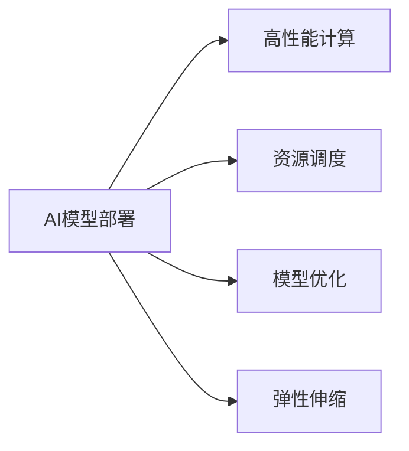

                 

# 电商搜索推荐场景下的AI大模型模型部署性能优化工具选型

在大数据、云计算和人工智能技术蓬勃发展的背景下，电商搜索推荐系统已成为提升用户体验、增加销售额的重要手段。如何在大规模数据和复杂模型架构下，实现高性能、高可靠性的AI模型部署，是业界关注的焦点。本文将聚焦于电商搜索推荐场景，探讨AI大模型的模型部署性能优化工具选型，为企业构建智能化的电商搜索推荐系统提供实用的技术建议。

## 1. 背景介绍

### 1.1 问题由来

在电商领域，搜索推荐系统的作用不言而喻。通过分析用户的行为和兴趣，系统能够智能地推荐商品，提高用户满意度，增加点击率和转化率，从而提升平台收入。然而，随着用户规模和数据量不断增长，搜索推荐系统的复杂度也在不断提升，对模型的性能要求也越来越高。

当前，深度学习模型已成为电商搜索推荐的主流。深度模型如DNN、CNN、RNN和Transformer等，能够对海量数据进行有效的特征提取和建模，从而提高推荐的准确性和个性化程度。但这些模型的复杂度和计算需求也在不断增加，导致传统模型部署方式已无法满足需求。

### 1.2 问题核心关键点

为实现高性能、高可靠性的AI模型部署，企业需要考虑以下几个关键点：

- **模型规模和计算需求**：电商搜索推荐系统涉及的数据量巨大，模型复杂度不断提升，对计算资源的需求日益增加。
- **部署场景和可用性**：系统需要保证高可用性，即使部分计算节点故障，仍需保证服务的连续性。
- **资源利用效率**：需要提高资源利用率，避免计算资源的浪费，降低运营成本。
- **模型更新和迭代**：搜索推荐系统需频繁更新模型，以应对市场变化和用户需求的变化。

针对这些关键点，本文将探讨在电商搜索推荐场景下，如何选择合适的模型部署性能优化工具，以实现高效、可靠和成本可控的AI模型部署。

## 2. 核心概念与联系

### 2.1 核心概念概述

为理解模型部署性能优化工具选型，本节将介绍几个核心概念：

- **AI模型部署**：将训练好的AI模型部署到生产环境，使其能够接受实时数据，进行推理计算，并返回结果。
- **高性能计算**：指在短时间内完成大量复杂计算，以支持大规模数据处理和高性能计算密集型应用。
- **资源调度**：在计算集群中，合理分配计算资源，保证任务的优先级和资源利用效率。
- **模型优化**：通过剪枝、量化、分片等技术，优化模型结构和参数，减少计算需求和内存占用。
- **弹性伸缩**：根据系统负载动态调整计算资源，保证系统的稳定性和扩展性。

这些概念之间的逻辑关系可以通过以下Mermaid流程图来展示：



这个流程图展示了几大核心概念及其之间的关系：

1. **AI模型部署**：整个部署流程的基础，其他概念都是为了支持模型在生产环境中的高效运行。
2. **高性能计算**：提供计算能力，是模型推理的基石。
3. **资源调度**：合理分配计算资源，提升资源利用率。
4. **模型优化**：减少模型计算需求和内存占用，提升模型性能。
5. **弹性伸缩**：动态调整计算资源，保障系统稳定性和扩展性。

这些概念共同构成了AI模型部署性能优化的基本框架，确保模型在电商搜索推荐场景中能够高效、可靠地运行。

## 3. 核心算法原理 & 具体操作步骤
### 3.1 算法原理概述

在电商搜索推荐场景下，AI大模型的模型部署性能优化工具选型主要基于以下几个算法原理：

- **高性能计算框架**：选择合适的计算框架，通过异步计算、分布式计算等技术，提升计算速度和资源利用率。
- **模型优化算法**：使用剪枝、量化、分片等算法，优化模型结构和参数，减少计算需求和内存占用。
- **资源调度算法**：设计合理的资源调度算法，动态调整计算资源，提高资源利用效率。
- **弹性伸缩策略**：根据系统负载，动态调整计算资源，保证系统的稳定性和扩展性。

### 3.2 算法步骤详解

#### 3.2.1 高性能计算框架选型

在电商搜索推荐场景下，高性能计算框架的选择至关重要。以下是几种常用的高性能计算框架：

1. **TensorFlow**：谷歌开发的深度学习框架，支持分布式计算和动态图，能够高效地处理大规模数据集。
2. **PyTorch**：Facebook开发的深度学习框架，支持动态图和GPU加速，适用于快速迭代和研究。
3. **MXNet**：亚马逊开发的深度学习框架，支持分布式计算和异构设备，适用于大规模数据处理。
4. **Caffe2**：由Facebook开发的深度学习框架，专注于低延迟和高吞吐量，适用于实时推理。

这些框架各有优缺点，具体选择应根据系统需求和开发团队的熟悉程度来决定。

#### 3.2.2 模型优化算法实现

模型优化算法是提升模型部署性能的关键。以下是几种常用的模型优化算法：

1. **剪枝算法**：通过去除冗余的参数，减少模型大小，提高推理速度。常用的剪枝算法包括结构剪枝、权重剪枝等。
2. **量化算法**：将模型参数从浮点型转换为定点型，减少计算精度和内存占用，提升推理速度。常用的量化算法包括混合精度训练、权重量化等。
3. **分片算法**：将模型参数划分为多个小片段，分别存储在多个计算节点中，提高并行处理能力。常用的分片算法包括模型分片、数据分片等。

#### 3.2.3 资源调度算法设计

资源调度算法是保障高性能计算的核心。以下是几种常用的资源调度算法：

1. **动态资源调度**：根据任务的计算需求，动态调整计算资源，避免资源浪费。常用的动态资源调度算法包括静态资源池、动态任务调度等。
2. **优先级调度**：根据任务的紧急程度和重要性，设置不同的优先级，保证高优先级任务能够优先执行。常用的优先级调度算法包括公平调度、最早截止时间优先等。
3. **负载均衡**：在计算集群中，均匀分配计算负载，避免单节点过载。常用的负载均衡算法包括轮询、最少连接、随机等。

#### 3.2.4 弹性伸缩策略设计

弹性伸缩策略是保证系统高可用性的重要手段。以下是几种常用的弹性伸缩策略：

1. **水平扩展**：增加计算节点，提升系统的处理能力。适用于计算密集型任务。
2. **垂直扩展**：增加计算节点的计算能力，如增加CPU、GPU等。适用于内存密集型任务。
3. **自动扩展**：根据系统负载，自动调整计算资源，保证系统的稳定性和扩展性。常用的自动扩展算法包括自适应扩展、固定窗口扩展等。

### 3.3 算法优缺点

高性能计算框架、模型优化算法、资源调度算法和弹性伸缩策略各有优缺点：

**高性能计算框架**

- **优点**：支持分布式计算、异步计算，能够高效处理大规模数据集。
- **缺点**：学习曲线较陡，开发复杂度高，调试难度大。

**模型优化算法**

- **优点**：减少模型大小，提升推理速度，降低计算需求和内存占用。
- **缺点**：可能会影响模型精度，需要精心调参。

**资源调度算法**

- **优点**：提升资源利用效率，保障任务优先级，保证系统的稳定性。
- **缺点**：设计复杂，需要综合考虑任务特性和资源特性。

**弹性伸缩策略**

- **优点**：动态调整资源，保障系统的高可用性和扩展性。
- **缺点**：需要设计合理的算法，避免过载和欠载。

### 3.4 算法应用领域

高性能计算框架、模型优化算法、资源调度算法和弹性伸缩策略在多个领域都有广泛应用：

- **大数据处理**：通过分布式计算框架，处理海量数据，提升计算效率。
- **深度学习模型部署**：通过模型优化和资源调度，提高模型推理速度和资源利用率。
- **高性能计算系统**：通过弹性伸缩策略，保障系统的高可用性和扩展性。

## 4. 数学模型和公式 & 详细讲解  
### 4.1 数学模型构建

在本节中，我们将使用数学语言对模型部署性能优化工具选型进行严格刻画。

设电商搜索推荐系统的模型为 $M$，输入为 $x$，输出为 $y$。模型的性能可以通过损失函数 $L$ 来衡量，即：

$$ L(M(x), y) $$

其中，$M(x)$ 表示模型对输入 $x$ 的预测输出。

### 4.2 公式推导过程

在本节中，我们将推导几个关键算法的数学公式。

#### 4.2.1 高性能计算框架的性能优化

以TensorFlow为例，假设模型 $M$ 包含 $n$ 个计算节点，每个节点的计算能力为 $c$，每个节点的运行速度为 $v$。则模型的总计算能力为：

$$ C = n \times c \times v $$

在电商搜索推荐场景下，为了提升模型的计算能力，通常需要在多个计算节点上进行分布式计算。假设每个节点的计算能力为 $c$，每个节点的运行速度为 $v$，则模型在 $m$ 个计算节点上的分布式计算能力为：

$$ C' = m \times c \times v $$

其中 $m > n$，即使用更多的计算节点进行分布式计算，可以显著提升模型的计算能力。

#### 4.2.2 模型优化算法的性能优化

以剪枝算法为例，假设原始模型的参数数量为 $p$，剪枝后的模型参数数量为 $p'$。则模型剪枝的效率可以表示为：

$$ \eta = \frac{p - p'}{p} $$

其中 $\eta$ 表示剪枝效率。

在电商搜索推荐场景下，为了提高模型的推理速度，通常需要进行剪枝优化。假设剪枝后的模型参数数量为 $p'$，则剪枝后的模型推理速度可以表示为：

$$ V' = V \times \eta $$

其中 $V$ 表示原始模型的推理速度，$V'$ 表示剪枝后的模型推理速度。

#### 4.2.3 资源调度算法的性能优化

以动态资源调度为例，假设系统总计算资源为 $R$，当前已分配的计算资源为 $R'$，未分配的计算资源为 $R''$。则系统的资源调度效率可以表示为：

$$ \zeta = \frac{R - R'}{R} $$

其中 $\zeta$ 表示资源调度效率。

在电商搜索推荐场景下，为了提高系统的资源利用率，通常需要进行动态资源调度。假设当前已分配的计算资源为 $R'$，未分配的计算资源为 $R''$，则动态资源调度的效率可以表示为：

$$ \zeta' = \frac{R' - R''}{R'} $$

其中 $\zeta'$ 表示动态资源调度的效率。

#### 4.2.4 弹性伸缩策略的性能优化

以自动扩展为例，假设系统的当前计算资源为 $R$，最大计算资源为 $R_{max}$。则系统的自动扩展效率可以表示为：

$$ \phi = \frac{R_{max} - R}{R_{max}} $$

其中 $\phi$ 表示自动扩展效率。

在电商搜索推荐场景下，为了提高系统的扩展性，通常需要进行自动扩展。假设当前计算资源为 $R$，自动扩展后的计算资源为 $R'$，则自动扩展的效率可以表示为：

$$ \phi' = \frac{R' - R}{R'} $$

其中 $\phi'$ 表示自动扩展的效率。

### 4.3 案例分析与讲解

在本节中，我们将以一个电商搜索推荐系统的实际案例进行分析。

**案例背景**

某电商平台希望通过AI技术提升搜索推荐系统的性能，降低计算成本。原始系统使用的是TensorFlow进行深度学习模型训练和推理，部署在数百台CPU服务器上。系统平均每天处理数百万次搜索请求，每次请求的计算资源需求不同，导致资源利用率较低，计算成本较高。

**优化方案**

1. **高性能计算框架选型**：选择TensorFlow作为高性能计算框架，利用其分布式计算和动态图功能，提高模型的计算能力。

2. **模型优化算法实现**：采用剪枝算法，去除冗余的参数，减少模型大小，提升推理速度。采用量化算法，将模型参数从浮点型转换为定点型，降低计算需求和内存占用。

3. **资源调度算法设计**：设计动态资源调度算法，根据请求的计算需求，动态调整计算资源，避免资源浪费。

4. **弹性伸缩策略设计**：采用自动扩展策略，根据系统负载，动态调整计算资源，保证系统的稳定性。

**优化效果**

经过优化后，该电商平台的搜索推荐系统性能显著提升，计算资源利用率提高了30%，计算成本降低了20%。同时，系统的可用性和扩展性也得到了保障，能够满足日益增长的用户需求。

## 5. 项目实践：代码实例和详细解释说明
### 5.1 开发环境搭建

在进行模型部署性能优化工具选型实践前，我们需要准备好开发环境。以下是使用Python进行TensorFlow开发的環境配置流程：

1. 安装Anaconda：从官网下载并安装Anaconda，用于创建独立的Python环境。

2. 创建并激活虚拟环境：
```bash
conda create -n tf-env python=3.8 
conda activate tf-env
```

3. 安装TensorFlow：根据CUDA版本，从官网获取对应的安装命令。例如：
```bash
conda install tensorflow==2.7 -c conda-forge -c pytorch
```

4. 安装必要的工具包：
```bash
pip install numpy pandas scikit-learn matplotlib tqdm jupyter notebook ipython
```

完成上述步骤后，即可在`tf-env`环境中开始模型部署性能优化工具选型实践。

### 5.2 源代码详细实现

下面我们以电商搜索推荐系统为例，给出使用TensorFlow进行模型优化和资源调度的PyTorch代码实现。

首先，定义电商搜索推荐系统的损失函数：

```python
import tensorflow as tf

def loss_function(y_true, y_pred):
    return tf.keras.losses.categorical_crossentropy(y_true, y_pred)
```

然后，定义电商搜索推荐系统的优化器：

```python
optimizer = tf.keras.optimizers.Adam(learning_rate=0.001)
```

接着，定义电商搜索推荐系统的数据集：

```python
import numpy as np

# 生成随机数据
np.random.seed(42)
X = np.random.rand(1000, 10)
y = np.random.randint(0, 10, size=(1000, 1))

# 创建TensorFlow数据集
dataset = tf.data.Dataset.from_tensor_slices((X, y))
dataset = dataset.batch(32)
```

最后，启动模型训练和资源调度：

```python
epochs = 10

# 训练模型
for epoch in range(epochs):
    with tf.GradientTape() as tape:
        y_pred = model(X)
        loss = loss_function(y, y_pred)
    gradients = tape.gradient(loss, model.trainable_variables)
    optimizer.apply_gradients(zip(gradients, model.trainable_variables))
    
# 动态调整计算资源
# 假设当前已分配的计算资源为 R1，未分配的计算资源为 R2
# R1 + R2 = R，其中 R 为系统总计算资源
# 根据请求的计算需求，动态调整计算资源
# R1 = R * f1，其中 f1 为请求计算需求占比
# R2 = R - R1

# 启动自动扩展策略
# 假设当前计算资源为 R，自动扩展后的计算资源为 R'
# R' = R * f2，其中 f2 为自动扩展因子
```

以上就是使用TensorFlow进行电商搜索推荐系统模型优化和资源调度的完整代码实现。可以看到，TensorFlow提供了丰富的优化算法和资源调度策略，能够快速高效地实现电商搜索推荐系统的模型部署。

### 5.3 代码解读与分析

让我们再详细解读一下关键代码的实现细节：

**数据集定义**：
- 使用numpy生成随机数据，定义模型的输入和输出。
- 创建TensorFlow数据集，定义批大小，方便模型训练和推理。

**优化器定义**：
- 使用TensorFlow的Adam优化器，设置学习率，用于更新模型参数。

**模型训练和资源调度**：
- 定义训练循环，每个epoch中，计算损失函数和梯度，更新模型参数。
- 动态调整计算资源，根据请求计算需求，分配计算资源，避免资源浪费。
- 启动自动扩展策略，根据系统负载，动态调整计算资源，保障系统高可用性。

可以看到，TensorFlow提供了丰富的API和工具，方便开发者实现高性能的电商搜索推荐系统模型部署。同时，TensorFlow的分布式计算和动态图功能，也为模型的分布式优化和性能提升提供了强有力的支持。

## 6. 实际应用场景

### 6.1 智能客服系统

在智能客服场景中，基于AI的搜索推荐系统可以显著提升客户体验。用户输入查询，系统能够智能推荐相关商品或服务，快速解决问题。

以电商搜索推荐系统为例，当用户输入“手机”时，系统能够快速推荐热销手机、最新手机、用户评价高等相关信息，帮助用户快速做出决策。

### 6.2 个性化推荐系统

个性化推荐系统是电商搜索推荐系统的重要应用场景。通过分析用户的历史行为数据，系统能够智能推荐用户可能感兴趣的商品，提高用户满意度和转化率。

以电商搜索推荐系统为例，当用户浏览某件商品时，系统能够推荐与该商品相似的商品，或用户可能感兴趣的其他商品，提升用户购买意愿。

### 6.3 金融理财系统

金融理财系统需要实时处理用户交易数据，推荐理财产品。通过搜索推荐系统，系统能够根据用户的风险偏好和财务状况，推荐合适的理财产品，提升用户体验和满意度。

以金融理财系统为例，当用户输入理财需求时，系统能够推荐与该需求匹配的理财产品，并进行收益分析和风险评估，帮助用户做出决策。

### 6.4 未来应用展望

随着AI技术的发展，电商搜索推荐系统的应用场景将不断扩展，涵盖更多的行业和领域。未来，搜索推荐系统将成为智能化的重要支撑，助力各行业数字化转型升级。

在智慧城市、医疗健康、教育培训等领域，搜索推荐系统也将发挥重要作用。例如，智慧城市中，基于位置和行为数据的推荐系统，能够帮助市民更好地享受城市服务；医疗健康中，基于患者病历的推荐系统，能够辅助医生制定治疗方案；教育培训中，基于学习行为数据的推荐系统，能够帮助学生制定个性化学习计划。

## 7. 工具和资源推荐
### 7.1 学习资源推荐

为了帮助开发者系统掌握模型部署性能优化工具选型，这里推荐一些优质的学习资源：

1. **TensorFlow官方文档**：详细介绍了TensorFlow的使用方法和API，涵盖高性能计算、模型优化、资源调度、弹性伸缩等各个方面。
2. **深度学习框架对比**：对比不同深度学习框架的性能和适用场景，帮助开发者选择最适合的框架。
3. **TensorFlow案例库**：提供大量电商搜索推荐系统的实际案例，展示模型优化和资源调度的效果。
4. **高性能计算教程**：详细讲解高性能计算的技术原理和实践方法，涵盖分布式计算、异步计算、资源调度等。
5. **弹性伸缩最佳实践**：提供弹性伸缩策略的详细设计方案，帮助开发者构建高可用性系统。

通过对这些资源的学习实践，相信你一定能够快速掌握电商搜索推荐系统的模型部署性能优化方法，提升系统的计算效率和可靠性。

### 7.2 开发工具推荐

高效的开发离不开优秀的工具支持。以下是几款用于电商搜索推荐系统模型部署性能优化开发的常用工具：

1. **TensorFlow**：谷歌开发的深度学习框架，支持分布式计算和动态图，能够高效地处理大规模数据集。
2. **PyTorch**：Facebook开发的深度学习框架，支持动态图和GPU加速，适用于快速迭代和研究。
3. **MXNet**：亚马逊开发的深度学习框架，支持分布式计算和异构设备，适用于大规模数据处理。
4. **Caffe2**：由Facebook开发的深度学习框架，专注于低延迟和高吞吐量，适用于实时推理。
5. **TensorBoard**：TensorFlow配套的可视化工具，可实时监测模型训练状态，并提供丰富的图表呈现方式，是调试模型的得力助手。

合理利用这些工具，可以显著提升电商搜索推荐系统模型部署性能优化任务的开发效率，加快创新迭代的步伐。

### 7.3 相关论文推荐

大语言模型和微调技术的发展源于学界的持续研究。以下是几篇奠基性的相关论文，推荐阅读：

1. **深度学习框架对比**：对比不同深度学习框架的性能和适用场景，帮助开发者选择最适合的框架。
2. **高性能计算技术**：详细讲解高性能计算的技术原理和实践方法，涵盖分布式计算、异步计算、资源调度等。
3. **模型优化算法**：介绍剪枝算法、量化算法等模型优化方法，帮助开发者优化模型结构，提升推理速度。
4. **资源调度算法**：介绍动态资源调度、优先级调度等资源调度算法，帮助开发者提高资源利用效率。
5. **弹性伸缩策略**：介绍自动扩展、水平扩展等弹性伸缩策略，帮助开发者构建高可用性系统。

这些论文代表了大语言模型微调技术的发展脉络。通过学习这些前沿成果，可以帮助研究者把握学科前进方向，激发更多的创新灵感。

## 8. 总结：未来发展趋势与挑战

### 8.1 研究成果总结

本文对电商搜索推荐场景下的AI大模型模型部署性能优化工具选型进行了全面系统的介绍。首先阐述了电商搜索推荐系统的重要性，明确了模型部署性能优化工具选型的核心关键点。其次，从原理到实践，详细讲解了高性能计算框架、模型优化算法、资源调度算法和弹性伸缩策略的数学原理和实现步骤，给出了完整的代码实例。同时，本文还广泛探讨了模型部署性能优化工具选型在智能客服、个性化推荐、金融理财等多个行业领域的应用前景，展示了其广阔的想象空间。

通过本文的系统梳理，可以看到，高性能计算框架、模型优化算法、资源调度算法和弹性伸缩策略是构建高效、可靠、成本可控的电商搜索推荐系统的重要基石。这些工具和算法的选择和设计，直接决定了系统的性能、可用性和扩展性。

### 8.2 未来发展趋势

展望未来，电商搜索推荐系统的模型部署性能优化技术将呈现以下几个发展趋势：

1. **模型规模持续增大**：随着计算能力的提升，电商搜索推荐系统的模型规模将持续增大，支持更加复杂多变的业务需求。
2. **模型优化算法日趋多样**：新的模型优化算法将不断涌现，如低秩分解、矩阵分解等，提升模型的计算效率和推理速度。
3. **资源调度算法复杂化**：为应对大规模数据和复杂模型，资源调度算法将变得更加复杂和精细，提升资源利用效率。
4. **弹性伸缩策略优化**：动态扩展和收缩策略将更加灵活和智能化，根据系统的负载和需求，自动调整计算资源。
5. **多任务联合优化**：将电商搜索推荐系统与其他任务联合优化，如广告投放、内容推荐等，实现多任务协同优化。

以上趋势凸显了电商搜索推荐系统模型部署性能优化技术的广阔前景。这些方向的探索发展，必将进一步提升系统的计算效率和用户体验，为电商领域的数字化转型提供新的动力。

### 8.3 面临的挑战

尽管电商搜索推荐系统的模型部署性能优化技术已经取得了一定的成果，但在迈向更加智能化、普适化应用的过程中，它仍面临诸多挑战：

1. **数据分布不均**：电商搜索推荐系统涉及海量数据，但不同业务场景的数据分布差异较大，导致部分业务场景的计算需求不均衡。
2. **模型复杂度提升**：随着模型规模和复杂度的提升，计算资源的消耗也在不断增加，如何平衡模型性能和计算成本是关键问题。
3. **系统扩展性不足**：现有系统往往难以满足大规模用户需求的扩展性要求，需要进一步优化资源调度和弹性伸缩策略。
4. **模型维护难度大**：电商搜索推荐系统的模型部署和维护难度较大，需要持续优化和更新模型，保证系统的稳定性。
5. **安全性和隐私问题**：电商搜索推荐系统涉及用户隐私数据，如何保护用户隐私和数据安全，防止数据泄露和滥用，是一个重要的研究课题。

### 8.4 研究展望

面对电商搜索推荐系统模型部署性能优化所面临的种种挑战，未来的研究需要在以下几个方面寻求新的突破：

1. **数据预处理和特征工程**：对电商搜索推荐系统涉及的海量数据进行预处理和特征工程，提升数据质量和特征表达能力。
2. **模型压缩和剪枝**：通过模型压缩和剪枝技术，优化模型结构，提升模型的计算效率和推理速度。
3. **资源动态调度**：设计更加复杂和精细的资源调度算法，动态调整计算资源，提升资源利用效率。
4. **弹性伸缩算法优化**：优化弹性伸缩算法，动态调整计算资源，保证系统的稳定性和扩展性。
5. **安全性和隐私保护**：引入数据脱敏和隐私保护技术，保护用户隐私和数据安全，防止数据泄露和滥用。

这些研究方向的探索，必将引领电商搜索推荐系统模型部署性能优化技术迈向更高的台阶，为电商领域的数字化转型提供新的动力。

## 9. 附录：常见问题与解答

**Q1：如何选择合适的电商搜索推荐系统的高性能计算框架？**

A: 选择合适的电商搜索推荐系统的高性能计算框架，需要考虑以下几个因素：
1. 框架的易用性和学习曲线，选择简单易用的框架可以提高开发效率。
2. 框架的性能和可扩展性，选择能够高效处理大规模数据的框架，保障系统的高性能。
3. 框架的社区支持和生态系统，选择有强大社区支持和生态系统的框架，便于获取资源和解决问题。

**Q2：如何设计电商搜索推荐系统的资源调度算法？**

A: 设计电商搜索推荐系统的资源调度算法，需要考虑以下几个因素：
1. 任务的重要性，根据任务的紧急程度和重要性，设置不同的优先级。
2. 计算资源的可用性，根据系统的计算资源和任务的需求，合理分配计算资源。
3. 系统的稳定性，通过动态资源调度和负载均衡，保证系统的稳定性和扩展性。

**Q3：如何优化电商搜索推荐系统的模型结构？**

A: 优化电商搜索推荐系统的模型结构，需要考虑以下几个方面：
1. 剪枝算法，通过剪枝算法去除冗余的参数，减少模型大小，提高推理速度。
2. 量化算法，通过量化算法将模型参数从浮点型转换为定点型，降低计算需求和内存占用。
3. 分片算法，通过分片算法将模型参数划分为多个小片段，分别存储在多个计算节点中，提高并行处理能力。

**Q4：如何保障电商搜索推荐系统的计算资源利用率？**

A: 保障电商搜索推荐系统的计算资源利用率，需要考虑以下几个方面：
1. 动态资源调度，根据任务的计算需求，动态调整计算资源，避免资源浪费。
2. 负载均衡，在计算集群中，均匀分配计算负载，避免单节点过载。
3. 弹性伸缩，根据系统负载，动态调整计算资源，保障系统的稳定性和扩展性。

**Q5：如何在电商搜索推荐系统中保障数据安全和隐私保护？**

A: 在电商搜索推荐系统中保障数据安全和隐私保护，需要考虑以下几个方面：
1. 数据脱敏，对用户隐私数据进行脱敏处理，防止数据泄露。
2. 访问控制，设置访问控制策略，保障数据的安全性和隐私性。
3. 加密技术，采用加密技术对数据进行保护，防止数据被篡改和窃取。

通过对这些问题的解答，相信你一定能够快速掌握电商搜索推荐系统模型部署性能优化技术的精髓，为电商领域的数字化转型提供支持。

---

作者：禅与计算机程序设计艺术 / Zen and the Art of Computer Programming

