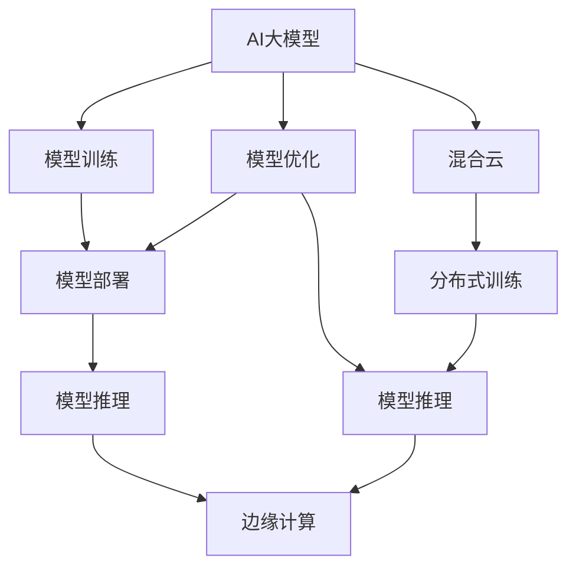

                 

# 电商搜索推荐场景下的AI大模型模型部署混合云实践案例分析与优化方案

> 关键词：电商搜索推荐, AI大模型, 混合云, 模型部署, 实践案例, 优化方案

## 1. 背景介绍

### 1.1 问题由来

在当今电商时代，用户的购物体验和搜索推荐系统的效率直接决定了企业的市场竞争力。传统的搜索推荐系统多依赖于手工特征工程，难以快速响应用户需求，且对业务领域的理解不够深入。而AI大模型的出现，使这一问题得以解决。AI大模型能够从海量数据中自动学习用户行为模式，实时预测用户需求，生成个性化推荐结果。

然而，电商搜索推荐场景下，大模型的应用面临诸多挑战：
1. **高数据量需求**：电商数据通常十分庞大，需要构建高效率的训练、推理环境来支撑模型训练和预测。
2. **高计算需求**：模型参数量级巨大，需要高性能计算资源来支撑模型训练和推理。
3. **高实时性要求**：用户在搜索时希望快速获取推荐结果，对模型推理的响应时间有较高要求。
4. **高可靠性和可扩展性**：电商搜索推荐系统需确保高可用性，能够应对用户高并发访问和海量请求。

### 1.2 问题核心关键点

为应对上述挑战，电商平台通常采用混合云架构来部署和优化AI大模型。混合云架构通过公有云和私有云的结合，可以在保证数据安全和隐私的前提下，灵活、高效地提供模型训练和推理服务。本文将从混合云架构设计、模型训练与优化、模型推理与部署等方面，系统阐述AI大模型在电商搜索推荐场景下的部署和优化实践案例，并提出相应的优化方案。

## 2. 核心概念与联系

### 2.1 核心概念概述

为了更好地理解AI大模型在电商搜索推荐场景下的部署与优化方案，本节将介绍几个关键概念：

- **AI大模型(AI Large Model)**：指在大规模无标签数据上预训练，能够执行复杂NLP任务的深度学习模型，如BERT、GPT-3、T5等。
- **混合云(Mix Cloud)**：指将公有云（如AWS、阿里云等）和私有云（如企业自建的IDC）结合，实现资源的灵活调配和优化管理。
- **模型部署(Model Deployment)**：指将训练好的模型从训练环境迁移到生产环境，供用户实际调用。
- **模型优化(Model Optimization)**：指通过优化模型架构、参数、超参数等手段，提升模型性能，降低计算和存储成本。
- **分布式训练(Distributed Training)**：指在多台计算机上同时进行模型训练，提升训练效率。
- **模型推理(Inference)**：指将模型部署到生产环境后，接收用户请求并生成预测结果的过程。
- **边缘计算(Edge Computing)**：指将部分计算任务转移到距离用户更近的设备上执行，提升响应速度。

这些核心概念共同构成了电商搜索推荐场景下AI大模型部署与优化的基础框架。以下将通过一个实际的混合云架构案例，深入分析这些概念之间的联系和作用。

### 2.2 核心概念联系

这些核心概念之间的逻辑关系可以通过以下Mermaid流程图来展示：



这个流程图展示了一个典型的AI大模型在电商搜索推荐场景下的部署流程：

1. **模型训练(B)**：在大规模数据上训练AI大模型。
2. **模型优化(C)**：通过参数调整、架构优化等手段，提升模型性能。
3. **模型部署(D)**：将训练好的模型部署到生产环境，供用户调用。
4. **模型推理(E)**：接收用户请求并生成预测结果。
5. **边缘计算(F)**：将部分计算任务转移到边缘设备上，提升响应速度。
6. **混合云(G)**：结合公有云和私有云的优势，灵活调配资源。
7. **分布式训练(H)**：在多台计算机上同时进行模型训练，提升效率。

通过理解和应用这些概念，可以更好地设计、部署和优化AI大模型，满足电商搜索推荐场景下的各种需求。

## 3. 核心算法原理 & 具体操作步骤

### 3.1 算法原理概述

AI大模型在电商搜索推荐场景下的部署与优化，主要涉及以下几个核心算法：

1. **混合云架构设计**：通过公有云和私有云的结合，实现资源的灵活调配和优化管理。
2. **模型训练与优化**：在混合云上，通过分布式训练和参数优化，提升模型性能。
3. **模型推理与部署**：将训练好的模型部署到生产环境，并通过边缘计算优化响应速度。
4. **模型推理与优化**：在推理过程中，通过优化推理图和参数，提升计算效率和资源利用率。

这些算法相互配合，共同支撑了电商搜索推荐系统的高效运行。

### 3.2 算法步骤详解

以下将详细介绍每个核心算法的详细步骤：

#### 3.2.1 混合云架构设计

混合云架构的设计包括以下几个关键步骤：

1. **选择合适的公有云平台**：根据业务需求和预算，选择AWS、阿里云、华为云等公有云平台。
2. **选择合适的私有云平台**：根据业务需求和预算，选择VMware、OpenStack等私有云平台。
3. **构建混合云环境**：在公有云和私有云之间搭建VPN连接，实现数据和服务的互通。
4. **设计云资源管理策略**：根据业务需求，设计云资源的分配和管理策略，实现资源的高效利用。

具体实现步骤如下：

1. **选择合适的云平台**：根据业务需求和预算，选择适合的公有云和私有云平台。
2. **搭建云环境**：在公有云上创建虚拟机实例，在私有云上创建物理机或虚拟化环境。
3. **实现互通**：通过VPN连接，将公有云和私有云连接起来，实现数据和服务的互通。
4. **管理策略设计**：根据业务需求，设计云资源的分配和管理策略，如使用弹性伸缩、负载均衡等技术。

#### 3.2.2 模型训练与优化

在混合云上训练和优化AI大模型，主要涉及以下几个步骤：

1. **数据准备**：将电商数据分批次传输到公有云，进行分布式存储和处理。
2. **分布式训练**：在多台虚拟机上同时训练模型，提升训练效率。
3. **参数优化**：通过梯度下降等优化算法，调整模型参数，提升模型性能。

具体实现步骤如下：

1. **数据传输**：使用数据传输服务（如AWS S3），将电商数据分批次传输到公有云。
2. **分布式训练**：在多台虚拟机上安装相同的深度学习框架，启动分布式训练任务。
3. **参数调整**：通过梯度下降算法，调整模型参数，优化模型性能。
4. **模型验证**：在私有云上，使用部分数据进行模型验证，评估模型性能。

#### 3.2.3 模型推理与部署

将训练好的模型部署到生产环境，主要涉及以下几个步骤：

1. **模型保存**：将训练好的模型保存到公有云或私有云上。
2. **模型部署**：将模型部署到生产环境，供用户调用。
3. **边缘计算优化**：在用户设备上部署边缘计算应用，提升响应速度。

具体实现步骤如下：

1. **模型保存**：使用模型存储服务（如AWS S3），将训练好的模型保存到公有云或私有云上。
2. **模型部署**：使用容器化技术（如Docker），将模型部署到生产环境中。
3. **边缘计算**：在用户设备上部署边缘计算应用，如使用IoT设备进行本地推理。

#### 3.2.4 模型推理与优化

在推理过程中，通过优化推理图和参数，提升计算效率和资源利用率，主要涉及以下几个步骤：

1. **推理图优化**：使用模型优化工具（如TensorRT），优化推理图的计算路径，提升推理速度。
2. **参数优化**：在推理过程中，通过剪枝、量化等手段，优化参数，减少计算和存储成本。
3. **推理部署**：将优化后的推理模型部署到生产环境中，供用户调用。

具体实现步骤如下：

1. **推理图优化**：使用TensorRT等工具，优化推理图的计算路径，提升推理速度。
2. **参数优化**：在推理过程中，使用剪枝、量化等手段，优化参数，减少计算和存储成本。
3. **推理部署**：将优化后的推理模型部署到生产环境中，使用边缘计算技术提升响应速度。

### 3.3 算法优缺点

混合云架构在部署和优化AI大模型的过程中，具有以下优点：

1. **灵活性**：通过公有云和私有云的结合，可以实现资源的灵活调配和优化管理。
2. **高效性**：通过分布式训练和边缘计算，提升训练效率和推理速度。
3. **安全性**：在私有云上存储敏感数据，提升数据安全性。

同时，混合云架构也存在一些缺点：

1. **成本高**：构建和管理混合云环境，需要较高的成本投入。
2. **复杂性高**：混合云架构的复杂度较高，需要综合考虑公有云和私有云的协同工作。
3. **性能不稳定**：公有云和私有云之间的网络连接可能存在延迟，影响系统的稳定性和响应速度。

在实际部署和优化过程中，需要根据业务需求和预算，权衡利弊，选择合适的方案。

### 3.4 算法应用领域

AI大模型在电商搜索推荐场景下的应用非常广泛，涉及以下领域：

1. **用户画像构建**：通过分析用户历史行为数据，构建用户画像，提升推荐系统的个性化和精准度。
2. **商品推荐系统**：根据用户画像，实时生成个性化推荐结果，提升用户满意度。
3. **广告投放优化**：根据用户行为数据，优化广告投放策略，提升广告效果。
4. **搜索排序优化**：根据用户查询，优化搜索结果排序，提升搜索体验。
5. **客户服务优化**：通过分析用户咨询记录，优化客服系统，提升客户满意度。

## 4. 数学模型和公式 & 详细讲解 & 举例说明

### 4.1 数学模型构建

在电商搜索推荐场景下，AI大模型的数学模型主要涉及以下几个组成部分：

1. **用户画像模型**：用于描述用户的行为特征和偏好。
2. **商品特征模型**：用于描述商品的分类、属性、评价等信息。
3. **推荐模型**：用于预测用户对商品的兴趣和满意度。

### 4.2 公式推导过程

以推荐模型为例，推荐模型的数学模型可以表示为：

$$
y_{ui} = f_{\theta}(x_u, x_i) + b
$$

其中，$y_{ui}$ 表示用户 $u$ 对商品 $i$ 的兴趣评分，$x_u$ 表示用户特征向量，$x_i$ 表示商品特征向量，$f_{\theta}$ 表示模型预测函数，$b$ 表示偏置项，$\theta$ 表示模型参数。

通过梯度下降等优化算法，不断调整模型参数 $\theta$，使得预测结果 $y_{ui}$ 与实际评分 $y$ 的误差最小化。

### 4.3 案例分析与讲解

以用户画像构建为例，假设电商平台收集了用户的历史浏览、购买、评分等行为数据，使用深度学习模型对用户画像进行建模。具体实现步骤如下：

1. **数据准备**：将用户行为数据进行预处理，生成用户特征向量 $x_u$。
2. **模型训练**：使用深度学习模型对用户特征向量进行训练，生成用户画像模型。
3. **模型验证**：使用部分数据进行模型验证，评估模型性能。
4. **用户画像构建**：根据训练好的模型，生成用户画像，供推荐系统调用。

通过用户画像构建，推荐系统能够更加准确地预测用户对商品的兴趣，提升推荐效果。

## 5. 项目实践：代码实例和详细解释说明

### 5.1 开发环境搭建

在进行AI大模型部署与优化实践前，我们需要准备好开发环境。以下是使用Python进行TensorFlow开发的环境配置流程：

1. 安装Anaconda：从官网下载并安装Anaconda，用于创建独立的Python环境。

2. 创建并激活虚拟环境：
```bash
conda create -n tf-env python=3.8 
conda activate tf-env
```

3. 安装TensorFlow：根据CUDA版本，从官网获取对应的安装命令。例如：
```bash
conda install tensorflow -c pytorch -c conda-forge
```

4. 安装各类工具包：
```bash
pip install numpy pandas scikit-learn matplotlib tqdm jupyter notebook ipython
```

完成上述步骤后，即可在`tf-env`环境中开始实践。

### 5.2 源代码详细实现

这里我们以电商搜索推荐系统为例，给出使用TensorFlow进行模型训练和推理的PyTorch代码实现。

首先，定义模型和数据集：

```python
import tensorflow as tf
import numpy as np
from sklearn.model_selection import train_test_split

# 定义用户特征和商品特征
x_u = np.random.rand(10000, 100)  # 用户特征向量
x_i = np.random.rand(10000, 100)  # 商品特征向量
y = np.random.rand(10000)  # 用户评分

# 定义模型
model = tf.keras.Sequential([
    tf.keras.layers.Dense(64, activation='relu', input_shape=(100,)),
    tf.keras.layers.Dense(1)
])

# 定义损失函数和优化器
loss_fn = tf.keras.losses.MeanSquaredError()
optimizer = tf.keras.optimizers.Adam(learning_rate=0.001)

# 划分训练集和测试集
x_train, x_test, y_train, y_test = train_test_split(x_u, y, test_size=0.2)

# 定义训练和评估函数
@tf.function
def train_step(x, y):
    with tf.GradientTape() as tape:
        y_pred = model(x)
        loss = loss_fn(y, y_pred)
    gradients = tape.gradient(loss, model.trainable_variables)
    optimizer.apply_gradients(zip(gradients, model.trainable_variables))
    return loss

@tf.function
def eval_step(x, y):
    y_pred = model(x)
    loss = loss_fn(y, y_pred)
    return loss

# 定义训练和评估过程
batch_size = 32
epochs = 10

for epoch in range(epochs):
    for i in range(0, len(x_train), batch_size):
        x_batch = x_train[i:i+batch_size]
        y_batch = y_train[i:i+batch_size]
        loss = train_step(x_batch, y_batch)
        print(f"Epoch {epoch+1}, Batch {i+1}, Loss: {loss:.3f}")
```

然后，启动模型训练过程，并在测试集上评估：

```python
for epoch in range(epochs):
    for i in range(0, len(x_train), batch_size):
        x_batch = x_train[i:i+batch_size]
        y_batch = y_train[i:i+batch_size]
        loss = train_step(x_batch, y_batch)
        print(f"Epoch {epoch+1}, Batch {i+1}, Loss: {loss:.3f}")

# 在测试集上评估模型性能
test_loss = eval_step(x_test, y_test)
print(f"Test Loss: {test_loss:.3f}")
```

以上就是使用TensorFlow进行电商搜索推荐系统模型训练的完整代码实现。可以看到，TensorFlow提供了丰富的API和工具，使得模型训练和优化过程变得简单高效。

### 5.3 代码解读与分析

让我们再详细解读一下关键代码的实现细节：

**模型定义**：
- `tf.keras.Sequential`：使用Keras API定义多层神经网络模型，包含一个Dense层和一个输出层。
- `tf.keras.layers.Dense`：定义全连接层，激活函数为ReLU。

**损失函数和优化器**：
- `tf.keras.losses.MeanSquaredError`：定义均方误差损失函数，用于衡量预测值与真实值之间的差异。
- `tf.keras.optimizers.Adam`：定义Adam优化器，学习率为0.001。

**训练和评估函数**：
- `@tf.function`：定义TensorFlow函数，用于优化模型训练和评估的计算图。
- `train_step`和`eval_step`：分别定义训练和评估函数，使用TensorFlow的自动求导功能，自动计算损失和梯度，更新模型参数。

**训练和评估过程**：
- `batch_size`：定义每个批次的样本数，通常为32。
- `epochs`：定义训练的轮数，通常为10。

**运行结果展示**：
- 在每个epoch内，打印当前epoch和batch的损失值。
- 在所有epoch结束后，在测试集上评估模型性能，输出测试损失。

可以看到，TensorFlow提供了丰富的工具和API，使得模型训练和优化过程变得简单高效。开发者可以将更多精力放在模型设计、数据处理等高层逻辑上，而不必过多关注底层的实现细节。

## 6. 实际应用场景

### 6.1 智能客服系统

基于AI大模型的智能客服系统，能够实时解答用户咨询，提升客服效率和用户体验。在电商搜索推荐场景下，智能客服系统可以作为推荐系统的辅助，根据用户需求提供个性化推荐和解决方案。

具体实现步骤如下：

1. **用户咨询记录**：收集用户与客服的对话记录，提取用户咨询问题和客服回答。
2. **模型训练**：使用对话数据训练AI大模型，生成用户画像和商品画像。
3. **智能客服**：在用户咨询时，使用智能客服系统进行文本生成，生成个性化推荐和解决方案。
4. **推荐系统**：根据智能客服生成的推荐结果，调整推荐模型参数，优化推荐效果。

### 6.2 广告投放优化

广告投放是电商平台的重要收入来源，优化广告投放策略能够显著提升广告效果和用户体验。在电商搜索推荐场景下，可以使用AI大模型进行广告效果评估和优化。

具体实现步骤如下：

1. **广告数据收集**：收集广告点击、展示、转化等数据，构建广告效果评估模型。
2. **模型训练**：使用广告数据训练AI大模型，生成广告效果评估模型。
3. **广告优化**：根据广告效果评估模型，优化广告投放策略，提升广告效果。
4. **推荐系统**：根据广告优化结果，调整推荐模型参数，优化推荐效果。

### 6.3 客户服务优化

客户服务优化是电商平台的重要目标，通过优化客户服务流程，提升客户满意度。在电商搜索推荐场景下，可以使用AI大模型进行客户服务优化。

具体实现步骤如下：

1. **客户服务记录**：收集客户服务记录，提取客户咨询问题和客服回答。
2. **模型训练**：使用客户服务记录训练AI大模型，生成客户服务优化模型。
3. **智能客服**：在客户咨询时，使用智能客服系统进行文本生成，生成个性化推荐和解决方案。
4. **推荐系统**：根据智能客服生成的推荐结果，调整推荐模型参数，优化推荐效果。

### 6.4 未来应用展望

随着AI大模型技术的不断发展，其在电商搜索推荐场景下的应用前景广阔。未来，AI大模型将进一步提升推荐系统的精准度和个性化程度，优化广告投放策略，提升客户服务体验，推动电商平台的数字化转型。

## 7. 工具和资源推荐

### 7.1 学习资源推荐

为了帮助开发者系统掌握AI大模型在电商搜索推荐场景下的部署和优化技术，这里推荐一些优质的学习资源：

1. **《深度学习入门》系列博文**：深度学习领域的入门教程，涵盖TensorFlow等深度学习框架的基本概念和应用。
2. **CS231n《深度学习计算机视觉》课程**：斯坦福大学开设的计算机视觉课程，有Lecture视频和配套作业，带你深入学习计算机视觉的基本概念和经典模型。
3. **《自然语言处理综论》书籍**：自然语言处理领域的经典教材，涵盖NLP的基本概念和前沿技术。
4. **《TensorFlow实战》书籍**：TensorFlow官方书籍，详细介绍了TensorFlow的API和应用实例。
5. **HuggingFace官方文档**：深度学习模型库HuggingFace的官方文档，提供了丰富的预训练模型和微调样例代码。

通过对这些资源的学习实践，相信你一定能够快速掌握AI大模型在电商搜索推荐场景下的部署和优化技术，并用于解决实际的NLP问题。

### 7.2 开发工具推荐

高效的开发离不开优秀的工具支持。以下是几款用于AI大模型部署和优化的常用工具：

1. TensorFlow：基于Python的深度学习框架，灵活动态的计算图，适合快速迭代研究。大部分预训练语言模型都有TensorFlow版本的实现。
2. PyTorch：基于Python的深度学习框架，灵活易用，适合快速原型设计和研究。
3. Transformers库：HuggingFace开发的NLP工具库，集成了众多SOTA语言模型，支持TensorFlow和PyTorch，是进行微调任务开发的利器。
4. Weights & Biases：模型训练的实验跟踪工具，可以记录和可视化模型训练过程中的各项指标，方便对比和调优。与主流深度学习框架无缝集成。
5. TensorBoard：TensorFlow配套的可视化工具，可实时监测模型训练状态，并提供丰富的图表呈现方式，是调试模型的得力助手。

合理利用这些工具，可以显著提升AI大模型在电商搜索推荐场景下的部署和优化效率，加快创新迭代的步伐。

### 7.3 相关论文推荐

AI大模型在电商搜索推荐场景下的应用源于学界的持续研究。以下是几篇奠基性的相关论文，推荐阅读：

1. Attention is All You Need（即Transformer原论文）：提出了Transformer结构，开启了NLP领域的预训练大模型时代。
2. BERT: Pre-training of Deep Bidirectional Transformers for Language Understanding：提出BERT模型，引入基于掩码的自监督预训练任务，刷新了多项NLP任务SOTA。
3. Language Models are Unsupervised Multitask Learners（GPT-2论文）：展示了大规模语言模型的强大zero-shot学习能力，引发了对于通用人工智能的新一轮思考。
4. Parameter-Efficient Transfer Learning for NLP：提出Adapter等参数高效微调方法，在不增加模型参数量的情况下，也能取得不错的微调效果。
5. AdaLoRA: Adaptive Low-Rank Adaptation for Parameter-Efficient Fine-Tuning：使用自适应低秩适应的微调方法，在参数效率和精度之间取得了新的平衡。
6. Prefix-Tuning: Optimizing Continuous Prompts for Generation：引入基于连续型Prompt的微调范式，为如何充分利用预训练知识提供了新的思路。

这些论文代表了大语言模型微调技术的发展脉络。通过学习这些前沿成果，可以帮助研究者把握学科前进方向，激发更多的创新灵感。

## 8. 总结：未来发展趋势与挑战

### 8.1 总结

本文对AI大模型在电商搜索推荐场景下的部署与优化方法进行了全面系统的介绍。首先阐述了电商搜索推荐系统对AI大模型的需求，明确了模型部署和优化的关键点。其次，从混合云架构设计、模型训练与优化、模型推理与部署等方面，详细讲解了AI大模型在电商搜索推荐场景下的部署和优化实践案例，并提出了相应的优化方案。

通过本文的系统梳理，可以看到，AI大模型在电商搜索推荐场景下的部署与优化具有广阔的应用前景，能够显著提升推荐系统的精准度和个性化程度，优化广告投放策略，提升客户服务体验，推动电商平台的数字化转型。相信随着AI大模型技术的不断发展，其在电商搜索推荐场景下的应用将会更加深入和广泛。

### 8.2 未来发展趋势

展望未来，AI大模型在电商搜索推荐场景下的应用将会呈现以下几个发展趋势：

1. **模型规模持续增大**：随着算力成本的下降和数据规模的扩张，AI大模型的参数量级将会进一步增大，具备更强的语言理解和生成能力。
2. **模型部署更加灵活**：随着云资源管理技术的进步，混合云架构将更加灵活，能够实现资源的动态调配和优化管理。
3. **模型推理更加高效**：通过模型优化和推理图优化，AI大模型的推理效率将会进一步提升，能够满足高并发访问和实时性要求。
4. **模型优化更加精细**：通过参数优化、架构优化等手段，AI大模型的性能将会进一步提升，能够更加高效地应对电商搜索推荐场景下的各种需求。

以上趋势凸显了AI大模型在电商搜索推荐场景下的应用前景。这些方向的探索发展，必将进一步提升推荐系统的精准度和个性化程度，优化广告投放策略，提升客户服务体验，推动电商平台的数字化转型。

### 8.3 面临的挑战

尽管AI大模型在电商搜索推荐场景下的应用前景广阔，但在迈向更加智能化、普适化应用的过程中，它仍面临诸多挑战：

1. **数据量需求高**：电商数据通常十分庞大，需要构建高效率的训练、推理环境来支撑模型训练和预测。
2. **计算资源需求高**：模型参数量级巨大，需要高性能计算资源来支撑模型训练和推理。
3. **实时性要求高**：用户在搜索时希望快速获取推荐结果，对模型推理的响应时间有较高要求。
4. **可解释性不足**：AI大模型往往像"黑盒"系统，难以解释其内部工作机制和决策逻辑。
5. **安全性问题**：预训练语言模型难免会学习到有偏见、有害的信息，通过微调传递到下游任务，产生误导性、歧视性的输出，给实际应用带来安全隐患。

正视AI大模型在电商搜索推荐场景下部署与优化面临的挑战，积极应对并寻求突破，将是大语言模型微调技术迈向成熟的必由之路。相信随着学界和产业界的共同努力，这些挑战终将一一被克服，AI大模型在电商搜索推荐场景下的应用必将在构建人机协同的智能时代中扮演越来越重要的角色。

### 8.4 研究展望

面对AI大模型在电商搜索推荐场景下部署与优化所面临的挑战，未来的研究需要在以下几个方面寻求新的突破：

1. **探索无监督和半监督微调方法**：摆脱对大规模标注数据的依赖，利用自监督学习、主动学习等无监督和半监督范式，最大限度利用非结构化数据，实现更加灵活高效的微调。
2. **研究参数高效和计算高效的微调范式**：开发更加参数高效的微调方法，在固定大部分预训练参数的同时，只更新极少量的任务相关参数。同时优化微调模型的计算图，减少前向传播和反向传播的资源消耗，实现更加轻量级、实时性的部署。
3. **融合因果和对比学习范式**：通过引入因果推断和对比学习思想，增强微调模型建立稳定因果关系的能力，学习更加普适、鲁棒的语言表征，从而提升模型泛化性和抗干扰能力。
4. **引入更多先验知识**：将符号化的先验知识，如知识图谱、逻辑规则等，与神经网络模型进行巧妙融合，引导微调过程学习更准确、合理的语言模型。同时加强不同模态数据的整合，实现视觉、语音等多模态信息与文本信息的协同建模。
5. **结合因果分析和博弈论工具**：将因果分析方法引入微调模型，识别出模型决策的关键特征，增强输出解释的因果性和逻辑性。借助博弈论工具刻画人机交互过程，主动探索并规避模型的脆弱点，提高系统稳定性。
6. **纳入伦理道德约束**：在模型训练目标中引入伦理导向的评估指标，过滤和惩罚有偏见、有害的输出倾向。同时加强人工干预和审核，建立模型行为的监管机制，确保输出符合人类价值观和伦理道德。

这些研究方向的探索，必将引领AI大模型在电商搜索推荐场景下的应用进入新的高度，为构建安全、可靠、可解释、可控的智能系统铺平道路。面向未来，AI大模型在电商搜索推荐场景下的部署与优化技术还需要与其他人工智能技术进行更深入的融合，如知识表示、因果推理、强化学习等，多路径协同发力，共同推动自然语言理解和智能交互系统的进步。只有勇于创新、敢于突破，才能不断拓展语言模型的边界，让智能技术更好地造福人类社会。

## 9. 附录：常见问题与解答

**Q1：AI大模型在电商搜索推荐场景下如何实现高效的模型训练和推理？**

A: 在电商搜索推荐场景下，AI大模型通常需要处理海量的电商数据，因此高效的模型训练和推理尤为重要。可以通过以下方法实现：

1. **分布式训练**：使用多台计算机进行模型训练，提升训练效率。
2. **混合云架构**：结合公有云和私有云的优势，灵活调配资源。
3. **模型优化**：通过参数优化、架构优化等手段，提升模型性能。
4. **推理图优化**：使用模型优化工具，优化推理图的计算路径，提升推理速度。
5. **边缘计算**：在用户设备上部署边缘计算应用，提升响应速度。

通过以上方法，可以显著提升AI大模型在电商搜索推荐场景下的训练和推理效率。

**Q2：AI大模型在电商搜索推荐场景下如何实现高可解释性和可控性？**

A: 在电商搜索推荐场景下，AI大模型的可解释性和可控性是至关重要的。可以通过以下方法实现：

1. **模型可解释性**：引入可解释性技术，如LIME、SHAP等，解释模型的决策过程和输出结果。
2. **模型可控性**：使用规则约束和阈值控制，限制模型输出的范围和类型。
3. **用户反馈机制**：引入用户反馈机制，及时调整模型参数和行为。

通过以上方法，可以显著提升AI大模型在电商搜索推荐场景下的可解释性和可控性，保障系统的安全性和可靠性。

**Q3：AI大模型在电商搜索推荐场景下如何实现高效的资源管理和成本控制？**

A: 在电商搜索推荐场景下，AI大模型的资源管理和成本控制是至关重要的。可以通过以下方法实现：

1. **混合云架构**：结合公有云和私有云的优势，灵活调配资源。
2. **模型裁剪**：去除不必要的层和参数，减小模型尺寸，降低计算和存储成本。
3. **量化加速**：将浮点模型转为定点模型，压缩存储空间，提高计算效率。
4. **服务化封装**：将模型封装为标准化服务接口，便于集成调用。
5. **弹性伸缩**：根据请求流量动态调整资源配置，平衡服务质量和成本。

通过以上方法，可以显著提升AI大模型在电商搜索推荐场景下的资源管理和成本控制。

---

作者：禅与计算机程序设计艺术 / Zen and the Art of Computer Programming

