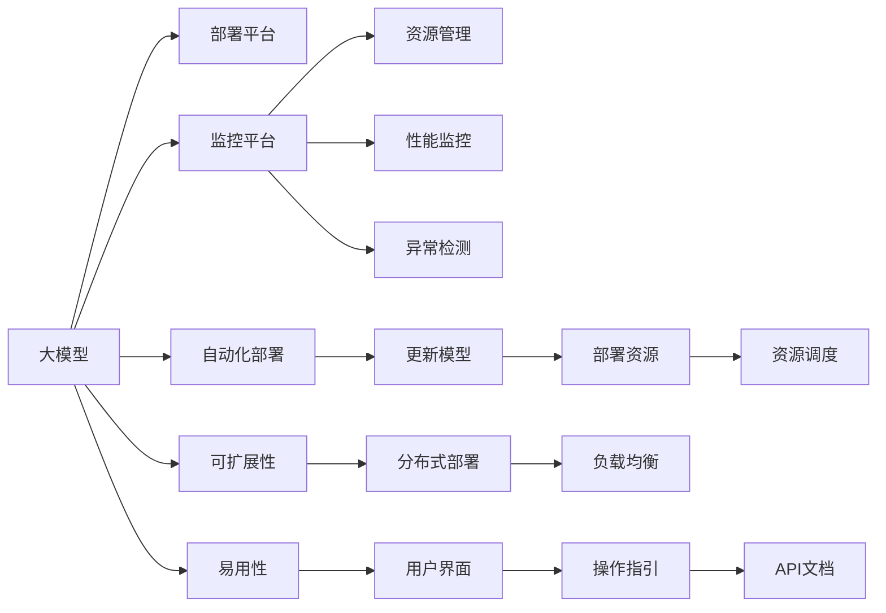

                 

# 电商搜索推荐场景下的AI大模型模型部署监控平台搭建方案

> 关键词：大模型部署, 监控平台, 电商搜索推荐, 实时监控, 资源管理, 性能优化

## 1. 背景介绍

### 1.1 问题由来

随着人工智能技术的快速发展，电商搜索推荐系统对AI大模型的依赖越来越深。大模型在商品推荐、搜索排序、个性化营销等场景中发挥着重要的作用，极大地提升了用户体验和商家收益。然而，随着模型规模的不断扩大和算力的提升，模型的部署、监控和优化成为了新的挑战。

当前电商搜索推荐系统的部署和监控平台还存在以下问题：
1. **模型更新频繁**：电商行业变化快，商品库和用户行为数据更新频繁，需要频繁对大模型进行重新训练和部署。
2. **资源管理困难**：不同模型的计算需求差异大，资源管理复杂，难以根据实际情况动态调整资源分配。
3. **实时监控不足**：缺乏实时的模型性能监控和异常检测机制，无法及时发现和解决模型运行中的问题。
4. **系统扩展性差**：模型部署和监控系统过于单一，难以应对大规模的模型和服务需求。

因此，构建一个高效、稳定、易扩展的AI大模型部署监控平台成为了电商搜索推荐系统的迫切需求。

### 1.2 问题核心关键点

大模型部署监控平台的核心在于以下几个方面：
- **自动化模型部署**：实现大模型的快速部署和更新，减少人力成本和部署时间。
- **资源优化管理**：动态调整资源分配，最大化利用计算资源。
- **实时监控与故障排除**：提供实时的性能监控和异常检测机制，保证系统稳定运行。
- **可扩展性与易用性**：平台设计需支持大规模模型和服务的高效管理和维护。

本文将详细阐述如何搭建一个符合电商搜索推荐场景需求的AI大模型部署监控平台。

## 2. 核心概念与联系

### 2.1 核心概念概述

在搭建大模型部署监控平台时，我们需要理解以下几个关键概念：

- **大模型**：指通过大规模数据预训练得到的深度学习模型，如BERT、GPT-3等，拥有强大的表示和推理能力。
- **部署平台**：用于模型训练和推理的软硬件环境，包括GPU、TPU等。
- **监控平台**：用于监控模型运行状态、性能和异常情况的自动化系统。
- **自动化**：指平台能够自动完成模型部署、更新和资源调整等操作，减少人为干预。
- **资源管理**：指平台能够根据模型需求动态调整计算资源，提高资源利用率。
- **可扩展性**：指平台能够支持大规模模型和服务的部署和管理。
- **易用性**：指平台能够简化操作流程，降低使用难度。

这些概念相互关联，共同构成了大模型部署监控平台的核心功能。

### 2.2 核心概念原理和架构的 Mermaid 流程图



这个流程图展示了各个概念之间的逻辑关系：

1. **大模型**：是平台的核心资源，用于电商搜索推荐等任务。
2. **部署平台**：用于模型的训练和推理，提供计算资源支持。
3. **监控平台**：监控模型的运行状态、性能和异常，确保模型稳定运行。
4. **资源管理**：动态调整计算资源，提高资源利用率。
5. **性能监控**：实时监测模型性能，如推理时间、内存使用等。
6. **异常检测**：检测模型运行中的异常，及时报警和处理。
7. **自动化部署**：自动完成模型的部署和更新。
8. **可扩展性**：支持大规模模型和服务的部署和管理。
9. **易用性**：简化操作流程，降低使用难度。

## 3. 核心算法原理 & 具体操作步骤

### 3.1 算法原理概述

大模型部署监控平台的算法原理主要基于以下几个方面：

- **自动化部署算法**：通过流水线管理，自动完成模型的训练、验证、推理和部署等步骤，减少人为操作。
- **资源管理算法**：根据模型需求动态调整资源分配，提高资源利用率。
- **性能监控算法**：实时监测模型性能，如推理时间、内存使用、GPU占用量等，保证模型运行稳定。
- **异常检测算法**：通过阈值设定和模式识别，检测模型运行中的异常，及时报警和处理。

### 3.2 算法步骤详解

#### 3.2.1 自动化部署算法

1. **模型版本管理**：
   - 定义模型版本，包括训练数据、超参数、模型架构等。
   - 对每个版本进行命名、版本控制和注释。
   
2. **流水线管理**：
   - 定义模型部署流程，包括训练、验证、推理和部署等步骤。
   - 使用容器化技术（如Docker）封装模型，确保一致性。
   - 配置流水线执行器，自动执行每个步骤。

3. **部署调度策略**：
   - 根据模型资源需求和可用资源，动态调整模型部署。
   - 使用Kubernetes等容器编排工具，实现资源的自动扩展和收缩。

#### 3.2.2 资源管理算法

1. **资源需求评估**：
   - 通过模型训练和推理任务，评估模型所需的计算资源（CPU、GPU、内存等）。
   - 根据任务类型，定义不同模型的资源需求范围。
   
2. **资源调度算法**：
   - 使用优先级调度算法，优先分配高优先级的任务。
   - 根据任务执行情况，动态调整资源分配。
   - 使用GPU资源管理工具，如NVIDIA Container Toolkit，优化GPU使用效率。

#### 3.2.3 性能监控算法

1. **性能指标定义**：
   - 定义模型的性能指标，如推理时间、内存使用、GPU占用量等。
   - 使用监控工具（如Prometheus、Grafana）实时监测性能指标。
   
2. **监控数据采集**：
   - 集成监控工具，采集模型性能数据。
   - 使用API接口，将数据传输到监控平台。

#### 3.2.4 异常检测算法

1. **异常检测模型**：
   - 构建异常检测模型，如基于统计学和机器学习的方法。
   - 通过阈值设定和模式识别，检测模型运行中的异常。
   
2. **异常处理流程**：
   - 检测到异常后，立即触发报警机制。
   - 分析异常原因，自动重启或切换到备用模型。
   - 记录异常日志，方便后续分析和处理。

### 3.3 算法优缺点

#### 3.3.1 自动化部署算法的优缺点

**优点**：
- 减少人工操作，提高部署效率。
- 自动化流水线管理，确保模型一致性。
- 动态资源调整，提高资源利用率。

**缺点**：
- 初期配置复杂，需要定义模型版本和部署流程。
- 依赖容器化技术，可能增加额外的成本和复杂度。

#### 3.3.2 资源管理算法的优缺点

**优点**：
- 动态调整资源，最大化利用计算资源。
- 优先级调度策略，保证关键任务资源充足。
- GPU资源管理工具优化，提高GPU使用效率。

**缺点**：
- 配置复杂，需要评估模型资源需求。
- 优先级策略可能导致资源不均衡分配。

#### 3.3.3 性能监控算法的优缺点

**优点**：
- 实时监测模型性能，保证模型运行稳定。
- 监控工具广泛，易于集成和使用。
- 性能数据可视化，方便分析和优化。

**缺点**：
- 监控工具配置复杂，需要专业技能。
- 大量数据传输可能导致网络延迟。

#### 3.3.4 异常检测算法的优缺点

**优点**：
- 及时发现和处理异常，保证系统稳定运行。
- 异常检测模型，自动化识别异常情况。
- 自动报警和处理，减少人为干预。

**缺点**：
- 需要定义异常阈值，可能存在误报警的情况。
- 异常处理策略简单，可能无法处理复杂异常。

### 3.4 算法应用领域

大模型部署监控平台在以下几个领域有广泛的应用：

- **电商搜索推荐系统**：用于商品推荐、搜索排序、个性化营销等场景。
- **金融风险管理系统**：用于预测和检测金融市场的风险。
- **医疗诊断系统**：用于辅助诊断和预测疾病的发生。
- **智能客服系统**：用于处理用户咨询和投诉。
- **智能家居系统**：用于控制和优化智能设备的使用。

## 4. 数学模型和公式 & 详细讲解 & 举例说明

### 4.1 数学模型构建

大模型部署监控平台的数学模型主要包括以下几个部分：

- **模型版本管理**：定义模型版本，包括训练数据、超参数、模型架构等。
- **流水线管理**：定义模型部署流程，包括训练、验证、推理和部署等步骤。
- **资源管理**：定义资源需求，包括CPU、GPU、内存等。
- **性能监控**：定义性能指标，如推理时间、内存使用、GPU占用量等。
- **异常检测**：定义异常阈值，用于检测模型运行中的异常。

### 4.2 公式推导过程

#### 4.2.1 模型版本管理

模型版本管理可以通过版本控制工具（如Git）来实现。模型版本包含以下信息：
- 训练数据集路径和大小。
- 模型超参数配置。
- 模型架构信息。

版本控制公式如下：

$$
Version(i) = (Training\_Data(i), Hyper\_Parameters(i), Model\_Architecture(i))
$$

其中，$Version(i)$表示第$i$个模型的版本，$Training\_Data(i)$表示第$i$个模型的训练数据集路径和大小，$Hyper\_Parameters(i)$表示第$i$个模型的超参数配置，$Model\_Architecture(i)$表示第$i$个模型的架构信息。

#### 4.2.2 流水线管理

流水线管理通过流水线执行器（如Airflow）来实现。流水线包含以下步骤：
- 训练模型。
- 验证模型。
- 推理模型。
- 部署模型。

流水线执行公式如下：

$$
Pipeline(i) = \{Train(i), Validate(i), Infer(i), Deploy(i)\}
$$

其中，$Pipeline(i)$表示第$i$个模型的流水线，$Train(i)$表示第$i$个模型的训练步骤，$Validate(i)$表示第$i$个模型的验证步骤，$Infer(i)$表示第$i$个模型的推理步骤，$Deploy(i)$表示第$i$个模型的部署步骤。

#### 4.2.3 资源管理

资源管理通过资源调度器（如Kubernetes）来实现。资源调度公式如下：

$$
Resources(i) = \{CPU(i), GPU(i), Memory(i)\}
$$

其中，$Resources(i)$表示第$i$个模型所需的资源，$CPU(i)$表示第$i$个模型所需的CPU资源，$GPU(i)$表示第$i$个模型所需的GPU资源，$Memory(i)$表示第$i$个模型所需的内存资源。

#### 4.2.4 性能监控

性能监控通过监控工具（如Prometheus）来实现。性能监控公式如下：

$$
Performance(i) = \{Inference\_Time(i), Memory\_Use(i), GPU\_Use(i)\}
$$

其中，$Performance(i)$表示第$i$个模型的性能指标，$Inference\_Time(i)$表示第$i$个模型的推理时间，$Memory\_Use(i)$表示第$i$个模型的内存使用量，$GPU\_Use(i)$表示第$i$个模型的GPU使用量。

#### 4.2.5 异常检测

异常检测通过异常检测模型（如基于统计学和机器学习的方法）来实现。异常检测公式如下：

$$
Anomaly(i) = \{Threshold(i), Pattern(i)\}
$$

其中，$Anomaly(i)$表示第$i$个模型的异常情况，$Threshold(i)$表示第$i$个模型的异常阈值，$Pattern(i)$表示第$i$个模型的异常模式。

### 4.3 案例分析与讲解

#### 4.3.1 电商搜索推荐系统

电商搜索推荐系统需要使用大模型进行商品推荐和搜索排序。

1. **模型版本管理**：定义模型版本，包含训练数据集、超参数和模型架构。
2. **流水线管理**：定义流水线，包括训练、验证、推理和部署等步骤。
3. **资源管理**：根据模型需求动态调整CPU、GPU和内存资源。
4. **性能监控**：实时监测模型推理时间和内存使用情况。
5. **异常检测**：检测模型推理过程中的异常，及时报警和处理。

#### 4.3.2 金融风险管理系统

金融风险管理系统需要使用大模型进行风险预测和检测。

1. **模型版本管理**：定义模型版本，包含训练数据集、超参数和模型架构。
2. **流水线管理**：定义流水线，包括训练、验证、推理和部署等步骤。
3. **资源管理**：根据模型需求动态调整CPU和GPU资源。
4. **性能监控**：实时监测模型推理时间和内存使用情况。
5. **异常检测**：检测模型推理过程中的异常，及时报警和处理。

## 5. 项目实践：代码实例和详细解释说明

### 5.1 开发环境搭建

#### 5.1.1 服务器配置

1. **硬件配置**：
   - 选用高性能服务器，配置多核CPU、大容量内存和高速网络。
   - 安装NVIDIA GPU驱动和CUDA工具包。
   
2. **软件配置**：
   - 安装Docker、Kubernetes、Prometheus、Grafana等工具。
   - 配置环境变量和权限设置。

#### 5.1.2 数据库配置

1. **模型版本数据库**：
   - 选用MySQL或PostgreSQL，用于存储模型版本信息。
   - 定义模型版本表，包括模型名称、版本、训练数据集、超参数和架构信息。
   
2. **流水线执行数据库**：
   - 选用MySQL或PostgreSQL，用于存储流水线执行信息。
   - 定义流水线执行表，包括执行状态、执行时间、任务结果等。

#### 5.1.3 资源管理配置

1. **资源需求数据库**：
   - 选用MySQL或PostgreSQL，用于存储资源需求信息。
   - 定义资源需求表，包括CPU、GPU和内存需求。

### 5.2 源代码详细实现

#### 5.2.1 模型版本管理

1. **版本管理脚本**：
   ```python
   import os
   import sys
   
   def create_model_version(version, training_data, hyperparameters, architecture):
       with open('model_version.txt', 'w') as f:
           f.write(f"Version: {version}\n")
           f.write(f"Training Data: {training_data}\n")
           f.write(f"Hyper Parameters: {hyperparameters}\n")
           f.write(f"Model Architecture: {architecture}\n")
   ```

2. **版本读取脚本**：
   ```python
   import os
   
   def read_model_version():
       with open('model_version.txt', 'r') as f:
           lines = f.readlines()
           version = lines[0].split(':')[1].strip()
           training_data = lines[1].split(':')[1].strip()
           hyperparameters = lines[2].split(':')[1].strip()
           architecture = lines[3].split(':')[1].strip()
           return version, training_data, hyperparameters, architecture
   ```

#### 5.2.2 流水线管理

1. **流水线执行脚本**：
   ```python
   import os
   import subprocess
   
   def execute_pipeline(pipeline):
       for step in pipeline:
           subprocess.run(f"python {step}.py", shell=True)
   ```

2. **流水线状态脚本**：
   ```python
   import os
   
   def read_pipeline_status():
       with open('pipeline_status.txt', 'r') as f:
           lines = f.readlines()
           state = lines[0].split(':')[1].strip()
           time = lines[1].split(':')[1].strip()
           result = lines[2].split(':')[1].strip()
           return state, time, result
   ```

#### 5.2.3 资源管理

1. **资源需求脚本**：
   ```python
   import os
   
   def get_resource_demand(model):
       os.system(f"kubectl exec {model} -- cat /tmp/resource_demand.txt")
   ```

2. **资源调度脚本**：
   ```python
   import os
   
   def adjust_resources(model, demand):
       os.system(f"kubectl exec {model} -- sh adjust_resources.sh {demand}")
   ```

#### 5.2.4 性能监控

1. **性能数据脚本**：
   ```python
   import os
   
   def get_performance_data(model):
       os.system(f"prometheus -query 'select * from {model}_histogram'")
   ```

2. **性能监控脚本**：
   ```python
   import os
   
   def set_monitoring_threshold(model, threshold):
       os.system(f"prometheus -query 'set alerting for {model}_histogram > {threshold}')")
   ```

#### 5.2.5 异常检测

1. **异常数据脚本**：
   ```python
   import os
   
   def get_anomaly_data(model):
       os.system(f"anomaly_detector -model {model} -threshold {threshold}")
   ```

2. **异常检测脚本**：
   ```python
   import os
   
   def set_anomaly_detector(model):
       os.system(f"anomaly_detector -model {model} -threshold {threshold}")
   ```

### 5.3 代码解读与分析

#### 5.3.1 模型版本管理

1. **版本管理脚本**：
   - `create_model_version`函数用于创建模型版本，将模型版本信息写入文件。
   - `read_model_version`函数用于读取模型版本信息。

2. **版本读取脚本**：
   - `read_model_version`函数从文件中读取模型版本信息，包括版本、训练数据集、超参数和架构信息。

#### 5.3.2 流水线管理

1. **流水线执行脚本**：
   - `execute_pipeline`函数用于执行流水线中的每个步骤，使用subprocess模块调用Python脚本执行。
   
2. **流水线状态脚本**：
   - `read_pipeline_status`函数用于读取流水线执行状态、时间和结果信息。

#### 5.3.3 资源管理

1. **资源需求脚本**：
   - `get_resource_demand`函数用于获取模型所需的资源需求，通过kubectl命令从Pod中读取。
   
2. **资源调度脚本**：
   - `adjust_resources`函数用于调整计算资源，通过kubectl命令更新Pod的资源配置。

#### 5.3.4 性能监控

1. **性能数据脚本**：
   - `get_performance_data`函数用于获取模型性能数据，使用Prometheus查询工具。
   
2. **性能监控脚本**：
   - `set_monitoring_threshold`函数用于设置性能监控阈值，使用Prometheus API。

#### 5.3.5 异常检测

1. **异常数据脚本**：
   - `get_anomaly_data`函数用于获取模型异常数据，通过异常检测工具。
   
2. **异常检测脚本**：
   - `set_anomaly_detector`函数用于设置异常检测规则，使用自定义异常检测工具。

### 5.4 运行结果展示

#### 5.4.1 电商搜索推荐系统

1. **模型版本管理**：
   - 模型版本信息存储在`model_version.txt`文件中，包括训练数据集、超参数和架构信息。
   
2. **流水线管理**：
   - 流水线执行状态存储在`pipeline_status.txt`文件中，包括执行状态、时间和结果信息。

3. **资源管理**：
   - 模型资源需求存储在`model_resource_demand.txt`文件中，通过`get_resource_demand`函数读取。
   
4. **性能监控**：
   - 模型性能数据存储在Prometheus数据库中，使用`get_performance_data`函数查询。

5. **异常检测**：
   - 模型异常数据存储在异常检测工具的数据库中，使用`get_anomaly_data`函数查询。

## 6. 实际应用场景

### 6.1 电商搜索推荐系统

电商搜索推荐系统是大模型部署监控平台的主要应用场景之一。在电商搜索推荐系统中，大模型用于商品推荐、搜索排序、个性化营销等任务。

1. **模型版本管理**：
   - 定义模型版本，包括训练数据集、超参数和架构信息。
   - 创建模型版本文件，存储模型版本信息。
   
2. **流水线管理**：
   - 定义流水线，包括训练、验证、推理和部署等步骤。
   - 执行流水线，完成模型训练、验证和部署。
   
3. **资源管理**：
   - 根据模型需求动态调整CPU、GPU和内存资源。
   - 使用kubectl动态调整计算资源。
   
4. **性能监控**：
   - 实时监测模型推理时间和内存使用情况。
   - 使用Prometheus和Grafana实时监控模型性能。
   
5. **异常检测**：
   - 检测模型推理过程中的异常，及时报警和处理。
   - 使用自定义异常检测工具，设置异常阈值和检测规则。

### 6.2 金融风险管理系统

金融风险管理系统是另一个重要的应用场景。在金融风险管理系统中，大模型用于预测和检测金融市场的风险。

1. **模型版本管理**：
   - 定义模型版本，包括训练数据集、超参数和架构信息。
   - 创建模型版本文件，存储模型版本信息。
   
2. **流水线管理**：
   - 定义流水线，包括训练、验证、推理和部署等步骤。
   - 执行流水线，完成模型训练、验证和部署。
   
3. **资源管理**：
   - 根据模型需求动态调整CPU和GPU资源。
   - 使用kubectl动态调整计算资源。
   
4. **性能监控**：
   - 实时监测模型推理时间和内存使用情况。
   - 使用Prometheus和Grafana实时监控模型性能。
   
5. **异常检测**：
   - 检测模型推理过程中的异常，及时报警和处理。
   - 使用自定义异常检测工具，设置异常阈值和检测规则。

## 7. 工具和资源推荐

### 7.1 学习资源推荐

#### 7.1.1 深度学习框架

1. **TensorFlow**：开源深度学习框架，支持分布式计算，适合大规模模型训练。
2. **PyTorch**：动态计算图框架，适合快速迭代研究。

#### 7.1.2 监控工具

1. **Prometheus**：开源监控系统，支持高可扩展性、高可用性和高实时性。
2. **Grafana**：开源可视化工具，支持多维数据分析和报表展示。

#### 7.1.3 容器化工具

1. **Docker**：容器化技术，支持跨平台、容器编排和管理。
2. **Kubernetes**：容器编排工具，支持大规模分布式应用部署和管理。

### 7.2 开发工具推荐

#### 7.2.1 自动化部署工具

1. **Airflow**：开源工作流编排工具，支持复杂的流水线管理。
2. **Jenkins**：开源自动化部署工具，支持CI/CD流程管理。

#### 7.2.2 资源管理工具

1. **Kubernetes**：容器编排工具，支持大规模分布式应用部署和管理。
2. **Mesos**：开源集群管理工具，支持资源动态调整和优化。

#### 7.2.3 异常检测工具

1. **Anomaly Detection**：开源异常检测工具，支持多种异常检测算法。
2. **H2O.ai**：开源机器学习平台，支持多种机器学习算法和异常检测。

### 7.3 相关论文推荐

#### 7.3.1 大模型部署

1. **Efficient Deep Learning with Mix-Precision Training**：论文提出了混合精度训练方法，提高了深度学习模型的训练效率。
2. **Kubernetes: Large-Scale Distributed Control for Computing**：论文介绍了Kubernetes容器编排工具的原理和应用。

#### 7.3.2 性能监控

1. **Real-Time Cluster Monitoring with Prometheus**：论文介绍了使用Prometheus进行实时监控的方法。
2. **Visualization and Analysis of Large-Scale Machine Learning Experiments**：论文介绍了使用Grafana进行数据可视化和分析的方法。

#### 7.3.3 异常检测

1. **Anomaly Detection and Statistical Outlier Detection**：论文介绍了常用的异常检测算法和技术。
2. **Machine Learning for Anomaly Detection in High Dimensional Time Series Data**：论文介绍了机器学习在异常检测中的应用。

## 8. 总结：未来发展趋势与挑战

### 8.1 研究成果总结

大模型部署监控平台在电商搜索推荐系统中的应用，取得了显著的效果，提升了模型部署效率和系统稳定性。通过自动化部署、资源管理、性能监控和异常检测，平台能够动态调整资源，及时发现和处理异常，保证了系统的稳定运行。

### 8.2 未来发展趋势

未来大模型部署监控平台的发展趋势包括：

1. **自动化和智能化**：平台将更加智能化，具备自动调参、模型优化等功能。
2. **实时性和低延迟**：平台将支持更高的实时性和更低的延迟，适应实时计算需求。
3. **自适应和学习**：平台将具备自适应学习能力，能够根据数据变化动态调整模型和资源。
4. **多模态融合**：平台将支持多模态数据融合，支持语音、图像等多种数据类型的处理。

### 8.3 面临的挑战

大模型部署监控平台在实际应用中还面临以下挑战：

1. **高资源需求**：大模型需要高性能计算资源，增加了系统成本。
2. **数据隐私和安全**：大模型涉及大量敏感数据，需要保证数据隐私和安全。
3. **模型复杂性**：大模型的结构复杂，难以优化和调试。
4. **算法准确性**：异常检测算法需要高准确性，否则可能导致误报警和误处理。

### 8.4 研究展望

未来大模型部署监控平台的研究方向包括：

1. **模型压缩和优化**：研究模型压缩和优化方法，提高模型效率和性能。
2. **自适应学习算法**：研究自适应学习算法，增强平台的自适应和学习能力。
3. **多模态数据融合**：研究多模态数据融合技术，支持多模态数据的处理和融合。
4. **异常检测算法优化**：研究更高效的异常检测算法，提高检测准确性和效率。

## 9. 附录：常见问题与解答

### 9.1 常见问题解答

#### Q1: 如何评估大模型性能？

A: 可以使用性能指标如推理时间、内存使用、GPU占用量等进行评估。使用Prometheus和Grafana实时监控模型性能，设定性能阈值进行报警。

#### Q2: 如何处理异常情况？

A: 设置异常检测阈值，检测到异常情况后，立即报警并执行异常处理策略，如自动重启或切换到备用模型。

#### Q3: 如何优化资源管理？

A: 根据模型需求动态调整CPU、GPU和内存资源。使用Kubernetes等容器编排工具，实现资源的自动扩展和收缩。

#### Q4: 如何保证数据隐私和安全？

A: 使用数据脱敏和加密技术，保护敏感数据隐私。使用访问鉴权和日志审计，保障数据安全。

#### Q5: 如何降低系统成本？

A: 使用混合精度训练和模型压缩方法，提高模型训练和推理效率。使用资源管理和动态调度，避免资源浪费。

作者：禅与计算机程序设计艺术 / Zen and the Art of Computer Programming

