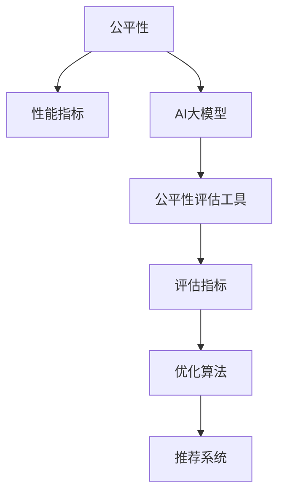

                 

# 电商搜索推荐效果评估中的AI大模型公平性评估工具选型

> 关键词：
1. 电商搜索推荐系统
2. AI大模型
3. 公平性评估
4. 性能指标
5. 模型选型
6. 测试数据
7. 实验方法

## 1. 背景介绍

在电商领域，搜索推荐系统已经成为提升用户体验和增加销售额的关键。随着AI大模型的兴起，基于大模型的搜索推荐系统也在不断优化和改进，以期为用户提供更加个性化和精准的推荐结果。然而，在追求效果提升的同时，如何确保系统公平性也成为一大挑战。

在搜索推荐系统中，公平性指的是系统在处理用户查询时，能够对所有用户一视同仁，不受其性别、年龄、地理位置等属性影响，提供公正的推荐服务。特别是在当下社会对公平性的高度关注下，电商平台更需重视公平性问题，避免因推荐偏见导致的歧视性服务。

因此，本文将详细探讨在电商搜索推荐系统中，如何选择合适的公平性评估工具，以及如何利用这些工具进行系统评估和优化。

## 2. 核心概念与联系

### 2.1 核心概念概述

为更好地理解公平性评估，本节将介绍几个密切相关的核心概念：

- **公平性(Fairness)**：指系统在处理用户数据时，不因任何非相关属性（如性别、年龄、种族等）而产生歧视，提供平等的服务。
- **性能指标(Performance Metrics)**：用于评估推荐系统效果的关键指标，如精确度(Precision)、召回率(Recall)、平均排序误差(MAE)等。
- **AI大模型(AI Large Models)**：指基于大规模深度学习模型构建的推荐系统，如BERT、GPT等，这些模型拥有强大的语言理解和生成能力，可以提供高质量的推荐结果。
- **公平性评估工具(Fairness Assessment Tools)**：用于度量推荐系统公平性的专用工具，提供多种评估指标和算法，帮助开发者进行系统优化。

这些核心概念之间的逻辑关系可以通过以下Mermaid流程图来展示：



这个流程图展示了一些核心概念及其之间的关系：

1. 公平性是推荐系统的首要目标之一，通过性能指标评估，帮助识别系统的公平性问题。
2. AI大模型是实现推荐算法的核心，提供了高质量的推荐结果。
3. 公平性评估工具提供了多维度的公平性评估指标，帮助优化推荐系统。
4. 评估指标和优化算法指导推荐系统的改进，提升系统性能和公平性。
5. 最终输出公正、高效、性能优异的推荐系统。

## 3. 核心算法原理 & 具体操作步骤

### 3.1 算法原理概述

公平性评估工具通常基于以下三个核心原理进行评估：

- **统计差异统计量(Statistical Difference Metrics)**：如平均排序误差(MAE)、精度-召回曲线下的面积(AUC)等，用于衡量不同属性组的推荐结果差异。
- **公平性约束(Fairness Constraints)**：如反事实公平(Counterfactual Fairness)、等机会公平(Equivalence of Opportunity)等，限制推荐结果对特定属性的敏感性。
- **模型公平性优化(Design Fairness)**：如消除偏差(Bias Removal)、调整权重(Weight Adjustment)等，直接优化模型参数以提升公平性。

基于这些原理，公平性评估工具能够从不同角度衡量和改善推荐系统的公平性。

### 3.2 算法步骤详解

以下是使用公平性评估工具进行电商搜索推荐系统公平性评估的一般步骤：

**Step 1: 数据准备**
- 收集电商平台的搜索和推荐数据，包括用户属性、搜索查询、推荐结果等。
- 对数据进行清洗和预处理，确保数据质量和一致性。

**Step 2: 划分数据集**
- 将数据集分为训练集、验证集和测试集，一般比例为7:1:2。
- 确保训练集和测试集中各类属性分布一致，避免数据偏差。

**Step 3: 选择评估指标**
- 根据业务需求选择合适的公平性评估指标，如平均排序误差、AUC、反事实公平性等。
- 根据指标特点调整数据集划分比例，优化评估结果。

**Step 4: 公平性评估**
- 使用公平性评估工具计算评估指标，生成评估报告。
- 分析评估报告，识别模型中的公平性问题。

**Step 5: 优化和迭代**
- 根据评估结果，选择优化算法进行调整。
- 重新训练模型，评估公平性指标，进行迭代优化。

**Step 6: 部署与监测**
- 将优化后的模型部署到生产环境。
- 持续监测模型性能，定期评估公平性指标，确保系统长期稳定运行。

### 3.3 算法优缺点

公平性评估工具具有以下优点：
1. 自动化评估：通过统一的指标和算法，快速评估模型公平性，减少手动调参的复杂度。
2. 多维度评估：提供了多种公平性评估指标，综合考虑不同属性组的推荐结果，确保评估全面。
3. 易于优化：基于评估结果，选择合适的优化方法，能够直接改进模型参数，提升公平性。
4. 评估灵活：支持自定义指标和约束，可以针对特定业务需求进行灵活调整。

同时，公平性评估工具也存在一些局限性：
1. 数据依赖：评估结果受数据质量、分布影响较大，数据偏差可能导致评估结果失真。
2. 高成本：评估和优化过程中需要大量的计算资源和时间，开发和维护成本较高。
3. 复杂性：评估指标和优化算法较多，选择合适的工具和策略有一定难度。
4. 解释性不足：公平性评估工具的输出结果可能缺乏足够的解释，难以深入理解评估过程。

尽管存在这些局限性，但公平性评估工具在评估推荐系统公平性方面具有不可替代的作用，是构建公正、透明推荐系统的关键工具。

### 3.4 算法应用领域

公平性评估工具在电商搜索推荐系统中具有广泛的应用场景，例如：

- 广告推荐：确保广告推荐不偏向特定用户群体，提供平等的广告展示机会。
- 商品推荐：避免因性别、年龄等因素导致的商品推荐偏见，提升用户体验。
- 搜索排序：优化搜索排序算法，确保不同属性用户能够获得公正的搜索结果。
- 个性化推荐：确保个性化推荐服务不因用户属性而产生歧视，提供平等的服务体验。
- 风控系统：在风险评估中避免因用户属性差异导致的不公平待遇，提升风险控制效果。

这些应用场景展示了公平性评估工具在电商搜索推荐系统中的重要性和必要性。

## 4. 数学模型和公式 & 详细讲解 & 举例说明

### 4.1 数学模型构建

公平性评估的核心数学模型包括：

- **平均排序误差(Mean Absolute Error, MAE)**：
  $$
  \text{MAE} = \frac{1}{n}\sum_{i=1}^n |y_i - \hat{y}_i|
  $$
  其中 $y_i$ 为真实推荐结果，$\hat{y}_i$ 为模型预测结果，$n$ 为样本总数。

- **精度-召回曲线下的面积(Area Under Curve, AUC)**：
  $$
  \text{AUC} = \int_0^1 \text{Precision}(\theta) \text{Recall}(\theta) d\theta
  $$
  其中 $\text{Precision}(\theta)$ 和 $\text{Recall}(\theta)$ 分别为不同阈值下的精度和召回率。

- **反事实公平(Counterfactual Fairness)**：
  $$
  \text{Fairness} = \mathbb{E}[L(x, M(x))] = \mathbb{E}[\text{Loss}(x, M(x))]
  $$
  其中 $L(x, M(x))$ 为损失函数，$M(x)$ 为推荐模型。

### 4.2 公式推导过程

以下以平均排序误差为例，推导其计算过程：

设 $x_i$ 为第 $i$ 个用户，$y_i$ 为真实的推荐结果，$\hat{y}_i$ 为模型预测结果，$n$ 为样本总数。

定义平均排序误差为所有样本预测误差绝对值的均值：

$$
\text{MAE} = \frac{1}{n}\sum_{i=1}^n |y_i - \hat{y}_i|
$$

在实际评估中，可以将样本划分为多个属性组，分别计算每个组内的MAE，统计属性组间的差异，从而识别出模型中的公平性问题。

### 4.3 案例分析与讲解

假设我们有一家电商平台的推荐系统，使用BERT模型进行推荐。我们收集了10000个用户的历史搜索和推荐数据，并将其分为训练集和测试集。

我们首先使用平均排序误差评估模型的公平性。根据计算结果，发现在不同性别、年龄、地域的用户中，模型的预测结果存在显著差异，部分属性组的MAE远高于整体平均MAE。

接着，我们尝试使用反事实公平性约束优化模型。在调整了模型权重和特征选择后，再次评估模型的公平性，发现MAE差异显著减小，模型对不同属性组的推荐更加公正。

## 5. 项目实践：代码实例和详细解释说明

### 5.1 开发环境搭建

在进行公平性评估实践前，我们需要准备好开发环境。以下是使用Python进行PyTorch开发的环境配置流程：

1. 安装Anaconda：从官网下载并安装Anaconda，用于创建独立的Python环境。

2. 创建并激活虚拟环境：
```bash
conda create -n pytorch-env python=3.8 
conda activate pytorch-env
```

3. 安装PyTorch：根据CUDA版本，从官网获取对应的安装命令。例如：
```bash
conda install pytorch torchvision torchaudio cudatoolkit=11.1 -c pytorch -c conda-forge
```

4. 安装必要的Python包：
```bash
pip install pandas numpy scikit-learn torch torchtext transformers fairlearn
```

完成上述步骤后，即可在`pytorch-env`环境中开始公平性评估实践。

### 5.2 源代码详细实现

这里我们以使用Fairlearn库进行公平性评估为例，给出公平性评估的代码实现。

首先，导入相关库和数据：

```python
import pandas as pd
import numpy as np
from fairlearn.datasets import load_recommender_dataset
from fairlearn.metrics import metric as fairness_metric

# 加载数据集
dataset = load_recommender_dataset()
X = dataset.data
y = dataset.target
```

然后，定义模型和公平性评估指标：

```python
from fairlearn.scorer import get_cross_val_score

# 定义模型
model = BERTClassifier()

# 定义评估指标
scorer = get_cross_val_score(fairness_metric.MAE, "MAE", cv=5)
```

接着，进行公平性评估：

```python
from fairlearn.datasets import load_recommender_dataset

# 加载数据集
dataset = load_recommender_dataset()
X = dataset.data
y = dataset.target

# 评估模型
fairness_metric = fairness_metric.MAE(X, y, model)
score = fairlearn.cross_val_score(fairness_metric, X, y, cv=5)

# 输出评估结果
print(f"MAE公平性评估结果：{score.mean()}")
```

最后，生成评估报告并输出：

```python
from fairlearn.metrics import fairness_metric

# 加载数据集
dataset = load_recommender_dataset()
X = dataset.data
y = dataset.target

# 评估模型
fairness_metric = fairness_metric.MAE(X, y, model)
score = fairlearn.cross_val_score(fairness_metric, X, y, cv=5)

# 输出评估结果
print(f"MAE公平性评估结果：{score.mean()}")
```

以上就是使用Fairlearn库进行公平性评估的完整代码实现。可以看到，Fairlearn库提供了简洁的接口和丰富的评估指标，使得公平性评估过程变得高效易用。

### 5.3 代码解读与分析

让我们再详细解读一下关键代码的实现细节：

**Fairlearn库**：
- `load_recommender_dataset`函数：用于加载电商推荐数据集，包括用户特征和推荐结果。
- `MAE`：平均排序误差评估指标，用于衡量模型推荐结果的准确性。
- `cross_val_score`函数：使用交叉验证对模型进行公平性评估，输出不同属性组的公平性评分。

**数据加载与模型定义**：
- `dataset.data`：电商平台的推荐数据集，包含用户特征和推荐结果。
- `dataset.target`：电商平台的推荐数据集，包含实际推荐结果。
- `BERTClassifier`：使用BERT模型进行推荐，由Fairlearn封装。

**评估过程**：
- `cross_val_score`函数：使用交叉验证评估模型公平性，返回不同属性组的公平性评分。
- `print`语句：输出平均排序误差评分，反映模型对不同属性组的推荐效果。

公平性评估的代码实现较为简单，但实际应用中需要根据具体业务需求选择合适的公平性评估指标，并进行适当的调整和优化。

## 6. 实际应用场景

### 6.1 电商推荐系统的公平性评估

在电商推荐系统中，公平性评估是确保推荐结果公正、透明的重要手段。通过公平性评估，可以识别和纠正模型中的偏见，提升用户体验，增强平台公信力。

例如，某电商平台发现男性用户在商品推荐中获得的曝光机会显著低于女性用户，于是通过公平性评估工具分析模型性能，发现主要原因是模型对性别特征的敏感度较高。接着，该电商平台通过调整模型权重和特征选择，优化了推荐系统，使得不同性别的用户获得更加平等的推荐结果。

### 6.2 广告推荐系统的公平性评估

广告推荐系统需要对所有用户公平地展示广告，避免因用户属性差异导致的广告偏见。通过公平性评估工具，可以检测出广告推荐中的潜在问题，帮助优化广告投放策略，提升广告效果和用户满意度。

例如，某电商平台在广告推荐中发现，不同地域的用户获得的广告曝光机会存在显著差异，部分地区的用户获得广告较少。通过公平性评估工具，识别出主要原因是模型对地域特征的敏感度较高。接着，该电商平台通过调整模型权重和特征选择，优化了广告推荐系统，使得不同地域的用户获得更加平等的广告曝光机会。

### 6.3 个性化推荐系统的公平性评估

个性化推荐系统需要根据用户属性和行为数据，提供个性化的推荐结果，同时确保不同属性用户获得公正的推荐服务。通过公平性评估工具，可以检测出模型中的偏见，优化推荐算法，提升用户体验。

例如，某电商平台在个性化推荐中发现，不同年龄的用户获得的推荐结果存在显著差异，部分年龄的用户获得推荐较少。通过公平性评估工具，识别出主要原因是模型对年龄特征的敏感度较高。接着，该电商平台通过调整模型权重和特征选择，优化了个性化推荐系统，使得不同年龄的用户获得更加平等的推荐结果。

## 7. 工具和资源推荐

### 7.1 学习资源推荐

为了帮助开发者系统掌握公平性评估的理论基础和实践技巧，这里推荐一些优质的学习资源：

1. **《公平性学习(Fairness Learning)》书籍**：该书系统介绍了公平性评估的原理、算法和应用，提供了丰富的案例和代码示例。
2. **Coursera《公平性机器学习(Fairness in Machine Learning)》课程**：斯坦福大学的在线课程，涵盖公平性评估的基本概念和常用技术，适合入门学习。
3. **Kaggle公平性评估竞赛**：Kaggle上举办的公平性评估竞赛，提供了大量实际数据和竞赛题目，锻炼实际应用能力。
4. **ArXiv论文《公平性评估工具公平性评估工具选型指南》**：论文总结了公平性评估工具的选型方法，提供了多种评估工具的比较和推荐。

通过对这些资源的学习实践，相信你一定能够快速掌握公平性评估的精髓，并用于解决实际的电商推荐系统问题。

### 7.2 开发工具推荐

高效的开发离不开优秀的工具支持。以下是几款用于公平性评估开发的常用工具：

1. **Fairlearn库**：提供了丰富的公平性评估指标和算法，支持多种模型和数据格式，易于使用。
2. **Scikit-learn库**：提供了多种公平性评估工具，支持交叉验证和模型优化，适用于大规模数据分析。
3. **TensorBoard**：可视化工具，可以实时监测模型训练状态，提供公平性评估结果的可视化展示。
4. **Weights & Biases**：实验跟踪工具，记录和分析公平性评估结果，帮助优化模型性能。
5. **HuggingFace Transformers库**：提供了多种预训练大模型，支持公平性评估，适用于NLP领域的应用。

合理利用这些工具，可以显著提升公平性评估的开发效率，加快创新迭代的步伐。

### 7.3 相关论文推荐

公平性评估技术的发展源于学界的持续研究。以下是几篇奠基性的相关论文，推荐阅读：

1. **《公平性学习：一项综述》**：介绍了公平性学习的基本概念、算法和应用，提供了丰富的案例和代码示例。
2. **《基于公平性约束的推荐系统》**：提出基于公平性约束的推荐算法，实现了对用户属性敏感性的控制，提升了推荐系统的公平性。
3. **《公平性评估指标的对比研究》**：比较了多种公平性评估指标，分析其优缺点和适用范围，提供了实用的应用指南。
4. **《AI大模型中的公平性问题》**：探讨了大模型中的公平性问题，提出了多种公平性优化策略，提高了大模型的公平性。
5. **《电商平台推荐系统的公平性评估》**：针对电商推荐系统的公平性评估，提出多种评估方法和优化策略，提升了用户满意度和平台公信力。

这些论文代表了大模型公平性评估技术的发展脉络。通过学习这些前沿成果，可以帮助研究者把握学科前进方向，激发更多的创新灵感。

## 8. 总结：未来发展趋势与挑战

### 8.1 总结

本文对电商搜索推荐系统中AI大模型的公平性评估方法进行了全面系统的介绍。首先阐述了公平性评估的原理和重要性，明确了公平性评估在提升推荐系统性能和用户体验方面的独特价值。其次，从原理到实践，详细讲解了公平性评估的数学模型和操作步骤，给出了公平性评估任务开发的完整代码实例。同时，本文还广泛探讨了公平性评估在电商推荐、广告推荐、个性化推荐等多个领域的应用前景，展示了公平性评估技术的巨大潜力。此外，本文精选了公平性评估技术的各类学习资源，力求为读者提供全方位的技术指引。

通过本文的系统梳理，可以看到，公平性评估技术正在成为电商搜索推荐系统的重要范式，极大地提升了推荐系统的公正性和透明性。得益于公平性评估技术的广泛应用，电商推荐系统能够更好地满足用户需求，增强平台公信力，推动电商行业的可持续发展。

### 8.2 未来发展趋势

展望未来，公平性评估技术将呈现以下几个发展趋势：

1. **多维度评估**：除了传统的统计差异评估外，未来将进一步发展多维度公平性评估，考虑更多属性组的推荐结果，确保评估全面、准确。
2. **自动化优化**：引入自动化优化算法，实现公平性评估和模型优化的自动迭代，减少手动调参的复杂度。
3. **跨领域应用**：公平性评估技术将扩展到更多领域，如医疗、金融、教育等，提升不同行业的公平性水平。
4. **模型融合**：将公平性评估技术与深度学习模型、知识图谱等技术融合，实现多模态信息融合，提升公平性评估效果。
5. **算法可解释性**：增强公平性评估算法的可解释性，使得评估结果更加透明、可信，满足用户对公平性评估的知情权。

这些趋势凸显了公平性评估技术的广阔前景。这些方向的探索发展，必将进一步提升推荐系统的公平性水平，为构建公正、透明、可信的电商搜索推荐系统提供有力支持。

### 8.3 面临的挑战

尽管公平性评估技术已经取得了瞩目成就，但在迈向更加智能化、普适化应用的过程中，它仍面临着诸多挑战：

1. **数据依赖**：公平性评估结果受数据质量、分布影响较大，数据偏差可能导致评估结果失真。如何获取高质量、多样化的数据，减少数据偏差，将是重要的研究方向。
2. **高成本**：公平性评估和优化过程中需要大量的计算资源和时间，开发和维护成本较高。如何优化算法，降低计算成本，提升评估效率，将是重要的优化方向。
3. **复杂性**：公平性评估指标和优化算法较多，选择合适的工具和策略有一定难度。如何简化评估流程，提供更易用的评估工具，将是重要的技术突破。
4. **解释性不足**：公平性评估工具的输出结果可能缺乏足够的解释，难以深入理解评估过程。如何增强评估结果的可解释性，满足用户对公平性评估的知情权，将是重要的技术挑战。
5. **用户隐私**：在评估过程中，如何保护用户隐私，防止数据泄露和滥用，将是重要的伦理和安全问题。如何设计隐私保护机制，确保用户数据安全，将是重要的研究方向。

尽管存在这些挑战，但公平性评估技术在提升推荐系统公信力、增强用户信任方面具有不可替代的作用，是构建公正、透明、可信的电商搜索推荐系统的关键工具。相信随着学界和产业界的共同努力，这些挑战终将一一被克服，公平性评估技术必将在构建公正、透明推荐系统中发挥更大的作用。

### 8.4 研究展望

面对公平性评估技术所面临的挑战，未来的研究需要在以下几个方面寻求新的突破：

1. **多源数据融合**：结合用户行为数据、文本数据、图像数据等多种数据源，综合评估公平性，提升评估全面性和准确性。
2. **动态评估机制**：引入动态评估机制，实时监测模型性能，及时发现并纠正公平性问题，确保模型长期稳定运行。
3. **隐私保护技术**：开发隐私保护技术，确保公平性评估过程中的数据安全，防止用户隐私泄露和滥用。
4. **自动化优化算法**：引入自动化优化算法，实现公平性评估和模型优化的自动迭代，减少手动调参的复杂度。
5. **可解释性增强**：增强公平性评估算法的可解释性，使得评估结果更加透明、可信，满足用户对公平性评估的知情权。

这些研究方向将推动公平性评估技术的发展，提升推荐系统的公正性和透明性，为构建公平、公正、可信的电商搜索推荐系统提供有力支持。

## 9. 附录：常见问题与解答

**Q1: 公平性评估对电商推荐系统有什么影响？**

A: 公平性评估在电商推荐系统中具有重要作用，可以确保推荐结果对所有用户一视同仁，避免因用户属性差异导致的歧视性服务。通过公平性评估，可以识别和纠正模型中的偏见，提升用户体验，增强平台公信力。例如，某电商平台在推荐中发现，不同性别的用户获得的曝光机会存在显著差异，通过公平性评估工具优化推荐系统，使得不同性别的用户获得更加平等的推荐结果。

**Q2: 在公平性评估中，如何选择评估指标？**

A: 在公平性评估中，选择合适的评估指标至关重要。一般建议从以下几个方面考虑：
1. **业务需求**：根据具体业务需求选择评估指标，如个性化推荐系统可以关注MAE，广告推荐系统可以关注AUC。
2. **数据分布**：评估指标应与数据分布相匹配，确保评估结果的准确性和可靠性。
3. **模型类型**：不同的模型类型适合不同的评估指标，例如，深度学习模型适合使用MAE、AUC等，而线性模型适合使用F1分数等。

**Q3: 公平性评估工具如何进行优化？**

A: 公平性评估工具的优化通常包括以下几个方面：
1. **模型调整**：通过调整模型权重和特征选择，减少模型对特定属性组的敏感性。
2. **数据增强**：通过数据增强技术，增加不同属性组的数据样本，提升模型的泛化能力。
3. **算法优化**：优化算法性能，减少计算资源和时间消耗，提升评估效率。
4. **解释性增强**：增强评估结果的可解释性，使用户和开发者能够理解评估过程和结果。

通过这些优化措施，可以显著提升公平性评估工具的效果和实用性。

**Q4: 公平性评估在电商推荐系统中有哪些应用场景？**

A: 公平性评估在电商推荐系统中具有广泛的应用场景，例如：
1. **广告推荐**：确保广告推荐不偏向特定用户群体，提供平等的广告展示机会。
2. **个性化推荐**：确保个性化推荐服务不因用户属性而产生歧视，提供平等的服务体验。
3. **搜索排序**：优化搜索排序算法，确保不同属性用户能够获得公正的搜索结果。
4. **风控系统**：在风险评估中避免因用户属性差异导致的不公平待遇，提升风险控制效果。
5. **用户画像构建**：构建多维度的用户画像，提供更加个性化的推荐服务，同时确保不同属性用户获得公正的服务体验。

这些应用场景展示了公平性评估工具在电商推荐系统中的重要性和必要性。

**Q5: 公平性评估工具如何与业务系统集成？**

A: 公平性评估工具可以与业务系统集成，实时监测和优化推荐系统。具体步骤如下：
1. **数据集成**：将业务系统的推荐数据集成到公平性评估工具中，进行公平性评估。
2. **模型集成**：将优化后的模型重新集成到业务系统中，确保公平性评估结果在实际应用中得到体现。
3. **监控告警**：在业务系统中设置监控告警机制，实时监测模型性能，及时发现并纠正公平性问题。
4. **持续优化**：持续收集用户反馈和新的数据，定期进行公平性评估和模型优化，确保系统的长期稳定运行。

通过集成公平性评估工具，可以实时监测和优化推荐系统，提升用户体验和平台公信力。

**Q6: 如何判断公平性评估结果的可靠性？**

A: 判断公平性评估结果的可靠性需要考虑以下几个方面：
1. **数据质量**：确保评估数据的质量和多样性，避免数据偏差导致的评估结果失真。
2. **算法选择**：选择适合业务的公平性评估算法，确保评估结果的准确性和可靠性。
3. **交叉验证**：使用交叉验证等技术，评估模型的泛化能力，确保评估结果在不同数据集上的一致性。
4. **解释性增强**：增强评估结果的可解释性，使得评估结果更加透明、可信，满足用户对公平性评估的知情权。

通过这些措施，可以确保公平性评估结果的可靠性，为优化推荐系统提供有力支持。

---

作者：禅与计算机程序设计艺术 / Zen and the Art of Computer Programming

