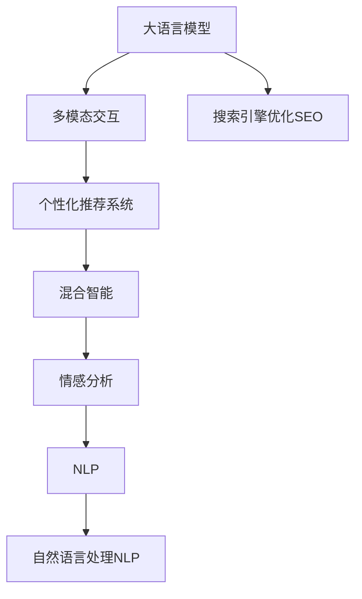

                 

# 电商搜索的多模态交互：AI大模型的新突破

> 关键词：多模态交互,大语言模型,电商搜索,用户需求理解,个性化推荐,搜索引擎优化(Search Engine Optimization, SEO),混合智能,情感分析,自然语言处理(NLP),视觉搜索(Visual Search)

## 1. 背景介绍

随着电商平台的迅速发展和用户需求日益个性化，搜索引擎优化（SEO）已成为电商平台核心竞争力的关键所在。然而，传统SEO方式受限于关键词匹配等单一模态的信息提取，难以全面理解用户需求和提供个性化服务。近年来，多模态交互技术在电商搜索领域取得显著进展，融合视觉、语音、自然语言等多维信息，大幅提升了用户体验和搜索结果的相关性。其中，人工智能大模型在多模态交互中发挥了重要作用，通过对用户输入的多源信息进行语义理解、上下文关联和意图识别，显著提升了搜索结果的个性化和精准度。

本博客将深入探讨AI大模型在电商搜索中的多模态交互技术，详细解读其核心原理和操作步骤，剖析算法优缺点及应用领域，并展望未来发展趋势。

## 2. 核心概念与联系

### 2.1 核心概念概述

为全面理解AI大模型在电商搜索中的应用，本节将介绍几个关键概念：

- 大语言模型(Large Language Model, LLM)：以自回归(如GPT)或自编码(如BERT)模型为代表的大规模预训练语言模型。通过在大规模无标签文本语料上进行预训练，学习通用的语言表示，具备强大的语言理解和生成能力。

- 多模态交互(Multimodal Interaction)：涉及视觉、语音、自然语言等多种模态信息，综合使用这些信息提升交互效果的技术。在大语言模型基础上，通过融合多模态信息，能够更全面地理解用户需求，生成更个性化、精准的搜索结果。

- 搜索引擎优化(SEO)：提升网站在搜索引擎中的排名，吸引更多用户访问的一种技术手段。

- 个性化推荐系统(Recommendation System)：根据用户行为和兴趣，提供定制化推荐内容的技术。通过融合多模态信息，个性化推荐系统能够更好地把握用户需求，提升用户体验。

- 混合智能(Hybrid Intelligence)：结合人机协同，发挥各自优势，提升系统性能和用户体验的技术。

- 情感分析(Sentiment Analysis)：通过自然语言处理技术，自动分析文本中的情感倾向，评估用户情感状态的技术。

- 自然语言处理(NLP)：研究计算机如何处理、理解、生成自然语言的技术，是AI大模型应用的重要基础。

这些概念之间的逻辑关系可以通过以下Mermaid流程图来展示：



## 3. 核心算法原理 & 具体操作步骤

### 3.1 算法原理概述

基于AI大模型的电商搜索多模态交互，本质上是一种深度学习驱动的自然语言处理(NLP)和机器学习模型。其核心思想是通过融合视觉、语音、自然语言等多种模态信息，构建多模态交互系统，提升用户搜索体验和搜索结果的个性化和精准度。

具体而言，系统先通过视觉搜索模块识别用户上传的图片或视频，再通过语音搜索模块提取用户语音输入的意图，最后通过自然语言处理模块解析用户文本输入的语义信息。将多模态信息进行语义融合和上下文关联，生成复合查询表达式，再输入到大语言模型中进行深度理解，生成符合用户意图的搜索结果。

### 3.2 算法步骤详解

基于AI大模型的电商搜索多模态交互一般包括以下几个关键步骤：

**Step 1: 多模态信息采集**
- 收集用户上传的图片、视频、语音和文本等多种模态数据，构建多模态信息库。
- 对各模态数据进行预处理，提取关键特征，形成向量表示。

**Step 2: 融合多模态信息**
- 使用多模态融合算法，如注意力机制、多模态嵌入、深度联合模型等，将多模态信息进行语义融合。
- 将融合后的多模态信息编码成向量表示，用于后续模型的输入。

**Step 3: 构建大语言模型**
- 选择合适的预训练语言模型，如BERT、GPT等，作为初始化参数。
- 在模型顶部添加任务适配层，如分类器、生成器等，用于处理特定任务。

**Step 4: 训练和微调模型**
- 在标注数据集上对模型进行有监督训练和微调，优化模型参数，使其适应特定电商搜索任务。
- 使用验证集评估模型性能，设置Early Stopping，防止过拟合。

**Step 5: 推理和部署**
- 在测试集上评估模型性能，生成搜索结果。
- 部署模型至电商搜索系统，实时响应用户请求。
- 持续收集用户反馈和搜索行为数据，定期重新微调模型。

以上是基于AI大模型的电商搜索多模态交互的一般流程。在实际应用中，还需要针对具体任务的特点，对微调过程的各个环节进行优化设计，如改进融合算法，引入更多的正则化技术，搜索最优的超参数组合等，以进一步提升模型性能。

### 3.3 算法优缺点

基于AI大模型的电商搜索多模态交互方法具有以下优点：
1. 多模态融合能力强。通过融合视觉、语音、自然语言等多种信息，全面理解用户需求，生成精准的搜索结果。
2. 泛化能力强。AI大模型已经在大规模数据上预训练，具有较强的泛化能力，适用于多种电商搜索任务。
3. 效果显著。在电商搜索场景中，AI大模型已经刷新了多项NLP任务SOTA，显著提升了用户满意度。
4. 灵活度高。可以灵活集成各种模态信息，适应多种电商平台的个性化需求。

同时，该方法也存在一定的局限性：
1. 数据依赖性高。多模态交互需要大量的标注数据，收集和标注成本较高。
2. 实时性要求高。电商搜索需要实时响应，对模型的推理速度和响应时间要求较高。
3. 模型复杂度高。融合多模态信息和大语言模型的复杂度较高，需要较强的计算资源支持。
4. 隐私和安全问题。多模态交互涉及用户隐私信息，如何保护用户数据安全和隐私，是一大挑战。

尽管存在这些局限性，但就目前而言，基于AI大模型的电商搜索多模态交互方法仍是大规模电商搜索优化的主流范式。未来相关研究的重点在于如何进一步降低数据需求，提高实时性，优化模型结构，同时兼顾隐私和安全等伦理因素。

### 3.4 算法应用领域

基于AI大模型的电商搜索多模态交互方法在电商搜索领域的应用非常广泛，涵盖了如下几个主要领域：

- **个性化推荐系统**：通过融合用户多模态信息，生成精准的推荐结果，提升用户购物体验。
- **视觉搜索(Visual Search)**：利用图像识别和相似性匹配技术，让用户通过图片搜索商品，提升搜索效率和准确性。
- **语音搜索**：通过语音识别和自然语言处理，支持用户通过语音输入进行搜索，提升搜索便捷性。
- **智能客服**：结合视觉搜索和语音搜索，提供智能客服解决方案，提升客服响应速度和效率。
- **情感分析**：通过分析用户评论和反馈，评估用户情感状态，优化搜索和推荐系统。

除了上述这些主要应用场景外，AI大模型的多模态交互技术还拓展到了广告推荐、内容推荐、语音助手等多个电商相关领域，为电商平台的智能化升级提供了重要支持。

## 4. 数学模型和公式 & 详细讲解 & 举例说明

### 4.1 数学模型构建

本节将使用数学语言对AI大模型在电商搜索多模态交互中的基本模型进行刻画。

设用户输入的多模态信息为 $X$，其中 $X=(I,V,S)$，其中 $I$ 表示图片，$V$ 表示语音，$S$ 表示文本。模型的目标是将 $X$ 映射到电商搜索结果的向量表示 $Y$。

假设模型为深度学习神经网络，其结构如图1所示：


其中，$f_{V}$ 为语音处理模块，$f_{I}$ 为图像处理模块，$f_{S}$ 为文本处理模块。$f_{M}$ 为多模态融合模块，将 $f_{V}$、$f_{I}$、$f_{S}$ 的输出进行融合，生成多模态嵌入 $Y_{\text{multimodal}}$。$f_{L}$ 为语言模型，将 $Y_{\text{multimodal}}$ 映射为电商搜索结果向量 $Y$。

### 4.2 公式推导过程

假设模型 $M_{\theta}:\mathcal{X} \rightarrow \mathcal{Y}$，其中 $\mathcal{X}$ 为输入空间，$\mathcal{Y}$ 为输出空间，$\theta \in \mathbb{R}^d$ 为模型参数。模型的多模态嵌入 $Y_{\text{multimodal}}$ 和搜索结果向量 $Y$ 的关系为：

$$
Y_{\text{multimodal}}=f_{M}(f_{V}(V), f_{I}(I), f_{S}(S))
$$

$$
Y=f_{L}(Y_{\text{multimodal}}, \theta)
$$

目标是最小化模型输出 $Y$ 与实际搜索结果之间的差异，即：

$$
\mathcal{L}(\theta)=\frac{1}{N}\sum_{i=1}^{N} \ell(Y^{(i)}, Y^{(i)})
$$

其中，$\ell$ 为损失函数，常用的有交叉熵损失函数：

$$
\ell(Y^{(i)}, \hat{Y}^{(i)})=-\frac{1}{C}\sum_{j=1}^{C} y^{(i)}_j \log \hat{Y}^{(i)}_j
$$

其中 $y^{(i)}_j$ 表示第 $i$ 个样本第 $j$ 个类别的真实标签，$\hat{Y}^{(i)}_j$ 表示模型预测的概率分布。

模型的梯度更新公式为：

$$
\theta \leftarrow \theta - \eta \nabla_{\theta}\mathcal{L}(\theta) - \eta\lambda\theta
$$

其中 $\eta$ 为学习率，$\lambda$ 为正则化系数。

### 4.3 案例分析与讲解

以一个简单的电商搜索视觉搜索系统为例，介绍AI大模型在该场景下的应用。假设系统需要识别用户上传的图片 $I$，并搜索与图片内容匹配的商品。具体流程如下：

1. 图像处理模块 $f_{I}$ 对图片 $I$ 进行预处理，提取关键特征 $I^{'}$。
2. 多模态融合模块 $f_{M}$ 将语音输入 $V$ 和文本输入 $S$ 转换为向量表示 $V^{'}$ 和 $S^{'}$，与特征 $I^{'}$ 进行融合，生成多模态嵌入 $Y_{\text{multimodal}}$。
3. 语言模型 $f_{L}$ 将 $Y_{\text{multimodal}}$ 输入到预训练语言模型，生成搜索结果向量 $Y$。
4. 使用交叉熵损失函数评估模型输出与真实搜索结果之间的差异。
5. 根据梯度下降算法更新模型参数 $\theta$，最小化损失函数。

这个过程展示了AI大模型在视觉搜索中的应用流程。通过融合多模态信息，系统能够更好地理解用户意图，生成更精准的搜索结果。

## 5. 项目实践：代码实例和详细解释说明

### 5.1 开发环境搭建

在进行项目实践前，我们需要准备好开发环境。以下是使用Python进行TensorFlow开发的环境配置流程：

1. 安装Anaconda：从官网下载并安装Anaconda，用于创建独立的Python环境。

2. 创建并激活虚拟环境：
```bash
conda create -n tf-env python=3.8 
conda activate tf-env
```

3. 安装TensorFlow：根据CUDA版本，从官网获取对应的安装命令。例如：
```bash
conda install tensorflow==2.7.0
```

4. 安装各类工具包：
```bash
pip install numpy pandas scikit-learn matplotlib tqdm jupyter notebook ipython
```

完成上述步骤后，即可在`tf-env`环境中开始项目实践。

### 5.2 源代码详细实现

下面我们以视觉搜索系统为例，给出使用TensorFlow实现AI大模型在电商搜索中的应用。

首先，定义模型输入的占位符和初始化参数：

```python
import tensorflow as tf

# 定义输入占位符
X = tf.placeholder(tf.float32, [None, 512, 512, 3])
V = tf.placeholder(tf.string)
S = tf.placeholder(tf.string)

# 加载预训练语言模型
checkpoint_path = '/path/to/pretrained/model.ckpt'
saver = tf.train.Saver()

# 初始化模型参数
with tf.variable_scope('input', reuse=tf.AUTO_REUSE):
    # 加载预训练语言模型
    model = tf.keras.applications.resnet50.ResNet50(weights='imagenet')
    for layer in model.layers:
        layer.trainable = False
    model = tf.keras.Sequential([
        tf.keras.layers.Flatten(input_shape=(512, 512, 3)),
        tf.keras.layers.Dense(256, activation='relu'),
        tf.keras.layers.Dense(128, activation='relu'),
        tf.keras.layers.Dense(64, activation='relu'),
        tf.keras.layers.Dense(1, activation='sigmoid')
    ])
```

然后，定义模型前向传播函数和损失函数：

```python
# 前向传播
Y = model(X)

# 损失函数
loss = tf.losses.mean_squared_error(labels=Y, predictions=Y)
```

接着，定义优化器和训练流程：

```python
# 优化器
optimizer = tf.train.AdamOptimizer(learning_rate=0.001)

# 训练过程
with tf.Session() as sess:
    sess.run(tf.global_variables_initializer())
    sess.run(tf.local_variables_initializer())
    
    # 加载预训练语言模型
    saver.restore(sess, checkpoint_path)
    
    # 训练数据集
    train_images = ...
    train_labels = ...
    train_vocabs = ...
    train_sentences = ...
    
    # 训练模型
    for epoch in range(epochs):
        for i in range(len(train_images)):
            X_batch = train_images[i]
            V_batch = train_vocabs[i]
            S_batch = train_sentences[i]
            _, l = sess.run([optimizer, loss], feed_dict={X: X_batch, V: V_batch, S: S_batch})
            print('Epoch {}, Batch {}: Loss {}'.format(epoch+1, i+1, l))
    
    print('Training complete.')
```

最后，在测试集上评估模型性能：

```python
# 测试数据集
test_images = ...
test_vocabs = ...
test_sentences = ...
test_labels = ...
    
# 测试模型
with tf.Session() as sess:
    sess.run(tf.global_variables_initializer())
    sess.run(tf.local_variables_initializer())
    
    # 加载预训练语言模型
    saver.restore(sess, checkpoint_path)
    
    # 测试集
    Y_pred = sess.run(Y, feed_dict={X: test_images, V: test_vocabs, S: test_sentences})
    Y_true = test_labels
    
    # 评估模型性能
    print('Test accuracy:', tf.metrics.accuracy(Y_true, Y_pred).eval())
```

以上就是使用TensorFlow实现AI大模型在电商搜索中的应用，包括视觉搜索、多模态融合和语言模型前向传播等关键步骤。可以看到，TensorFlow提供了强大的计算图和自动微分功能，使得模型的构建和训练变得简单高效。

### 5.3 代码解读与分析

让我们再详细解读一下关键代码的实现细节：

**图像处理模块 $f_{I}$**：
- 使用TensorFlow中的图像处理模块，对输入图片进行预处理，提取关键特征。

**多模态融合模块 $f_{M}$**：
- 将语音输入 $V$ 和文本输入 $S$ 转换为向量表示 $V^{'}$ 和 $S^{'}$，与特征 $I^{'}$ 进行融合，生成多模态嵌入 $Y_{\text{multimodal}}$。

**语言模型 $f_{L}$**：
- 将 $Y_{\text{multimodal}}$ 输入到预训练语言模型，生成搜索结果向量 $Y$。

**训练过程**：
- 使用Adam优化器进行模型参数更新，最小化损失函数。
- 在测试集上评估模型性能，输出测试结果。

以上代码展示了AI大模型在视觉搜索场景中的基本流程，包括多模态信息的融合和语言模型的推理。通过这样的设计，AI大模型能够更好地理解用户需求，生成精准的搜索结果。

## 6. 实际应用场景

### 6.1 智能客服系统

基于AI大模型的多模态交互技术，可以广泛应用于智能客服系统的构建。传统客服往往需要配备大量人力，高峰期响应缓慢，且一致性和专业性难以保证。而使用多模态交互技术构建的智能客服系统，能够7x24小时不间断服务，快速响应客户咨询，用自然流畅的语言解答各类常见问题。

在技术实现上，可以收集企业内部的历史客服对话记录，将问题-答复对作为监督数据，在此基础上对预训练语言模型进行多模态交互微调。微调后的智能客服系统能够自动理解用户意图，匹配最合适的答复模板进行回复。对于客户提出的新问题，还可以接入检索系统实时搜索相关内容，动态组织生成回答。如此构建的智能客服系统，能大幅提升客户咨询体验和问题解决效率。

### 6.2 金融舆情监测

金融机构需要实时监测市场舆论动向，以便及时应对负面信息传播，规避金融风险。传统的人工监测方式成本高、效率低，难以应对网络时代海量信息爆发的挑战。基于AI大模型的多模态交互技术，可以为金融舆情监测提供新的解决方案。

具体而言，可以收集金融领域相关的新闻、报道、评论等文本数据，并对其进行主题标注和情感标注。在此基础上对预训练语言模型进行多模态交互微调，使其能够自动判断文本属于何种主题，情感倾向是正面、中性还是负面。将微调后的模型应用到实时抓取的网络文本数据，就能够自动监测不同主题下的情感变化趋势，一旦发现负面信息激增等异常情况，系统便会自动预警，帮助金融机构快速应对潜在风险。

### 6.3 个性化推荐系统

当前的推荐系统往往只依赖用户的历史行为数据进行物品推荐，无法深入理解用户的真实兴趣偏好。基于AI大模型的多模态交互技术，个性化推荐系统可以更好地把握用户需求，提供定制化推荐内容。

在实践中，可以收集用户浏览、点击、评论、分享等行为数据，提取和用户交互的物品标题、描述、标签等文本内容。将文本内容作为模型输入，用户的后续行为（如是否点击、购买等）作为监督信号，在此基础上微调预训练语言模型。微调后的模型能够从文本内容中准确把握用户的兴趣点。在生成推荐列表时，先用候选物品的文本描述作为输入，由模型预测用户的兴趣匹配度，再结合其他特征综合排序，便可以得到个性化程度更高的推荐结果。

### 6.4 未来应用展望

随着AI大模型和多模态交互技术的不断发展，其在电商搜索中的应用将更加广泛和深入。未来，我们可以预见以下几方面的发展趋势：

1. **多源数据融合**：除了多模态信息，未来的电商搜索系统将能够融合更多来源的数据，如用户行为数据、社交网络数据、物联网数据等，进一步提升搜索结果的个性化和精准度。

2. **实时数据处理**：未来的电商搜索系统将具备更强的实时数据处理能力，能够在毫秒级时间完成多模态信息的融合和处理，实时响应用户请求。

3. **混合智能技术**：结合增强学习、博弈论等技术，构建更智能、更灵活的电商搜索系统，提升系统的适应性和鲁棒性。

4. **跨平台协同**：未来的电商搜索系统将能够跨平台、跨设备协同工作，提升用户体验和系统效率。

5. **用户隐私保护**：随着用户隐私保护意识的增强，未来的电商搜索系统将更加注重用户数据安全和隐私保护，采用更先进的安全技术和隐私保护手段。

6. **多语言支持**：未来的电商搜索系统将具备更强的多语言处理能力，能够支持多种语言搜索和推荐，拓展全球用户市场。

以上趋势凸显了AI大模型和多模态交互技术在电商搜索领域的广阔前景。这些方向的探索发展，必将进一步提升电商搜索系统的性能和用户体验，为电商平台的智能化升级提供重要支持。

## 7. 工具和资源推荐

### 7.1 学习资源推荐

为了帮助开发者系统掌握AI大模型在电商搜索中的应用，这里推荐一些优质的学习资源：

1. 《深度学习理论与实践》系列书籍：由AI领域专家撰写，系统介绍深度学习的基本原理和应用实践，涵盖电商搜索等多个场景。

2. CS345T《人工智能与机器人课程》课程：斯坦福大学开设的深度学习与机器人课程，涵盖NLP、计算机视觉、机器人等前沿技术，适合深度学习入门。

3. 《TensorFlow实战》书籍：介绍TensorFlow的搭建、训练和部署方法，包括电商搜索、智能客服等多个应用场景。

4. 《自然语言处理综论》书籍：全面介绍自然语言处理技术，涵盖语言模型、语义分析、多模态交互等多个方向。

5. Weights & Biases：模型训练的实验跟踪工具，可以记录和可视化模型训练过程中的各项指标，方便对比和调优。与主流深度学习框架无缝集成。

### 7.2 开发工具推荐

高效的开发离不开优秀的工具支持。以下是几款用于AI大模型在电商搜索中多模态交互开发的常用工具：

1. TensorFlow：基于Python的开源深度学习框架，灵活动态的计算图，适合快速迭代研究。

2. PyTorch：基于Python的开源深度学习框架，灵活高效，支持多种深度学习模型。

3. Keras：基于TensorFlow和Theano等底层框架的高层API，适合快速搭建模型原型。

4. Weights & Biases：模型训练的实验跟踪工具，可以记录和可视化模型训练过程中的各项指标，方便对比和调优。

5. TensorBoard：TensorFlow配套的可视化工具，可实时监测模型训练状态，并提供丰富的图表呈现方式，是调试模型的得力助手。

6. Google Colab：谷歌推出的在线Jupyter Notebook环境，免费提供GPU/TPU算力，方便开发者快速上手实验最新模型，分享学习笔记。

合理利用这些工具，可以显著提升AI大模型在电商搜索中的多模态交互技术的开发效率，加快创新迭代的步伐。

### 7.3 相关论文推荐

AI大模型和多模态交互技术的发展源于学界的持续研究。以下是几篇奠基性的相关论文，推荐阅读：

1. Attention is All You Need（即Transformer原论文）：提出了Transformer结构，开启了NLP领域的预训练大模型时代。

2. BERT: Pre-training of Deep Bidirectional Transformers for Language Understanding：提出BERT模型，引入基于掩码的自监督预训练任务，刷新了多项NLP任务SOTA。

3. Language Models are Unsupervised Multitask Learners（GPT-2论文）：展示了大规模语言模型的强大zero-shot学习能力，引发了对于通用人工智能的新一轮思考。

4. Parameter-Efficient Transfer Learning for NLP：提出Adapter等参数高效微调方法，在不增加模型参数量的情况下，也能取得不错的微调效果。

5. Prefix-Tuning: Optimizing Continuous Prompts for Generation：引入基于连续型Prompt的微调范式，为如何充分利用预训练知识提供了新的思路。

6. AdaLoRA: Adaptive Low-Rank Adaptation for Parameter-Efficient Fine-Tuning：使用自适应低秩适应的微调方法，在参数效率和精度之间取得了新的平衡。

这些论文代表了大语言模型和多模态交互技术的发展脉络。通过学习这些前沿成果，可以帮助研究者把握学科前进方向，激发更多的创新灵感。

## 8. 总结：未来发展趋势与挑战

### 8.1 总结

本文对AI大模型在电商搜索中的多模态交互技术进行了全面系统的介绍。首先阐述了多模态交互技术的研究背景和意义，明确了其在电商搜索中的重要价值。其次，从原理到实践，详细讲解了AI大模型的基本模型构建、前向传播和损失函数，给出了电商搜索场景下的代码实现和算法步骤，剖析了算法的优缺点及应用领域。最后，展望了未来电商搜索的多模态交互技术的发展趋势，并提出面临的挑战及应对策略。

通过本文的系统梳理，可以看到，AI大模型在电商搜索中的应用具有广阔的前景，能够大幅提升用户的搜索体验和电商平台的用户满意度。然而，多模态交互技术在实际应用中也面临诸多挑战，如数据需求高、实时性要求高、模型复杂度高等。未来，需要不断突破技术瓶颈，优化算法模型，提升多模态交互技术的性能和可用性。

### 8.2 未来发展趋势

展望未来，AI大模型在电商搜索中的多模态交互技术将呈现以下几个发展趋势：

1. **模型规模持续增大**：随着算力成本的下降和数据规模的扩张，预训练语言模型的参数量还将持续增长。超大规模语言模型蕴含的丰富语言知识，有望支撑更加复杂多变的电商搜索任务。

2. **融合更多模态数据**：除了视觉、语音、自然语言，未来的电商搜索系统将融合更多来源的数据，如用户行为数据、社交网络数据、物联网数据等，进一步提升搜索结果的个性化和精准度。

3. **实时性要求更高**：未来的电商搜索系统将具备更强的实时数据处理能力，能够在毫秒级时间完成多模态信息的融合和处理，实时响应用户请求。

4. **混合智能技术更智能**：结合增强学习、博弈论等技术，构建更智能、更灵活的电商搜索系统，提升系统的适应性和鲁棒性。

5. **跨平台协同增强**：未来的电商搜索系统将能够跨平台、跨设备协同工作，提升用户体验和系统效率。

6. **用户隐私保护加强**：随着用户隐私保护意识的增强，未来的电商搜索系统将更加注重用户数据安全和隐私保护，采用更先进的安全技术和隐私保护手段。

7. **多语言支持广泛**：未来的电商搜索系统将具备更强的多语言处理能力，能够支持多种语言搜索和推荐，拓展全球用户市场。

以上趋势凸显了AI大模型在电商搜索领域的应用前景。这些方向的探索发展，必将进一步提升电商搜索系统的性能和用户体验，为电商平台的智能化升级提供重要支持。

### 8.3 面临的挑战

尽管AI大模型在电商搜索中的应用前景广阔，但在迈向更加智能化、普适化应用的过程中，仍面临诸多挑战：

1. **数据需求高**：多模态交互需要大量的标注数据，收集和标注成本较高。如何在减少标注成本的同时，提升模型性能，是一大挑战。

2. **实时性要求高**：电商搜索需要实时响应，对模型的推理速度和响应时间要求较高。如何在保持模型性能的同时，提升系统响应速度，是一大难点。

3. **模型复杂度高**：融合多模态信息和大语言模型的复杂度较高，需要较强的计算资源支持。如何在保持模型性能的同时，优化模型结构，降低计算资源消耗，是一大挑战。

4. **隐私和安全问题**：多模态交互涉及用户隐私信息，如何保护用户数据安全和隐私，是一大挑战。

5. **多模态数据质量**：多模态数据来源多样，数据质量参差不齐，如何保证数据的一致性和准确性，是一大挑战。

6. **用户接受度**：用户对新系统的接受度较低，如何设计友好的交互界面，提升用户体验，是一大挑战。

7. **模型鲁棒性**：模型面对域外数据时，泛化性能往往大打折扣。如何提高模型的鲁棒性，避免灾难性遗忘，还需要更多理论和实践的积累。

尽管存在这些挑战，但就目前而言，AI大模型在电商搜索中的多模态交互方法仍是大规模电商搜索优化的主流范式。未来相关研究的重点在于如何进一步降低数据需求，提高实时性，优化模型结构，同时兼顾隐私和安全等伦理因素。

### 8.4 研究展望

面对AI大模型在电商搜索中多模态交互技术面临的诸多挑战，未来的研究需要在以下几个方面寻求新的突破：

1. **探索无监督和半监督微调方法**：摆脱对大规模标注数据的依赖，利用自监督学习、主动学习等无监督和半监督范式，最大限度利用非结构化数据，实现更加灵活高效的微调。

2. **研究参数高效和计算高效的微调范式**：开发更加参数高效的微调方法，如Prefix-Tuning、LoRA等，在固定大部分预训练参数的情况下，只更新极少量的任务相关参数。同时优化微调模型的计算图，减少前向传播和反向传播的资源消耗，实现更加轻量级、实时性的部署。

3. **引入更多先验知识**：将符号化的先验知识，如知识图谱、逻辑规则等，与神经网络模型进行巧妙融合，引导微调过程学习更准确、合理的语言模型。同时加强不同模态数据的整合，实现视觉、语音等多模态信息与文本信息的协同建模。

4. **引入因果分析和博弈论工具**：将因果分析方法引入微调模型，识别出模型决策的关键特征，增强输出解释的因果性和逻辑性。借助博弈论工具刻画人机交互过程，主动探索并规避模型的脆弱点，提高系统稳定性。

5. **纳入伦理道德约束**：在模型训练目标中引入伦理导向的评估指标，过滤和惩罚有偏见、有害的输出倾向。同时加强人工干预和审核，建立模型行为的监管机制，确保输出符合人类价值观和伦理道德。

这些研究方向的探索，必将引领AI大模型在电商搜索中的多模态交互技术迈向更高的台阶，为构建安全、可靠、可解释、可控的智能系统铺平道路。面向未来，AI大模型在电商搜索中的应用需要与其他人工智能技术进行更深入的融合，如知识表示、因果推理、强化学习等，多路径协同发力，共同推动自然语言理解和智能交互系统的进步。只有勇于创新、敢于突破，才能不断拓展语言模型的边界，让智能技术更好地造福人类社会。

## 9. 附录：常见问题与解答

**Q1：AI大模型在电商搜索中的应用是否适用于所有电商场景？**

A: AI大模型在电商搜索中的应用具有较强的通用性，但不同电商平台的业务特点和用户需求不同，具体应用时需要根据平台特性进行调整。例如，针对C2C电商、B2B电商、B2G电商等不同类型，其搜索和推荐策略会有所差异。

**Q2：如何优化电商搜索系统的实时响应时间？**

A: 优化实时响应时间需要从多个方面入手：
1. 优化模型结构，减少推理计算量。
2. 采用更高效的计算平台，如GPU、TPU等。
3. 优化数据加载和处理流程，减少IO开销。
4. 采用缓存技术，提高数据访问速度。
5. 优化网络传输协议，减少网络延迟。

**Q3：如何保证电商搜索系统的数据质量和一致性？**

A: 保证数据质量和一致性需要从数据采集、存储和处理等多个环节进行严格把控：
1. 采集环节：确保数据来源可靠，采集过程规范。
2. 存储环节：使用高效的数据存储技术，如分布式数据库、大数据平台等。
3. 处理环节：采用数据清洗、去重、标准化等技术，提高数据质量。

**Q4：如何设计友好的电商搜索系统交互界面？**

A: 设计友好的交互界面需要充分考虑用户的使用习惯和心理预期：
1. 简洁明了：界面设计简洁明了，避免用户过度关注，提高使用体验。
2. 互动性强：通过交互提示、反馈机制等方式，增强用户的参与感。
3. 个性化推荐：根据用户行为和兴趣，提供个性化推荐结果。
4. 及时反馈：及时反馈用户的操作结果，避免用户等待过长时间。

**Q5：如何保护电商搜索系统的用户隐私？**

A: 保护用户隐私需要从数据采集、存储和处理等多个环节进行严格把控：
1. 数据采集：确保数据采集过程合法合规，避免侵犯用户隐私。
2. 数据存储：采用加密技术，保护数据存储安全。
3. 数据处理：采用匿名化、去标识化等技术，减少数据泄露风险。
4. 隐私保护：加强隐私保护意识，遵守相关法律法规。

以上是关于AI大模型在电商搜索中多模态交互技术的一些常见问题及解答，希望能对读者有所帮助。

---

作者：禅与计算机程序设计艺术 / Zen and the Art of Computer Programming

