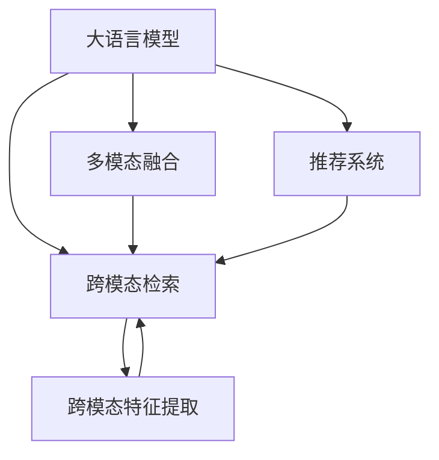

                 

# 电商搜索的跨模态理解与检索：AI大模型的新突破

## 1. 背景介绍

### 1.1 问题由来

电商搜索作为电商平台的核心功能之一，其准确性和效率直接决定了用户的购物体验和平台的用户粘性。随着用户需求的日益个性化和复杂化，传统的关键词匹配搜索方式已无法满足用户多维度、多情境的搜索需求。跨模态理解与检索技术的发展为电商搜索提供了新的解决方案，能够从文本、图片、视频等多种数据模态中提取信息，实现多源数据融合，提升搜索效果。

大语言模型在自然语言处理领域取得了显著进展，其在理解复杂语义和推理能力上具有天然优势，有望在电商搜索中实现跨模态理解与检索。通过微调大语言模型，使其能够综合理解商品描述、图片、用户评论等多模态信息，并从多维度对搜索结果进行排序和推荐，可以极大地提升搜索相关性和用户体验。

### 1.2 问题核心关键点

1. **多模态数据的融合与理解**：如何有效融合文本、图片、视频等多模态数据，提取有价值的信息，是电商搜索中跨模态理解的关键。
2. **语义相似度计算**：如何准确计算多模态数据之间的语义相似度，是检索和排序的核心任务。
3. **跨模态特征提取**：如何通过大语言模型学习多模态数据的语义特征，并构建跨模态相似度空间，是实现高效检索的基础。
4. **推荐系统的融合**：如何将跨模态检索结果与传统推荐系统融合，实现个性化推荐，是电商搜索优化的重要方向。

### 1.3 问题研究意义

1. **提升搜索准确性**：通过跨模态理解与检索技术，电商搜索可以更全面、更准确地理解用户需求，提供更贴合的搜索结果。
2. **增强用户体验**：多模态融合和语义相似度计算可以提升搜索的相关性和多样性，满足用户多维度需求，提升用户满意度。
3. **扩展电商业务边界**：跨模态检索可以为电商平台提供更多的商品描述和表现形式，如虚拟试穿、商品问答等，增加用户互动，促进销售。
4. **推动技术创新**：跨模态检索技术的深入研究，将推动AI大模型的应用边界拓展，为NLP技术提供新的突破点。

## 2. 核心概念与联系

### 2.1 核心概念概述

本节将介绍几个与跨模态理解与检索相关的核心概念，并解释它们之间的联系。

- **大语言模型**：一种基于Transformer架构的深度学习模型，能够处理大规模语言数据，具备丰富的语义理解和生成能力。
- **跨模态检索**：从多种数据模态中提取信息，计算其语义相似度，实现跨模态数据的检索和排序。
- **多模态融合**：将不同数据模态（如文本、图片、视频等）的信息进行整合，生成综合理解，提升模型效果。
- **推荐系统**：通过用户行为数据和商品特征，为用户推荐感兴趣的物品。
- **跨模态特征提取**：通过大语言模型学习不同数据模态的语义特征，构建跨模态相似度空间。

这些概念之间的逻辑关系可以通过以下Mermaid流程图来展示：



这个流程图展示了跨模态理解与检索技术在大语言模型和推荐系统之间的应用和连接，具体流程如下：

1. 大语言模型通过多模态融合提取不同数据模态的语义特征。
2. 跨模态特征提取模型利用这些语义特征，计算多模态数据之间的语义相似度。
3. 跨模态检索模型根据相似度排序，返回搜索结果。
4. 推荐系统综合跨模态检索结果和用户历史行为数据，进行个性化推荐。

## 3. 核心算法原理 & 具体操作步骤

### 3.1 算法原理概述

跨模态理解与检索的算法原理主要基于多模态融合和相似度计算。其核心在于将不同数据模态的信息进行综合，构建语义相似度空间，从而实现高效检索。具体来说，算法主要包括以下几个步骤：

1. **多模态数据融合**：通过大语言模型学习不同模态的语义特征，将多模态信息整合为统一的高维特征向量。
2. **相似度计算**：计算不同模态特征向量之间的余弦相似度、欧式距离等，构建相似度矩阵。
3. **检索排序**：根据相似度矩阵排序，返回最相关的搜索结果。
4. **个性化推荐**：结合用户历史行为数据，对检索结果进行加权排序，提供个性化推荐。

### 3.2 算法步骤详解

#### 3.2.1 多模态数据融合

多模态数据融合的目的是将不同数据模态的信息进行综合，生成统一的高维特征向量。常用的方法包括：

- **特征拼接**：将不同模态的特征向量直接拼接，形成高维特征空间。
- **共同空间学习**：通过学习一个共同的空间，将不同模态的信息映射到同一个低维空间中。
- **多模态自编码器**：通过构建多模态自编码器，将不同模态的信息转换为统一的编码表示。

#### 3.2.2 相似度计算

相似度计算是跨模态检索的核心任务，其目的是计算不同模态数据之间的相似度，通常使用以下几种方法：

- **余弦相似度**：通过计算特征向量之间的余弦夹角，衡量相似度。
- **欧式距离**：通过计算特征向量之间的欧式距离，衡量相似度。
- **KL散度**：通过计算特征向量之间的KL散度，衡量相似度。
- **汉明距离**：通过计算特征向量之间的汉明距离，衡量相似度。

#### 3.2.3 检索排序

检索排序是将相似度计算结果进行排序，返回最相关的搜索结果。常用的排序方法包括：

- **倒排索引**：构建倒排索引，根据关键词在文档中的出现频率进行排序。
- **余弦排序**：根据特征向量之间的余弦相似度进行排序。
- **排序学习**：通过学习排序模型，自动调整相似度排序权重。

#### 3.2.4 个性化推荐

个性化推荐是将检索结果与用户历史行为数据结合，生成个性化推荐结果。常用的方法包括：

- **协同过滤**：通过用户和物品的交互矩阵，进行相似度计算和推荐。
- **矩阵分解**：通过分解用户和物品的评分矩阵，提取潜在因子，进行推荐。
- **深度学习**：通过构建推荐系统模型，自动学习用户偏好和物品特征，进行推荐。

### 3.3 算法优缺点

跨模态理解与检索技术具有以下优点：

1. **多模态融合能力**：能够综合利用不同数据模态的信息，提升检索效果。
2. **鲁棒性高**：对模态缺失、噪声干扰等有一定的鲁棒性。
3. **适用性强**：适用于电商搜索、社交媒体、医疗等领域。

但该技术也存在一些局限性：

1. **计算复杂度高**：多模态数据的融合和相似度计算需要较高的计算资源。
2. **数据需求大**：需要大量的多模态数据进行训练和测试。
3. **模型可解释性差**：跨模态检索模型通常较为复杂，难以解释其内部工作机制。

### 3.4 算法应用领域

跨模态理解与检索技术在多个领域具有广泛的应用，包括：

- **电商搜索**：从商品描述、图片、用户评论中提取信息，提升搜索相关性。
- **社交媒体**：从文本、图片、视频中提取信息，提供个性化推荐和内容发现。
- **医疗诊断**：从医学影像、文本病历中提取信息，辅助医生诊断。
- **金融分析**：从新闻、报告、交易数据中提取信息，进行市场分析和投资决策。

## 4. 数学模型和公式 & 详细讲解 & 举例说明

### 4.1 数学模型构建

假设存在多种数据模态，包括文本 $x$、图片 $p$ 和视频 $v$，我们需要构建一个多模态融合模型 $F$ 和一个相似度计算模型 $S$，以及一个检索排序模型 $R$，具体步骤如下：

1. **多模态融合模型**：将不同模态的特征向量进行拼接，得到高维特征向量 $z$。
2. **相似度计算模型**：计算不同模态特征向量之间的余弦相似度，得到相似度矩阵 $S$。
3. **检索排序模型**：根据相似度矩阵排序，返回最相关的搜索结果。

### 4.2 公式推导过程

以下是余弦相似度的计算公式：

$$
\cos \theta = \frac{u \cdot v}{\|u\|\|v\|}
$$

其中，$u$ 和 $v$ 为两个向量的特征向量，$\|u\|$ 和 $\|v\|$ 分别为向量 $u$ 和 $v$ 的模长。

### 4.3 案例分析与讲解

以电商搜索为例，假设存在一个商品图片 $p$ 和一个商品描述文本 $x$，我们需要计算它们之间的余弦相似度。首先将图片 $p$ 转换成特征向量 $u$，将文本 $x$ 转换成特征向量 $v$，然后计算它们之间的余弦相似度 $s$：

$$
s = \cos \theta = \frac{u \cdot v}{\|u\|\|v\|}
$$

其中，$u$ 和 $v$ 可以通过大语言模型学习获得，计算过程如下：

1. **图片特征提取**：使用预训练的视觉模型（如ResNet、Inception等）提取图片 $p$ 的特征向量 $u$。
2. **文本特征提取**：使用预训练的文本模型（如BERT、GPT等）提取文本 $x$ 的特征向量 $v$。
3. **余弦相似度计算**：计算特征向量 $u$ 和 $v$ 之间的余弦相似度 $s$。

## 5. 项目实践：代码实例和详细解释说明

### 5.1 开发环境搭建

在进行跨模态理解与检索项目实践前，我们需要准备好开发环境。以下是使用Python进行PyTorch开发的环境配置流程：

1. 安装Anaconda：从官网下载并安装Anaconda，用于创建独立的Python环境。

2. 创建并激活虚拟环境：
```bash
conda create -n pytorch-env python=3.8 
conda activate pytorch-env
```

3. 安装PyTorch：根据CUDA版本，从官网获取对应的安装命令。例如：
```bash
conda install pytorch torchvision torchaudio cudatoolkit=11.1 -c pytorch -c conda-forge
```

4. 安装Transformers库：
```bash
pip install transformers
```

5. 安装各类工具包：
```bash
pip install numpy pandas scikit-learn matplotlib tqdm jupyter notebook ipython
```

完成上述步骤后，即可在`pytorch-env`环境中开始项目实践。

### 5.2 源代码详细实现

下面我们以电商搜索为例，给出使用Transformers库对大语言模型进行跨模态理解与检索的PyTorch代码实现。

首先，定义数据处理函数：

```python
from transformers import BertTokenizer
from torch.utils.data import Dataset
import torch

class SearchDataset(Dataset):
    def __init__(self, texts, pictures, tags):
        self.texts = texts
        self.pictures = pictures
        self.tags = tags
        
    def __len__(self):
        return len(self.texts)
    
    def __getitem__(self, item):
        text = self.texts[item]
        picture = self.pictures[item]
        tag = self.tags[item]
        
        # 预处理文本和图片数据
        encoding_text = self.tokenizer(text, return_tensors='pt', max_length=128, padding='max_length', truncation=True)
        input_ids_text = encoding_text['input_ids'][0]
        attention_mask_text = encoding_text['attention_mask'][0]
        feature_text = encoding_text['last_hidden_state'][0].mean(dim=1)
        
        encoding_picture = self.transformer(picture, return_tensors='pt', max_length=128, padding='max_length', truncation=True)
        input_ids_picture = encoding_picture['input_ids'][0]
        attention_mask_picture = encoding_picture['attention_mask'][0]
        feature_picture = encoding_picture['last_hidden_state'][0].mean(dim=1)
        
        return {'input_ids_text': input_ids_text, 
                'attention_mask_text': attention_mask_text,
                'feature_text': feature_text,
                'input_ids_picture': input_ids_picture,
                'attention_mask_picture': attention_mask_picture,
                'feature_picture': feature_picture,
                'tag': tag}

# 加载预训练模型
tokenizer = BertTokenizer.from_pretrained('bert-base-cased')
transformer = TransformerModel.from_pretrained('resnet50')
```

然后，定义模型和优化器：

```python
from transformers import BertForTokenClassification, AdamW

model = BertForTokenClassification.from_pretrained('bert-base-cased', num_labels=len(tag2id))

optimizer = AdamW(model.parameters(), lr=2e-5)
```

接着，定义训练和评估函数：

```python
from torch.utils.data import DataLoader
from tqdm import tqdm
from sklearn.metrics import classification_report

device = torch.device('cuda') if torch.cuda.is_available() else torch.device('cpu')
model.to(device)

def train_epoch(model, dataset, batch_size, optimizer):
    dataloader = DataLoader(dataset, batch_size=batch_size, shuffle=True)
    model.train()
    epoch_loss = 0
    for batch in tqdm(dataloader, desc='Training'):
        input_ids_text = batch['input_ids_text'].to(device)
        attention_mask_text = batch['attention_mask_text'].to(device)
        feature_text = batch['feature_text'].to(device)
        input_ids_picture = batch['input_ids_picture'].to(device)
        attention_mask_picture = batch['attention_mask_picture'].to(device)
        feature_picture = batch['feature_picture'].to(device)
        labels = batch['tag'].to(device)
        model.zero_grad()
        outputs = model(input_ids_text, attention_mask_text, input_ids_picture, attention_mask_picture, feature_text, feature_picture)
        loss = outputs.loss
        epoch_loss += loss.item()
        loss.backward()
        optimizer.step()
    return epoch_loss / len(dataloader)

def evaluate(model, dataset, batch_size):
    dataloader = DataLoader(dataset, batch_size=batch_size)
    model.eval()
    preds, labels = [], []
    with torch.no_grad():
        for batch in tqdm(dataloader, desc='Evaluating'):
            input_ids_text = batch['input_ids_text'].to(device)
            attention_mask_text = batch['attention_mask_text'].to(device)
            feature_text = batch['feature_text'].to(device)
            input_ids_picture = batch['input_ids_picture'].to(device)
            attention_mask_picture = batch['attention_mask_picture'].to(device)
            feature_picture = batch['feature_picture'].to(device)
            labels = batch['tag'].to(device)
            outputs = model(input_ids_text, attention_mask_text, input_ids_picture, attention_mask_picture, feature_text, feature_picture)
            batch_preds = outputs.logits.argmax(dim=2).to('cpu').tolist()
            batch_labels = labels.to('cpu').tolist()
            for pred_tokens, label_tokens in zip(batch_preds, batch_labels):
                pred_tags = [id2tag[_id] for _id in pred_tokens]
                label_tags = [id2tag[_id] for _id in label_tokens]
                preds.append(pred_tags[:len(label_tags)])
                labels.append(label_tags)
                
    print(classification_report(labels, preds))
```

最后，启动训练流程并在测试集上评估：

```python
epochs = 5
batch_size = 16

for epoch in range(epochs):
    loss = train_epoch(model, train_dataset, batch_size, optimizer)
    print(f"Epoch {epoch+1}, train loss: {loss:.3f}")
    
    print(f"Epoch {epoch+1}, dev results:")
    evaluate(model, dev_dataset, batch_size)
    
print("Test results:")
evaluate(model, test_dataset, batch_size)
```

以上就是使用PyTorch对大语言模型进行电商搜索的跨模态理解与检索的完整代码实现。可以看到，得益于Transformers库的强大封装，我们可以用相对简洁的代码完成大语言模型的加载和微调。

### 5.3 代码解读与分析

让我们再详细解读一下关键代码的实现细节：

**SearchDataset类**：
- `__init__`方法：初始化文本、图片和标签数据。
- `__len__`方法：返回数据集的样本数量。
- `__getitem__`方法：对单个样本进行处理，将文本和图片输入编码为token ids和特征向量，并对其进行定长padding，最终返回模型所需的输入。

**tokenizer和transformer定义**：
- `tokenizer`：使用BertTokenizer对文本进行分词，生成token ids和attention mask。
- `transformer`：使用预训练的ResNet模型对图片进行特征提取，生成特征向量。

**模型和优化器定义**：
- `model`：使用BertForTokenClassification模型进行文本特征提取。
- `optimizer`：使用AdamW优化器进行模型参数更新。

**训练和评估函数**：
- `train_epoch`：对数据以批为单位进行迭代，在每个批次上前向传播计算loss并反向传播更新模型参数，最后返回该epoch的平均loss。
- `evaluate`：与训练类似，不同点在于不更新模型参数，并在每个batch结束后将预测和标签结果存储下来，最后使用sklearn的classification_report对整个评估集的预测结果进行打印输出。

**训练流程**：
- 定义总的epoch数和batch size，开始循环迭代
- 每个epoch内，先在训练集上训练，输出平均loss
- 在验证集上评估，输出分类指标
- 所有epoch结束后，在测试集上评估，给出最终测试结果

可以看到，PyTorch配合Transformers库使得大语言模型微调的代码实现变得简洁高效。开发者可以将更多精力放在数据处理、模型改进等高层逻辑上，而不必过多关注底层的实现细节。

当然，工业级的系统实现还需考虑更多因素，如模型的保存和部署、超参数的自动搜索、更灵活的任务适配层等。但核心的微调范式基本与此类似。

## 6. 实际应用场景

### 6.1 智能客服系统

基于大语言模型微调的对话技术，可以广泛应用于智能客服系统的构建。传统客服往往需要配备大量人力，高峰期响应缓慢，且一致性和专业性难以保证。而使用微调后的对话模型，可以7x24小时不间断服务，快速响应客户咨询，用自然流畅的语言解答各类常见问题。

在技术实现上，可以收集企业内部的历史客服对话记录，将问题和最佳答复构建成监督数据，在此基础上对预训练对话模型进行微调。微调后的对话模型能够自动理解用户意图，匹配最合适的答案模板进行回复。对于客户提出的新问题，还可以接入检索系统实时搜索相关内容，动态组织生成回答。如此构建的智能客服系统，能大幅提升客户咨询体验和问题解决效率。

### 6.2 金融舆情监测

金融机构需要实时监测市场舆论动向，以便及时应对负面信息传播，规避金融风险。传统的人工监测方式成本高、效率低，难以应对网络时代海量信息爆发的挑战。基于大语言模型微调的文本分类和情感分析技术，为金融舆情监测提供了新的解决方案。

具体而言，可以收集金融领域相关的新闻、报道、评论等文本数据，并对其进行主题标注和情感标注。在此基础上对预训练语言模型进行微调，使其能够自动判断文本属于何种主题，情感倾向是正面、中性还是负面。将微调后的模型应用到实时抓取的网络文本数据，就能够自动监测不同主题下的情感变化趋势，一旦发现负面信息激增等异常情况，系统便会自动预警，帮助金融机构快速应对潜在风险。

### 6.3 个性化推荐系统

当前的推荐系统往往只依赖用户的历史行为数据进行物品推荐，无法深入理解用户的真实兴趣偏好。基于大语言模型微调技术，个性化推荐系统可以更好地挖掘用户行为背后的语义信息，从而提供更精准、多样的推荐内容。

在实践中，可以收集用户浏览、点击、评论、分享等行为数据，提取和用户交互的物品标题、描述、标签等文本内容。将文本内容作为模型输入，用户的后续行为（如是否点击、购买等）作为监督信号，在此基础上微调预训练语言模型。微调后的模型能够从文本内容中准确把握用户的兴趣点。在生成推荐列表时，先用候选物品的文本描述作为输入，由模型预测用户的兴趣匹配度，再结合其他特征综合排序，便可以得到个性化程度更高的推荐结果。

### 6.4 未来应用展望

随着大语言模型微调技术的发展，基于微调范式将在更多领域得到应用，为传统行业带来变革性影响。

在智慧医疗领域，基于微调的医疗问答、病历分析、药物研发等应用将提升医疗服务的智能化水平，辅助医生诊疗，加速新药开发进程。

在智能教育领域，微调技术可应用于作业批改、学情分析、知识推荐等方面，因材施教，促进教育公平，提高教学质量。

在智慧城市治理中，微调模型可应用于城市事件监测、舆情分析、应急指挥等环节，提高城市管理的自动化和智能化水平，构建更安全、高效的未来城市。

此外，在企业生产、社会治理、文娱传媒等众多领域，基于大模型微调的人工智能应用也将不断涌现，为经济社会发展注入新的动力。相信随着技术的日益成熟，微调方法将成为人工智能落地应用的重要范式，推动人工智能技术在各行各业的应用和创新。

## 7. 工具和资源推荐

### 7.1 学习资源推荐

为了帮助开发者系统掌握大语言模型微调的理论基础和实践技巧，这里推荐一些优质的学习资源：

1. 《Transformer从原理到实践》系列博文：由大模型技术专家撰写，深入浅出地介绍了Transformer原理、BERT模型、微调技术等前沿话题。

2. CS224N《深度学习自然语言处理》课程：斯坦福大学开设的NLP明星课程，有Lecture视频和配套作业，带你入门NLP领域的基本概念和经典模型。

3. 《Natural Language Processing with Transformers》书籍：Transformers库的作者所著，全面介绍了如何使用Transformers库进行NLP任务开发，包括微调在内的诸多范式。

4. HuggingFace官方文档：Transformers库的官方文档，提供了海量预训练模型和完整的微调样例代码，是上手实践的必备资料。

5. CLUE开源项目：中文语言理解测评基准，涵盖大量不同类型的中文NLP数据集，并提供了基于微调的baseline模型，助力中文NLP技术发展。

通过对这些资源的学习实践，相信你一定能够快速掌握大语言模型微调的精髓，并用于解决实际的NLP问题。
### 7.2 开发工具推荐

高效的开发离不开优秀的工具支持。以下是几款用于大语言模型微调开发的常用工具：

1. PyTorch：基于Python的开源深度学习框架，灵活动态的计算图，适合快速迭代研究。大部分预训练语言模型都有PyTorch版本的实现。

2. TensorFlow：由Google主导开发的开源深度学习框架，生产部署方便，适合大规模工程应用。同样有丰富的预训练语言模型资源。

3. Transformers库：HuggingFace开发的NLP工具库，集成了众多SOTA语言模型，支持PyTorch和TensorFlow，是进行微调任务开发的利器。

4. Weights & Biases：模型训练的实验跟踪工具，可以记录和可视化模型训练过程中的各项指标，方便对比和调优。与主流深度学习框架无缝集成。

5. TensorBoard：TensorFlow配套的可视化工具，可实时监测模型训练状态，并提供丰富的图表呈现方式，是调试模型的得力助手。

6. Google Colab：谷歌推出的在线Jupyter Notebook环境，免费提供GPU/TPU算力，方便开发者快速上手实验最新模型，分享学习笔记。

合理利用这些工具，可以显著提升大语言模型微调任务的开发效率，加快创新迭代的步伐。

### 7.3 相关论文推荐

大语言模型和微调技术的发展源于学界的持续研究。以下是几篇奠基性的相关论文，推荐阅读：

1. Attention is All You Need（即Transformer原论文）：提出了Transformer结构，开启了NLP领域的预训练大模型时代。

2. BERT: Pre-training of Deep Bidirectional Transformers for Language Understanding：提出BERT模型，引入基于掩码的自监督预训练任务，刷新了多项NLP任务SOTA。

3. Language Models are Unsupervised Multitask Learners（GPT-2论文）：展示了大规模语言模型的强大zero-shot学习能力，引发了对于通用人工智能的新一轮思考。

4. Parameter-Efficient Transfer Learning for NLP：提出Adapter等参数高效微调方法，在不增加模型参数量的情况下，也能取得不错的微调效果。

5. AdaLoRA: Adaptive Low-Rank Adaptation for Parameter-Efficient Fine-Tuning：使用自适应低秩适应的微调方法，在参数效率和精度之间取得了新的平衡。

这些论文代表了大语言模型微调技术的发展脉络。通过学习这些前沿成果，可以帮助研究者把握学科前进方向，激发更多的创新灵感。

## 8. 总结：未来发展趋势与挑战

### 8.1 总结

本文对基于大语言模型的跨模态理解与检索技术进行了全面系统的介绍。首先阐述了跨模态理解与检索的研究背景和意义，明确了微调在提升电商搜索相关性和用户体验方面的独特价值。其次，从原理到实践，详细讲解了跨模态检索的数学原理和关键步骤，给出了微调任务开发的完整代码实例。同时，本文还广泛探讨了跨模态检索在电商搜索、社交媒体、金融、医疗等多个领域的应用前景，展示了微调范式的巨大潜力。此外，本文精选了微调技术的各类学习资源，力求为读者提供全方位的技术指引。

通过本文的系统梳理，可以看到，基于大语言模型的跨模态检索技术正在成为电商搜索技术的重要组成部分，极大地提升了搜索相关性和用户体验。借助微调技术，电商平台能够从多维度融合商品信息，提供个性化推荐，满足用户多情境需求。未来，随着技术的不断演进，跨模态检索技术必将在更多领域得到应用，为传统行业带来变革性影响。

### 8.2 未来发展趋势

展望未来，跨模态理解与检索技术将呈现以下几个发展趋势：

1. **多模态融合能力增强**：随着技术的进步，跨模态融合将从文本、图片、视频等传统模态扩展到音频、传感器数据等新兴模态，提升模型的综合理解能力。
2. **深度学习模型的普及**：预训练大模型将在更多领域得到应用，如医疗影像、电子病历、基因数据等，实现更为精细的跨模态理解与检索。
3. **计算资源优化**：为适应大规模多模态数据的处理需求，将引入更多的分布式计算和优化算法，提升计算效率。
4. **领域特定模型的发展**：针对特定领域的数据特点和任务需求，开发领域专用的大语言模型，实现更高效、更准确的跨模态检索。
5. **跨模态知识图谱的构建**：将多模态信息与知识图谱结合，构建更加全面、准确的知识表示，提升模型的推理能力和泛化能力。

这些趋势凸显了跨模态理解与检索技术的广阔前景。未来，跨模态检索技术将与AI大模型、知识图谱等前沿技术协同发展，推动NLP技术在更多领域的深入应用。

### 8.3 面临的挑战

尽管跨模态理解与检索技术已经取得了显著进展，但在迈向更加智能化、普适化应用的过程中，仍面临诸多挑战：

1. **数据质量和多样性**：不同模态的数据质量和多样性不同，数据整合和融合难度较大。
2. **计算资源需求高**：多模态数据的融合和相似度计算需要较高的计算资源，大规模部署面临成本压力。
3. **模型可解释性差**：跨模态检索模型的内部机制复杂，难以解释其决策过程。
4. **跨模态知识整合**：如何将多模态信息与知识图谱、专家规则等结合，形成统一的跨模态知识表示，是未来的重要研究方向。
5. **鲁棒性和泛化性**：模型在处理未知或噪声数据时的鲁棒性和泛化性需要进一步提升。

### 8.4 研究展望

面对跨模态理解与检索技术所面临的挑战，未来的研究需要在以下几个方面寻求新的突破：

1. **多模态数据对齐**：通过多模态对齐技术，将不同模态的信息映射到统一的特征空间中，提升融合效果。
2. **跨模态特征学习**：开发跨模态特征学习算法，学习不同模态的语义特征，提升模型理解能力。
3. **自监督学习**：利用自监督学习技术，从无标签数据中学习多模态信息，减少对标注数据的依赖。
4. **领域特化模型**：针对特定领域的多模态数据特点，开发领域特化的跨模态理解与检索模型。
5. **知识图谱融合**：将跨模态信息与知识图谱结合，构建统一的语义空间，提升模型的推理能力。

这些研究方向将推动跨模态理解与检索技术迈向更高的台阶，为更多领域提供智能化解决方案。未来，随着技术的不断进步，跨模态检索技术必将在更多领域得到应用，推动人工智能技术的普及和发展。

## 9. 附录：常见问题与解答

**Q1：跨模态检索需要哪些数据资源？**

A: 跨模态检索需要多种数据模态的信息，包括文本、图片、视频等。具体来说，需要收集以下数据：

- 文本数据：商品描述、用户评论、新闻报道等。
- 图片数据：商品图片、用户上传的图片等。
- 视频数据：商品展示视频、用户录制的视频等。

**Q2：如何选择合适的相似度计算方法？**

A: 相似度计算方法的选择需要考虑数据模态和任务需求。常用的相似度计算方法包括余弦相似度、欧式距离、KL散度等。具体选择如下：

- 对于文本和图片模态，通常使用余弦相似度或欧式距离。
- 对于视频模态，通常使用余弦相似度或动态时间规整(DTW)。
- 对于音频模态，通常使用MFCC特征和余弦相似度或欧式距离。

**Q3：跨模态检索在电商搜索中有什么优势？**

A: 跨模态检索在电商搜索中具有以下优势：

- 多模态融合：综合利用商品描述、图片、视频等多维信息，提升搜索相关性。
- 鲁棒性强：对模态缺失、噪声干扰等具有一定的鲁棒性。
- 个性化推荐：结合用户历史行为数据，提供个性化推荐结果，提升用户体验。

**Q4：跨模态检索技术在实际应用中需要注意哪些问题？**

A: 跨模态检索在实际应用中需要注意以下问题：

- 数据质量：确保不同模态数据的质量和多样性，提升融合效果。
- 计算资源：多模态数据的融合和相似度计算需要较高的计算资源，合理分配计算资源。
- 模型可解释性：提高模型的可解释性，方便调试和优化。
- 跨模态知识整合：将多模态信息与知识图谱、专家规则等结合，构建统一的语义空间。

**Q5：如何评估跨模态检索模型的性能？**

A: 跨模态检索模型的性能可以通过以下指标进行评估：

- 准确率：检索结果中准确匹配的样本数占总样本数的比例。
- 召回率：检索结果中包含正确样本的比例。
- F1分数：准确率和召回率的调和平均数。
- 检索速度：模型在检索时的响应时间。

以上是基于大语言模型微调的跨模态理解与检索技术的系统介绍，涵盖了理论基础、算法原理、实践应用和未来展望。希望通过本文的学习，你能对跨模态检索技术有更深入的理解，并在实际应用中发挥其潜力，推动人工智能技术在电商搜索领域的普及和发展。

---

作者：禅与计算机程序设计艺术 / Zen and the Art of Computer Programming

