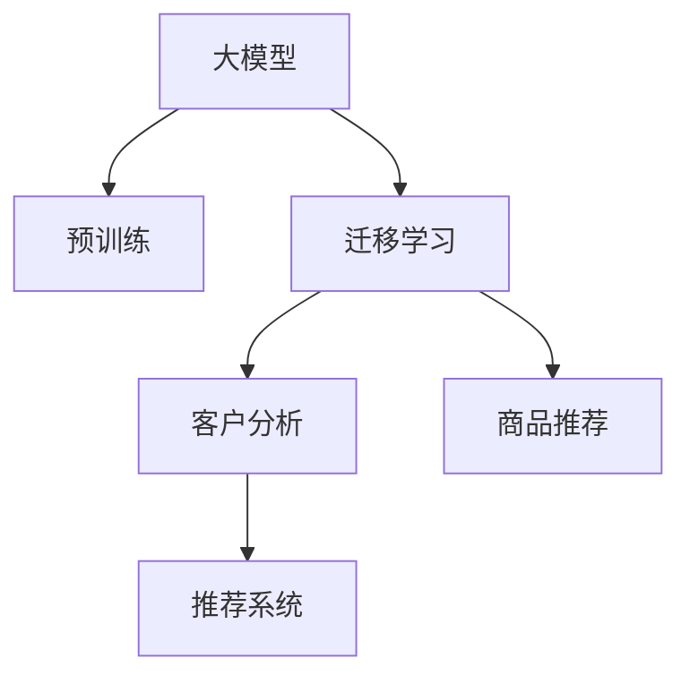

                 

# 电商行业中的迁移学习：大模型的实践与挑战

> 关键词：大模型,迁移学习,电商,客户分析,推荐系统,深度学习

## 1. 背景介绍

### 1.1 问题由来
电商行业是现代经济中不可或缺的一部分，通过互联网连接供需双方，实现了商品流通的数字化和智能化。电商平台通过数据驱动的运营策略，可以精准分析用户行为，进行个性化推荐，提升用户体验和平台转化率。然而，数据的质量和数量往往决定了电商平台的业务表现。如何更高效地利用数据，提升数据分析能力，成为电商平台关注的焦点。

近年来，随着深度学习技术的不断发展，预训练模型（Pre-trained Models）和迁移学习（Transfer Learning）方法在电商领域得到了广泛应用。预训练模型如BERT、GPT等，通过大规模无标签文本数据的自监督预训练，学习到丰富的语言表示，被广泛应用于自然语言处理任务中。迁移学习则利用预训练模型的通用知识，通过在小规模标注数据上的微调，使模型能够适应特定电商任务，如客户分析、商品推荐等。

### 1.2 问题核心关键点
当前，迁移学习在电商行业的应用主要包括两个方面：

1. **客户分析**：通过分析用户评论、搜索记录、购买历史等文本数据，建立用户画像，理解用户的偏好和需求。
2. **商品推荐**：利用用户行为数据和商品描述信息，构建推荐模型，为每个用户推荐符合其兴趣的商品。

迁移学习通过微调预训练模型，能够在有限的标注数据下，快速获得高性能的客户分析和商品推荐模型，减少从头训练模型所需的时间和数据成本，同时也提高了模型的泛化能力。

## 2. 核心概念与联系

### 2.1 核心概念概述

为更好地理解电商行业中的迁移学习应用，本节将介绍几个密切相关的核心概念：

- **大模型**：指通过大规模无标签数据自监督预训练得到的高性能模型，如BERT、GPT等。
- **迁移学习**：指将一个领域学习到的知识，迁移到另一个不同但相关的领域，以提高新任务的性能。
- **微调**：指在预训练模型的基础上，使用特定任务的数据进行有监督学习，优化模型在特定任务上的性能。
- **客户分析**：利用用户行为数据，对用户进行分群和画像构建，理解用户需求和行为特征。
- **商品推荐**：利用用户和商品信息，构建推荐模型，预测用户可能感兴趣的商品，提升用户体验和购买转化率。
- **推荐系统**：通过客户分析和商品推荐，实现个性化推荐，提升电商平台的业务表现。

这些核心概念之间的逻辑关系可以通过以下Mermaid流程图来展示：



这个流程图展示了大模型在客户分析和商品推荐中的应用过程：

1. 大模型通过预训练获得基础能力。
2. 迁移学习通过微调，使模型适应特定任务。
3. 客户分析使用微调后的模型进行用户画像构建。
4. 商品推荐使用微调后的模型进行个性化推荐。
5. 推荐系统通过客户分析和商品推荐进行推荐。

## 3. 核心算法原理 & 具体操作步骤

### 3.1 算法原理概述

迁移学习在电商行业的应用，本质上是一个有监督的微调过程。其核心思想是：将预训练的大模型视作一个强大的"特征提取器"，通过在电商领域的数据上进行有监督学习，优化模型在特定电商任务上的性能。

形式化地，假设预训练模型为 $M_{\theta}$，其中 $\theta$ 为预训练得到的模型参数。给定电商任务的标注数据集 $D=\{(x_i, y_i)\}_{i=1}^N$，迁移学习的优化目标是最小化经验风险，即找到最优参数：

$$
\theta^* = \mathop{\arg\min}_{\theta} \mathcal{L}(M_{\theta},D)
$$

其中 $\mathcal{L}$ 为针对任务 $T$ 设计的损失函数，用于衡量模型预测输出与真实标签之间的差异。常见的损失函数包括交叉熵损失、均方误差损失等。

通过梯度下降等优化算法，迁移过程不断更新模型参数 $\theta$，最小化损失函数 $\mathcal{L}$，使得模型输出逼近真实标签。由于 $\theta$ 已经通过预训练获得了较好的初始化，因此即便在小规模数据集 $D$ 上进行迁移，也能较快收敛到理想的模型参数 $\hat{\theta}$。

### 3.2 算法步骤详解

基于迁移学习的电商客户分析和商品推荐应用，一般包括以下几个关键步骤：

**Step 1: 准备预训练模型和数据集**
- 选择合适的预训练语言模型 $M_{\theta}$ 作为初始化参数，如 BERT、GPT等。
- 准备电商任务的标注数据集 $D$，划分为训练集、验证集和测试集。一般要求标注数据与预训练数据的分布不要差异过大。

**Step 2: 添加任务适配层**
- 根据任务类型，在预训练模型顶层设计合适的输出层和损失函数。
- 对于分类任务，通常在顶层添加线性分类器和交叉熵损失函数。
- 对于生成任务，通常使用语言模型的解码器输出概率分布，并以负对数似然为损失函数。

**Step 3: 设置迁移超参数**
- 选择合适的优化算法及其参数，如 AdamW、SGD 等，设置学习率、批大小、迭代轮数等。
- 设置正则化技术及强度，包括权重衰减、Dropout、Early Stopping等。
- 确定冻结预训练参数的策略，如仅迁移顶层，或全部参数都参与迁移。

**Step 4: 执行梯度训练**
- 将训练集数据分批次输入模型，前向传播计算损失函数。
- 反向传播计算参数梯度，根据设定的优化算法和学习率更新模型参数。
- 周期性在验证集上评估模型性能，根据性能指标决定是否触发 Early Stopping。
- 重复上述步骤直到满足预设的迭代轮数或 Early Stopping 条件。

**Step 5: 测试和部署**
- 在测试集上评估迁移后模型 $M_{\hat{\theta}}$ 的性能，对比迁移前后的精度提升。
- 使用迁移后的模型对新样本进行推理预测，集成到实际的应用系统中。
- 持续收集新的数据，定期重新迁移模型，以适应数据分布的变化。

以上是迁移学习在电商行业的应用流程。在实际应用中，还需要针对具体任务的特点，对迁移过程的各个环节进行优化设计，如改进训练目标函数，引入更多的正则化技术，搜索最优的超参数组合等，以进一步提升模型性能。

### 3.3 算法优缺点

迁移学习在电商行业的应用具有以下优点：
1. 简单高效。只需准备少量标注数据，即可对预训练模型进行快速适配，获得较大的性能提升。
2. 通用适用。适用于各种电商任务，包括客户画像、商品推荐等，设计简单的任务适配层即可实现迁移。
3. 参数高效。利用迁移学习技术，在固定大部分预训练参数的情况下，仍可取得不错的迁移效果。
4. 效果显著。在学术界和工业界的诸多任务上，迁移学习已经刷新了最先进的性能指标。

同时，该方法也存在一定的局限性：
1. 依赖标注数据。迁移的效果很大程度上取决于标注数据的质量和数量，获取高质量标注数据的成本较高。
2. 迁移能力有限。当目标任务与预训练数据的分布差异较大时，迁移的性能提升有限。
3. 模型鲁棒性不足。电商客户和商品数据可能存在噪音和偏见，迁移的模型在数据分布变化时容易发生偏差。
4. 可解释性不足。迁移学习的过程和结果缺乏可解释性，难以对其推理逻辑进行分析和调试。

尽管存在这些局限性，但就目前而言，迁移学习仍是电商行业最为常用的技术手段。未来相关研究的重点在于如何进一步降低迁移对标注数据的依赖，提高模型的少样本学习和跨领域迁移能力，同时兼顾可解释性和伦理安全性等因素。

### 3.4 算法应用领域

迁移学习在电商行业的应用已经得到了广泛的应用，涵盖了几乎所有常见的电商任务，例如：

- **客户画像分析**：通过分析用户评论、搜索记录、购买历史等文本数据，建立用户画像，理解用户的偏好和需求。
- **商品推荐系统**：利用用户行为数据和商品描述信息，构建推荐模型，为每个用户推荐符合其兴趣的商品。
- **购物行为预测**：预测用户的购买行为，帮助电商平台进行精准营销和库存管理。
- **广告投放优化**：分析用户行为数据，优化广告投放策略，提高广告投放的转化率和ROI。
- **商品质量评价**：通过用户评论和评分，分析商品质量，帮助电商平台筛选优质商品。

除了上述这些经典任务外，迁移学习还被创新性地应用到更多场景中，如可控推荐、异常检测等，为电商技术带来了全新的突破。随着迁移学习方法的不断进步，相信其在电商领域的应用还将不断深化，为电商技术的创新和发展提供新的动力。

## 4. 数学模型和公式 & 详细讲解  
### 4.1 数学模型构建

本节将使用数学语言对基于迁移学习的电商客户分析和商品推荐过程进行更加严格的刻画。

记预训练语言模型为 $M_{\theta}$，其中 $\theta$ 为模型参数。假设迁移任务的训练集为 $D=\{(x_i, y_i)\}_{i=1}^N, x_i \in \mathcal{X}, y_i \in \mathcal{Y}$。

定义模型 $M_{\theta}$ 在输入 $x$ 上的输出为 $\hat{y}=M_{\theta}(x)$，表示模型对 $x$ 的预测。迁移学习的目标是最小化模型预测与真实标签之间的差距，即最小化经验风险：

$$
\mathcal{L}(\theta) = \frac{1}{N}\sum_{i=1}^N \ell(M_{\theta}(x_i),y_i)
$$

其中 $\ell$ 为迁移任务定义的损失函数。对于分类任务，常用的损失函数包括交叉熵损失（Cross-Entropy Loss）：

$$
\ell(M_{\theta}(x_i),y_i) = -y_i\log M_{\theta}(x_i) - (1-y_i)\log(1-M_{\theta}(x_i))
$$

对于生成任务，常用的损失函数包括负对数似然（Negative Log-Likelihood, NLL）：

$$
\ell(M_{\theta}(x_i),y_i) = -\log M_{\theta}(y_i)
$$

在得到损失函数后，可以通过梯度下降等优化算法，最小化经验风险，得到最优参数：

$$
\theta^* = \mathop{\arg\min}_{\theta} \mathcal{L}(\theta)
$$

## 5. 项目实践：代码实例和详细解释说明
### 5.1 开发环境搭建

在进行迁移学习实践前，我们需要准备好开发环境。以下是使用Python进行PyTorch开发的环境配置流程：

1. 安装Anaconda：从官网下载并安装Anaconda，用于创建独立的Python环境。

2. 创建并激活虚拟环境：
```bash
conda create -n pytorch-env python=3.8 
conda activate pytorch-env
```

3. 安装PyTorch：根据CUDA版本，从官网获取对应的安装命令。例如：
```bash
conda install pytorch torchvision torchaudio cudatoolkit=11.1 -c pytorch -c conda-forge
```

4. 安装Transformers库：
```bash
pip install transformers
```

5. 安装各类工具包：
```bash
pip install numpy pandas scikit-learn matplotlib tqdm jupyter notebook ipython
```

完成上述步骤后，即可在`pytorch-env`环境中开始迁移学习实践。

### 5.2 源代码详细实现

这里我们以基于BERT的电商客户画像分析为例，给出使用Transformers库进行迁移学习的PyTorch代码实现。

首先，定义客户画像分析任务的数据处理函数：

```python
from transformers import BertTokenizer
from torch.utils.data import Dataset
import torch

class CustomerAnalysisDataset(Dataset):
    def __init__(self, texts, tags, tokenizer, max_len=128):
        self.texts = texts
        self.tags = tags
        self.tokenizer = tokenizer
        self.max_len = max_len
        
    def __len__(self):
        return len(self.texts)
    
    def __getitem__(self, item):
        text = self.texts[item]
        tags = self.tags[item]
        
        encoding = self.tokenizer(text, return_tensors='pt', max_length=self.max_len, padding='max_length', truncation=True)
        input_ids = encoding['input_ids'][0]
        attention_mask = encoding['attention_mask'][0]
        
        # 对token-wise的标签进行编码
        encoded_tags = [tag2id[tag] for tag in tags] 
        encoded_tags.extend([tag2id['O']] * (self.max_len - len(encoded_tags)))
        labels = torch.tensor(encoded_tags, dtype=torch.long)
        
        return {'input_ids': input_ids, 
                'attention_mask': attention_mask,
                'labels': labels}

# 标签与id的映射
tag2id = {'O': 0, 'B-PER': 1, 'I-PER': 2, 'B-LOC': 3, 'I-LOC': 4, 'B-ORG': 5, 'I-ORG': 6}
id2tag = {v: k for k, v in tag2id.items()}

# 创建dataset
tokenizer = BertTokenizer.from_pretrained('bert-base-cased')

train_dataset = CustomerAnalysisDataset(train_texts, train_tags, tokenizer)
dev_dataset = CustomerAnalysisDataset(dev_texts, dev_tags, tokenizer)
test_dataset = CustomerAnalysisDataset(test_texts, test_tags, tokenizer)
```

然后，定义模型和优化器：

```python
from transformers import BertForTokenClassification, AdamW

model = BertForTokenClassification.from_pretrained('bert-base-cased', num_labels=len(tag2id))

optimizer = AdamW(model.parameters(), lr=2e-5)
```

接着，定义训练和评估函数：

```python
from torch.utils.data import DataLoader
from tqdm import tqdm
from sklearn.metrics import classification_report

device = torch.device('cuda') if torch.cuda.is_available() else torch.device('cpu')
model.to(device)

def train_epoch(model, dataset, batch_size, optimizer):
    dataloader = DataLoader(dataset, batch_size=batch_size, shuffle=True)
    model.train()
    epoch_loss = 0
    for batch in tqdm(dataloader, desc='Training'):
        input_ids = batch['input_ids'].to(device)
        attention_mask = batch['attention_mask'].to(device)
        labels = batch['labels'].to(device)
        model.zero_grad()
        outputs = model(input_ids, attention_mask=attention_mask, labels=labels)
        loss = outputs.loss
        epoch_loss += loss.item()
        loss.backward()
        optimizer.step()
    return epoch_loss / len(dataloader)

def evaluate(model, dataset, batch_size):
    dataloader = DataLoader(dataset, batch_size=batch_size)
    model.eval()
    preds, labels = [], []
    with torch.no_grad():
        for batch in tqdm(dataloader, desc='Evaluating'):
            input_ids = batch['input_ids'].to(device)
            attention_mask = batch['attention_mask'].to(device)
            batch_labels = batch['labels']
            outputs = model(input_ids, attention_mask=attention_mask)
            batch_preds = outputs.logits.argmax(dim=2).to('cpu').tolist()
            batch_labels = batch_labels.to('cpu').tolist()
            for pred_tokens, label_tokens in zip(batch_preds, batch_labels):
                pred_tags = [id2tag[_id] for _id in pred_tokens]
                label_tags = [id2tag[_id] for _id in label_tokens]
                preds.append(pred_tags[:len(label_tags)])
                labels.append(label_tags)
                
    print(classification_report(labels, preds))
```

最后，启动迁移流程并在测试集上评估：

```python
epochs = 5
batch_size = 16

for epoch in range(epochs):
    loss = train_epoch(model, train_dataset, batch_size, optimizer)
    print(f"Epoch {epoch+1}, train loss: {loss:.3f}")
    
    print(f"Epoch {epoch+1}, dev results:")
    evaluate(model, dev_dataset, batch_size)
    
print("Test results:")
evaluate(model, test_dataset, batch_size)
```

以上就是使用PyTorch对BERT进行客户画像分析的迁移学习的完整代码实现。可以看到，得益于Transformers库的强大封装，我们可以用相对简洁的代码完成BERT模型的加载和迁移学习。

### 5.3 代码解读与分析

让我们再详细解读一下关键代码的实现细节：

**CustomerAnalysisDataset类**：
- `__init__`方法：初始化文本、标签、分词器等关键组件。
- `__len__`方法：返回数据集的样本数量。
- `__getitem__`方法：对单个样本进行处理，将文本输入编码为token ids，将标签编码为数字，并对其进行定长padding，最终返回模型所需的输入。

**tag2id和id2tag字典**：
- 定义了标签与数字id之间的映射关系，用于将token-wise的预测结果解码回真实的标签。

**训练和评估函数**：
- 使用PyTorch的DataLoader对数据集进行批次化加载，供模型训练和推理使用。
- 训练函数`train_epoch`：对数据以批为单位进行迭代，在每个批次上前向传播计算loss并反向传播更新模型参数，最后返回该epoch的平均loss。
- 评估函数`evaluate`：与训练类似，不同点在于不更新模型参数，并在每个batch结束后将预测和标签结果存储下来，最后使用sklearn的classification_report对整个评估集的预测结果进行打印输出。

**迁移流程**：
- 定义总的epoch数和batch size，开始循环迭代
- 每个epoch内，先在训练集上迁移，输出平均loss
- 在验证集上评估，输出分类指标
- 所有epoch结束后，在测试集上评估，给出最终测试结果

可以看到，PyTorch配合Transformers库使得BERT迁移学习的代码实现变得简洁高效。开发者可以将更多精力放在数据处理、模型改进等高层逻辑上，而不必过多关注底层的实现细节。

当然，工业级的系统实现还需考虑更多因素，如模型的保存和部署、超参数的自动搜索、更灵活的任务适配层等。但核心的迁移学习流程基本与此类似。

## 6. 实际应用场景

### 6.1 智能客服系统

基于迁移学习的对话技术，可以广泛应用于智能客服系统的构建。传统客服往往需要配备大量人力，高峰期响应缓慢，且一致性和专业性难以保证。而使用迁移后的对话模型，可以7x24小时不间断服务，快速响应客户咨询，用自然流畅的语言解答各类常见问题。

在技术实现上，可以收集企业内部的历史客服对话记录，将问题和最佳答复构建成监督数据，在此基础上对预训练对话模型进行迁移学习。迁移后的对话模型能够自动理解用户意图，匹配最合适的答案模板进行回复。对于客户提出的新问题，还可以接入检索系统实时搜索相关内容，动态组织生成回答。如此构建的智能客服系统，能大幅提升客户咨询体验和问题解决效率。

### 6.2 金融舆情监测

金融机构需要实时监测市场舆论动向，以便及时应对负面信息传播，规避金融风险。传统的人工监测方式成本高、效率低，难以应对网络时代海量信息爆发的挑战。基于迁移学习的海量文本分析技术，为金融舆情监测提供了新的解决方案。

具体而言，可以收集金融领域相关的新闻、报道、评论等文本数据，并对其进行主题标注和情感标注。在此基础上对预训练语言模型进行迁移学习，使其能够自动判断文本属于何种主题，情感倾向是正面、中性还是负面。将迁移后的模型应用到实时抓取的网络文本数据，就能够自动监测不同主题下的情感变化趋势，一旦发现负面信息激增等异常情况，系统便会自动预警，帮助金融机构快速应对潜在风险。

### 6.3 个性化推荐系统

当前的推荐系统往往只依赖用户的历史行为数据进行物品推荐，无法深入理解用户的真实兴趣偏好。基于迁移学习的多模态信息融合技术，个性化推荐系统可以更好地挖掘用户行为背后的语义信息，从而提供更精准、多样的推荐内容。

在实践中，可以收集用户浏览、点击、评论、分享等行为数据，提取和用户交互的物品标题、描述、标签等文本内容。将文本内容作为模型输入，用户的后续行为（如是否点击、购买等）作为监督信号，在此基础上迁移预训练语言模型。迁移后的模型能够从文本内容中准确把握用户的兴趣点。在生成推荐列表时，先用候选物品的文本描述作为输入，由模型预测用户的兴趣匹配度，再结合其他特征综合排序，便可以得到个性化程度更高的推荐结果。

### 6.4 未来应用展望

随着迁移学习方法的不断进步，基于预训练语言模型的迁移学习将在更多领域得到应用，为传统行业带来变革性影响。

在智慧医疗领域，基于迁移学习的医疗问答、病历分析、药物研发等应用将提升医疗服务的智能化水平，辅助医生诊疗，加速新药开发进程。

在智能教育领域，迁移学习可应用于作业批改、学情分析、知识推荐等方面，因材施教，促进教育公平，提高教学质量。

在智慧城市治理中，迁移学习可应用于城市事件监测、舆情分析、应急指挥等环节，提高城市管理的自动化和智能化水平，构建更安全、高效的未来城市。

此外，在企业生产、社会治理、文娱传媒等众多领域，基于预训练语言模型的迁移学习也将不断涌现，为经济社会发展注入新的动力。相信随着技术的日益成熟，迁移学习技术还将进一步拓展，为构建智能社会提供新的技术路径。

## 7. 工具和资源推荐
### 7.1 学习资源推荐

为了帮助开发者系统掌握迁移学习的理论基础和实践技巧，这里推荐一些优质的学习资源：

1. 《Deep Learning for Natural Language Processing》书籍：斯坦福大学李飞飞教授著作，系统介绍了深度学习在NLP中的应用，包括迁移学习等。

2. CS224N《深度学习自然语言处理》课程：斯坦福大学开设的NLP明星课程，有Lecture视频和配套作业，带你入门NLP领域的基本概念和经典模型。

3. 《Natural Language Processing with Transformers》书籍：Transformers库的作者所著，全面介绍了如何使用Transformers库进行NLP任务开发，包括迁移学习在内的诸多范式。

4. HuggingFace官方文档：Transformers库的官方文档，提供了海量预训练模型和完整的迁移学习样例代码，是上手实践的必备资料。

5. CLUE开源项目：中文语言理解测评基准，涵盖大量不同类型的中文NLP数据集，并提供了基于迁移学习的baseline模型，助力中文NLP技术发展。

通过对这些资源的学习实践，相信你一定能够快速掌握迁移学习的精髓，并用于解决实际的NLP问题。
###  7.2 开发工具推荐

高效的开发离不开优秀的工具支持。以下是几款用于迁移学习开发的常用工具：

1. PyTorch：基于Python的开源深度学习框架，灵活动态的计算图，适合快速迭代研究。大部分预训练语言模型都有PyTorch版本的实现。

2. TensorFlow：由Google主导开发的开源深度学习框架，生产部署方便，适合大规模工程应用。同样有丰富的预训练语言模型资源。

3. Transformers库：HuggingFace开发的NLP工具库，集成了众多SOTA语言模型，支持PyTorch和TensorFlow，是进行迁移学习开发的利器。

4. Weights & Biases：模型训练的实验跟踪工具，可以记录和可视化模型训练过程中的各项指标，方便对比和调优。与主流深度学习框架无缝集成。

5. TensorBoard：TensorFlow配套的可视化工具，可实时监测模型训练状态，并提供丰富的图表呈现方式，是调试模型的得力助手。

6. Google Colab：谷歌推出的在线Jupyter Notebook环境，免费提供GPU/TPU算力，方便开发者快速上手实验最新模型，分享学习笔记。

合理利用这些工具，可以显著提升迁移学习的开发效率，加快创新迭代的步伐。

### 7.3 相关论文推荐

迁移学习在电商行业的应用源于学界的持续研究。以下是几篇奠基性的相关论文，推荐阅读：

1. "Deep Residual Learning for Image Recognition"（ResNet论文）：提出了残差网络（ResNet）结构，有效缓解了深度神经网络训练过程中的梯度消失问题，显著提升了模型训练的深度和宽度。

2. "ImageNet Classification with Deep Convolutional Neural Networks"（AlexNet论文）：提出卷积神经网络（CNN）结构，在ImageNet数据集上取得了突破性进展，标志着深度学习在计算机视觉领域的重大突破。

3. "Transformers are scalable and efficient architectures for NLP"（Transformer论文）：提出了Transformer结构，通过自注意力机制，显著提升了NLP任务的性能。

4. "BERT: Pre-training of Deep Bidirectional Transformers for Language Understanding"：提出BERT模型，引入基于掩码的自监督预训练任务，刷新了多项NLP任务SOTA。

5. "Adversarial Examples in Generative Adversarial Nets"：提出了生成对抗网络（GAN）结构，通过对抗样本训练，提升了生成模型的逼真度和稳定性。

6. "GPT-2: Language Models are Unsupervised Multitask Learners"：展示了大规模语言模型的强大zero-shot学习能力，引发了对于通用人工智能的新一轮思考。

这些论文代表了大语言模型迁移学习的发展脉络。通过学习这些前沿成果，可以帮助研究者把握学科前进方向，激发更多的创新灵感。

## 8. 总结：未来发展趋势与挑战

### 8.1 总结

本文对基于迁移学习的电商客户分析和商品推荐方法进行了全面系统的介绍。首先阐述了电商行业中的迁移学习应用背景和意义，明确了迁移学习在电商领域提高数据分析能力和提升个性化推荐准确性方面的独特价值。其次，从原理到实践，详细讲解了迁移学习的数学原理和关键步骤，给出了迁移学习任务开发的完整代码实例。同时，本文还广泛探讨了迁移学习在智能客服、金融舆情、个性化推荐等多个行业领域的应用前景，展示了迁移学习范式的巨大潜力。此外，本文精选了迁移学习的各类学习资源，力求为读者提供全方位的技术指引。

通过本文的系统梳理，可以看到，基于预训练语言模型的迁移学习在电商行业的应用，已经取得了显著的成果，并在多个垂直领域展现出了广泛的应用潜力。得益于大模型和迁移学习技术，电商平台能够高效分析海量用户数据，构建精准用户画像，实现个性化推荐，大幅提升用户体验和平台转化率。未来，随着迁移学习方法的不断演进，电商技术的智能化水平将进一步提升，为电商行业的数字化转型提供新的技术路径。

### 8.2 未来发展趋势

展望未来，迁移学习在电商行业的应用将呈现以下几个发展趋势：

1. **多模态融合**：除了文本数据，迁移学习将更多地融合图像、视频等多模态信息，构建更全面的用户画像，提升个性化推荐的效果。
2. **自监督预训练**：未来的迁移学习模型将更多依赖自监督预训练，减少对标注数据的依赖，同时提升模型的泛化能力。
3. **少样本学习**：通过迁移学习技术，模型在少量标注数据下也能获得良好的迁移效果，减少大规模标注数据的成本。
4. **持续学习**：随着数据分布的变化，迁移学习模型需要持续学习新知识，保持其性能的稳定性和适应性。
5. **模型压缩与优化**：为了适应实际部署需求，迁移学习模型将更加注重模型压缩、优化等技术，提升模型效率和推理速度。
6. **安全性与可解释性**：随着迁移学习在电商行业的应用深入，模型的安全性和可解释性将受到更多关注，需要引入更多的伦理和监管机制。

以上趋势凸显了迁移学习技术的广阔前景。这些方向的探索发展，必将进一步提升迁移学习模型在电商领域的智能化水平，为电商技术的创新和发展提供新的动力。

### 8.3 面临的挑战

尽管迁移学习在电商行业的应用已经取得了显著成效，但在迈向更加智能化、普适化应用的过程中，它仍面临诸多挑战：

1. **标注数据成本**：迁移学习的效果很大程度上取决于标注数据的质量和数量，获取高质量标注数据的成本较高。对于某些长尾应用场景，标注数据的获取更为困难。
2. **数据分布差异**：当目标任务与预训练数据的分布差异较大时，迁移学习的性能提升有限。如何提高模型在跨领域场景下的迁移能力，仍是一个重要问题。
3. **模型鲁棒性**：电商客户和商品数据可能存在噪音和偏见，迁移学习的模型在数据分布变化时容易发生偏差。如何提高模型的鲁棒性，避免因数据波动导致的性能下降，将是未来的研究方向。
4. **可解释性不足**：迁移学习的过程和结果缺乏可解释性，难以对其推理逻辑进行分析和调试。对于医疗、金融等高风险应用，算法的可解释性和可审计性尤为重要。
5. **资源消耗**：迁移学习模型的推理效率和资源消耗问题仍需进一步优化，尤其是在处理大规模数据和复杂模型时，资源消耗问题更为突出。
6. **安全与隐私**：迁移学习模型需要处理大量敏感数据，如何保护用户隐私和数据安全，也是迁移学习面临的重要挑战。

尽管存在这些挑战，但就目前而言，迁移学习仍是电商行业最为常用的技术手段。未来相关研究的重点在于如何进一步降低迁移学习对标注数据的依赖，提高模型的少样本学习和跨领域迁移能力，同时兼顾可解释性和伦理安全性等因素。

### 8.4 研究展望

面对迁移学习面临的这些挑战，未来的研究需要在以下几个方面寻求新的突破：

1. **无监督与半监督迁移学习**：探索不依赖大规模标注数据的迁移学习方法，利用自监督学习、主动学习等无监督和半监督范式，最大限度利用非结构化数据，实现更加灵活高效的迁移学习。
2. **多模态迁移学习**：通过融合文本、图像、视频等多模态信息，构建更全面的用户画像，提升个性化推荐的效果。
3. **迁移学习的优化算法**：开发更加高效的迁移学习算法，提升模型的迁移效率和性能。
4. **迁移学习的可解释性**：引入更多的可解释性方法，增强模型的透明度和可信度。
5. **迁移学习的安全性**：通过引入隐私保护技术，确保迁移学习模型的数据安全性和用户隐私保护。
6. **迁移学习的模型优化**：通过模型压缩、量化加速等技术，提升迁移学习模型的推理速度和资源效率。

这些研究方向的探索，必将引领迁移学习技术迈向更高的台阶，为构建智能电商平台提供新的技术路径。面向未来，迁移学习技术还需要与其他人工智能技术进行更深入的融合，如知识表示、因果推理、强化学习等，多路径协同发力，共同推动电商技术的创新和发展。只有勇于创新、敢于突破，才能不断拓展迁移学习模型在电商领域的边界，让智能技术更好地造福电商行业。

## 9. 附录：常见问题与解答

**Q1：迁移学习在电商行业的应用有哪些？**

A: 迁移学习在电商行业的应用主要包括以下几个方面：
1. **客户画像分析**：通过分析用户评论、搜索记录、购买历史等文本数据，建立用户画像，理解用户的偏好和需求。
2. **商品推荐系统**：利用用户行为数据和商品描述信息，构建推荐模型，为每个用户推荐符合其兴趣的商品。
3. **购物行为预测**：预测用户的购买行为，帮助电商平台进行精准营销和库存管理。
4. **广告投放优化**：分析用户行为数据，优化广告投放策略，提高广告投放的转化率和ROI。
5. **商品质量评价**：通过用户评论和评分，分析商品质量，帮助电商平台筛选优质商品。

这些应用展示了迁移学习在电商行业的广泛应用，提升了电商平台的运营效率和用户满意度。

**Q2：迁移学习在电商行业的效果如何？**

A: 迁移学习在电商行业的效果显著，主要体现在以下几个方面：
1. **个性化推荐**：通过迁移学习技术，构建个性化推荐模型，提升了用户的购物体验和购买转化率。
2. **客户画像分析**：通过分析用户行为数据，建立详细的用户画像，帮助电商平台精准定位用户需求，提高营销效果。
3. **购物行为预测**：预测用户未来的购物行为，帮助电商平台进行精准营销和库存管理，提高了运营效率。
4. **广告投放优化**：通过分析用户行为数据，优化广告投放策略，提高了广告的转化率和ROI。
5. **商品质量评价**：通过分析用户评论和评分，评估商品质量，帮助电商平台筛选优质商品。

这些应用展示了迁移学习在电商行业显著提升了运营效率和用户满意度，具有广泛的实际应用前景。

**Q3：迁移学习在电商行业的优势是什么？**

A: 迁移学习在电商行业的优势主要包括以下几个方面：
1. **高效性**：只需准备少量标注数据，即可对预训练模型进行快速适配，获得较大的性能提升。
2. **通用性**：适用于各种电商任务，包括客户画像、商品推荐等，设计简单的任务适配层即可实现迁移。
3. **参数高效**：利用迁移学习技术，在固定大部分预训练参数的情况下，仍可取得不错的迁移效果。
4. **效果显著**：在学术界和工业界的诸多任务上，迁移学习已经刷新了最先进的性能指标。

这些优势使得迁移学习在电商行业中得到了广泛的应用，并在多个垂直领域展现出了广泛的应用潜力。

**Q4：迁移学习在电商行业面临的挑战是什么？**

A: 迁移学习在电商行业面临的挑战主要包括以下几个方面：
1. **标注数据成本**：迁移学习的效果很大程度上取决于标注数据的质量和数量，获取高质量标注数据的成本较高。
2. **数据分布差异**：当目标任务与预训练数据的分布差异较大时，迁移学习的性能提升有限。
3. **模型鲁棒性**：电商客户和商品数据可能存在噪音和偏见，迁移学习的模型在数据分布变化时容易发生偏差。
4. **可解释性不足**：迁移学习的过程和结果缺乏可解释性，难以对其推理逻辑进行分析和调试。
5. **资源消耗**：迁移学习模型的推理效率和资源消耗问题仍需进一步优化，尤其是在处理大规模数据和复杂模型时，资源消耗问题更为突出。
6. **安全与隐私**：迁移学习模型需要处理大量敏感数据，如何保护用户隐私和数据安全，也是迁移学习面临的重要挑战。

尽管存在这些挑战，但就目前而言，迁移学习仍是电商行业最为常用的技术手段。未来相关研究的重点在于如何进一步降低迁移学习对标注数据的依赖，提高模型的少样本学习和跨领域迁移能力，同时兼顾可解释性和伦理安全性等因素。

**Q5：迁移学习在电商行业的未来发展趋势是什么？**

A: 迁移学习在电商行业的未来发展趋势主要包括以下几个方面：
1. **多模态融合**：未来的迁移学习模型将更多地融合图像、视频等多模态信息，构建更全面的用户画像，提升个性化推荐的效果。
2. **自监督预训练**：未来的迁移学习模型将更多依赖自监督预训练，减少对标注数据的依赖，同时提升模型的泛化能力。
3. **少样本学习**：通过迁移学习技术，模型在少量标注数据下也能获得良好的迁移效果，减少大规模标注数据的成本。
4. **持续学习**：随着数据分布的变化，迁移学习模型需要持续学习新知识，保持其性能的稳定性和适应性。
5. **模型压缩与优化**：为了适应实际部署需求，迁移学习模型将更加注重模型压缩、优化等技术，提升模型效率和推理速度。
6. **安全性与可解释性**：随着迁移学习在电商行业的应用深入，模型的安全性和可解释性将受到更多关注，需要引入更多的伦理和监管机制。

这些趋势凸显了迁移学习技术的广阔前景。这些方向的探索发展，必将进一步提升迁移学习模型在电商领域的智能化水平，为电商技术的创新和发展提供新的动力。

**Q6：如何改进迁移学习在电商行业的应用？**

A: 改进迁移学习在电商行业的应用，可以从以下几个方面入手：
1. **数据增强**：通过回译、近义替换等方式扩充训练集，提高模型的泛化能力。
2. **正则化技术**：使用L2正则、Dropout、Early Stopping等技术，避免模型过拟合。
3. **参数高效迁移**：开发更加参数高效的迁移方法，如Adapter、Prefix等，在减少模型参数量的同时，提升迁移效果。
4. **多模态融合**：融合图像、视频等多模态信息，构建更全面的用户画像，提升个性化推荐的效果。
5. **自监督预训练**：利用自监督学习技术，提升模型的泛化能力和迁移效果。
6. **安全性与可解释性**：引入更多的隐私保护和可解释性技术，确保模型使用的数据安全性和推理过程的透明度。

这些改进措施将有助于提升迁移学习在电商行业的应用效果，推动电商技术的持续创新和进步。

---

作者：禅与计算机程序设计艺术 / Zen and the Art of Computer Programming

