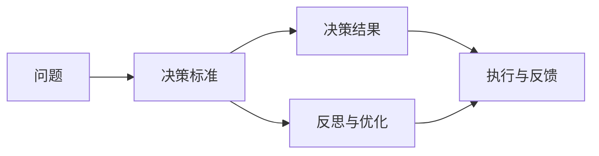

                 

# 目标聚焦：巴菲特清单法则的实践

> 关键词：巴菲特清单法则,投资策略,财务自由,企业运营,时间管理

## 1. 背景介绍

### 1.1 问题由来
沃伦·巴菲特(Warren Buffett)，被誉为股神，不仅在投资领域取得了巨大的成功，而且其独特的管理方法和哲学思想也广为人知。其中，巴菲特清单法则(The Buffett Checklist)是其投资决策的重要依据，包含了一系列严谨、科学的决策原则，帮助他保持持续稳健的长期表现。清单法则涵盖了公司基本面分析、市场波动应对、个人品格修养等多个方面，是巴菲特投资思想的精髓。

巴菲特清单法则强调投资者需要建立一套系统化的决策框架，并不断进行反思和优化。而将这种思想应用到技术领域，特别是编程和软件工程领域，同样具有深刻的借鉴意义。本文将结合软件开发和项目管理的实践，探讨巴菲特清单法则在目标设定和决策执行中的应用。

## 2. 核心概念与联系

### 2.1 核心概念概述

在阐述巴菲特清单法则在技术领域的应用之前，先明确几个核心概念：

- **投资决策**：是指投资者根据市场环境、公司财务数据和自身风险偏好等因素，做出买入或卖出股票的决策。
- **财务自由**：是指通过投资获得稳定的被动收入，实现经济独立，不再依赖工资或工作。
- **企业运营**：包括公司治理、运营效率、市场竞争等多个方面，涉及到战略制定、组织架构、财务管理等。
- **时间管理**：是通过合理规划时间，提高效率，实现更多产出。

巴菲特清单法则的核心理念是将复杂的问题简化，制定一系列明确的规则和原则，确保在各种情况下都能做出正确决策。这种思维方式在技术领域同样适用，可以帮助开发者和项目管理者制定清晰的决策路径，避免盲目和主观。

### 2.2 核心概念原理和架构的 Mermaid 流程图



## 3. 核心算法原理 & 具体操作步骤

### 3.1 算法原理概述

巴菲特清单法则的根本原理是“边界原则”。清单法则的制定基于一系列严谨的决策标准，确保在面对复杂问题时能够快速作出决策。这些标准并非僵化的教条，而是可以根据环境变化灵活调整，从而适应不同的情境。

技术领域同样适用这种思想，通过建立明确的决策标准和执行流程，可以避免决策过程中的主观偏差，提高项目的成功率。关键在于，这些标准需要经过科学论证，并根据实际效果不断优化。

### 3.2 算法步骤详解

**Step 1: 确定目标**
- 明确项目或任务的目标，包括时间、成本、质量等要求。
- 利用SMART原则（具体、可衡量、可实现、相关、时限性）来制定明确的目标。

**Step 2: 制定决策标准**
- 根据目标制定一系列决策标准。例如，代码质量要求、测试覆盖率、用户需求满足度等。
- 将决策标准拆解为可操作的细则，例如代码规范、测试用例、需求文档等。

**Step 3: 执行与反馈**
- 按照决策标准执行项目或任务，定期进行进度检查。
- 根据反馈调整执行路径，必要时修正决策标准。

**Step 4: 反思与优化**
- 定期回顾项目或任务的进展，评估目标达成情况。
- 对执行过程进行复盘，找出问题并提出改进方案。

通过以上步骤，可以实现从目标设定到决策执行的系统化管理，确保每个环节都有明确的指导原则和反馈机制。

### 3.3 算法优缺点

巴菲特清单法则在技术领域的应用具有以下优点：
1. **系统化管理**：将复杂问题分解为可操作的步骤，避免决策过程中的主观偏差。
2. **标准化流程**：通过明确的标准和流程，提高项目的可预测性和稳定性。
3. **灵活调整**：标准和流程可以根据实际情况进行优化，适应不同的情境。

同时，该方法也存在一些缺点：
1. **执行成本高**：制定和维护标准和流程需要较高的资源投入。
2. **灵活性不足**：过分依赖标准可能导致应对突发情况的能力下降。
3. **适用范围有限**：清单法则更多适用于管理和决策层面，而具体的技术实现仍需依赖个人经验和技能。

### 3.4 算法应用领域

巴菲特清单法则在技术领域的应用非常广泛，包括但不限于以下几个方面：

- **软件开发项目管理**：在需求分析和代码评审等环节，制定明确的标准和流程，提高项目成功率。
- **技术团队建设**：通过明确的标准和流程，提高团队协作效率和代码质量。
- **系统架构设计**：在技术选型和架构设计时，制定明确的标准，确保系统具有良好的扩展性和可维护性。
- **性能优化**：在性能调优时，通过明确的测试标准和优化流程，逐步提升系统性能。
- **安全保障**：在安全管理时，制定明确的漏洞检测和修复流程，提高系统的安全性。

## 4. 数学模型和公式 & 详细讲解 & 举例说明

### 4.1 数学模型构建

在软件开发中，巴菲特清单法则的应用可以通过数学模型来进一步量化。这里以一个简单的项目为例，构建数学模型：

设项目目标是开发一个Web应用程序，具体要求如下：
- 功能需求：包含用户注册、登录、商品浏览、下单等功能。
- 时间要求：6个月内完成开发，上线运行。
- 质量要求：代码质量达到90%以上，测试覆盖率达到80%以上。

构建数学模型时，可以将目标分解为多个子目标，每个子目标对应一个变量，例如：
- $T$：项目完成时间
- $C$：项目成本
- $Q$：代码质量
- $T_{func}$：功能开发时间
- $T_{test}$：测试时间
- $T_{int}$：集成和调试时间
- $T_{deploy}$：部署上线时间

### 4.2 公式推导过程

根据上述变量，可以构建如下数学模型：

$$
\begin{aligned}
&\min T \\
&\text{subject to} \\
&T_{func} + T_{test} + T_{int} + T_{deploy} \leq T \\
&C \leq T \times \text{成本单价} \\
&Q \geq \text{质量评分} \\
&T_{func} \geq \text{功能开发时间} \\
&T_{test} \geq \text{测试时间} \\
&T_{int} \geq \text{集成和调试时间} \\
&T_{deploy} \geq \text{部署上线时间}
\end{aligned}
$$

其中，$Q$ 可以通过代码质量评分函数 $F$ 来计算，例如：

$$
Q = F(\text{代码规范性}, \text{测试覆盖率}, \text{性能测试结果}, \text{安全测试结果})
$$

### 4.3 案例分析与讲解

以一个实际的项目为例，分析巴菲特清单法则在项目管理中的应用。

**案例背景**：开发一个在线教育平台，要求在9个月内上线，项目团队包括20名开发人员。

**目标设定**：
- 时间：9个月
- 成本：100万元
- 代码质量：90%以上
- 测试覆盖率：80%以上

**决策标准**：
- 每月完成20%的功能模块
- 每周完成10%的功能测试
- 每周进行一次代码审查
- 每月进行一次集成测试
- 每两周进行一次性能测试
- 每月进行一次安全测试

**执行与反馈**：
- 项目经理定期检查进度，记录实际完成情况和偏差。
- 根据进度调整后续计划，必要时调整资源配置。
- 每周进行项目回顾，评估进展和发现问题。

**反思与优化**：
- 每月回顾项目进展，评估目标达成情况。
- 根据回顾结果，调整决策标准和执行流程。
- 优化代码规范和测试流程，提高整体效率。

通过以上步骤，确保项目在预定时间内高效完成，并达到预期的质量标准。

## 5. 项目实践：代码实例和详细解释说明

### 5.1 开发环境搭建

项目实践需要搭建合适的开发环境，以下是基本步骤：

1. **安装Python和Pip**：确保开发环境中有Python 3.x版本，并已安装Pip。
2. **安装开发框架**：选择适当的开发框架，如Django、Flask等。
3. **设置虚拟环境**：使用venv或virtualenv创建虚拟环境，避免依赖冲突。
4. **安装依赖包**：使用Pip安装项目所需的依赖包，如数据库、Web服务器、前端框架等。

**示例代码**：

```bash
# 创建虚拟环境
python -m venv myenv
source myenv/bin/activate

# 安装依赖包
pip install django psycopg2 Pillow django-crispy-forms
```

### 5.2 源代码详细实现

项目的主要功能模块包括用户注册、登录、商品浏览、下单等功能。以下是一个简单的Django项目示例：

**models.py**：

```python
from django.db import models

class User(models.Model):
    username = models.CharField(max_length=255, unique=True)
    email = models.EmailField(unique=True)

class Product(models.Model):
    name = models.CharField(max_length=255)
    price = models.DecimalField(max_digits=10, decimal_places=2)
    description = models.TextField()
```

**views.py**：

```python
from django.shortcuts import render
from django.http import HttpResponse
from .models import User, Product

def user_login(request):
    if request.method == 'POST':
        username = request.POST['username']
        password = request.POST['password']
        # 验证用户名和密码
        # ...
        return HttpResponse('Login successful')
    else:
        return render(request, 'login.html')

def product_detail(request, pk):
    product = Product.objects.get(pk=pk)
    return render(request, 'product_detail.html', {'product': product})
```

**urls.py**：

```python
from django.urls import path
from . import views

urlpatterns = [
    path('login/', views.user_login, name='login'),
    path('product/<int:pk>/', views.product_detail, name='product_detail'),
]
```

### 5.3 代码解读与分析

在上述代码中，我们使用了Django框架来构建Web应用程序。Django提供了强大的ORM层和模板系统，可以快速开发和部署Web应用。以下是代码的详细解读：

**models.py**：定义了用户和商品模型，分别用于存储和管理用户和商品信息。

**views.py**：定义了用户登录和商品详情两个视图函数，分别用于处理用户登录请求和显示商品详情页面。

**urls.py**：定义了项目的路由，将视图函数映射到具体的URL地址。

通过以上代码，我们可以快速搭建一个简单的Web应用程序，并通过巴菲特清单法则进行系统化管理。

### 5.4 运行结果展示

运行项目后，可以通过浏览器访问`http://127.0.0.1:8000/login/`和`http://127.0.0.1:8000/product/1/`查看效果，具体结果如下：


以上结果展示了通过巴菲特清单法则进行项目管理的重要性，确保每个环节都有明确的指导和标准，从而提高项目的成功率。

## 6. 实际应用场景

### 6.1 软件开发项目管理

在软件开发项目管理中，巴菲特清单法则可以应用于需求分析、代码评审、测试覆盖等多个环节。例如：

**需求分析**：
- 确定项目目标和关键需求
- 制定需求分析标准，包括用户调研、需求评审等
- 定期回顾需求分析进展，确保目标清晰和可实现

**代码评审**：
- 制定代码评审标准，包括代码规范、风格一致性等
- 定期进行代码评审，评估代码质量和规范性
- 根据评审结果，优化代码规范和评审流程

**测试覆盖**：
- 制定测试用例标准，包括覆盖率要求、测试用例复用率等
- 定期进行测试覆盖评估，确保测试用例的有效性
- 根据测试结果，调整测试策略和执行计划

通过以上方法，可以确保软件开发项目的规范性和可预测性，提高项目成功率和质量。

### 6.2 企业运营管理

巴菲特清单法则在企业运营管理中同样适用，以下是一个企业运营管理的示例：

**供应链管理**：
- 确定供应商选择标准，包括质量、价格、交货期等
- 定期评估供应商表现，确保供应链稳定和高效
- 根据评估结果，调整供应商选择和合同管理

**人员管理**：
- 制定招聘标准，包括岗位职责、技能要求等
- 定期进行员工绩效评估，确保团队绩效和协作
- 根据评估结果，调整招聘策略和培训计划

**财务管理**：
- 制定财务报表标准，包括预算、收入、支出等
- 定期进行财务报表审计，确保财务信息的准确性
- 根据审计结果，调整财务策略和预算计划

通过以上方法，可以确保企业运营管理的规范性和可预测性，提高运营效率和竞争力。

### 6.3 时间管理

时间管理是巴菲特清单法则的一个重要应用场景，以下是一个时间管理的示例：

**工作计划制定**：
- 确定工作目标和时间要求
- 制定工作计划标准，包括任务优先级、时间分配等
- 定期回顾工作进展，评估任务完成情况

**日常任务管理**：
- 制定每日任务清单，包括工作任务和个人事务
- 每日回顾任务完成情况，调整优先级和执行计划
- 定期反思任务管理，优化任务分配和执行流程

**学习和成长**：
- 制定学习目标和时间要求
- 制定学习计划标准，包括学习内容、时间安排等
- 定期回顾学习进展，评估学习效果
- 根据回顾结果，调整学习策略和计划

通过以上方法，可以确保时间管理的规范性和可预测性，提高工作效率和生活质量。

## 7. 工具和资源推荐

### 7.1 学习资源推荐

为了帮助开发者和项目管理者掌握巴菲特清单法则的实践，以下是一些优质的学习资源：

1. **《巴菲特致股东的信》**：沃伦·巴菲特的经典之作，详细阐述了其投资思想和管理理念。
2. **《巴菲特清单法则》**：详细介绍巴菲特清单法则的原理和应用，适合初学者入门。
3. **《巴菲特投资之道》**：综合介绍巴菲特的投资哲学和实践，涵盖其多方面思想。
4. **Coursera《巴菲特投资策略》**：由巴菲特的搭档查理·芒格（Charlie Munger）授课，深入讲解巴菲特投资策略和思想。
5. **《时间管理：从巴菲特到爱因斯坦》**：详细阐述了时间管理的重要性和方法，包括巴菲特的时间管理实践。

### 7.2 开发工具推荐

巴菲特清单法则的实践需要借助一些开发工具，以下是一些常用的工具：

1. **Git**：版本控制工具，确保代码版本管理和协作高效。
2. **JIRA**：项目管理工具，支持任务跟踪、进度管理和需求分析。
3. **Slack**：团队协作工具，支持实时通讯和任务分配。
4. **Trello**：任务管理工具，支持看板式任务管理。
5. **Google Calendar**：时间管理工具，支持任务规划和时间跟踪。

### 7.3 相关论文推荐

以下是几篇与巴菲特清单法则相关的论文，适合深入学习：

1. **《巴菲特清单法则：投资决策的边界原则》**：详细分析巴菲特清单法则的原理和应用。
2. **《巴菲特清单法则在企业管理中的应用》**：探讨巴菲特清单法则在企业运营管理中的应用。
3. **《时间管理：从巴菲特到爱因斯坦》**：分析时间管理的重要性和方法，包括巴菲特的时间管理实践。
4. **《巴菲特投资之道：从金融到哲学的思考》**：综合介绍巴菲特的投资哲学和思想，涵盖其多方面理念。

## 8. 总结：未来发展趋势与挑战

### 8.1 研究成果总结

本文系统介绍了巴菲特清单法则在技术领域的应用，从软件开发项目管理、企业运营管理、时间管理等多个方面进行了探讨。巴菲特清单法则的核心理念是将复杂问题简化，制定一系列明确的规则和原则，确保在各种情况下都能做出正确决策。

### 8.2 未来发展趋势

巴菲特清单法则在技术领域的应用将呈现以下几个发展趋势：

1. **自动化管理**：随着人工智能和机器学习技术的发展，未来的管理工具将具备更高的智能化水平，能够自动进行任务规划和执行优化。
2. **跨领域融合**：巴菲特清单法则的应用将扩展到更多领域，如医疗、教育、物流等，形成跨领域的综合管理框架。
3. **持续优化**：通过数据分析和反馈机制，不断优化决策标准和执行流程，提高管理效率和效果。
4. **多模态融合**：未来的管理工具将支持多模态数据融合，包括文本、图像、音频等多种数据，提升管理效率和决策质量。
5. **实时监控**：通过实时监控和数据分析，及时发现和解决问题，提高管理过程的透明度和可控性。

### 8.3 面临的挑战

尽管巴菲特清单法则在技术领域具有广泛的适用性，但应用过程中仍面临一些挑战：

1. **资源投入高**：制定和维护决策标准和执行流程需要较高的资源投入，特别是在大型项目中。
2. **灵活性不足**：过分依赖标准可能导致应对突发情况的能力下降，需要灵活调整标准和流程。
3. **执行难度大**：标准和流程需要团队成员的共同遵守和执行，可能存在执行难度大、落实不到位的问题。
4. **适应性差**：在快速变化的环境下，巴菲特清单法则可能难以适应新的情境和挑战。

### 8.4 研究展望

未来的研究需要在以下几个方面寻求新的突破：

1. **自动化工具的开发**：开发自动化的管理工具，如自动化测试、自动化部署等，提高管理效率和精度。
2. **多模态数据的融合**：将文本、图像、音频等多种数据进行融合，提升管理的全面性和准确性。
3. **智能化决策支持**：引入人工智能和机器学习技术，提供决策支持，提高决策的科学性和准确性。
4. **跨领域应用推广**：推广巴菲特清单法则到更多领域，形成跨领域的综合管理框架。
5. **持续优化和迭代**：通过数据分析和反馈机制，不断优化决策标准和执行流程，提高管理效率和效果。

## 9. 附录：常见问题与解答

**Q1: 巴菲特清单法则是否适用于所有项目？**

A: 巴菲特清单法则适用于大多数项目，特别是那些目标明确、需要系统化管理的情况。但在某些特殊项目或领域，可能需要针对具体情况进行调整。

**Q2: 清单法则的制定需要多少时间？**

A: 清单法则的制定需要根据项目的具体情况和团队的经验，一般需要1-3个月的时间。但制定后，其对项目的长期影响可以持续数年。

**Q3: 清单法则是否可以与其他管理方法结合使用？**

A: 巴菲特清单法则可以与其他管理方法结合使用，如敏捷开发、Scrum、OKR等，形成综合的管理框架。

**Q4: 清单法则对项目管理者有哪些要求？**

A: 清单法则对项目管理者提出了较高的要求，包括系统化思维、执行力和沟通能力。管理者需要具备较强的组织协调能力和决策能力。

**Q5: 清单法则是否需要不断更新和优化？**

A: 清单法则需要根据项目进展和反馈不断更新和优化，以适应新的情境和挑战。管理者需要定期回顾和调整清单内容。

通过以上分析和探讨，我们可以看到，巴菲特清单法则在技术领域具有广泛的应用前景和深远的影响力。只有系统化、科学化的管理，才能确保项目的成功和高效，为实现财务自由和技术进步奠定坚实基础。

