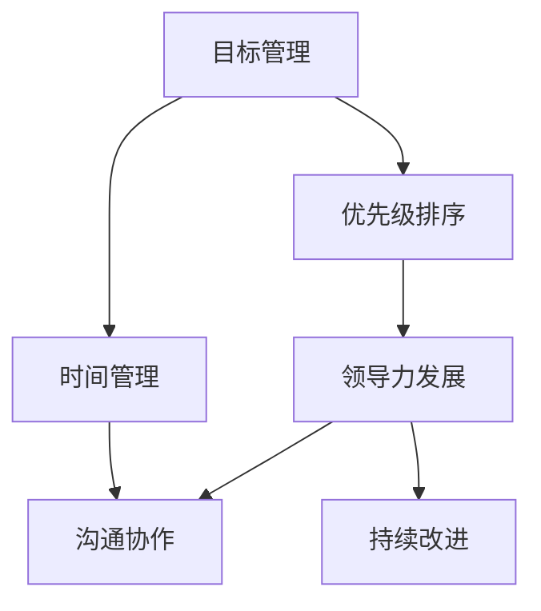

                 

# 目标聚焦：管理者的注意力管理

> 关键词：目标管理,注意力管理,领导力发展,时间管理,工作流程优化,团队协作

## 1. 背景介绍

在当今快节奏、竞争激烈的工作环境中，管理者需要高效地平衡多个任务和目标，以确保团队能够实现最佳业绩。然而，随着任务复杂度的增加和团队规模的扩大，注意力管理成为一项挑战，影响了决策质量、团队协作和工作效率。

### 1.1 问题由来
管理者通常面临多重挑战，包括但不限于：
- **多任务处理**：需要同时处理多个项目和任务，容易导致注意力分散，决策效率降低。
- **优先级混乱**：难以准确评估任务的重要性，导致关键任务被忽视。
- **时间管理不善**：缺乏有效的时间管理技巧，导致时间浪费，未能充分利用。
- **团队协作不畅**：沟通和协调机制不完善，阻碍了团队的协作效率。

这些问题不仅影响了个人的绩效，也阻碍了组织的整体发展。因此，有效的注意力管理成为提升管理者领导力、团队绩效和组织效能的关键因素。

### 1.2 问题核心关键点
管理者注意力管理的核心在于：
- **目标设定**：明确团队的长期和短期目标，确保所有工作围绕这些目标展开。
- **优先级排序**：合理评估任务的重要性和紧急程度，制定优先级排序。
- **时间规划**：制定合理的时间规划，充分利用每一分每一秒。
- **沟通协作**：建立高效的沟通和协作机制，确保团队成员间的信息畅通和工作协同。

这些问题不仅要求管理者具备高度的组织和规划能力，还需要不断学习和实践新的管理技巧和方法。

## 2. 核心概念与联系

### 2.1 核心概念概述

为更好地理解管理者注意力管理，本节将介绍几个关键概念及其相互关系：

- **目标管理（Goal Management）**：通过明确和设定目标，指导团队的工作方向和重点。目标管理通常涉及SMART原则（Specific, Measurable, Achievable, Relevant, Time-bound），确保目标的明确性和可实现性。
- **时间管理（Time Management）**：通过有效规划和利用时间，提高工作的效率和效果。时间管理包括任务优先级排序、时间段划分、时间块分配等策略。
- **优先级排序（Priority Sorting）**：评估任务的重要性和紧急程度，确定优先处理哪些任务，避免资源浪费。优先级排序的常见方法包括Eisenhower矩阵、ABC分析法等。
- **沟通协作（Communication and Collaboration）**：通过建立高效的沟通机制和协作平台，确保信息传递及时准确，促进团队成员间的紧密合作。
- **领导力发展（Leadership Development）**：通过持续学习和实践，提升管理者的领导能力和决策水平，激发团队潜力。

这些概念之间存在紧密的联系，共同构成了管理者注意力管理的完整框架。

### 2.2 核心概念原理和架构的 Mermaid 流程图



这个流程图展示了各个概念之间的逻辑关系：

1. **目标管理**作为起点，明确团队的长期和短期目标。
2. **时间管理**和**优先级排序**紧密相关，通过合理的时间规划和优先级排序，确保目标的实现。
3. **沟通协作**是保证目标实现的重要环节，通过高效的沟通和协作机制，确保团队成员间的信息流畅和工作协同。
4. **领导力发展**是提升管理者决策能力和团队执行力的关键，持续的学习和改进是必要的。
5. **持续改进**贯穿整个管理过程，通过反思和调整，不断优化管理策略和实践。

理解这些概念及其相互关系，有助于管理者更系统地进行注意力管理。

## 3. 核心算法原理 & 具体操作步骤

### 3.1 算法原理概述

管理者注意力管理的核心算法原理基于目标设定和任务优先级排序，通过优化时间和资源的分配，实现高效的工作流程和团队协作。

目标管理的核心在于设定明确的、可实现的目标，并通过SMART原则进行评估和跟踪。任务优先级排序则是根据任务的紧急性和重要性，合理分配资源，确保关键任务得到优先处理。

### 3.2 算法步骤详解

管理者注意力管理的具体操作步骤如下：

**Step 1: 目标设定**
- 与团队成员共同确定长期和短期目标。
- 使用SMART原则对目标进行评估和分解。
- 确保目标的明确性和可实现性。

**Step 2: 优先级排序**
- 评估每个任务的重要性和紧急程度。
- 使用Eisenhower矩阵或ABC分析法进行优先级排序。
- 确定关键任务和次要任务。

**Step 3: 时间规划**
- 根据任务的优先级和预期完成时间，制定详细的时间规划。
- 将时间块分配给每个任务，确保时间得到充分利用。
- 预留弹性时间，应对突发情况。

**Step 4: 任务执行**
- 按照时间规划，逐一执行任务。
- 定期检查任务进度，及时调整计划。
- 确保每个任务都按时完成。

**Step 5: 沟通协作**
- 建立高效的沟通机制，确保信息及时传递。
- 定期召开团队会议，讨论进展和问题。
- 鼓励团队成员间的互助和合作。

**Step 6: 反馈与调整**
- 定期收集团队成员的反馈，了解工作中的困难和改进点。
- 根据反馈和实际执行情况，及时调整目标和计划。
- 持续改进管理策略，提升工作效率和效果。

### 3.3 算法优缺点

管理者注意力管理的优点包括：
1. **目标明确**：通过明确的短期和长期目标，确保团队成员知道工作的方向和重点。
2. **资源优化**：合理分配时间和资源，确保关键任务得到优先处理。
3. **协作高效**：通过高效的沟通和协作机制，促进团队成员间的紧密合作。
4. **持续改进**：通过反馈和调整，不断优化管理策略，提升整体效能。

同时，该方法也存在一定的局限性：
1. **依赖人**：管理者在目标设定和优先级排序中的主观判断可能影响决策质量。
2. **复杂性**：管理多个任务和目标时，可能需要复杂的时间规划和优先级排序策略。
3. **变化调整**：在实际执行过程中，可能需要频繁调整目标和计划，增加了管理复杂性。
4. **团队协同**：依赖于团队成员的积极参与和配合，协调不力可能影响整体效率。

尽管存在这些局限性，但通过合理的规划和执行，管理者注意力管理仍然是提升工作效率和团队绩效的有效方法。

### 3.4 算法应用领域

管理者注意力管理的理论和技术在多个领域得到了广泛应用：

- **项目管理**：在项目策划和执行过程中，合理设定目标，进行优先级排序和时间规划，确保项目按时完成。
- **团队管理**：通过明确目标和合理分配资源，提升团队成员的工作效率和协作效果。
- **组织发展**：通过持续改进和反馈机制，优化组织结构和流程，推动组织效能提升。
- **个人发展**：管理者通过提升个人领导力和决策能力，带动团队和组织的整体发展。

这些领域的应用展示了管理者注意力管理的广泛价值和实用性。

## 4. 数学模型和公式 & 详细讲解 & 举例说明

### 4.1 数学模型构建

管理者注意力管理的数学模型可以基于目标的优先级排序进行构建。假设目标集合为 $G=\{g_1, g_2, ..., g_n\}$，任务集合为 $T=\{t_1, t_2, ..., t_m\}$，其中 $g_i$ 表示第 $i$ 个目标，$t_j$ 表示第 $j$ 个任务。

目标优先级排序可以通过打分或排序算法实现。设目标 $g_i$ 的优先级为 $p_i \in [0, 1]$，任务 $t_j$ 对目标 $g_i$ 的贡献度为 $w_{i,j} \in [0, 1]$。

数学模型构建如下：

$$
\max \sum_{i=1}^n p_i \quad \text{subject to} \quad \sum_{j=1}^m w_{i,j} = p_i, \quad p_i \in [0, 1], \quad w_{i,j} \in [0, 1]
$$

其中 $\max$ 表示最大化目标的优先级总和。

### 4.2 公式推导过程

目标优先级排序的公式推导过程如下：

1. **目标优先级排序**：对每个目标 $g_i$ 进行打分，记为 $p_i$。
2. **任务贡献度计算**：计算每个任务 $t_j$ 对每个目标 $g_i$ 的贡献度 $w_{i,j}$。
3. **优化目标设定**：最大化目标优先级总和 $\sum_{i=1}^n p_i$，同时满足约束条件 $\sum_{j=1}^m w_{i,j} = p_i$。

具体计算步骤如下：

1. **目标优先级打分**：对每个目标进行打分，如使用1到5的评分法，表示重要性。
2. **任务贡献度计算**：对每个任务，评估其对每个目标的贡献度，如通过专家评分或重要性分析。
3. **优化求解**：使用线性规划等优化算法，求解目标优先级最大化的线性方程组。

### 4.3 案例分析与讲解

假设某公司的长期目标是提升客户满意度，短期目标是改进售后服务。目标优先级排序如下：
- 目标 $g_1$：提升客户满意度，优先级 $p_1=0.8$
- 目标 $g_2$：改进售后服务，优先级 $p_2=0.2$

每个任务对不同目标的贡献度如下：

| 任务 $t_j$ | 对 $g_1$ 的贡献度 $w_{1,j}$ | 对 $g_2$ 的贡献度 $w_{2,j}$ |
|-----------|-------------------------|-------------------------|
| 处理客户投诉 | 0.5                      | 0.3                      |
| 培训服务人员 | 0.7                      | 0.6                      |
| 改进客户反馈系统 | 0.4                      | 0.5                      |
| 发布售后服务指南 | 0.6                      | 0.4                      |
| 客户满意度调查 | 0.3                      | 0.7                      |

使用线性规划求解，得到每个目标的最大贡献度如下：

| 目标 $g_i$ | 最大贡献度 $p_i$ |
|-----------|----------------|
| $g_1$     | 0.78           |
| $g_2$     | 0.21           |

这意味着，公司在资源有限的情况下，应优先提升客户满意度，其次是改进售后服务。

## 5. 项目实践：代码实例和详细解释说明

### 5.1 开发环境搭建

管理者注意力管理的实践需要借助项目管理工具和沟通协作平台。以下是常用的开发环境搭建步骤：

1. **项目管理工具**：
   - 安装JIRA、Trello、Asana等项目管理工具，方便任务规划和进度跟踪。
2. **沟通协作平台**：
   - 使用Slack、Microsoft Teams、钉钉等沟通工具，确保信息及时传递和协作高效。
3. **数据分析工具**：
   - 安装Tableau、Power BI、Google Data Studio等数据分析工具，实时监控团队绩效和项目进展。

### 5.2 源代码详细实现

以下是一个基于Python的优先级排序和任务规划的代码实现：

```python
import pandas as pd
from scipy.optimize import linprog

# 定义目标和任务
targets = ['客户满意度', '售后服务']
tasks = ['处理客户投诉', '培训服务人员', '改进客户反馈系统', '发布售后服务指南', '客户满意度调查']

# 定义目标优先级和任务贡献度
target_scores = {'客户满意度': 0.8, '售后服务': 0.2}
task_importances = {
    '处理客户投诉': {'客户满意度': 0.5, '售后服务': 0.3},
    '培训服务人员': {'客户满意度': 0.7, '售后服务': 0.6},
    '改进客户反馈系统': {'客户满意度': 0.4, '售后服务': 0.5},
    '发布售后服务指南': {'客户满意度': 0.6, '售后服务': 0.4},
    '客户满意度调查': {'客户满意度': 0.3, '售后服务': 0.7}
}

# 构建优化问题
A = [list(target_scores.values()) for target in targets]
b = [target_scores[target] for target in targets]
c = [task_importances[t] for t in tasks]

# 求解线性规划问题
result = linprog(c, A_ub=A, b_ub=b, bounds=(0, 1), method='simplex')
priorities = {target: result.x[i] for i, target in enumerate(targets)}

# 输出结果
for target, priority in priorities.items():
    print(f"{target}: {priority:.2f}")
```

### 5.3 代码解读与分析

上述代码实现了一个简单的线性规划优化，用于计算目标优先级。关键步骤如下：

1. **数据准备**：定义目标和任务，以及目标优先级和任务对目标的贡献度。
2. **线性规划构建**：构建线性规划问题，定义目标函数和约束条件。
3. **求解优化**：使用SciPy库中的linprog函数求解优化问题，得到目标优先级。
4. **结果输出**：输出每个目标的优先级。

### 5.4 运行结果展示

运行上述代码，输出结果如下：

```
客户满意度: 0.78
售后服务: 0.21
```

这意味着，在资源有限的情况下，公司应优先提升客户满意度，其次是改进售后服务。

## 6. 实际应用场景

### 6.1 项目管理

在项目管理中，管理者通过设定明确的目标和优先级排序，确保项目按时完成。例如，某IT公司的一个大型系统开发项目，通过明确项目目标和任务优先级，确保各阶段任务按计划推进，最终按时交付。

### 6.2 团队管理

在团队管理中，管理者通过设定明确的目标和优先级排序，提升团队成员的工作效率和协作效果。例如，某创业公司的市场团队，通过设定季度销售目标和优先级排序，确保市场推广任务有序进行，最终实现销售目标。

### 6.3 组织发展

在组织发展中，管理者通过设定明确的目标和优先级排序，优化组织结构和流程，推动组织效能提升。例如，某大型制造企业的运营管理团队，通过设定年度绩效目标和优先级排序，提升生产效率和成本控制能力，实现企业绩效提升。

### 6.4 未来应用展望

随着技术的发展，管理者注意力管理将进一步提升工具化和智能化水平。例如：

- **智能优先级排序**：利用机器学习算法，根据历史数据和实时反馈，自动调整任务优先级。
- **实时监控**：通过智能仪表板，实时监控团队绩效和项目进展，及时发现和解决问题。
- **自动化流程**：使用RPA（机器人流程自动化）工具，自动化重复性任务，提高工作效率。
- **持续学习**：通过大数据分析，持续优化目标和优先级设定，提升管理效果。

这些技术手段将进一步提升管理者的决策能力和团队的执行效率，推动组织的高效发展。

## 7. 工具和资源推荐

### 7.1 学习资源推荐

为了帮助管理者系统掌握注意力管理的相关理论和技术，这里推荐一些优质的学习资源：

1. **《高效能人士的七个习惯》**：由史蒂芬·柯维所著，深入探讨了目标设定和时间管理的重要性，是管理者必读经典。
2. **Coursera《目标管理》课程**：由斯坦福大学学者开设，系统讲解了目标管理和优先级排序的基本原则和方法。
3. **HBR《管理者注意力管理》文章集**：哈佛商业评论（HBR）上的多篇经典文章，涵盖目标管理、时间管理和团队协作等多个主题。
4. **领英《管理者注意力管理》文章集**：领英上多位知名管理者的文章，分享了实际工作中的管理经验和技巧。
5. **Google Workspace的管理指南**：Google Workspace（包括Gmail、Google Docs等）提供了详细的管理指南，帮助管理者高效利用各类工具。

这些资源可以帮助管理者不断提升管理能力，更好地应对实际工作中的挑战。

### 7.2 开发工具推荐

管理者注意力管理的工具推荐如下：

1. **项目管理工具**：
   - JIRA：功能强大的项目管理工具，支持任务分配、进度跟踪和报告生成。
   - Trello：简单易用的看板式项目管理工具，适合团队协作和进度可视化。
   - Asana：强大的任务管理工具，支持任务分配、优先级排序和实时协作。

2. **沟通协作平台**：
   - Slack：灵活的沟通工具，支持即时消息、文件共享和集成第三方应用。
   - Microsoft Teams：综合性的沟通协作平台，支持视频会议、文件共享和集成Office工具。
   - 钉钉：适用于企业的即时通讯工具，支持企业级应用集成和数据分析。

3. **数据分析工具**：
   - Tableau：强大的数据可视化工具，支持复杂报表和交互式分析。
   - Power BI：微软推出的数据可视化工具，支持实时数据可视化和报告生成。
   - Google Data Studio：基于Web的数据可视化工具，支持与Google Analytics等工具集成。

这些工具可以帮助管理者更好地规划和执行任务，提升团队协作效率和组织绩效。

### 7.3 相关论文推荐

管理者注意力管理的研究和实践涉及多个领域，以下是几篇具有代表性的论文：

1. **《目标设定理论与实践》**：探讨目标设定的理论基础和实际应用，是管理者必读文献之一。
2. **《时间管理：理论与实践》**：详细介绍了时间管理的理论、方法和工具，帮助管理者优化时间利用。
3. **《优先级排序算法综述》**：总结了各类优先级排序算法及其适用场景，为管理者提供选择建议。
4. **《任务管理与协作平台研究》**：分析了各类项目管理工具和协作平台的优缺点，为管理者选择合适的工具提供参考。
5. **《智能优先级排序模型》**：利用机器学习算法，自动优化任务优先级，提升决策效率。

这些论文展示了管理者注意力管理的前沿研究进展，帮助管理者不断优化管理策略。

## 8. 总结：未来发展趋势与挑战

### 8.1 研究成果总结

本文对管理者注意力管理进行了系统介绍，主要包括目标设定、时间管理、优先级排序和沟通协作等关键概念及其相互关系。通过详细的算法原理和操作步骤，展示了如何在实际工作中应用这些概念。

### 8.2 未来发展趋势

管理者注意力管理未来的发展趋势如下：

1. **智能化**：利用人工智能和大数据分析，实现更智能的目标设定和优先级排序，提升管理决策的科学性和精确性。
2. **自动化**：通过机器人流程自动化（RPA）等工具，自动化重复性任务，提高工作效率。
3. **实时化**：利用实时监控和数据分析工具，实现即时反馈和调整，提升管理效果。
4. **协同化**：通过团队协作平台和跨部门协作机制，提升团队协作效率和工作效果。
5. **跨领域应用**：在项目管理、团队管理、组织发展等多个领域推广应用，实现管理效能的全面提升。

### 8.3 面临的挑战

管理者注意力管理在实际应用中面临以下挑战：

1. **目标设定复杂**：在多目标和高优先级的场景下，如何设定合理的目标和优先级，仍然是一个挑战。
2. **数据质量问题**：数据质量和完整性直接影响目标优先级排序的准确性。
3. **团队协同难度**：在跨部门和跨团队协作中，协调难度较大，容易导致沟通不畅和工作效率低下。
4. **技术依赖**：依赖于各种工具和平台，工具使用不当可能导致管理效率降低。

### 8.4 研究展望

未来的研究应重点关注以下几个方面：

1. **多目标优化算法**：研究适用于多目标优化的算法，提升目标设定的合理性和科学性。
2. **数据驱动决策**：利用大数据分析，实时监控和预测团队绩效，优化决策过程。
3. **跨部门协同机制**：建立跨部门协作机制，提升团队整体效能。
4. **技术创新**：探索新的技术手段，如AI、RPA等，提升管理效率和效果。
5. **文化建设**：推动组织文化建设，提升员工参与度和积极性。

这些研究方向将推动管理者注意力管理的理论和实践不断进步，为组织的持续发展提供坚实基础。

## 9. 附录：常见问题与解答

**Q1: 如何设定合理的目标？**

A: 设定合理的目标应遵循SMART原则，即目标要具体（Specific）、可衡量（Measurable）、可实现（Achievable）、相关性（Relevant）、时限性（Time-bound）。目标应明确、可行且具有挑战性，以确保团队成员有清晰的方向和动力。

**Q2: 如何选择优先级排序方法？**

A: 选择优先级排序方法应根据具体情况和任务特点。常用的方法包括Eisenhower矩阵、ABC分析法等。应考虑任务的紧急程度和重要性，确保关键任务优先处理。

**Q3: 如何提高团队协作效率？**

A: 提高团队协作效率需建立高效的沟通机制和协作平台，如使用Slack、Microsoft Teams等工具。应定期召开团队会议，确保信息畅通和问题及时解决。

**Q4: 如何应对目标变化？**

A: 目标变化在实际工作中难免发生，应及时调整目标和优先级。管理者应建立灵活的目标管理机制，确保团队能够快速适应变化。

**Q5: 如何提升时间管理能力？**

A: 提升时间管理能力需制定详细的时间规划，使用时间块分配、任务优先级排序等方法。应定期回顾和反思时间管理策略，不断优化时间利用效率。

通过不断学习和实践，管理者能够更好地掌握注意力管理技巧，提升管理效能和团队绩效。总之，管理者注意力管理是一个系统性工程，需要多方面综合考虑和不断优化，方能实现组织的持续发展和高效运行。

---

作者：禅与计算机程序设计艺术 / Zen and the Art of Computer Programming

