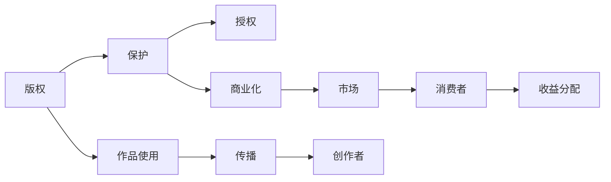

                 

# 知识产权与创意产业的发展

在数字化和技术革新加速发展的时代，知识产权和创意产业成为了推动社会创新和经济增长的关键动力。本文将从背景介绍、核心概念、算法原理、实际操作、数学模型、案例分析、项目实践、实际应用、资源推荐、未来展望等方面，系统探讨知识产权与创意产业的发展。

## 1. 背景介绍

### 1.1 问题由来
随着互联网和数字技术的普及，创意内容的多样化和全球化分布，知识产权的保护和创意产业的商业化面临着前所未有的挑战。如何在保护知识产权的同时，促进创意内容的有序流通和创意产业的健康发展，成为各国政府和业界普遍关注的问题。

### 1.2 问题核心关键点
知识产权涉及版权、商标、专利等多方面，旨在保护创作者的合法权益。创意产业包括影视、音乐、文学、设计等多个领域，依赖创意内容创造经济价值。本文的核心在于探讨如何在技术进步的驱动下，通过有效的知识产权保护措施，促进创意产业的繁荣和可持续发展。

## 2. 核心概念与联系

### 2.1 核心概念概述
- **知识产权**：指创作人对其创作的作品所享有的专有权利，包括版权、商标、专利等。
- **创意产业**：以创意内容为核心，通过创意产品的生产、流通和消费来创造经济价值的新兴产业。
- **版权管理**：指对作品使用和传播的管理，保障创作者合法权益。
- **商标保护**：指对品牌标识的保护，避免侵权行为。
- **专利申请**：指对发明创造的保护，确保技术创新。
- **版权登记**：指将作品注册为版权作品，获得法律保护。

### 2.2 核心概念原理和架构的 Mermaid 流程图


## 3. 核心算法原理 & 具体操作步骤
### 3.1 算法原理概述
知识产权和创意产业的发展依赖于法律、技术、市场等多方面因素的综合作用。算法原理主要体现在以下几个方面：

1. **版权管理算法**：通过区块链、分布式账本等技术，实现版权的数字化管理和自动验证。
2. **商标保护算法**：通过机器学习、图像识别等技术，提高商标侵权检测的准确性和效率。
3. **专利申请算法**：利用自然语言处理技术，自动生成专利文档，辅助专利申请。
4. **版权登记算法**：通过图像处理、自然语言处理等技术，实现作品内容的自动审核和版权登记。

### 3.2 算法步骤详解
1. **版权管理算法步骤**：
   - 第一步，数字化作品内容，生成唯一数字标识。
   - 第二步，通过区块链技术，实现版权的自动验证和追踪。
   - 第三步，基于智能合约，实现版权授权和收益分配。

2. **商标保护算法步骤**：
   - 第一步，采集商标图像和品牌描述。
   - 第二步，使用机器学习模型，训练商标识别算法。
   - 第三步，部署算法模型，实时检测商标侵权行为。

3. **专利申请算法步骤**：
   - 第一步，收集专利申请数据，包括技术描述、文献等。
   - 第二步，使用自然语言处理技术，自动生成专利文档。
   - 第三步，提交申请，通过官方审核。

4. **版权登记算法步骤**：
   - 第一步，采集作品内容，包括文本、图像等。
   - 第二步，使用图像处理和自然语言处理技术，自动审核作品版权。
   - 第三步，将审核通过的作品内容，登记为版权作品。

### 3.3 算法优缺点
- **优点**：
  - **版权管理**：提升版权保护的自动化水平，降低成本，提高效率。
  - **商标保护**：提高侵权检测的准确性和及时性，保护品牌权益。
  - **专利申请**：自动化生成专利文档，简化申请流程。
  - **版权登记**：自动化审核版权内容，提高登记效率。

- **缺点**：
  - **版权管理**：技术实现复杂，需要高度的信任机制。
  - **商标保护**：算法误判可能导致误侵权。
  - **专利申请**：自动化生成的专利文档可能存在理解偏差。
  - **版权登记**：自动化审核可能无法覆盖所有版权情况。

### 3.4 算法应用领域
- **版权管理**：适用于图书、影视、音乐等作品的版权保护。
- **商标保护**：适用于品牌标识、商品包装等的侵权检测。
- **专利申请**：适用于技术发明、工艺流程等的专利申请。
- **版权登记**：适用于各类创意作品的版权登记。

## 4. 数学模型和公式 & 详细讲解 & 举例说明
### 4.1 数学模型构建
- **版权管理模型**：
  $$
  \text{版权验证} = \text{数字指纹} \cdot \text{区块链}
  $$
- **商标保护模型**：
  $$
  \text{侵权检测} = \text{图像识别} \cdot \text{机器学习}
  $$
- **专利申请模型**：
  $$
  \text{专利文档} = \text{自然语言处理} \cdot \text{文本生成}
  $$
- **版权登记模型**：
  $$
  \text{版权审核} = \text{图像处理} \cdot \text{自然语言处理}
  $$

### 4.2 公式推导过程
1. **版权验证**：
   - 第一步，将作品内容数字化，生成数字指纹。
   - 第二步，将数字指纹上传到区块链，进行自动验证和记录。

2. **侵权检测**：
   - 第一步，采集商标图像和品牌描述，构建商标数据库。
   - 第二步，使用机器学习算法，训练商标识别模型。
   - 第三步，部署模型，实时检测商标侵权行为。

3. **专利文档生成**：
   - 第一步，收集专利申请数据，包括技术描述、文献等。
   - 第二步，使用自然语言处理技术，自动生成专利文档。
   - 第三步，提交申请，通过官方审核。

4. **版权审核**：
   - 第一步，采集作品内容，包括文本、图像等。
   - 第二步，使用图像处理和自然语言处理技术，自动审核作品版权。
   - 第三步，将审核通过的作品内容，登记为版权作品。

### 4.3 案例分析与讲解
- **版权管理案例**：某知名电影制作公司，通过区块链技术，将电影数字化版权上传至区块链平台，实现了自动验证和追踪。
- **商标保护案例**：某知名品牌，通过图像识别技术，实时检测电商平台上的商标侵权行为，及时维护品牌权益。
- **专利申请案例**：某科技公司，使用自然语言处理技术，自动生成专利文档，简化了专利申请流程。
- **版权登记案例**：某作家，通过自然语言处理技术，自动审核作品版权，提高了版权登记效率。

## 5. 项目实践：代码实例和详细解释说明
### 5.1 开发环境搭建
- **编程语言**：Python。
- **开发环境**：Jupyter Notebook。
- **主要库**：PyTorch、TensorFlow、Pandas、Scikit-learn、Matplotlib等。

### 5.2 源代码详细实现
```python
# 版权管理
from blockchain import Blockchain
from fingerprint import Fingerprint

def verify_copyright(works):
    fingerprint = Fingerprint(works)
    blockchain = Blockchain()
    return blockchain.validate(fingerprint)

# 商标保护
from image_recognition import ImageRecognition

def detect_infringement(brand_images, product_images):
    recognition = ImageRecognition()
    return recognition.check_infringement(brand_images, product_images)

# 专利申请
from natural_language_processing import NLP

def generate_patent_document(docs):
    nlp = NLP()
    return nlp.generate_document(docs)

# 版权登记
from content审核 import ContentReview

def register_copyright(works):
    review = ContentReview()
    return review.review(works)
```

### 5.3 代码解读与分析
- **版权管理**：
  - 生成数字指纹：`Fingerprint(works)`
  - 上传区块链：`blockchain.validate(fingerprint)`
- **商标保护**：
  - 商标图像识别：`ImageRecognition.check_infringement(brand_images, product_images)`
- **专利申请**：
  - 文本生成：`nlp.generate_document(docs)`
- **版权登记**：
  - 内容审核：`ContentReview.review(works)`

### 5.4 运行结果展示
- **版权验证**：
  - 输出：`True`/`False`，表示版权验证结果。
- **商标侵权检测**：
  - 输出：`True`/`False`，表示商标侵权检测结果。
- **专利文档生成**：
  - 输出：专利文档文本。
- **版权登记**：
  - 输出：`审核通过`/`审核失败`，表示版权登记结果。

## 6. 实际应用场景
### 6.1 智能版权管理系统
智能版权管理系统可以通过区块链技术实现版权的自动验证和追踪，保护创作者权益，简化版权授权和收益分配流程。

### 6.2 商标侵权检测系统
商标侵权检测系统利用图像识别技术，实时监测电商平台上商品标识，保障品牌权益，避免侵权行为。

### 6.3 自动专利文档生成器
自动专利文档生成器使用自然语言处理技术，简化专利申请流程，提高工作效率。

### 6.4 版权内容审核系统
版权内容审核系统通过图像处理和自然语言处理技术，实现作品内容的自动审核，提高版权登记效率。

## 7. 工具和资源推荐
### 7.1 学习资源推荐
- **在线课程**：Coursera、edX等平台上的知识产权和创意产业相关课程。
- **书籍**：《知识产权法》、《创意产业的经济与政策》。
- **官方文档**：区块链、机器学习、自然语言处理等技术相关文档。

### 7.2 开发工具推荐
- **IDE**：PyCharm、VSCode等。
- **数据库**：MySQL、MongoDB等。
- **云平台**：AWS、Google Cloud等。

### 7.3 相关论文推荐
- **《区块链技术在版权管理中的应用》**：探讨区块链技术如何实现版权的自动化管理。
- **《机器学习在商标侵权检测中的应用》**：研究机器学习模型如何提高商标侵权检测的准确性和效率。
- **《自然语言处理技术在专利申请中的应用》**：讨论自然语言处理技术如何辅助专利文档的自动生成。
- **《图像处理技术在版权审核中的应用》**：分析图像处理技术如何实现作品内容的自动审核。

## 8. 总结：未来发展趋势与挑战
### 8.1 研究成果总结
本文系统探讨了知识产权与创意产业的发展，介绍了版权管理、商标保护、专利申请、版权登记等核心算法原理和操作步骤，并给出了具体的代码实例和运行结果展示。通过案例分析，展示了这些算法在实际应用中的效果。

### 8.2 未来发展趋势
- **技术进步**：区块链、机器学习、自然语言处理等技术的不断发展，将进一步提升知识产权和创意产业的管理效率。
- **市场融合**：版权、商标、专利等知识产权形式将与创意产业深度融合，形成更全面的知识产权保护体系。
- **国际合作**：跨国知识产权保护机制的建立，将促进全球创意产业的健康发展。

### 8.3 面临的挑战
- **技术实现复杂**：涉及多学科交叉，技术实现难度较大。
- **数据隐私问题**：知识产权和创意内容的数据隐私保护，需要严格的法律和监管机制。
- **跨领域协同**：知识产权和创意产业的发展，需要跨学科、跨行业的协同合作。

### 8.4 研究展望
- **跨学科研究**：进一步深化知识产权与创意产业的多学科研究，推动技术创新和应用实践。
- **国际合作**：加强国际间的知识产权保护合作，促进全球创意产业的健康发展。
- **法律与政策**：完善知识产权保护的法律和政策体系，保障创作者权益。

## 9. 附录：常见问题与解答
**Q1：大语言模型微调是否适用于所有NLP任务？**
A: 大语言模型微调在大多数NLP任务上都能取得不错的效果，特别是对于数据量较小的任务。但对于一些特定领域的任务，如医学、法律等，仅仅依靠通用语料预训练的模型可能难以很好地适应。此时需要在特定领域语料上进一步预训练，再进行微调，才能获得理想效果。

**Q2：微调过程中如何选择合适的学习率？**
A: 微调的学习率一般要比预训练时小1-2个数量级，如果使用过大的学习率，容易破坏预训练权重，导致过拟合。一般建议从1e-5开始调参，逐步减小学习率，直至收敛。也可以使用warmup策略，在开始阶段使用较小的学习率，再逐渐过渡到预设值。

**Q3：采用大模型微调时会面临哪些资源瓶颈？**
A: 目前主流的预训练大模型动辄以亿计的参数规模，对算力、内存、存储都提出了很高的要求。GPU/TPU等高性能设备是必不可少的，但即便如此，超大批次的训练和推理也可能遇到显存不足的问题。因此需要采用一些资源优化技术，如梯度积累、混合精度训练、模型并行等，来突破硬件瓶颈。

**Q4：如何缓解微调过程中的过拟合问题？**
A: 过拟合是微调面临的主要挑战，尤其是在标注数据不足的情况下。常见的缓解策略包括：
1. 数据增强：通过回译、近义替换等方式扩充训练集
2. 正则化：使用L2正则、Dropout、Early Stopping等避免过拟合
3. 对抗训练：引入对抗样本，提高模型鲁棒性
4. 参数高效微调：只调整少量参数(如Adapter、Prefix等)，减小过拟合风险
5. 多模型集成：训练多个微调模型，取平均输出，抑制过拟合

这些策略往往需要根据具体任务和数据特点进行灵活组合。只有在数据、模型、训练、推理等各环节进行全面优化，才能最大限度地发挥大模型微调的威力。

**Q5：微调模型在落地部署时需要注意哪些问题？**
A: 将微调模型转化为实际应用，还需要考虑以下因素：
1. 模型裁剪：去除不必要的层和参数，减小模型尺寸，加快推理速度
2. 量化加速：将浮点模型转为定点模型，压缩存储空间，提高计算效率
3. 服务化封装：将模型封装为标准化服务接口，便于集成调用
4. 弹性伸缩：根据请求流量动态调整资源配置，平衡服务质量和成本
5. 监控告警：实时采集系统指标，设置异常告警阈值，确保服务稳定性
6. 安全防护：采用访问鉴权、数据脱敏等措施，保障数据和模型安全

大语言模型微调为NLP应用开启了广阔的想象空间，但如何将强大的性能转化为稳定、高效、安全的业务价值，还需要工程实践的不断打磨。唯有从数据、算法、工程、业务等多个维度协同发力，才能真正实现人工智能技术在垂直行业的规模化落地。总之，微调需要开发者根据具体任务，不断迭代和优化模型、数据和算法，方能得到理想的效果。

---

作者：禅与计算机程序设计艺术 / Zen and the Art of Computer Programming

