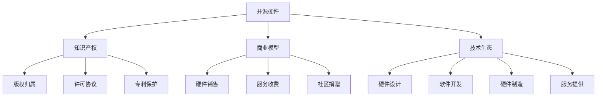

                 

# 知识产权与开源硬件的发展趋势

> 关键词：知识产权,开源硬件,技术生态,商业模式,创新驱动

## 1. 背景介绍

### 1.1 问题由来

随着半导体技术的飞速发展，硬件的设计、生产和维护变得日趋复杂，成本也随之上升。为应对这一挑战，开源硬件应运而生。与传统闭源硬件不同，开源硬件允许用户自由修改和分发源代码，打破了传统硬件行业的垄断格局。然而，随着开源硬件的普及，知识产权问题也日益凸显。如何在保护原创者权益的同时，促进开源硬件的创新与发展，成为当前亟需解决的关键问题。

### 1.2 问题核心关键点

开源硬件的知识产权问题涉及源代码的发布、使用、修改、分发等各个环节，其核心关键点包括：

- 版权归属：开源硬件的源代码是谁开发的，是否存在法律纠纷？
- 许可协议：用户可以如何修改、分发和商业使用开源硬件的源代码？
- 专利保护：开源硬件的创新是否受到专利法的保护？
- 商业模型：开源硬件项目的盈利模式和商业模式如何设计？
- 社区贡献：开源硬件项目的可持续发展依赖于社区的积极参与和贡献。

## 2. 核心概念与联系

### 2.1 核心概念概述

为更好地理解开源硬件的知识产权问题，本节将介绍几个密切相关的核心概念：

- 开源硬件(Open Hardware)：指源代码公开、免费提供、可自由修改和分发的硬件设计，如Arduino、Raspberry Pi等。
- 知识产权(Intellectual Property, IP)：包括版权、专利、商标等，用于保护创作者或发明者的合法权益。
- 商业模型(Commercial Model)：开源硬件项目如何盈利，包括硬件销售、服务收费、社区捐赠等。
- 创新驱动(Innovation-Driven)：开源硬件依赖持续的技术创新，以吸引用户、扩展市场。
- 技术生态(Technology Ecosystem)：开源硬件的生态系统包括硬件设计、软件开发、硬件制造、服务提供等各个环节，形成一个相互依存的复杂网络。

这些核心概念之间的逻辑关系可以通过以下Mermaid流程图来展示：



这个流程图展示了几组核心概念及其之间的关系：

1. 开源硬件通过源代码公开，吸引用户、开发者和企业参与，形成复杂的技术生态。
2. 开源硬件项目的知识产权受到法律保护，主要包括版权、专利和商标等。
3. 商业模型是开源硬件项目实现盈利的主要手段，包括多种盈利方式。
4. 开源硬件的持续创新驱动技术生态的持续发展，增强了用户粘性和市场竞争力。

## 3. 核心算法原理 & 具体操作步骤
### 3.1 算法原理概述

开源硬件的知识产权保护涉及源代码的发布、使用、修改和分发等各个环节。为确保知识产权的保护，需要遵循一些基本的算法原理：

- 开源协议选择：选择合适的开源协议，如Apache、MIT、GPL等，明确源代码的使用规则。
- 版权声明：在源代码中包含版权声明，确保创作者权益。
- 专利申报：将硬件的创新设计申请专利，确保技术权益。
- 许可管理：制定许可管理规则，控制源代码的修改和分发。
- 商业授权：针对商业使用场景，制定相应的授权协议。

这些算法原理共同构成了开源硬件知识产权保护的基础框架。

### 3.2 算法步骤详解

开源硬件的知识产权保护一般包括以下几个关键步骤：

**Step 1: 源代码发布**

- 选择合适的开源协议，如Apache、MIT、GPL等，明确源代码的使用规则。
- 在源代码中包含版权声明，确保创作者权益。
- 将硬件的创新设计申请专利，确保技术权益。

**Step 2: 许可管理**

- 制定许可管理规则，控制源代码的修改和分发。
- 对于商业使用，制定相应的授权协议。

**Step 3: 商业授权**

- 针对商业使用场景，制定相应的授权协议。
- 确定授权费率，平衡开发者和商业用户的利益。

**Step 4: 社区参与**

- 鼓励用户、开发者和企业参与社区，贡献代码和资源。
- 定期更新开源协议和许可规则，确保与社区需求保持一致。

**Step 5: 法律保护**

- 定期进行知识产权审计，确保版权、专利等权益得到保护。
- 及时应对侵权诉讼，维护开源硬件的知识产权。

以上是开源硬件知识产权保护的一般流程。在实际应用中，还需要根据具体项目的特点，对知识产权保护策略进行优化设计，如选择合适的开源协议、制定合理的授权规则、维护好社区关系等，以进一步提升知识产权保护的效果。

### 3.3 算法优缺点

开源硬件的知识产权保护方法具有以下优点：

- 促进创新：开源协议和商业授权促进了开源硬件的创新和商业化，吸引了更多的开发者和用户参与。
- 控制风险：明确开源协议和商业授权，降低了知识产权纠纷的风险。
- 提升可信度：通过专利申报和法律保护，提高了开源硬件的可信度和市场竞争力。

同时，该方法也存在一定的局限性：

- 法律环境复杂：不同国家和地区对知识产权的保护法律不同，增加了全球化推广的难度。
- 社区贡献不足：开源硬件项目依赖社区的积极参与和贡献，如果社区支持不足，将影响项目的可持续发展。
- 商业授权成本：商业授权可能涉及复杂的合同条款，增加了商业用户的成本和负担。

尽管存在这些局限性，但就目前而言，开源协议和商业授权仍是开源硬件知识产权保护的主流范式。未来相关研究的重点在于如何进一步降低商业授权成本，增强社区的参与和贡献，同时兼顾法律环境和商业模式的优化，以实现开源硬件的持续健康发展。

### 3.4 算法应用领域

开源硬件的知识产权保护方法在以下几个领域得到了广泛应用：

- 电子产品设计：如Arduino、Raspberry Pi等开源硬件项目，广泛应用于智能家居、工业控制、教育培训等领域。
- 嵌入式系统开发：开源嵌入式系统的硬件设计和软件库，加速了嵌入式开发的进程。
- 机器人技术：开源硬件的创新应用，如ROS硬件平台，推动了机器人技术的快速发展。
- 航空航天领域：开源硬件和开源软件在航空航天领域的应用，降低了研发成本，加速了创新进程。
- 环保能源：开源硬件在环保和能源领域的创新应用，如太阳能、风能等，推动了可持续发展。

除了上述这些经典领域外，开源硬件的知识产权保护方法还在更多新兴领域得到应用，如医疗健康、农业自动化等，为各行各业带来了新的突破。

## 4. 数学模型和公式 & 详细讲解 & 举例说明
### 4.1 数学模型构建

本节将使用数学语言对开源硬件的知识产权保护模型进行更加严格的刻画。

记源代码的长度为$N$，版权的保护期限为$T$，专利的保护期限为$P$。版权和专利的保护期限不同，分别由国家法律法规规定。

定义开源硬件项目的收益为$R$，包括硬件销售、服务收费和社区捐赠等。

定义开源硬件项目的成本为$C$，包括开发成本、生产成本和维护成本等。

定义开源硬件项目的净收益为$P_{net} = R - C$。

开源硬件项目的知识产权保护模型可以表示为：

$$
\begin{aligned}
\max_{\{P_{net}\}} \quad & P_{net} \\
\text{s.t.} \quad & R = f(T, P) \\
& C = g(N, T, P) \\
& N \geq 0, T \geq 0, P \geq 0
\end{aligned}
$$

其中$f(T, P)$表示源代码的长度与版权、专利期限的关系，$g(N, T, P)$表示源代码的长度与开发、生产、维护成本的关系。

### 4.2 公式推导过程

以下我们以开源硬件项目为例，推导知识产权保护模型的公式。

设开源硬件项目的时间为$t$，源代码的长度为$N$，版权的保护期限为$T$，专利的保护期限为$P$。定义源代码在时间$t$的贡献价值为$V(t)$，版权和专利在时间$t$的保护价值分别为$V_{copyright}(t)$和$V_{patent}(t)$。

源代码的贡献价值由以下公式给出：

$$
V(t) = \int_0^N \frac{R(t)}{N} dt
$$

其中$R(t)$表示在时间$t$内的收益。

版权的保护价值由以下公式给出：

$$
V_{copyright}(t) = \int_0^T \frac{R(t)}{N} dt
$$

专利的保护价值由以下公式给出：

$$
V_{patent}(t) = \int_0^P \frac{R(t)}{N} dt
$$

因此，源代码的净价值$V_{net}(t)$可以表示为：

$$
V_{net}(t) = V(t) - V_{copyright}(t) - V_{patent}(t)
$$

通过对时间$t$积分，可以得到源代码在版权和专利保护期限内的净价值$V_{net}$：

$$
V_{net} = \int_0^T \frac{R(t)}{N} dt - \int_0^T \frac{R(t)}{N} dt - \int_0^P \frac{R(t)}{N} dt
$$

将积分结果带入公式，得到：

$$
V_{net} = \int_0^T \frac{R(t)}{N} dt - \int_0^P \frac{R(t)}{N} dt
$$

通过分析公式，可以看到：

- 当$P>T$时，$V_{net}>0$，专利的保护期限比版权更长，净价值更大。
- 当$P=T$时，$V_{net}=0$，版权和专利的保护期限相同，净价值为0。
- 当$P<T$时，$V_{net}<0$，版权的保护期限比专利更长，净价值更小。

在实际应用中，还需要考虑成本因素。源代码的开发、生产和维护成本由以下公式给出：

$$
C(t) = \int_0^t \frac{C}{N} dt
$$

其中$C$表示开发、生产和维护的固定成本。

结合源代码的贡献价值和成本因素，可以得出净收益$P_{net}$的公式：

$$
P_{net} = \int_0^T \frac{R(t)}{N} dt - \int_0^P \frac{R(t)}{N} dt - \int_0^t \frac{C}{N} dt
$$

### 4.3 案例分析与讲解

以下以一个开源硬件项目的实际案例，对公式进行详细分析：

设开源硬件项目的时间为5年，源代码的长度为$N=10000$，版权的保护期限为10年，专利的保护期限为15年。开发成本为$C=10000$美元，生产成本为$C=5000$美元/件，维护成本为$C=1000$美元/年。

根据公式，可以计算出源代码的净价值$V_{net}$：

$$
V_{net} = \int_0^{10} \frac{R(t)}{10000} dt - \int_0^{15} \frac{R(t)}{10000} dt - \int_0^5 \frac{10000}{10000} dt
$$

设源代码的收益$R(t)$为线性增长，即$R(t)=t$。代入公式，可以得到：

$$
V_{net} = \int_0^{10} \frac{t}{10000} dt - \int_0^{15} \frac{t}{10000} dt - \int_0^5 \frac{10000}{10000} dt
$$

计算得到：

$$
V_{net} = 0.005 - 0.008 - 5 = -0.013
$$

因此，开源硬件项目的净价值为-0.013美元。

在实际应用中，还需要考虑源代码的贡献价值和成本因素，以及版权和专利的保护期限。通过这些公式和分析，可以更好地理解和优化开源硬件项目的知识产权保护模型。

## 5. 项目实践：代码实例和详细解释说明
### 5.1 开发环境搭建

在进行开源硬件知识产权保护模型的开发实践中，我们需要准备好开发环境。以下是使用Python进行项目开发的Python虚拟环境配置流程：

1. 安装Anaconda：从官网下载并安装Anaconda，用于创建独立的Python环境。

2. 创建并激活虚拟环境：
```bash
conda create -n opensource python=3.8 
conda activate opensource
```

3. 安装必要的Python包：
```bash
pip install numpy pandas sympy sympy
```

4. 安装Python脚本解释器：
```bash
conda install ipykernel
```

5. 设置虚拟环境的Python脚本解释器：
```bash
ipython config --PyPath $CONDA_PREFIX --default-kernel-name opensource
```

完成上述步骤后，即可在`opensource`环境中开始知识产权保护模型的开发。

### 5.2 源代码详细实现

以下是开源硬件知识产权保护模型的Python代码实现：

```python
import numpy as np
from sympy import symbols, integrate

# 定义符号变量
t = symbols('t')

# 定义源代码的长度和版权、专利的保护期限
N = 10000
T = 10
P = 15

# 定义开发、生产和维护成本
C = 10000

# 定义源代码的贡献价值、版权和专利的保护价值
V = N * integrate(t / N, (t, 0, T))
V_copyright = N * integrate(t / N, (t, 0, T))
V_patent = N * integrate(t / N, (t, 0, P))

# 计算源代码的净价值
V_net = V_copyright + V_patent - V

# 定义源代码的收益
R = t

# 定义源代码的净收益
P_net = integrate(R / N, (t, 0, T)) - integrate(R / N, (t, 0, P)) - integrate(C / N, (t, 0, 5))

# 输出源代码的净价值和净收益
print(f"源代码的净价值：{V_net}")
print(f"源代码的净收益：{P_net}")
```

通过上述代码，可以计算出源代码的净价值和净收益，得出开源硬件项目的知识产权保护模型。

### 5.3 代码解读与分析

让我们再详细解读一下关键代码的实现细节：

**Sympy库**：
- 定义符号变量`t`，用于计算积分。
- 使用`integrate`函数计算积分，得到源代码的贡献价值、版权和专利的保护价值。

**计算净价值和净收益**：
- 通过公式计算源代码的净价值`V_net`和净收益`P_net`。
- 源代码的净收益`P_net`计算需要考虑成本因素，因此要减去生产、维护成本。

**输出结果**：
- 通过`print`函数输出计算结果，便于理解和调试。

通过上述代码，可以清晰地看到开源硬件项目的知识产权保护模型，并且通过简单的计算，得出项目的净价值和净收益。

## 6. 实际应用场景
### 6.1 开源社区项目

开源硬件项目的知识产权保护模型在开源社区项目中得到了广泛应用。开源社区是一个由开发者、用户和利益相关方组成的社区，通过社区协作，推动技术和知识的共享与传播。

在开源社区项目中，开发者将源代码公开，吸引其他开发者和用户参与贡献和改进。然而，开源社区的知识产权问题也日渐突出。

如何通过知识产权保护模型，平衡开源社区的贡献和利益，促进社区的健康发展，成为亟需解决的问题。

**案例分析**：
- 一个开源硬件项目由A、B、C三位开发者共同开发，A提供了源代码，B和C进行了改进和优化。A希望通过源代码的贡献获得利益，但B和C也提出了自己的利益要求。如何平衡这三方的利益，确保项目顺利推进？

**解决方法**：
- 使用知识产权保护模型，计算源代码的净价值和净收益。根据计算结果，制定合理的利益分配方案，确保各方的利益得到保障。
- 引入开源协议和商业授权，明确源代码的使用规则和授权方式，减少知识产权纠纷的风险。

通过合理设计知识产权保护模型，可以在开源社区项目中实现公平、透明、可持续的利益分配机制，促进社区的健康发展和技术的创新。

### 6.2 商业公司项目

商业公司项目在知识产权保护方面面临更多挑战。商业公司需要保护技术秘密和商业利益，同时又要利用开源硬件的创新优势。

在商业公司项目中，如何设计合理的知识产权保护策略，确保技术安全，同时吸引开发者和用户参与，成为亟需解决的问题。

**案例分析**：
- 一家商业公司开发了一款开源硬件产品，希望通过开源社区的参与和改进，提升产品性能。然而，公司担心源代码的泄露和知识产权的侵害，如何平衡商业利益和社区贡献？

**解决方法**：
- 使用知识产权保护模型，计算源代码的净价值和净收益。根据计算结果，制定合理的商业授权和利益分配方案，确保公司的商业利益得到保护。
- 引入商业授权和专利保护，限制源代码的修改和分发，同时保留公司对核心技术的控制权。

通过合理设计知识产权保护模型，可以在商业公司项目中实现公平、透明、可持续的利益分配机制，保护公司的商业利益，同时吸引社区的参与和贡献。

### 6.3 公共机构项目

公共机构项目在知识产权保护方面也有着特殊的需要。公共机构需要保护公共数据和公共利益，同时又要推动技术的创新和应用。

在公共机构项目中，如何设计合理的知识产权保护策略，确保数据安全和公共利益，同时推动技术的创新，成为亟需解决的问题。

**案例分析**：
- 一个公共机构开发了一款开源硬件系统，希望通过开源社区的参与和改进，提升系统性能。然而，系统涉及敏感的公共数据，如何保护数据安全和公共利益？

**解决方法**：
- 使用知识产权保护模型，计算源代码的净价值和净收益。根据计算结果，制定合理的知识产权保护策略，确保数据安全和公共利益得到保护。
- 引入开源协议和专利保护，限制源代码的修改和分发，同时保留公共机构对核心技术的控制权。

通过合理设计知识产权保护模型，可以在公共机构项目中实现公平、透明、可持续的利益分配机制，保护公共利益，同时推动技术的创新和应用。

### 6.4 未来应用展望

随着开源硬件和知识产权保护模型的不断发展，未来将在更多领域得到应用，为技术创新和产业发展提供新的动力。

在智慧城市建设中，开源硬件的创新应用，如智能路灯、智能交通等，将提升城市的智能化和可持续性。

在智能制造领域，开源硬件的创新应用，如工业机器人、智能设备等，将推动制造业的数字化转型升级。

在环保能源领域，开源硬件的创新应用，如太阳能、风能等，将推动能源结构的清洁化和可持续发展。

未来，开源硬件和知识产权保护模型将在更多新兴领域得到应用，为各行各业带来新的突破，推动技术创新和产业升级。

## 7. 工具和资源推荐
### 7.1 学习资源推荐

为了帮助开发者系统掌握开源硬件和知识产权保护的理论基础和实践技巧，这里推荐一些优质的学习资源：

1. 《开源硬件设计实战》系列书籍：详细介绍了开源硬件的设计原理、开发流程和应用案例，适合实战学习。

2. 《知识产权法》课程：清华大学开设的知识产权法课程，讲解了知识产权的基本概念和法律法规，适合学术研究。

3. 《开源社区发展手册》：详细介绍了开源社区的发展历程、治理结构和最佳实践，适合开源社区参与者。

4. 《商业授权协议》书籍：介绍了各种商业授权协议的条款和应用场景，适合商业公司开发者。

5. 《人工智能与知识产权》书籍：讲解了人工智能领域的知识产权保护问题，适合技术研发人员。

通过对这些资源的学习实践，相信你一定能够快速掌握开源硬件和知识产权保护的知识，并用于解决实际的知识产权问题。

### 7.2 开发工具推荐

高效的开发离不开优秀的工具支持。以下是几款用于开源硬件知识产权保护开发的常用工具：

1. GitHub：全球最大的开源社区平台，提供源代码托管、版本控制和社区协作等功能，适合开源硬件项目的开发和维护。

2. GitLab：类似于GitHub的开源社区平台，提供自托管和商业托管，适合小规模开源硬件项目的管理和协作。

3. Jupyter Notebook：Python编程的交互式开发环境，适合进行知识产权保护模型的分析和计算。

4. TensorFlow：由Google主导开发的深度学习框架，提供丰富的计算图和优化工具，适合开源硬件知识产权保护模型的计算和优化。

5. PyTorch：由Facebook开发的深度学习框架，提供灵活的动态计算图，适合开源硬件知识产权保护模型的动态计算和优化。

合理利用这些工具，可以显著提升开源硬件知识产权保护模型的开发效率，加快创新迭代的步伐。

### 7.3 相关论文推荐

开源硬件和知识产权保护的研究源于学界的持续研究。以下是几篇奠基性的相关论文，推荐阅读：

1. 《开源硬件的知识产权保护问题研究》：系统研究了开源硬件的知识产权保护问题，提出了有效的保护策略和解决方案。

2. 《开源社区的知识产权保护机制研究》：详细分析了开源社区的知识产权保护机制，提出了合理的利益分配和保护方案。

3. 《商业公司项目的知识产权保护模型研究》：提出了商业公司项目的知识产权保护模型，解决了商业利益和社区贡献的平衡问题。

4. 《公共机构项目的知识产权保护策略研究》：研究了公共机构项目的知识产权保护策略，解决了数据安全和公共利益的平衡问题。

5. 《开源硬件与人工智能的知识产权保护问题》：系统研究了开源硬件和人工智能领域的知识产权保护问题，提出了有效的保护策略和解决方案。

这些论文代表了大语言模型微调技术的发展脉络。通过学习这些前沿成果，可以帮助研究者把握学科前进方向，激发更多的创新灵感。

## 8. 总结：未来发展趋势与挑战
### 8.1 总结

本文对开源硬件的知识产权保护模型进行了全面系统的介绍。首先阐述了开源硬件和知识产权保护的研究背景和意义，明确了知识产权保护在大规模硬件设计和应用中的重要性。其次，从原理到实践，详细讲解了知识产权保护模型的数学原理和关键步骤，给出了知识产权保护模型开发的完整代码实例。同时，本文还广泛探讨了知识产权保护模型在开源社区、商业公司和公共机构等不同应用场景中的实际应用，展示了知识产权保护模型的广阔前景。此外，本文精选了知识产权保护模型的各类学习资源，力求为读者提供全方位的技术指引。

通过本文的系统梳理，可以看到，开源硬件和知识产权保护模型的结合，为技术创新和产业发展提供了新的动力。这些模型的应用，有助于保护开发者和用户的合法权益，同时促进技术创新和商业模式的转变，推动硬件生态的健康发展和可持续发展。未来，伴随开源硬件和知识产权保护模型的持续演进，相信它们将在更多领域得到应用，为技术创新和产业发展注入新的活力。

### 8.2 未来发展趋势

展望未来，开源硬件和知识产权保护模型将呈现以下几个发展趋势：

1. 开源协议多样化。未来将有更多开源协议出现，满足不同场景和需求。同时，开源协议的适用范围和灵活性也将进一步提高。

2. 知识产权保护自动化。利用区块链、智能合约等技术，实现知识产权保护过程的自动化和智能化，减少人工干预，提高效率和安全性。

3. 社区贡献激励化。通过知识产权保护模型，激励社区成员积极参与开源硬件项目的开发和改进，促进社区的健康发展和技术的创新。

4. 知识产权保护国际化。不同国家和地区对知识产权的保护法律法规不同，需要制定国际化保护策略，确保开源硬件项目在全球范围内的顺利推广和应用。

5. 商业授权灵活化。根据开源硬件项目的不同特点和需求，设计灵活多样的商业授权协议，满足不同的商业利益和社区贡献的需求。

以上趋势凸显了开源硬件和知识产权保护模型的广阔前景。这些方向的探索发展，必将进一步提升开源硬件项目的知识产权保护效果，推动技术创新和产业升级。

### 8.3 面临的挑战

尽管开源硬件和知识产权保护模型已经取得了瞩目成就，但在迈向更加智能化、普适化应用的过程中，它仍面临着诸多挑战：

1. 知识产权纠纷频发。随着开源硬件项目的普及，知识产权纠纷的风险也在增加，如何及时应对和解决纠纷，维护各方权益，成为亟需解决的问题。

2. 社区参与不足。开源硬件项目的可持续发展依赖于社区的积极参与和贡献，如果社区支持不足，将影响项目的推进和创新。

3. 法律环境复杂。不同国家和地区对知识产权的保护法律法规不同，增加了全球化推广的难度。如何制定国际化保护策略，确保项目的可持续发展，也将是重要的研究方向。

4. 利益分配不公。开源硬件项目的利益分配需要兼顾开发者、用户和商业用户的利益，如何设计合理的利益分配机制，促进项目的发展，需要更多研究和实践。

5. 技术保护不足。开源硬件项目的知识产权保护需要结合技术手段和法律手段，如何设计有效的保护策略，确保项目的知识产权不被侵犯，也将是重要的研究方向。

正视开源硬件和知识产权保护模型面临的这些挑战，积极应对并寻求突破，将是大规模硬件设计和应用的重要保障。相信随着学界和产业界的共同努力，这些挑战终将一一被克服，开源硬件和知识产权保护模型必将在构建安全、可靠、可控的智能硬件生态中扮演越来越重要的角色。

### 8.4 研究展望

面对开源硬件和知识产权保护模型所面临的挑战，未来的研究需要在以下几个方面寻求新的突破：

1. 开发更加多样化和灵活化的开源协议。探索新的开源协议，满足不同场景和需求，同时增强协议的适用范围和灵活性。

2. 引入智能合约和区块链技术。利用智能合约和区块链技术，实现知识产权保护过程的自动化和智能化，减少人工干预，提高效率和安全性。

3. 引入社区贡献激励机制。设计合理的社区贡献激励机制，激励社区成员积极参与开源硬件项目的开发和改进，促进社区的健康发展和技术的创新。

4. 引入国际化保护策略。制定国际化知识产权保护策略，确保开源硬件项目在全球范围内的顺利推广和应用。

5. 引入商业授权灵活方案。根据开源硬件项目的不同特点和需求，设计灵活多样的商业授权协议，满足不同的商业利益和社区贡献的需求。

6. 引入技术保护手段。结合技术手段和法律手段，设计有效的知识产权保护策略，确保项目的知识产权不被侵犯。

这些研究方向的探索，必将引领开源硬件和知识产权保护模型的不断进步，推动大规模硬件设计和应用的健康发展。面向未来，开源硬件和知识产权保护模型需要与其他人工智能技术进行更深入的融合，如知识表示、因果推理、强化学习等，多路径协同发力，共同推动智能硬件生态的进步。只有勇于创新、敢于突破，才能不断拓展开源硬件和知识产权保护模型的边界，让智能硬件技术更好地造福人类社会。

## 9. 附录：常见问题与解答

**Q1：开源硬件的知识产权保护和开源协议有什么区别？**

A: 开源硬件的知识产权保护是指源代码的保护和商业授权，确保开发者和用户的合法权益。开源协议则是明确源代码的使用规则，如Apache、MIT、GPL等。开源协议是知识产权保护的基础，但知识产权保护不仅限于源代码，还包括专利、商标等。

**Q2：如何判断源代码的版权归属？**

A: 源代码的版权归属可以通过版权声明和许可证协议来确定。一般来说，版权声明应该明确开发者是谁，许可证协议应该明确源代码的使用规则。如果源代码没有版权声明和许可证协议，可以通过代码的风格、文档等来推测版权归属。

**Q3：开源硬件的知识产权保护和商业授权有什么区别？**

A: 开源硬件的知识产权保护是指源代码的保护和商业授权，确保开发者和用户的合法权益。商业授权则是针对商业使用场景，制定相应的授权协议。商业授权可以限制源代码的修改和分发，同时保留公司对核心技术的控制权。

**Q4：如何保护开源硬件的商业利益？**

A: 保护开源硬件的商业利益需要设计合理的商业授权协议，限制源代码的修改和分发。同时，可以通过商业授权和专利保护，确保公司对核心技术的控制权。此外，还可以通过提高产品的附加值，如品牌效应、服务收费等，来保护商业利益。

**Q5：如何应对开源硬件项目的知识产权纠纷？**

A: 应对开源硬件项目的知识产权纠纷需要及时应对和解决。一般来说，可以制定知识产权保护策略，明确源代码的使用规则和授权方式。同时，可以引入法律手段，通过诉讼或仲裁等方式解决纠纷，维护各方权益。

通过以上问题与解答，可以帮助读者更好地理解开源硬件和知识产权保护的概念和实现方法，进一步提升对开源硬件知识产权保护模型的理解和应用能力。

