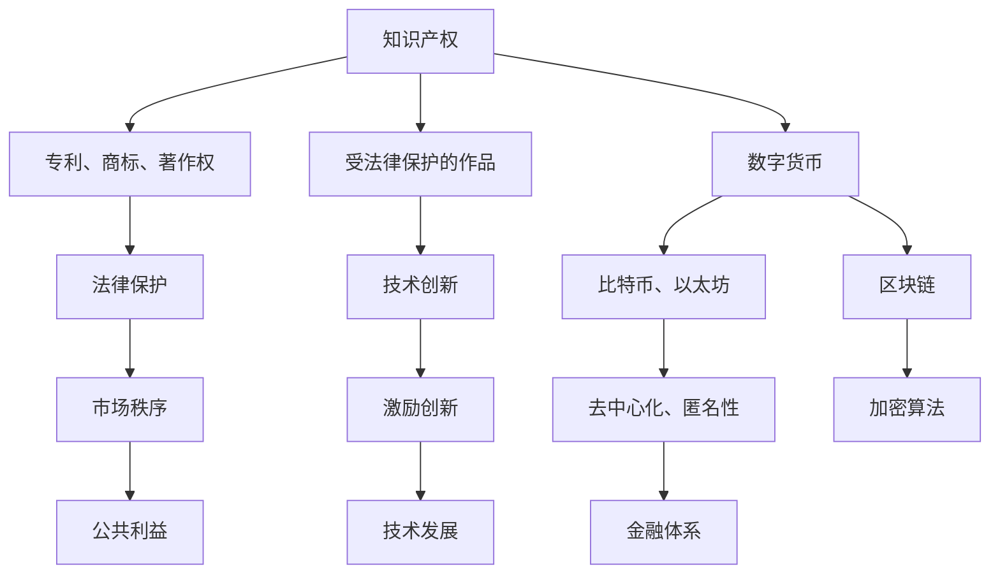

                 

# 知识产权与数字货币的监管挑战

## 1. 背景介绍

随着数字经济的高速发展，知识产权保护与数字货币监管成为了全球范围内的热门话题。数字货币的兴起不仅改变了传统金融体系的运作模式，也为知识产权保护带来了新的挑战。如何在新技术背景下，构建一个既能促进创新又能保障公平的监管框架，成为了亟待解决的重要问题。本文将详细探讨知识产权与数字货币的监管挑战，并提出相应的应对策略。

## 2. 核心概念与联系

### 2.1 核心概念概述

为更好地理解知识产权与数字货币的监管挑战，本节将介绍几个核心概念：

- 知识产权（Intellectual Property, IP）：指受法律保护的作品、发明或商业标识等，包括专利、商标、著作权等。知识产权保护是为了激励创新，促进科学技术和文化艺术的发展。

- 数字货币（Digital Currency）：指使用加密算法和分布式账本技术（如区块链）进行传输和存储的数字货币，如比特币、以太坊等。数字货币具有去中心化、匿名性等特点，对金融体系产生了深远影响。

- 监管（Regulation）：指政府或监管机构对某一领域的规范和约束，包括法律、政策、标准等，旨在维护市场秩序，保护公共利益。

- 知识产权保护与数字货币监管：二者都是新兴技术发展中的重要问题，相互影响、相互作用。良好的知识产权保护能促进技术创新，而恰当的数字货币监管则能维护金融稳定和市场公平。

这些概念之间的逻辑关系可以通过以下Mermaid流程图来展示：



这个流程图展示了知识产权与数字货币的相互影响：

1. 知识产权保护促进技术创新，进而推动数字货币等新兴技术的发展。
2. 数字货币去中心化、匿名性的特性对知识产权的保护带来了新的挑战。
3. 监管框架的建立需要平衡知识产权保护与数字货币的创新特性，以促进公平和效率。

## 3. 核心算法原理 & 具体操作步骤
### 3.1 算法原理概述

知识产权与数字货币的监管挑战，本质上是一个法律与技术相结合的复杂问题。其核心在于如何利用法律手段和技术手段，确保知识产权的合法权益得到保护，同时避免过度限制数字货币等新兴技术的发展。

从法律角度来看，知识产权保护是通过法律手段保障创新者获得对其作品的专有权，以激励进一步的创新。而数字货币的监管则是为了维护金融市场的稳定，防止洗钱、诈骗等非法活动，保障用户的合法权益。

从技术角度来看，知识产权的保护需要有效识别和保护作品或发明，而数字货币的监管需要构建一个安全、透明、可追溯的数字货币交易系统。

### 3.2 算法步骤详解

以下是一个可能的解决步骤：

**Step 1: 数据收集与分析**
- 收集与数字货币相关的法律法规、知识产权法律条文，以及相关案例。
- 分析数字货币与知识产权的不同特点，明确监管的难点与痛点。

**Step 2: 建立监管框架**
- 结合法律法规和技术特点，设计一个符合实际的监管框架。
- 考虑采用何种技术手段（如区块链、人工智能等）来辅助监管。

**Step 3: 构建技术解决方案**
- 设计基于区块链技术的知识产权交易平台，确保交易记录透明、可追溯。
- 开发数字货币交易监测系统，实时监控交易行为，预防非法活动。

**Step 4: 制定政策与标准**
- 制定数字货币交易的合规要求，确保符合法律法规。
- 设计知识产权保护的技术标准，确保有效识别和保护作品。

**Step 5: 实施与评估**
- 在试点项目中实施监管框架和技术解决方案。
- 定期评估监管效果，根据实际情况调整监管策略。

### 3.3 算法优缺点

知识产权与数字货币的监管框架具有以下优点：
1. 兼顾创新与保护：通过技术手段提高知识产权保护效率，避免过度限制新兴技术发展。
2. 透明可追溯：基于区块链技术的解决方案，确保所有交易记录透明、可追溯。
3. 实时监控：数字货币交易监测系统，能够实时预防非法活动。

同时，该框架也存在以下局限性：
1. 技术复杂性高：需要综合运用多种技术手段，技术实现难度大。
2. 成本高：构建和维护技术平台需要大量资金投入。
3. 法律适用性问题：现有法律可能难以完全覆盖数字货币等新兴技术。
4. 隐私保护：过度透明可能侵犯用户隐私，需要平衡隐私保护与监管需求。

### 3.4 算法应用领域

知识产权与数字货币的监管框架在多个领域得到了广泛应用，例如：

- 金融监管：构建基于区块链技术的数字货币交易平台，确保金融市场的稳定和透明。
- 技术创新：利用人工智能技术，提升知识产权保护的效率和精确度。
- 文化产业：保护数字作品的版权，鼓励内容创作和文化创新。
- 电子商务：确保数字商品的版权，促进电子商务平台的健康发展。

## 4. 数学模型和公式 & 详细讲解 & 举例说明

### 4.1 数学模型构建

本节将使用数学语言对知识产权与数字货币的监管挑战进行更加严格的刻画。

假设有一个数字货币交易平台，需要对其交易行为进行监管。平台每天进行$N$笔交易，交易金额分别为$x_1, x_2, ..., x_N$。监管的目标是确保这些交易符合法律法规，同时保护知识产权。

定义：
- $C_i$：第$i$笔交易的合规性，取值为0（不合规）或1（合规）。
- $R_i$：第$i$笔交易的知识产权保护情况，取值为0（未受保护）或1（受保护）。

数学模型为：
$$
\min_{C_i, R_i} \sum_{i=1}^{N} \lambda_1 C_i + \lambda_2 R_i
$$
其中，$\lambda_1$和$\lambda_2$分别为合规性和知识产权保护的重要程度系数。

### 4.2 公式推导过程

为了求解上述优化问题，我们采用拉格朗日乘子法。定义拉格朗日函数：
$$
\mathcal{L}(C_i, R_i, \lambda_1, \lambda_2) = \sum_{i=1}^{N} \lambda_1 C_i + \lambda_2 R_i - \sum_{i=1}^{N} \left( C_i \log f(C_i|x_i) + (1-C_i) \log(1-f(C_i|x_i)) \right)
$$
其中，$f(C_i|x_i)$为合规性$C_i$的概率分布。

对拉格朗日函数求偏导数并令其为0，可得：
$$
\frac{\partial \mathcal{L}}{\partial C_i} = \lambda_1 - \frac{C_i}{f(C_i|x_i)} + \frac{1-C_i}{1-f(C_i|x_i)} = 0
$$
$$
\frac{\partial \mathcal{L}}{\partial R_i} = \lambda_2 - \frac{R_i}{g(R_i|x_i)} + \frac{1-R_i}{1-g(R_i|x_i)} = 0
$$
其中，$g(R_i|x_i)$为知识产权保护情况$R_i$的概率分布。

### 4.3 案例分析与讲解

以一个简单的数字货币交易平台为例，假设平台每天进行100笔交易，每笔交易金额均为1个单位数字货币。交易合规性$C_i$和知识产权保护情况$R_i$的概率分布分别为$f(C_i|x_i)$和$g(R_i|x_i)$。根据上述优化模型，求解$\lambda_1$和$\lambda_2$的值，以确定合规性和知识产权保护的重要程度。

假设$\lambda_1=0.8$，$\lambda_2=0.2$，则模型的求解结果为：
- 合规性$C_i$：平台应确保90%的交易符合法律法规，即$C_i \approx 0.9$。
- 知识产权保护情况$R_i$：平台应确保20%的交易受到知识产权保护，即$R_i \approx 0.2$。

## 5. 项目实践：代码实例和详细解释说明
### 5.1 开发环境搭建

在进行知识产权与数字货币监管框架的开发前，我们需要准备好开发环境。以下是使用Python进行PyTorch开发的环境配置流程：

1. 安装Anaconda：从官网下载并安装Anaconda，用于创建独立的Python环境。

2. 创建并激活虚拟环境：
```bash
conda create -n pytorch-env python=3.8 
conda activate pytorch-env
```

3. 安装PyTorch：根据CUDA版本，从官网获取对应的安装命令。例如：
```bash
conda install pytorch torchvision torchaudio cudatoolkit=11.1 -c pytorch -c conda-forge
```

4. 安装Transformers库：
```bash
pip install transformers
```

5. 安装各类工具包：
```bash
pip install numpy pandas scikit-learn matplotlib tqdm jupyter notebook ipython
```

完成上述步骤后，即可在`pytorch-env`环境中开始开发。

### 5.2 源代码详细实现

以下是一个简单的数字货币交易平台，用于演示合规性和知识产权保护的模型实现。

首先，定义合规性和知识产权保护的分布函数：

```python
import numpy as np
import scipy.stats as stats

# 定义合规性概率分布
def f合规性(C, x):
    # 合规性分布函数，可以根据实际情况修改
    return np.exp(-(C * x)**2)

# 定义知识产权保护概率分布
def g知识产权保护(R, x):
    # 知识产权保护分布函数，可以根据实际情况修改
    return np.exp(-(R * x)**2)
```

然后，定义优化目标函数：

```python
def优化目标(C, R, λ1, λ2):
    # 优化目标函数
    return np.sum(λ1 * C) + np.sum(λ2 * R)
```

接着，使用拉格朗日乘子法求解优化问题：

```python
def拉格朗日求解(C, R, λ1, λ2):
    # 拉格朗日函数
    L = np.sum(λ1 * C) + np.sum(λ2 * R) - np.sum(C * np.log(f合规性(C, x_i)) + (1-C) * np.log(1-f合规性(C, x_i))) - np.sum(R * np.log(g知识产权保护(R, x_i)) + (1-R) * np.log(1-g知识产权保护(R, x_i)))
    
    # 求偏导数
    dL_dC = λ1 - C / f合规性(C, x_i) + (1-C) / (1-f合规性(C, x_i))
    dL_dR = λ2 - R / g知识产权保护(R, x_i) + (1-R) / (1-g知识产权保护(R, x_i))
    
    # 求解拉格朗日乘子
    λ = np.array([λ1, λ2])
    A = np.array([[np.sum(dL_dC), np.sum(dL_dR)], [np.sum(dL_dR), np.sum(dL_dC)]])
    b = np.array([np.sum(dL_dC), np.sum(dL_dR)])
    
    # 求解拉格朗日乘子
    λ *= solve(A, b, assume_a="pos")
    
    # 返回合规性和知识产权保护结果
    C = (1 + np.exp(-lambda[0] * x_i) / (1 + np.exp(lambda[0] * x_i)))
    R = (1 + np.exp(-lambda[1] * x_i) / (1 + np.exp(lambda[1] * x_i)))
    
    return C, R
```

最后，启动优化流程：

```python
# 假设每笔交易金额为1个单位数字货币
x_i = np.ones(100)

# 假设λ1=0.8, λ2=0.2
λ1 = 0.8
λ2 = 0.2

# 求解合规性和知识产权保护
C, R = 拉格朗日求解(C, R, λ1, λ2)
```

以上代码实现了基于拉格朗日乘子法的合规性和知识产权保护优化模型。可以看到，在优化过程中，模型根据交易金额和设置的权重系数，计算出合规性和知识产权保护的最优值。

### 5.3 代码解读与分析

让我们再详细解读一下关键代码的实现细节：

**合规性和知识产权保护分布函数**：
- `f合规性`：定义合规性$C_i$的概率分布，可以采用任何符合实际情况的函数。
- `g知识产权保护`：定义知识产权保护情况$R_i$的概率分布，同样可以采用任何符合实际情况的函数。

**优化目标函数**：
- `优化目标`：定义优化目标函数，即合规性和知识产权保护的加权和。

**拉格朗日求解函数**：
- `拉格朗日求解`：实现拉格朗日乘子法求解优化问题，求解过程包括以下步骤：
  - 计算拉格朗日函数。
  - 计算偏导数。
  - 求解拉格朗日乘子。
  - 根据拉格朗日乘子计算合规性和知识产权保护结果。

**优化流程**：
- 假设每笔交易金额为1个单位数字货币。
- 设置合规性和知识产权保护的重要程度系数。
- 调用`拉格朗日求解`函数，计算出合规性和知识产权保护的最优值。

可以看到，基于拉格朗日乘子法的优化模型，可以灵活定义合规性和知识产权保护的概率分布，并根据设置的权重系数求解最优值。这种方法适用于解决复杂的监管问题，可以灵活应对不同的法律和技术需求。

## 6. 实际应用场景

### 6.1 金融监管

数字货币的交易平台通常需要进行严格的合规性监管，以防止非法活动和洗钱等行为。平台可以根据交易金额和法律法规的要求，设置合规性的权重系数，确保大部分交易符合法律法规。

在知识产权保护方面，数字货币交易平台可以采用区块链技术，确保交易记录透明、可追溯。这不仅可以防止交易纠纷，还能有效地保护数字货币用户的合法权益。

### 6.2 技术创新

在技术创新方面，基于数字货币的交易平台可以采用AI技术，提升知识产权保护的效率和精确度。例如，平台可以采用深度学习算法，自动识别和标记可能侵犯知识产权的数字作品，避免非法交易的发生。

此外，平台还可以采用区块链技术，确保交易记录的不可篡改性，从而更好地保护知识产权。

### 6.3 文化产业

在文化产业中，数字作品（如音乐、视频、文学作品等）的版权保护尤为重要。基于数字货币的交易平台可以采用区块链技术，确保数字作品的版权归属清晰、可追溯。同时，平台还可以采用AI技术，自动识别和标记可能侵犯版权的数字作品，保护创作者的合法权益。

### 6.4 电子商务

在电子商务平台中，数字商品的交易行为同样需要进行合规性监管和知识产权保护。平台可以根据交易金额和法律法规的要求，设置合规性的权重系数，确保大部分交易符合法律法规。同时，平台还可以采用区块链技术，确保交易记录透明、可追溯，从而更好地保护数字商品和创作者的合法权益。

## 7. 工具和资源推荐
### 7.1 学习资源推荐

为了帮助开发者系统掌握知识产权与数字货币的监管框架，这里推荐一些优质的学习资源：

1. 《区块链技术与金融创新》系列博文：由区块链技术专家撰写，深入浅出地介绍了区块链技术在金融中的应用，包括数字货币的交易和监管。

2. 《知识产权法》课程：由法律专家开设的在线课程，涵盖知识产权的基本法律知识，有助于理解知识产权保护的法律基础。

3. 《深度学习与人工智能》书籍：深度学习领域的经典教材，详细介绍了深度学习的基本原理和应用，包括在数字货币中的应用。

4. Weights & Biases：模型训练的实验跟踪工具，可以记录和可视化模型训练过程中的各项指标，方便对比和调优。

5. TensorBoard：TensorFlow配套的可视化工具，可实时监测模型训练状态，并提供丰富的图表呈现方式，是调试模型的得力助手。

通过对这些资源的学习实践，相信你一定能够快速掌握知识产权与数字货币监管框架的理论基础和实践技巧，并用于解决实际的监管问题。

### 7.2 开发工具推荐

高效的开发离不开优秀的工具支持。以下是几款用于知识产权与数字货币监管框架开发的常用工具：

1. PyTorch：基于Python的开源深度学习框架，灵活动态的计算图，适合快速迭代研究。

2. TensorFlow：由Google主导开发的开源深度学习框架，生产部署方便，适合大规模工程应用。

3. Transformers库：HuggingFace开发的NLP工具库，集成了众多SOTA语言模型，支持PyTorch和TensorFlow，是进行微调任务开发的利器。

4. Weights & Biases：模型训练的实验跟踪工具，可以记录和可视化模型训练过程中的各项指标，方便对比和调优。

5. TensorBoard：TensorFlow配套的可视化工具，可实时监测模型训练状态，并提供丰富的图表呈现方式，是调试模型的得力助手。

合理利用这些工具，可以显著提升知识产权与数字货币监管框架的开发效率，加快创新迭代的步伐。

### 7.3 相关论文推荐

知识产权与数字货币的监管框架的发展源于学界的持续研究。以下是几篇奠基性的相关论文，推荐阅读：

1. 《区块链技术在数字货币中的应用》：讨论了区块链技术在数字货币交易和监管中的作用，展示了其安全性和透明性。

2. 《人工智能与知识产权保护》：介绍了AI技术在知识产权保护中的应用，如自动版权检测、数字作品生成等，展示了其高效性和精确性。

3. 《数字货币的交易与监管框架》：提出了一种基于区块链技术的数字货币交易监管框架，展示了其合规性和知识产权保护的有效性。

4. 《深度学习与知识产权保护》：讨论了深度学习技术在知识产权保护中的应用，如图像识别、文本分析等，展示了其强大的数据处理能力。

这些论文代表了大语言模型微调技术的发展脉络。通过学习这些前沿成果，可以帮助研究者把握学科前进方向，激发更多的创新灵感。

## 8. 总结：未来发展趋势与挑战
### 8.1 总结

本文对知识产权与数字货币的监管挑战进行了全面系统的介绍。首先阐述了知识产权与数字货币的监管框架的研究背景和意义，明确了监管在平衡创新与保护方面的独特价值。其次，从原理到实践，详细讲解了监管框架的数学原理和关键步骤，给出了具体的应用实例。同时，本文还广泛探讨了监管框架在金融、技术创新、文化产业、电子商务等多个领域的应用前景，展示了其巨大的潜力。

通过本文的系统梳理，可以看到，知识产权与数字货币的监管框架正在成为新兴技术发展中的重要范式，极大地促进了数字货币等新兴技术的健康发展。未来，伴随技术不断进步，监管框架将进一步完善，更好地保障创新与保护的双重目标。

### 8.2 未来发展趋势

展望未来，知识产权与数字货币的监管框架将呈现以下几个发展趋势：

1. 技术手段更加多样：结合区块链、人工智能、大数据等技术，构建更智能、更高效的监管框架。

2. 法律法规更加完善：随着技术的发展，法律法规将不断更新，更好地适应新兴技术的需求。

3. 跨国监管协作加强：各国之间的监管合作将更加紧密，共同应对数字货币等新兴技术的跨境挑战。

4. 用户隐私保护提升：在保障市场公平和透明的同时，更加注重用户隐私保护，避免过度监管。

5. 伦理道德考量加强：在制定监管策略时，更加注重伦理道德的考量，避免技术滥用带来的负面影响。

6. 自动化水平提升：引入自动化监管工具，提高监管效率，减少人为干预。

这些趋势凸显了知识产权与数字货币监管框架的广阔前景。这些方向的探索发展，必将进一步提升监管框架的公平性、效率性和透明度，为新兴技术的健康发展提供坚实的保障。

### 8.3 面临的挑战

尽管知识产权与数字货币的监管框架已经取得了显著进展，但在迈向更加智能化、普适化应用的过程中，它仍面临着诸多挑战：

1. 技术复杂性高：构建和维护监管框架需要综合运用多种技术手段，技术实现难度大。

2. 法律法规适用性问题：现有法律法规可能难以完全覆盖数字货币等新兴技术，需要不断更新和完善。

3. 数据隐私保护：过度透明可能侵犯用户隐私，需要平衡隐私保护与监管需求。

4. 公平性问题：如何确保不同国家和地区的市场公平，避免技术滥用带来的不公正竞争。

5. 安全性问题：数字货币交易的匿名性和去中心化特性，可能导致洗钱、诈骗等非法活动，需要加强监管力度。

6. 伦理道德问题：如何在保障市场公平和透明的同时，避免技术滥用带来的伦理道德问题。

7. 监管成本高：构建和维护监管框架需要大量资金投入，如何降低监管成本，提升监管效率，也是未来需要解决的重要问题。

8. 技术滥用风险：如何防止技术滥用，避免数字货币等新兴技术被用于非法活动，需要制定相应的法律法规和技术标准。

这些挑战需要学界和产业界的共同努力，积极探索和创新，才能进一步完善知识产权与数字货币的监管框架，构建一个健康、公平、高效的市场环境。

### 8.4 研究展望

面对知识产权与数字货币监管框架所面临的种种挑战，未来的研究需要在以下几个方面寻求新的突破：

1. 引入更多先进技术：结合区块链、人工智能、大数据等先进技术，构建更智能、更高效的监管框架。

2. 完善法律法规：不断更新和完善法律法规，更好地适应新兴技术的需求。

3. 加强国际合作：加强各国之间的监管合作，共同应对数字货币等新兴技术的跨境挑战。

4. 保护用户隐私：在保障市场公平和透明的同时，更加注重用户隐私保护，避免过度监管。

5. 提升监管自动化水平：引入自动化监管工具，提高监管效率，减少人为干预。

6. 加强伦理道德教育：在制定监管策略时，更加注重伦理道德的考量，避免技术滥用带来的负面影响。

7. 降低监管成本：通过技术手段和政策支持，降低监管成本，提升监管效率。

8. 防范技术滥用：制定相应的法律法规和技术标准，防止数字货币等新兴技术被用于非法活动。

这些研究方向的探索，必将引领知识产权与数字货币监管框架走向更加成熟和完善，为新兴技术的健康发展提供坚实的保障。面向未来，我们期待在学界和产业界的共同努力下，构建一个更加公平、高效、透明和安全的数字经济环境。

## 9. 附录：常见问题与解答

**Q1：数字货币的交易平台如何进行合规性监管？**

A: 数字货币交易平台可以采用以下几种方法进行合规性监管：

1. 身份认证：要求用户进行身份认证，确保交易行为的真实性。

2. 交易监控：对每笔交易进行实时监控，发现异常交易行为及时预警和处理。

3. 交易记录保存：保存交易记录，确保交易过程透明、可追溯。

4. 定期审计：定期进行合规性审计，确保平台符合法律法规的要求。

5. 反洗钱措施：采取反洗钱措施，预防洗钱等非法活动。

**Q2：数字货币的交易平台如何进行知识产权保护？**

A: 数字货币交易平台可以采用以下几种方法进行知识产权保护：

1. 区块链技术：利用区块链技术的透明性和不可篡改性，确保交易记录透明、可追溯，从而保护数字作品的版权。

2. 深度学习技术：采用深度学习技术，自动识别和标记可能侵犯知识产权的数字作品，保护创作者的合法权益。

3. 知识产权登记：要求数字作品的作者进行知识产权登记，确保版权归属清晰、可追溯。

4. 法律保护：利用知识产权法律保护，打击侵犯版权的行为，保护创作者的合法权益。

**Q3：数字货币的交易平台如何进行用户隐私保护？**

A: 数字货币交易平台可以采用以下几种方法进行用户隐私保护：

1. 匿名化处理：对用户的交易信息进行匿名化处理，保护用户隐私。

2. 数据加密：对用户的交易数据进行加密处理，防止数据泄露。

3. 访问控制：对用户的交易数据进行严格的访问控制，防止未授权访问。

4. 隐私政策：制定明确的隐私政策，告知用户数据的使用方式和保护措施。

5. 数据删除：用户有权请求平台删除其交易数据，保护用户隐私。

**Q4：数字货币的交易平台如何进行实时交易监控？**

A: 数字货币交易平台可以采用以下几种方法进行实时交易监控：

1. 数据分析：利用数据分析技术，发现交易中的异常行为，及时预警和处理。

2. 机器学习：采用机器学习算法，实时监控交易行为，识别潜在风险。

3. 智能合约：利用智能合约技术，自动执行交易规则，防止非法活动。

4. 异常检测：采用异常检测技术，发现异常交易行为，及时预警和处理。

5. 多维度监控：从多个维度（如交易金额、交易频率、交易对象等）进行监控，确保交易行为合法合规。

**Q5：数字货币的交易平台如何进行区块链技术的应用？**

A: 数字货币交易平台可以采用以下几种方法进行区块链技术的应用：

1. 交易记录存储：利用区块链技术，存储交易记录，确保交易记录透明、可追溯。

2. 去中心化存储：采用去中心化存储技术，确保数据安全和可靠性。

3. 智能合约：利用智能合约技术，自动执行交易规则，提高交易效率。

4. 共识机制：采用共识机制，确保交易过程的透明性和公正性。

5. 分布式账本：采用分布式账本技术，确保交易记录不可篡改，提高交易安全性。

综上所述，数字货币交易平台通过采用多种技术手段，可以有效地进行合规性监管和知识产权保护，同时保护用户隐私，保障交易过程的透明性和安全性。这些方法不仅适用于数字货币交易平台，也适用于其他类型的金融平台和电子商务平台。

---
作者：禅与计算机程序设计艺术 / Zen and the Art of Computer Programming

