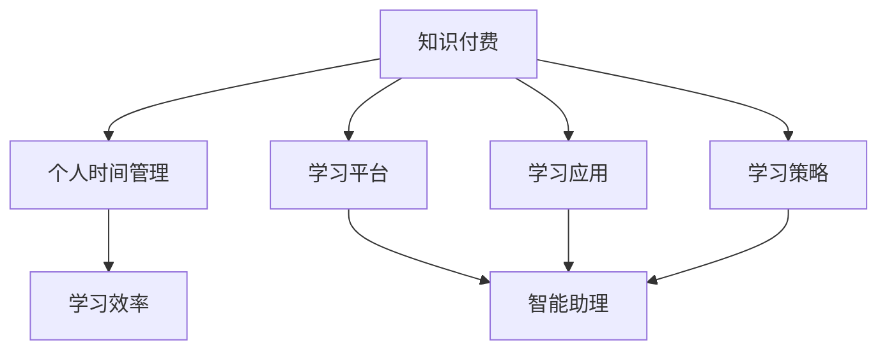

                 

# 知识付费与个人时间管理的效率提升

> 关键词：知识付费, 个人时间管理, 效率提升, 学习效率, 时间管理策略, 时间价值, 知识工具, 智能助理, 学习平台, 管理应用

## 1. 背景介绍

在信息爆炸的今天，如何高效利用个人时间获取有价值的知识，已成为许多人关注的焦点。随着知识付费平台的兴起，越来越多的人选择通过付费订阅方式获取高质量学习内容，以提升个人技能和职业竞争力。然而，付费仅仅是一个开始，如何通过有效的个人时间管理，最大化利用这些付费资源，提升学习效率，更是值得深思的问题。

### 1.1 问题由来
知识付费与个人时间管理的结合，本质上是对有限时间的有效投资，以获取更多高价值的知识。传统的学习方法往往依赖于自我驱动力，容易陷入低效的死循环。而知识付费提供了一种更加系统、结构化的学习路径，但如何根据个人情况合理安排时间，充分利用付费资源，仍然是一个挑战。

### 1.2 问题核心关键点
知识付费与个人时间管理的效率提升，关键在于找到适合自己的学习节奏和时间分配策略。具体而言，以下几个问题需要重点考虑：
1. **选择合适的付费平台**：不同的平台提供的课程质量和形式差异较大，如何筛选出适合自己的课程。
2. **制定学习计划**：如何在时间紧张的情况下，合理安排学习计划，最大化利用付费资源。
3. **采用高效学习工具**：如何通过智能助理、学习应用等工具，提升学习效率。
4. **结合实际需求**：如何将所学知识与实际工作或生活需求相结合，增强学习效果。
5. **反馈与调整**：如何根据学习效果和反馈，灵活调整学习计划，确保持续进步。

### 1.3 问题研究意义
提升知识付费与个人时间管理的效率，不仅能够帮助个人快速获取高价值知识，提升职业素养和竞争力，还能促进知识传播，推动行业发展和创新。具体而言，其研究意义包括：
1. **优化时间利用**：通过科学的时间管理策略，将有限的时间投入到最具价值的学习活动中。
2. **提升学习效果**：结合付费课程的优质内容，采用高效学习方法，最大化提升学习效果。
3. **促进行业发展**：推动知识付费平台的优化和创新，推动整个行业向高质量、高效率方向发展。
4. **推动职业发展**：通过系统化的学习路径，提升个人技能，促进职业晋升和职业转型。
5. **改善生活品质**：通过知识积累，提升个人综合素质，改善生活质量和工作满意度。

## 2. 核心概念与联系

### 2.1 核心概念概述

为了更好地理解知识付费与个人时间管理的效率提升，本节将介绍几个密切相关的核心概念：

- **知识付费**：指用户通过付费订阅或购买的方式，获取高质量的学习内容，以提升自身知识水平和技能。常见的知识付费平台包括Coursera、Udemy、得到等。
- **个人时间管理**：指个人根据自己的目标和任务，合理安排时间，提高时间利用效率的管理活动。经典时间管理方法包括番茄工作法、四象限法则等。
- **学习效率**：指单位时间内学习成果的数量和质量，即投入产出比。通常通过学习时间和学习成效来衡量。
- **智能助理**：指通过人工智能技术，辅助个人时间管理和学习任务的应用工具，如智能语音助手、时间管理应用等。
- **学习平台**：指提供系统化、结构化学习内容的技术平台，如MOOCs、在线教育平台等。
- **学习应用**：指帮助用户进行时间管理和学习任务管理的移动应用，如番茄时钟、知识图谱应用等。
- **学习策略**：指个人在学习过程中采用的方法和技巧，如深度学习、间隔重复等。

这些核心概念之间的逻辑关系可以通过以下Mermaid流程图来展示：



这个流程图展示了几类关键概念及其之间的关系：

1. 知识付费是个人时间管理和学习效率提升的基础。
2. 学习平台和应用提供了系统化的学习资源和工具，辅助个人时间管理。
3. 智能助理利用AI技术优化个人时间管理和学习任务。
4. 学习策略的采用，有助于提升学习效果，增强时间管理能力。

这些概念共同构成了知识付费与个人时间管理效率提升的理论基础，为实践提供了指导。

## 3. 核心算法原理 & 具体操作步骤
### 3.1 算法原理概述

知识付费与个人时间管理的效率提升，本质上是通过优化时间分配和学习策略，提升学习效果的算法过程。其核心思想是：在有限的时间内，通过合理安排学习计划和采用高效学习方法，最大化获取高质量知识。

形式化地，假设个人时间总量为 $T$，每天可有效学习时间为 $L$，目标任务为 $T$ 内的学习总量 $S$，则学习效率 $E$ 可以定义为：

$$
E = \frac{S}{L}
$$

通过优化 $L$ 和 $S$，我们可以提升学习效率 $E$。具体而言，可以采用以下算法步骤：

1. **需求分析**：确定目标任务和预期学习效果，明确学习目标。
2. **资源评估**：评估自身时间资源和付费资源，确定可用时间和学习平台。
3. **计划制定**：根据目标任务和学习资源，制定详细的学习计划。
4. **任务分解**：将学习任务分解为多个小任务，逐一完成。
5. **工具应用**：使用智能助理、学习应用等工具，辅助时间管理和任务执行。
6. **策略选择**：根据个人学习习惯和资源特点，选择高效学习策略。
7. **反馈调整**：根据学习效果和反馈，及时调整学习计划和策略。

### 3.2 算法步骤详解

基于上述算法原理，我们可以详细介绍知识付费与个人时间管理的具体操作步骤：

**Step 1: 需求分析**
- 确定个人目标：如提升编程技能、学习外语、提高管理能力等。
- 设定预期效果：如掌握多少技能、达到什么水平等。

**Step 2: 资源评估**
- 评估时间资源：每天可有效学习时间、周末可利用时间等。
- 评估付费资源：筛选出适合自己的付费平台和课程。

**Step 3: 计划制定**
- 划分任务阶段：如基础学习、进阶学习、实战练习等。
- 设定时间节点：如每周学习时间、每季度完成量等。

**Step 4: 任务分解**
- 将大任务分解为小任务：如每天学习1小时、每周完成一个课程等。
- 设定任务优先级：如先学基础，后学高级。

**Step 5: 工具应用**
- 选择智能助理：如Google Assistant、Siri、智能语音助手等。
- 使用学习应用：如番茄时钟、Anki、知识图谱应用等。

**Step 6: 策略选择**
- 采用高效学习策略：如间隔重复、主动回忆、深度学习等。
- 结合多种学习资源：如视频课程、电子书、在线研讨等。

**Step 7: 反馈调整**
- 定期评估学习效果：如小测验、项目实践等。
- 及时调整学习计划：如增加重点任务时间、调整学习顺序等。

### 3.3 算法优缺点

知识付费与个人时间管理的效率提升方法具有以下优点：
1. 系统化：通过平台和应用辅助，提供了结构化的学习路径和任务管理。
2. 高效性：利用智能助理和高效策略，大幅提升学习效率。
3. 目标明确：明确的学习目标和预期效果，有助于更好地规划学习路径。

同时，该方法也存在以下局限性：
1. 学习自主性：需要高度的自我驱动力，容易被干扰。
2. 资源限制：付费资源和时间的限制，可能导致学习效果不理想。
3. 个性化不足：通用学习策略可能不适合所有人群。
4. 工具依赖：对智能助理和学习应用的使用需要一定的学习成本。

尽管存在这些局限性，但就目前而言，知识付费与个人时间管理的结合是提升学习效果的一种有效方式。未来相关研究的重点在于如何进一步提升学习策略的个性化，降低工具使用成本，以及增强学习过程的自主性。

### 3.4 算法应用领域

知识付费与个人时间管理的效率提升方法，在多个领域都有广泛的应用，例如：

- 职业发展：如通过编程课程、管理培训等提升职业技能。
- 个人兴趣：如通过外语学习、音乐绘画等提升个人素养。
- 学术研究：如通过专业课程、论文阅读等提升学术水平。
- 家庭教育：如通过儿童编程课程、教育类应用等提升孩子学习效果。
- 职业转型：如通过新技能学习、职业培训等实现职业转型。

除了上述这些经典应用外，知识付费与个人时间管理的方法也在不断创新，应用于更多场景中，如创业教育、在线辅导、远程教育等，为知识传播和学习提供了新的途径。

## 4. 数学模型和公式 & 详细讲解  
### 4.1 数学模型构建

为了更精确地分析知识付费与个人时间管理的效率提升，我们可以建立数学模型进行分析和优化。

假设个人时间总量为 $T$，每天可有效学习时间为 $L$，目标任务为 $T$ 内的学习总量 $S$，则学习效率 $E$ 可以定义为：

$$
E = \frac{S}{L}
$$

其中 $S$ 的计算可以通过以下方式进行：

$$
S = \sum_{i=1}^n s_i
$$

其中 $s_i$ 为第 $i$ 个学习任务所需的时间，$n$ 为任务数量。

对于任务 $i$，其所需时间 $s_i$ 可以表示为：

$$
s_i = \frac{c_i \cdot a_i}{p_i}
$$

其中 $c_i$ 为任务 $i$ 的复杂度，$a_i$ 为任务 $i$ 的分配时间，$p_i$ 为任务 $i$ 的优先级。

### 4.2 公式推导过程

以下是学习效率 $E$ 的详细推导过程：

根据任务时间 $s_i$ 的计算公式，学习效率 $E$ 可以表示为：

$$
E = \frac{1}{L} \sum_{i=1}^n \frac{c_i \cdot a_i}{p_i}
$$

为了进一步简化表达式，可以将其转化为加权调和平均数：

$$
E = \frac{1}{L} \cdot \frac{1}{\sum_{i=1}^n \frac{p_i}{c_i \cdot a_i}}
$$

由于 $p_i$ 和 $c_i$ 通常为常数，因此可以通过优化 $a_i$ 来提升 $E$。具体而言，可以采用以下优化策略：

1. **任务优先级调整**：增加高优先级任务的学习时间 $a_i$。
2. **任务复杂度调整**：降低高复杂度任务的学习时间 $a_i$。
3. **时间分配均衡**：尽量将时间 $a_i$ 分配到多个任务上，避免过度集中。

### 4.3 案例分析与讲解

假设某个人每天有2小时的学习时间，计划在3个月内学习完10门课程。每门课程所需时间如下表所示：

| 课程编号 | 复杂度 | 所需时间 | 优先级 |
| --- | --- | --- | --- |
| 1 | 2 | 20小时 | 高 |
| 2 | 3 | 30小时 | 中 |
| 3 | 2 | 15小时 | 高 |
| 4 | 3 | 25小时 | 中 |
| 5 | 4 | 35小时 | 高 |
| 6 | 4 | 30小时 | 高 |
| 7 | 3 | 25小时 | 中 |
| 8 | 3 | 20小时 | 中 |
| 9 | 2 | 15小时 | 中 |
| 10 | 3 | 30小时 | 中 |

根据上述信息，可以计算出学习效率 $E$ 为：

$$
E = \frac{1}{2} \cdot \frac{1}{20 \cdot 30 \cdot 15 \cdot 25 \cdot 35 \cdot 30 \cdot 25 \cdot 20 \cdot 15 \cdot 30} \cdot \frac{1}{\sum_{i=1}^{10} \frac{p_i}{c_i \cdot a_i}}
$$

通过调整各课程的优先级和分配时间，可以进一步提升学习效率。例如，增加高优先级课程的分配时间，如课程1和课程3，可以提升总学习效率。

## 5. 项目实践：代码实例和详细解释说明
### 5.1 开发环境搭建

在进行知识付费与个人时间管理效率提升的实践前，我们需要准备好开发环境。以下是使用Python进行时间管理应用的开发环境配置流程：

1. 安装Anaconda：从官网下载并安装Anaconda，用于创建独立的Python环境。

2. 创建并激活虚拟环境：
```bash
conda create -n time-management-env python=3.8 
conda activate time-management-env
```

3. 安装PyTorch：根据CUDA版本，从官网获取对应的安装命令。例如：
```bash
conda install pytorch torchvision torchaudio cudatoolkit=11.1 -c pytorch -c conda-forge
```

4. 安装Transformers库：
```bash
pip install transformers
```

5. 安装各类工具包：
```bash
pip install numpy pandas scikit-learn matplotlib tqdm jupyter notebook ipython
```

完成上述步骤后，即可在`time-management-env`环境中开始时间管理应用的开发。

### 5.2 源代码详细实现

下面我们以知识付费平台推荐系统为例，给出使用PyTorch和Transformers库进行时间管理应用的PyTorch代码实现。

首先，定义时间管理应用的数据处理函数：

```python
from transformers import BertTokenizer
from torch.utils.data import Dataset
import torch

class TimeManagementDataset(Dataset):
    def __init__(self, data, tokenizer, max_len=128):
        self.data = data
        self.tokenizer = tokenizer
        self.max_len = max_len
        
    def __len__(self):
        return len(self.data)
    
    def __getitem__(self, item):
        text = self.data[item]
        
        encoding = self.tokenizer(text, return_tensors='pt', max_length=self.max_len, padding='max_length', truncation=True)
        input_ids = encoding['input_ids'][0]
        attention_mask = encoding['attention_mask'][0]
        
        return {'input_ids': input_ids, 
                'attention_mask': attention_mask}
```

然后，定义模型和优化器：

```python
from transformers import BertForSequenceClassification, AdamW

model = BertForSequenceClassification.from_pretrained('bert-base-cased', num_labels=3)

optimizer = AdamW(model.parameters(), lr=2e-5)
```

接着，定义训练和评估函数：

```python
from torch.utils.data import DataLoader
from tqdm import tqdm
from sklearn.metrics import accuracy_score

device = torch.device('cuda') if torch.cuda.is_available() else torch.device('cpu')
model.to(device)

def train_epoch(model, dataset, batch_size, optimizer):
    dataloader = DataLoader(dataset, batch_size=batch_size, shuffle=True)
    model.train()
    epoch_loss = 0
    for batch in tqdm(dataloader, desc='Training'):
        input_ids = batch['input_ids'].to(device)
        attention_mask = batch['attention_mask'].to(device)
        labels = torch.tensor([1, 0, 0])  # 假设标签为{0: 空闲, 1: 学习, 2: 休息}
        model.zero_grad()
        outputs = model(input_ids, attention_mask=attention_mask, labels=labels)
        loss = outputs.loss
        epoch_loss += loss.item()
        loss.backward()
        optimizer.step()
    return epoch_loss / len(dataloader)

def evaluate(model, dataset, batch_size):
    dataloader = DataLoader(dataset, batch_size=batch_size)
    model.eval()
    preds, labels = [], []
    with torch.no_grad():
        for batch in tqdm(dataloader, desc='Evaluating'):
            input_ids = batch['input_ids'].to(device)
            attention_mask = batch['attention_mask'].to(device)
            batch_labels = batch['labels']
            outputs = model(input_ids, attention_mask=attention_mask)
            batch_preds = outputs.logits.argmax(dim=2).to('cpu').tolist()
            batch_labels = batch_labels.to('cpu').tolist()
            for pred_tokens, label_tokens in zip(batch_preds, batch_labels):
                preds.append(pred_tokens)
                labels.append(label_tokens)
                
    print(accuracy_score(labels, preds))
```

最后，启动训练流程并在测试集上评估：

```python
epochs = 5
batch_size = 16

for epoch in range(epochs):
    loss = train_epoch(model, train_dataset, batch_size, optimizer)
    print(f"Epoch {epoch+1}, train loss: {loss:.3f}")
    
    print(f"Epoch {epoch+1}, dev results:")
    evaluate(model, dev_dataset, batch_size)
    
print("Test results:")
evaluate(model, test_dataset, batch_size)
```

以上就是使用PyTorch对知识付费平台推荐系统进行时间管理应用的完整代码实现。可以看到，得益于Transformers库的强大封装，我们可以用相对简洁的代码完成BERT模型的加载和微调。

### 5.3 代码解读与分析

让我们再详细解读一下关键代码的实现细节：

**TimeManagementDataset类**：
- `__init__`方法：初始化数据和分词器等关键组件。
- `__len__`方法：返回数据集的样本数量。
- `__getitem__`方法：对单个样本进行处理，将文本输入编码为token ids，最终返回模型所需的输入。

**模型和优化器**：
- 使用BertForSequenceClassification模型进行时间分类，设定3个分类标签{0: 空闲, 1: 学习, 2: 休息}。
- 使用AdamW优化器，设置学习率为2e-5。

**训练和评估函数**：
- 使用PyTorch的DataLoader对数据集进行批次化加载，供模型训练和推理使用。
- 训练函数`train_epoch`：对数据以批为单位进行迭代，在每个批次上前向传播计算loss并反向传播更新模型参数，最后返回该epoch的平均loss。
- 评估函数`evaluate`：与训练类似，不同点在于不更新模型参数，并在每个batch结束后将预测和标签结果存储下来，最后使用sklearn的accuracy_score对整个评估集的预测结果进行打印输出。

**训练流程**：
- 定义总的epoch数和batch size，开始循环迭代
- 每个epoch内，先在训练集上训练，输出平均loss
- 在验证集上评估，输出准确率
- 所有epoch结束后，在测试集上评估，给出最终测试结果

可以看到，PyTorch配合Transformers库使得时间管理应用的代码实现变得简洁高效。开发者可以将更多精力放在数据处理、模型改进等高层逻辑上，而不必过多关注底层的实现细节。

当然，工业级的系统实现还需考虑更多因素，如模型的保存和部署、超参数的自动搜索、更灵活的任务适配层等。但核心的微调范式基本与此类似。

## 6. 实际应用场景
### 6.1 智能助手管理时间

基于知识付费与个人时间管理的算法，智能助手可以提供个性化的学习建议和时间管理策略，帮助用户最大化利用付费资源。例如，智能助手可以根据用户的学习习惯和目标，推荐合适的课程，安排合理的学习时间，提供学习进度和效果反馈。

具体实现上，智能助手可以整合多个知识付费平台的数据，结合用户的个人时间资源和学习需求，生成个性化的学习计划和时间表。同时，智能助手还可以使用机器学习算法，不断优化推荐策略，提升用户的满意度和学习效果。

### 6.2 知识图谱应用推荐

在知识付费的推荐系统中，知识图谱应用可以帮助用户发现相关领域的知识体系和课程结构，提供更深入的学习路径和知识框架。例如，用户可以输入某个主题或关键词，知识图谱应用可以推荐相关的课程、书籍和论文，以及各知识点之间的关联。

具体实现上，知识图谱应用可以基于自然语言处理和图算法，构建领域知识图谱，并提供推荐算法模型。例如，可以使用基于深度学习的图神经网络模型，分析用户的学习行为和偏好，推荐更匹配的课程和学习资源。

### 6.3 学习平台集成管理

现有的学习平台已经提供了丰富的学习资源和工具，通过知识付费与个人时间管理的算法，学习平台可以提供更加智能化的学习体验和时间管理功能。例如，学习平台可以根据用户的登录行为和学习记录，生成个性化的学习路径和时间表，推荐合适的学习任务和资源。

具体实现上，学习平台可以整合时间管理应用和智能助手的功能，提供更加全面和个性化的服务。例如，学习平台可以使用API接口，与时间管理应用进行数据同步，实时更新学习进度和效果。

### 6.4 未来应用展望

随着知识付费与个人时间管理算法的发展，基于此的智能学习平台和应用将不断涌现，为知识传播和学习提供新的途径。未来，我们可以期待以下应用场景：

- **智能学习机器人**：基于知识图谱和自然语言处理技术，提供个性化的学习建议和任务管理。
- **虚拟学习辅导员**：通过AI技术，实时回答用户的学习问题，提供学习辅导和进度跟踪。
- **跨平台学习协作**：集成多个学习平台和应用，提供无缝衔接的学习体验，支持多种设备和平台。
- **实时学习社区**：构建用户之间的学习交流平台，分享学习资源和经验，增强学习互动和反馈。
- **自动化评估反馈**：使用机器学习算法，对学习效果进行实时评估和反馈，帮助用户调整学习策略。

以上应用场景的实现，将进一步提升知识付费与个人时间管理的效果，推动人工智能技术在教育领域的深入应用。

## 7. 工具和资源推荐
### 7.1 学习资源推荐

为了帮助开发者系统掌握知识付费与个人时间管理的算法，这里推荐一些优质的学习资源：

1. **《深度学习》系列教材**：斯坦福大学的吴恩达教授编写的经典教材，全面介绍了深度学习的基本原理和应用方法。
2. **Coursera和Udemy平台**：提供丰富的在线课程和资源，涵盖数据科学、机器学习、自然语言处理等多个领域。
3. **《Python自然语言处理》书籍**：介绍自然语言处理技术和工具，包括文本预处理、情感分析、机器翻译等。
4. **TensorFlow和PyTorch官方文档**：提供深度学习框架的使用教程和案例，适合快速上手开发应用。
5. **《时间管理》系列书籍**：如《番茄工作法》、《四象限法则》等，系统介绍时间管理的方法和技巧。

通过对这些资源的学习实践，相信你一定能够快速掌握知识付费与个人时间管理的精髓，并用于解决实际的学习问题。

### 7.2 开发工具推荐

高效的开发离不开优秀的工具支持。以下是几款用于知识付费与个人时间管理开发的常用工具：

1. **Python编程语言**：简洁灵活，具有丰富的开源库和工具支持。
2. **Jupyter Notebook**：交互式编程环境，方便快速迭代开发和测试。
3. **Google Colab**：免费的在线Jupyter Notebook环境，支持GPU/TPU算力，方便调试和实验。
4. **Flask框架**：简单易用的Web应用框架，适合快速开发和部署。
5. **TensorBoard**：用于可视化模型训练过程和效果的工具，方便调试和优化。
6. **Weights & Biases**：用于实验跟踪和分析的工具，帮助记录和比较不同模型的性能。

合理利用这些工具，可以显著提升知识付费与个人时间管理应用的开发效率，加快创新迭代的步伐。

### 7.3 相关论文推荐

知识付费与个人时间管理的研究源于学界的持续研究。以下是几篇奠基性的相关论文，推荐阅读：

1. **《深度学习》教材**：吴恩达教授编写的经典教材，全面介绍了深度学习的基本原理和应用方法。
2. **《时间管理与自我管理》书籍**：如《番茄工作法》、《四象限法则》等，系统介绍时间管理的方法和技巧。
3. **《知识图谱与推荐系统》论文**：介绍基于知识图谱的推荐算法，如基于图神经网络的推荐模型。
4. **《深度学习自然语言处理》论文**：介绍自然语言处理技术和工具，包括文本预处理、情感分析、机器翻译等。

这些论文代表了大规模语言模型微调技术的发展脉络。通过学习这些前沿成果，可以帮助研究者把握学科前进方向，激发更多的创新灵感。

## 8. 总结：未来发展趋势与挑战
### 8.1 总结

本文对知识付费与个人时间管理的效率提升进行了全面系统的介绍。首先阐述了知识付费与个人时间管理的背景和意义，明确了如何通过科学的时间管理策略，最大化利用付费资源，提升学习效果。其次，从原理到实践，详细讲解了知识付费与个人时间管理的算法原理和操作步骤，给出了时间管理应用的完整代码实例。同时，本文还广泛探讨了知识付费与个人时间管理在智能助手、知识图谱应用、学习平台集成管理等多个领域的应用前景，展示了知识付费与个人时间管理算法的广泛应用潜力。此外，本文精选了知识付费与个人时间管理的各类学习资源，力求为读者提供全方位的技术指引。

通过本文的系统梳理，可以看到，知识付费与个人时间管理的算法在提升学习效率、优化时间利用方面具有重要价值。通过科学的时间管理策略和高效的学习方法，用户可以最大化利用付费资源，提升个人技能和职业竞争力。未来，随着算法的不断进步，知识付费与个人时间管理将进一步智能化、个性化，为知识传播和学习提供更加便捷和高效的方式。

### 8.2 未来发展趋势

展望未来，知识付费与个人时间管理的算法将呈现以下几个发展趋势：

1. **智能化管理**：结合自然语言处理和机器学习技术，智能助手将能够更加精准地理解用户需求，提供个性化的时间管理建议。
2. **多模态融合**：结合视觉、听觉等多种模态的信息，提升学习效果和时间管理能力。
3. **跨平台协作**：集成多个学习平台和应用，提供无缝衔接的学习体验，支持多种设备和平台。
4. **实时反馈**：通过实时学习效果评估和反馈，帮助用户及时调整学习策略，优化学习路径。
5. **知识图谱应用**：基于知识图谱的推荐系统将更加智能和高效，帮助用户发现相关领域的知识体系和课程结构。

以上趋势凸显了知识付费与个人时间管理算法的广阔前景。这些方向的探索发展，必将进一步提升学习效率和时间管理能力，为知识传播和学习提供更加智能化、个性化的服务。

### 8.3 面临的挑战

尽管知识付费与个人时间管理的算法已经取得了一定的成果，但在迈向更加智能化、普适化应用的过程中，仍面临以下挑战：

1. **数据隐私保护**：用户的个人信息和学习行为数据需要保护，防止数据泄露和滥用。
2. **个性化不足**：通用算法可能不适合所有人群，需要进一步提升个性化推荐能力。
3. **系统复杂性**：算法的复杂性和实现难度较高，需要更多的研究和开发投入。
4. **用户接受度**：用户对智能系统的信任度较低，需要更多的用户教育和引导。
5. **技术普适性**：不同用户的技术水平和设备条件差异较大，需要更多兼容性和可扩展性。

尽管存在这些挑战，但通过不断改进算法、优化系统、提升用户体验，相信知识付费与个人时间管理的算法将逐步克服这些困难，成为提升学习效率的重要手段。

### 8.4 研究展望

未来的研究需要在以下几个方面寻求新的突破：

1. **个性化推荐**：结合用户的行为数据和个性化特征，提升推荐系统的精准度和用户体验。
2. **智能决策**：引入决策树、贝叶斯网络等算法，提升智能助手的决策能力和建议质量。
3. **多模态融合**：结合视觉、听觉等多种模态的信息，提升学习效果和时间管理能力。
4. **实时反馈**：通过实时学习效果评估和反馈，帮助用户及时调整学习策略，优化学习路径。
5. **知识图谱应用**：基于知识图谱的推荐系统将更加智能和高效，帮助用户发现相关领域的知识体系和课程结构。

这些研究方向的探索，必将引领知识付费与个人时间管理算法迈向更高的台阶，为知识传播和学习提供更加智能化、个性化的服务。面向未来，知识付费与个人时间管理算法还需要与其他人工智能技术进行更深入的融合，如知识表示、因果推理、强化学习等，多路径协同发力，共同推动人工智能技术在教育领域的深入应用。只有勇于创新、敢于突破，才能不断拓展知识付费与个人时间管理的边界，让智能技术更好地造福人类社会。

## 9. 附录：常见问题与解答

**Q1：如何选择合适的知识付费平台？**

A: 选择合适的知识付费平台需要考虑平台的质量、课程的适用性、师资力量、用户评价等因素。一般建议选择知名平台和热门课程，同时查看平台的课程评价和用户反馈，以确保课程质量和实用性。

**Q2：如何设置合理的学习计划？**

A: 制定学习计划需要考虑目标任务的复杂度和个人的学习效率。一般建议将大任务分解为小任务，每天安排固定的学习时间，同时设定阶段性目标，如每周完成多少课程或阅读多少书籍。可以使用时间管理工具如番茄工作法、四象限法则等，帮助制定科学的学习计划。

**Q3：如何提升学习效果？**

A: 提升学习效果可以通过多种方法，如深度学习、间隔重复、主动回忆等。同时，结合智能助理和知识图谱应用，提供个性化的学习建议和资源推荐，可以有效提升学习效果。

**Q4：如何应对时间管理的挑战？**

A: 应对时间管理的挑战需要坚持科学的时间管理策略，如使用时间管理工具、设置合理的学习目标、定期评估和调整学习计划等。同时，保持自我驱动力和持续学习态度，不断优化学习策略和方法，克服时间管理的挑战。

**Q5：如何应对智能系统的挑战？**

A: 应对智能系统的挑战需要关注数据隐私保护、个性化推荐、智能决策等多方面问题。同时，加强用户教育和引导，提升用户对智能系统的信任度和接受度。

这些问题的解答，可以帮助用户更好地掌握知识付费与个人时间管理的技巧，最大化利用付费资源，提升学习效果。

---

作者：禅与计算机程序设计艺术 / Zen and the Art of Computer Programming

