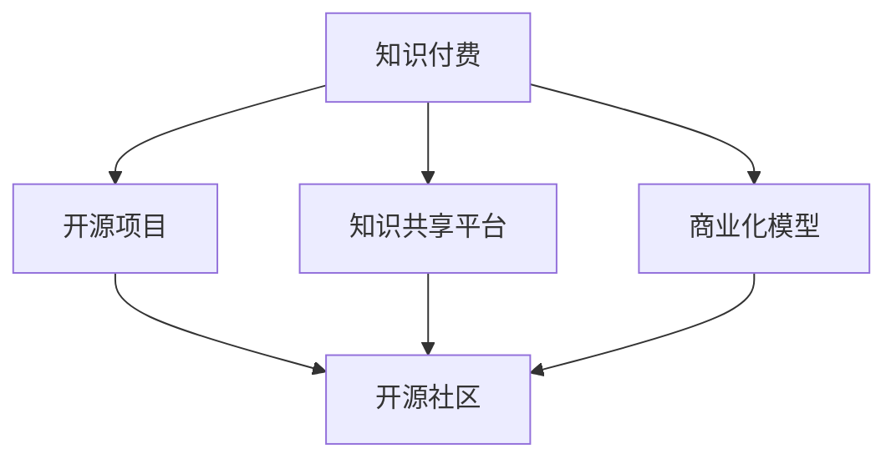

                 

# 知识付费与开源项目的结合之道

在快速发展的数字化时代，知识付费与开源项目正逐渐成为两个重要的趋势，各自有着独特的优势和价值。然而，将二者有机结合，既可以充分发挥开源项目的资源共享和协作优势，又能够通过知识付费确保知识创造者获得合理的回报，形成一个良性的知识生态。本文将从背景、核心概念、算法原理、实际应用、资源推荐以及总结等多个角度，深入探讨知识付费与开源项目的结合之道。

## 1. 背景介绍

### 1.1 问题由来

在数字化和信息爆炸的时代，知识的获取变得前所未有的便捷。一方面，互联网使得海量免费知识资源触手可及，极大地降低了知识获取的门槛。但另一方面，知识的庞杂性和筛选难度也在增加。同时，知识的生产和传播者面临的激励机制问题亟待解决。在这一背景下，知识付费和开源项目应运而生，各自探索着知识共享与知识付费的新模式。

知识付费是指用户为获取知识而支付费用的模式，它基于知识的稀缺性和价值性，旨在鼓励优质内容的创作与传播。随着知识付费平台的兴起，越来越多的高质量内容开始被付费订阅。然而，知识付费模式存在高昂的运营成本，内容创造者的收益难以得到保障，且难以覆盖更多用户。

开源项目则是一种以社区贡献为主导的协作模式，强调知识共享和共创，旨在提升软件的质量和可扩展性。开源项目通过开放的代码库和社区协作，使得更多的开发者可以参与到项目中，共同推动技术进步。然而，开源项目通常缺乏稳定的收益来源，创作者与贡献者往往难以获得相应的经济回报。

### 1.2 问题核心关键点

如何将知识付费与开源项目结合，以实现知识的高效生产与分享，同时保障创作者的经济利益，成为当前面临的核心问题。这不仅涉及技术创新，还包括商业模式、社区管理等多方面。

1. **商业模式创新**：需要找到既满足用户需求又能激励创作者创作的经济模型。
2. **技术平台建设**：需要构建能够支撑知识付费和开源项目结合的技术平台。
3. **社区和文化建设**：需要营造一种开放、共享、互惠互利的新型知识社区文化。

## 2. 核心概念与联系

### 2.1 核心概念概述

为更好地理解知识付费与开源项目的结合之道，本节将介绍几个密切相关的核心概念：

- **知识付费**：用户为获取知识而支付费用的模式，旨在通过付费激励内容创作者提供高质量、高价值的内容。
- **开源项目**：以社区贡献为主导的协作模式，强调知识共享和共创，旨在通过开放的代码库和社区协作，提升软件质量和可扩展性。
- **开源社区**：由开发者组成的社区，基于共同目标和利益，通过开源项目进行协作和贡献。
- **知识共享平台**：结合知识付费和开源项目，支持用户付费获取高质量知识，同时提供开源社区协作功能，促进知识的高效生产和分享。

这些概念之间的逻辑关系可以通过以下Mermaid流程图来展示：



这个流程图展示出知识付费与开源项目的核心概念及其之间的关系：

1. 知识付费和开源项目通过知识共享平台结合，能够更好地实现知识的高效生产和分享。
2. 开源社区是知识共享平台的重要组成部分，提供丰富的开源资源和社区协作功能。
3. 商业化模型是知识共享平台的重要组成部分，确保知识创造者获得合理的回报。

## 3. 核心算法原理 & 具体操作步骤
### 3.1 算法原理概述

知识付费与开源项目结合的核心算法原理，在于通过平台机制，将知识付费模式与开源项目协作机制相结合。其核心思想是通过知识共享平台的中间环节，将知识付费的收益分配机制与开源项目的协作机制有机整合。

具体而言，知识共享平台通过两种机制：
1. **知识付费机制**：用户通过平台付费获取高质量内容，这些内容可能来源于开源项目或其他创作者。
2. **开源项目协作机制**：开发者通过平台参与开源项目，通过贡献代码、文档等形式获得社区认可和激励。

### 3.2 算法步骤详解

知识付费与开源项目的结合，可以分为以下几个关键步骤：

**Step 1: 构建知识共享平台**
- 设计并实现一个集成了知识付费和开源项目功能的平台，支持用户付费获取知识，同时提供开源项目协作工具。
- 平台需要支持多种内容类型，如文章、代码、视频等，并提供丰富的搜索、推荐功能。

**Step 2: 设计知识付费机制**
- 确定知识付费的货币单位，如货币、积分、代币等，用户可以通过平台进行支付。
- 制定付费模式，如单次购买、订阅、按内容类型付费等。
- 设置知识付费内容的分级和质量评估机制，确保优质内容能够获得合理的价格。

**Step 3: 设计开源项目协作机制**
- 引入开源社区功能，允许开发者上传代码、文档等，并通过社区投票、评分等机制进行评估。
- 设计贡献激励机制，如社区积分、徽章等，鼓励开发者积极参与。
- 提供开源项目的版本管理、协作工具，便于开发者进行团队协作和贡献。

**Step 4: 建立收益分配机制**
- 根据用户付费和开发者贡献，设计收益分配模型。例如，可以将用户付费的特定比例作为开发者的激励。
- 引入平台运营者角色，负责平台管理和收益分配，确保公平透明。

**Step 5: 持续优化和迭代**
- 根据用户和开发者的反馈，不断优化平台功能和机制，确保平台的用户体验和开发者激励机制的有效性。
- 定期进行平台的数据分析和市场调研，及时调整策略。

### 3.3 算法优缺点

知识付费与开源项目结合的算法具有以下优点：
1. **双赢效应**：用户能够获得高质量知识，创作者能够获得合理的回报，开发者能够贡献代码并得到社区认可。
2. **增强知识生产动力**：通过付费和贡献激励，创作者和开发者更有动力提供高质量内容和技术。
3. **促进知识共享**：平台机制使得知识共享更加便捷和高效，不同背景的知识创造者可以共同协作，提升知识的丰富性和多样性。

同时，这种结合也存在一定的局限性：
1. **平台依赖度高**：平台机制需要高度依赖于技术平台的建设和管理，初期投入成本较高。
2. **市场接受度不均**：用户和开发者对知识付费与开源结合的接受度不同，需要时间和教育推广。
3. **机制设计复杂**：需要平衡用户、创作者和开发者的利益，机制设计复杂且容易引发争议。

### 3.4 算法应用领域

知识付费与开源项目的结合，已在多个领域取得实际应用，包括但不限于：

- **教育领域**：通过知识付费和开源项目结合，提供高质量的教育资源，如在线课程、文档等，同时鼓励开发者贡献教育内容。
- **软件开发**：利用开源项目和知识付费，提供高质量的开源软件和开发者工具，同时鼓励开发者共同协作开发。
- **科学研究和学术交流**：通过知识付费和开源项目，提供高质量的学术论文和研究数据，同时促进学术交流和知识共享。
- **商业应用**：结合知识付费和开源项目，提供高质量的商业解决方案和开源工具，同时确保开发者获得合理回报。

## 4. 数学模型和公式 & 详细讲解  
### 4.1 数学模型构建

本节将使用数学语言对知识付费与开源项目结合的算法进行更加严格的刻画。

设知识付费平台的用户数量为 $U$，创作者数量为 $C$，开发者数量为 $D$。设知识付费内容的价格为 $P$，开源项目的社区积分点数为 $S$，知识付费平台运营者获得的收益为 $R$。知识付费平台通过用户付费和开发者贡献，将平台收益分配给创作者和开发者，同时运营者获得平台运营费用和收益分配管理费用的总和。

### 4.2 公式推导过程

知识付费和开源项目结合的收益分配模型可以表示为：

$$
R = \alpha (P \cdot U) + \beta (S \cdot D) - \gamma \text{Costs}
$$

其中：
- $\alpha$ 为知识付费内容的用户付费比例。
- $\beta$ 为开发者贡献积分的社区激励比例。
- $\gamma$ 为平台运营成本。

在实际应用中，需要根据平台的具体情况和市场接受度，设定合适的 $\alpha$、$\beta$ 和 $\gamma$ 值。

### 4.3 案例分析与讲解

以一个在线教育平台为例，其知识付费和开源项目结合的收益分配模型可以表示为：

$$
R = \alpha (P \cdot U) + \beta (S \cdot D) - \gamma (\text{平台运营费用} + \text{平台技术维护费用})
$$

其中：
- $P$ 为在线课程的价格。
- $U$ 为购买在线课程的用户数量。
- $S$ 为开发者在开源社区中贡献代码和文档获得的积分点数。
- $D$ 为参与开源项目的开发者数量。
- $\alpha$ 为用户付费比例，假设为30%。
- $\beta$ 为开发者贡献积分激励比例，假设为10%。
- $\gamma$ 为平台运营和维护费用，假设为总收益的10%。

在这个模型中，用户通过支付课程费用获取优质教育资源，同时开发者通过贡献开源内容获得积分和社区认可。平台运营者通过知识付费和开源项目的结合，实现收益平衡。

## 5. 项目实践：代码实例和详细解释说明
### 5.1 开发环境搭建

在进行知识付费与开源项目结合的项目实践前，我们需要准备好开发环境。以下是使用Python进行Django开发的环境配置流程：

1. 安装Anaconda：从官网下载并安装Anaconda，用于创建独立的Python环境。

2. 创建并激活虚拟环境：
```bash
conda create -n django-env python=3.8 
conda activate django-env
```

3. 安装Django：从官网获取对应的安装命令。例如：
```bash
pip install django
```

4. 安装相关工具包：
```bash
pip install django-model-utils django-generic-views djangorestframework
```

5. 初始化Django项目：
```bash
django-admin startproject knowledge-shared-platform
```

6. 创建并激活Django应用：
```bash
python manage.py startapp knowledge-payment
python manage.py startapp open-source-project
```

完成上述步骤后，即可在`django-env`环境中开始开发实践。

### 5.2 源代码详细实现

这里我们以在线教育平台为例，给出使用Django框架对知识付费和开源项目结合的PyTorch代码实现。

首先，定义知识付费和开源项目的模型：

```python
from django.db import models

class Course(models.Model):
    title = models.CharField(max_length=255)
    description = models.TextField()
    price = models.DecimalField(max_digits=10, decimal_places=2)
    creator = models.ForeignKey(User, on_delete=models.CASCADE)
    
class Contribute(models.Model):
    project_name = models.CharField(max_length=255)
    code_content = models.TextField()
    contributor = models.ForeignKey(User, on_delete=models.CASCADE)
    
class Contribution(models.Model):
    course = models.ForeignKey(Course, on_delete=models.CASCADE)
    contribute = models.ForeignKey(Contribute, on_delete=models.CASCADE)
    score = models.IntegerField(default=0)
```

然后，定义知识付费和开源项目的视图：

```python
from django.shortcuts import render, redirect
from django.http import HttpResponse
from django.views.decorators.csrf import csrf_exempt

@csrf_exempt
def course_detail(request, course_id):
    course = Course.objects.get(id=course_id)
    if request.method == 'POST':
        price = request.POST.get('price')
        if price:
            course.price = price
            course.save()
            return redirect('course_detail', course_id=course.id)
    return render(request, 'course_detail.html', {'course': course})

@csrf_exempt
def contribute(request, project_name):
    contribute = Contribute.objects.create(project_name=project_name, contributor=request.user)
    if request.method == 'POST':
        code_content = request.POST.get('code_content')
        if code_content:
            Contribution.objects.create(course=course, contribute=contribute, score=5)
            contribute.code_content = code_content
            contribute.save()
            return redirect('contribute', project_name=project_name)
    return render(request, 'contribute.html', {'project_name': project_name})
```

最后，启动Django应用并测试：

```bash
python manage.py runserver
```

以上即为使用Django框架实现的知识付费与开源项目结合的基本代码实现。可以看到，通过简单的模型定义和视图开发，我们就能够实现一个基本的知识付费和开源项目结合的在线教育平台。

### 5.3 代码解读与分析

让我们再详细解读一下关键代码的实现细节：

**Course模型**：
- 定义了一个在线课程模型，包含标题、描述和价格等信息。

**Contribute模型**：
- 定义了一个开源项目贡献模型，包含项目名称和贡献者的代码内容。

**Contribution模型**：
- 定义了一个开源项目贡献评分模型，用于记录课程和贡献的评分关系。

**course_detail视图**：
- 获取指定课程的详情，并允许用户修改课程价格。

**contribute视图**：
- 允许用户参与开源项目，贡献代码并获得积分。

通过这些简单的代码实现，我们就能够构建一个基本的知识付费与开源项目结合的在线教育平台。开发者可以根据实际需求，进一步扩展平台功能，如积分系统、排行榜、社区讨论等，以实现更丰富的用户交互和开发者激励。

## 6. 实际应用场景
### 6.1 在线教育平台

知识付费与开源项目的结合，在在线教育平台的应用中尤为明显。传统的在线教育平台主要依赖于课程内容的版权销售，难以覆盖更多用户。通过知识付费和开源项目结合，平台可以提供多样化的教育资源，同时通过开源项目的社区协作机制，提升内容的丰富性和多样性。

以Coursera为例，该平台结合了知识付费和开源项目的优势，允许用户购买单门课程，同时也支持开发者上传开源的教育资源，并通过社区评分和奖励机制进行激励。用户通过平台付费获取高质量内容，同时开发者通过贡献开源资源获得社区认可和激励。

### 6.2 开源社区平台

开源社区平台如GitHub，通过知识付费和开源项目的结合，为开发者提供了一个平台，既能分享自己的开源项目，又能通过付费内容获得收益。开发者上传的代码、文档等都可以获得社区的认可和积分奖励，同时通过付费内容，开发者可以获得更多的资金支持。

以GitHub为例，该平台允许开发者上传开源项目，并通过社区积分奖励机制进行激励。用户可以通过付费订阅，获取更多的开源资源和社区互动功能。通过这种结合，开发者和用户都能从中获益。

### 6.3 科学研究平台

科学研究平台如arXiv，通过知识付费和开源项目的结合，为研究人员提供了一个平台，既能发布自己的研究成果，又能通过付费内容获得收益。研究人员上传的论文、代码等都可以获得社区的认可和积分奖励，同时通过付费内容，研究人员可以获得更多的资金支持。

以arXiv为例，该平台允许研究人员上传论文，并通过社区积分奖励机制进行激励。用户可以通过付费订阅，获取更多的科研资源和社区互动功能。通过这种结合，研究人员和用户都能从中获益。

### 6.4 未来应用展望

随着知识付费和开源项目结合的不断演进，未来在更多领域将看到其应用，为各个行业带来变革性影响。

在智慧医疗领域，结合知识付费和开源项目，可以为医疗工作者提供高质量的教育资源和科研论文，同时鼓励开发者贡献开源的医学工具和应用。

在智能制造领域，结合知识付费和开源项目，可以为工程师提供高质量的技术文档和开发工具，同时鼓励开发者共同协作开发智能制造系统。

在智慧城市治理中，结合知识付费和开源项目，可以为城市管理工作者提供高质量的城市管理方案和开源工具，同时鼓励开发者共同协作开发智慧城市应用。

此外，在企业生产、社会治理、文娱传媒等众多领域，知识付费与开源项目的结合也将不断涌现，为各行各业带来新的发展机遇。

## 7. 工具和资源推荐
### 7.1 学习资源推荐

为了帮助开发者系统掌握知识付费与开源项目的结合的理论基础和实践技巧，这里推荐一些优质的学习资源：

1. 《知识共享与付费模式》系列博文：由知识付费专家撰写，深入浅出地介绍了知识付费和开源项目的基本概念和结合模式。

2. 《开源社区建设与管理》课程：由知名开源社区维护者开设的课程，介绍开源项目的协作机制和社区管理策略。

3. 《知识付费与开源项目结合的商业模型》书籍：介绍知识付费和开源项目结合的商业模式，包括平台设计、用户激励、开发者激励等多个方面。

4. GitHub官方文档：GitHub的官方文档，提供了丰富的开源项目协作工具和社区管理功能，是实践知识付费与开源项目结合的必备资料。

5. Coursera官方文档：Coursera的官方文档，提供了丰富的在线教育平台功能和社区协作机制，是学习知识付费和开源项目结合的案例。

通过对这些资源的学习实践，相信你一定能够快速掌握知识付费与开源项目的结合的精髓，并用于解决实际的业务问题。

### 7.2 开发工具推荐

高效的开发离不开优秀的工具支持。以下是几款用于知识付费与开源项目结合开发的常用工具：

1. Django：基于Python的开源Web框架，灵活易用的ORM和模板系统，适合快速迭代研究。

2. Flask：轻量级的Web框架，简单易用，适合构建小型知识付费和开源项目平台。

3. GitHub：全球最大的开源社区平台，提供丰富的开源项目协作工具和社区管理功能。

4. GitLab：企业级开源社区平台，提供私有仓库和强大的持续集成功能，适合企业级知识共享平台。

5. Docker：容器化技术，可以方便地构建、部署和管理知识付费和开源项目平台。

合理利用这些工具，可以显著提升知识付费与开源项目结合的开发效率，加快创新迭代的步伐。

### 7.3 相关论文推荐

知识付费与开源项目的发展源于学界的持续研究。以下是几篇奠基性的相关论文，推荐阅读：

1. 《知识付费：一种新型的知识消费模式》：探讨了知识付费的基本概念和应用场景，强调了知识付费在提升知识创造者收益中的作用。

2. 《开源项目与知识付费的结合》：讨论了开源项目和知识付费结合的商业模式和机制设计，提供了具体案例分析。

3. 《基于知识付费与开源项目的教育平台》：介绍了知识付费和开源项目结合的在线教育平台设计，探讨了平台的用户激励和开发者激励机制。

4. 《知识付费与开源项目的未来展望》：讨论了知识付费和开源项目结合的未来发展趋势，强调了其对行业创新和发展的推动作用。

这些论文代表了大语言模型微调技术的发展脉络。通过学习这些前沿成果，可以帮助研究者把握学科前进方向，激发更多的创新灵感。

## 8. 总结：未来发展趋势与挑战
### 8.1 总结

本文对知识付费与开源项目的结合之道进行了全面系统的介绍。首先阐述了知识付费和开源项目的研究背景和意义，明确了结合在拓展知识共享、提升知识创造者收益方面的独特价值。其次，从原理到实践，详细讲解了知识付费与开源项目的数学模型和关键步骤，给出了实际应用中的代码实例。同时，本文还广泛探讨了结合方法在在线教育、开源社区、科学研究等多个领域的应用前景，展示了其广阔的潜力。

通过本文的系统梳理，可以看到，知识付费与开源项目的结合，正成为一种高效的知识生产和分享模式，有望在知识共享、创作者激励、社区协作等方面带来深刻变革。未来，伴随平台机制的不断优化和市场接受度的提升，知识付费与开源项目的结合必将在更多领域大放异彩。

### 8.2 未来发展趋势

展望未来，知识付费与开源项目的结合将呈现以下几个发展趋势：

1. **平台机制多样化**：未来将出现更多样化的平台机制，如多币种支付、知识订阅、社区积分等，以满足不同用户的需求和激励创作者的创作。
2. **内容类型多样化**：除了传统的文章、代码、视频等，未来将出现更多形式的内容，如AR/VR体验、虚拟会议等，提升知识获取的沉浸感和互动性。
3. **社区文化深度化**：社区文化将成为知识付费与开源项目结合的重要组成部分，通过社区管理和激励机制，营造更开放、共享、互惠互利的新型知识社区。
4. **全球化与本地化结合**：知识付费与开源项目结合将更好地服务于全球化知识共享和本地化知识获取，实现知识共享的全球化与本地化的平衡。

以上趋势凸显了知识付费与开源项目结合技术的广阔前景。这些方向的探索发展，必将进一步提升知识共享和知识创造的能力，为人类认知智能的进化带来深远影响。

### 8.3 面临的挑战

尽管知识付费与开源项目结合技术已经取得了显著进展，但在迈向更加智能化、普适化应用的过程中，仍面临诸多挑战：

1. **平台依赖度高**：平台机制需要高度依赖于技术平台的建设和管理，初期投入成本较高。
2. **市场接受度不均**：用户和开发者对知识付费与开源结合的接受度不同，需要时间和教育推广。
3. **机制设计复杂**：需要平衡用户、创作者和开发者的利益，机制设计复杂且容易引发争议。
4. **商业化难度高**：知识付费和开源项目结合的平台需要平衡创作者的创作激励和商业化的收益平衡，难度较高。

### 8.4 研究展望

面对知识付费与开源项目结合所面临的挑战，未来的研究需要在以下几个方面寻求新的突破：

1. **探索更高效的收益分配机制**：研究如何更高效地分配用户付费和开发者贡献，确保公平透明。
2. **引入更多用户和开发者激励**：通过游戏化机制、积分系统等，进一步增强用户和开发者的参与度和创作动力。
3. **加强平台的技术和社区管理**：通过技术手段和社区文化建设，提升平台的稳定性和用户满意度。
4. **拓展更多应用场景**：除了在线教育、开源社区、科学研究等领域，探索更多应用场景，如智能制造、智慧医疗等，推动知识付费与开源项目结合的广泛应用。

这些研究方向的探索，必将引领知识付费与开源项目结合技术迈向更高的台阶，为构建安全、可靠、可解释、可控的智能系统铺平道路。面向未来，知识付费与开源项目的结合技术还需要与其他人工智能技术进行更深入的融合，如知识表示、因果推理、强化学习等，多路径协同发力，共同推动知识共享和知识创造的进步。只有勇于创新、敢于突破，才能不断拓展知识付费与开源项目的边界，让知识共享和知识创造更好地服务于人类社会。

## 9. 附录：常见问题与解答
**Q1：知识付费与开源项目结合是否适用于所有知识共享场景？**

A: 知识付费与开源项目结合适用于大部分知识共享场景，尤其是对于需要高价值、高质量内容分享的场景。例如，在线教育、科研领域、企业培训等。但对于一些公开、免费的知识分享场景，如公共资料库、公共数据库等，可能不需要结合知识付费。

**Q2：知识付费与开源项目结合的商业化模型如何设定？**

A: 知识付费与开源项目结合的商业化模型需要平衡创作者、开发者和用户的利益，一般包括以下几个部分：
1. 用户付费比例：用户通过付费获取知识，具体比例需要根据平台特性和用户接受度进行设定。
2. 开发者贡献激励：通过积分、徽章等形式，激励开发者贡献开源项目和内容。
3. 平台运营成本：平台需要支付技术开发、社区管理、运营维护等费用，这部分费用需要从收益中扣除。
4. 创作者收益分配：根据用户付费和开发者贡献，合理分配收益给创作者。

**Q3：知识付费与开源项目结合的平台如何实现用户激励？**

A: 知识付费与开源项目结合的平台需要设计多种用户激励机制，如积分、徽章、排行榜等。具体实现可以通过以下方式：
1. 积分系统：用户通过付费、贡献、分享等行为获得积分，积分可用于兑换知识付费内容或社区特权。
2. 徽章系统：用户通过完成特定任务、参与社区活动等获得徽章，徽章可用于展示用户成就和身份。
3. 排行榜：用户通过积分、贡献等获得排名，排名可用于展示用户影响力。

**Q4：知识付费与开源项目结合在开发中的难点是什么？**

A: 知识付费与开源项目结合在开发中的难点主要包括以下几个方面：
1. 平台机制设计：需要平衡用户、创作者和开发者的利益，设计公平透明的收益分配机制。
2. 社区文化建设：需要营造开放、共享、互惠互利的社区文化，提升用户和开发者的参与度。
3. 技术平台搭建：需要搭建稳定、高效的技术平台，支持多种内容类型和协作功能。

**Q5：知识付费与开源项目结合的未来方向是什么？**

A: 知识付费与开源项目结合的未来方向主要包括以下几个方面：
1. 多币种支付和本地化：支持多种货币支付和本地化服务，满足不同地区用户需求。
2. 内容类型多样化：除了传统的文章、代码、视频等，支持更多形式的内容，提升用户体验。
3. 社区文化深度化：通过游戏化机制、积分系统等，进一步增强用户和开发者的参与度和创作动力。
4. 全球化与本地化结合：结合知识付费与开源项目的全球化与本地化，提升全球知识共享能力。

这些方向将推动知识付费与开源项目结合技术不断演进，为知识共享和知识创造带来更多可能性。

---

作者：禅与计算机程序设计艺术 / Zen and the Art of Computer Programming

