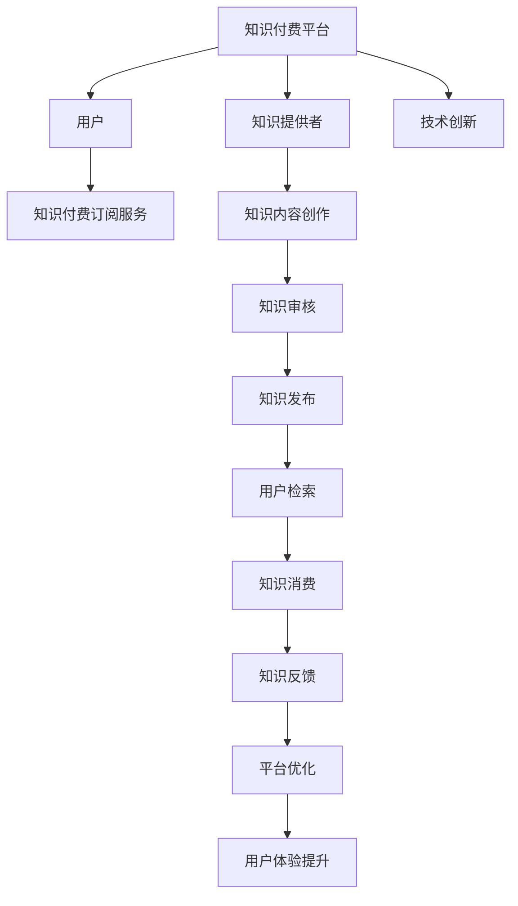

                 

# 知识付费与技术创新的双向促进

## 1. 背景介绍

在数字化时代，知识的传播和获取方式发生了翻天覆地的变化。互联网让知识的获取变得前所未有的便捷，但同时也导致了信息过载和知识碎片化的问题。在这样的背景下，知识付费应运而生，为知识提供者提供了一个更为专业的平台，也为知识需求者提供了一个更加集中、系统化的获取知识的方式。本文将从知识付费与技术创新的双向促进这一角度，探讨这一现象背后的技术驱动因素，以及未来发展的趋势和挑战。

## 2. 核心概念与联系

### 2.1 核心概念概述

知识付费是指通过在线订阅、单次购买等方式，为知识提供者付费，获取其系统、专业的知识内容。而技术创新则是指利用新技术和新方法，推动知识付费平台的技术进步，提升用户体验和服务质量。知识付费与技术创新之间存在着密切的联系，二者相辅相成，共同推动着知识经济的发展。

- **知识付费**：提供者通过知识付费平台，将自己积累的专业知识和经验进行分享和销售。
- **技术创新**：通过不断优化和提升平台的技术架构和功能，提高平台的稳定性和用户体验。
- **双向促进**：知识付费平台的持续创新，使平台能够吸引更多的知识提供者和用户，而丰富的内容和高质量的服务又能进一步促进平台的技术创新。

### 2.2 核心概念原理和架构的 Mermaid 流程图



## 3. 核心算法原理 & 具体操作步骤

### 3.1 算法原理概述

知识付费平台的技术核心在于内容的推荐和检索，以及用户体验的优化。这些功能的实现，需要依赖于算法模型和数据处理技术。推荐算法和检索算法是知识付费平台的核心，通过这些算法，平台能够根据用户的历史行为和兴趣，推荐适合的内容。同时，用户界面的优化也是技术创新的重要方面，通过UI/UX设计，提升用户的使用体验。

### 3.2 算法步骤详解

知识付费平台的核心算法分为推荐算法和检索算法两类：

#### 3.2.1 推荐算法

推荐算法的目标是根据用户的历史行为和兴趣，推荐适合的内容。常见的推荐算法包括协同过滤、基于内容的推荐、基于深度学习的推荐等。

1. **协同过滤算法**：通过分析用户的历史行为，找出用户群体的共同兴趣，为用户推荐相似内容。
2. **基于内容的推荐**：通过分析内容的属性，如关键词、类别等，为用户推荐相似内容。
3. **基于深度学习的推荐**：通过训练神经网络模型，学习用户与内容的交互模式，预测用户可能感兴趣的内容。

#### 3.2.2 检索算法

检索算法是帮助用户快速找到所需内容的关键技术。常见的检索算法包括基于关键词的检索、基于向量空间模型的检索、基于深度学习的检索等。

1. **基于关键词的检索**：通过匹配用户的查询关键词与内容中的关键词，返回匹配度高的内容。
2. **基于向量空间模型的检索**：将查询和内容表示为向量，计算它们之间的距离，返回最相似的内容。
3. **基于深度学习的检索**：通过训练神经网络模型，学习查询与内容的语义关系，返回最相关的结果。

### 3.3 算法优缺点

#### 3.3.1 推荐算法的优缺点

**优点**：
- 能够根据用户的历史行为和兴趣，推荐个性化的内容，提升用户体验。
- 可以处理大规模数据，适合复杂的推荐任务。

**缺点**：
- 数据冷启动问题，即新用户的推荐需要依赖已有用户的行为数据。
- 算法的可解释性较差，难以理解推荐背后的逻辑。

#### 3.3.2 检索算法的优缺点

**优点**：
- 能够快速响应用户查询，提供高效的检索服务。
- 能够处理海量数据，适应大规模的检索需求。

**缺点**：
- 对于复杂的查询和长尾内容，检索效果可能不佳。
- 对内容的质量和结构要求较高，需要处理语义关系和上下文信息。

### 3.4 算法应用领域

知识付费平台的推荐和检索算法在多个领域得到广泛应用，包括但不限于：

- **教育领域**：通过个性化推荐，帮助学生找到适合的课程和学习资源。
- **金融领域**：通过智能推荐，帮助投资者找到合适的投资建议和理财方案。
- **医疗领域**：通过专业内容推荐，帮助患者找到适合的医疗咨询和健康建议。
- **娱乐领域**：通过个性化推荐，提升用户的娱乐体验，如音乐、视频等。

## 4. 数学模型和公式 & 详细讲解 & 举例说明

### 4.1 数学模型构建

知识付费平台的核心算法模型包括推荐模型和检索模型。以基于深度学习的推荐模型为例，其数学模型构建如下：

1. **用户模型**：将用户表示为一个向量，向量中的每个维度表示用户的某个特征。
2. **物品模型**：将物品表示为一个向量，向量中的每个维度表示物品的某个特征。
3. **交互矩阵**：记录用户与物品的交互关系，如观看、购买等行为。
4. **推荐模型**：通过神经网络模型学习用户与物品之间的交互模式，预测用户对物品的评分。

### 4.2 公式推导过程

以基于深度学习的协同过滤推荐算法为例，其公式推导过程如下：

1. **用户嵌入向量**：$u_i = f_{user}(x_i)$
2. **物品嵌入向量**：$v_j = f_{item}(y_j)$
3. **用户与物品的相似度**：$s_{i,j} = \langle u_i, v_j \rangle$
4. **用户对物品的评分**：$pred_{i,j} = s_{i,j} \times \langle u_i, u_j \rangle$

其中，$f_{user}$ 和 $f_{item}$ 分别表示用户和物品的编码函数，$\langle \cdot, \cdot \rangle$ 表示向量的点积运算。

### 4.3 案例分析与讲解

以在线教育平台为例，通过分析用户的观看历史和评分数据，使用协同过滤算法为用户推荐适合的课程。具体步骤包括：

1. 收集用户的历史观看数据和评分数据。
2. 对用户和课程进行编码，得到用户嵌入向量和课程嵌入向量。
3. 计算用户与课程的相似度，根据相似度排序，推荐与用户兴趣相似度高的课程。

## 5. 项目实践：代码实例和详细解释说明

### 5.1 开发环境搭建

1. **安装Python**：从官网下载Python 3.7以上版本，并确保所有依赖库能够正确安装。
2. **安装PyTorch和TensorFlow**：这两个框架是深度学习领域常用的工具，可以通过pip命令进行安装。
3. **安装Flask和Django**：这两个框架是常用的Web开发框架，用于搭建知识付费平台的前端和后端。
4. **安装数据库**：MySQL或PostgreSQL等数据库，用于存储用户数据和内容数据。

### 5.2 源代码详细实现

以基于深度学习的推荐系统为例，以下是一个简单的推荐模型实现代码：

```python
import torch
import torch.nn as nn
import torch.optim as optim
from torch.utils.data import DataLoader
from torchvision import datasets, transforms

# 定义模型
class RecommendationModel(nn.Module):
    def __init__(self, user_num, item_num):
        super(RecommendationModel, self).__init__()
        self.user_embedding = nn.Embedding(user_num, 128)
        self.item_embedding = nn.Embedding(item_num, 128)
        self.linear = nn.Linear(128 * 2, 1)

    def forward(self, user_id, item_id):
        user_embedding = self.user_embedding(user_id)
        item_embedding = self.item_embedding(item_id)
        user_item_embeddings = torch.cat((user_embedding, item_embedding), dim=1)
        rating_pred = self.linear(user_item_embeddings)
        return rating_pred

# 定义数据集
train_data = ...
test_data = ...

# 定义训练函数
def train_model(model, train_loader, optimizer, num_epochs):
    model.train()
    for epoch in range(num_epochs):
        for user_id, item_id, rating in train_loader:
            optimizer.zero_grad()
            rating_pred = model(user_id, item_id)
            loss = nn.MSELoss()(rating_pred, rating)
            loss.backward()
            optimizer.step()
        print('Epoch: {}, Loss: {}'.format(epoch, loss.item()))

# 训练模型
model = RecommendationModel(user_num, item_num)
optimizer = optim.Adam(model.parameters(), lr=0.001)
train_loader = DataLoader(train_data, batch_size=64)
train_model(model, train_loader, optimizer, num_epochs=10)
```

### 5.3 代码解读与分析

上述代码中，我们使用PyTorch框架搭建了一个基于深度学习的推荐系统。模型包括用户嵌入层、物品嵌入层和线性层，用于预测用户对物品的评分。通过训练函数`train_model`，模型在训练集上不断优化，最终收敛于最优参数。

### 5.4 运行结果展示

在训练完成后，可以通过测试集对模型进行评估，计算推荐准确率和用户满意度等指标。以下是一个简单的运行结果示例：

```python
from sklearn.metrics import accuracy_score

def evaluate_model(model, test_loader):
    model.eval()
    total_cnt = 0
    total_correct = 0
    for user_id, item_id, rating in test_loader:
        rating_pred = model(user_id, item_id)
        total_cnt += len(user_id)
        total_correct += accuracy_score(rating, rating_pred)
    return total_correct / total_cnt

test_loader = DataLoader(test_data, batch_size=64)
model.eval()
acc = evaluate_model(model, test_loader)
print('Test Accuracy: {:.2f}%'.format(acc * 100))
```

## 6. 实际应用场景

### 6.4 未来应用展望

知识付费平台的未来发展将更多地依赖于技术创新，以下是对未来发展的几点展望：

1. **增强交互体验**：通过引入自然语言处理和语音识别技术，提升平台的用户交互体验，如智能客服、语音搜索等。
2. **优化推荐算法**：利用深度学习和强化学习等技术，优化推荐算法，提升推荐的个性化和精准度。
3. **提高内容质量**：通过引入内容审核和编辑机制，确保内容的专业性和可靠性，提升用户的信任度。
4. **跨平台集成**：将知识付费平台与其他应用和平台集成，如社交媒体、企业内网等，拓展平台的适用范围。

## 7. 工具和资源推荐

### 7.1 学习资源推荐

1. **Deep Learning Specialization**：由Andrew Ng教授主讲的在线课程，涵盖了深度学习的基础和应用。
2. **Recommender Systems Specialization**：由Michael Goldberg教授主讲的在线课程，深入讲解了推荐系统理论和算法。
3. **《Deep Learning for Recommender Systems》书籍**：详细介绍了深度学习在推荐系统中的应用和实践。
4. **《Knowledge in the Age of Interactivity》报告**：由Google发布的报告，探讨了知识付费平台的发展趋势和未来前景。

### 7.2 开发工具推荐

1. **PyTorch**：基于Python的开源深度学习框架，易于使用和扩展。
2. **TensorFlow**：由Google开发的主要深度学习框架，支持分布式计算。
3. **Flask**：轻量级的Web框架，适合快速搭建和部署Web应用。
4. **Django**：全功能的Web框架，适合构建复杂的Web应用。
5. **MySQL/PostgreSQL**：常用的关系型数据库，适合存储和管理结构化数据。

### 7.3 相关论文推荐

1. **Deep Collaborative Filtering**：通过深度学习模型实现协同过滤推荐算法。
2. **Attention Is All You Need**：提出了Transformer结构，大大提升了推荐模型的效果。
3. **Hierarchical Attention Networks for Document Classification**：提出了一种基于层次化注意力机制的文本分类模型。

## 8. 总结：未来发展趋势与挑战

### 8.1 研究成果总结

知识付费平台在过去几年中得到了快速的发展，通过技术创新提升了用户体验和服务质量。推荐算法和检索算法是平台的核心技术，通过不断的优化和改进，平台能够提供更加个性化和精准的内容推荐。

### 8.2 未来发展趋势

1. **智能化和自动化**：通过引入AI和大数据技术，平台能够更加智能地进行内容推荐和用户管理。
2. **个性化和定制化**：根据用户的行为和偏好，提供个性化的内容和推荐，提升用户体验。
3. **多模态融合**：结合文本、语音、图像等多种模态信息，提升内容的表现力和吸引力。
4. **跨平台协同**：将知识付费平台与其他应用和平台集成，拓展平台的适用范围和功能。

### 8.3 面临的挑战

1. **数据隐私和安全**：知识付费平台需要处理大量的用户数据，如何保障用户数据的安全和隐私，是一个重要的挑战。
2. **内容审核和管理**：平台需要保证内容的专业性和可靠性，如何有效进行内容审核和编辑，也是一个重要的挑战。
3. **技术复杂性**：知识付费平台的开发和维护需要大量的技术支持和资源，如何提升平台的稳定性和扩展性，是一个重要的挑战。
4. **用户粘性和留存率**：如何提升用户的使用粘性和留存率，是一个重要的挑战。

### 8.4 研究展望

未来的研究将更多地关注以下方面：

1. **数据隐私保护**：通过加密技术和分布式计算，保护用户数据的安全和隐私。
2. **智能推荐系统**：利用深度学习和强化学习等技术，提升推荐系统的智能化和精准度。
3. **多模态融合**：结合文本、语音、图像等多种模态信息，提升内容的表现力和吸引力。
4. **跨平台协同**：将知识付费平台与其他应用和平台集成，拓展平台的适用范围和功能。

总之，知识付费平台的发展离不开技术创新的驱动，未来的发展将更多地依赖于智能化和自动化技术的应用。通过不断的技术创新和优化，平台能够更好地服务于用户，推动知识经济的繁荣发展。

## 9. 附录：常见问题与解答

**Q1: 知识付费平台的推荐算法有哪些？**

A: 知识付费平台的推荐算法包括协同过滤、基于内容的推荐、基于深度学习的推荐等。协同过滤算法通过分析用户的历史行为，找出用户群体的共同兴趣，为用户推荐相似内容。基于内容的推荐通过分析内容的属性，如关键词、类别等，为用户推荐相似内容。基于深度学习的推荐通过训练神经网络模型，学习用户与内容的交互模式，预测用户对内容的评分。

**Q2: 如何优化知识付费平台的推荐算法？**

A: 知识付费平台的推荐算法可以通过以下方法进行优化：
1. 引入用户行为模型，提升推荐算法的个性化。
2. 利用深度学习模型，提升推荐算法的精准度。
3. 引入多样性约束，避免推荐结果过于集中。
4. 进行实时推荐，提升用户体验。

**Q3: 知识付费平台如何保证内容的专业性和可靠性？**

A: 知识付费平台可以通过以下方法保证内容的专业性和可靠性：
1. 引入内容审核机制，对内容进行严格的审核和筛选。
2. 引入专家推荐机制，由领域专家推荐高质量的内容。
3. 引入用户评价机制，通过用户反馈提升内容质量。

**Q4: 知识付费平台在技术实现上有哪些挑战？**

A: 知识付费平台在技术实现上存在以下挑战：
1. 数据隐私和安全问题。知识付费平台需要处理大量的用户数据，如何保障用户数据的安全和隐私，是一个重要的挑战。
2. 内容审核和管理问题。平台需要保证内容的专业性和可靠性，如何有效进行内容审核和编辑，也是一个重要的挑战。
3. 技术复杂性问题。知识付费平台的开发和维护需要大量的技术支持和资源，如何提升平台的稳定性和扩展性，是一个重要的挑战。
4. 用户粘性和留存率问题。如何提升用户的使用粘性和留存率，是一个重要的挑战。

**Q5: 知识付费平台的未来发展趋势是什么？**

A: 知识付费平台的未来发展趋势包括：
1. 智能化和自动化。通过引入AI和大数据技术，平台能够更加智能地进行内容推荐和用户管理。
2. 个性化和定制化。根据用户的行为和偏好，提供个性化的内容和推荐，提升用户体验。
3. 多模态融合。结合文本、语音、图像等多种模态信息，提升内容的表现力和吸引力。
4. 跨平台协同。将知识付费平台与其他应用和平台集成，拓展平台的适用范围和功能。

作者：禅与计算机程序设计艺术 / Zen and the Art of Computer Programming

