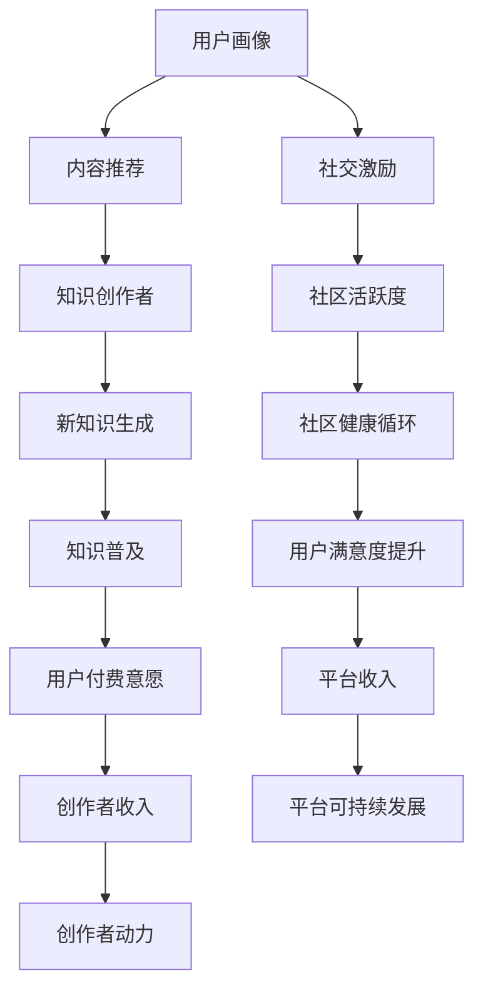

                 

# 知识付费与技术社区运营:程序员的双向互动

## 1. 背景介绍

### 1.1 问题由来

在过去的几年中，知识付费和在线技术社区逐渐成为新的增长点。无论是“得到”、“喜马拉雅”等平台的兴起，还是CSDN、Stack Overflow等技术社区的繁荣，都反映出人们对高质量知识的需求日益增长。然而，这些平台的背后运作机制是什么？如何真正实现知识与技术的双向互动？本文将从知识付费和社区运营的双重维度，探索程序员的双向互动模式。

### 1.2 问题核心关键点

知识付费与技术社区运营的核心在于如何高效匹配知识供给与需求，最大化双方的价值。具体来说：

- 知识付费平台如何合理定价，吸引优质知识创作者，同时满足广大用户的知识需求？
- 技术社区如何构建生态，激励开发者分享经验，同时帮助新手快速成长？
- 如何平衡知识创作者与技术社区之间的利益，促成可持续发展的良性循环？

本文将从核心概念、算法原理、操作步骤、数学模型、项目实践、应用场景、工具和资源推荐等多个方面，详细阐述这些问题及其解决方案。

## 2. 核心概念与联系

### 2.1 核心概念概述

为更好地理解知识付费与技术社区运营模式，本节将介绍几个关键概念及其相互联系：

- **知识付费**：指用户通过支付一定的费用，获取专业知识和技能培训的过程。常见的知识付费形式包括订阅、单次购买、私密咨询等。
- **在线技术社区**：指在线平台上开发者共享知识、讨论问题、交流经验的社区，如Stack Overflow、GitHub、CSDN等。
- **双向互动**：指知识创作者与消费者、开发者与新手之间的双向交流和互动，形成知识共享的良性循环。
- **内容推荐**：指通过算法匹配用户的兴趣和需求，推送相关知识内容的过程。
- **社交激励**：指通过积分、徽章、排行榜等机制，激励用户在社区中积极贡献知识、参与讨论。
- **用户画像**：指基于用户行为数据构建的个性化用户模型，用于推荐和推荐系统的优化。

这些核心概念通过知识付费和社区运营的桥梁——用户画像，实现了信息的高效流通和匹配，促进了技术社区和知识付费生态的蓬勃发展。

### 2.2 核心概念原理和架构的 Mermaid 流程图(Mermaid 流程节点中不要有括号、逗号等特殊字符)



该图展示了用户画像如何通过内容推荐、社交激励等机制，促进知识创作者与社区用户之间的双向互动，最终实现平台和创作者的共赢发展。

## 3. 核心算法原理 & 具体操作步骤
### 3.1 算法原理概述

知识付费与技术社区运营的算法原理，主要基于推荐系统和社交网络两大核心技术。通过机器学习算法，构建用户画像和知识图谱，实现内容与用户的智能匹配和推荐。

### 3.2 算法步骤详解

**Step 1: 构建用户画像**
- 收集用户行为数据，如浏览记录、搜索记录、购买记录等。
- 使用协同过滤、内容推荐、标签分析等技术，构建用户兴趣模型。
- 将用户画像与知识图谱进行匹配，识别出用户感兴趣的内容类型和创作者。

**Step 2: 内容推荐系统**
- 使用基于内容的推荐算法（如TF-IDF、BM25）和基于协同过滤的推荐算法（如ALS、SVD）。
- 根据用户画像，预测用户对各个内容的兴趣度。
- 按照兴趣度排序，向用户推荐最相关的内容。

**Step 3: 社交激励机制**
- 设计积分、徽章、排行榜等社交激励机制。
- 激励用户积极贡献知识，参与社区讨论，提高社区活跃度。
- 引入专家评选、用户投票等机制，确保评选的公正性和权威性。

**Step 4: 持续优化与迭代**
- 定期更新用户画像和知识图谱，保证推荐的准确性。
- 根据用户反馈和行为数据，优化推荐算法和社交激励机制。
- 引入A/B测试等技术，不断迭代和优化产品功能。

### 3.3 算法优缺点

知识付费与技术社区运营的推荐算法和社交激励机制具有以下优点：
1. 个性化推荐：通过用户画像和知识图谱，提供高度个性化的内容推荐，提高用户满意度和留存率。
2. 社区活跃度：社交激励机制可以大幅提升社区的活跃度和参与度，形成积极的社区氛围。
3. 知识传播：通过推荐系统，帮助优质知识内容更广泛传播，促进知识普及。

同时，该方法也存在一些局限性：
1. 数据隐私：用户画像和知识图谱的构建需要大量用户数据，数据隐私和安全问题不容忽视。
2. 算法偏见：推荐算法可能受到训练数据偏见的影响，导致推荐结果的偏差。
3. 动态变化：用户兴趣和需求可能随时间变化，推荐系统需要不断适应和更新。
4. 用户参与度：用户可能缺乏参与热情，导致社交激励机制的效果有限。

尽管存在这些局限性，但通过合理的算法设计和用户激励，知识付费和社区运营可以最大化双方的价值，促进技术交流和知识传播。

### 3.4 算法应用领域

知识付费与技术社区运营的推荐算法和社交激励机制，广泛应用于以下领域：

- 在线教育平台：如Coursera、Udemy等，通过推荐系统，帮助用户快速找到合适的课程。
- 技术博客和论坛：如Medium、Stack Overflow等，通过社交激励机制，激励开发者分享经验和问题。
- 企业内部培训系统：如Confluence、Atlassian等，通过知识图谱和推荐系统，实现企业内部知识的沉淀和共享。

这些领域的应用展示了知识付费与技术社区运营在知识传播、技能培训、技术交流等方面的巨大潜力。

## 4. 数学模型和公式 & 详细讲解 & 举例说明

### 4.1 数学模型构建

知识付费与技术社区运营的推荐算法和社交激励机制，涉及用户画像、协同过滤、内容推荐等多个数学模型。本节将从这些方面进行详细讲解。

**用户画像**
- 用户画像$P_u$：由用户的浏览记录、搜索记录、购买记录等组成，形式为向量。
- 用户画像与知识图谱的匹配度$M$：表示用户画像与知识内容的相似度，通常通过余弦相似度或Jaccard相似度计算。

**协同过滤**
- 协同过滤算法：基于用户的相似度和物品的相似度，进行推荐。形式化地，设$u$为用户，$i$为物品，$U$为用户集合，$I$为物品集合，$R$为用户-物品评分矩阵，$R_{ui}$表示用户$u$对物品$i$的评分。协同过滤算法的目标是最小化用户对推荐物品的评分差距。

**内容推荐**
- 基于内容的推荐算法：使用文本特征提取技术（如TF-IDF、BM25），将物品转换为向量表示。形式化地，设$v_i$为物品$i$的特征向量，$V$为物品特征向量集合，$T$为用户兴趣向量，则推荐系统目标为最大化用户对推荐物品的评分。

### 4.2 公式推导过程

**用户画像与知识图谱匹配度计算**
$$
M = \cos(\theta) = \frac{\sum_{i} P_{ui} \cdot v_i}{\sqrt{\sum_{i} P_{ui}^2} \cdot \sqrt{\sum_{i} v_i^2}}
$$

**协同过滤推荐算法**
$$
\min_{\hat{R}} \sum_{(u,i) \in U \times I} \frac{1}{2} (R_{ui} - \hat{R}_{ui})^2
$$

**基于内容推荐算法**
$$
\min_{\hat{R}} \sum_{(u,i) \in U \times I} \frac{1}{2} (R_{ui} - \hat{R}_{ui})^2
$$

**社交激励机制**
- 积分系统：设$G$为用户积分，$W$为积分权重，用户通过回答问题、发表文章等方式获得积分。积分系统目标为最大化社区活跃度。
- 徽章系统：设$B$为用户徽章，通过获得特定积分或达到特定贡献度，用户可获得徽章。徽章系统目标为激励用户持续贡献。
- 排行榜系统：设$R$为用户排行榜，通过积分、贡献度等综合排名，用户可获得排行榜位置。排行榜系统目标为提升社区权威性和用户动力。

### 4.3 案例分析与讲解

以Stack Overflow为例，分析其推荐算法和社交激励机制的设计和应用。

**推荐算法**
- 使用协同过滤算法，基于用户的行为数据，推荐相关问题。
- 通过标签系统（Tags）和用户画像，推荐相似问题。
- 利用知乎等社区的推荐算法，推荐高质量答案。

**社交激励机制**
- 通过徽章系统，激励用户积极回答问题，获得特定徽章。
- 通过排行榜系统，提升社区权威性，激励用户持续贡献。
- 引入专家评选和用户投票机制，确保评选的公正性和权威性。

Stack Overflow的成功在于其推荐系统和社交激励机制的设计和优化，促进了社区知识的传播和积累。

## 5. 项目实践：代码实例和详细解释说明
### 5.1 开发环境搭建

进行知识付费与技术社区运营的项目实践，需要先搭建好开发环境。以下是Python环境搭建的步骤：

1. 安装Python：从官网下载并安装最新版本的Python。
2. 安装虚拟环境管理工具：使用pip安装virtualenv或conda，创建虚拟环境，避免环境冲突。
3. 安装所需库：安装Flask、TensorFlow、Scikit-Learn等库，进行推荐系统和社交激励系统的开发。

### 5.2 源代码详细实现

以下是一个简单的知识推荐系统的代码实现，展示如何使用TensorFlow实现协同过滤算法。

```python
import tensorflow as tf
from tensorflow.keras.layers import Dense, Input
from tensorflow.keras.models import Model

# 定义协同过滤模型的输入层和输出层
user_input = Input(shape=(1,), name='user_input')
item_input = Input(shape=(1,), name='item_input')
user_item_matrix = tf.keras.layers.Concatenate(name='concatenate')([user_input, item_input])
hidden_layer = Dense(10, activation='relu', name='hidden_layer')(user_item_matrix)
prediction = Dense(1, activation='sigmoid', name='prediction')(hidden_layer)

# 定义协同过滤模型的损失函数和优化器
loss_fn = tf.keras.losses.BinaryCrossentropy(from_logits=True)
optimizer = tf.keras.optimizers.Adam()

# 定义协同过滤模型
model = Model(inputs=[user_input, item_input], outputs=prediction)
model.compile(optimizer=optimizer, loss=loss_fn)

# 训练协同过滤模型
model.fit(user_data, item_data, epochs=10, batch_size=32)
```

### 5.3 代码解读与分析

**用户输入和物品输入**
- 用户输入和物品输入均采用one-hot编码，表示用户的ID和物品ID。
- 通过concatenate层，将用户输入和物品输入进行拼接。

**隐藏层和预测层**
- 隐藏层使用10个神经元，ReLU激活函数，用于特征提取。
- 预测层使用sigmoid激活函数，输出预测值，表示用户对物品的评分。

**损失函数和优化器**
- 使用二分类交叉熵损失函数，适应预测值的范围在0-1之间的场景。
- 使用Adam优化器，适应梯度计算的复杂性，加快模型收敛速度。

**模型训练**
- 使用fit方法，输入用户数据和物品数据，设定训练轮数和批量大小，进行模型训练。
- 训练过程中，模型将学习用户对物品的评分规律，生成推荐列表。

## 6. 实际应用场景

### 6.1 智能教育

在智能教育领域，知识付费与技术社区运营能够显著提升教育质量和教学效果。通过推荐系统，帮助学生找到最适合自己的学习资源；通过社交激励机制，激励学生和教师积极参与讨论，形成良好的学习氛围。

**实际应用案例**
- Coursera平台：通过推荐系统和社交激励，提升在线课程的学习效果，帮助学生快速掌握知识。
- EdX平台：通过知识付费和社区互动，提高教学质量，促进知识的传播和积累。

### 6.2 软件开发

在软件开发领域，知识付费与技术社区运营能够加速技术交流和知识共享。通过推荐系统，帮助开发者找到最合适的解决方案；通过社交激励机制，激励开发者积极分享经验和问题。

**实际应用案例**
- GitHub平台：通过推荐系统和社交激励，加速技术交流和代码分享，促进开源项目的繁荣。
- Stack Overflow平台：通过知识付费和社区互动，加速技术问题的解决，提升开发效率。

### 6.3 企业培训

在企业培训领域，知识付费与技术社区运营能够提高员工的知识水平和技能。通过推荐系统，帮助员工找到最合适的培训资源；通过社交激励机制，激励员工积极参与培训，提升团队整体能力。

**实际应用案例**
- 腾讯内部培训平台：通过推荐系统和社交激励，提高内部培训效果，促进员工技能提升。
- 阿里巴巴内部培训平台：通过知识付费和社区互动，提升培训质量和员工满意度。

## 7. 工具和资源推荐
### 7.1 学习资源推荐

为帮助开发者系统掌握知识付费与技术社区运营的理论基础和实践技巧，以下推荐一些优质的学习资源：

1. 《推荐系统实战》一书：深入浅出地介绍了推荐系统的原理和实践，提供了大量的代码示例。
2. 《Python数据科学手册》一书：全面介绍了Python在数据科学领域的应用，包括推荐系统、社交网络等。
3. 《深度学习入门》一书：详细讲解了深度学习在推荐系统中的应用，提供了大量的代码实现。
4. Coursera《推荐系统》课程：斯坦福大学开设的推荐系统课程，提供了理论和实践相结合的学习内容。
5. Udacity《推荐系统》课程：Udacity的推荐系统课程，详细讲解了推荐算法和优化方法。

通过这些资源的学习实践，相信你一定能够快速掌握知识付费与技术社区运营的理论基础和实践技巧，并在实际项目中加以应用。

### 7.2 开发工具推荐

高效的开发离不开优秀的工具支持。以下是几款用于知识付费与技术社区运营开发的常用工具：

1. TensorFlow：开源深度学习框架，支持高效的分布式计算和模型训练。
2. PyTorch：开源深度学习框架，支持动态计算图和高效模型构建。
3. Flask：轻量级的Web框架，支持快速开发API接口和推荐系统。
4. Scikit-Learn：开源机器学习库，支持高效的特征提取和模型训练。
5. Jupyter Notebook：交互式Python环境，支持代码编写和结果展示。

合理利用这些工具，可以显著提升知识付费与技术社区运营的开发效率，加快创新迭代的步伐。

### 7.3 相关论文推荐

知识付费与技术社区运营的研究源于学界的持续研究。以下是几篇奠基性的相关论文，推荐阅读：

1. Koren, Y. (2008). "Collaborative Filtering for Implicit Feedback Datasets." International Conference on Machine Learning (ICML).
2. He, X., & Koren, Y. (2010). "Interest-aware matrix factorization." Proceedings of the 17th ACM SIGKDD international conference on Knowledge discovery and data mining.
3. Karpoff, J. M., & Corral, E. (2020). "Recommender Systems." arXiv preprint arXiv:2009.05503.
4. Baltrunas, A., & Dmochowski, J. (2015). "Engaging social learning networks: Self-regulated learning and reward mechanism design." Computing Education 2015, Proceedings of the ACM Conference on Computer Science Education Specialty Track, 51-58.
5. Kumar, V., & Maheswaranathan, P. (2016). "Adaptive Learning Ecosystems." ACM Computing Surveys, 49(2), 8.

通过对这些资源的学习，可以更好地理解和应用知识付费与技术社区运营的推荐算法和社交激励机制。

## 8. 总结：未来发展趋势与挑战
### 8.1 总结

本文对知识付费与技术社区运营模式进行了全面系统的介绍。首先阐述了知识付费和社区运营的核心概念，明确了推荐系统、社交激励、用户画像等关键组件之间的联系。其次，从算法原理到具体操作步骤，详细讲解了知识付费与技术社区运营的实现过程，包括用户画像的构建、协同过滤算法的应用、社交激励机制的设计等。最后，通过实际应用场景和工具资源推荐，展示了知识付费与技术社区运营的广泛应用和潜力。

通过本文的系统梳理，可以看到，知识付费与技术社区运营模式通过推荐系统和社交激励机制，实现了知识创作者与消费者、开发者与新手之间的双向互动，提升了知识传播和技能培训的效果。未来，随着推荐算法和社交网络的进一步发展，知识付费与技术社区运营将更加智能化、普适化，为技术交流和知识传播带来更多新的突破。

### 8.2 未来发展趋势

展望未来，知识付费与技术社区运营技术将呈现以下几个发展趋势：

1. 个性化推荐系统的普及：通过不断优化推荐算法和用户画像，推荐系统将更加智能化，推荐结果将更加精准，用户体验将更加满意。
2. 社交激励机制的多样化：除了积分、徽章、排行榜等传统机制，未来将涌现更多创新的激励方式，如众包任务、社区投票等，进一步提升用户参与度。
3. 知识付费模式的创新：未来的知识付费模式将更加多元化，如按需定制、按效果付费等，满足不同用户的需求。
4. 社区生态的开放化：知识付费与技术社区运营将更加开放，跨平台、跨领域的内容共享和互动将更加频繁，形成更广泛的知识共享网络。
5. 实时推荐和动态更新：推荐系统将更加实时化，能够根据用户即时行为进行动态更新和推荐，提升用户体验。

以上趋势展示了知识付费与技术社区运营技术的广阔前景，预示着未来知识传播和技能培训将更加高效、智能、普适。

### 8.3 面临的挑战

尽管知识付费与技术社区运营技术已经取得了一定进展，但在迈向更加智能化、普适化应用的过程中，仍面临诸多挑战：

1. 数据隐私和安全：知识付费和社区运营需要大量的用户数据，如何保护用户隐私和数据安全是一个重要问题。
2. 推荐算法的公正性：推荐算法可能受到训练数据偏见的影响，导致推荐结果的偏差。如何设计公平、公正的推荐算法是一个重要课题。
3. 社交激励机制的有效性：社交激励机制需要持续优化，才能激发用户参与热情，提升社区活跃度。
4. 知识付费模式的可持续性：如何设计可持续的知识付费模式，既能满足用户需求，又能保证创作者和平台的利益，是一个挑战。
5. 跨平台协同问题：不同平台之间的知识共享和互动，存在诸多技术和标准问题，需要多方协作解决。

解决这些挑战，需要多方协同努力，共同推动知识付费与技术社区运营技术的成熟和应用。

### 8.4 研究展望

面对知识付费与技术社区运营技术面临的挑战，未来的研究需要在以下几个方面寻求新的突破：

1. 推荐算法的优化：继续探索新的推荐算法和特征提取方法，提升推荐系统的准确性和公正性。
2. 社交激励机制的创新：设计更多创新的社交激励方式，提升用户参与度和社区活跃度。
3. 知识付费模式的创新：探索新的知识付费模式，如按需定制、按效果付费等，满足不同用户的需求。
4. 隐私保护和数据安全：设计隐私保护机制，保护用户数据安全和隐私。
5. 跨平台协同：推动不同平台之间的知识共享和互动，提升知识的传播和应用效果。

这些研究方向的探索，必将引领知识付费与技术社区运营技术迈向更高的台阶，为技术交流和知识传播带来更多新的突破。只有勇于创新、敢于突破，才能不断拓展知识付费与技术社区运营技术的边界，让知识传播和技能培训更加高效、智能、普适。

## 9. 附录：常见问题与解答

**Q1：知识付费平台如何吸引优质创作者？**

A: 知识付费平台可以通过以下方式吸引优质创作者：
1. 高额分成比例：提高创作者的分成比例，激励创作者创造优质内容。
2. 版权保护：提供完善的版权保护机制，保护创作者的知识产权。
3. 平台资源支持：提供流量推荐、用户互动等平台资源支持，帮助创作者提升知名度。
4. 创作者培训：提供创作培训和课程，帮助创作者提升创作水平。

**Q2：如何提高社区的活跃度？**

A: 提高社区活跃度的关键在于激励用户积极参与和互动。可以采用以下方式：
1. 积分系统：通过积分奖励用户回答问题、发表文章等行为。
2. 徽章系统：通过徽章奖励用户达到特定贡献度。
3. 排行榜系统：通过排行榜提升用户排名和知名度。
4. 用户投票：引入用户投票机制，评选最佳答案或文章。

**Q3：如何平衡知识创作者与社区之间的利益？**

A: 平衡知识创作者与社区之间的利益，需要设计合理的分成机制和激励机制。可以采用以下方式：
1. 创作者分成比例：提高创作者的分成比例，激励创作者创造优质内容。
2. 平台资源支持：提供流量推荐、用户互动等平台资源支持，帮助创作者提升知名度。
3. 社区支持：社区用户通过提问、点赞、评论等方式支持创作者，提升其影响力。

**Q4：推荐算法如何克服数据偏见？**

A: 推荐算法可以通过以下方式克服数据偏见：
1. 多样性采样：在训练数据中加入多样性采样，减少数据偏见的影响。
2. 公平性约束：引入公平性约束，确保推荐算法在各个用户群体之间公平。
3. 透明性：增加推荐算法的透明度，用户可以了解推荐结果的生成过程。

**Q5：如何保护用户数据隐私？**

A: 保护用户数据隐私，可以采用以下方式：
1. 数据加密：对用户数据进行加密处理，防止数据泄露。
2. 数据匿名化：对用户数据进行匿名化处理，保护用户隐私。
3. 权限控制：限制用户数据的访问权限，确保数据安全。

通过这些措施，可以保护用户数据隐私，提升用户信任和满意度，推动知识付费与技术社区运营技术的可持续发展。

---

作者：禅与计算机程序设计艺术 / Zen and the Art of Computer Programming

